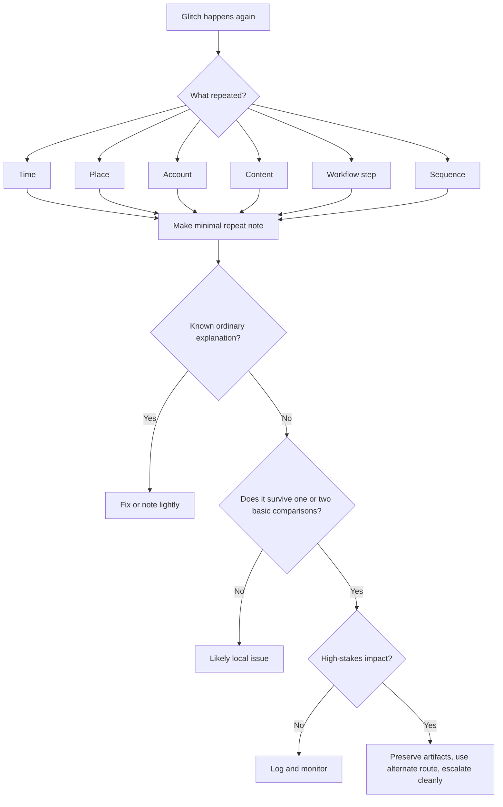

# 🎛 When A Glitch Repeats

**First created:** 2026-06-03 | **Last updated:** 2026-06-03  
*How to move from “that was weird” to “this has a repeatable shape.”*

---

## 🌱 Purpose

One glitch is usually just a glitch.

A button sticks.  
A page times out.  
A file upload fails.  
A message does not arrive.  
A login loops once.  
A form behaves like it has had a long day and does not wish to be perceived.

Most digital weirdness has boring causes.

But sometimes the same kind of failure comes back.

Same time.  
Same account.  
Same file.  
Same topic.  
Same deadline.  
Same workflow step.  
Same person.  
Same route.  
Same oddly precise moment.

That is when the question changes.

Not:

```text
Who is doing this?
```

But:

```text
What exactly is repeating?
```

This node is for the first step into recurrence discipline: recognising when a glitch has stopped being a single incident and started behaving like a pattern.

The aim is not to prove intent from repetition alone.

The aim is to make the repetition legible.

---

## 🧭 What This Node Is For

Use this node when something has happened more than once and you need to decide whether it is:

* ordinary recurrence;
* a local technical fault;
* a workflow issue;
* account-specific obstruction;
* content-specific failure;
* deadline-linked disruption;
* or a pattern worth logging properly.

This node is especially useful when the problem affects:

* uploads;
* messages;
* calls;
* login or MFA;
* records;
* forms;
* payments;
* evidence;
* legal, medical, safeguarding, complaint, academic, employment, or institutional workflows.

This is not the place to declare certainty.

This is the place to slow down enough that the record becomes useful.

---

## 🧰 Start With The Boring Possibilities

A repeated glitch can still have an ordinary cause.

Before treating repetition as meaningful, check whether the system is failing for a boring, documented, or proportionate reason.

Common causes include:

* scheduled maintenance;
* app updates;
* expired sessions;
* browser cache problems;
* stale cookies;
* password-manager autofill loops;
* MFA timing issues;
* router lease renewal;
* weak signal;
* VPN reconnects;
* DNS issues;
* device sleep settings;
* file size limits;
* attachment type restrictions;
* server-side throttling;
* peak traffic;
* institutional IT rules;
* rate limits;
* spam filters;
* security filters.

Try simple checks first:

```text
same action + different browser
same action + different device
same action + different network
same action + different account
same file + renamed copy
same file + smaller version
same action + different time
```

Do not change everything at once.

If you change ten variables, you may solve the problem — but lose the ability to understand what happened.

---

## 🎛 What Makes Repetition Useful?

A repeat is useful when it has a recognisable feature.

“Things keep going wrong” is emotionally true, but hard to use.

“This upload fails at 99% whenever I submit evidence PDFs through this portal between 09:00 and 09:30” is much stronger.

A useful pattern usually has at least one of these:

### 🗓️ Time

The same thing happens at a similar:

* time of day;
* day of week;
* interval after posting;
* interval before a deadline;
* stage in a monthly cycle;
* point after contacting a person or institution.

Example:

```text
Login loops begin within fifteen minutes of submitting a complaint update.
```

### 📍 Place

The issue happens in a similar:

* room;
* building;
* workplace;
* public venue;
* transport route;
* neighbourhood;
* Wi-Fi network;
* mobile coverage area.

Example:

```text
Calls with adviser cut out in the same building, but other calls work normally.
```

### 🔑 Account

The failure follows:

* one login;
* one email address;
* one phone number;
* one profile;
* one institutional account;
* one recovery route.

Example:

```text
Main account loops MFA across two devices, but secondary account works on the same browser and network.
```

### 📂 Content

The issue appears around:

* certain filenames;
* certain topics;
* certain recipients;
* certain file types;
* legal material;
* medical material;
* safeguarding material;
* complaint material;
* evidence bundles;
* public posts;
* specific links or phrases.

Example:

```text
Uploads fail only when the filename contains the case reference.
```

### 🧩 Workflow Step

The failure happens at the same point in a process.

Example:

```text
The form accepts all fields, uploads the document, then fails only at final submission.
```

That matters because the system is not generally broken. It is breaking at a specific gate.

### 🔁 Sequence

Several failures happen in the same order.

Example:

```text
Wi-Fi drops, upload fails, login expires, then message to adviser does not send.
```

Sequence patterns are often more useful than single symptoms because they show choreography.

The question becomes:

```text
Does the system keep failing in the same order?
```

---

## 🧪 One Glitch, Repeat, Pattern

Use this simple distinction.

### One glitch

A single incident.

```text
The page timed out once.
```

Action:

* try one ordinary fix;
* note only if high-stakes;
* move on if resolved.

### Repeat

The same kind of thing happens again.

```text
The page timed out again during the same upload route.
```

Action:

* start noting time, device, account, network, file, and context;
* compare against ordinary causes.

### Pattern suspected

The repetition survives basic comparison.

```text
The same upload fails at the same stage across browser, device, and network, only with evidence PDFs, near a deadline.
```

Action:

* make a structured recurrence log;
* preserve artifacts;
* use alternate route if high-stakes;
* escalate cleanly if impact warrants it.

---

## 🧾 The First Question: What Repeated?

When a glitch repeats, write this before anything else:

```text
What repeated?
```

Then answer in plain language.

Good answers:

```text
The same file failed at the same upload percentage.
```

```text
The same account locked after the same workflow step.
```

```text
The same message type failed with the same contact.
```

```text
The same connection drop happened during calls about the same issue.
```

```text
The same sequence happened after three public posts.
```

Less useful answers:

```text
They blocked me.
```

```text
The system is attacking me.
```

```text
Someone is interfering with everything.
```

Those may be fears, hypotheses, or later conclusions.

But the first record needs the repeated condition.

The repeated condition is what travels.

---

## 🧾 Minimal Repeat Note

Use this when you are not ready for a full recurrence log.

```yaml
when: ""
timezone: ""
symptom: ""
service_or_system: ""
device: ""
browser_or_app: ""
network: ""
account: ""
action_attempted: ""
what_repeated: ""
previous_occurrence: ""
same_as_before:
  - ""
different_from_before:
  - ""
fixes_tried:
  - ""
artifact_saved: ""
impact: ""
next_step: ""
```

Example:

```yaml
when: "2026-06-03T09:14:00+01:00"
timezone: "Europe/London"
symptom: "Upload failed at 99%"
service_or_system: "Complaint portal"
device: "Laptop"
browser_or_app: "Firefox"
network: "Home Wi-Fi"
account: "Main email login"
action_attempted: "Submit evidence PDF"
what_repeated: "Same file type failed at same percentage near same deadline"
previous_occurrence: "2026-06-02T09:11:00+01:00"
same_as_before:
  - "Evidence PDF"
  - "Final upload stage"
  - "Morning deadline window"
different_from_before:
  - "Different browser"
fixes_tried:
  - "Browser switch"
artifact_saved: "Screenshot of error page"
impact: "Could delay complaint submission"
next_step: "Try verified alternate submission route and log recurrence"
```

---

## 🧮 Count Before You Interpret

Before building a theory, count.

Ask:

* How many times has it happened?
* Across what time window?
* What was the same each time?
* What was different?
* How many times did the same action work normally?
* Did it happen only with one account?
* Did it happen only with one file?
* Did it happen only near one deadline?
* Did it happen only after one kind of post, message, or escalation?
* Did it survive basic fixes?

A simple sentence is often enough:

```text
This has happened four times over six days, always during evidence upload, always at final submission, across two browsers and two networks.
```

That is better than a page of panic.

---

## 🧯 Do Not Over-Test

When something repeats, the urge to keep testing can get strong.

Be careful.

Repeated testing can create new problems:

* account lockouts;
* fraud flags;
* duplicate submissions;
* corrupted uploads;
* overwritten drafts;
* changed timestamps;
* confusing audit trails;
* rate-limit blocks;
* institutional suspicion;
* exhaustion.

Good testing is narrow.

Change one variable. Record the result. Stop.

For example:

```text
Test 1: same device, different browser.
Test 2: same device, different network.
Test 3: different device, same account.
```

If the issue affects a high-stakes system, do not keep hammering it.

Preserve evidence and use an alternate route.

---

## 🚦 When A Repeat Is Low Concern

A repeated glitch is probably low concern if:

* it matches known maintenance windows;
* many unrelated users report it;
* it happens during peak traffic;
* it resolves after a normal update;
* the error message clearly explains the issue;
* it affects all accounts equally;
* it affects all files equally;
* it has low practical impact.

Action:

```text
Fix it, note lightly if useful, and move on.
```

Not every repeated inconvenience needs to become a case file.

Your attention is also a resource.

---

## 🟡 When A Repeat Is Worth Logging

Log the repeat if:

* it happens more than twice;
* it interrupts meaningful work;
* it affects evidence, access, messages, money, records, or forms;
* it appears near deadlines;
* it is selective to one account, topic, person, file, place, or route;
* it has no clear ordinary explanation;
* it survives one or two basic fixes.

Action:

```text
Make a recurrence log.
Save artifacts.
Compare one variable at a time.
```

The goal is not to escalate everything.

The goal is to stop the pattern evaporating.

---

## 🟠 When A Pattern Is Suspected

Treat the issue as pattern-suspected if:

* the same failure repeats at the same workflow step;
* the timing is unusually consistent;
* failures cluster around sensitive content;
* several systems fail in sequence;
* the failure follows one account across devices;
* the failure follows one file across accounts;
* the issue appears during escalation and vanishes afterward;
* ordinary explanations do not fit the selectivity;
* the practical impact is increasing.

Action:

```text
Build a timeline.
Preserve artifacts.
Use alternate routes for urgent work.
Compare with adjacent weirdness categories.
Consider technical, legal, institutional, or procedural review.
```

Do not overclaim.

Do not under-record.

---

## 🔴 When To Escalate Promptly

Escalate promptly if the repeated failure affects:

* legal deadlines;
* medical care;
* safeguarding;
* housing;
* immigration;
* employment;
* education access;
* essential money or banking;
* evidence preservation;
* contact with solicitors, advisers, clinicians, journalists, support workers, or trusted witnesses.

Escalation does not have to mean accusation.

A clean escalation can say:

```text
This route has repeatedly failed at the same stage. I need an alternate verified route and confirmation that my deadline or access will not be prejudiced.
```

Ask for a remedy.

Not just an explanation.

---

## 🧷 The Clean Escalation Sentence

When reporting a repeated glitch, use a boring sentence.

```text
This failure has repeated [number] times between [date] and [date], affecting [system/action], at [specific step], under [repeated conditions]. I have tried [basic fixes]. The impact is [practical harm]. Please provide [specific remedy].
```

Example:

```text
This failure has repeated three times between 1 June and 3 June 2026, affecting evidence upload through the complaint portal, at final submission, using the same account but across two browsers and two networks. I have tried browser switch and mobile data. The impact is possible delay to a live complaint deadline. Please provide an alternate verified submission route and written confirmation that the deadline will be protected.
```

Keep it plain.

Plain is harder to dismiss.

---

## 🪞 What This Node Is Not

This node is not for proving sabotage from one stuck button.

It is not for panic spirals.

It is not for turning every app error into a hostile actor.

It is not for ignoring weirdness either.

It is for the middle discipline:

```text
Something repeated.
I recorded what repeated.
I tested ordinary causes.
I compared conditions.
I escalated only if the pattern or impact justified it.
```

That is the method.

---

## 🧭 Routing

If the repeated issue is mainly about network, signal, upload stalls, router behaviour, VPN, DNS, or location-linked connection failure, route to:

```text
../🌐_Connection_Hiccups/
```

If it is mainly about messages, calls, missing replies, delivery mismatch, stripped attachments, or broken conversations, route to:

```text
../📬_Comms_Breaks/
```

If it is mainly about files, records, timestamps, version history, metadata, missing attachments, or altered exports, route to:

```text
../📂_Data_Shifts/
```

If it is mainly about login, MFA, permission, password reset, account lockout, or blocked submission after authentication, route to:

```text
../🔑_Access_Barriers/
```

If it is mainly about buttons, forms, cursor behaviour, flickering fields, invisible overlays, or visible interface refusal, route to:

```text
../🖥_Interface_Glitches/
```

If the key feature is repetition itself, stay here in:

```text
./🎛_Systematic_Patterns/
```

---

## 🗺 Mini Decision Tree



---

## 🌌 Constellations

🩻 🎛 🧮 🗓️ 🧪 — weirdness screening; recurrence discipline; comparison testing; calm escalation; pattern literacy.

---

## ✨ Stardust

repeated glitches, recurrence discipline, pattern logging, digital weirdness, workflow failure, same failure same step, evidence discipline, anomaly comparison, escalation packet, boring explanations

---

## 🏮 Footer

*🎛 When A Glitch Repeats* is a living node of the **Polaris Protocol**.

It helps people move from a single strange incident into careful recurrence thinking: not proof by panic, not dismissal by default, but the plain question that makes a pattern usable.

```text
What exactly repeated?
```

> 📡 Cross-references:
>
> * [🩻 Weirdness Screening](../README.md) — *first-notice triage for ordinary glitches, persistent anomalies, and escalation-worthy weirdness*
> * [🎛 Systematic Patterns](./README.md) — *recurrence, timing, clustering, and comparison tools*
> * [🗓️ Recurrence Log Template](./🗓️_recurrence_log_template.md) — *structured format for repeated anomalies*
> * [🧮 Simple Pattern Counting](./🧮_simple_pattern_counting.md) — *basic counting before interpretation*
> * [📊 Timeline Overlay Template](./📊_timeline_overlay_template.md) — *overlaying incidents with deadlines, posts, filings, or public events*
> * [🪞 Same Time Same Place Same Failure](./🪞_same_time_same_place_same_failure.md) — *documenting repeated conditions*
> * [🧪 Testing Pattern Without Over-Testing](./🧪_testing_pattern_without_over_testing.md) — *safe comparison without spiralling*
> * [🚩 Systematic Pattern Red Flags](./🚩_systematic_pattern_red_flags.md) — *when repetition deserves closer review*

*Survivor authorship is sovereign. Containment is never neutral.*
