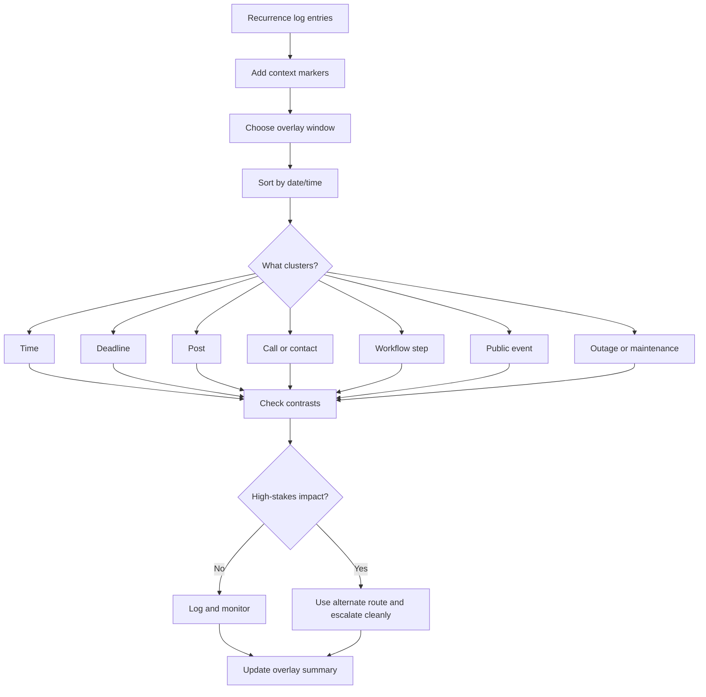

# 📊 Timeline Overlay Template

**First created:** 2026-06-03 | **Last updated:** 2026-06-03
*A practical template for overlaying repeated glitches with deadlines, filings, posts, calls, public events, and other context markers.*

---

## 🌱 Purpose

A recurrence log shows what happened.

A timeline overlay shows what it happened near.

That distinction matters.

A glitch may be ordinary.
A repeat may be worth logging.
A repeated glitch near the same kind of deadline, post, filing, call, appointment, or escalation point may need closer comparison.

This template helps you place incidents against context without jumping straight to cause.

The question is not:

```text
Did this event cause the glitch?
```

The first question is:

```text
What else was happening nearby?
```

A timeline overlay does not prove intent.

It helps you see whether failures cluster around meaningful moments, or whether they are spread out in a boring way.

Both answers are useful.

---

## 🧭 What This Node Is For

Use this node when you need to compare repeated incidents with surrounding events.

It is useful for:

* upload failures near deadlines;
* login loops before appointments or submissions;
* message failures after contacting advisers;
* file changes after complaints or evidence uploads;
* connection drops during scheduled calls;
* account issues after public posts;
* service blockages around travel, court, medical, safeguarding, academic, or employment processes;
* several small failures clustered around one escalation window.

This node is not for proving causation from timing alone.

It is for making timing visible.

---

## 🧰 First Rule: Overlay Is Not Causation

Just because two things happen near each other does not mean one caused the other.

A timeline overlay can show:

```text
These events are close together.
```

It cannot automatically show:

```text
This event caused that failure.
```

Good language:

```text
The upload failure occurred within two hours of the filing deadline.
```

```text
The message failure occurred after the adviser update, but this does not prove the update caused it.
```

```text
Three incidents clustered around the same deadline window.
```

Avoid:

```text
The deadline caused the interference.
```

```text
They blocked it because I posted.
```

```text
This proves coordination.
```

Those may be hypotheses later.

They are not the overlay.

Keep the overlay boring.

Boring travels.

---

## 🗺️ Basic Overlay Structure

A useful overlay has two layers:

```text
incident layer
context layer
```

The incident layer records the glitch or disruption.

The context layer records what else was nearby.

Example:

| Date/time        | Layer    | Event                 | System/person            | Notes                     |
| ---------------- | -------- | --------------------- | ------------------------ | ------------------------- |
| 2026-06-03 09:14 | Incident | Upload failed at 99%  | Complaint portal         | Evidence PDF              |
| 2026-06-03 10:00 | Context  | Submission deadline   | Complaint process        | Same morning              |
| 2026-06-03 10:12 | Incident | Login session expired | Complaint portal         | After retry               |
| 2026-06-03 11:30 | Context  | Adviser call          | Solicitor/support worker | Alternate route discussed |

This lets someone see the shape without needing your whole nervous system attached.

---

## 🧾 Minimal Timeline Overlay

Use this format when you need a clean starting point.

```yaml
timeline_overlay:
  title: ""
  date_range: ""
  timezone: ""
  purpose: ""
  incidents:
    - when: ""
      symptom: ""
      system_or_service: ""
      action_attempted: ""
      workflow_step: ""
      artifact: ""
      impact: ""
  context_markers:
    - when: ""
      marker_type: "deadline / filing / post / call / appointment / public event / outage / travel / payment / other"
      description: ""
      source_or_artifact: ""
      relevance: ""
  observed_cluster: ""
  what_repeated: ""
  what_did_not_repeat: ""
  current_interpretation: "ordinary / worth logging / pattern suspected / escalate"
  next_step: ""
```

---

## 🧾 Plain English Version

Use this if YAML is too much.

```text
Timeline title:
Date range:
Timezone:
Purpose of overlay:

Incidents:
- Date/time:
  What happened:
  System/service:
  Action attempted:
  Workflow step:
  Artifact:
  Impact:

Context markers:
- Date/time:
  Type:
  What else was happening:
  Source/artifact:
  Why it may matter:

Observed cluster:
What repeated:
What did not repeat:
Current interpretation:
Next step:
```

The point is not perfection.

The point is getting incidents and context into the same view.

---

## 📊 Timeline Overlay Table

Use this as the main working table.

| # | Date/time | Layer    | Type | Event | System/person | Artifact/source | Impact/relevance |
| - | --------- | -------- | ---- | ----- | ------------- | --------------- | ---------------- |
| 1 |           | Incident |      |       |               |                 |                  |
| 2 |           | Context  |      |       |               |                 |                  |
| 3 |           | Incident |      |       |               |                 |                  |
| 4 |           | Context  |      |       |               |                 |                  |

Recommended layer labels:

```text
Incident
Context
Check
Outcome
```

Recommended type labels:

```text
upload failure
login loop
message failure
call drop
file change
interface glitch
deadline
filing
post
appointment
public event
outage
travel
payment
support contact
alternate route
```

---

## 🧪 Example: Deadline Overlay

| # | Date/time        | Layer    | Type            | Event                            | System/person     | Artifact/source  | Impact/relevance      |
| - | ---------------- | -------- | --------------- | -------------------------------- | ----------------- | ---------------- | --------------------- |
| 1 | 2026-06-01 09:12 | Incident | Upload failure  | Evidence PDF failed at 99%       | Complaint portal  | Screenshot       | Submission delayed    |
| 2 | 2026-06-01 10:00 | Context  | Deadline        | Draft evidence deadline          | Complaint process | Calendar/email   | Same morning          |
| 3 | 2026-06-02 09:11 | Incident | Upload failure  | Evidence PDF failed at 99% again | Complaint portal  | Screenshot       | Repeat                |
| 4 | 2026-06-02 10:00 | Context  | Deadline        | Internal review deadline         | Complaint process | Calendar/email   | Same time window      |
| 5 | 2026-06-03 09:14 | Incident | Upload failure  | Evidence PDF failed at 99%       | Complaint portal  | Screen recording | Third repeat          |
| 6 | 2026-06-03 09:40 | Check    | Alternate route | Smaller test PDF uploaded        | Complaint portal  | Screenshot       | System not fully down |
| 7 | 2026-06-03 10:00 | Context  | Deadline        | Final submission deadline        | Complaint process | Email            | High-stakes impact    |

Plain summary:

```text
Across three mornings, evidence PDF upload failed at 99% within the hour before complaint-related deadlines. A smaller test PDF uploaded successfully on the third day, suggesting the portal was not fully unavailable.
```

Careful interpretation:

```text
This does not prove the deadlines caused the failures, but the repeated timing and file-specific behaviour justify using an alternate submission route and preserving artifacts.
```

---

## 📬 Example: Adviser Contact Overlay

| # | Date/time        | Layer    | Type              | Event                                                   | System/person  | Artifact/source                          | Impact/relevance              |
| - | ---------------- | -------- | ----------------- | ------------------------------------------------------- | -------------- | ---------------------------------------- | ----------------------------- |
| 1 | 2026-06-01 18:50 | Context  | Support contact   | Legal update drafted                                    | Adviser        | Draft timestamp                          | Sensitive update              |
| 2 | 2026-06-01 19:03 | Incident | Message failure   | Email showed sent but adviser did not receive it        | Email          | Sent screenshot + recipient confirmation | Communication gap             |
| 3 | 2026-06-01 19:20 | Check    | Alternate channel | Same update sent by secure portal                       | Adviser portal | Confirmation receipt                     | Alternate route worked        |
| 4 | 2026-06-03 18:30 | Context  | Support contact   | Follow-up legal update drafted                          | Adviser        | Draft timestamp                          | Similar content               |
| 5 | 2026-06-03 18:42 | Incident | Message failure   | Email again showed sent but absent from recipient inbox | Email          | Sent screenshot + recipient confirmation | Repeat                        |
| 6 | 2026-06-03 19:05 | Check    | Comparison        | Sent neutral test email to different contact            | Email          | Recipient reply                          | Email not universally failing |

Plain summary:

```text
Two legal update emails to the same adviser appeared sent but were not received. A neutral test email to another contact was received normally, and the adviser portal worked as an alternate route.
```

Careful interpretation:

```text
This suggests a contact/content/channel-specific issue worth logging. It does not, by itself, identify cause.
```

---

## 📣 Example: Public Post Overlay

| # | Date/time        | Layer    | Type             | Event                                       | System/person             | Artifact/source     | Impact/relevance            |
| - | ---------------- | -------- | ---------------- | ------------------------------------------- | ------------------------- | ------------------- | --------------------------- |
| 1 | 2026-06-01 12:00 | Context  | Public post      | Published thread about complaint process    | Social platform           | Post URL/screenshot | Public escalation           |
| 2 | 2026-06-01 12:18 | Incident | Interface glitch | Publish button greyed out on follow-up post | Social platform           | Screen recording    | Follow-up delayed           |
| 3 | 2026-06-01 12:30 | Check    | Comparison       | Posted unrelated short text                 | Social platform           | Screenshot          | Worked                      |
| 4 | 2026-06-02 15:10 | Context  | Public post      | Published thread with external links        | Social platform           | Post URL/screenshot | Similar content type        |
| 5 | 2026-06-02 15:21 | Incident | Reach/drop issue | Post received unusually low visibility      | Social platform analytics | Screenshot          | Possible throttling signal  |
| 6 | 2026-06-02 16:00 | Context  | Platform status  | No known outage visible                     | Status page               | Screenshot          | Ordinary outage less likely |

Plain summary:

```text
Two incidents occurred shortly after public posts about the same topic. An unrelated short post worked normally. There was no visible platform outage at the time checked.
```

Careful interpretation:

```text
This is worth logging as a possible content-linked pattern, but more comparison is needed before treating it as systematic throttling.
```

---

## 🧩 Useful Context Markers

Context markers are not automatically causes.

They are nearby events that may help explain timing.

Useful markers include:

* legal deadlines;
* filing windows;
* complaint submissions;
* medical appointments;
* safeguarding contacts;
* adviser or solicitor calls;
* journalist contact;
* regulator contact;
* public posts;
* media events;
* institutional emails;
* travel dates;
* payment due dates;
* account recovery attempts;
* platform outages;
* service maintenance;
* app updates;
* password resets;
* VPN changes;
* device updates;
* location changes;
* public events;
* anniversaries or scheduled events;
* known pressure points.

The question is:

```text
Would this marker help someone understand why the timing mattered?
```

If yes, include it.

If no, leave it out.

---

## 🧮 Overlay Windows

Choose a time window before you interpret.

Examples:

```text
same hour
same day
24 hours before
24 hours after
three-day window
one-week window
deadline week
posting window
appointment window
```

A narrow window is stronger but may miss slow patterns.

A wide window catches more but risks making everything look connected.

Use plain language:

```text
For this overlay, I am comparing incidents within 24 hours before and after complaint-related deadlines.
```

or:

```text
For this overlay, I am comparing incidents within one hour after public posts.
```

Do not keep expanding the window until the pattern appears.

That is how vibes put on a lab coat.

---

## 🔍 What To Look For

Look for clustering around:

### Time

```text
Most failures occur in the same hour, same day, or same pre-deadline window.
```

### Workflow step

```text
Failures happen at final submission, not at login or upload start.
```

### Content

```text
Failures appear around evidence files, complaint wording, legal updates, or specific links.
```

### Contact

```text
Messages fail with one adviser but not with other contacts.
```

### Sequence

```text
Public post, then interface failure, then login expiry, then message failure.
```

### Contrast

```text
Sensitive route fails, neutral test route works.
```

Contrast is especially useful.

A good overlay does not only show what failed.

It shows what worked nearby.

---

## 🟢 Ordinary Timing

The overlay may show an ordinary explanation.

That is a good result.

Likely ordinary if:

* failures match known outage windows;
* many unrelated users report the same issue;
* the service status page confirms disruption;
* all accounts, files, and users are affected;
* issues follow app updates or maintenance;
* failures happen evenly across contexts;
* successes and failures do not cluster around meaningful markers.

Plain summary:

```text
The failures overlap with a documented platform outage affecting many users. No selective pattern is visible from this overlay.
```

Action:

```text
Record if impact matters, but treat as ordinary unless new evidence appears.
```

---

## 🟡 Worth Logging

Worth logging if:

* incidents repeat near similar context markers;
* the same system or workflow step appears repeatedly;
* there is some selectivity by account, file, contact, or content;
* the impact is meaningful but not urgent;
* comparison checks are incomplete.

Plain summary:

```text
The incidents cluster near adviser contact and complaint updates, but comparison checks are incomplete. Treat as worth logging, not proven pattern.
```

Action:

```text
Keep logging and run one safe comparison if needed.
```

---

## 🟠 Pattern Suspected

Pattern suspected if:

* incidents cluster tightly around repeated context markers;
* failures survive basic comparison;
* sensitive routes fail while neutral routes work;
* the same sequence repeats;
* alternate routes work but original channels repeatedly fail;
* impact is increasing;
* the issue affects important access, evidence, or communication.

Plain summary:

```text
The same upload failure repeated within one hour of three complaint deadlines, at the same workflow step, across two browsers, while unrelated test uploads succeeded.
```

Action:

```text
Preserve artifacts, use alternate route, and consider escalation.
```

---

## 🔴 Escalate Promptly

Escalate promptly if the overlay shows repeated failure around high-stakes access, including:

* legal deadlines;
* medical care;
* safeguarding;
* housing;
* immigration;
* employment;
* education access;
* evidence preservation;
* essential money or banking;
* communication with advisers, solicitors, clinicians, journalists, support workers, or trusted witnesses.

A clean escalation can say:

```text
The attached timeline shows repeated failure at the same workflow step within the deadline window. I am not asking you to determine cause at this stage. I need a verified alternate route, preservation of relevant logs, and written confirmation that the deadline/access position will not be prejudiced.
```

Ask for remedy and preservation.

Not a courtroom verdict.

---

## 🧯 Do Not Force The Overlay

A bad overlay can create false certainty.

Avoid:

* adding unrelated events just because they feel meaningful;
* expanding the time window until everything connects;
* treating every coincidence as signal;
* ignoring boring outage evidence;
* ignoring successful attempts;
* mixing different symptoms without labelling them;
* using the overlay to accuse before it can describe;
* turning one stressful day into a universal theory.

Good overlay work is disciplined.

It says:

```text
Here are the incidents.
Here are the nearby markers.
Here is what repeats.
Here is what does not repeat.
Here is what remains uncertain.
```

That is enough.

---

## 🧾 Overlay Summary Template

Use this after completing the table.

```text
Between [date] and [date], [number] incidents were logged. They clustered around [context marker / time window / workflow step]. The repeated feature was [what repeated]. Comparison checks showed [what worked / what did not work]. This does not prove cause, but it supports [ordinary issue / worth logging / pattern suspected / escalation]. Next step: [action].
```

Example:

```text
Between 1 June and 3 June 2026, three upload failures were logged. They clustered within one hour before complaint-related deadlines. The repeated feature was failure at 99% during final submission using the same evidence PDF and main account. Comparison checks showed that a smaller test PDF uploaded successfully. This does not prove cause, but it supports treating the issue as pattern-suspected and using an alternate verified submission route. Next step: preserve screenshots and request written deadline protection.
```

---

## 🗂 Copy-Paste Overlay Table

```markdown
| # | Date/time | Layer | Type | Event | System/person | Artifact/source | Impact/relevance |
|---|---|---|---|---|---|---|---|
| 1 |  | Incident |  |  |  |  |  |
| 2 |  | Context |  |  |  |  |  |
| 3 |  | Check |  |  |  |  |  |
| 4 |  | Outcome |  |  |  |  |  |
```

```markdown
## Overlay Summary

Between [date] and [date], [number] incidents were logged.

They clustered around:

- 

The repeated feature was:

- 

Comparison checks showed:

- 

This does not prove cause, but it supports treating the issue as:

- ordinary
- worth logging
- pattern suspected
- escalate promptly

Next step:

- 
```

---

## 🗺 Mini Flow



---

## 🌌 Constellations

📊 🗓️ 🎛 🧮 🧪 — timeline overlays; context markers; clustering; comparison checks; clean escalation.

---

## ✨ Stardust

timeline overlay, context markers, deadline clustering, incident timeline, anomaly timeline, filing window, public post overlay, comparison window, escalation timeline, pattern context

---

## 🏮 Footer

*📊 Timeline Overlay Template* is a living node of the **Polaris Protocol**.

It helps repeated weirdness sit beside the events it happened near: deadlines, filings, calls, posts, outages, appointments, and public moments. Not causation by coincidence. Not dismissal by default. Just a clean way to ask:

```text
What happened?
What was nearby?
What clustered?
What stayed ordinary?
What needs protecting now?
```

> 📡 Cross-references:
>
> * [🩻 Weirdness Screening](../README.md) — *first-notice triage for ordinary glitches, persistent anomalies, and escalation-worthy weirdness*
> * [🎛 Systematic Patterns](./README.md) — *recurrence, timing, clustering, and comparison tools*
> * [🎛 When A Glitch Repeats](./🎛_when_a_glitch_repeats.md) — *first doorway into recurrence discipline*
> * [🗓️ Recurrence Log Template](./🗓️_recurrence_log_template.md) — *structured format for repeated anomalies*
> * [🧮 Simple Pattern Counting](./🧮_simple_pattern_counting.md) — *basic counting before interpretation*
> * [🪞 Same Time Same Place Same Failure](./🪞_same_time_same_place_same_failure.md) — *documenting repeated conditions*
> * [🧪 Testing Pattern Without Over-Testing](./🧪_testing_pattern_without_over_testing.md) — *safe comparison without spiralling*
> * [🚩 Systematic Pattern Red Flags](./🚩_systematic_pattern_red_flags.md) — *when repetition deserves closer review*

*Survivor authorship is sovereign. Containment is never neutral.*
