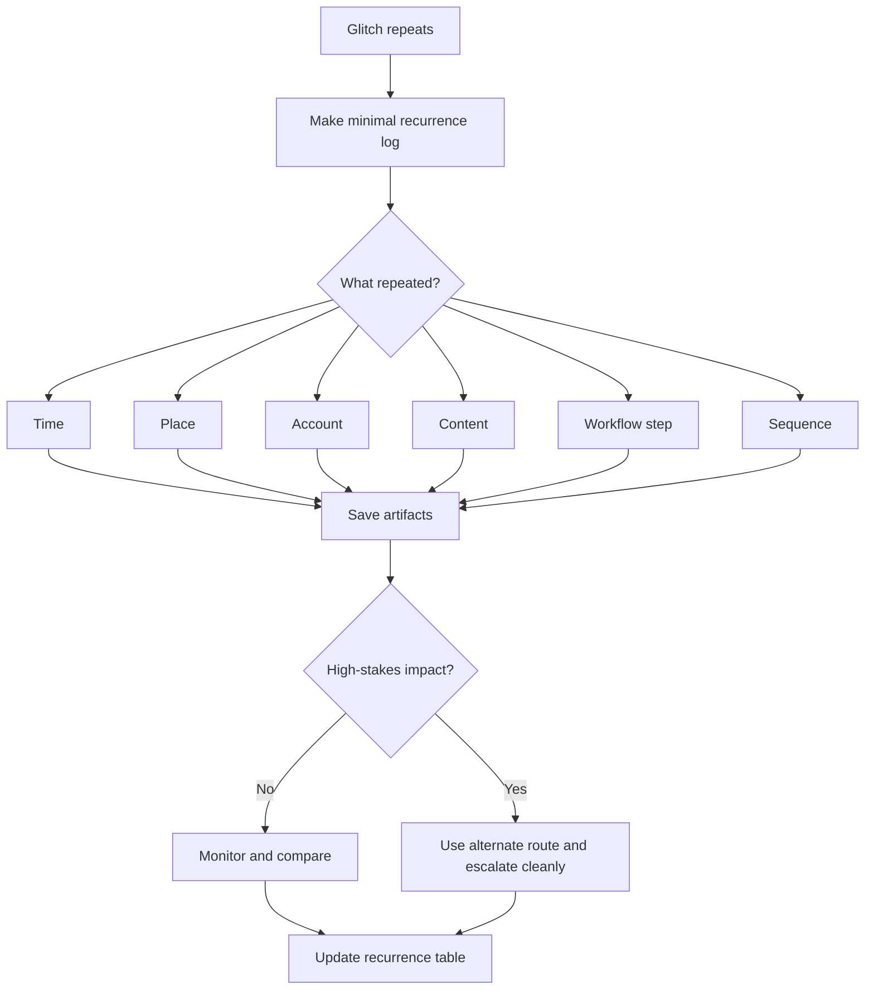

# 🗓️ Recurrence Log Template

**First created:** 2026-06-03 | **Last updated:** 2026-06-03  
*A reusable logging format for repeated glitches, patterned failures, and “this keeps happening” moments.*

---

## 🌱 Purpose

A recurrence log is for the moment when a weird event happens again.

Not once.  
Again.

The aim is not to prove intent.

The aim is to stop repeated weirdness from dissolving into memory fog, screenshots with no context, or a pile of “what the fuck was that?” notes that nobody else can follow.

A good recurrence log helps you answer:

```text
What repeated?
When did it repeat?
Where did it repeat?
What changed?
What stayed the same?
What did I test?
What was the practical impact?
What needs to happen next?
```

This template turns repeated glitches into a usable record.

Not a panic diary.

Not a conspiracy board.

A clean event log.

---

## 🧭 When To Use This Template

Use this template when a glitch, blockage, failure, or disruption has happened more than once and the repeated feature matters.

Good examples:

* upload fails at the same percentage;
* login loops at the same workflow step;
* messages fail only with one contact;
* calls cut during the same kind of conversation;
* files change after the same kind of submission;
* forms fail near the same deadline;
* account access breaks after the same public post;
* several systems fail in a repeated sequence;
* one device, account, file, person, location, or topic keeps appearing in the failures.

Do not use this template for every tiny irritation.

Use it when recurrence itself has become the signal.

---

## 🧰 First Rule: Observable First

Start with what happened.

Not what you think caused it.

Good:

```text
Upload failed at 99% on three attempts using the same evidence PDF.
```

Less useful:

```text
They blocked the upload.
```

Good:

```text
Main account returned to MFA loop after password was accepted.
```

Less useful:

```text
Someone locked me out.
```

You may have hypotheses.

Keep them separate from observations.

A recurrence log gets stronger when it separates:

```text
observed event
```

from:

```text
possible explanation
```

---

## 🗓️ Minimal Recurrence Log

Use this for a quick but structured entry.

```yaml
when: ""
timezone: ""
category: "systematic_pattern"
pattern_name: ""
symptom: ""
service_or_system: ""
device: ""
browser_or_app: ""
operating_system: ""
network: ""
vpn_or_dns: ""
account: ""
action_attempted: ""
workflow_step: ""
error_text: ""
repeat_number: null
previous_occurrences:
  - ""
what_repeated:
  time: ""
  place: ""
  account: ""
  content: ""
  workflow_step: ""
  sequence: ""
  contact: ""
  deadline_or_context: ""
what_changed:
  - ""
tested_fixes:
  - ""
comparison_checks:
  other_device: null
  other_network: null
  other_account: null
  other_browser: null
  other_file: null
  other_time: null
artifacts:
  - ""
impact: ""
risk_level: "green / yellow / orange / red"
next_step: ""
notes: ""
```

---

## 🧾 Plain English Version

Use this if YAML feels annoying.

```text
Date/time:
Timezone:
What happened:
Where/system:
Device:
Browser/app:
Network:
Account:
What I was trying to do:
Exact step where it failed:
Exact error text:
How many times this has happened:
Previous dates/times:
What repeated:
What was different this time:
Fixes tried:
Comparison checks:
Artifacts saved:
Impact:
Risk level:
Next step:
Notes:
```

Sometimes plain text is better.

The best log is the one you will actually fill in.

---

## 🧪 Example Entry: Upload Failure

```yaml
when: "2026-06-03T09:14:00+01:00"
timezone: "Europe/London"
category: "systematic_pattern"
pattern_name: "Evidence PDF upload fails at final stage"
symptom: "Upload failed at 99%"
service_or_system: "Complaint portal"
device: "Laptop"
browser_or_app: "Firefox"
operating_system: "macOS"
network: "Home Wi-Fi"
vpn_or_dns: "VPN off"
account: "Main email login"
action_attempted: "Submit evidence PDF"
workflow_step: "Final upload / submit"
error_text: "Upload failed. Please try again."
repeat_number: 3
previous_occurrences:
  - "2026-06-01T09:12:00+01:00"
  - "2026-06-02T09:11:00+01:00"
what_repeated:
  time: "Morning, around 09:10-09:15"
  place: "Home"
  account: "Same account"
  content: "Evidence PDF"
  workflow_step: "Final upload stage"
  sequence: "Upload reaches 99%, then fails"
  contact: ""
  deadline_or_context: "Complaint deadline this week"
what_changed:
  - "Tried Firefox instead of Chrome"
tested_fixes:
  - "Browser switch"
  - "Restarted browser"
comparison_checks:
  other_device: false
  other_network: false
  other_account: null
  other_browser: true
  other_file: null
  other_time: false
artifacts:
  - "screenshot_2026-06-03_0914_upload_failed.png"
impact: "Could delay evidence submission"
risk_level: "orange"
next_step: "Try verified alternate submission route; ask portal owner to protect deadline"
notes: "Do not keep retesting final submission repeatedly."
```

---

## 📬 Example Entry: Message Failure

```yaml
when: "2026-06-03T18:42:00+01:00"
timezone: "Europe/London"
category: "systematic_pattern"
pattern_name: "Messages to adviser fail after legal update"
symptom: "Message showed as sent but recipient did not receive it"
service_or_system: "Email"
device: "Phone"
browser_or_app: "Mail app"
operating_system: "iOS"
network: "Mobile data"
vpn_or_dns: "VPN on"
account: "Personal email"
action_attempted: "Send update to adviser"
workflow_step: "Outbound email delivery"
error_text: ""
repeat_number: 2
previous_occurrences:
  - "2026-06-01T19:03:00+01:00"
what_repeated:
  time: "Evening"
  place: ""
  account: "Same email account"
  content: "Legal update"
  workflow_step: "Outbound message appears sent"
  sequence: "Sent status appears, recipient confirms absence"
  contact: "Same adviser"
  deadline_or_context: "After complaint update"
what_changed:
  - "Used mobile data instead of Wi-Fi"
tested_fixes:
  - "Checked sent folder"
  - "Asked recipient to check spam"
comparison_checks:
  other_device: null
  other_network: true
  other_account: false
  other_browser: null
  other_file: null
  other_time: null
artifacts:
  - "screenshot_sent_folder.png"
  - "recipient_confirmation_message.png"
impact: "Adviser may not receive time-sensitive update"
risk_level: "orange"
next_step: "Resend through alternate verified channel; preserve headers if available"
notes: "Need comparison from another email account."
```

---

## 🔑 Example Entry: Access Barrier

```yaml
when: "2026-06-03T11:27:00+01:00"
timezone: "Europe/London"
category: "systematic_pattern"
pattern_name: "Main account MFA loop before deadline"
symptom: "Password accepted, then MFA loop restarts"
service_or_system: "Institutional portal"
device: "Desktop"
browser_or_app: "Chrome"
operating_system: "Windows"
network: "Work Wi-Fi"
vpn_or_dns: "VPN off"
account: "Institutional login"
action_attempted: "Access submission dashboard"
workflow_step: "After MFA approval"
error_text: "Session expired"
repeat_number: 4
previous_occurrences:
  - "2026-05-30T11:20:00+01:00"
  - "2026-06-01T11:25:00+01:00"
  - "2026-06-02T11:22:00+01:00"
what_repeated:
  time: "Late morning"
  place: "Work network"
  account: "Same institutional account"
  content: ""
  workflow_step: "After MFA approval"
  sequence: "Password accepted, MFA approved, session expired, login restarts"
  contact: ""
  deadline_or_context: "Submission deadline approaching"
what_changed:
  - "Cleared cookies"
  - "Tried private browsing"
tested_fixes:
  - "Cookie clear"
  - "Private window"
  - "Password-manager disabled"
comparison_checks:
  other_device: false
  other_network: false
  other_account: null
  other_browser: true
  other_file: null
  other_time: false
artifacts:
  - "screen_recording_mfa_loop.mp4"
impact: "Cannot access required dashboard"
risk_level: "red"
next_step: "Contact institutional IT and request alternate submission route in writing"
notes: "Stop repeated login attempts to avoid lockout."
```

---

## 🧮 Repeat Number

Use `repeat_number` to show where this incident sits in the series.

```yaml
repeat_number: 1
```

means first known occurrence.

```yaml
repeat_number: 2
```

means second known occurrence.

```yaml
repeat_number: 5
```

means fifth known occurrence.

Do not inflate the number.

If you are unsure, write:

```yaml
repeat_number: "at least 3"
```

or:

```yaml
repeat_number: "unknown; recurring since May 2026"
```

Honesty beats neatness.

---

## 🎛 Pattern Name

A pattern name should be boring and descriptive.

Good:

```text
Evidence PDF upload fails at final stage
```

```text
MFA loop after password accepted
```

```text
Messages to adviser missing from recipient inbox
```

```text
Wi-Fi drop before scheduled call
```

Less useful:

```text
The portal is hostile
```

```text
They are blocking me
```

```text
Everything is fucked
```

That last one may be spiritually accurate.

It is still not a useful pattern name.

---

## 🧩 What Repeated?

This is the most important section.

Fill in only what applies.

```yaml
what_repeated:
  time: ""
  place: ""
  account: ""
  content: ""
  workflow_step: ""
  sequence: ""
  contact: ""
  deadline_or_context: ""
```

Examples:

```yaml
what_repeated:
  time: "Between 22:00 and 23:00"
  place: ""
  account: "Main account only"
  content: "Posts containing external links"
  workflow_step: "Final publish button"
  sequence: "Draft saves, preview loads, publish fails"
  contact: ""
  deadline_or_context: "After public escalation posts"
```

Or:

```yaml
what_repeated:
  time: ""
  place: "Same public building"
  account: ""
  content: ""
  workflow_step: ""
  sequence: "Signal drops, call cuts, app reconnects after leaving building"
  contact: "Calls with support worker"
  deadline_or_context: ""
```

If you can answer only one question, answer this one:

```text
What repeated?
```

---

## 🔬 Comparison Checks

Comparison checks stop the log becoming vibes in a trench coat.

Use them to test whether the issue follows:

* the device;
* the network;
* the account;
* the browser;
* the file;
* the time window;
* the contact;
* the workflow step.

Use `true`, `false`, or `null`.

```yaml
comparison_checks:
  other_device: true
  other_network: false
  other_account: null
  other_browser: true
  other_file: false
  other_time: null
```

Suggested meanings:

```text
true = checked and issue still happened
false = checked and issue did not happen
null = not checked / not safe / not applicable
```

Example:

```yaml
comparison_checks:
  other_device: true
  other_network: true
  other_account: false
  other_browser: true
  other_file: null
  other_time: null
```

Plain meaning:

```text
The problem followed the action across device, network, and browser, but did not happen on another account.
```

That is useful.

---

## 🧯 Do Not Over-Test

A recurrence log is not an invitation to keep poking the broken thing until it bites.

Over-testing can cause:

* lockouts;
* duplicate submissions;
* fraud flags;
* corrupted files;
* altered timestamps;
* overwritten drafts;
* account freezes;
* confusing audit trails;
* escalation against you;
* exhaustion.

For high-stakes systems, use this limit:

```text
Screenshot once.
Try one sensible alternate route.
Record what happened.
Escalate to a human or formal channel.
Stop hammering the failing route.
```

Especially avoid repeated testing in:

* legal portals;
* medical systems;
* safeguarding systems;
* banking;
* immigration;
* employment;
* education submissions;
* evidence upload routes.

The goal is a clean record.

Not self-inflicted audit mush.

---

## 🚦 Risk Level

Use a simple four-level label.

### 🟢 Green — Ordinary / Low Impact

Use when:

* the issue is low-stakes;
* there is a likely ordinary cause;
* it resolves with a simple fix;
* it does not affect essential access.

Action:

```text
Fix or note lightly.
```

### 🟡 Yellow — Worth Logging

Use when:

* the issue repeats;
* the cause is unclear;
* the impact is annoying or disruptive;
* it may become more important later.

Action:

```text
Log, compare, monitor.
```

### 🟠 Orange — Pattern Suspected

Use when:

* the issue repeats under specific conditions;
* it affects meaningful work;
* it survives basic comparison;
* it clusters around sensitive content, deadlines, contacts, or escalation.

Action:

```text
Build timeline, preserve artifacts, use alternate route if needed.
```

### 🔴 Red — Escalate Promptly

Use when:

* legal, medical, safeguarding, financial, housing, immigration, employment, education, evidence, or safety access is affected;
* required contact with advisers, clinicians, solicitors, journalists, support workers, or trusted witnesses is disrupted;
* repeated failure could create serious practical harm.

Action:

```text
Preserve evidence, stop relying on broken route, escalate cleanly, request remedy.
```

---

## 📎 Artifacts To Save

Useful artifacts include:

* screenshots;
* screen recordings;
* error messages;
* confirmation emails;
* bounce messages;
* delivery reports;
* file hashes;
* version history screenshots;
* sent-folder screenshots;
* recipient confirmations;
* status-page screenshots;
* service outage reports;
* device logs where available;
* router logs where available;
* timestamps from both sender and recipient;
* photos of public infrastructure failures;
* receipts, ticket numbers, case references.

Name artifacts plainly.

Good:

```text
2026-06-03_0914_complaint_portal_upload_failed_99percent.png
```

Less useful:

```text
weirdshitagain.png
```

Emotionally valid.

Terrible later.

---

## 🧷 Clean Summary Sentence

At the top of a longer log, add one short summary.

Template:

```text
This issue has repeated [number] times between [date] and [date], affecting [system/action], at [workflow step], under [repeated conditions]. Basic checks tried: [checks]. Impact: [impact]. Current ask: [remedy or next step].
```

Example:

```text
This issue has repeated three times between 1 June and 3 June 2026, affecting evidence upload through the complaint portal, at final submission, under the same account and file type but across two browsers. Basic checks tried: browser switch and restart. Impact: possible delay to a live complaint deadline. Current ask: alternate verified submission route and written deadline protection.
```

That sentence can travel into:

* emails;
* complaint forms;
* solicitor updates;
* support tickets;
* regulator complaints;
* technical review;
* internal escalation notes.

Plain summary first.

Receipts underneath.

---

## 🗂 Recurrence Table

For longer patterns, add a table.

| # | Date/time | Symptom | System | Context | Fix tried | What repeated | Artifact |
|---|---|---|---|---|---|---|---|
| 1 | 2026-06-01 09:12 | Upload failed at 99% | Complaint portal | Evidence PDF | Retry | Same file type + final stage | screenshot |
| 2 | 2026-06-02 09:11 | Upload failed at 99% | Complaint portal | Evidence PDF | Browser switch | Same time + final stage | screenshot |
| 3 | 2026-06-03 09:14 | Upload failed at 99% | Complaint portal | Evidence PDF | Restart | Same account + final stage | screen recording |

Then write the pattern as one sentence:

```text
Across three mornings, the same evidence PDF upload failed at 99% during final submission, using the same account, despite browser switch and restart.
```

One sentence.

No fireworks required.

---

## 🧭 Routing Notes

If the recurrence is mostly about connection behaviour, route to:

```text
../🌐_Connection_Hiccups/
```

If it is mostly about messages, calls, missing replies, or attachments, route to:

```text
../📬_Comms_Breaks/
```

If it is mostly about files, records, metadata, timestamps, or missing documents, route to:

```text
../📂_Data_Shifts/
```

If it is mostly about login, MFA, permissions, account access, or submit barriers after authentication, route to:

```text
../🔑_Access_Barriers/
```

If it is mostly about buttons, forms, cursor behaviour, fields, overlays, or visible interface refusal, route to:

```text
../🖥_Interface_Glitches/
```

If the key feature is the repeat itself, keep it in:

```text
./🎛_Systematic_Patterns/
```

---

## 🧼 Good Logging Hygiene

A recurrence log should be:

* boring;
* timestamped;
* specific;
* consistent;
* plain;
* separated from speculation;
* clear about uncertainty;
* careful about comparison tests;
* honest about what was not checked.

Avoid:

* dramatic labels;
* actor claims without evidence;
* changing the same system repeatedly;
* deleting failure states before recording;
* mixing five incidents into one entry;
* relying only on memory;
* saving screenshots with no date or context;
* using one log to explain everything.

The record does not need to be perfect.

It needs to be followable.

---

## 🗺 Mini Flow



---

## 🌌 Constellations

🗓️ 🎛 🧾 🧪 🧮 — recurrence logging; timestamp discipline; pattern comparison; escalation records; boring evidence.

---

## ✨ Stardust

recurrence log, anomaly record, repeated failure, evidence log, timestamped incidents, comparison checks, digital pattern, workflow failure, escalation packet, boring receipts

---

## 🏮 Footer

*🗓️ Recurrence Log Template* is a living node of the **Polaris Protocol**.

It gives repeated weirdness somewhere disciplined to land: not as panic, not as dismissal, but as timestamped, comparable, usable record.

```text
What repeated?
What changed?
What was tested?
What is the impact?
What remedy is needed?
```

> 📡 Cross-references:
>
> * [🩻 Weirdness Screening](../README.md) — *first-notice triage for ordinary glitches, persistent anomalies, and escalation-worthy weirdness*
> * [🎛 Systematic Patterns](./README.md) — *recurrence, timing, clustering, and comparison tools*
> * [🎛 When A Glitch Repeats](./🎛_when_a_glitch_repeats.md) — *first doorway into recurrence discipline*
> * [🧮 Simple Pattern Counting](./🧮_simple_pattern_counting.md) — *basic counting before interpretation*
> * [📊 Timeline Overlay Template](./📊_timeline_overlay_template.md) — *overlaying incidents with deadlines, posts, filings, or public events*
> * [🪞 Same Time Same Place Same Failure](./🪞_same_time_same_place_same_failure.md) — *documenting repeated conditions*
> * [🧪 Testing Pattern Without Over-Testing](./🧪_testing_pattern_without_over_testing.md) — *safe comparison without spiralling*
> * [🚩 Systematic Pattern Red Flags](./🚩_systematic_pattern_red_flags.md) — *when repetition deserves closer review*

*Survivor authorship is sovereign. Containment is never neutral.*
