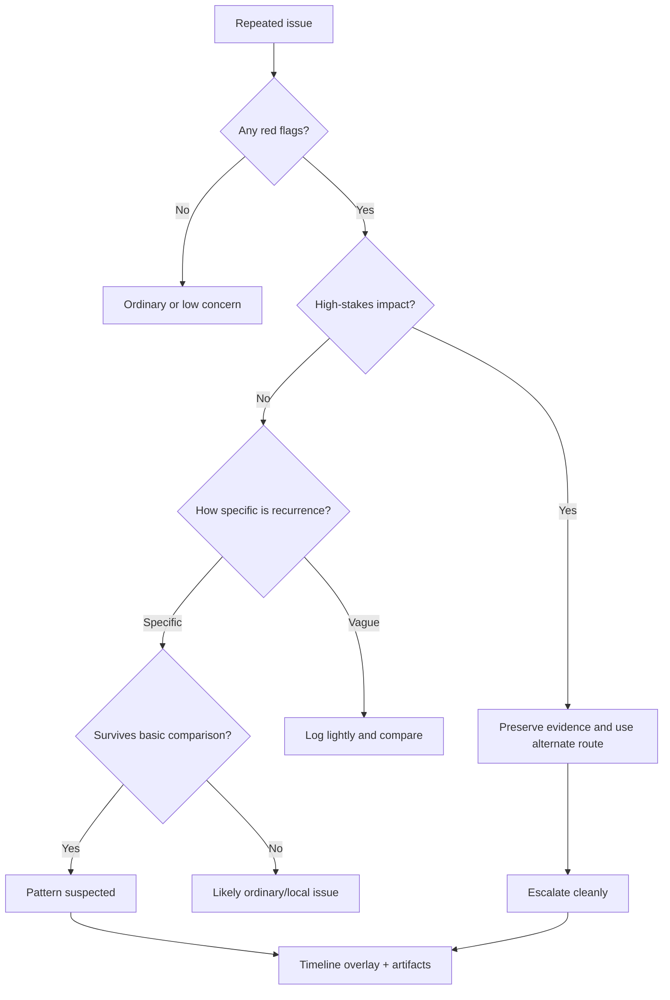

# 🚩 Systematic Pattern Red Flags

**First created:** 2026-06-03 | **Last updated:** 2026-06-03
*Indicators that repeated glitches, failures, or blockages deserve closer review, cleaner records, or escalation.*

---

## 🌱 Purpose

A red flag is not proof.

A red flag is a reason to slow down, record carefully, compare safely, and protect the task.

One failed upload may be ordinary.
One missing message may be app nonsense.
One login loop may be a stale session.
One call drop may be bad signal.
One weird interface failure may be a browser tantrum in a little hat.

But when failures repeat, cluster, follow the same account, appear near deadlines, affect evidence, or survive basic comparison, the record needs more discipline.

This node helps people recognise when recurrence has moved beyond:

```text
That was annoying.
```

toward:

```text
This deserves a proper log.
```

or:

```text
This needs an alternate route and escalation now.
```

The aim is not panic.

The aim is proportionate attention.

---

## 🧭 What This Node Is For

Use this node when you are deciding whether a repeated glitch or blockage is:

* ordinary recurrence;
* worth logging;
* pattern-suspected;
* or urgent enough to escalate.

It is useful for:

* repeated upload failures;
* recurring login or MFA loops;
* repeated message delivery failures;
* calls dropping in patterned ways;
* records, files, or metadata shifting;
* forms failing at the same step;
* accounts locking near deadlines;
* posts or uploads failing around similar content;
* several systems failing in a recognisable sequence;
* disruption affecting legal, medical, safeguarding, financial, housing, immigration, employment, education, evidence, or support access.

This node is not for declaring certainty.

It is for deciding what level of care the pattern deserves.

---

## 🧰 First Rule: Red Flag Does Not Mean Verdict

A red flag means:

```text
This is worth checking.
```

It does not automatically mean:

```text
This proves hostile action.
```

Good language:

```text
This repeated condition deserves closer review.
```

```text
This pattern is specific enough to justify logging.
```

```text
This affects a high-stakes route, so an alternate channel is needed.
```

Avoid:

```text
This proves they are interfering.
```

```text
This confirms targeting.
```

```text
This can only be malicious.
```

Sometimes it can be ordinary.

Sometimes it can be serious.

The job is to preserve enough structure to tell the difference.

---

## 🚩 Core Red Flags

### Same failure, same workflow step

A repeated failure at the same stage matters more than general brokenness.

Examples:

* upload always fails at 99%;
* login accepts password then loops at MFA;
* form completes but final submit fails;
* payment authorises then drops at confirmation;
* document preview works but export fails;
* message appears sent but delivery fails.

Useful sentence:

```text
The system works until [specific step], then repeatedly fails at [specific gate].
```

Why it matters:

```text
A specific gate is easier to troubleshoot, compare, and escalate than a vague claim that everything is broken.
```

---

### Same account across device or network

If the failure follows one account across environments, it deserves logging.

Examples:

* main account fails on laptop and phone;
* same login loops on Wi-Fi and mobile data;
* secondary account works on the same device and network;
* account functions work except one required workflow.

Useful sentence:

```text
The failure followed the account across [device/network/browser], while [comparison account/route] worked.
```

Why it matters:

```text
This suggests the issue may be account-specific rather than only device or network-specific.
```

It does not prove why.

---

### Same file or content across routes

If a file, filename, attachment, link, phrase, or topic repeatedly appears in failures, record it.

Examples:

* evidence PDF fails but test PDF works;
* renamed copy still fails;
* complaint wording triggers form refusal;
* posts with external links fail while plain text posts work;
* legal or safeguarding attachments vanish;
* a specific file changes after submission.

Useful sentence:

```text
The failure followed [file/content] across [browser/network/account], while [neutral comparison] worked.
```

Why it matters:

```text
This may indicate file corruption, metadata issue, content validation, platform filtering, or a more selective content-linked pattern.
```

Keep the possibilities open.

---

### Same contact or channel

If messages fail with one person, office, adviser, clinician, journalist, solicitor, or support worker while other contacts work, that is worth logging.

Examples:

* email to adviser appears sent but is not received;
* attachment stripped only with one recipient;
* calls to one support route cut repeatedly;
* messages in one thread vanish;
* secure portal works but email route fails.

Useful sentence:

```text
The communication failure repeated with [contact/channel], while [comparison contact/channel] worked.
```

Why it matters:

```text
Contact-specific failure can affect advice, evidence, safeguarding, deadlines, or support access.
```

---

### Same time window

Failures that recur in a narrow time window deserve comparison.

Examples:

* every morning before a deadline;
* same hour after posting;
* same day each week;
* same point in the month;
* same interval after contacting an institution;
* same window before scheduled calls.

Useful sentence:

```text
The failure repeated within [time window] on [number] occasions.
```

Why it matters:

```text
Timing may reflect maintenance, traffic, scheduled tasks, deadline load, or a more selective recurrence pattern.
```

Check ordinary explanations first.

---

### Same place or route

A location-linked failure may be ordinary signal trouble.

It may still matter if it affects essential communication.

Examples:

* calls drop in the same building;
* mobile data fails on the same route;
* Wi-Fi collapses in the same room;
* transport/payment gates fail at the same station;
* support calls fail from one public venue but work outside.

Useful sentence:

```text
The failure repeated in [place], and did not repeat in [comparison place].
```

Why it matters:

```text
This may show local infrastructure weakness, building interference, network configuration, or location-linked disruption.
```

---

### Same sequence

Several failures in the same order are more interesting than isolated inconvenience.

Examples:

```text
Wi-Fi drops → upload fails → login expires → message does not send.
```

```text
Public post → interface glitch → account prompt → reach collapse.
```

```text
Deadline email → portal lockout → call drop → file timestamp change.
```

Useful sentence:

```text
The same sequence repeated [number] times: [step 1] → [step 2] → [step 3].
```

Why it matters:

```text
A repeated sequence may show choreography, dependency, automation, or a recurring system condition.
```

Do not merge unrelated events without checking.

---

## 🟡 Worth-Logging Red Flags

Treat as worth logging when:

* the issue repeats more than twice;
* it affects meaningful work;
* there is no clear ordinary explanation;
* it happens near a deadline or escalation point;
* it is selective to one account, file, contact, place, topic, or workflow step;
* it creates delay, confusion, or practical friction;
* it makes you rely on memory instead of records;
* it might become important later.

Action:

```text
Make a recurrence log.
Save artifacts.
Count successes as well as failures.
Run only safe comparisons.
```

At this level, do not panic.

Do not ignore it either.

---

## 🟠 Pattern-Suspected Red Flags

Treat as pattern-suspected when:

* the same failure survives basic comparison;
* it persists across browser, device, network, or account;
* it clusters around sensitive content or deadlines;
* neutral routes work while sensitive routes fail;
* the same sequence repeats;
* the original route fails repeatedly while alternate routes work;
* explanations change between incidents;
* logs, messages, files, or records disappear after failure;
* the practical impact is increasing;
* others can corroborate part of the pattern.

Action:

```text
Build a timeline overlay.
Preserve artifacts.
Use alternate routes for important tasks.
Consider technical, procedural, legal, institutional, or support review.
```

At this level, the phrase is:

```text
pattern suspected
```

Not:

```text
case proven
```

---

## 🔴 Escalate-Now Red Flags

Escalate promptly when recurrence affects:

* legal deadlines;
* medical care;
* safeguarding;
* housing;
* immigration;
* employment;
* education access;
* essential money or banking;
* evidence preservation;
* account access needed for essential services;
* communication with solicitors, advisers, clinicians, journalists, support workers, trusted witnesses, or formal bodies.

Escalate promptly if:

* you are locked out of a required route;
* a deadline may be prejudiced;
* evidence may be lost or overwritten;
* money is blocked or missing;
* medical or safeguarding contact is disrupted;
* multiple independent channels fail at once;
* the same high-stakes route fails after one safe comparison;
* repeated testing could make the record worse.

Action:

```text
Stop relying solely on the failing route.
Preserve evidence.
Use a verified alternate route.
Ask for remedy, log preservation, and deadline/access protection.
```

---

## 🧾 Red Flag Checklist

Use this checklist before deciding what to do.

```markdown
## Red Flag Checklist

**Issue summary:**  
**Date range:**  
**Number of incidents:**  
**High-stakes area involved?** yes / no  

### Repeated conditions

- [ ] Same time window
- [ ] Same place
- [ ] Same account
- [ ] Same device
- [ ] Same network
- [ ] Same browser/app
- [ ] Same file/content
- [ ] Same contact
- [ ] Same workflow step
- [ ] Same sequence
- [ ] Same deadline/context
- [ ] Same failed fix
- [ ] Same working alternate route

### Practical impact

- [ ] Delay
- [ ] Lost access
- [ ] Missed or threatened deadline
- [ ] Communication failure
- [ ] Evidence risk
- [ ] Money/payment risk
- [ ] Medical/safeguarding risk
- [ ] Housing/immigration/employment/education risk
- [ ] Emotional or cognitive load

### Current level

- [ ] Ordinary / low concern
- [ ] Worth logging
- [ ] Pattern suspected
- [ ] Escalate promptly

**Next step:**  
```

---

## 🧪 Red Flags That Need Comparison

Some red flags are only meaningful if compared.

### “It always fails”

Compare:

```text
Does it fail with another browser, device, network, account, file, or time?
```

### “It only happens to me”

Compare:

```text
Do other users report it? Does another account work? Does the same task work for someone else?
```

### “It only happens with this file”

Compare:

```text
Does a neutral test file work? Does a renamed copy work? Does a smaller version work?
```

### “It only happens near deadlines”

Compare:

```text
Does the same action work outside deadline windows? Are there scheduled maintenance or peak traffic explanations?
```

### “Messages vanish with one contact”

Compare:

```text
Do other contacts receive messages? Does the same contact receive through another channel? Are spam/filter/attachment rules involved?
```

Comparison does not need to be elaborate.

It needs to be safe, narrow, and recorded.

---

## 🟢 Not Red Flags By Themselves

These are not strong red flags alone:

* one failed upload;
* one dropped call;
* one missing message;
* one login loop;
* one vague error;
* one slow page;
* one app crash;
* one weird recommendation;
* one bad search result;
* one failed payment during a known outage;
* one transport delay;
* one website being rubbish because websites are often rubbish.

They may still be annoying.

They may still matter if high-stakes.

But they are not systematic pattern evidence by themselves.

Record lightly if needed.

Move on if resolved.

---

## 🧯 False-Positive Traps

A false positive is when ordinary mess gets mistaken for meaningful pattern.

Common traps:

* platform outage;
* maintenance window;
* file too large;
* corrupted file;
* old browser;
* browser extension conflict;
* bad Wi-Fi;
* VPN weirdness;
* expired session;
* password-manager autofill loop;
* app update;
* storage full;
* recipient inbox full;
* spam filter;
* rate limiting;
* peak traffic;
* institutional firewall;
* accessibility overlay conflict;
* duplicate tabs;
* cached form state.

Check boring explanations before escalation.

Not because you are dismissing yourself.

Because a boring explanation is easier to fix.

---

## 🧷 High-Value Red Flag Combinations

One red flag may be weak.

Combinations matter.

### Same workflow step + deadline

```text
Final submission fails repeatedly within deadline window.
```

Level:

```text
Pattern suspected or escalate, depending on stakes.
```

### Same account + different devices/networks

```text
Main account fails across environments while secondary account works.
```

Level:

```text
Worth logging or pattern suspected.
```

### Same file + neutral file works

```text
Evidence file fails while test file works.
```

Level:

```text
Worth logging; may need alternate route if high-stakes.
```

### Same contact + alternate channel works

```text
Emails to adviser fail while secure portal messages arrive.
```

Level:

```text
Pattern suspected if repeated; escalate if deadline/support access affected.
```

### Same sequence + sensitive context

```text
Complaint update, then login loop, then message failure, then file timestamp change.
```

Level:

```text
Pattern suspected; separate each symptom and overlay timeline.
```

Do not flatten combinations into “everything is connected.”

Name the links.

Name the uncertainties.

---

## 🧮 Simple Red Flag Scoring

Do not overuse scoring.

But a simple count can help.

Give one point for each:

```markdown
- same workflow step
- same account
- same file/content
- same contact
- same time window
- same place
- same sequence
- survives basic comparison
- high-stakes impact
- working alternate route exists
```

Rough guide:

```text
0-1: likely ordinary or low concern
2-3: worth logging
4-6: pattern suspected
7+ or any high-stakes harm: consider escalation
```

This is not science.

It is a thinking aid.

Do not let the score override common sense.

A single legal deadline failure can be escalation-worthy even with a low score.

---

## 🗂 Red Flag Summary Template

```text
Between [date] and [date], [issue] repeated [number] times. Red flags present: [same condition list]. Comparison checks showed [what worked / what failed]. Practical impact: [impact]. Current level: [ordinary / worth logging / pattern suspected / escalate]. Next step: [action].
```

Example:

```text
Between 1 June and 3 June 2026, evidence upload failed three times. Red flags present: same file, same account, same workflow step, same deadline window, and same failure percentage. Comparison checks showed that a smaller test PDF uploaded successfully. Practical impact: possible prejudice to a complaint deadline. Current level: pattern suspected with escalation needed for deadline protection. Next step: use alternate verified submission route and request preservation of relevant logs.
```

That is enough.

No fireworks.

Receipts first.

---

## 🧷 Escalation Sentence

When red flags justify escalation, use this:

```text
The attached record shows repeated failure under specific conditions: [brief summary]. I am not asking you to determine cause at this stage. I need [specific remedy], preservation of relevant logs if available, and confirmation that [deadline/access/evidence/communication] will not be prejudiced.
```

Example:

```text
The attached record shows repeated failure under specific conditions: the same evidence PDF failed at final submission using the main account within the deadline window, while a neutral test PDF uploaded successfully. I am not asking you to determine cause at this stage. I need a verified alternate submission route, preservation of relevant logs if available, and confirmation that the complaint deadline will not be prejudiced.
```

This keeps the ask focused.

Remedy. Preservation. Protection.

---

## 🛑 What Not To Do With Red Flags

Do not:

* turn every red flag into an accusation;
* keep testing high-stakes systems repeatedly;
* merge unrelated symptoms without labelling them;
* ignore successful comparisons;
* ignore ordinary outage evidence;
* use timing alone as proof;
* delete or overwrite artifacts while testing;
* rely only on memory;
* use dramatic names in formal records;
* escalate without saying what remedy is needed.

A red flag is a door marker.

Not the whole building.

---

## 🗺 Mini Flow



---

## 🌌 Constellations

🚩 🎛 🗓️ 🧮 🧪 📊 — red flags; recurrence; counting; safe comparison; timeline overlay; escalation cues.

---

## ✨ Stardust

systematic pattern red flags, recurrence warning signs, repeated failure indicators, pattern suspected, escalation cues, same workflow step, account-specific failure, file-specific failure, deadline disruption, evidence preservation

---

## 🏮 Footer

*🚩 Systematic Pattern Red Flags* is a living node of the **Polaris Protocol**.

It helps people notice when repeated weirdness deserves more than a shrug and less than a panic spiral.

A red flag is not a verdict.

It is a reason to ask:

```text
What repeated?
What is the impact?
What comparisons exist?
What needs protecting now?
```

> 📡 Cross-references:
>
> * [🩻 Weirdness Screening](../README.md) — *first-notice triage for ordinary glitches, persistent anomalies, and escalation-worthy weirdness*
> * [🎛 Systematic Patterns](./README.md) — *recurrence, timing, clustering, and comparison tools*
> * [🎛 When A Glitch Repeats](./🎛_when_a_glitch_repeats.md) — *first doorway into recurrence discipline*
> * [🗓️ Recurrence Log Template](./🗓️_recurrence_log_template.md) — *structured format for repeated anomalies*
> * [🧮 Simple Pattern Counting](./🧮_simple_pattern_counting.md) — *basic counting before interpretation*
> * [📊 Timeline Overlay Template](./📊_timeline_overlay_template.md) — *overlaying incidents with deadlines, posts, filings, or public events*
> * [🪞 Same Time Same Place Same Failure](./🪞_same_time_same_place_same_failure.md) — *documenting repeated conditions*
> * [🧪 Testing Pattern Without Over-Testing](./🧪_testing_pattern_without_over_testing.md) — *safe comparison without spiralling*

*Survivor authorship is sovereign. Containment is never neutral.*
