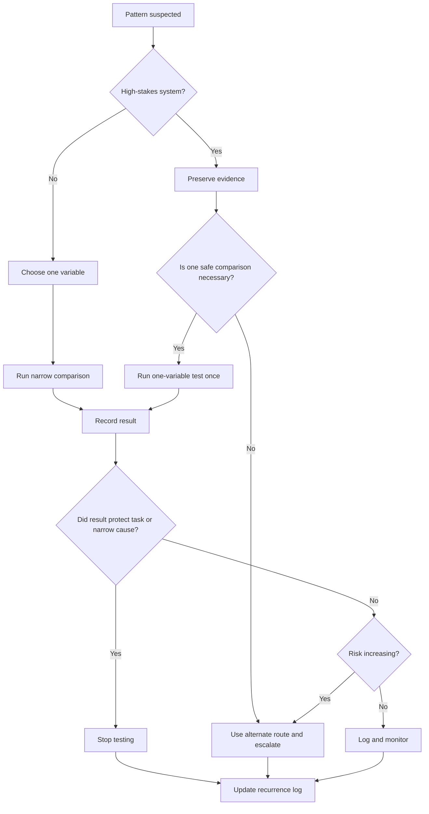

# 🧪 Testing Pattern Without Over-Testing  
**First created:** 2026-06-03 | **Last updated:** 2026-06-03  
*How to compare repeated glitches safely, without causing lockouts, overwrites, audit confusion, or exhaustion.*  

---

## 🌱 Purpose

Testing is useful.

Over-testing is dangerous.

When something weird repeats, it is tempting to keep poking the system until the pattern becomes undeniable.

One more upload.
One more login.
One more resend.
One more password reset.
One more form submission.
One more attempt to prove the door is broken by slamming into it.

Do not do that.

Repeated testing can create new problems:

* account lockouts;
* fraud flags;
* duplicate submissions;
* overwritten records;
* altered timestamps;
* corrupted files;
* rate limits;
* confusing audit trails;
* platform suspicion;
* institutional suspicion;
* panic spirals;
* exhaustion.

This node helps you test just enough to compare conditions, then stop.

The aim is not to win an argument with the machine.

The aim is to preserve a clean record and protect the real-world task.

---

## 🧭 What This Node Is For

Use this node when a glitch or blockage has repeated and you need to decide what to test next.

It is especially useful for:

* upload failures;
* login or MFA loops;
* password reset problems;
* message delivery issues;
* missing attachments;
* file changes;
* form submission failures;
* payment failures;
* appointment booking problems;
* account lockouts;
* access barriers near deadlines;
* repeated interface glitches.

This node is for safe comparison.

Not compulsive proof-hunting.

---

## 🧰 First Rule: Protect The Task Before The Pattern

If the system is high-stakes, your first job is not to prove the pattern.

Your first job is to protect the task.

High-stakes systems include:

* legal portals;
* complaint deadlines;
* court deadlines;
* medical records;
* safeguarding systems;
* housing;
* immigration;
* banking;
* benefits;
* employment;
* education;
* evidence submission;
* communication with solicitors, advisers, clinicians, journalists, support workers, or trusted witnesses.

If a failure affects one of these, do this:

```text
Preserve the failure state.
Try one safe alternate route.
Record what happened.
Escalate to a human or formal channel.
Stop hammering the broken route.
```

The deadline matters more than the experiment.

---

## 🧪 The One-Variable Rule

Good testing changes one thing at a time.

Bad testing changes everything at once.

Good:

```text
same device + different browser
```

Good:

```text
same browser + different network
```

Good:

```text
same account + different file
```

Bad:

```text
new device + new browser + new network + renamed file + different account + VPN off + different time
```

That may solve the problem, but it tells you almost nothing.

The point of comparison is to learn what the issue follows.

Does it follow the:

* device?
* browser?
* app?
* network?
* VPN?
* account?
* file?
* filename?
* file size?
* content?
* contact?
* time window?
* workflow step?
* location?

Change one variable.

Record the result.

Then stop or choose one next safe test.

---

## 🧾 Minimal Safe Test Log

Use this before testing.

```yaml
safe_test:
  reason_for_test: ""
  original_failure: ""
  high_stakes: true/false
  risk_if_retested: ""
  variable_to_change: ""
  what_stays_the_same:
    device: ""
    browser_or_app: ""
    network: ""
    account: ""
    file_or_content: ""
    contact: ""
    workflow_step: ""
    time_window: ""
  test_action: ""
  expected_result: ""
  actual_result: ""
  artifact_saved: ""
  interpretation: ""
  stop_condition: ""
  next_step: ""
```

Example:

```yaml
safe_test:
  reason_for_test: "Check whether upload failure is browser-specific"
  original_failure: "Evidence PDF fails at 99% during final submission"
  high_stakes: true
  risk_if_retested: "Could create duplicate failed submissions or affect complaint deadline"
  variable_to_change: "browser"
  what_stays_the_same:
    device: "Laptop"
    browser_or_app: "Change Firefox to Chrome"
    network: "Home Wi-Fi"
    account: "Main account"
    file_or_content: "Same evidence PDF"
    contact: ""
    workflow_step: "Final submission"
    time_window: "Morning deadline window"
  test_action: "Attempt upload once in Chrome"
  expected_result: "Upload succeeds if Firefox-specific"
  actual_result: "Failed again at 99%"
  artifact_saved: "screenshot_chrome_upload_failed_2026-06-03.png"
  interpretation: "Not only Firefox-specific"
  stop_condition: "Do not retry final submission again; use alternate route"
  next_step: "Request verified alternate submission route"
```

---

## 🧾 Plain English Version

```text
Why am I testing?
What failed before?
Is this high-stakes?
What could go wrong if I test again?
What one variable am I changing?
What is staying the same?
What exactly will I do?
What result would suggest?
What actually happened?
What artifact did I save?
What does this test show?
When do I stop?
What is the safer next step?
```

If you cannot answer “when do I stop,” do not start.

---

## 🚦 Test Limit By Risk

### 🟢 Low-risk systems

Examples:

* non-urgent social post;
* ordinary app glitch;
* low-stakes upload;
* harmless test file;
* non-essential account.

Safe test limit:

```text
A few narrow comparisons are usually fine.
```

Still record what changed.

### 🟡 Medium-risk systems

Examples:

* important but not urgent email;
* consumer complaint;
* booking;
* non-urgent admin form;
* subscription or service access.

Safe test limit:

```text
One or two comparisons, then contact support if unresolved.
```

### 🟠 High-risk systems

Examples:

* legal deadline;
* medical communication;
* safeguarding;
* academic submission;
* employment process;
* benefits or housing;
* evidence upload.

Safe test limit:

```text
Screenshot once.
Try one sensible alternate route or one narrow comparison.
Then escalate.
```

### 🔴 Critical systems

Examples:

* court filing deadline today;
* urgent medical care;
* safeguarding risk;
* account controlling essential money;
* evidence that may be overwritten;
* communication affecting safety or liberty.

Safe test limit:

```text
Do not experiment.
Preserve evidence.
Use verified alternate route.
Contact a human/formal channel immediately.
```

At red level, the experiment is not the priority.

Protection is.

---

## 🧪 Good Comparison Tests

### Browser test

Use when you suspect browser cache, extension, script, or compatibility issue.

```text
same device + same network + same account + same file + different browser
```

Good record:

```text
Failed in Firefox. Failed again in Chrome. Not only browser-specific.
```

### Network test

Use when you suspect Wi-Fi, mobile data, VPN, DNS, or local connection issue.

```text
same device + same browser + same account + same file + different network
```

Good record:

```text
Failed on home Wi-Fi. Failed again on mobile data. Not only home network-specific.
```

### Device test

Use when you suspect local device settings, storage, malware, app state, or operating system issue.

```text
same account + same file + same network + different device
```

Good record:

```text
Failed on laptop. Worked on phone. May be device/browser/app-specific.
```

### Account test

Use when safe and appropriate.

```text
same device + same network + same file + different account
```

Good record:

```text
Main account failed. Secondary account worked. May be account-specific.
```

Do not use someone else’s account without permission.

Do not create fake accounts if that violates rules or could create suspicion.

### File test

Use when upload or attachment failure may be file-specific.

```text
same account + same device + same network + different file
```

Good record:

```text
Evidence PDF failed. Neutral test PDF worked. May be file/content/metadata-specific.
```

### Filename test

Use when filename, special characters, case reference, or symbols may be causing failure.

```text
same file copy + simpler filename
```

Good record:

```text
Original filename failed. Renamed copy also failed. Not only filename-specific.
```

### Time test

Use when failures appear scheduled or windowed.

```text
same action + same conditions + different time
```

Good record:

```text
Failed at 09:12. Succeeded at 14:20. Timing may matter, but more evidence needed.
```

### Contact test

Use when messages fail with one recipient.

```text
same channel + neutral message + different contact
```

Good record:

```text
Message to adviser not received. Neutral message to other contact received. Contact/channel-specific issue possible.
```

Be careful not to send sensitive content unnecessarily.

---

## 🧯 Tests To Avoid

Avoid tests that create real-world mess.

### Do not repeatedly submit the same form

This can create:

* duplicate applications;
* duplicate complaints;
* conflicting timestamps;
* audit confusion;
* accusations of misuse.

### Do not repeatedly reset passwords

This can trigger:

* account lockouts;
* security reviews;
* recovery delays;
* MFA desync.

### Do not repeatedly upload high-stakes evidence

This can create:

* duplicate records;
* corrupted versions;
* overwritten metadata;
* uncertainty about authoritative files.

### Do not repeatedly message advisers with sensitive material

This can create:

* confidentiality risk;
* confusion over versions;
* distress;
* missed messages hidden in threads.

### Do not repeatedly test payments

This can trigger:

* fraud blocks;
* pending charges;
* card freezes;
* merchant flags.

### Do not repeatedly test medical or safeguarding routes

Use alternate verified contact routes instead.

Do not turn urgent care into an experiment.

---

## 🧷 Stop Conditions

A stop condition is the rule that tells you when testing ends.

Set it before you test.

Examples:

```text
Stop after one failed attempt at final submission.
```

```text
Stop if the account gives any lockout warning.
```

```text
Stop if the same failure repeats after browser switch.
```

```text
Stop if the test affects a deadline.
```

```text
Stop if the system creates a duplicate reference number.
```

```text
Stop if the task is medical, legal, safeguarding, financial, or evidence-related.
```

Good testing has brakes.

No brakes means no test.

---

## 🧾 Safe Comparison Table

```markdown
| Test # | What stayed the same | What changed | Result | What it suggests | Artifact | Stop/next step |
|---|---|---|---|---|---|---|
| 1 | Same account, file, device, network | Browser | Failed again | Not only browser-specific | screenshot | Stop final upload tests |
| 2 | Same account, file, browser | Network | Failed again | Not only home Wi-Fi | screenshot | Use alternate route |
| 3 | Same device, network, browser | File | Test file worked | May be file/content-specific | screenshot | Preserve evidence PDF |
```

---

## 🔬 What A Test Can And Cannot Show

A small test can show:

* the issue did or did not follow a variable;
* an ordinary explanation became more or less likely;
* an alternate route works;
* the problem is narrower than first thought;
* escalation is justified.

A small test cannot show:

* intent;
* actor identity;
* full technical cause;
* institutional motive;
* whether every future attempt will fail;
* whether the issue is definitely targeted.

Use careful language.

Good:

```text
The issue followed the account across device and network.
```

Not:

```text
This proves the account is being targeted.
```

Good:

```text
The evidence PDF failed while a neutral test PDF worked.
```

Not:

```text
The system is censoring my evidence.
```

The first version travels.

The second version may be true, false, or premature.

---

## 🧮 Interpreting Safe Tests

### If the issue disappears after one change

Example:

```text
Failed in Firefox, worked in Chrome.
```

Interpretation:

```text
May be browser, extension, cache, or compatibility issue.
```

Action:

```text
Use working route, note lightly unless high-stakes.
```

### If the issue follows the account

Example:

```text
Main account fails across devices and networks; secondary account works.
```

Interpretation:

```text
Account-specific issue possible.
```

Action:

```text
Log, preserve artifacts, contact account support or institution if impact warrants.
```

### If the issue follows the file

Example:

```text
Evidence PDF fails; test PDF works.
```

Interpretation:

```text
File-specific issue possible: corruption, size, metadata, content, naming, or validation.
```

Action:

```text
Preserve original, make a copy, avoid repeated destructive edits, use alternate route if high-stakes.
```

### If the issue follows the place

Example:

```text
Calls fail inside one building; work outside.
```

Interpretation:

```text
Location-specific signal/network issue possible.
```

Action:

```text
Use alternate location for important calls; log if pattern affects safety or access.
```

### If the issue follows the workflow step

Example:

```text
Everything works until final submit.
```

Interpretation:

```text
Submission gate, validation, permission, file, or server-side issue possible.
```

Action:

```text
Preserve screenshots and request support/remedy if high-stakes.
```

---

## 🟢 When To Stop And Move On

Stop testing and move on if:

* the issue resolves after ordinary fix;
* the task is low-stakes;
* no recurrence appears;
* service outage explains it;
* all users are affected equally;
* the result is boring and proportionate.

Action:

```text
Use the working route.
Note only if useful.
Spend attention elsewhere.
```

Your attention is a finite resource.

Do not donate it to every broken button.

---

## 🟡 When To Log And Monitor

Log and monitor if:

* the issue repeats;
* the cause is unclear;
* it affects important but not urgent work;
* one or two comparisons suggest selectivity;
* impact is annoying but not severe.

Action:

```text
Keep a recurrence log.
Do not over-test.
Run only safe comparisons.
```

---

## 🟠 When To Use Alternate Route

Use an alternate route if:

* a deadline is approaching;
* the same failure repeats after one sensible comparison;
* the original channel is unreliable;
* evidence or access could be prejudiced;
* communication with a professional or support person is disrupted.

Examples:

* email plus secure portal;
* phone call plus written confirmation;
* recorded delivery;
* in-person submission receipt;
* support ticket with reference number;
* solicitor/adviser forwarding route;
* official alternate upload route.

Record:

```text
Original route failed.
Alternate route used.
Confirmation received.
```

That protects the task.

---

## 🔴 When To Escalate Instead Of Testing

Escalate instead of testing when:

* legal deadline is live;
* medical care is affected;
* safeguarding is affected;
* essential money is affected;
* housing/immigration/employment/education access is affected;
* evidence may be lost;
* account lockout would cause serious harm;
* repeated attempts could make the record worse.

Escalation sentence:

```text
This route has failed repeatedly at the same stage. I have preserved evidence of the failure and am not continuing repeated attempts because this may affect the audit trail. Please provide a verified alternate route, preserve relevant logs if available, and confirm that my deadline/access position will not be prejudiced.
```

Plain.

Firm.

Useful.

---

## 🧼 Testing Hygiene

Good testing is:

* narrow;
* time-limited;
* low-risk;
* recorded;
* one variable at a time;
* stopped once it has answered the question;
* secondary to protecting the real task.

Bad testing is:

* frantic;
* repeated;
* undocumented;
* changing many variables;
* done inside high-stakes systems;
* done after lockout warnings;
* done to force certainty;
* done while exhausted.

A safe test asks:

```text
What one thing am I changing?
What result would matter?
What could this damage?
When do I stop?
```

---

## 🗂 Copy-Paste Safe Test Sheet

```markdown
## Safe Test Plan

**Original failure:**  
**Why test:**  
**High-stakes?** yes / no  
**Risk if retested:**  
**One variable to change:**  
**What stays the same:**  
**Exact test action:**  
**Expected result:**  
**Stop condition:**  

## Result

**Actual result:**  
**Artifact saved:**  
**What this suggests:**  
**What this does not prove:**  
**Next step:**  
```

---

## 🗺 Mini Flow



---

## 🌌 Constellations

🧪 🎛 🗓️ 🧮 🧯 — safe comparison; recurrence testing; stop conditions; clean records; harm prevention.

---

## ✨ Stardust

safe testing, over-testing, comparison checks, one-variable test, stop condition, audit trail, account lockout, duplicate submission, alternate route, evidence preservation

---

## 🏮 Footer

*🧪 Testing Pattern Without Over-Testing* is a living node of the **Polaris Protocol**.

It helps people compare repeated glitches without turning the test itself into the problem.

The discipline is simple:

```text
Change one thing.
Record the result.
Protect the task.
Stop before you make the trail worse.
```

> 📡 Cross-references:  
>  
> - [🎛 When A Glitch Repeats](./🎛_when_a_glitch_repeats.md) — *first doorway into recurrence discipline*  
> - [🗓️ Recurrence Log Template](./🗓️_recurrence_log_template.md) — *structured format for repeated anomalies*  
> - [🧮 Simple Pattern Counting](./🧮_simple_pattern_counting.md) — *basic counting before interpretation*  
> - [📊 Timeline Overlay Template](./📊_timeline_overlay_template.md) — *overlaying incidents with deadlines, posts, filings, or public events*  
> - [🪞 Same Time Same Place Same Failure](./🪞_same_time_same_place_same_failure.md) — *documenting repeated conditions*  
> - [🚩 Systematic Pattern Red Flags](./🚩_systematic_pattern_red_flags.md) — *when repetition deserves closer review*  
>  
> 🏮 Return To:  
>
> - [🎛 Systematic Patterns](./README.md)  
> - [🩻 Weirdness Screening](../README.md)  
> - [🌓 Signs & Symptoms](../../README.md)  
> - [🌌 Polaris Protocol - Root](../../../README.md)  

*Survivor authorship is sovereign. Containment is never neutral.*

_Last updated: 2026-06-03_  
