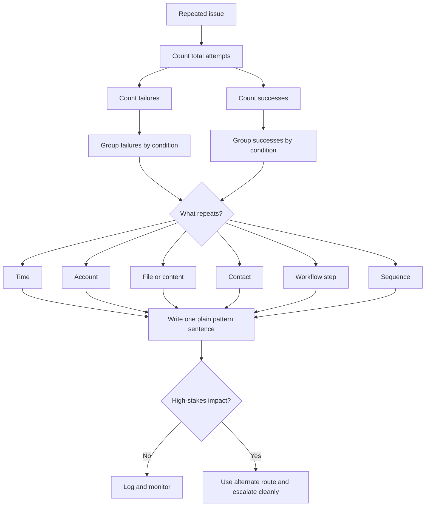

# 🧮 Simple Pattern Counting

**First created:** 2026-06-03 | **Last updated:** 2026-06-03  
*Basic counting and comparison methods for repeated glitches, without overbuilding the theory.*

---

## 🌱 Purpose

When something weird repeats, the brain wants meaning fast.

That is human.

It is also where mistakes happen.

A repeated glitch may be:

* ordinary maintenance;
* a flaky connection;
* a bad app update;
* a file-size problem;
* an account setting;
* a workflow bug;
* a platform rule;
* an institutional access issue;
* or something more selective and serious.

You do not need advanced statistics to begin.

Start by counting.

```text
How many times did it happen?
How many times did it not happen?
What conditions were present when it happened?
What conditions were absent when it did not happen?
```

Simple counting does not prove intent.

It gives the pattern enough shape to be checked, compared, explained, or escalated.

---

## 🧭 What This Node Is For

Use this node when you have more than one incident and need to make the recurrence clearer.

It helps with:

* repeated upload failures;
* recurring login loops;
* messages that fail with one contact;
* calls that cut at similar moments;
* forms that fail at the same step;
* files that change after the same action;
* posts that lose reach after similar content;
* service access that breaks near deadlines;
* several systems failing in a recognisable order.

This node sits between:

```text
“That was weird.”
```

and:

```text
“This is a documented pattern.”
```

It is the counting bridge.

---

## 🧰 The Counting Rule

Do not begin with:

```text
Why is this happening?
```

Begin with:

```text
What happened, how often, and under what conditions?
```

The first useful questions are:

* How many times did the issue happen?
* Over what date range?
* What was the same each time?
* What changed each time?
* How many successful attempts happened in the same period?
* Did it happen only with one account?
* Did it happen only with one file?
* Did it happen only with one contact?
* Did it happen only near one deadline?
* Did it happen only at one workflow step?
* Did it happen across device, browser, network, or account?

You are not trying to be fancy.

You are trying to be followable.

---

## 🧾 Minimal Count Table

Start with a plain table.

| # | Date/time | Symptom | System | Context | Fix tried | What repeated | Outcome |
|---|---|---|---|---|---|---|---|
| 1 |  |  |  |  |  |  |  |
| 2 |  |  |  |  |  |  |  |
| 3 |  |  |  |  |  |  |  |

Example:

| # | Date/time | Symptom | System | Context | Fix tried | What repeated | Outcome |
|---|---|---|---|---|---|---|---|
| 1 | 2026-06-01 09:12 | Upload failed at 99% | Complaint portal | Evidence PDF | Retry | Same file type + final stage | Failed |
| 2 | 2026-06-02 09:11 | Upload failed at 99% | Complaint portal | Evidence PDF | Browser switch | Same time + final stage | Failed |
| 3 | 2026-06-03 09:14 | Upload failed at 99% | Complaint portal | Evidence PDF | Restart | Same account + final stage | Failed |

Then write the counted pattern as one sentence:

```text
The upload failed three times over three days, each time around 09:10-09:15, at 99%, using the same account and evidence PDF.
```

That sentence is doing real work.

---

## 🟢 Count Successes Too

A pattern is clearer when you count what worked as well as what failed.

Do not only record failures.

Record successful comparisons.

Example:

| Date/time | Action | Account | File | Browser | Network | Outcome |
|---|---|---|---|---|---|---|
| 2026-06-03 09:14 | Upload evidence PDF | Main | evidence.pdf | Firefox | Home Wi-Fi | Failed at 99% |
| 2026-06-03 09:25 | Upload test PDF | Main | test.pdf | Firefox | Home Wi-Fi | Succeeded |
| 2026-06-03 09:31 | Upload evidence PDF | Main | evidence.pdf | Chrome | Mobile data | Failed at 99% |
| 2026-06-03 09:38 | Upload evidence PDF | Secondary | evidence.pdf | Chrome | Mobile data | Succeeded |

This does not prove anything by itself.

But it narrows the question.

The issue may not be:

```text
All uploads fail.
```

It may be:

```text
This file or this account fails under this route.
```

That is much more useful.

---

## 🎛 Count By Condition

Once you have several entries, count by repeated condition.

### Time

| Time window | Failures | Successes | Notes |
|---|---:|---:|---|
| 09:00-10:00 | 3 | 0 | All evidence upload attempts failed |
| 14:00-15:00 | 0 | 2 | Test uploads succeeded |
| 20:00-21:00 | 1 | 1 | Mixed result |

Plain sentence:

```text
Failures cluster in the 09:00-10:00 window, but later attempts have mixed or successful outcomes.
```

### Account

| Account | Failures | Successes | Notes |
|---|---:|---:|---|
| Main account | 4 | 1 | Fails at final submission |
| Secondary account | 0 | 2 | Upload route works |
| Guest/no login | 0 | 1 | Test route works |

Plain sentence:

```text
The failure appears mainly on the main account, while the same route works from secondary or guest access.
```

### File

| File/content | Failures | Successes | Notes |
|---|---:|---:|---|
| Evidence PDF | 3 | 0 | Fails at 99% |
| Renamed evidence PDF | 1 | 0 | Same failure |
| Smaller test PDF | 0 | 2 | Works normally |

Plain sentence:

```text
The failure follows the evidence PDF and renamed copy, but not smaller test PDFs.
```

### Workflow Step

| Workflow step | Failures | Successes | Notes |
|---|---:|---:|---|
| Login | 0 | 4 | Login works |
| Upload start | 0 | 4 | Upload begins normally |
| Upload progress | 0 | 4 | Progress reaches 99% |
| Final submission | 4 | 0 | Failure occurs at final gate |

Plain sentence:

```text
The system works until final submission; the repeated failure is at the final gate, not at login or upload start.
```

---

## 🧪 The Smallest Useful Comparison

You do not need a giant experiment.

Use one comparison at a time.

Good comparisons:

```text
same device + different browser
same device + different network
same network + different device
same account + different file
same file + different account
same action + different time
same message + different contact
same contact + different channel
```

Record the result simply:

| Test | Changed variable | Outcome | What it suggests |
|---|---|---|---|
| 1 | Browser | Still failed | Not only browser-specific |
| 2 | Network | Still failed | Not only home Wi-Fi |
| 3 | File | Test file worked | May be file/content-specific |
| 4 | Account | Secondary account worked | May be account-specific |

Do not pretend this proves more than it does.

It suggests where to look next.

---

## 🧮 Failure Rate

Sometimes a simple fraction helps.

```text
failure rate = failures / total attempts
```

Example:

```text
4 failures / 5 attempts = 80% failure rate
```

Use plain language:

```text
The evidence upload failed on four out of five attempts.
```

Do not overuse percentages when the numbers are tiny.

With small counts, this is clearer:

```text
It failed 4 out of 5 times.
```

than:

```text
It has an 80% failure rate.
```

The first sentence feels less fake-scientific.

Good.

---

## ⚖️ Compare Against Normal

A count only means something when compared to a baseline.

Ask:

* How often does this system usually fail?
* Did it work normally last week?
* Do other file types upload normally?
* Do other people report the same issue?
* Does the same account work for other tasks?
* Does the same task work on another account?
* Are there known outages or maintenance windows?
* Is this failure unusual for this service?

Example:

```text
The portal normally accepts PDFs of this size. In the past week, test PDFs uploaded successfully twice, but the evidence PDF failed three times at the same final step.
```

That is stronger than:

```text
The portal keeps failing.
```

Because it includes comparison.

---

## 🧷 Count Non-Events

A non-event is a time when the issue could have happened but did not.

These matter.

Example:

| Date/time | Condition present? | Expected issue | Outcome |
|---|---|---|---|
| 2026-06-01 09:12 | Evidence PDF + main account | Upload failure | Failed |
| 2026-06-02 09:11 | Evidence PDF + main account | Upload failure | Failed |
| 2026-06-03 09:14 | Evidence PDF + main account | Upload failure | Failed |
| 2026-06-03 14:20 | Test PDF + main account | Upload failure | Succeeded |
| 2026-06-03 14:35 | Evidence PDF + secondary account | Upload failure | Succeeded |

The successes help separate:

```text
The whole portal is broken.
```

from:

```text
The issue appears around this file/account combination.
```

Non-events stop the pattern becoming too broad.

---

## 🧯 Do Not Count Everything As One Pattern

A common mistake is to merge every bad thing into one giant blob.

Example of too broad:

```text
Everything fails when I try to do important things.
```

That may describe the emotional impact.

It is not yet a usable pattern.

Split by symptom:

* upload failures;
* login loops;
* missing messages;
* file timestamp changes;
* call drops;
* payment failures;
* interface refusal.

Then count each separately.

A cleaner version:

```text
There are three separate recurring symptoms: upload failure at final submission, missing outbound emails to one adviser, and MFA loops on the institutional account. They may or may not be connected.
```

That is disciplined.

It keeps the door open without forcing the conclusion.

---

## 🧱 Small Numbers Are Still Useful

You do not need huge datasets.

Three incidents can be enough to justify logging.

Three incidents are not enough to prove a grand theory.

Useful language:

```text
This is a small sample, but the repeated condition is specific.
```

```text
This does not prove cause, but it justifies preserving artifacts and using an alternate route.
```

```text
The count is low, so this should be treated as pattern-suspected, not proven interference.
```

That kind of honesty makes the record more credible.

---

## 🚩 What Counts As Interesting?

A count becomes more interesting when failures are selective.

More interesting:

* one account fails, another works;
* one file fails, another works;
* one contact never receives messages, others do;
* one workflow step fails repeatedly;
* one time window produces most failures;
* one topic or filename appears repeatedly;
* the failure survives device, browser, or network change;
* failures cluster near deadlines or escalation points.

Less interesting:

* everyone is affected;
* all files fail equally;
* all accounts fail equally;
* there is a known outage;
* the platform has announced maintenance;
* the device is generally unstable;
* the network is generally poor.

Less interesting does not mean fake.

It means the likely cause may be ordinary.

That is useful too.

---

## 🧾 Simple Count Summary

Use this template after a few entries.

```text
Between [date] and [date], [symptom] happened [number] times out of [total attempts] attempts. It happened when [conditions present]. It did not happen when [conditions absent / comparison successes]. Basic checks tried: [checks]. Current interpretation: [ordinary issue / worth logging / pattern suspected / escalate]. Next step: [action].
```

Example:

```text
Between 1 June and 3 June 2026, evidence upload failed three times out of three attempts. It happened when using the main account, the same evidence PDF, and the final submission step. It did not happen with a smaller test PDF. Basic checks tried: browser switch and restart. Current interpretation: pattern suspected around this file/account/workflow combination. Next step: use an alternate verified submission route and preserve the failure screenshots.
```

This is the sentence that can move into the recurrence log.

---

## 🗂 Counting Sheet Template

```markdown
| # | Date/time | Symptom | System | Account | File/content | Contact | Workflow step | Device | Network | Outcome | Artifact |
|---|---|---|---|---|---|---|---|---|---|---|---|
| 1 |  |  |  |  |  |  |  |  |  |  |  |
| 2 |  |  |  |  |  |  |  |  |  |  |  |
| 3 |  |  |  |  |  |  |  |  |  |  |  |
```

Then add:

```markdown
## Count Summary

- Total attempts:
- Failures:
- Successes:
- Failure condition:
- Success condition:
- Repeated feature:
- Basic checks tried:
- Current interpretation:
- Next step:
```

---

## 🗺 Mini Flow



---

## 🧼 Good Counting Hygiene

Good counting is:

* small;
* plain;
* specific;
* honest;
* separated by symptom;
* clear about what was tested;
* clear about what was not tested;
* careful with tiny samples;
* willing to record boring explanations.

Avoid:

* pretending small counts prove more than they do;
* merging every incident into one giant pattern;
* ignoring successful attempts;
* changing too many variables at once;
* counting feelings as events;
* counting guesses as observations;
* using percentages to make weak numbers look stronger;
* escalating before you can say what repeated.

The magic sentence remains:

```text
What repeated?
```

Then:

```text
How many times?
```

Then:

```text
Compared with what?
```

---

## 🌌 Constellations

🧮 🎛 🗓️ 🧪 📊 — simple counts; recurrence discipline; comparison checks; small samples; pattern summaries.

---

## ✨ Stardust

simple pattern counting, failure count, success count, recurrence table, comparison baseline, small sample discipline, repeated conditions, pattern summary, anomaly counting, evidence counting

---

## 🏮 Footer

*🧮 Simple Pattern Counting* is a living node of the **Polaris Protocol**.

It helps repeated weirdness become countable before it becomes interpretable: not advanced statistics, not panic arithmetic, just enough structure to say what happened, how often, under what conditions, and compared with what.

```text
Count failures.
Count successes.
Name the repeated condition.
Do not make the count carry more than it can.
```

> 📡 Cross-references:
>
> * [🩻 Weirdness Screening](../README.md) — *first-notice triage for ordinary glitches, persistent anomalies, and escalation-worthy weirdness*
> * [🎛 Systematic Patterns](./README.md) — *recurrence, timing, clustering, and comparison tools*
> * [🎛 When A Glitch Repeats](./🎛_when_a_glitch_repeats.md) — *first doorway into recurrence discipline*
> * [🗓️ Recurrence Log Template](./🗓️_recurrence_log_template.md) — *structured format for repeated anomalies*
> * [📊 Timeline Overlay Template](./📊_timeline_overlay_template.md) — *overlaying incidents with deadlines, posts, filings, or public events*
> * [🪞 Same Time Same Place Same Failure](./🪞_same_time_same_place_same_failure.md) — *documenting repeated conditions*
> * [🧪 Testing Pattern Without Over-Testing](./🧪_testing_pattern_without_over_testing.md) — *safe comparison without spiralling*
> * [🚩 Systematic Pattern Red Flags](./🚩_systematic_pattern_red_flags.md) — *when repetition deserves closer review*

*Survivor authorship is sovereign. Containment is never neutral.*
