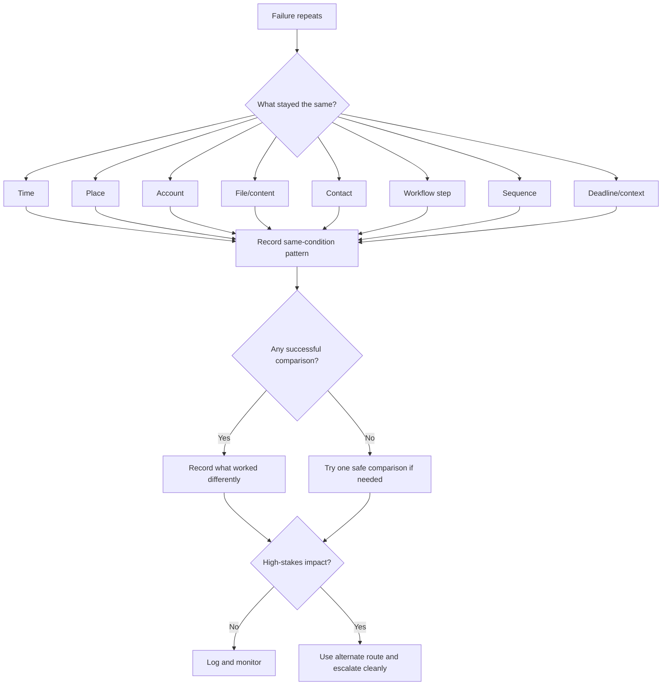

# 🪞 Same Time Same Place Same Failure

**First created:** 2026-06-03 | **Last updated:** 2026-06-03
*How to document repeated failures that recur under the same conditions.*

---

## 🌱 Purpose

Some glitches are annoying because they happen.

Some glitches matter because they happen again in the same shape.

Same time.
Same place.
Same account.
Same file.
Same contact.
Same workflow step.
Same sequence.
Same deadline window.
Same oddly specific failure.

That is when the repeated condition becomes the evidence object.

This node helps you document recurrence without jumping straight to certainty.

The core question is:

```text
What stayed the same?
```

Not:

```text
Who definitely caused this?
```

When the same failure keeps returning under the same conditions, the job is to preserve the shape clearly enough that someone else can understand, compare, troubleshoot, or escalate it.

---

## 🧭 What This Node Is For

Use this node when a failure repeats under recognisably similar conditions.

Examples:

* the same upload fails at the same percentage;
* the same login loop happens at the same stage;
* the same call drops in the same location;
* the same message fails with the same contact;
* the same file changes after the same kind of action;
* the same form fails after the same wording is entered;
* the same account locks near the same deadline;
* the same sequence happens after the same kind of post;
* the same service fails on the same route, device, network, or time window.

This is a recognition node.

It helps you say:

```text
This is not just “weird stuff keeps happening.”
This is the same failure under the same conditions.
```

That distinction matters.

---

## 🧰 First Rule: Same Does Not Mean Certain

Repeated similarity is useful.

It is not automatic proof of intent.

Good language:

```text
The same failure repeated at the same workflow step.
```

```text
The issue appears linked to this account, because the same action worked from another account.
```

```text
The pattern is specific enough to justify logging and alternate routing.
```

Avoid:

```text
This proves someone is blocking me.
```

```text
They are doing it every time.
```

```text
The place is definitely compromised.
```

Those may be hypotheses later.

The record starts with repeated conditions.

Keep the mirror clean.

---

## 🪞 The Mirror Test

When a failure repeats, ask whether the second incident mirrors the first.

Use this checklist:

```text
Did it happen at the same time?
Did it happen in the same place?
Did it involve the same account?
Did it involve the same file or content?
Did it involve the same contact?
Did it happen at the same workflow step?
Did the same sequence happen before or after it?
Did it happen near the same deadline, post, filing, or appointment?
Did the same fix fail?
Did the same alternate route work?
```

You do not need every answer to be yes.

One strong repeated condition may be enough to log.

Several repeated conditions may justify closer review.

---

## 🗓️ Same Time

A time pattern may involve:

* same hour;
* same minute range;
* same day of week;
* same point in the month;
* same interval after posting;
* same interval before a deadline;
* same time after logging in;
* same time after contacting a person or institution.

Example:

```text
Upload failure occurred between 09:10 and 09:15 on three consecutive mornings.
```

Useful record:

| Date       |  Time | Failure              | Time pattern            |
| ---------- | ----: | -------------------- | ----------------------- |
| 2026-06-01 | 09:12 | Upload failed at 99% | Morning deadline window |
| 2026-06-02 | 09:11 | Upload failed at 99% | Morning deadline window |
| 2026-06-03 | 09:14 | Upload failed at 99% | Morning deadline window |

Plain summary:

```text
The failure repeated in the same five-minute window across three days.
```

Careful interpretation:

```text
This may reflect a scheduled system issue, deadline traffic, or a more selective timing pattern. Check maintenance/outage evidence before escalating.
```

---

## 📍 Same Place

A place pattern may involve:

* same room;
* same building;
* same workplace;
* same public venue;
* same transport route;
* same neighbourhood;
* same Wi-Fi network;
* same mobile coverage area;
* same institutional site.

Example:

```text
Calls with the support worker cut out in the same public building, but other calls outside that building worked normally.
```

Useful record:

| Date/time        | Place                | Failure        | Comparison   |
| ---------------- | -------------------- | -------------- | ------------ |
| 2026-06-01 14:05 | Library meeting room | Call dropped   | Same contact |
| 2026-06-02 14:10 | Library meeting room | Call dropped   | Same contact |
| 2026-06-02 15:00 | Outside building     | Call completed | Same phone   |

Plain summary:

```text
The call failure repeated in the same building and did not repeat outside it.
```

Careful interpretation:

```text
This may indicate ordinary signal weakness, local Wi-Fi issues, building interference, or a more selective location-linked pattern. Compare before concluding.
```

---

## 🔑 Same Account

An account pattern may involve:

* same email;
* same phone number;
* same login;
* same institutional profile;
* same recovery method;
* same social account;
* same payment account;
* same cloud account.

Example:

```text
The main account loops MFA after password acceptance, while the secondary account logs in normally on the same device and network.
```

Useful record:

| Account   | Device | Network     | Action | Outcome  |
| --------- | ------ | ----------- | ------ | -------- |
| Main      | Laptop | Home Wi-Fi  | Login  | MFA loop |
| Main      | Phone  | Mobile data | Login  | MFA loop |
| Secondary | Laptop | Home Wi-Fi  | Login  | Success  |

Plain summary:

```text
The failure followed the main account across device and network, while a secondary account worked.
```

Careful interpretation:

```text
This supports treating the issue as account-specific, but not yet as intentional obstruction.
```

---

## 📂 Same File Or Content

A content pattern may involve:

* same file;
* same filename;
* same file type;
* same file size;
* same subject matter;
* same legal, medical, safeguarding, complaint, or evidence material;
* same links;
* same phrases;
* same attachment format.

Example:

```text
The evidence PDF failed at final upload, while a smaller neutral test PDF uploaded successfully.
```

Useful record:

| File/content         | Account | Browser | Network     | Outcome       |
| -------------------- | ------- | ------- | ----------- | ------------- |
| evidence.pdf         | Main    | Firefox | Home Wi-Fi  | Failed at 99% |
| evidence_renamed.pdf | Main    | Chrome  | Mobile data | Failed at 99% |
| test.pdf             | Main    | Firefox | Home Wi-Fi  | Success       |

Plain summary:

```text
The failure followed the evidence PDF and renamed copy, but not the neutral test PDF.
```

Careful interpretation:

```text
This could reflect file corruption, size limits, metadata issues, content filtering, or workflow-specific failure. Preserve the file and compare safely.
```

---

## 📬 Same Contact

A contact pattern may involve:

* same recipient;
* same sender;
* same adviser;
* same clinician;
* same solicitor;
* same journalist;
* same support worker;
* same institution;
* same group chat;
* same phone number.

Example:

```text
Emails to one adviser appear sent but are not received; emails to other contacts arrive normally.
```

Useful record:

| Date/time        | Contact | Channel | Message type | Outcome      |
| ---------------- | ------- | ------- | ------------ | ------------ |
| 2026-06-01 19:03 | Adviser | Email   | Legal update | Not received |
| 2026-06-03 18:42 | Adviser | Email   | Legal update | Not received |
| 2026-06-03 19:05 | Friend  | Email   | Neutral test | Received     |

Plain summary:

```text
The delivery issue repeated with the same adviser contact, while a neutral test email to another contact was received.
```

Careful interpretation:

```text
This supports logging a contact/channel-specific issue. Check spam, filters, address spelling, attachment size, and alternate channel receipts.
```

---

## 🧩 Same Workflow Step

A workflow-step pattern may involve:

* final submit;
* upload progress;
* payment authorisation;
* MFA approval;
* password reset link;
* document preview;
* save draft;
* publish button;
* confirmation screen;
* appointment booking final page.

Example:

```text
The portal accepts login, accepts file selection, uploads to 99%, then fails only at final submission.
```

Useful record:

| Workflow step      | Outcome |
| ------------------ | ------- |
| Login              | Success |
| File selected      | Success |
| Upload started     | Success |
| Upload reached 99% | Success |
| Final submission   | Failed  |

Plain summary:

```text
The system works until final submission; the repeated failure is at the final gate.
```

Careful interpretation:

```text
This is more specific than “the portal is broken.” It may indicate a validation, permission, file, account, or submission-state problem.
```

---

## 🔁 Same Sequence

A sequence pattern may involve several small failures in a recognisable order.

Example:

```text
Public post → interface glitch → login expiry → message failure.
```

Useful record:

| Step | Event                               | Time  |
| ---: | ----------------------------------- | ----- |
|    1 | Public post published               | 12:00 |
|    2 | Follow-up publish button greyed out | 12:18 |
|    3 | Account session expired             | 12:31 |
|    4 | Message to adviser failed           | 12:44 |

Plain summary:

```text
The same four-step sequence occurred after two similar public posts.
```

Careful interpretation:

```text
A repeated sequence is worth logging because it shows choreography, but each step still needs its own comparison checks.
```

Sequence is powerful.

It is also easy to overread.

Keep it clean.

---

## 🧪 Same Fix Fails

Sometimes the repeated condition is not only the failure.

It is that the same reasonable fix does not work.

Examples:

* browser switch does not help;
* mobile data does not help;
* clearing cache does not help;
* renamed file still fails;
* password reset still loops;
* alternate device still fails;
* resend still does not arrive.

Useful record:

| Fix tried      | Expected result | Actual result        |
| -------------- | --------------- | -------------------- |
| Browser switch | Upload succeeds | Failed at same stage |
| Mobile data    | Upload succeeds | Failed at same stage |
| Renamed file   | Upload succeeds | Failed at same stage |

Plain summary:

```text
The same failure persisted after browser switch, network switch, and file rename.
```

Careful interpretation:

```text
This suggests the issue may not be limited to browser, network, or filename. It does not yet identify cause.
```

---

## 🟢 Same Alternate Route Works

Just as important: record when another route works.

Examples:

* secure portal works when email fails;
* phone call works when web form fails;
* secondary account works when main account fails;
* neutral test file uploads when evidence file fails;
* in-person submission works when online route fails.

Useful record:

| Original route      | Outcome       | Alternate route          | Outcome   |
| ------------------- | ------------- | ------------------------ | --------- |
| Email to adviser    | Not received  | Secure portal message    | Received  |
| Main account upload | Failed        | Secondary account upload | Succeeded |
| Online form         | Submit failed | Phone support case       | Logged    |

Plain summary:

```text
The original route repeatedly failed, but the alternate route worked.
```

This matters because the system is not universally unavailable.

That can support troubleshooting, escalation, and deadline protection.

---

## 🧾 Same-Failure Record Template

Use this when a repeated condition appears.

```yaml
same_failure_record:
  pattern_name: ""
  date_range: ""
  timezone: ""
  failure_summary: ""
  repeated_conditions:
    time: ""
    place: ""
    account: ""
    file_or_content: ""
    contact: ""
    workflow_step: ""
    sequence: ""
    deadline_or_context: ""
    fix_that_failed: ""
    alternate_route_that_worked: ""
  incidents:
    - when: ""
      what_happened: ""
      system_or_service: ""
      repeated_condition_present: ""
      artifact: ""
      impact: ""
  comparison_checks:
    same_condition_successes:
      - ""
    different_condition_failures:
      - ""
    different_condition_successes:
      - ""
  current_interpretation: "ordinary / worth logging / pattern suspected / escalate"
  uncertainty: ""
  next_step: ""
```

---

## 🧾 Plain English Version

```text
Pattern name:
Date range:
Timezone:
Failure summary:

What stayed the same:
- Time:
- Place:
- Account:
- File/content:
- Contact:
- Workflow step:
- Sequence:
- Deadline/context:
- Failed fix:
- Working alternate route:

Incidents:
1.
2.
3.

Comparison checks:
- Same condition successes:
- Different condition failures:
- Different condition successes:

Current interpretation:
Uncertainty:
Next step:
```

---

## 🪞 Mirror Summary Sentence

Use this sentence when describing the pattern.

```text
The same failure repeated [number] times between [date] and [date], under the same [time/place/account/file/contact/workflow/sequence] condition: [condition]. It did not repeat when [comparison success], or this has not yet been tested. Current interpretation: [ordinary / worth logging / pattern suspected / escalate].
```

Example:

```text
The same upload failure repeated three times between 1 June and 3 June 2026, under the same file/account/workflow condition: the evidence PDF failed at 99% during final submission using the main account. It did not repeat with a smaller neutral test PDF. Current interpretation: pattern suspected; use alternate submission route and preserve artifacts.
```

This is strong because it is specific.

It does not need drama.

---

## 🧮 Same/Different Table

Use this to avoid mush.

| Condition        | Same each time? | Notes |
| ---------------- | --------------- | ----- |
| Time             |                 |       |
| Place            |                 |       |
| Account          |                 |       |
| File/content     |                 |       |
| Contact          |                 |       |
| Workflow step    |                 |       |
| Sequence         |                 |       |
| Deadline/context |                 |       |
| Fix tried        |                 |       |
| Alternate route  |                 |       |

Example:

| Condition        | Same each time? | Notes                       |
| ---------------- | --------------- | --------------------------- |
| Time             | Yes             | 09:10-09:15                 |
| Place            | Yes             | Home                        |
| Account          | Yes             | Main account                |
| File/content     | Yes             | Evidence PDF                |
| Contact          | N/A             | No contact involved         |
| Workflow step    | Yes             | Final upload                |
| Sequence         | Yes             | Reaches 99%, then fails     |
| Deadline/context | Yes             | Complaint deadline mornings |
| Fix tried        | No              | Different fixes tried       |
| Alternate route  | Yes             | Smaller test PDF worked     |

Then write:

```text
The stable conditions were time window, account, file, workflow step, and deadline context.
```

That is the pattern.

---

## 🚩 When Same-Same Becomes More Serious

A same-condition repeat deserves closer review when:

* it affects high-stakes access;
* it persists across device, browser, or network;
* it follows one account across environments;
* it follows one file across accounts;
* it repeats at the same workflow gate;
* it clusters around deadlines or escalation;
* neutral routes work while sensitive routes fail;
* alternate routes work but the original channel repeatedly collapses;
* the failure creates practical harm or delay.

This still does not prove intent.

It does justify more careful preservation, comparison, and escalation.

---

## 🟢 When Same-Same Is Probably Ordinary

A same-condition repeat may be ordinary if:

* the place has known bad signal;
* the time matches known maintenance;
* the file is too large;
* the file is corrupted;
* the account has an expired token;
* the browser has a broken extension;
* the contact has a filter or full inbox;
* the service status page confirms an outage;
* many unrelated users report the same issue.

Ordinary does not mean imaginary.

It means the fix may be simpler.

Log the impact if needed, but do not make the pattern carry more than it can.

---

## 🧯 Do Not Keep Recreating Harm

If the same failure affects a high-stakes system, do not keep recreating it just to prove it.

Especially avoid repeated testing in:

* legal portals;
* medical systems;
* safeguarding systems;
* banking;
* immigration;
* employment;
* education;
* evidence upload;
* account recovery;
* communication with advisers or clinicians.

Use the limit:

```text
Record the repeat.
Try one safe comparison.
Use an alternate route.
Escalate if impact requires it.
Stop hammering the failing gate.
```

A clean repeat record is better than a messy pile of self-inflicted lockouts.

---

## 🧷 Escalation Language

When the same failure keeps recurring, a clean escalation can say:

```text
The attached record shows the same failure recurring under the same conditions: [brief condition]. I am not asking you to determine cause at this stage. I need [specific remedy], preservation of relevant logs if available, and confirmation that [deadline/access/evidence/communication] will not be prejudiced.
```

Example:

```text
The attached record shows the same failure recurring under the same conditions: evidence PDF upload reaches 99% and fails at final submission using the main account. I am not asking you to determine cause at this stage. I need an alternate verified submission route, preservation of relevant logs if available, and confirmation that the complaint deadline will not be prejudiced.
```

Ask for protection.

Ask for remedy.

Do not lead with accusation unless you are already in a context where that is appropriate and evidenced.

---

## 🗂 Copy-Paste Same-Failure Table

```markdown
| # | Date/time | Failure | Same condition present | Different condition tested | Outcome | Artifact |
|---|---|---|---|---|---|---|
| 1 |  |  |  |  |  |  |
| 2 |  |  |  |  |  |  |
| 3 |  |  |  |  |  |  |
```

```markdown
## Same/Different Summary

Same each time:

- 

Different each time:

- 

Successful comparisons:

- 

Failed comparisons:

- 

Current interpretation:

- 

Next step:

- 
```

---

## 🗺 Mini Flow



---

## 🌌 Constellations

🪞 🎛 🗓️ 🧮 🧪 — repeated conditions; same/different comparison; recurrence logs; safe testing; escalation discipline.

---

## ✨ Stardust

same time same place, repeated failure, same condition, mirrored glitch, repeated workflow failure, account-specific failure, file-specific failure, contact-specific failure, same sequence, recurrence comparison

---

## 🏮 Footer

*🪞 Same Time Same Place Same Failure* is a living node of the **Polaris Protocol**.

It helps people document repeated failures by naming what stayed the same, what changed, what worked, and what still needs protecting.

Not proof by déjà vu.

Not dismissal by default.

Just the mirror question:

```text
What stayed the same?
```

> 📡 Cross-references:
>
> * [🩻 Weirdness Screening](../README.md) — *first-notice triage for ordinary glitches, persistent anomalies, and escalation-worthy weirdness*
> * [🎛 Systematic Patterns](./README.md) — *recurrence, timing, clustering, and comparison tools*
> * [🎛 When A Glitch Repeats](./🎛_when_a_glitch_repeats.md) — *first doorway into recurrence discipline*
> * [🗓️ Recurrence Log Template](./🗓️_recurrence_log_template.md) — *structured format for repeated anomalies*
> * [🧮 Simple Pattern Counting](./🧮_simple_pattern_counting.md) — *basic counting before interpretation*
> * [📊 Timeline Overlay Template](./📊_timeline_overlay_template.md) — *overlaying incidents with deadlines, posts, filings, or public events*
> * [🧪 Testing Pattern Without Over-Testing](./🧪_testing_pattern_without_over_testing.md) — *safe comparison without spiralling*
> * [🚩 Systematic Pattern Red Flags](./🚩_systematic_pattern_red_flags.md) — *when repetition deserves closer review*

*Survivor authorship is sovereign. Containment is never neutral.*
