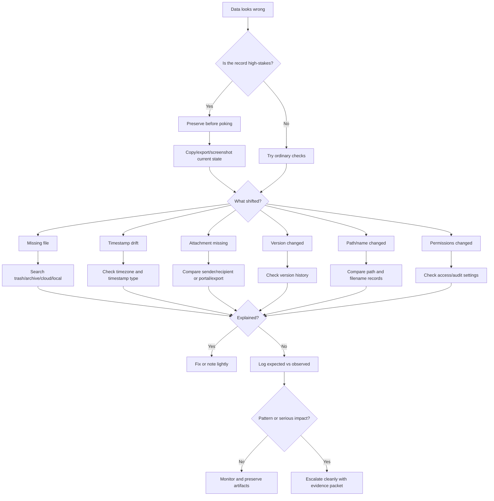

# 📂 Data Shifts  
**First created:** 2025-09-16 | **Last updated:** 2026-05-30  
*Record, file, timestamp, attachment, metadata, and version-history triage for when data appears to move, vanish, or rewrite itself.*

---

## 🌱 Purpose

This folder is for moments when the record does not look the way it should.

A file disappears.
A timestamp changes.
An attachment vanishes.
A draft reverts.
A folder path moves.
A record exports without its images.
A newer version is replaced by an older one.
A system shows one truth in one place and another truth somewhere else.

Most data shifts are ordinary.

Cloud sync is messy.
Apps autosave badly.
Email clients strip attachments.
Version histories can be confusing.
Export tools miss embedded files.
Different systems store different timestamps.
People rename things and forget.
Permissions change quietly after updates.

But data shifts matter because records are memory.

When files, metadata, or versions change around important evidence, complaints, medical records, legal material, safeguarding documents, employment records, or institutional correspondence, the shift needs to be handled carefully.

This folder helps people:

* check ordinary causes first;
* avoid accidentally overwriting evidence;
* preserve the failure state;
* compare versions cleanly;
* record what changed;
* and escalate when record integrity is at stake.

The rule here is simple:

> Preserve before poking.
> Compare before claiming.
> Escalate if the record matters.

---

## 🧭 What Belongs Here

Use this folder when the weirdness affects data integrity.

Examples include:

* missing files;
* missing attachments;
* stripped images;
* altered filenames;
* changed folder paths;
* unexpected duplicate records;
* timestamp drift;
* creation date or modified date changes;
* cloud sync conflicts;
* version history gaps;
* older drafts replacing newer drafts;
* exported records missing pages, images, attachments, or metadata;
* records appearing differently across devices, portals, inboxes, or accounts;
* files opening normally in one system but appearing corrupted in another;
* unexpected permission changes;
* deleted records reappearing;
* records disappearing after complaint, escalation, access request, or evidence upload.

If the issue is mainly about network upload or download failure, route to:

```text
../🌐_Connection_Hiccups/
```

If it is mainly about messages or attachments not arriving, route to:

```text
../📬_Comms_Breaks/
```

If it is mainly about login, permissions, or blocked access to a record system, route to:

```text
../🔑_Access_Barriers/
```

If it is mainly about repeated timing, route to:

```text
../🎛_Systematic_Patterns/
```

Data Shifts is for the record itself.

Other folders may explain how the record failed to move, send, open, or display.

---

## 🧰 Obvious Small Fixes First

Before treating a data shift as suspicious, check the ordinary explanations.

### Basic checks

* Look in trash, archive, deleted items, and spam.
* Check whether the file was moved rather than deleted.
* Search by filename, extension, and a phrase from the content.
* Check version history.
* Check cloud sync status.
* Check whether you are viewing the correct account.
* Check whether you are viewing local storage or cloud storage.
* Check whether the file is sorted by name, date, size, or type.
* Check whether filters are hiding records.
* Check whether permissions changed.
* Check whether an app update changed the view.
* Check whether a document exported in a reduced or preview format.
* Check whether attachments were blocked because of file size or type.

### For timestamps

* Check the timezone.
* Check whether the system shows created, modified, uploaded, received, sent, accessed, or exported time.
* Check whether daylight saving time applies.
* Check whether one system uses UTC and another uses local time.
* Check whether opening the file caused an automatic modified timestamp.
* Check whether cloud sync re-saved the file.

### For missing attachments

* Check original message thread.
* Check webmail and local mail client.
* Check whether the attachment was replaced by a cloud link.
* Check whether the file type was blocked.
* Check whether the attachment exceeded size limits.
* Ask the sender to confirm what was attached.
* Compare sender and recipient screenshots if possible.

These checks are not dismissal.

They protect the evidence from being inflated, muddied, or accidentally overwritten.

---

## 🛑 Preserve Before Poking

Data problems are easy to make worse.

Before opening, editing, re-saving, syncing, converting, or re-uploading a questionable record, preserve what you can.

Useful preservation steps:

* take screenshots of the current state;
* note the visible filename, path, timestamp, and file size;
* copy the file rather than editing the original;
* download/export a copy if available;
* save version history screenshots;
* preserve the email or portal page showing the record;
* avoid repeatedly opening files if opening may update metadata;
* avoid renaming the original until you have recorded the old name;
* avoid deleting duplicates until you know which is authoritative;
* do not “clean up” the folder before logging what happened.

For high-stakes records, do not rush to fix the file before recording the damage.

Sometimes the broken state is the evidence.

---

## 🧪 Comparison Tests

Use comparison to locate the shift.

| Test                                      | What it helps distinguish                        |
| ----------------------------------------- | ------------------------------------------------ |
| Same file on another device               | Local cache problem vs actual record change      |
| Web portal vs downloaded copy             | Display issue vs exported record issue           |
| Local copy vs cloud copy                  | Sync conflict vs local alteration                |
| Sender screenshot vs recipient screenshot | Comms issue vs record alteration                 |
| Current version vs version history        | Active change vs older record confusion          |
| File size before/after                    | Content loss or attachment stripping             |
| Filename/path before/after                | Move, rename, relink, or duplication             |
| Export format comparison                  | PDF/export tool issue vs underlying record issue |
| Hash/checksum comparison                  | Whether two files are exactly identical          |

Use the smallest comparison that answers the next useful question.

Do not change five variables at once.

---

## 🧾 What To Record

For data shifts, the most important thing is the before/after comparison.

Record:

* date and time noticed;
* date and time last known normal;
* system, app, platform, or portal;
* account used;
* device used;
* filename;
* file path or record location;
* record ID, reference number, message ID, or case number if available;
* expected content;
* observed content;
* expected timestamp;
* observed timestamp;
* expected attachment count;
* observed attachment count;
* file size before and after if known;
* version history status;
* permissions status;
* who else had access if known;
* what action happened immediately before the shift;
* screenshots, exports, logs, hashes, or copies;
* practical impact.

Write what changed in plain language.

Good:

```text
Expected three attachments. Export contains one attachment. Sender screenshot shows three attachments at 14:03.
```

Less useful:

```text
They deleted my evidence.
```

That may be the eventual concern, but the record needs the observable change first.

---

## 🧾 Minimal Data Shift Log

```yaml
when_noticed: 2026-05-30T20:05:00+01:00
category: "data_shift"
system_or_platform: ""
account: ""
device: ""
record_or_file_name: ""
record_id_or_reference: ""
location_or_path: ""
last_known_normal: ""
expected_state:
  filename: ""
  path: ""
  timestamp: ""
  file_size: ""
  attachment_count: ""
  content_summary: ""
observed_state:
  filename: ""
  path: ""
  timestamp: ""
  file_size: ""
  attachment_count: ""
  content_summary: ""
what_changed: ""
action_before_change: ""
version_history_checked: null
permissions_checked: null
comparison_tests:
  other_device: null
  web_vs_local: null
  sender_vs_recipient: null
  version_history: null
  checksum: null
artifacts:
  - ""
impact: ""
next_step: ""
```

---

## 🧮 Basic Checksum Note

A checksum is a short digital fingerprint of a file.

If two copies of a file have the same checksum, they are very likely identical.

If the checksums differ, something about the file differs.

You do not need checksums for every ordinary glitch.

They are useful when:

* evidence must be preserved;
* a file may have been altered;
* two copies need comparison;
* a record may need legal, technical, or institutional review;
* you need to prove a file stayed stable after a certain point.

Basic principle:

```text
Copy first.
Hash the copy.
Record the hash.
Do not edit the preserved copy.
```

A checksum does not explain why a file changed.

It only helps show whether it did.

---

## 📜 Chain Of Custody Basics

Chain of custody means the record of what happened to evidence.

For everyday use, keep it simple.

Track:

* where the file came from;
* when you received or created it;
* where you stored it;
* whether you copied it;
* whether you renamed it;
* whether you opened, exported, converted, or edited it;
* who you sent it to;
* what version is now authoritative.

A basic chain-of-custody note might say:

```text
Downloaded from portal at 2026-05-30 20:05 BST.
Saved original as evidence_original.pdf.
Copied working version as evidence_working_copy.pdf.
Original not edited.
Screenshot of portal saved.
```

This is not fancy.

It is how you stop the record becoming soup.

---

## 🚦 When To Ignore, Log, Or Escalate

### 🟢 Ordinary shift

Likely ordinary if:

* the file is found in trash, archive, or another folder;
* the timestamp change is explained by timezone, sync, or opening the file;
* missing attachments are explained by size or file-type limits;
* version history clearly shows your own edit;
* the problem affects many unrelated users;
* it has low impact.

Action:

* fix the filing issue;
* make a brief note only if useful.

---

### 🟡 Worth logging

Log the shift if:

* the record matters;
* the change has no clear explanation;
* evidence, complaint, medical, legal, employment, safeguarding, financial, or institutional material is affected;
* before/after states differ materially;
* attachments, timestamps, version history, or permissions changed unexpectedly;
* the same type of shift happens more than once;
* other users see a different version.

Action:

* preserve screenshots;
* export or copy the current state;
* record expected vs observed;
* check version history;
* avoid overwriting the original.

---

### 🟠 Pattern suspected

Treat as pattern-suspected if:

* records shift after specific submissions, complaints, deadlines, or requests;
* version reversals happen repeatedly;
* attachments disappear from one side but not another;
* timestamps align with unrelated escalation events;
* permissions change around sensitive material;
* downloaded copies and portal copies diverge repeatedly;
* records alter after access requests or formal complaints.

Action:

* build a timeline;
* compare across systems;
* preserve original copies;
* use checksums where useful;
* consider technical, legal, union, advocate, adviser, or data-protection review.

---

### 🔴 Escalate now

Escalate promptly if:

* evidence has disappeared or changed;
* legal, medical, safeguarding, immigration, employment, housing, financial, or education records are affected;
* a deadline depends on the missing or altered record;
* the record is needed for a complaint, investigation, hearing, appointment, or appeal;
* a system’s version may be used against you;
* there is risk of losing the authoritative copy.

Action:

* stop editing the record;
* preserve what exists;
* use an alternate route to submit or confirm the issue;
* contact the data controller, records office, platform, institution, solicitor, adviser, or relevant support route;
* ask for restoration, audit trail, confirmation, or correction.

---

## 🚩 Data Shift Red Flags

One red flag is not proof.

Several together deserve care.

Watch for:

* modified dates changing without clear action;
* creation dates later than they should be;
* records reverting to older versions;
* attachments disappearing without error messages;
* file names or paths changing during disputes or deadlines;
* exports missing content visible in the portal;
* different users seeing materially different records;
* version history gaps;
* permission changes around sensitive files;
* duplicates appearing with subtle differences;
* logs disappearing after a complaint;
* timestamps aligning too neatly with escalation events;
* official explanations that do not match the metadata.

The question is:

```text
What changed, where, and compared with what?
```

Not:

```text
What do I fear happened?
```

The comparison carries the claim.

---

## 🗂 Planned / Existing Nodes

| Node                                  | Scope                                                          | Status             |
| ------------------------------------- | -------------------------------------------------------------- | ------------------ |
| `📂_missing_file_triage.md`           | What to do when a file or record cannot be found               | Planned            |
| `🕰️_timestamp_drift_triage.md`       | Created/modified/uploaded/accessed time confusion              | Planned            |
| `📎_attachment_disappeared_triage.md` | Missing or stripped attachments                                | Planned            |
| `🧾_version_history_checklist.md`     | How to inspect and preserve version history                    | Planned            |
| `🧮_basic_checksum_guide.md`          | Simple file hashing for evidence preservation                  | Planned            |
| `📜_chain_of_custody_basics.md`       | Everyday custody notes for important records                   | Planned            |
| `🚩_data_shift_red_flags.md`          | Escalation cues for record integrity issues                    | Planned            |
| `📊_version_drift_index.md`           | Audit ledger for recurring version or timestamp mismatches     | Existing / planned |
| `🧮_checksum_registry.md`             | Library of cryptographic hashes for preserved files            | Existing / planned |
| `🪞_phantom_versions_casebook.md`     | Case studies of records reverting or splitting between systems | Existing / planned |
| `🧾_record_mirroring_experiments.md`  | Controlled duplication tests for suspected overwrites          | Existing / planned |
| `🔍_diff_visualisation_templates.md`  | Templates for comparing revisions                              | Existing / planned |
| `📜_chain_of_custody_audit.md`        | Checklist for record continuity and review                     | Existing / planned |

---

## 🧪 Suggested First-Build Set

For the first practical build, prioritise:

```text
📂_missing_file_triage.md
🕰️_timestamp_drift_triage.md
📎_attachment_disappeared_triage.md
🧾_version_history_checklist.md
📜_chain_of_custody_basics.md
```

These five give users the most immediate protection: find the record, understand timestamp weirdness, check missing attachments, preserve version history, and keep the evidence from turning into soup.

---

## 🗺 Mini Routing Diagram



---

## 🌌 Constellations

🩻 📂 🧮 📜 🕯️ — record integrity; metadata drift; evidence preservation; chain of custody; counter-erasure.

---

## ✨ Stardust

data integrity, missing file, timestamp drift, attachment loss, version history, metadata anomaly, evidence preservation, checksum, chain of custody, record correction

---

## 🏮 Footer

*📂 Data Shifts* is a living node of the **Polaris Protocol**.
It holds the record-integrity layer of Weirdness Screening: the place where missing files, altered timestamps, vanished attachments, version drift, and quiet metadata changes are preserved before they can disappear into “probably nothing.”

> 📡 Cross-references:
>
> * [🩻 Weirdness Screening](../README.md) — *parent triage doorway for ordinary glitches, persistent anomalies, and escalation-worthy weirdness*
> * [🎛 Systematic Patterns](../🎛_Systematic_Patterns/) — *recurrence, timing, and clustering analysis*
> * [📬 Comms Breaks](../📬_Comms_Breaks/) — *message, call, and attachment disruption*
> * [🔑 Access Barriers](../🔑_Access_Barriers/) — *login, MFA, permission, and submission barriers*
> * [🌐 Connection Hiccups](../🌐_Connection_Hiccups/) — *network, upload, signal, and router-level anomalies*
> * [🖥 Interface Glitches](../🖥_Interface_Glitches/) — *visible UI refusal, cursor oddities, and broken forms*

*Survivor authorship is sovereign. Containment is never neutral.*

*Last updated: 2026-05-30*
