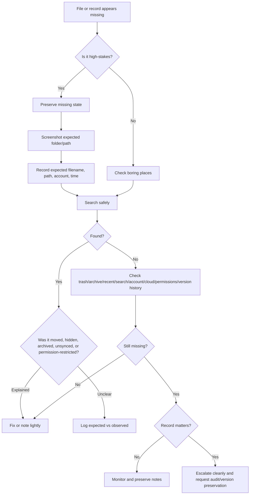

# 📂 Missing File Triage

**First created:** 2026-06-03 | **Last updated:** 2026-06-03  
*What to do when a file, record, draft, export, folder item, or document appears to have vanished.*

---

## 🌱 Purpose

A missing file can make the nervous system go loud.

Especially when the file matters.

Evidence.  
Complaint material.  
Medical records.  
Legal documents.  
Safeguarding notes.  
Employment records.  
Academic submissions.  
Institutional correspondence.  
A draft you swear existed yesterday.

Most missing files are ordinary.

They get moved.  
They get archived.  
They sit in the wrong account.  
They hide behind filters.  
They sync badly.  
They save locally when you thought they saved to cloud.  
They sit in a trash folder wearing a false moustache.

But records are memory.

When a file matters, do not rush straight to fixing, recreating, renaming, restoring, or tidying.

First preserve what you can see.

Then compare.

Then decide what level of response is proportionate.

The rule is:

```text
Preserve before poking.
Search before recreating.
Compare before claiming.
Escalate if the record matters.
```

---

## 🧭 What This Node Is For

Use this node when a file or record cannot be found where you expect it to be.

Examples:

* a document is missing from a folder;
* a draft has vanished;
* a cloud file does not appear on one device;
* a portal record is missing;
* an export does not include an expected file;
* a folder path has changed;
* a file was present yesterday and is absent today;
* a document appears in search but not in the folder;
* a record exists in one system but not another;
* a file has been replaced by an older or empty version;
* a submission receipt points to a file that no longer opens;
* a file disappears after complaint, evidence upload, access request, or deadline activity.

This node is not for proving deletion.

It is for finding out whether the file is truly missing, moved, hidden, unsynced, filtered, permission-blocked, archived, overwritten, or deleted.

---

## 🛑 First Rule: Do Not Recreate It Yet

When a file appears missing, the instinct is to make a new version quickly.

Be careful.

Recreating too soon can create:

* duplicate records;
* confusing filenames;
* altered timestamps;
* overwritten drafts;
* loss of the original trail;
* uncertainty about which copy is authoritative;
* a weaker evidence record.

Before recreating, record the missing state.

Save:

* screenshot of the folder or portal where the file should be;
* current date and time;
* expected filename;
* expected path;
* expected file type;
* expected last modified date if known;
* search terms tried;
* account used;
* device used;
* network or cloud sync status;
* any error message;
* any record ID, case number, upload receipt, or link.

Sometimes the absence is the evidence.

Do not tidy it away before you have logged it.

---

## 🧾 Minimal Missing File Log

Use this when a file first appears missing.

```yaml
when_noticed: ""
timezone: ""
category: "missing_file"
system_or_platform: ""
account: ""
device: ""
network_or_sync_status: ""
expected_file_name: ""
expected_file_type: ""
expected_location_or_path: ""
expected_last_seen: ""
expected_content_summary: ""
record_id_or_reference: ""
what_is_missing: ""
what_was_checked:
  trash_or_deleted_items: null
  archive: null
  spam_or_junk: null
  recent_files: null
  filename_search: null
  content_search: null
  file_extension_search: null
  other_account: null
  other_device: null
  web_vs_local: null
  cloud_sync_status: null
  filters_or_sorting: null
  permissions: null
  version_history: null
artifacts:
  - ""
impact: ""
risk_level: "green / yellow / orange / red"
next_step: ""
notes: ""
```

---

## 🧾 Plain English Version

```text
Date/time noticed:
Timezone:
System/platform:
Account:
Device:
Where the file should be:
Expected filename:
Expected file type:
Last known normal:
What should be in it:
What is missing:
Searches/checks tried:
Screenshots/artifacts saved:
Impact:
Risk level:
Next step:
Notes:
```

Use whichever version you will actually fill in.

A rough log beats a perfect log that never happens.

---

## 🧰 First Search: Boring Places

Start with ordinary explanations.

Check:

* trash;
* deleted items;
* archive;
* spam or junk;
* recent files;
* downloads folder;
* desktop;
* documents folder;
* cloud drive root folder;
* shared-with-me folder;
* local-only folders;
* offline files;
* unsynced folders;
* duplicate project folders;
* old export folders;
* browser downloads;
* email attachments;
* portal messages;
* mobile app storage;
* another device;
* another account.

Do not just click around randomly.

Record what you checked.

Example:

```text
Checked Google Drive trash, local Downloads, recent files, and project folder. File not found under expected filename.
```

That is useful later.

---

## 🔍 Search By Filename, Extension, And Content

A file may be present under a different name.

Search by:

* exact filename;
* partial filename;
* likely old filename;
* file extension;
* unusual phrase from the document;
* case reference;
* date;
* sender name;
* recipient name;
* project name;
* file type.

Examples:

```text
filename: evidence_bundle
```

```text
extension: .pdf
```

```text
phrase: "complaint reference"
```

```text
date: 2026-06-03
```

```text
sender: records.office@example.org
```

If the search finds a file, do not immediately rename or move it.

First record where it was found.

```text
Found file under /Downloads/export_final_2.pdf rather than expected /Evidence/evidence_bundle.pdf.
```

That tells you whether the issue was disappearance, misfiling, duplicate export, or naming drift.

---

## 🧭 Check The Account

A common cause of missing files is wrong account context.

Check whether you are looking at:

* personal account;
* work account;
* school or university account;
* institutional portal account;
* shared drive;
* local device account;
* browser profile;
* cloud account;
* mobile app account.

Examples:

```text
File missing from personal drive, but present in institutional drive.
```

```text
Portal record visible under old email login, not current email login.
```

```text
Browser profile A shows the file; browser profile B does not.
```

Useful sentence:

```text
The file was not missing; it was visible only under [account/profile].
```

That is still worth noting if it caused delay or risk.

---

## ☁️ Check Local Versus Cloud

A file can exist locally but not in the cloud, or in the cloud but not locally.

Compare:

| View | Checked? | Result |
|---|---|---|
| Local folder |  |  |
| Cloud web interface |  |  |
| Cloud desktop sync folder |  |  |
| Mobile app |  |  |
| Other device |  |  |

Common causes:

* sync paused;
* sync conflict;
* offline-only file;
* cloud-only placeholder;
* file too large to sync;
* account signed out;
* folder excluded from sync;
* network unavailable;
* storage full;
* app update changed sync settings.

Good record:

```text
File visible in cloud web interface but absent from local sync folder. Sync status showed paused.
```

Or:

```text
File present locally but absent from cloud web interface. Possible unsynced local copy.
```

Do not delete either copy until you know which one is authoritative.

---

## 🗂 Check Sorting And Filters

Sometimes a file is not missing.

The view is lying by omission.

Check:

* sorted by name;
* sorted by modified date;
* sorted by created date;
* filtered by file type;
* filtered by owner;
* filtered by shared status;
* filtered by date;
* hidden files;
* archived records;
* completed/closed records;
* old folder view;
* collapsed sections;
* search scope limited to current folder.

Good sentence:

```text
File reappeared when filter changed from PDFs only to all files.
```

or:

```text
Record was hidden under closed/completed cases, not active cases.
```

That is an ordinary explanation, but still important if it caused high-stakes delay.

---

## 🔐 Check Permissions

A file may be present but no longer visible to you.

Check:

* permission changed;
* owner changed;
* link access changed;
* shared drive membership changed;
* organisation policy changed;
* file moved into restricted folder;
* portal role changed;
* account lost entitlement;
* session expired;
* access removed after deadline or case closure.

Signs of permission issue:

* file appears in recent list but will not open;
* link says access denied;
* folder count changes but file not visible;
* another person can see it but you cannot;
* portal shows record exists but details are unavailable;
* download button missing;
* preview blocked.

Good record:

```text
File link still exists, but access changed from visible to access denied.
```

This is not the same as deletion.

Route access problems to `🔑_Access_Barriers/` if the main issue is permission or login.

Keep it here if the main concern is record visibility or integrity.

---

## 🧾 Check Version History Before Restoring

If the file exists but appears empty, older, shortened, reverted, or wrong, do not immediately restore it.

First check:

* version history;
* edit history;
* file activity;
* last modified by;
* restore points;
* local backups;
* cloud conflict copies;
* autosave history.

Record:

```text
Current version appears empty. Version history shows previous content at 2026-06-02 18:41.
```

If possible, screenshot the version list before restoring.

Restoring may solve the immediate problem but erase useful information about how the shift appeared.

For version problems, route to:

```text
./🧾_version_history_checklist.md
```

---

## 📎 Check Attachments And Exports

A file may not be missing from storage.

It may be missing from an export, message, or attachment bundle.

Check:

* original message thread;
* webmail versus local mail app;
* sender screenshot;
* recipient screenshot;
* export settings;
* attachment count;
* file size before and after export;
* whether attachments became cloud links;
* whether embedded images were omitted;
* whether the export tool skipped unsupported file types.

Good record:

```text
Portal shows three attachments, but downloaded export contains one PDF and no images.
```

or:

```text
Sender screenshot shows attachment present at 14:03; recipient inbox shows no attachment at 14:07.
```

For missing attachments, route to:

```text
./📎_attachment_disappeared_triage.md
```

---

## 🧪 Safe Comparison Checks

Use comparison to locate the missing-file problem.

| Comparison | What it helps distinguish |
|---|---|
| Same account, different device | Local display/cache issue vs account-level absence |
| Same device, different account | Account visibility issue |
| Web portal vs local app | Sync/display issue |
| Local folder vs cloud folder | Sync conflict |
| Recent files vs folder path | Moved file vs deleted file |
| Search by content vs search by filename | Rename/path issue |
| Trash/archive vs active folder | Deleted/archived file |
| Version history vs current file | Reverted/empty version |
| Sender vs recipient screenshots | Attachment/comms issue |

Change one variable at a time.

Do not rename, restore, or re-upload until you have recorded what you saw.

---

## 🧯 Do Not Make The Trail Worse

Avoid:

* recreating the file with the same name;
* deleting duplicates;
* emptying trash;
* renaming suspected copies;
* restoring older versions before screenshots;
* repeatedly opening a file if this changes metadata;
* re-exporting over the original;
* converting files before preserving originals;
* moving everything into a “tidy” folder;
* clearing caches before recording what the cache showed;
* asking multiple people to edit at once.

A messy folder can be fixed later.

A destroyed evidence trail cannot.

---

## 🚦 Risk Levels

### 🟢 Green — Ordinary / Low Concern

Use when:

* file is found in trash/archive/recent files;
* wrong account explains it;
* sync pause explains it;
* filter/sort explains it;
* no important record is affected;
* impact is low.

Action:

```text
Fix the filing issue. Note lightly if useful.
```

### 🟡 Yellow — Worth Logging

Use when:

* the file matters;
* the missing state has no clear explanation;
* the file was missing long enough to cause delay;
* the file is connected to a complaint, record, deadline, or important process;
* the same kind of missing-file issue has happened before.

Action:

```text
Make a missing-file log. Preserve screenshots. Continue ordinary checks.
```

### 🟠 Orange — Pattern Suspected

Use when:

* files disappear after similar actions;
* missing files cluster around deadlines, complaints, access requests, or submissions;
* the file is absent in one system but present in another;
* version history or activity logs look incomplete;
* permissions change unexpectedly around the file;
* repeated comparison suggests selectivity by account, folder, topic, or route.

Action:

```text
Build a timeline. Preserve copies. Check version history. Consider technical or procedural review.
```

### 🔴 Red — Escalate Promptly

Use when:

* evidence is missing;
* legal, medical, safeguarding, financial, housing, immigration, employment, education, or institutional records are affected;
* a deadline depends on the file;
* the file may be used in a complaint, investigation, hearing, appointment, appeal, or support process;
* the authoritative copy may be lost;
* continued testing or editing could make the record worse.

Action:

```text
Stop editing. Preserve what exists. Use alternate route if needed. Escalate to the responsible person or body.
```

---

## 🧷 Clean Escalation Sentence

When reporting a missing file, use plain language.

```text
A file expected at [location/path] was not visible when checked at [date/time]. I have preserved screenshots of the missing state and checked [basic checks]. The file is needed for [purpose/deadline]. Please confirm whether it was moved, deleted, permission-restricted, archived, or otherwise altered, and preserve any relevant audit/version logs.
```

Example:

```text
A file expected in the complaint portal evidence folder was not visible when checked at 09:14 on 3 June 2026. I have preserved screenshots of the missing state and checked the active folder, archive view, and current account. The file is needed for a live complaint deadline. Please confirm whether it was moved, deleted, permission-restricted, archived, or otherwise altered, and preserve any relevant audit/version logs.
```

Ask for:

* location;
* restoration;
* audit trail;
* version history;
* permission check;
* deadline protection;
* confirmation in writing.

Do not lead with accusation.

Lead with record integrity.

---

## 🧾 Missing File Summary Template

```text
Between [date/time] and [date/time], [file/record] could not be found in [expected location]. Checked: [checks]. Found/not found: [result]. Expected state: [what should exist]. Observed state: [what was visible]. Impact: [practical harm]. Current level: [ordinary / worth logging / pattern suspected / escalate]. Next step: [action].
```

Example:

```text
Between 09:10 and 09:30 on 3 June 2026, evidence_bundle.pdf could not be found in the complaint portal evidence folder. Checked: active folder, archive view, current account, recent files, and download history. Found/not found: not found. Expected state: PDF uploaded on 1 June with submission receipt. Observed state: folder visible but file absent. Impact: possible prejudice to complaint deadline. Current level: escalate promptly. Next step: use alternate verified submission route and request audit log preservation.
```

---

## 🗂 Copy-Paste Search Table

```markdown
| Check | Result | Artifact |
|---|---|---|
| Expected folder/path |  |  |
| Trash/deleted items |  |  |
| Archive/closed records |  |  |
| Recent files |  |  |
| Filename search |  |  |
| Content search |  |  |
| Extension search |  |  |
| Other account |  |  |
| Other device |  |  |
| Web vs local |  |  |
| Cloud sync status |  |  |
| Filters/sorting |  |  |
| Permissions/access |  |  |
| Version history |  |  |
```

---

## 🗂 Copy-Paste Missing File Entry

```markdown
## Missing File Entry

**When noticed:**  
**Timezone:**  
**System/platform:**  
**Account:**  
**Device:**  
**Expected filename:**  
**Expected path/location:**  
**Last known normal:**  
**Expected content:**  
**What is missing:**  
**Record/reference ID:**  

### Checks performed

| Check | Result | Artifact |
|---|---|---|
| Trash/deleted items |  |  |
| Archive/closed records |  |  |
| Recent files |  |  |
| Filename search |  |  |
| Content search |  |  |
| Other account/device |  |  |
| Web vs local/cloud |  |  |
| Filters/sorting |  |  |
| Permissions |  |  |
| Version history |  |  |

### Impact

**Practical impact:**  
**Risk level:** green / yellow / orange / red  
**Next step:**  
```

---

## 🗺 Mini Flow



---

## 🌌 Constellations

📂 🧾 🕰️ 📜 🧪 — missing records; file search; evidence preservation; version checks; record integrity.

---

## ✨ Stardust

missing file, vanished record, file triage, deleted item check, archive search, cloud sync, wrong account, hidden file, evidence preservation, record integrity

---

## 🏮 Footer

*📂 Missing File Triage* is a living node of the **Polaris Protocol**.

It helps people respond when a record appears to vanish: not by panic-recreating, not by assuming deletion, but by preserving the missing state, searching ordinary explanations, comparing safely, and escalating when the record matters.

```text
Preserve before poking.
Search before recreating.
Compare before claiming.
Escalate if the record matters.
```

> 📡 Cross-references:
>
> * [🩻 Weirdness Screening](../README.md) — *first-notice triage for ordinary glitches, persistent anomalies, and escalation-worthy weirdness*
> * [📂 Data Shifts](./README.md) — *record, file, timestamp, attachment, metadata, and version-history triage*
> * [🕰️ Timestamp Drift Triage](./🕰️_timestamp_drift_triage.md) — *created/modified/uploaded/accessed time confusion*
> * [📎 Attachment Disappeared Triage](./📎_attachment_disappeared_triage.md) — *missing or stripped attachments*
> * [🧾 Version History Checklist](./🧾_version_history_checklist.md) — *checking and preserving version history*
> * [🧮 Basic Checksum Guide](./🧮_basic_checksum_guide.md) — *simple file hashing for integrity checks*
> * [📜 Chain Of Custody Basics](./📜_chain_of_custody_basics.md) — *everyday custody notes for important records*
> * [🚩 Data Shift Red Flags](./🚩_data_shift_red_flags.md) — *when record-integrity issues need escalation*

*Survivor authorship is sovereign. Containment is never neutral.*
