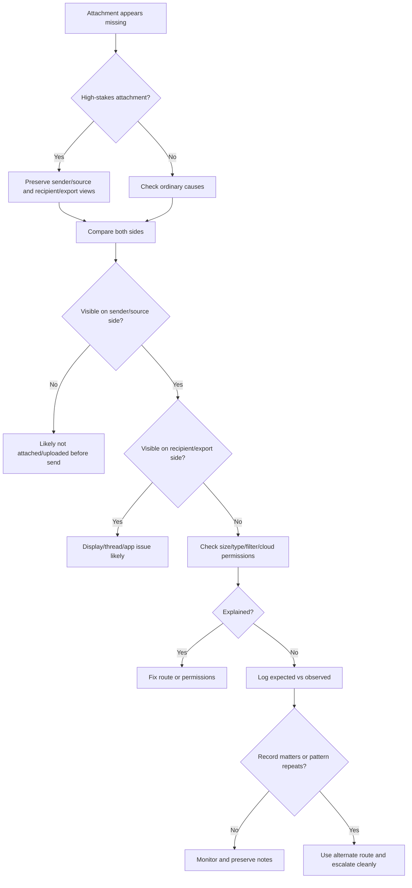

# 📎 Attachment Disappeared Triage

**First created:** 2026-06-03 | **Last updated:** 2026-06-03  
*What to do when an attachment, image, file, bundle, or export appears to vanish, strip, fail, or arrive differently than expected.*

---

## 🌱 Purpose

Attachments are slippery little beasts.

A sender attaches three files.  
The recipient sees one.  
A portal shows images, but the export loses them.  
An email says “sent,” but the attachment is missing.  
A file becomes a cloud link.  
A PDF arrives without embedded pages.  
A message thread shows the attachment in one view and not another.

Most attachment weirdness is ordinary.

File too large.  
File type blocked.  
Mail client being dramatic.  
Security filter stripped it.  
Cloud link expired.  
Recipient inbox full.  
Thread view hiding the original.  
Mobile app refusing to show what webmail can see.

But attachments matter because they often carry evidence, medical records, legal material, safeguarding notes, complaint documents, screenshots, receipts, and submissions.

This node helps you work out where the attachment disappeared:

```text
sender side
recipient side
mail client
webmail
portal
export
security filter
cloud link
file type
file size
permissions
```

The rule is:

```text
Preserve both sides.
Compare before resending.
Use alternate route if the attachment matters.
```

---

## 🧭 What This Node Is For

Use this node when an attachment, embedded image, linked file, export bundle, or document does not appear where it should.

Examples:

* email attachment missing on recipient side;
* sender sees attachment but recipient does not;
* attachment count differs between sender and recipient;
* file stripped from email without clear error;
* attachment replaced by a cloud link;
* cloud link opens for sender but not recipient;
* portal export misses files visible in portal;
* embedded images vanish from PDF export;
* ZIP bundle arrives empty or incomplete;
* document opens but attachment panel is missing;
* message thread hides the attachment in one view;
* attachment disappears after forwarding;
* file type blocked by email, portal, institution, or security gateway;
* legal, medical, complaint, or evidence attachment fails near a deadline.

This node is not for proving deliberate removal.

It is for locating the failure point and protecting the record.

---

## 🛑 First Rule: Do Not Just Resend Blindly

When an attachment disappears, the instinct is to resend it immediately.

Sometimes that is fine.

But if the attachment is high-stakes, repeated blind resends can create:

* duplicate versions;
* confusing timestamps;
* unclear authoritative copies;
* multiple message threads;
* recipient confusion;
* file-size or security flags;
* confidentiality risk;
* audit-trail mush.

Before resending, preserve the current state.

Save:

* sender screenshot showing attachment present;
* recipient screenshot showing attachment absent;
* sent-folder screenshot;
* message timestamp;
* attachment filename;
* attachment count;
* file size;
* file type;
* channel used;
* any bounce or warning message;
* cloud-link permissions if applicable;
* portal/export view if applicable.

If urgent, use an alternate verified route and say what you are doing.

```text
Attachment did not appear in email. I am resending via secure portal / alternate channel and preserving both email views.
```

---

## 🧾 Minimal Attachment Disappearance Log

Use this when an attachment appears missing, stripped, or altered.

```yaml
when_noticed: ""
timezone: ""
category: "attachment_disappeared"
channel: "email / portal / messaging app / cloud link / export / other"
sender_account: ""
recipient_account_or_contact: ""
device_sender: ""
device_recipient: ""
app_or_client_sender: ""
app_or_client_recipient: ""
message_or_record_reference: ""
sent_time: ""
received_time: ""
expected_attachment:
  filename: ""
  file_type: ""
  file_size: ""
  attachment_count: ""
  content_summary: ""
observed_sender_side:
  attachment_visible: null
  filename: ""
  attachment_count: ""
  warning_or_error: ""
observed_recipient_side:
  attachment_visible: null
  filename: ""
  attachment_count: ""
  warning_or_error: ""
checks_performed:
  webmail_vs_app: null
  spam_or_junk: null
  thread_view: null
  individual_message_view: null
  file_size_limit: null
  file_type_block: null
  cloud_link_permissions: null
  sender_confirmation: null
  recipient_confirmation: null
  alternate_channel: null
artifacts:
  - ""
impact: ""
risk_level: "green / yellow / orange / red"
next_step: ""
notes: ""
```

---

## 🧾 Plain English Version

```text
Date/time noticed:
Timezone:
Channel:
Sender:
Recipient:
Subject/thread/reference:
Sent time:
Received time:
Expected attachment filename:
Expected file type:
Expected file size:
Expected attachment count:
What sender sees:
What recipient sees:
Checks performed:
Screenshots/artifacts saved:
Impact:
Risk level:
Next step:
Notes:
```

The most important comparison is:

```text
What does the sender see?
What does the recipient see?
```

Without both sides, you are guessing.

---

## 📬 Sender Side Checks

Ask or check:

* Is the attachment visible in sent folder?
* Is it visible in the original composed message?
* Did the email client finish uploading before send?
* Was there an upload progress bar?
* Was there any warning?
* Did the file exceed size limits?
* Did the file type trigger a block?
* Did the attachment become a cloud link?
* Was it attached to the right message?
* Was it attached to a draft but not the sent message?
* Was the wrong thread used?
* Was the message forwarded without original attachments?

Good record:

```text
Sender sent-folder screenshot shows three attachments at 14:03: evidence.pdf, screenshots.zip, cover_note.docx.
```

or:

```text
Sender draft shows attachment, but sent-folder message does not. Attachment may not have uploaded before send.
```

That distinction matters.

---

## 📥 Recipient Side Checks

Ask or check:

* Is the attachment visible in inbox?
* Is it visible in webmail?
* Is it visible in mobile app?
* Is it hidden in collapsed thread view?
* Is it visible when opening the individual message?
* Is there a paperclip icon but no downloadable file?
* Did it go to spam or junk?
* Did a security banner appear?
* Was the attachment replaced by a link?
* Did the link require permission?
* Did antivirus/security scanning delay it?
* Did the recipient’s storage quota block it?
* Did institutional email strip it?

Good record:

```text
Recipient webmail shows no attachment, but sender sent-folder shows one PDF attached.
```

or:

```text
Recipient mobile app hides attachment; webmail shows it normally.
```

The second one is boring and useful.

Boring wins when it solves the problem.

---

## 🧵 Check Thread View Versus Individual Message

Email threads can lie by tidying.

An attachment may appear:

* only on the original message;
* not on a reply;
* not in collapsed thread view;
* only after expanding older messages;
* only in webmail, not app;
* only in the downloaded `.eml` or `.msg`.

Check:

```text
Open the individual message, not just the thread.
```

Good sentence:

```text
Attachment was present on the original message but hidden in collapsed thread view.
```

or:

```text
Attachment was not visible in thread view or individual message view.
```

These are different problems.

---

## 🌐 Webmail Versus Mail App

Mail apps and webmail can disagree.

Compare:

| View | Attachment visible? | Notes |
|---|---|---|
| Sender sent folder |  |  |
| Sender webmail |  |  |
| Sender mail app |  |  |
| Recipient inbox app |  |  |
| Recipient webmail |  |  |
| Individual message view |  |  |
| Thread view |  |  |

Examples:

```text
Attachment missing in iOS Mail app but present in Gmail webmail.
```

```text
Attachment visible in sender webmail but absent from recipient webmail.
```

The first suggests display/client weirdness.

The second suggests delivery, filtering, permission, or channel issue.

---

## 🧱 File Size Limits

Many systems block or strip large attachments.

Check limits for:

* email provider;
* recipient email provider;
* institution gateway;
* portal upload;
* messaging app;
* cloud link provider;
* ZIP or encrypted archive;
* individual file size;
* total message size.

Common behaviour:

* attachment fails to upload before send;
* file becomes cloud link;
* message bounces;
* attachment stripped silently;
* message delayed for scanning;
* recipient gets warning but no file;
* large file missing on mobile app only.

Good record:

```text
Attachment was 31 MB. Sender email provider limit appears to be 25 MB. File may have failed or converted to cloud link.
```

Do not assume malice before checking the boring megabytes.

They are annoying enough on their own.

---

## 🧯 File Type Blocks

Some file types are commonly blocked or stripped.

Examples:

* `.exe`
* `.bat`
* `.js`
* `.scr`
* `.zip`
* encrypted archives;
* macro-enabled Office files;
* password-protected files;
* unusual compressed formats;
* files with double extensions;
* some medical/legal export bundles depending on gateway policy.

Even normal files may be blocked by institutional filters.

Check:

* file extension;
* whether the file was compressed;
* whether it was password-protected;
* whether the recipient institution blocks that type;
* whether the file can be sent as PDF instead;
* whether a secure portal is required.

Good record:

```text
Attachment was a password-protected ZIP. Recipient institution may strip encrypted archives.
```

If the content matters, use an approved secure route rather than fighting email.

---

## ☁️ Cloud Links And Permissions

Sometimes an “attachment” is actually a cloud link.

The sender may see the file.

The recipient may see:

* access denied;
* request access;
* expired link;
* organisation-only link;
* file deleted;
* owner changed;
* link disabled;
* preview unavailable;
* download blocked.

Check:

* link permission;
* recipient account;
* organisation restriction;
* expiry date;
* owner account;
* whether file was moved;
* whether file still exists;
* whether download is allowed;
* whether the recipient is logged into the right account.

Good record:

```text
Attachment was replaced by cloud link. Recipient saw access denied because link was restricted to sender organisation.
```

This is not the same as a missing attachment.

It is an access problem.

Route mainly to `🔑_Access_Barriers/` if the issue is permission, but keep an attachment log if the practical problem was that the file did not arrive usable.

---

## 📤 Portals, Exports, And Bundles

Attachments can disappear during portal export.

Examples:

* portal shows three documents but export contains one;
* embedded images missing from PDF;
* comments exported without attachments;
* case bundle omits uploaded evidence;
* downloaded ZIP is empty;
* export tool skips unsupported files;
* image previews visible but originals absent;
* attachment names listed but files not included.

Check:

* portal view;
* export settings;
* attachment count;
* file size of export;
* individual download options;
* ZIP contents;
* whether images were embedded or linked;
* whether export includes attachments by default;
* whether you selected “include attachments”;
* whether permissions affect export.

Good record:

```text
Portal view shows five uploaded documents. Exported ZIP contains three files. Two image attachments visible in portal are absent from export.
```

This belongs strongly in `📂_Data_Shifts/` because the record differs between source and export.

---

## 🔁 Forwarding And Replying

Attachments often disappear when forwarding, replying, or using thread actions.

Check:

* did the sender reply instead of forward?
* did the email client omit original attachments?
* did forwarding preserve attachments?
* did the recipient receive only quoted text?
* did the attachment remain linked to the original message only?
* did a secure system strip attachments during forward?
* did the forward create a cloud link instead?

Good record:

```text
Original message had attachment. Forwarded message did not include original attachment.
```

This may be ordinary client behaviour.

Annoying, but ordinary.

---

## 🧪 Safe Comparison Checks

Use comparison to locate where the attachment failed.

| Comparison | What it helps distinguish |
|---|---|
| Sender sent folder vs recipient inbox | Attached before send vs missing after delivery |
| Sender webmail vs sender app | Draft/client issue |
| Recipient webmail vs recipient app | Display/client issue |
| Thread view vs individual message | Thread display issue |
| Same file to different recipient | Recipient-side filter/contact issue |
| Different file to same recipient | File-specific issue |
| Same file through secure portal | Email route issue |
| Cloud link with different permission | Access issue |
| Portal view vs export bundle | Export issue |
| Attachment count before/after | Content loss or stripping |

Change one variable at a time.

Do not send sensitive files to unnecessary comparison contacts.

Use neutral test files where possible.

---

## 🧯 Do Not Make The Trail Worse

Avoid:

* repeatedly resending sensitive attachments;
* changing filenames before recording originals;
* compressing, converting, or splitting files without preserving originals;
* deleting sent messages;
* clearing spam/junk before screenshots;
* overwriting export bundles;
* relying only on mobile app display;
* forwarding evidence without noting which attachments carried over;
* sending sensitive content to casual test contacts;
* mixing several missing-attachment incidents into one vague complaint.

A clean record beats five messy resends.

---

## 🚦 Risk Levels

### 🟢 Green — Ordinary / Low Concern

Use when:

* attachment is visible in webmail but hidden in app;
* thread view was hiding it;
* file size or type clearly explains it;
* cloud permission explains it;
* no important record is affected;
* alternate route works easily.

Action:

```text
Fix route or permission. Note lightly if useful.
```

### 🟡 Yellow — Worth Logging

Use when:

* the attachment matters;
* sender and recipient views differ;
* no clear ordinary explanation appears;
* the same attachment issue has happened before;
* it causes delay or confusion;
* the attachment relates to a complaint, evidence, medical, legal, safeguarding, employment, academic, financial, or institutional process.

Action:

```text
Make an attachment log. Preserve sender and recipient screenshots. Try one safe alternate route.
```

### 🟠 Orange — Pattern Suspected

Use when:

* attachments disappear repeatedly with the same contact, file type, topic, or channel;
* sensitive attachments fail while neutral attachments work;
* portal/export attachment counts repeatedly diverge;
* cloud permissions change unexpectedly;
* secure or official routes omit files without warning;
* the same attachment issue clusters around deadlines, complaints, submissions, or access requests.

Action:

```text
Build a timeline. Preserve original files and message views. Use alternate verified route. Consider technical or procedural review.
```

### 🔴 Red — Escalate Promptly

Use when:

* evidence attachments are missing;
* legal, medical, safeguarding, financial, housing, immigration, employment, education, or institutional records are affected;
* a deadline depends on the attachment;
* the missing attachment could affect a complaint, investigation, hearing, appointment, appeal, or safety process;
* the recipient may act on an incomplete record;
* continued resending could create confusion or confidentiality risk.

Action:

```text
Stop blind resends. Preserve both sides. Use a verified alternate route. Escalate and ask for confirmation of receipt and attachment integrity.
```

---

## 🧷 Clean Escalation Sentence

When reporting a missing attachment, use plain language.

```text
An attachment expected with [message/record] was not visible on [recipient/export/view] when checked at [date/time]. The sender/source view shows [attachment count/name] at [date/time]. I have preserved screenshots of both views and checked [basic checks]. The attachment is needed for [purpose/deadline]. Please confirm whether it was stripped, blocked, omitted from export, permission-restricted, or otherwise unavailable, and preserve any relevant delivery/audit logs.
```

Example:

```text
An attachment expected with my evidence email was not visible in the recipient inbox when checked at 15:10 on 3 June 2026. The sender sent-folder view shows evidence_bundle.pdf attached at 14:03. I have preserved screenshots of both views and checked webmail, thread view, and spam. The attachment is needed for a live complaint deadline. Please confirm whether it was stripped, blocked, permission-restricted, or otherwise unavailable, and preserve any relevant delivery/audit logs.
```

Ask for:

* confirmation of attachment receipt;
* attachment count;
* filename confirmation;
* alternate upload route;
* audit or delivery logs;
* deadline protection;
* written confirmation.

---

## 🧾 Attachment Summary Template

```text
On [date/time], [attachment/file] expected with [message/record/export] was [missing/stripped/inaccessible/incomplete] in [view]. Sender/source view showed [expected attachment state]. Recipient/export view showed [observed state]. Checked: [checks]. Possible ordinary explanations: [file size/type/thread view/cloud permission/etc.]. Impact: [practical harm]. Current level: [ordinary / worth logging / pattern suspected / escalate]. Next step: [action].
```

Example:

```text
On 3 June 2026 at 15:10 BST, evidence_bundle.pdf expected with an evidence email was missing in the recipient webmail view. Sender sent-folder view showed one PDF attached at 14:03. Recipient view showed no attachment and no warning. Checked: thread view, individual message view, spam, and webmail/app comparison. Possible ordinary explanations remain unclear. Impact: adviser may have incomplete evidence before deadline. Current level: escalate promptly. Next step: resend via secure portal and request written confirmation of receipt.
```

---

## 🗂 Copy-Paste Attachment Comparison Table

```markdown
| View/check | Expected | Observed | Artifact |
|---|---|---|---|
| Sender sent folder |  |  |  |
| Sender webmail/app |  |  |  |
| Recipient inbox |  |  |  |
| Recipient webmail/app |  |  |  |
| Thread view |  |  |  |
| Individual message view |  |  |  |
| Spam/junk/security notice |  |  |  |
| Cloud link permission |  |  |  |
| Portal/source view |  |  |  |
| Export/bundle view |  |  |  |
```

---

## 🗂 Copy-Paste Attachment Entry

```markdown
## Attachment Disappearance Entry

**When noticed:**  
**Timezone:**  
**Channel:** email / portal / messaging app / cloud link / export / other  
**Sender/source:**  
**Recipient/destination:**  
**Subject/thread/reference:**  
**Sent/submitted time:**  
**Received/exported time:**  

### Expected attachment

**Filename:**  
**File type:**  
**File size:**  
**Attachment count:**  
**Content summary:**  

### Observed state

**Sender/source view:**  
**Recipient/export view:**  
**Warnings/errors:**  

### Checks performed

| Check | Result | Artifact |
|---|---|---|
| Sender sent/source view |  |  |
| Recipient view |  |  |
| Webmail vs app |  |  |
| Thread vs individual message |  |  |
| Spam/security notice |  |  |
| File size/type limit |  |  |
| Cloud permissions |  |  |
| Alternate channel |  |  |

### Impact

**Practical impact:**  
**Risk level:** green / yellow / orange / red  
**Next step:**  
```

---

## 🗺 Mini Flow



---

## 🌌 Constellations

📎 📂 📬 🧾 🧪 — missing attachments; sender-recipient comparison; export integrity; evidence preservation; safe alternate routes.

---

## ✨ Stardust

missing attachment, stripped attachment, attachment disappeared, sender recipient comparison, cloud link permission, file size limit, portal export missing files, evidence attachment, attachment integrity, secure alternate route

---

## 🏮 Footer

*📎 Attachment Disappeared Triage* is a living node of the **Polaris Protocol**.

It helps people respond when an attachment fails to arrive, vanishes from one side, strips from an export, or becomes inaccessible: not by blind resending, not by assuming deletion, but by preserving both views, comparing safely, and using alternate routes when the file matters.

```text
What did the sender/source show?
What did the recipient/export show?
What ordinary filters might apply?
What route protects the record now?
```

> 📡 Cross-references:
>
> * [🩻 Weirdness Screening](../README.md) — *first-notice triage for ordinary glitches, persistent anomalies, and escalation-worthy weirdness*
> * [📂 Data Shifts](./README.md) — *record, file, timestamp, attachment, metadata, and version-history triage*
> * [📂 Missing File Triage](./📂_missing_file_triage.md) — *what to do when a file or record cannot be found*
> * [🕰️ Timestamp Drift Triage](./🕰️_timestamp_drift_triage.md) — *created/modified/uploaded/accessed time confusion*
> * [🧾 Version History Checklist](./🧾_version_history_checklist.md) — *checking and preserving version history*
> * [🧮 Basic Checksum Guide](./🧮_basic_checksum_guide.md) — *simple file hashing for integrity checks*
> * [📜 Chain Of Custody Basics](./📜_chain_of_custody_basics.md) — *everyday custody notes for important records*
> * [🚩 Data Shift Red Flags](./🚩_data_shift_red_flags.md) — *when record-integrity issues need escalation*

*Survivor authorship is sovereign. Containment is never neutral.*
