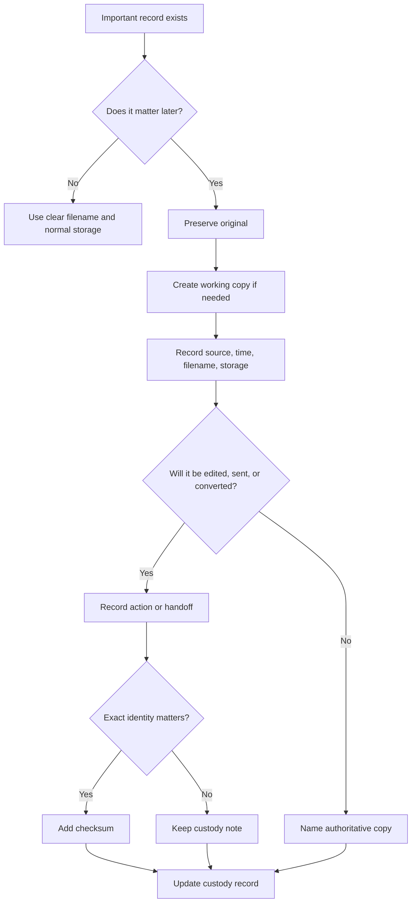

# 📜 Chain Of Custody Basics

**First created:** 2026-06-03 | **Last updated:** 2026-06-03  
*Everyday custody notes for important records, evidence files, exports, screenshots, attachments, and preserved copies.*

---

## 🌱 Purpose

Chain of custody sounds dramatic.

It sounds like evidence bags, courtrooms, gloves, seals, and someone saying “Exhibit A” in a voice that has never once enjoyed a biscuit.

For Polaris purposes, keep it simpler.

Chain of custody means:

```text
Where did this record come from?
When did you get it?
Where did you store it?
What did you do to it?
Who did you send it to?
Which copy is authoritative now?
```

That is it.

A basic custody note helps stop important records turning into soup.

It matters when files, screenshots, exports, attachments, drafts, or documents may be needed for:

* complaints;
* legal advice;
* medical records;
* safeguarding;
* employment;
* housing;
* immigration;
* education;
* financial issues;
* institutional correspondence;
* evidence bundles;
* technical review;
* data-protection requests;
* regulatory escalation.

This node gives a simple way to track important records without pretending everyone has a forensic lab in the cupboard.

The rule is:

```text
Name the source.
Preserve the original.
Work on a copy.
Record each handoff.
Name the authoritative version.
```

---

## 🧭 What This Node Is For

Use this node when a file or record matters enough that future-you, an adviser, a solicitor, a support worker, a regulator, a data controller, or a technical reviewer may need to understand what happened to it.

Examples:

* evidence PDF downloaded from a portal;
* screenshot of a missing file;
* email attachment from an adviser;
* medical letter;
* safeguarding record;
* complaint submission receipt;
* export from a cloud drive;
* version history screenshot;
* checksum record;
* file sent to someone else;
* redacted working copy;
* document restored from version history;
* record that may be challenged later.

This node is not about making ordinary admin scary.

It is about keeping important records followable.

---

## 🧾 Minimal Chain Of Custody Note

Use this for a simple custody entry.

```yaml
custody_record:
  record_name: ""
  record_type: "file / screenshot / export / email / attachment / portal record / other"
  source: ""
  source_location_or_link: ""
  received_or_created_when: ""
  timezone: ""
  received_or_created_by: ""
  original_filename: ""
  preserved_filename: ""
  working_copy_filename: ""
  storage_location: ""
  checksum_if_used: ""
  actions_taken:
    - when: ""
      action: ""
      by_whom: ""
      notes: ""
  sent_or_shared:
    - when: ""
      sent_to: ""
      method: ""
      filename_sent: ""
      confirmation: ""
  authoritative_copy: ""
  related_case_or_context: ""
  artifacts:
    - ""
  notes: ""
```

---

## 🧾 Plain English Version

```text
Record name:
Record type:
Where it came from:
Where it was first seen/downloaded/received:
Date/time received or created:
Timezone:
Original filename:
Preserved filename:
Working copy filename:
Where the preserved copy is stored:
Checksum, if used:
What has been done to it:
Who it has been sent to:
How it was sent:
Confirmation received:
Which copy is authoritative:
Related case/context:
Notes:
```

The key question is:

```text
Could someone else understand what happened to this record without needing my memory?
```

If yes, good.

If no, add the missing pieces.

---

## 🛑 First Rule: Original And Working Copy Are Not The Same Thing

If the record matters, separate:

```text
original / preserved copy
```

from:

```text
working copy
```

The preserved copy is the one you do not edit.

The working copy is the one you can use for:

* highlighting;
* redacting;
* compressing;
* converting;
* annotating;
* extracting pages;
* sending in a smaller format;
* making a readable bundle.

Suggested naming:

```text
2026-06-03_evidence_bundle_original_preserved.pdf
2026-06-03_evidence_bundle_working_copy.pdf
2026-06-03_evidence_bundle_redacted_for_adviser.pdf
```

Do not edit the preserved copy and then later call it original.

That is how the file becomes haunted.

---

## 📥 Receiving A Record

When you receive or download a record, note:

* date and time;
* timezone;
* sender/source;
* system/platform;
* original filename;
* file type;
* file size;
* where it was saved;
* whether it came with a message, receipt, or reference number;
* whether the download/export page was screenshotted;
* whether a checksum was created;
* whether a working copy was made.

Example:

```text
Downloaded evidence_bundle.pdf from complaint portal at 2026-06-03 15:42 BST.
Saved preserved copy as 2026-06-03_evidence_bundle_original_preserved.pdf.
Saved working copy as 2026-06-03_evidence_bundle_working_copy.pdf.
Portal receipt screenshot saved.
Preserved copy not edited.
```

This is not fancy.

It is useful.

---

## 📤 Sending Or Sharing A Record

When you send or share a record, note:

* date and time sent;
* recipient;
* method;
* filename sent;
* whether it was original, working, redacted, compressed, or converted;
* whether attachments were included;
* whether receipt or confirmation was received;
* whether a checksum was shared;
* whether the recipient reported any issue.

Example:

```text
Sent 2026-06-03_evidence_bundle_redacted_for_adviser.pdf to adviser by secure portal at 16:10 BST.
Portal confirmation receipt saved.
Recipient confirmed file opened successfully at 16:32 BST.
```

If email attachments are involved, cross-check:

```text
./📎_attachment_disappeared_triage.md
```

because “sent” and “received with attachment intact” are not always the same thing.

---

## 🧮 When To Add A Checksum

A checksum is useful when exact identity matters.

Add one when:

* evidence may be challenged;
* the file may be sent between people;
* multiple copies have similar names;
* a preserved copy must stay stable;
* current and last-good versions need comparison;
* a portal export may differ from local copy.

Basic custody note:

```text
SHA-256 checksum recorded for preserved copy at 2026-06-03 15:42 BST.
Preserved copy not edited after hashing.
```

A checksum does not explain why a file changed.

It only supports file identity.

For details, route to:

```text
./🧮_basic_checksum_guide.md
```

---

## 🧾 Custody Actions To Record

Record any action that changes, moves, or interprets the record.

Useful actions:

* downloaded;
* received;
* copied;
* renamed;
* moved;
* exported;
* converted;
* compressed;
* redacted;
* annotated;
* split;
* merged;
* restored;
* hashed;
* uploaded;
* sent;
* shared;
* printed;
* scanned;
* deleted;
* recovered;
* permission changed;
* authoritative copy selected.

Example action log:

```markdown
| Date/time | Action | By whom | Notes |
|---|---|---|---|
| 2026-06-03 15:42 BST | Downloaded from portal | CB | Original filename evidence_bundle.pdf |
| 2026-06-03 15:45 BST | Preserved copy created | CB | Saved in encrypted local folder |
| 2026-06-03 15:47 BST | Working copy created | CB | Used for redaction |
| 2026-06-03 16:10 BST | Redacted copy sent | CB | Sent via secure portal |
| 2026-06-03 16:32 BST | Receipt confirmed | Adviser | File opened successfully |
```

Tiny table.

Big difference.

---

## 🧭 Naming The Authoritative Copy

At some point, name which copy is authoritative.

The authoritative copy is the version you rely on as the main record.

Examples:

```text
Authoritative copy: 2026-06-03_evidence_bundle_original_preserved.pdf
```

or:

```text
Authoritative copy: complaint portal submission receipt, not local exported PDF.
```

or:

```text
Authoritative copy: last-good version exported from version history at 18:41, pending audit confirmation.
```

This matters when there are:

* duplicates;
* conflict copies;
* local and cloud copies;
* exported and source versions;
* redacted and unredacted copies;
* restored versions;
* screenshots and underlying files.

Do not make future-you guess which one counts.

Future-you has suffered enough.

---

## 📂 Custody For Missing Files

If a file appeared missing and was later found, record:

* when it was noticed missing;
* where it was expected;
* where it was found;
* whether it had moved, hidden, synced, archived, or changed permissions;
* whether filename/path changed;
* whether content matched older copy;
* whether checksum was used.

Example:

```text
File expected in /Evidence/ was not visible at 09:14 BST.
Found at 09:42 BST in /Downloads/export_final_2.pdf.
Filename and path differed from expected.
Content appears to match prior copy; checksum comparison pending.
```

Route also to:

```text
./📂_missing_file_triage.md
```

---

## 🕰️ Custody For Timestamp Drift

If timestamp drift matters, record:

* which timestamp changed;
* what the timestamp label was;
* which system showed it;
* what you expected;
* what ordinary explanations were checked;
* whether the file was opened, copied, exported, or synced;
* whether screenshots were saved before interaction.

Example:

```text
Cloud folder showed modified time 2026-06-03 09:14 BST.
Portal receipt showed upload time 2026-06-01 09:30 BST.
Likely different timestamp types: modified vs uploaded.
Both screenshots preserved.
```

Route also to:

```text
./🕰️_timestamp_drift_triage.md
```

---

## 🧾 Custody For Version History

If version history is involved, record:

* current version;
* last known good version;
* whether screenshots were taken before restore;
* whether a version was exported;
* whether restore occurred;
* who restored it;
* which version is authoritative now.

Example:

```text
Current version appeared empty at 14:10 BST.
Version history showed full-text version at 18:41 BST on 2 June.
Screenshots saved before restore.
Last-good version exported as preserved copy.
No restore performed yet.
```

Route also to:

```text
./🧾_version_history_checklist.md
```

---

## 📎 Custody For Attachments

If an attachment matters, record:

* sender-side view;
* recipient-side view;
* filename;
* attachment count;
* sent time;
* received time;
* method;
* whether alternate route was used;
* whether recipient confirmed attachment integrity.

Example:

```text
Sender sent-folder screenshot shows evidence_bundle.pdf attached at 14:03 BST.
Recipient webmail screenshot at 15:10 BST shows no attachment.
Same file sent via secure portal at 15:25 BST.
Recipient confirmed receipt at 15:40 BST.
```

Route also to:

```text
./📎_attachment_disappeared_triage.md
```

---

## 🧪 Custody For Working Copies

Working copies are allowed.

Just label them.

Record:

* why the copy was made;
* what was changed;
* whether the original was preserved;
* whether redactions were applied;
* whether pages were removed;
* whether format changed;
* whether the working copy was sent.

Example:

```text
Working copy created for redaction at 15:47 BST.
Redacted personal contact details only.
Original preserved copy unchanged.
Redacted copy sent to adviser at 16:10 BST.
```

Good practice:

```text
Never redact the only copy.
```

Truly. Do not do that to yourself.

---

## 🧯 Do Not Make Custody Worse

Avoid:

* editing the original;
* renaming without recording old name;
* deleting duplicates too early;
* sending unlabelled versions;
* making “final final final” files;
* redacting the only copy;
* converting without preserving source;
* forwarding attachments without checking they carried over;
* restoring versions before screenshots;
* moving evidence between folders without notes;
* relying on memory for who got what.

A custody note is the antidote to later chaos.

---

## 🚦 Risk Levels

### 🟢 Green — Light Custody

Use when:

* record is low-stakes;
* copy is easy to recreate;
* no deadline or dispute is involved;
* chain does not need detailed tracking.

Action:

```text
Use clear filenames and basic folder hygiene.
```

### 🟡 Yellow — Useful Custody

Use when:

* record may matter later;
* it relates to a complaint, advice, admin process, or institutional issue;
* you may send it to someone else;
* duplicates or versions exist;
* you want future clarity.

Action:

```text
Make a simple custody note and identify preserved versus working copy.
```

### 🟠 Orange — Strong Custody

Use when:

* legal, medical, safeguarding, financial, employment, academic, housing, immigration, or institutional records are involved;
* evidence may be challenged;
* versions differ;
* attachments or timestamps are disputed;
* multiple people may handle the file.

Action:

```text
Preserve original, record actions, use checksum if useful, and keep confirmation receipts.
```

### 🔴 Red — Escalation Custody

Use when:

* evidence is missing, changed, or at risk;
* a deadline, complaint, investigation, hearing, appeal, appointment, or safety process depends on the record;
* the authoritative version is unclear;
* a system may rely on an incomplete or altered copy;
* custody failure could cause serious harm.

Action:

```text
Stop editing. Preserve current state. Make custody note. Use verified route. Escalate and request audit/version preservation.
```

---

## 🧷 Clean Custody Sentence

Use this when sending or escalating a record.

```text
I preserved [file/record] as [preserved filename] on [date/time/timezone]. The preserved copy has not been edited. A working/redacted copy was created as [working filename] for [purpose]. The authoritative copy is [copy/source]. Relevant receipts, screenshots, checksums, or confirmation records are attached/listed.
```

Example:

```text
I preserved the complaint portal export as 2026-06-03_evidence_bundle_original_preserved.pdf on 3 June 2026 at 15:42 BST. The preserved copy has not been edited. A redacted working copy was created as 2026-06-03_evidence_bundle_redacted_for_adviser.pdf for adviser review. The authoritative copy is the preserved portal export, supported by the portal receipt screenshot and SHA-256 checksum record.
```

That is boring.

Boring is powerful.

---

## 🗂 Copy-Paste Custody Entry

```markdown
## Chain Of Custody Entry

**Record name:**  
**Record type:** file / screenshot / export / email / attachment / portal record / other  
**Source:**  
**Source location/link/reference:**  
**Received or created when:**  
**Timezone:**  
**Received or created by:**  
**Original filename:**  
**Preserved filename:**  
**Working copy filename:**  
**Storage location:**  
**Checksum if used:**  
**Related case/context:**  

### Action log

| Date/time | Action | By whom | Notes |
|---|---|---|---|
|  |  |  |  |

### Sent/shared log

| Date/time | Sent/shared to | Method | Filename sent | Confirmation |
|---|---|---|---|---|
|  |  |  |  |  |

### Authoritative copy

**Authoritative copy/source:**  

### Notes

```

---

## 🗂 Copy-Paste Handoff Table

```markdown
| Date/time | From | To | Method | File/version | Confirmation | Notes |
|---|---|---|---|---|---|---|
|  |  |  |  |  |  |  |
```

Use this when a file moves between people, systems, advisers, portals, or institutions.

---

## 🗺 Mini Flow



---

## 🌌 Constellations

📜 📂 🧾 🧮 🕰️ — chain of custody; preserved copies; authoritative records; checksums; timestamp discipline.

---

## ✨ Stardust

chain of custody, preserved copy, working copy, authoritative version, evidence handling, record handoff, custody note, file provenance, audit trail, record integrity

---

## 🏮 Footer

*📜 Chain Of Custody Basics* is a living node of the **Polaris Protocol**.

It helps people keep important records followable: where they came from, what happened to them, who received them, and which copy now counts.

Not courtroom cosplay.

Not panic bureaucracy.

Just enough record discipline to stop the file becoming soup.

```text
Name the source.
Preserve the original.
Work on a copy.
Record each handoff.
Name the authoritative version.
```

> 📡 Cross-references:
>
> * [🩻 Weirdness Screening](../README.md) — *first-notice triage for ordinary glitches, persistent anomalies, and escalation-worthy weirdness*
> * [📂 Data Shifts](./README.md) — *record, file, timestamp, attachment, metadata, and version-history triage*
> * [📂 Missing File Triage](./📂_missing_file_triage.md) — *what to do when a file or record cannot be found*
> * [🕰️ Timestamp Drift Triage](./🕰️_timestamp_drift_triage.md) — *created/modified/uploaded/accessed time confusion*
> * [📎 Attachment Disappeared Triage](./📎_attachment_disappeared_triage.md) — *missing or stripped attachments*
> * [🧾 Version History Checklist](./🧾_version_history_checklist.md) — *checking and preserving version history*
> * [🧮 Basic Checksum Guide](./🧮_basic_checksum_guide.md) — *simple file hashing for integrity checks*
> * [🚩 Data Shift Red Flags](./🚩_data_shift_red_flags.md) — *when record-integrity issues need escalation*

*Survivor authorship is sovereign. Containment is never neutral.*
