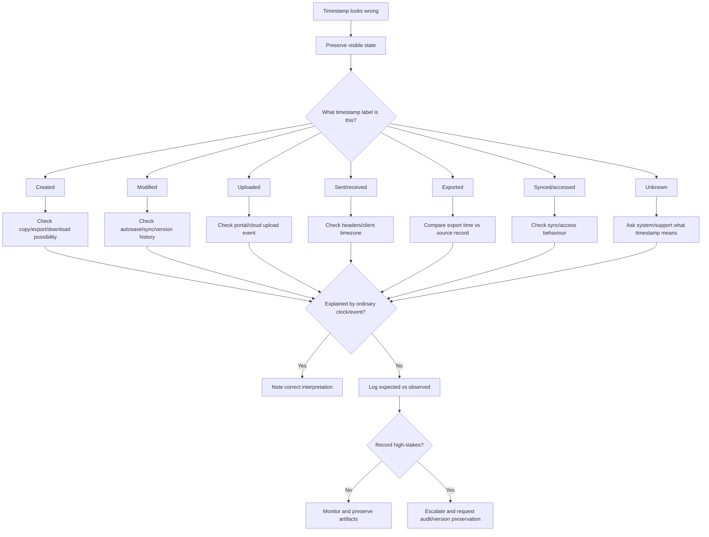

# 🕰️ Timestamp Drift Triage

**First created:** 2026-06-03 | **Last updated:** 2026-06-03  
*How to understand created, modified, uploaded, accessed, sent, received, exported, and synced time weirdness without overclaiming.*

---

## 🌱 Purpose

Timestamps look simple.

They are not.

A file may show one time in a folder, another in a cloud drive, another in version history, another in email, another in a portal, and another inside the file metadata.

That does not automatically mean the record was tampered with.

It may mean the systems are showing different clocks.

Created time.  
Modified time.  
Uploaded time.  
Received time.  
Sent time.  
Accessed time.  
Downloaded time.  
Exported time.  
Synced time.  
Local time.  
UTC.  
Daylight saving time.  
Server time.  
Browser display time.  
A clock goblin wearing a spreadsheet hat.

But timestamps matter because they are often used to decide:

* when something was created;
* whether something was changed;
* whether a deadline was met;
* whether a record existed at a certain time;
* whether a submission was received;
* whether an export matches the source;
* whether a file was opened, copied, restored, or overwritten.

This node helps you slow down and ask the right first question:

```text
Which timestamp am I looking at?
```

Not:

```text
Who changed it?
```

The rule is:

```text
Identify the clock.
Preserve before opening.
Compare across systems.
Escalate if the timestamp matters.
```

---

## 🧭 What This Node Is For

Use this node when a timestamp looks wrong, surprising, changed, missing, or inconsistent.

Examples:

* a file’s modified date changed unexpectedly;
* a creation date is later than it should be;
* a cloud upload time differs from local file time;
* a portal received time differs from email sent time;
* an exported record shows the wrong date;
* a document appears edited when nobody remembers editing it;
* a timestamp shifts after opening, downloading, restoring, or syncing;
* two systems show different times for the same record;
* a file appears to have been created after it was supposedly submitted;
* a record timestamp changes after a complaint, access request, evidence upload, or deadline.

This node is not for proving tampering from one strange date.

It is for determining what the timestamp represents, what changed, and whether the change matters.

---

## 🛑 First Rule: Do Not Open The File Repeatedly

Opening a file can change metadata.

So can previewing it, downloading it, exporting it, restoring it, copying it, syncing it, renaming it, converting it, or saving it under another format.

Before interacting with a timestamp-weird record, preserve what you can see.

Capture:

* screenshot of the folder or portal view;
* visible filename;
* visible path;
* visible timestamp label;
* file size;
* account used;
* device used;
* system/platform;
* current timezone;
* whether the timestamp says created, modified, uploaded, received, sent, accessed, exported, or synced;
* whether the view is local, cloud, portal, email, or downloaded copy.

If the file is high-stakes, copy first and work on the copy.

Do not keep opening the original to “check again.”

That can turn a clean timestamp question into metadata soup.

---

## 🕰️ The First Question: Which Clock Is This?

A timestamp is only useful if you know what it measures.

Common timestamp types:

| Timestamp label | Usually means | Watch out for |
|---|---|---|
| Created | When this copy/file object was created | Copying/exporting can create a new created date |
| Modified | When content or metadata last changed | Opening/syncing may update it in some systems |
| Accessed | When file was last opened/read | Often disabled, unreliable, or changed by previews |
| Uploaded | When file reached a platform | Not when the file was originally created |
| Downloaded | When local copy was saved | Not when source record was created |
| Sent | When sender’s system sent message | May differ from server receipt |
| Received | When recipient/server received message | May differ by timezone or mail client |
| Exported | When export file was generated | Not when underlying record was created |
| Synced | When cloud/local sync occurred | May reflect sync event, not content change |
| Restored | When older version was restored | May overwrite visible modified time |
| Submitted | When portal accepted submission | May be server-side time |

Useful sentence:

```text
This appears to be the upload timestamp, not the original creation timestamp.
```

or:

```text
The visible date is modified time, not evidence that the file was first created then.
```

This distinction prevents a lot of nonsense.

---

## 🧾 Minimal Timestamp Drift Log

Use this when a timestamp looks wrong.

```yaml
when_noticed: ""
timezone_noticed_in: ""
category: "timestamp_drift"
system_or_platform: ""
account: ""
device: ""
record_or_file_name: ""
record_id_or_reference: ""
location_or_path: ""
timestamp_label_seen: "created / modified / accessed / uploaded / downloaded / sent / received / exported / synced / submitted / unknown"
visible_timestamp: ""
expected_timestamp: ""
last_known_normal: ""
expected_reason: ""
observed_issue: ""
view_checked:
  local_file_system: null
  cloud_web: null
  cloud_sync_folder: null
  portal: null
  email_client: null
  webmail: null
  downloaded_export: null
  version_history: null
timezone_checks:
  local_timezone: ""
  system_timezone: ""
  server_timezone: ""
  utc_possible: null
  daylight_saving_possible: null
actions_before_change:
  - ""
comparison_tests:
  other_device: null
  web_vs_local: null
  portal_vs_export: null
  email_header_vs_client: null
  version_history: null
  checksum: null
artifacts:
  - ""
impact: ""
risk_level: "green / yellow / orange / red"
next_step: ""
notes: ""
```

---

## 🧾 Plain English Version

```text
Date/time noticed:
Timezone:
System/platform:
Account:
Device:
File/record name:
Where I saw it:
Timestamp label:
Visible timestamp:
Expected timestamp:
Why I expected that:
Last known normal:
What changed:
What happened before the change:
Views checked:
Timezone checks:
Comparison checks:
Artifacts saved:
Impact:
Risk level:
Next step:
Notes:
```

The key field is:

```text
Timestamp label.
```

A wrong label can create a fake mystery.

---

## 🧭 Local Time, UTC, And Daylight Saving

Different systems use different time standards.

A system may show:

* local device time;
* account timezone;
* browser timezone;
* organisation timezone;
* server timezone;
* UTC;
* daylight saving adjusted time;
* daylight saving unadjusted time.

Example:

```text
2026-06-03 09:00 BST
```

is the same moment as:

```text
2026-06-03 08:00 UTC
```

That one-hour difference may be completely ordinary.

In the UK, summer dates usually use BST, which is UTC+1. Winter dates usually use GMT, which is UTC+0.

Useful checks:

* What timezone is your device using?
* What timezone is the portal using?
* Does the platform store timestamps in UTC?
* Is daylight saving in effect?
* Does the email header show a different offset?
* Does the timestamp include `Z`, `+00:00`, or `+01:00`?
* Is one system showing local time and another showing server time?

Useful sentence:

```text
The one-hour difference may be UTC/BST conversion rather than a record change.
```

Do not let daylight saving cosplay as sabotage.

It has enough crimes already.

---

## 🧪 Created Time Is Not Always Original Creation

A “created” timestamp may mean:

* when the file was first made;
* when this copy was made;
* when the file was downloaded;
* when the export was generated;
* when the file entered a new filesystem;
* when a restored version became current;
* when cloud storage created its own file object.

Example:

```text
Original document created: 2026-05-30
Downloaded export created on laptop: 2026-06-03
```

Both can be true.

Useful sentence:

```text
The local created date appears to reflect when this copy was downloaded, not when the original document was authored.
```

Check before treating a later created date as evidence the record did not exist earlier.

---

## 🧪 Modified Time Can Change Without Malice

Modified time can change because:

* you edited the file;
* autosave ran;
* the app updated metadata;
* cloud sync touched it;
* the file was converted;
* comments or tracked changes changed;
* version restoration occurred;
* metadata was rewritten;
* preview thumbnails were generated;
* an embedded object updated;
* a file was opened in software that saves automatically.

Useful sentence:

```text
The modified timestamp changed after opening the file in an autosave-enabled app.
```

or:

```text
The modified timestamp changed without visible content change; compare version history and checksum if the record matters.
```

A modified timestamp is a clue.

It is not the whole story.

---

## 📧 Email Sent And Received Times

Email timestamps are particularly slippery.

Compare:

* sender’s sent folder;
* recipient inbox display;
* full email headers;
* server receipt time;
* forwarded copy time;
* downloaded `.eml` or `.msg` file time;
* attachment modified time;
* mail app local display.

A message may show:

```text
Sent: 09:03
Received: 09:04
Downloaded locally: 11:20
Exported as PDF: 15:40
```

Those are different events.

Useful sentence:

```text
The email was sent at 09:03 according to the sender view, received by the server at 09:04 according to headers, and exported at 15:40 according to the PDF file timestamp.
```

Do not compare email export timestamps with message sent timestamps as if they are the same thing.

They are not.

---

## ☁️ Cloud Sync Timestamps

Cloud systems may show several different times:

* created in cloud;
* uploaded to cloud;
* modified locally;
* synced to cloud;
* last opened;
* last viewed;
* last edited;
* shared time;
* downloaded time;
* restored time.

Common ordinary causes of drift:

* sync pause;
* conflict copy;
* offline editing;
* local clock difference;
* mobile app sync delay;
* cloud file placeholder;
* rename on one device;
* restore from version history;
* shared drive migration.

Good record:

```text
Local modified time shows 10:12. Cloud web modified time shows 10:18. Sync status showed pending during this window.
```

That is a different problem from:

```text
The file was rewritten.
```

Maybe it was.

Maybe it synced late.

Find the clock first.

---

## 🧾 Portal And Export Timestamps

Portals often distinguish:

* record created;
* record submitted;
* record received;
* record processed;
* record updated;
* document uploaded;
* document generated;
* document exported;
* case status changed;
* user accessed.

Exports may add a new timestamp when the export is created.

Example:

```text
Portal record submitted: 2026-06-01 09:30
PDF export generated: 2026-06-03 14:05
```

That does not mean the underlying record was created on 3 June.

It means the export was created then.

Useful sentence:

```text
The PDF timestamp appears to be export time, not the original portal submission time.
```

If a deadline depends on this, preserve portal screenshots as well as downloaded files.

---

## 🧾 Version History And Timestamp Drift

If a timestamp looks wrong, version history may help.

Check:

* visible versions;
* version names;
* edit times;
* restore times;
* last modified by;
* comments or suggestions;
* whether a version was replaced;
* whether version history is missing or incomplete.

Record before restoring.

Good sentence:

```text
Version history shows content present at 18:41, current visible file appears empty at 19:10, and no user edit is visible between those times.
```

Careful interpretation:

```text
This is a record-integrity concern worth preserving and escalating if the file matters.
```

For detailed steps, route to:

```text
./🧾_version_history_checklist.md
```

---

## 🧮 When To Use A Checksum

A checksum can help if you need to know whether two files are exactly identical.

Use checksums when:

* evidence must be preserved;
* a file may have changed;
* two copies need comparison;
* you need to show a preserved copy stayed stable;
* a downloaded export may differ from portal source;
* a file will be sent to another person or body.

Basic principle:

```text
Copy first.
Hash the preserved copy.
Record the hash.
Do not edit the preserved copy.
```

A checksum can show that two files differ.

It cannot explain why they differ.

For details, route to:

```text
./🧮_basic_checksum_guide.md
```

---

## 🧪 Safe Comparison Checks

Use comparison to locate the timestamp drift.

| Comparison | What it helps distinguish |
|---|---|
| Local file vs cloud web view | Local metadata vs cloud metadata |
| Cloud web vs mobile app | Display issue vs platform record |
| Portal view vs downloaded export | Underlying record time vs export time |
| Sender sent folder vs recipient inbox | Sender/client time vs recipient/server time |
| Email header vs email client | Server timestamp vs display timestamp |
| Version history vs folder modified time | Content edit vs file-object update |
| Original file vs copied file | Original creation vs copy creation |
| Before/after checksum | Exact file change vs metadata/display change |
| Screenshot before opening vs after opening | Whether opening changed visible metadata |

Change one variable at a time.

Do not repeatedly open or save the original.

---

## 🧯 Do Not Make Timestamp Drift Worse

Avoid:

* opening the file repeatedly;
* saving the original;
* renaming before recording old name;
* converting before preserving original;
* exporting over the first export;
* restoring versions before screenshots;
* editing metadata to “fix” it;
* copying without noting copy time;
* deleting conflict copies;
* clearing sync history;
* changing device timezone mid-check;
* relying on memory instead of screenshots.

A timestamp puzzle is easier to solve before you start touching everything.

---

## 🚦 Risk Levels

### 🟢 Green — Ordinary / Low Concern

Use when:

* timezone explains the difference;
* export time explains the timestamp;
* downloaded-copy creation explains the date;
* sync delay explains the mismatch;
* version history shows your own edit;
* no important record is affected;
* impact is low.

Action:

```text
Note lightly if useful. Use the correct timestamp label going forward.
```

### 🟡 Yellow — Worth Logging

Use when:

* the file matters;
* the timestamp has no clear explanation;
* a deadline, complaint, medical, legal, safeguarding, financial, employment, academic, or institutional process is involved;
* the timestamp could affect interpretation;
* the same timestamp mismatch has happened before.

Action:

```text
Make a timestamp drift log. Preserve screenshots. Compare views safely.
```

### 🟠 Orange — Pattern Suspected

Use when:

* timestamps shift after similar actions;
* timestamp mismatches cluster around deadlines, complaints, access requests, or submissions;
* version history and visible timestamps do not align;
* portal and export times diverge in a way that affects record meaning;
* modified dates change without visible content change;
* multiple records show similar drift;
* permissions or versions also change nearby.

Action:

```text
Build a timeline. Preserve copies. Check version history. Consider checksum and technical/procedural review.
```

### 🔴 Red — Escalate Promptly

Use when:

* timestamp drift affects evidence;
* a legal, medical, safeguarding, financial, housing, immigration, employment, education, or institutional deadline depends on it;
* a record may be treated as late, altered, missing, or unreliable because of the timestamp;
* the authoritative version is at risk;
* continued checking may alter metadata further.

Action:

```text
Stop editing. Preserve current state. Use alternate evidence if needed. Escalate and request audit/version preservation.
```

---

## 🧷 Clean Escalation Sentence

When reporting timestamp drift, use plain language.

```text
A timestamp for [file/record] appears inconsistent with the expected record state. The visible timestamp is [timestamp + label] in [system/view]. The expected timestamp is [expected timestamp + reason]. I have preserved screenshots and checked [basic checks]. Please confirm what this timestamp represents, whether any audit/version logs are available, and whether the record can be confirmed as [submitted/received/created/unchanged] at the relevant time.
```

Example:

```text
A timestamp for evidence_bundle.pdf appears inconsistent with the expected record state. The visible timestamp is “modified 3 June 2026 09:14” in the cloud folder view. The expected timestamp is “uploaded 1 June 2026 09:30” based on the submission receipt. I have preserved screenshots and checked local, cloud web, and portal views. Please confirm what this timestamp represents, whether any audit/version logs are available, and whether the record can be confirmed as submitted at the relevant time.
```

Ask for:

* timestamp meaning;
* audit log;
* version history;
* submission confirmation;
* deadline protection;
* correction if needed;
* written confirmation.

Do not lead with accusation.

Lead with timestamp interpretation and record integrity.

---

## 🧾 Timestamp Drift Summary Template

```text
On [date/time noticed], [file/record] showed [visible timestamp + label] in [system/view]. I expected [expected timestamp] because [reason]. Checked: [views/checks]. Possible ordinary explanations: [timezone/export/sync/copy/etc.]. Current concern: [why it matters]. Current level: [ordinary / worth logging / pattern suspected / escalate]. Next step: [action].
```

Example:

```text
On 3 June 2026 at 14:20 BST, evidence_bundle.pdf showed “created 3 June 2026 14:05” in the local Downloads folder. I expected a 1 June date because the underlying portal submission was made on 1 June. Checked: portal view, local file info, and export receipt. Possible ordinary explanation: the local created date reflects export/download time, not original submission time. Current concern: the deadline record depends on portal submission time, not local export time. Current level: worth logging. Next step: preserve portal receipt and use portal submission timestamp in any escalation.
```

---

## 🗂 Copy-Paste Timestamp Table

```markdown
| View/system | Timestamp label | Visible timestamp | Timezone/offset | What it may represent | Artifact |
|---|---|---|---|---|---|
| Local folder |  |  |  |  |  |
| Cloud web |  |  |  |  |  |
| Portal |  |  |  |  |  |
| Email client |  |  |  |  |  |
| Email header |  |  |  |  |  |
| Exported PDF/file |  |  |  |  |  |
| Version history |  |  |  |  |  |
```

---

## 🗂 Copy-Paste Timestamp Drift Entry

```markdown
## Timestamp Drift Entry

**When noticed:**  
**Timezone noticed in:**  
**System/platform:**  
**Account:**  
**Device:**  
**File/record name:**  
**Location/path:**  
**Record/reference ID:**  

### Timestamp issue

**Timestamp label seen:** created / modified / accessed / uploaded / downloaded / sent / received / exported / synced / submitted / unknown  
**Visible timestamp:**  
**Expected timestamp:**  
**Reason expected:**  
**Last known normal:**  
**What changed:**  

### Views checked

| View/system | Timestamp label | Visible timestamp | Timezone/offset | Artifact |
|---|---|---|---|---|
| Local folder |  |  |  |  |
| Cloud web |  |  |  |  |
| Portal |  |  |  |  |
| Email/header |  |  |  |  |
| Export/version history |  |  |  |  |

### Interpretation

**Possible ordinary explanations:**  
**Impact:**  
**Risk level:** green / yellow / orange / red  
**Next step:**  
```

---

## 🗺 Mini Flow



---

## 🌌 Constellations

🕰️ 📂 🧾 🧮 📜 — timestamp drift; metadata interpretation; version history; checksum support; record integrity.

---

## ✨ Stardust

timestamp drift, modified date, created date, uploaded time, received time, UTC, daylight saving, cloud sync, export timestamp, metadata confusion, record integrity

---

## 🏮 Footer

*🕰️ Timestamp Drift Triage* is a living node of the **Polaris Protocol**.

It helps people respond when a record’s clock looks wrong: not by assuming alteration, not by dismissing the concern, but by identifying which timestamp is visible, preserving the state, comparing across systems, and escalating when timing affects record integrity.

```text
Which clock is this?
What event does it measure?
What changed?
What does the record need to prove?
```

> 📡 Cross-references:
>
> * [🩻 Weirdness Screening](../README.md) — *first-notice triage for ordinary glitches, persistent anomalies, and escalation-worthy weirdness*
> * [📂 Data Shifts](./README.md) — *record, file, timestamp, attachment, metadata, and version-history triage*
> * [📂 Missing File Triage](./📂_missing_file_triage.md) — *what to do when a file or record cannot be found*
> * [📎 Attachment Disappeared Triage](./📎_attachment_disappeared_triage.md) — *missing or stripped attachments*
> * [🧾 Version History Checklist](./🧾_version_history_checklist.md) — *checking and preserving version history*
> * [🧮 Basic Checksum Guide](./🧮_basic_checksum_guide.md) — *simple file hashing for integrity checks*
> * [📜 Chain Of Custody Basics](./📜_chain_of_custody_basics.md) — *everyday custody notes for important records*
> * [🚩 Data Shift Red Flags](./🚩_data_shift_red_flags.md) — *when record-integrity issues need escalation*

*Survivor authorship is sovereign. Containment is never neutral.*
