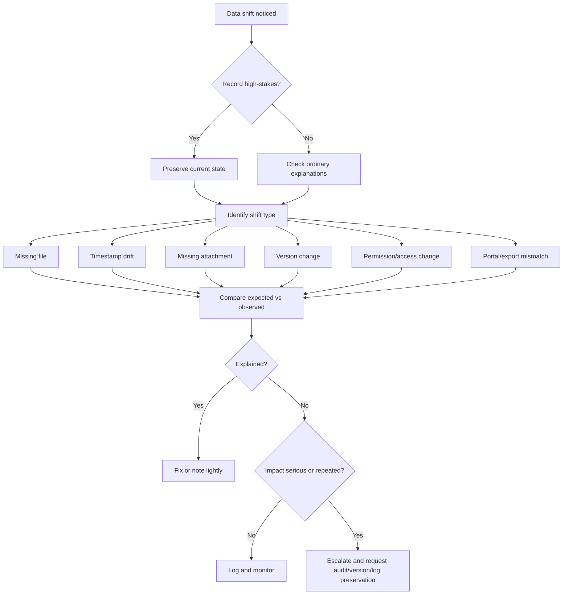

# 🚩 Data Shift Red Flags

**First created:** 2026-06-03 | **Last updated:** 2026-06-03  
*When missing files, timestamp drift, vanished attachments, version changes, metadata weirdness, or record mismatches deserve closer review or escalation.*

---

## 🌱 Purpose

A data shift is not automatically suspicious.

Files move.  
Cloud sync sulks.  
Email clients hide attachments.  
Export tools miss images.  
Timestamps lie by omission.  
Version history is sometimes a haunted wardrobe.  
People rename files and then swear blind that they did not.

Most record weirdness has ordinary explanations.

But some data shifts deserve closer care.

Especially when the record matters.

Evidence.  
Medical records.  
Legal documents.  
Safeguarding notes.  
Complaint material.  
Employment files.  
Academic submissions.  
Financial records.  
Immigration papers.  
Housing records.  
Institutional correspondence.

This node helps identify when a data shift is more than ordinary admin mess and should be logged, preserved, compared, or escalated.

The rule is:

```text
Red flags are not verdicts.
They are preservation cues.
```

---

## 🧭 What This Node Is For

Use this node when you are deciding whether a data-integrity issue is:

* ordinary;
* worth logging;
* pattern-suspected;
* or urgent enough to escalate.

It applies to:

* missing files;
* vanished attachments;
* timestamp drift;
* version reversals;
* empty or hollow documents;
* altered filenames;
* changed paths;
* changed permissions;
* missing embedded images;
* portal/export mismatches;
* cloud/local mismatches;
* duplicate files with subtle differences;
* records appearing differently to different users;
* files changing after complaint, evidence upload, access request, deadline, or institutional contact.

This node does not prove cause.

It helps decide what level of care the record deserves.

---

## 🧰 First Rule: Red Flag Does Not Mean Tampering

A red flag means:

```text
This deserves closer handling.
```

It does not automatically mean:

```text
This was malicious.
```

Good language:

```text
The file change deserves preservation and comparison.
```

```text
The missing attachment affects a high-stakes deadline, so an alternate route is needed.
```

```text
The timestamp mismatch is unexplained and should be logged.
```

Avoid:

```text
This proves they altered the record.
```

```text
They deleted my evidence.
```

```text
The metadata confirms interference.
```

Those may be later concerns.

The first record should describe the observable shift.

---

## 🚩 Core Red Flags

### 📂 Missing evidence or important records

A missing file becomes more serious when it affects:

* evidence;
* complaint material;
* medical care;
* safeguarding;
* legal advice;
* employment;
* housing;
* immigration;
* education;
* financial records;
* deadline proof;
* submission receipts.

Useful sentence:

```text
The missing file affects [process/deadline/record type], so it needs preservation and escalation rather than casual recreation.
```

Action:

```text
Preserve the missing state. Search ordinary locations. Use alternate route if needed. Request audit/version preservation.
```

---

### 🕰️ Timestamp changes that affect meaning

Timestamp drift matters when the timestamp could affect:

* whether something was on time;
* whether a record existed;
* whether a file was changed;
* whether a submission was received;
* whether a version was current;
* whether an export reflects the source.

Red flags include:

* created date later than expected;
* modified date changed unexpectedly;
* submitted time missing or different;
* portal time differs from export time;
* local time differs from cloud time without explanation;
* timestamp changes after complaint, access request, evidence upload, or deadline.

Useful sentence:

```text
The timestamp mismatch may affect whether the record is treated as [submitted/on time/current/unchanged].
```

Action:

```text
Identify which timestamp label is visible. Preserve screenshots. Compare portal, local, cloud, export, and version history views.
```

---

### 📎 Attachments missing from one side only

A missing attachment is more concerning when:

* sender sees it but recipient does not;
* portal shows it but export omits it;
* secure route lists it but download lacks it;
* attachment count differs across views;
* the recipient may act on an incomplete record;
* the attachment relates to evidence, care, safeguarding, legal, or complaint material.

Useful sentence:

```text
The sender/source view shows [attachment], but the recipient/export view does not.
```

Action:

```text
Preserve both views. Check file size, type, thread view, filters, and permissions. Use an alternate verified route if high-stakes.
```

---

### 🧾 Version history mismatch or unexplained reversal

Version issues become red flags when:

* current version is empty;
* newer text reverts to older text;
* last-good version disappears;
* version history has gaps;
* editor labels are unexpected;
* restore points appear without explanation;
* comments, tracked changes, tables, images, or attachments vanish;
* current file differs from portal/source/export in a material way.

Useful sentence:

```text
The current version differs materially from the last known good version.
```

Action:

```text
Screenshot before restoring. Export current and last-good versions if safe. Identify authoritative copy.
```

---

### 🔐 Permission or access changes around a record

Permission changes matter when:

* a file link still exists but now says access denied;
* a shared file disappears from view;
* owner changes unexpectedly;
* download button disappears;
* recipient can no longer open cloud link;
* a record moves into restricted view;
* role/access changes affect evidence or deadlines.

Useful sentence:

```text
The record appears to exist, but access changed from [previous state] to [current state].
```

Action:

```text
Record link, error, account, time, and permission state. Route access mechanics to Access Barriers if needed.
```

---

### 🪞 Same file, different truth across systems

This is a major data-integrity red flag.

Examples:

* portal shows five attachments; export contains three;
* cloud version has images; local version does not;
* sender sees attachment; recipient does not;
* one user sees full record; another sees partial record;
* downloaded PDF differs from source view;
* local file differs from preserved copy;
* mobile app view differs from web view.

Useful sentence:

```text
The same record appears differently in [system A] and [system B].
```

Action:

```text
Preserve both views. Compare file size, timestamp, attachment count, version history, and checksum if useful.
```

---

### 🔁 Repeated shifts around the same kind of event

A single data shift may be ordinary.

Repeated shifts around the same context deserve logging.

Red flag contexts include:

* deadlines;
* complaints;
* evidence uploads;
* access requests;
* medical appointments;
* safeguarding contacts;
* legal/adviser contact;
* employment or academic submissions;
* public posts;
* regulator contact;
* appeal or hearing preparation.

Useful sentence:

```text
Similar data shifts have occurred around [context] on [number] occasions.
```

Action:

```text
Build a timeline overlay. Keep the shifts separate by type. Do not merge everything into one blob.
```

---

## 🟡 Worth-Logging Red Flags

Treat as worth logging when:

* the record matters;
* the shift has no clear ordinary explanation;
* before/after states differ materially;
* a file, attachment, timestamp, version, path, or permission state changed;
* the change caused delay, confusion, or extra work;
* the same kind of shift has happened before;
* another person sees a different version;
* the shift may become important later.

Action:

```text
Make a data shift log.
Preserve screenshots.
Compare expected vs observed.
Avoid overwriting or tidying too soon.
```

This is not escalation theatre.

It is record hygiene.

---

## 🟠 Pattern-Suspected Red Flags

Treat as pattern-suspected when:

* data shifts repeat under similar conditions;
* shifts cluster around deadlines, complaints, access requests, or evidence handling;
* high-stakes records are affected while neutral records are stable;
* portal/source and export versions repeatedly diverge;
* attachments repeatedly vanish with the same contact, route, or file type;
* timestamps repeatedly drift in ways that affect deadlines or interpretation;
* versions repeatedly revert, split, empty, or duplicate;
* permissions shift around sensitive records;
* ordinary explanations do not fit the selectivity;
* comparison checks show the issue follows a file, account, route, or workflow.

Action:

```text
Build a timeline.
Preserve original and observed states.
Use checksum if exact file identity matters.
Make custody notes.
Consider technical, procedural, data-protection, legal, adviser, union, or support review.
```

At this level, use the phrase:

```text
pattern suspected
```

Not:

```text
proven tampering
```

Keep the record credible.

---

## 🔴 Escalate-Now Red Flags

Escalate promptly when:

* evidence is missing, changed, inaccessible, incomplete, or at risk;
* legal, medical, safeguarding, financial, housing, immigration, employment, education, or institutional records are affected;
* a deadline depends on the record;
* a record may be treated as late, missing, altered, or unreliable;
* a recipient may act on an incomplete file;
* the authoritative copy is unclear;
* an audit trail may be needed;
* continued editing, restoring, resending, or testing could make the record worse;
* the system’s version may be used against you.

Action:

```text
Stop editing.
Preserve current state.
Use verified alternate route if needed.
Request audit/version/log preservation.
Ask for written confirmation.
```

This is not about accusing first.

It is about protecting the record before the trail gets worse.

---

## 🧾 Red Flag Checklist

```markdown
## Data Shift Red Flag Checklist

**Issue summary:**  
**Date range:**  
**Record/file involved:**  
**High-stakes area?** yes / no  
**Deadline or live process?** yes / no  

### Shift type

- [ ] Missing file
- [ ] Missing attachment
- [ ] Timestamp drift
- [ ] Version change
- [ ] Empty/hollow document
- [ ] File/path/name changed
- [ ] Permission/access changed
- [ ] Portal/export mismatch
- [ ] Cloud/local mismatch
- [ ] Duplicate/conflict copy
- [ ] Metadata mismatch
- [ ] Record visible differently to different users

### Red flags present

- [ ] Evidence or important record affected
- [ ] Deadline or submission affected
- [ ] Sender/source and recipient/export views differ
- [ ] Current and last-good versions differ materially
- [ ] Timestamp affects meaning
- [ ] Version history unclear or incomplete
- [ ] Permissions changed unexpectedly
- [ ] Same issue repeated before
- [ ] Similar shift occurred around complaints/access requests/deadlines
- [ ] Ordinary explanation not yet found
- [ ] Continued testing/editing could worsen the trail

### Current level

- [ ] Ordinary / low concern
- [ ] Worth logging
- [ ] Pattern suspected
- [ ] Escalate promptly

**Next step:**  
```

---

## 🧪 Red Flags That Need Comparison

Some red flags only become meaningful after comparison.

### “The file disappeared”

Compare:

```text
Expected folder, trash, archive, recent files, filename search, content search, other account, other device, cloud web, local sync.
```

### “The timestamp changed”

Compare:

```text
Timestamp label, timezone, local vs cloud, portal vs export, version history, downloaded copy.
```

### “The attachment vanished”

Compare:

```text
Sender view, recipient view, webmail vs app, thread vs individual message, file size/type, cloud permissions.
```

### “The version changed”

Compare:

```text
Current version, last-good version, local copy, cloud copy, export copy, version history, permissions.
```

### “The record is different for different users”

Compare:

```text
User account, role/permission, device, browser/app, portal view, export view, timestamp and file size.
```

Comparison is not dismissal.

Comparison is how the concern becomes usable.

---

## 🟢 Not Strong Red Flags By Themselves

These are usually not strong red flags alone:

* one missing low-stakes file;
* one app-hidden attachment that appears in webmail;
* one timestamp difference explained by UTC/BST;
* one downloaded export with a fresh local created date;
* one duplicate file after cloud sync conflict;
* one file found in trash/archive;
* one permission issue explained by wrong account;
* one version showing your own edit;
* one attachment blocked because it exceeded size limits;
* one portal export made without selecting “include attachments.”

They may still be annoying.

They may still deserve a note.

But they do not carry a heavy claim by themselves.

---

## 🧯 False-Positive Traps

Common ordinary causes include:

* wrong account;
* wrong browser profile;
* local vs cloud mismatch;
* sync paused;
* sync conflict copy;
* file in trash/archive;
* filters or sorting hiding records;
* mobile app display issue;
* collapsed email thread;
* cloud link permissions;
* file size limit;
* file type block;
* export setting omitted attachments;
* downloaded copy showing download date as created date;
* UTC/BST conversion;
* autosave changing modified time;
* app update changing metadata;
* version restore by known user;
* duplicate “final” files;
* storage quota problems;
* email security stripping attachments.

Check boring causes.

Not because the concern is silly.

Because boring causes are easier to fix and make the remaining red flags sharper.

---

## 🧷 High-Value Red Flag Combinations

One red flag may be weak.

Combinations matter.

### Missing file + deadline

```text
Evidence file absent from expected portal folder during live deadline window.
```

Level:

```text
Escalate promptly if alternate copy/submission route is needed.
```

### Timestamp drift + deadline meaning

```text
Submission record shows a timestamp that could make an on-time filing appear late.
```

Level:

```text
Worth logging or escalate, depending on consequence.
```

### Sender/source shows attachment + recipient/export lacks it

```text
Source view shows attachment, destination view does not.
```

Level:

```text
Pattern suspected if repeated; escalate if record is high-stakes.
```

### Current version empty + last-good version visible

```text
Document body is empty now, but full content appears in version history.
```

Level:

```text
Escalate if evidence or deadline affected; preserve before restoring.
```

### Portal/source differs from export

```text
Portal shows records that export omits.
```

Level:

```text
Worth logging; pattern suspected if repeated; escalate if relied on officially.
```

### Permission change + important record

```text
Link exists but access denied after complaint/access request/deadline activity.
```

Level:

```text
Pattern suspected or escalate depending on impact.
```

---

## 🧮 Simple Red Flag Scoring

Use this only as a thinking aid.

Give one point for each:

```markdown
- high-stakes record affected
- deadline/live process affected
- missing file or attachment
- timestamp affects interpretation
- current and expected version differ materially
- sender/source and recipient/export views differ
- same issue repeated before
- ordinary explanation not found
- permissions changed unexpectedly
- continued testing/editing could worsen the trail
```

Rough guide:

```text
0-1: likely ordinary / low concern
2-3: worth logging
4-6: pattern suspected
7+ or serious high-stakes impact: escalate promptly
```

This is not science.

A single missing legal deadline file can be escalation-worthy even with a low score.

Use judgement.

---

## 🧷 Clean Escalation Sentence

Use this when a data shift needs escalation.

```text
The attached record shows a data-integrity issue affecting [file/record]. Expected state: [expected]. Observed state: [observed]. I have preserved screenshots/copies showing [artifacts]. This affects [deadline/process/record purpose]. Please confirm whether the record was moved, altered, omitted, permission-restricted, restored, or otherwise changed, and preserve any relevant audit, access, delivery, export, or version logs.
```

Example:

```text
The attached record shows a data-integrity issue affecting evidence_bundle.pdf. Expected state: the file should be visible in the complaint portal evidence folder with three attachments. Observed state: the portal folder is visible but the file is absent, while the submission receipt indicates upload on 1 June 2026. I have preserved screenshots of the folder, receipt, and current export. This affects a live complaint deadline. Please confirm whether the record was moved, altered, omitted, permission-restricted, restored, or otherwise changed, and preserve any relevant audit, access, delivery, export, or version logs.
```

Ask for:

* restoration;
* explanation of timestamp;
* audit log preservation;
* access log preservation;
* version history;
* delivery/export logs;
* written confirmation;
* deadline protection;
* identification of authoritative copy.

---

## 🛑 What Not To Do With Red Flags

Do not:

* restore before screenshotting;
* resend blindly ten times;
* recreate the missing file with the same name;
* delete duplicates too early;
* edit the only copy;
* rename without recording old name;
* clear trash, spam, logs, or cache before documenting;
* rely only on memory;
* accuse before describing;
* merge five different symptoms into one vague blob;
* ignore boring explanations;
* ignore high-stakes impact.

The right move is usually:

```text
Preserve.
Compare.
Route.
Escalate if needed.
```

Not:

```text
Panic-click everything until the evidence trail is soup.
```

---

## 🗂 Red Flag Summary Template

```text
Between [date] and [date], [data shift] affected [file/record]. Expected state: [expected]. Observed state: [observed]. Red flags present: [list]. Checks performed: [checks]. Artifacts preserved: [artifacts]. Practical impact: [impact]. Current level: [ordinary / worth logging / pattern suspected / escalate]. Next step: [action].
```

Example:

```text
Between 1 June and 3 June 2026, a data shift affected evidence_bundle.pdf. Expected state: file visible in complaint portal evidence folder after upload receipt. Observed state: file absent from portal folder and current export. Red flags present: evidence record affected, live deadline, portal/export mismatch, and missing file after submission. Checks performed: active folder, archive view, current account, receipt, and export. Artifacts preserved: screenshots of folder, receipt, and export. Practical impact: possible prejudice to complaint deadline. Current level: escalate promptly. Next step: use alternate verified submission route and request audit/version preservation.
```

---

## 🗺 Mini Flow



---

## 🌌 Constellations

🚩 📂 🧾 🕰️ 📎 🧮 📜 — data-integrity red flags; missing records; timestamp meaning; attachment comparison; checksums; custody notes.

---

## ✨ Stardust

data shift red flags, record integrity, missing evidence, timestamp mismatch, version reversal, attachment loss, portal export mismatch, permission change, authoritative copy, audit preservation

---

## 🏮 Footer

*🚩 Data Shift Red Flags* is a living node of the **Polaris Protocol**.

It helps people recognise when record weirdness deserves more than a shrug and less than a panic spiral.

A red flag is not a verdict.

It is a cue to ask:

```text
What changed?
Compared with what?
What record matters?
What must be preserved now?
```

> 📡 Cross-references:
>
> * [🩻 Weirdness Screening](../README.md) — *first-notice triage for ordinary glitches, persistent anomalies, and escalation-worthy weirdness*
> * [📂 Data Shifts](./README.md) — *record, file, timestamp, attachment, metadata, and version-history triage*
> * [📂 Missing File Triage](./📂_missing_file_triage.md) — *what to do when a file or record cannot be found*
> * [🕰️ Timestamp Drift Triage](./🕰️_timestamp_drift_triage.md) — *created/modified/uploaded/accessed time confusion*
> * [📎 Attachment Disappeared Triage](./📎_attachment_disappeared_triage.md) — *missing or stripped attachments*
> * [🧾 Version History Checklist](./🧾_version_history_checklist.md) — *checking and preserving version history*
> * [🧮 Basic Checksum Guide](./🧮_basic_checksum_guide.md) — *simple file hashing for integrity checks*
> * [📜 Chain Of Custody Basics](./📜_chain_of_custody_basics.md) — *everyday custody notes for important records*

*Survivor authorship is sovereign. Containment is never neutral.*
