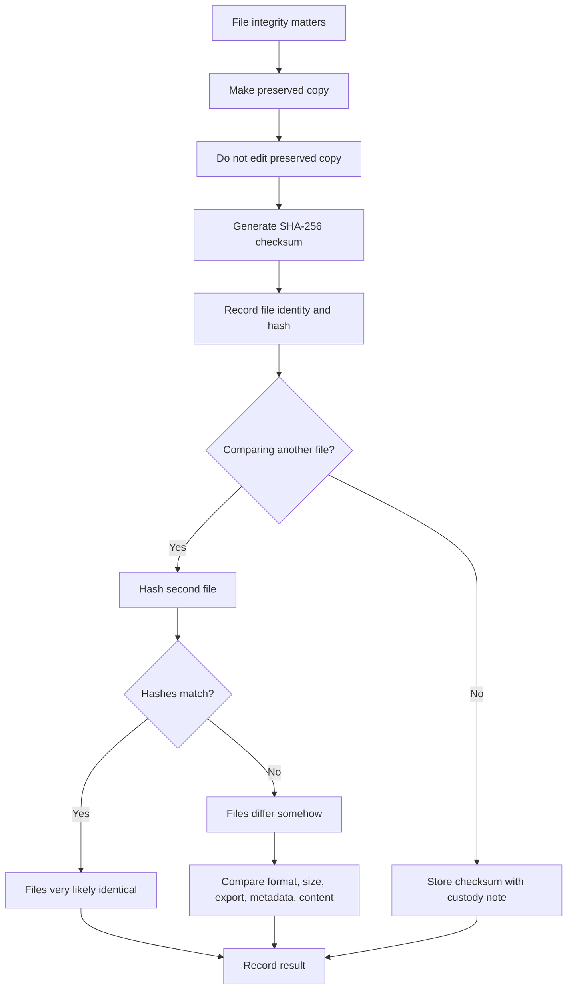

# 🧮 Basic Checksum Guide

**First created:** 2026-06-03 | **Last updated:** 2026-06-03  
*Simple file hashing for checking whether two copies of a file are exactly the same, and for preserving evidence integrity.*

---

## 🌱 Purpose

A checksum is a short digital fingerprint of a file.

If two copies of a file have the same checksum, they are very likely identical.

If the checksums are different, something about the file is different.

That difference may be meaningful.

It may also be boring.

A file may differ because it was edited, exported, compressed, converted, opened in a program that rewrote metadata, downloaded again, renamed badly, synced through cloud storage, or saved as a new copy.

A checksum does not tell you why a file changed.

It only helps answer one narrow question:

```text
Are these two files exactly the same?
```

This node gives a basic, non-fancy way to use checksums for record integrity.

The rule is:

```text
Copy first.
Hash the preserved copy.
Record the hash.
Do not edit the preserved copy.
```

---

## 🧭 What This Node Is For

Use this node when exact file integrity matters.

Examples:

* evidence file may have changed;
* two copies have the same name but may differ;
* downloaded export may not match portal source;
* file was sent to someone and you want to confirm the copy;
* a file may need legal, technical, institutional, or adviser review;
* you want to preserve a stable copy before editing a working version;
* version history is unclear;
* a file appears empty, shortened, corrupted, or altered;
* you need to show a file stayed unchanged after a certain point.

This node is not needed for every ordinary file.

Do not checksum your entire life because a spreadsheet annoyed you.

Use it when the record matters.

---

## 🧠 What A Checksum Can And Cannot Tell You

A checksum can tell you:

* whether two files are exactly identical;
* whether a preserved copy has stayed unchanged;
* whether a downloaded copy differs from another copy;
* whether a file changed after a known point;
* whether a file sent to someone matches the copy you kept.

A checksum cannot tell you:

* who changed a file;
* why a file changed;
* whether a change was malicious;
* whether the content is true;
* whether the file is legally admissible;
* whether metadata has a meaningful explanation;
* whether a platform behaved properly.

Good language:

```text
The preserved copy and sent copy have the same SHA-256 checksum.
```

```text
The portal export and local copy have different checksums, so the files are not identical.
```

Avoid:

```text
The checksum proves tampering.
```

It does not.

It proves sameness or difference.

That is already useful.

---

## 🧾 Basic Terms

### Hash

A hash is the fingerprint produced by a checksum tool.

Example:

```text
3a6eb0790f39ac87c94f3856b2dd2c5d110e6811602261a9a923d3bb23adc8b7
```

### Algorithm

The method used to create the hash.

Use:

```text
SHA-256
```

unless you have a reason to use something else.

Avoid older weaker options like MD5 for serious evidence preservation.

### Preserved copy

The copy you do not edit.

### Working copy

The copy you can open, annotate, redact, convert, or send.

### Hash record

The note where you record the file name, date, tool, algorithm, and checksum.

---

## 🛑 First Rule: Do Not Hash The Only Live Copy And Then Edit It

Before hashing, make a preserved copy.

Suggested naming:

```text
evidence_bundle_original_preserved_2026-06-03.pdf
```

Then make a working copy if needed:

```text
evidence_bundle_working_copy_2026-06-03.pdf
```

Use the preserved copy for the checksum.

Use the working copy for edits.

Do not annotate, redact, convert, compress, or re-save the preserved copy after hashing.

If you must make a new preserved version later, hash that too and label it clearly.

---

## 🧾 Minimal Checksum Log

Use this format.

```yaml
checksum_record:
  when_hashed: ""
  timezone: ""
  file_name: ""
  file_path_or_location: ""
  file_size: ""
  source: ""
  purpose: ""
  algorithm: "SHA-256"
  checksum: ""
  tool_or_command_used: ""
  device: ""
  account_or_storage_location: ""
  preserved_copy: true
  working_copy_created: true/false
  related_record_or_case: ""
  notes: ""
```

---

## 🧾 Plain English Version

```text
Date/time hashed:
Timezone:
File name:
File location:
File size:
Where file came from:
Why I hashed it:
Algorithm:
Checksum:
Tool/command used:
Device:
Storage/account:
Is this the preserved copy?
Working copy made?
Related case/record:
Notes:
```

The important parts are:

```text
file name
date/time
algorithm
checksum
which copy this refers to
```

Without those, the hash becomes a mysterious noodle.

---

## 🖥 Simple Commands

Use `SHA-256`.

### macOS

Open Terminal and run:

```bash
shasum -a 256 "/path/to/file.pdf"
```

Example:

```bash
shasum -a 256 "evidence_bundle_original_preserved_2026-06-03.pdf"
```

### Linux

Open Terminal and run:

```bash
sha256sum "/path/to/file.pdf"
```

Example:

```bash
sha256sum "evidence_bundle_original_preserved_2026-06-03.pdf"
```

### Windows PowerShell

Open PowerShell and run:

```powershell
Get-FileHash "C:\path\to\file.pdf" -Algorithm SHA256
```

Example:

```powershell
Get-FileHash "C:\Users\Name\Documents\evidence_bundle_original_preserved_2026-06-03.pdf" -Algorithm SHA256
```

Copy the full hash into your checksum log.

Do not hand-type it if you can avoid it.

Humans are excellent at typos and then acting betrayed by them.

---

## 🧪 Comparing Two Files

To compare two files:

1. Hash file A.
2. Hash file B.
3. Compare the SHA-256 strings exactly.

Example:

```text
File A SHA-256:
aaa111...

File B SHA-256:
aaa111...
```

Same hash:

```text
The files are very likely identical.
```

Different hash:

```text
The files differ in some way.
```

A tiny difference still changes the hash.

That difference might be:

* content edit;
* metadata change;
* export setting;
* compression;
* conversion;
* different download;
* added comment;
* removed attachment;
* line-ending change;
* timestamp embedded inside the file.

A different hash does not automatically mean meaningful content changed.

It means the files are not identical.

---

## 🧾 Example Checksum Record

```yaml
checksum_record:
  when_hashed: "2026-06-03T15:42:00+01:00"
  timezone: "Europe/London"
  file_name: "evidence_bundle_original_preserved_2026-06-03.pdf"
  file_path_or_location: "/Documents/Polaris_Evidence/Preserved/"
  file_size: "2.4 MB"
  source: "Downloaded from complaint portal"
  purpose: "Preserve evidence copy before sending working copy"
  algorithm: "SHA-256"
  checksum: "3a6eb0790f39ac87c94f3856b2dd2c5d110e6811602261a9a923d3bb23adc8b7"
  tool_or_command_used: "shasum -a 256"
  device: "MacBook"
  account_or_storage_location: "Local encrypted folder"
  preserved_copy: true
  working_copy_created: true
  related_record_or_case: "Complaint evidence bundle"
  notes: "Preserved copy not edited after hashing."
```

---

## 📂 When To Use Checksums In Data Shifts

### Missing file recovered

If a missing file reappears and you have an older copy:

```text
Hash both copies to check whether they are identical.
```

Route also to:

```text
./📂_missing_file_triage.md
```

### Timestamp drift

If a timestamp changed but you are not sure whether content changed:

```text
Hash current copy and preserved earlier copy if available.
```

Route also to:

```text
./🕰️_timestamp_drift_triage.md
```

### Attachment disappeared

If sender and recipient both have a file with the same name:

```text
Hash both copies to confirm whether they match.
```

Route also to:

```text
./📎_attachment_disappeared_triage.md
```

### Version history issue

If current and last-good versions are exported:

```text
Hash each exported version and label clearly.
```

Route also to:

```text
./🧾_version_history_checklist.md
```

### Chain of custody

If a file is evidence or may be reviewed later:

```text
Record the checksum in the custody note.
```

Route also to:

```text
./📜_chain_of_custody_basics.md
```

---

## 📜 Checksum Naming Practice

Use boring filenames.

Good:

```text
2026-06-03_evidence_bundle_original_preserved.pdf
2026-06-03_evidence_bundle_working_copy_redacted.pdf
2026-06-03_evidence_bundle_checksum_log.md
```

Less useful:

```text
final_final_REAL_ONE.pdf
```

Worse:

```text
the_one_they_cant_touch_lol.pdf
```

Satisfying, yes.

Bad evidence hygiene.

Use names that will not embarrass you in front of a solicitor, regulator, data controller, or future tired version of yourself.

---

## 🧮 Checksum Comparison Table

```markdown
| File | Source | Date/time hashed | Algorithm | Checksum | Notes |
|---|---|---|---|---|---|
|  |  |  | SHA-256 |  |  |
|  |  |  | SHA-256 |  |  |
```

Example:

```markdown
| File | Source | Date/time hashed | Algorithm | Checksum | Notes |
|---|---|---|---|---|---|
| evidence_original.pdf | Portal download | 2026-06-03 15:42 BST | SHA-256 | 3a6e...c8b7 | Preserved copy |
| evidence_sent_copy.pdf | Email sent attachment | 2026-06-03 16:10 BST | SHA-256 | 3a6e...c8b7 | Matches preserved copy |
```

Summary:

```text
The sent attachment matches the preserved portal download by SHA-256 checksum.
```

---

## 🧯 Do Not Make The Hash Useless

Avoid:

* hashing a file after editing it and calling it original;
* hashing a file without recording which copy it was;
* renaming files without noting old names;
* overwriting the preserved copy;
* hashing a cloud placeholder instead of the downloaded file;
* comparing a PDF export against the original Word document and expecting same hash;
* comparing compressed ZIP against unzipped contents and expecting same hash;
* hand-copying long hashes without checking;
* using screenshots of documents as if they hash the underlying document;
* hashing a file inside an app view rather than the actual downloaded file.

A checksum only works if it is attached to a clearly identified file.

No identity, no value.

---

## 🧷 What If The Hashes Differ?

Do not panic.

Write:

```text
The SHA-256 checksums differ, so the files are not identical.
```

Then ask:

* Are they different formats?
* Is one an export?
* Is one compressed?
* Was one opened and saved?
* Does one include metadata the other lacks?
* Are file sizes different?
* Are page counts different?
* Are attachments/images present in both?
* Was one redacted?
* Was one downloaded at a different time?
* Are they from different systems?

Then compare content if needed.

A different hash is a starting point.

Not a verdict.

---

## 🟢 When Checksums Are Not Needed

Do not bother if:

* the file is low-stakes;
* the issue is already explained;
* you only need to find a misplaced file;
* you are comparing two visibly different formats;
* you do not need exact identity;
* hashing would create stress without practical benefit.

Your attention is a resource.

Do not spend it proving that a pizza menu PDF stayed unchanged.

Unless the pizza menu is somehow evidence.

In which case, frankly, archive the pizza.

---

## 🔴 When A Checksum Is Worth It

Use a checksum when:

* evidence integrity matters;
* a deadline or complaint depends on the file;
* legal, medical, safeguarding, financial, employment, academic, housing, immigration, or institutional records are involved;
* file copies may be challenged;
* a file may be sent between people;
* a document may need technical review;
* you need to preserve before editing or redacting;
* you need to show a file has stayed stable since a known time.

The more the record matters, the more useful boring technical receipts become.

---

## 🧷 Clean Escalation Sentence

When using a checksum in escalation, say:

```text
I preserved a copy of [file name] on [date/time] and recorded its SHA-256 checksum: [checksum]. I have not edited the preserved copy. This is provided to support file integrity comparison, not as an explanation of cause.
```

Example:

```text
I preserved a copy of evidence_bundle_original_preserved_2026-06-03.pdf on 3 June 2026 at 15:42 BST and recorded its SHA-256 checksum: 3a6eb0790f39ac87c94f3856b2dd2c5d110e6811602261a9a923d3bb23adc8b7. I have not edited the preserved copy. This is provided to support file integrity comparison, not as an explanation of cause.
```

Plain.

Precise.

No theatre.

---

## 🗂 Copy-Paste Checksum Entry

```markdown
## Checksum Entry

**Date/time hashed:**  
**Timezone:**  
**File name:**  
**File location/path:**  
**File size:**  
**Source:**  
**Purpose:**  
**Algorithm:** SHA-256  
**Checksum:**  
**Tool/command used:**  
**Device:**  
**Storage/account:**  
**Preserved copy?** yes / no  
**Working copy created?** yes / no  
**Related record/case:**  
**Notes:**  
```

---

## 🗂 Copy-Paste Comparison Table

```markdown
| File | Source | Date/time hashed | Algorithm | Checksum | Match? | Notes |
|---|---|---|---|---|---|---|
|  |  |  | SHA-256 |  |  |  |
|  |  |  | SHA-256 |  |  |  |
```

---

## 🗺 Mini Flow



---

## 🌌 Constellations

🧮 📂 🧾 📜 🕰️ — checksums; file identity; version comparison; chain of custody; metadata discipline.

---

## ✨ Stardust

checksum, SHA-256, file hash, file integrity, preserved copy, working copy, evidence preservation, hash comparison, file identity, digital fingerprint

---

## 🏮 Footer

*🧮 Basic Checksum Guide* is a living node of the **Polaris Protocol**.

It gives people a simple way to check whether files match exactly and to preserve important records without pretending that a checksum explains everything.

```text
A checksum proves sameness or difference.
It does not prove motive.
```

> 📡 Cross-references:
>
> * [🩻 Weirdness Screening](../README.md) — *first-notice triage for ordinary glitches, persistent anomalies, and escalation-worthy weirdness*
> * [📂 Data Shifts](./README.md) — *record, file, timestamp, attachment, metadata, and version-history triage*
> * [📂 Missing File Triage](./📂_missing_file_triage.md) — *what to do when a file or record cannot be found*
> * [🕰️ Timestamp Drift Triage](./🕰️_timestamp_drift_triage.md) — *created/modified/uploaded/accessed time confusion*
> * [📎 Attachment Disappeared Triage](./📎_attachment_disappeared_triage.md) — *missing or stripped attachments*
> * [🧾 Version History Checklist](./🧾_version_history_checklist.md) — *checking and preserving version history*
> * [📜 Chain Of Custody Basics](./📜_chain_of_custody_basics.md) — *everyday custody notes for important records*
> * [🚩 Data Shift Red Flags](./🚩_data_shift_red_flags.md) — *when record-integrity issues need escalation*

*Survivor authorship is sovereign. Containment is never neutral.*
