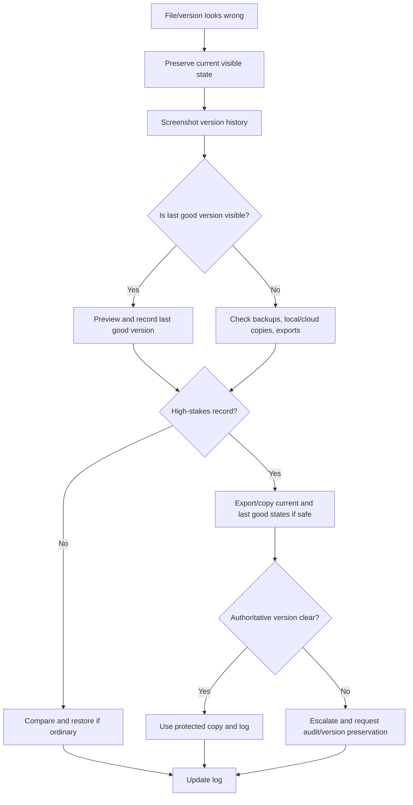

# 🧾 Version History Checklist

**First created:** 2026-06-03 | **Last updated:** 2026-06-03  
*How to inspect, preserve, and compare version history when a file, record, draft, or document appears changed, reverted, emptied, duplicated, or overwritten.*

---

## 🌱 Purpose

Version history is where a record tells you some of what happened to it.

Not always everything.  
Not always clearly.  
Not always honestly enough for comfort.

But often enough to help.

A document may look wrong now, but version history may show:

* previous content;
* an older draft;
* when a change happened;
* who edited it, if visible;
* whether a restore occurred;
* whether content disappeared;
* whether a file split into copies;
* whether an export created a new object;
* whether the visible document is not the authoritative one.

When a document appears changed, do not immediately restore it.

Restoring may fix the working copy, but it can also hide the state you needed to record.

This node helps you check version history carefully, preserve what you can see, and decide what to do next.

The rule is:

```text
Screenshot before restoring.
Compare before editing.
Preserve the original state.
Name the authoritative version.
```

---

## 🧭 What This Node Is For

Use this node when a file, draft, document, record, or export appears to have changed unexpectedly.

Examples:

* document body is empty;
* newer text has reverted to older text;
* file appears shorter than expected;
* comments or tracked changes disappeared;
* images, tables, or attachments are missing;
* file has duplicate versions with slight differences;
* cloud document shows unexpected edits;
* a draft reverted after sync;
* current version differs from downloaded copy;
* portal record differs from exported copy;
* version history shows gaps or odd restore points;
* a record changes after complaint, evidence upload, access request, deadline, or institutional contact.

This node is not for proving malicious editing from one odd version.

It is for preserving the visible version trail and identifying what changed.

---

## 🛑 First Rule: Do Not Restore Yet

When a file looks wrong, the obvious move is to restore the last good version.

Sometimes that is the right final step.

It is not the first step.

Before restoring, preserve:

* current visible state;
* version history list;
* timestamps;
* version labels;
* editor names or account labels, if visible;
* file path;
* file size;
* current title;
* current sharing/permission state;
* current comments or activity log;
* the last known good version;
* any error messages or sync warnings.

Why?

Because restoring can change:

* current modified time;
* visible version order;
* activity log;
* conflict state;
* file metadata;
* the evidence of the broken state.

A restored document is useful.

A documented broken state is evidence.

Get both if you can.

---

## 🧾 Minimal Version History Log

Use this when a version looks wrong.

```yaml
when_noticed: ""
timezone: ""
category: "version_history"
system_or_platform: ""
account: ""
device: ""
record_or_file_name: ""
record_id_or_reference: ""
location_or_path: ""
current_visible_state:
  timestamp: ""
  version_label: ""
  file_size: ""
  content_summary: ""
  attachment_or_image_count: ""
  comments_or_tracks_visible: ""
expected_state:
  expected_timestamp: ""
  expected_version_label: ""
  expected_content_summary: ""
  expected_attachment_or_image_count: ""
last_known_good:
  when: ""
  source: ""
  artifact: ""
version_history_checked: null
version_history_summary:
  versions_visible: ""
  oldest_visible_version: ""
  newest_visible_version: ""
  notable_changes:
    - ""
editor_or_actor_labels_visible:
  - ""
permissions_checked: null
comparison_tests:
  downloaded_copy: null
  local_copy: null
  cloud_copy: null
  portal_view: null
  export_copy: null
  checksum: null
artifacts:
  - ""
impact: ""
risk_level: "green / yellow / orange / red"
next_step: ""
notes: ""
```

---

## 🧾 Plain English Version

```text
Date/time noticed:
Timezone:
System/platform:
Account:
Device:
File/record name:
Location/path:
Current visible state:
Expected state:
Last known good version:
Version history checked:
What versions are visible:
Notable version changes:
Editor/account labels visible:
Permissions checked:
Comparison checks:
Screenshots/artifacts saved:
Impact:
Risk level:
Next step:
Notes:
```

The most important sentence is:

```text
Current visible version differs from expected version because...
```

Fill that in plainly.

---

## 📸 What To Screenshot First

Before clicking restore, download, rename, or edit, screenshot:

* current document view;
* current folder/file listing;
* current timestamp;
* current filename/path;
* current file size if visible;
* version history panel;
* list of visible versions;
* selected version preview;
* editor or account labels if visible;
* sharing/permission panel if relevant;
* activity log if available;
* comments or tracked changes state;
* any sync warning or conflict notice.

Good artifact names:

```text
2026-06-03_1410_current_empty_document.png
2026-06-03_1412_version_history_panel.png
2026-06-03_1415_last_good_version_preview.png
```

Bad artifact name:

```text
WHAT_THE_FUCK.png
```

Emotionally correct.

Terrible later.

---

## 🧩 What Counts As A Version Problem?

Version problems include:

### Empty or hollow current version

```text
The file exists, but the body is empty.
```

Possible explanations:

* failed upload;
* sync conflict;
* accidental deletion;
* save failure;
* app crash;
* export error;
* version overwrite;
* shell file created without content.

### Reverted version

```text
Current text is older than yesterday’s text.
```

Possible explanations:

* restore occurred;
* sync conflict;
* local old copy overwrote cloud copy;
* wrong file opened;
* draft conflict;
* version rollback.

### Split versions

```text
Two similar files exist, each with different content.
```

Possible explanations:

* conflict copy;
* duplicate export;
* “save as” copy;
* cloud sync split;
* offline edit collision;
* collaborator copy.

### Missing embedded content

```text
Text remains, but images, tables, attachments, comments, or tracked changes are gone.
```

Possible explanations:

* export format issue;
* unsupported embedded content;
* stripped attachments;
* copy/paste loss;
* conversion error;
* permission issue;
* version-specific view.

### Version history gap

```text
Expected intermediate versions are not visible.
```

Possible explanations:

* platform retention limit;
* permission restriction;
* file copied rather than edited;
* export generated new object;
* version history disabled;
* admin retention rule;
* sync system collapsed changes.

A gap is a concern.

It is not automatically proof of tampering.

---

## 🕰️ Check Version Timestamps Carefully

When reading version history, identify what each time means.

Possible timestamp meanings:

* edited time;
* saved time;
* synced time;
* uploaded time;
* restored time;
* copied time;
* exported time;
* autosaved time;
* server-processed time.

Useful sentence:

```text
Version history shows a restore at 18:41, while the folder modified time shows 18:43.
```

or:

```text
The local created date appears to reflect download time, not original version creation.
```

If timestamps are confusing, route to:

```text
./🕰️_timestamp_drift_triage.md
```

Do not make version claims without knowing which clock you are reading.

---

## 🔐 Check Permissions And Editor Labels

Version history may show who changed something.

Or it may not.

Check whether visible labels show:

* your account;
* another named account;
* anonymous user;
* organisation account;
* service account;
* system action;
* restore action;
* migration action;
* imported copy;
* unknown editor.

Also check:

* who has access;
* whether permissions changed;
* whether link sharing changed;
* whether ownership changed;
* whether the file moved into a shared drive;
* whether a collaborator can see different history.

Good sentence:

```text
Version history shows a change by my account, but I do not recognise making that edit.
```

Better than:

```text
Someone edited it.
```

If the label is visible, record it.

If it is not visible, say that.

Do not invent actor identity.

---

## 🧪 Compare Current, Last Good, And Exported Copies

At minimum, compare:

| Copy/view | What it shows | Timestamp | Artifact |
|---|---|---|---|
| Current live document |  |  |  |
| Last known good version |  |  |  |
| Downloaded/exported copy |  |  |  |
| Local copy |  |  |  |
| Cloud copy |  |  |  |
| Portal/source view |  |  |  |

Questions:

* What content is present now?
* What content was present in the last good version?
* What changed?
* Are images/attachments/comments present?
* Are filenames the same?
* Are file sizes different?
* Are timestamps different?
* Is the exported copy a new file object?
* Is the local copy older or newer than the cloud copy?

Good sentence:

```text
Current live document is empty. Version from 2026-06-02 18:41 contains full text. Downloaded copy from 2026-06-02 also contains full text.
```

That is useful.

---

## 🧮 When To Use A Checksum

Checksums help when you need to know whether two file copies are exactly identical.

Use them when:

* evidence must be preserved;
* downloaded copy may differ from live version;
* you need to prove a preserved copy stayed stable;
* multiple copies have similar names;
* a file may have been altered after export;
* you are handing a copy to someone else.

Basic principle:

```text
Copy first.
Hash the preserved copy.
Record the hash.
Do not edit the preserved copy.
```

A checksum can show:

```text
These two files are identical.
```

or:

```text
These two files differ.
```

It cannot show:

```text
Why they differ.
```

For details, route to:

```text
./🧮_basic_checksum_guide.md
```

---

## 🧯 Do Not Make Version History Worse

Avoid:

* restoring before screenshotting;
* editing the live document before exporting;
* deleting duplicate/conflict copies;
* renaming suspected versions too early;
* accepting/rejecting tracked changes;
* resolving comments;
* converting the only copy;
* overwriting exports;
* syncing an old local copy over a newer cloud copy;
* clearing activity logs;
* removing collaborators before recording permissions;
* relying only on memory.

Version history is fragile enough.

Do not take a broom to the crime scene because the room looks untidy.

---

## 🚦 Risk Levels

### 🟢 Green — Ordinary / Low Concern

Use when:

* version history clearly shows your own recent edit;
* restore explains current state;
* wrong copy explains mismatch;
* export generated a new file object;
* duplicate/conflict copy is ordinary and low-stakes;
* no important record is affected.

Action:

```text
Fix the working version. Note lightly if useful.
```

### 🟡 Yellow — Worth Logging

Use when:

* the document matters;
* current version differs materially from expected version;
* version history is unclear;
* comments, images, attachments, or tracked changes are missing;
* the change caused delay or confusion;
* the same kind of version issue has happened before.

Action:

```text
Make a version history log. Preserve screenshots. Export current and last good versions if safe.
```

### 🟠 Orange — Pattern Suspected

Use when:

* versions revert after similar actions;
* version changes cluster around deadlines, complaints, access requests, or submissions;
* current file differs from portal/source/export in repeated ways;
* version history has unexpected gaps;
* permissions or editor labels shift around the same time;
* sensitive material is affected while neutral files remain stable;
* duplicate/conflict copies appear repeatedly.

Action:

```text
Build a timeline. Preserve original and last good copies. Consider checksum, custody notes, and technical/procedural review.
```

### 🔴 Red — Escalate Promptly

Use when:

* evidence content is missing or changed;
* legal, medical, safeguarding, financial, housing, immigration, employment, education, or institutional records are affected;
* a deadline, complaint, hearing, appointment, appeal, or investigation depends on the version;
* a current version may be used against you;
* the authoritative copy is unclear or at risk;
* continued editing could make the record worse.

Action:

```text
Stop editing the live record. Preserve screenshots and copies. Use alternate route if needed. Escalate and request audit/version preservation.
```

---

## 🧷 Clean Escalation Sentence

When reporting a version-history issue, use plain language.

```text
The current version of [file/record] differs from the expected version. Current visible state: [summary]. Last known good state: [summary + time/source]. I have preserved screenshots of the current state and version history. Please confirm whether any edit, restore, sync, migration, permission change, or system action occurred, and preserve relevant version/audit logs.
```

Example:

```text
The current version of evidence_notes.docx differs from the expected version. Current visible state: document body appears empty. Last known good state: full notes visible in version history at 18:41 on 2 June 2026. I have preserved screenshots of the current state and version history. Please confirm whether any edit, restore, sync, migration, permission change, or system action occurred, and preserve relevant version/audit logs.
```

Ask for:

* version restoration;
* audit log preservation;
* editor/activity confirmation;
* permission history;
* written confirmation;
* deadline protection if relevant;
* identification of authoritative copy.

Lead with record integrity.

Not accusation.

---

## 🧾 Version History Summary Template

```text
On [date/time noticed], [file/record] appeared [empty/reverted/shortened/changed/duplicated]. Expected state: [summary]. Current state: [summary]. Version history shows [visible versions/timestamps/editor labels]. Checked: [views/checks]. Possible ordinary explanations: [sync/restore/wrong copy/export/etc.]. Impact: [practical harm]. Current level: [ordinary / worth logging / pattern suspected / escalate]. Next step: [action].
```

Example:

```text
On 3 June 2026 at 14:10 BST, evidence_notes.docx appeared empty. Expected state: full notes from 2 June. Current state: file shell exists but body is blank. Version history shows a full-text version at 18:41 on 2 June and current blank version at 09:14 on 3 June. Checked: cloud web view, local sync folder, and downloaded copy. Possible ordinary explanations remain unclear. Impact: evidence notes may be unavailable before complaint deadline. Current level: escalate promptly. Next step: preserve screenshots, export last good version, and request audit/version log preservation.
```

---

## 🗂 Copy-Paste Version History Table

```markdown
| Version/time | Label/editor if visible | Content state | File size/attachments | Notes | Artifact |
|---|---|---|---|---|---|
| Current |  |  |  |  |  |
| Last known good |  |  |  |  |  |
| Earlier version |  |  |  |  |  |
| Export/downloaded copy |  |  |  |  |  |
| Local/cloud comparison |  |  |  |  |  |
```

---

## 🗂 Copy-Paste Version History Entry

```markdown
## Version History Entry

**When noticed:**  
**Timezone:**  
**System/platform:**  
**Account:**  
**Device:**  
**File/record name:**  
**Location/path:**  
**Record/reference ID:**  

### Current visible state

**Current timestamp/version label:**  
**Current content summary:**  
**Current file size:**  
**Images/attachments/comments/tracked changes visible:**  

### Expected state

**Expected version/time:**  
**Expected content summary:**  
**Last known good source:**  

### Version history

| Version/time | Label/editor if visible | Content state | Notes | Artifact |
|---|---|---|---|---|
| Current |  |  |  |  |
| Last known good |  |  |  |  |
| Earlier |  |  |  |  |

### Checks performed

| Check | Result | Artifact |
|---|---|---|
| Current state screenshot |  |  |
| Version history screenshot |  |  |
| Local vs cloud |  |  |
| Portal/source vs export |  |  |
| Permissions/activity |  |  |
| Download/export copy |  |  |
| Checksum if used |  |  |

### Impact

**Practical impact:**  
**Risk level:** green / yellow / orange / red  
**Next step:**  
```

---

## 🗺 Mini Flow



---

## 🌌 Constellations

🧾 📂 🕰️ 🧮 📜 — version history; current vs last-good comparison; timestamp interpretation; checksum support; custody notes.

---

## ✨ Stardust

version history, last known good, restored version, reverted draft, empty document, conflict copy, current version, authoritative copy, audit log, record integrity

---

## 🏮 Footer

*🧾 Version History Checklist* is a living node of the **Polaris Protocol**.

It helps people respond when a document’s past matters: not by panic-restoring, not by assuming alteration, but by preserving the visible trail, comparing current and last-good versions, and protecting the authoritative record.

```text
Screenshot before restoring.
Compare before editing.
Preserve the original state.
Name the authoritative version.
```

> 📡 Cross-references:
>
> * [🩻 Weirdness Screening](../README.md) — *first-notice triage for ordinary glitches, persistent anomalies, and escalation-worthy weirdness*
> * [📂 Data Shifts](./README.md) — *record, file, timestamp, attachment, metadata, and version-history triage*
> * [📂 Missing File Triage](./📂_missing_file_triage.md) — *what to do when a file or record cannot be found*
> * [🕰️ Timestamp Drift Triage](./🕰️_timestamp_drift_triage.md) — *created/modified/uploaded/accessed time confusion*
> * [📎 Attachment Disappeared Triage](./📎_attachment_disappeared_triage.md) — *missing or stripped attachments*
> * [🧮 Basic Checksum Guide](./🧮_basic_checksum_guide.md) — *simple file hashing for integrity checks*
> * [📜 Chain Of Custody Basics](./📜_chain_of_custody_basics.md) — *everyday custody notes for important records*
> * [🚩 Data Shift Red Flags](./🚩_data_shift_red_flags.md) — *when record-integrity issues need escalation*

*Survivor authorship is sovereign. Containment is never neutral.*
