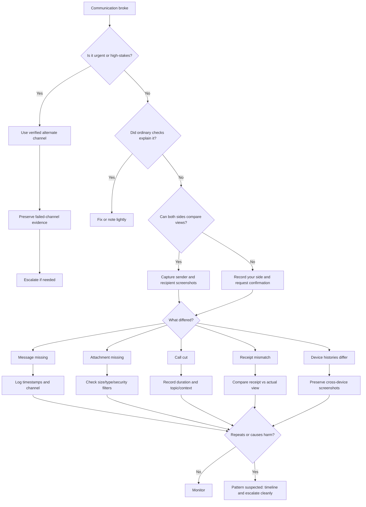

# 📬 Comms Breaks  
**First created:** 2025-09-16 | **Last updated:** 2026-05-30  
*Message, call, attachment, receipt, and conversation-flow triage for when communication quietly fails.*

---

## 🌱 Purpose

This folder is for communication that does not arrive as expected.

A message says sent but is not received.
An attachment disappears.
A call cuts out.
A voice note will not play.
An email bounces.
A read receipt appears but the person says they never saw it.
A conversation becomes fragmented across devices.
A reply arrives late enough to break the whole thread.

Most communication breaks are ordinary.

Apps glitch.
Servers lag.
Mobile networks wobble.
Spam filters overreach.
Attachments exceed size limits.
Devices fall out of sync.
Email clients disagree.
People miss messages.
Notifications fail because the app is tired and the phone is doing tiny bureaucracy.

But communication breaks matter because they can isolate people quietly.

When messages, calls, attachments, referrals, advice, evidence, legal communications, medical updates, safeguarding contact, or support routes fail repeatedly, the failure needs to be handled carefully.

This folder helps people:

* check ordinary causes first;
* confirm sender and recipient views;
* preserve delivery evidence;
* compare across devices and channels;
* log repeated breaks;
* and escalate when communication failure causes practical harm.

The rule here is simple:

> Confirm both sides.
> Save the proof.
> Use another channel if the message matters.

---

## 🧭 What Belongs Here

Use this folder when the weirdness affects communication between people, accounts, services, or devices.

Examples include:

* messages not received;
* messages received late;
* emails bouncing;
* replies arriving out of order;
* attachments missing, stripped, corrupted, or replaced by broken links;
* voice notes failing to send or play;
* calls dropping;
* video calls freezing;
* read receipts or delivery receipts that do not match reality;
* one side seeing a message that the other side cannot see;
* conversation history differing between devices;
* group chat messages appearing for some people but not others;
* referrals, letters, forms, or support messages not arriving;
* communication failures around specific contacts, topics, files, deadlines, or escalation points.

If the issue is mainly about Wi-Fi, mobile data, routing, upload failure, or signal, route to:

```text
../🌐_Connection_Hiccups/
```

If it is mainly about files changing after they arrive, route to:

```text
../📂_Data_Shifts/
```

If it is mainly about login, MFA, account lockout, or permission failure, route to:

```text
../🔑_Access_Barriers/
```

If it is mainly about repetition, timing, or clustering, route to:

```text
../🎛_Systematic_Patterns/
```

Comms Breaks is for the conversation.

Other folders may explain the network, account, record, or pattern underneath.

---

## 🧰 Obvious Small Fixes First

Before treating a comms break as suspicious, check the ordinary explanations.

### For messages

* Check whether the sender actually sent it.
* Check whether the recipient is looking at the right account or app.
* Check spam, junk, archive, filtered, muted, hidden, and blocked folders.
* Check mobile and desktop views.
* Check whether the app is updated.
* Restart the app.
* Check storage limits.
* Check notification settings.
* Check whether the conversation is muted.
* Check whether the contact is blocked or restricted.
* Check whether the message was sent to a group, alias, old address, or wrong number.

### For email

* Check spam, junk, quarantine, promotions, focused inbox, archive, and deleted items.
* Search by sender, subject, attachment name, and phrase from the body.
* Check whether a mail rule or filter moved it.
* Ask the sender for the exact sent timestamp.
* Ask whether they received a bounce.
* Preserve bounce codes and delivery failure notices.
* Check webmail as well as local mail clients.
* Check whether an attachment became a cloud link.

### For attachments

* Check file size limits.
* Check file type restrictions.
* Check whether the attachment was removed by antivirus or security scanning.
* Check whether the file appears on sender side but not recipient side.
* Check whether a cloud link expired.
* Check whether the attachment downloads on another device or browser.
* Compare screenshots from both sides.

### For calls

* Check signal or Wi-Fi strength.
* Switch Wi-Fi/mobile data.
* Turn off video and continue audio-only.
* Try another app.
* Ask whether the other person’s connection also dropped.
* Note the exact time and call duration.
* Note whether the cut happened during a particular topic, phrase, or action.

These checks do not minimise the problem.

They prevent a useful record from being clogged with ordinary app nonsense.

---

## 🧪 Two-Sided Confirmation

Communication breaks are easiest to misunderstand because there are always at least two views.

Whenever possible, compare:

| Sender side                  | Recipient side                |
| ---------------------------- | ----------------------------- |
| Sent timestamp               | Received timestamp            |
| Message body visible?        | Message body visible?         |
| Attachment visible?          | Attachment visible?           |
| Delivery/read receipt shown? | Message actually seen?        |
| Error or bounce received?    | Missing, delayed, or altered? |
| Screenshot available?        | Screenshot available?         |

The strongest comms record says:

```text
Sender saw X at time A.
Recipient saw Y at time B.
The difference is Z.
```

That is much stronger than:

```text
My message vanished.
```

Start with the mismatch.

The mismatch is the evidence.

---

## 🧾 What To Record

For comms breaks, record enough detail to compare both sides.

Capture:

* date and time sent;
* date and time received, if received;
* date and time noticed missing;
* service or platform;
* sender account or number, masked if needed;
* recipient account or number, masked if needed;
* device and operating system;
* app, browser, or mail client version;
* network type;
* message type: text, email, voice note, call, video call, attachment, link;
* subject line or short content label;
* attachment name, size, and type;
* delivery status;
* read receipt status;
* bounce code or error text;
* screenshots from sender side;
* screenshots from recipient side;
* whether resend worked;
* whether alternate channel worked;
* practical impact.

For sensitive material, label the topic without exposing the full content.

Useful labels:

```text
legal communication
medical update
safeguarding contact
support message
evidence attachment
complaint correspondence
deadline-sensitive message
```

You do not need to paste private material into the log.

---

## 🧾 Minimal Comms Break Log

```yaml
when_noticed: 2026-05-30T20:20:00+01:00
category: "comms_break"
service_or_platform: ""
message_type: "email / text / chat / voice_note / call / video_call / attachment / link"
sender_side:
  account_or_number: ""
  sent_time: ""
  delivery_status: ""
  read_status: ""
  screenshot: ""
recipient_side:
  account_or_number: ""
  received_time: ""
  visible_status: ""
  screenshot: ""
attachment:
  filename: ""
  file_type: ""
  file_size: ""
  sender_sees_attachment: null
  recipient_sees_attachment: null
error_or_bounce: ""
network: ""
devices_checked:
  - ""
cross_checks:
  spam_or_filters_checked: null
  alternate_device_checked: null
  alternate_channel_tested: null
  resend_tested: null
what_differed: ""
context: ""
impact: ""
next_step: ""
```

---

## 🔁 Alternate Channel Test

If the communication matters, do not keep pleading with the failing channel.

Use a second route.

Examples:

* email → phone call;
* email → secure message portal;
* WhatsApp → Signal;
* Signal → SMS;
* portal message → direct office phone;
* attachment → cloud link;
* cloud link → zipped file;
* app call → ordinary phone call;
* formal form → recorded email to the relevant office.

When testing an alternate channel, record:

* what was sent;
* where it was sent;
* when it was sent;
* whether it arrived;
* whether the content or attachment changed;
* whether the recipient confirmed receipt.

For urgent or high-stakes communication, the alternate channel is not just a test.

It is the safety route.

---

## 📎 Attachment Breaks

Attachment problems are common enough to deserve special care.

Ordinary causes include:

* file too large;
* blocked file type;
* antivirus stripping;
* cloud-link expiry;
* institutional quarantine;
* upload timeout;
* filename characters causing problems;
* password-protected files being blocked;
* mobile app failing to display the attachment;
* mail client hiding embedded images.

Record:

* filename;
* file type;
* file size;
* whether the sender can see it;
* whether the recipient can see it;
* whether it appears in webmail;
* whether it appears on mobile;
* whether download fails or display fails;
* whether a renamed or zipped version sends;
* whether the same file sends to another recipient.

Do not keep repeatedly sending sensitive evidence through a channel that strips it.

Preserve one failed attempt, then use a safer alternate route.

---

## 📞 Call Breaks

Call breaks can be ordinary, but the timing matters.

Record:

* app or phone service used;
* caller and recipient, masked if needed;
* start time;
* end time;
* duration before cut;
* whether video was on;
* network used;
* whether either side moved location;
* whether either side saw an error;
* whether the call reconnected;
* whether the cut happened during a particular topic;
* whether the issue repeated with the same person or app;
* whether another app or ordinary phone call worked.

If a call involves urgent medical, legal, safeguarding, or safety matters, switch channel promptly.

A broken call is not a loyalty test.

Use the route that gets the job done.

---

## 🪩 Cross-Device Divergence

Sometimes the weirdness is not that a message vanished everywhere.

It is that different devices show different histories.

Examples:

* phone shows message, laptop does not;
* desktop shows attachment, mobile does not;
* sender sees delivered, recipient sees nothing;
* one linked device shows a deleted message still present;
* group chat differs between participants;
* read receipts differ between devices.

Record:

* which device shows which version;
* whether each device is online;
* whether sync is paused;
* whether app versions differ;
* whether the message appears in web view;
* whether export history matches either device;
* screenshots from each view.

This is where ordinary sync lag and meaningful divergence need to be separated carefully.

Do not “fix sync” before preserving screenshots if the difference matters.

---

## 🚦 When To Ignore, Log, Or Escalate

### 🟢 Ordinary comms break

Likely ordinary if:

* it happens once;
* it is explained by spam, filters, storage, file size, or known outage;
* the message arrives after a short delay;
* resend works normally;
* both sides agree on what happened;
* the content is low-stakes.

Action:

* fix and move on;
* note only if useful.

---

### 🟡 Worth logging

Log the break if:

* the communication matters;
* it affects evidence, support, appointments, legal, medical, safeguarding, employment, or financial matters;
* the sender and recipient views differ;
* attachments disappear without clear explanation;
* read or delivery receipts conflict with reality;
* the same contact or channel fails repeatedly;
* the message arrives too late to be useful;
* alternate channels behave differently.

Action:

* preserve screenshots from both sides;
* record timestamps;
* save bounce codes or headers;
* test one alternate route;
* log what differed.

---

### 🟠 Pattern suspected

Treat as pattern-suspected if:

* messages fail around specific contacts, topics, deadlines, or evidence;
* attachments strip repeatedly by file type or subject;
* calls cut during particular conversations;
* delivery/read receipts repeatedly misrepresent receipt;
* one side’s record differs from the other side across multiple incidents;
* alternate channels work while the original fails;
* failures cluster with connection hiccups, access barriers, or data shifts.

Action:

* create a timeline;
* compare sender and recipient records;
* preserve artifacts;
* avoid excessive retesting with sensitive material;
* route related issues to the relevant folders.

---

### 🔴 Escalate now

Escalate promptly if the communication break affects:

* emergency or safety contact;
* medical care;
* safeguarding;
* legal deadlines;
* court, tribunal, immigration, housing, education, or employment processes;
* banking or essential payments;
* evidence submission;
* contact with solicitors, advisers, clinicians, journalists, advocates, or support workers.

Action:

* use a verified alternate route;
* preserve the failed communication evidence;
* ask the recipient to confirm receipt by another channel;
* contact the responsible office or provider;
* state the practical harm and required remedy.

---

## 🚩 Comms Break Red Flags

One red flag is not proof.

Several together deserve a proper record.

Watch for:

* messages showing “delivered” but not appearing for recipient;
* read receipts the recipient denies;
* attachments disappearing while message text remains;
* links changing or breaking after send;
* calls cutting during specific topics or names;
* voice notes failing only with certain contacts;
* email bounces with vague or changing explanations;
* messages delayed until after deadlines pass;
* one platform failing while another works immediately;
* sender and recipient histories diverging repeatedly;
* support, legal, medical, or evidence communications failing more than ordinary chat;
* failures clustering with login loops, upload stalls, or record changes.

The question is:

```text
What did each side see, and when?
```

Not:

```text
What do I fear happened?
```

Two-sided comparison carries the claim.

---

## 🗂 Planned / Existing Nodes

| Node                                    | Scope                                                            | Status             |
| --------------------------------------- | ---------------------------------------------------------------- | ------------------ |
| `📬_message_not_received_triage.md`     | First guide for missing or delayed messages                      | Planned            |
| `📎_attachment_not_delivered_triage.md` | Attachment stripping, corruption, or non-arrival                 | Planned            |
| `📞_call_cut_out_triage.md`             | Voice/video call drops and timing notes                          | Planned            |
| `🪩_cross_device_message_check.md`      | Comparing phone, desktop, web, and recipient views               | Planned            |
| `🧾_email_header_and_bounce_basics.md`  | Preserving bounce codes, headers, and delivery evidence          | Planned            |
| `🔁_alternate_channel_test.md`          | How to test and use a second communication route                 | Planned            |
| `🚩_comms_break_red_flags.md`           | Pattern indicators and escalation cues                           | Planned            |
| `📞_cut_signal_casebook.md`             | Catalogue of call drops and cut-phrase timing                    | Existing / planned |
| `📎_attachment_strip_registry.md`       | Logs of missing or corrupted attachments by platform             | Existing / planned |
| `📡_phantom_receipt_index.md`           | Delivery and read receipt mismatch records                       | Existing / planned |
| `🪩_cross_device_divergence.md`         | Device-to-device message history comparison                      | Existing / planned |
| `🧰_triage_kit_comms_breaks.md`         | Standard scripts and checklists for testing communication breaks | Existing / planned |

---

## 🧪 Suggested First-Build Set

For the first practical build, prioritise:

```text
📬_message_not_received_triage.md
📎_attachment_not_delivered_triage.md
📞_call_cut_out_triage.md
🪩_cross_device_message_check.md
🔁_alternate_channel_test.md
```

These five give users the most immediate help: confirm both sides, preserve proof, handle missing attachments, deal with broken calls, and get urgent messages through another route.

---

## 🗺 Mini Routing Diagram



---

## 🌌 Constellations

🩻 📬 📎 📞 🪩 — message failure; attachment loss; call interruption; receipt mismatch; cross-device divergence.

---

## ✨ Stardust

communication failure, message not received, attachment stripped, call drop, email bounce, read receipt mismatch, delivery failure, cross-device divergence, alternate channel, comms triage

---

## 🏮 Footer

*📬 Comms Breaks* is a living node of the **Polaris Protocol**.
It holds the communication layer of Weirdness Screening: the place where missing messages, stripped attachments, broken calls, receipt mismatches, and fractured conversation histories are checked, compared, preserved, and escalated when silence starts doing work.

> 📡 Cross-references:
>
> * [🩻 Weirdness Screening](../README.md) — *parent triage doorway for ordinary glitches, persistent anomalies, and escalation-worthy weirdness*
> * [🌐 Connection Hiccups](../🌐_Connection_Hiccups/) — *network, upload, signal, and router-level anomalies*
> * [📂 Data Shifts](../📂_Data_Shifts/) — *record integrity, metadata drift, and missing files*
> * [🎛 Systematic Patterns](../🎛_Systematic_Patterns/) — *recurrence, timing, and clustering analysis*
> * [🔑 Access Barriers](../🔑_Access_Barriers/) — *login, MFA, permission, and submission barriers*
> * [🖥 Interface Glitches](../🖥_Interface_Glitches/) — *visible UI refusal, cursor oddities, and broken forms*

*Survivor authorship is sovereign. Containment is never neutral.*

*Last updated: 2026-05-30*
