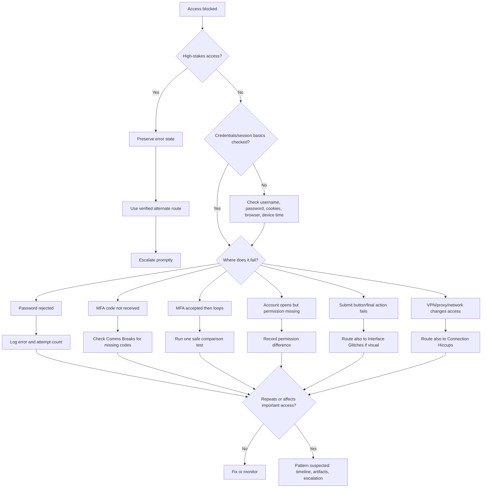

# 🔑 Access Barriers  
**First created:** 2025-09-16 | **Last updated:** 2026-05-30  
*Login, MFA, permission, account, submit-button, proxy, and authentication-loop triage for when legitimate access is blocked.*  

---

## 🌱 Purpose

This folder is for moments when a system refuses to let you in, through, or out.

A password works, then fails.
A login loops.
MFA accepts the code, then asks again.
A password reset never arrives.
A form fills correctly but will not submit.
An account opens, but key functions are missing.
A portal says you do not have permission.
A VPN, proxy, browser, or device appears to change whether access is allowed.

Most access barriers are ordinary.

Passwords get mistyped.
Sessions expire.
Cookies corrupt.
Browsers cache stale tokens.
Password managers autofill the wrong field.
MFA apps drift.
Institutions rotate credentials.
Security systems block VPNs.
Forms fail because JavaScript is being stupid in a very traditional way.

But access barriers matter because they can stop people from filing, speaking, proving, paying, studying, working, receiving care, or preserving records.

This folder helps people:

* check ordinary access problems first;
* avoid triggering extra lockouts;
* preserve the failure state;
* identify where the access chain breaks;
* compare device, browser, account, and network behaviour;
* record loops cleanly;
* and escalate when access denial affects important rights, records, deadlines, services, or safety.

The rule here is simple:

> Check the key.
> Check the door.
> Record the lock.
> Escalate if the blocked access matters.

---

## 🧭 What Belongs Here

Use this folder when the weirdness affects authentication, authorisation, permissions, or submission access.

Examples include:

* login rejected despite correct credentials;
* password reset emails not arriving;
* account recovery loops;
* MFA code accepted but login still fails;
* MFA repeatedly re-prompting;
* account locked without clear explanation;
* “invalid credentials” errors for known-valid details;
* session expiring immediately after login;
* form submit button greyed out after login;
* permissions missing after account opens;
* upload or submit access disabled;
* VPN/proxy blocked;
* device trusted yesterday but rejected today;
* different accounts showing different access to the same record or service;
* access failing near complaints, deadlines, filings, evidence uploads, appointments, or support requests.

If the issue is mainly about visible page elements, fields, buttons, or cursor behaviour, route to:

```text id="6wxsiv"
../🖥_Interface_Glitches/
```

If the issue is mainly about Wi-Fi, routing, signal, upload flow, or VPN connectivity, route to:

```text id="we38y0"
../🌐_Connection_Hiccups/
```

If the issue is mainly about missing messages or password reset emails not arriving, route also to:

```text id="bqcjme"
../📬_Comms_Breaks/
```

If the issue is mainly about records, files, timestamps, or permissions after access is gained, route to:

```text id="9ojr1r"
../📂_Data_Shifts/
```

Access Barriers is for the gate.

Other folders may explain the screen, pipe, message, or record around it.

---

## 🧰 Obvious Small Fixes First

Before treating an access barrier as suspicious, check ordinary causes.

### Credential checks

* Confirm username or email address.
* Check whether the system uses an old email, alias, staff ID, student ID, case number, or phone number.
* Type the password manually once.
* Check caps lock and keyboard layout.
* Disable password-manager autofill for one attempt.
* Confirm whether a password was recently changed.
* Check whether another saved password is being inserted invisibly.
* Check whether the account uses single sign-on.

### Session and browser checks

* Refresh once.
* Open a private/incognito window.
* Try another browser.
* Clear cookies for that specific site.
* Disable extensions, ad blockers, script blockers, and privacy tools for one controlled test.
* Check whether third-party cookies are required.
* Check whether pop-ups are blocked.
* Check system date and time.
* Restart the app or browser.

### Device and network checks

* Try another device.
* Try another network.
* Try mobile data instead of Wi-Fi.
* Try without VPN or proxy.
* Try with VPN only if the system normally requires it.
* Check whether institutional networks require a managed device.
* Check whether the service-status page reports login problems.

### MFA checks

* Confirm whether the MFA method is SMS, app code, push notification, email, hardware key, or backup code.
* Check device time sync.
* Check whether push notifications are blocked.
* Check whether SMS is delayed.
* Check whether email codes are going to spam or quarantine.
* Try a backup code if available.
* Avoid repeated attempts if the system may lock you out.

These checks are not surrender.

They stop a stale token, wrong autofill, or broken session from masquerading as a meaningful access pattern.

---

## 🛑 Do Not Trigger Extra Lockouts

Access systems can punish repeated testing.

Be careful with:

* banking systems;
* government portals;
* court or tribunal systems;
* immigration systems;
* medical portals;
* safeguarding portals;
* education or employment systems;
* institutional single sign-on;
* account recovery workflows;
* any service with fraud, security, or misuse flags.

Do not keep hammering the login if the system warns about lockouts, suspicious activity, or too many attempts.

For high-stakes access failures:

1. preserve the error state;
2. screenshot the message;
3. note the exact time;
4. try one sensible alternate route;
5. contact a human support or formal route;
6. ask for confirmation of access status, deadline protection, or manual submission options.

Do not let the system turn your evidence into “too many failed attempts.”

---

## 🧪 Locate The Broken Gate

Use comparison tests to identify where the access chain breaks.

| Test                            | What it helps distinguish                        |
| ------------------------------- | ------------------------------------------------ |
| Same account, different browser | Browser/cache/extension issue vs account issue   |
| Same account, different device  | Device issue vs account/service issue            |
| Same account, different network | Network/VPN/proxy issue vs account issue         |
| Different account, same device  | Account-specific issue vs general platform issue |
| Logged-in vs logged-out view    | Permission issue vs public service issue         |
| VPN on/off                      | Proxy or geolocation block vs standard routing   |
| Manual password entry           | Password-manager autofill problem                |
| Backup MFA method               | MFA channel problem vs account lock              |
| Private/incognito window        | Cookie/session corruption                        |

Do not run every test.

Pick the smallest safe comparison.

For high-stakes systems, one clean comparison plus escalation is better than ten attempts that worsen the lockout.

---

## 🧾 What To Record

For access barriers, record the exact step where the refusal happens.

Capture:

* date and time, including timezone;
* service, portal, app, or system;
* account identifier, masked if needed;
* device and operating system;
* browser or app version;
* network type;
* VPN/proxy status;
* login method;
* MFA method;
* exact step where it fails;
* exact error text;
* whether credentials were accepted or rejected;
* whether MFA was accepted or looped;
* whether any password reset or recovery email arrived;
* whether access works on another browser, device, network, or account;
* screenshots or screen recording;
* practical impact;
* deadline or high-stakes context if relevant.

Record the observable access state.

Good:

```text id="bhq58w"
Password accepted. SMS code accepted. System returned to MFA prompt three times. No error code shown.
```

Less useful:

```text id="kvu87j"
They locked me out.
```

That may become the concern.

The record starts with the behaviour of the gate.

---

## 🧾 Minimal Access Barrier Log

```yaml id="h99v61"
when: 2026-05-30T20:40:00+01:00
category: "access_barrier"
service_or_portal: ""
account_identifier_masked: ""
device: ""
os_browser_app: ""
network_type: "wifi / mobile_data / public_wifi / vpn / proxy / wired"
vpn_or_proxy: null
action_attempted: "login / password_reset / mfa / submit / account_recovery / permission_access"
failure_step: ""
credentials_status: "accepted / rejected / unknown"
mfa_method: "sms / authenticator_app / email / push / hardware_key / backup_code / none"
mfa_status: "not_triggered / code_not_received / accepted_then_looped / rejected / unknown"
error_text: ""
attempt_count: 1
lockout_warning_seen: null
comparison_tests:
  different_browser: null
  different_device: null
  different_network: null
  different_account: null
  vpn_on_off: null
artifacts:
  - ""
context: ""
impact: ""
next_step: ""
```

---

## 🔐 MFA Loop Notes

MFA loops are especially frustrating because they look like security working while access still fails.

Ordinary causes include:

* device clock drift;
* SMS delay;
* expired code;
* push notifications blocked;
* app reinstall or phone change;
* backup method not updated;
* browser blocking required cookies;
* session token corruption;
* institutional SSO mismatch;
* risk model requiring repeated verification.

Record:

* whether the password was accepted;
* whether the MFA code was accepted;
* whether the system returned to login, MFA, or error;
* whether the loop happened on another browser/device/network;
* whether backup codes worked;
* whether recovery options were offered;
* whether support can see the failed login attempts.

MFA loop wording should stay plain.

Example:

```text id="dzkl0c"
MFA code accepted. Page loaded briefly. System returned to MFA prompt without error. Repeated twice on Chrome and once on Firefox.
```

That is enough.

No need to decorate the cage.

---

## 🧱 Submit Button And Post-Login Failures

Sometimes access is technically granted, but the useful action is blocked.

Examples:

* account opens but upload is disabled;
* submit button stays grey;
* form validates but will not post;
* permissions appear missing;
* “save” works but “submit” fails;
* system says “not authorised” after login;
* portal times out only at final submission.

These cases may overlap with Interface Glitches.

Record:

* whether login succeeded;
* what page or function failed afterward;
* whether required fields were complete;
* whether errors appeared;
* whether submit generated a network request if known;
* whether another browser/device/account worked;
* whether the same form worked with different content;
* whether deadline or evidence submission was affected.

If the visual element itself is the main issue, route also to:

```text id="7i84mf"
../🖥_Interface_Glitches/
```

If the issue repeats at the same workflow step, route also to:

```text id="2rn4nd"
../🎛_Systematic_Patterns/
```

---

## 🍪 Cookies, Cache, And Session Tokens

Many access barriers are caused by stale local state.

Plain English version:

* **cookies** tell the site who you are;
* **cache** stores old page parts;
* **session tokens** keep you logged in;
* **SSO tokens** pass identity between systems;
* **expired or mismatched tokens** can create loops.

Signs of local session trouble:

* works in private/incognito mode;
* works after clearing cookies for the site;
* works in another browser;
* fails only after being logged in for a while;
* returns to login without error;
* shows the wrong account name;
* loads old permissions.

Do not clear everything immediately if the failure state matters.

First screenshot.

Then test a private window or separate browser.

That preserves the broken state while checking whether local session junk is the cause.

---

## 🚦 When To Ignore, Log, Or Escalate

### 🟢 Ordinary access issue

Likely ordinary if:

* one password was wrong;
* password reset works;
* private/incognito mode fixes it;
* clearing site cookies fixes it;
* service status confirms login outage;
* MFA delay resolves;
* the problem affects many unrelated users;
* no important access is affected.

Action:

* fix and move on;
* note only if useful.

---

### 🟡 Worth logging

Log the barrier if:

* login or MFA fails more than once without clear explanation;
* access affects important records, messages, forms, payments, care, or deadlines;
* correct credentials are rejected;
* MFA accepts then loops;
* password reset emails do not arrive;
* access differs by device, browser, network, or account;
* account opens but key functions are disabled;
* submit fails at the final step.

Action:

* screenshot exact error state;
* record attempt count;
* test one alternate route;
* avoid repeated attempts;
* log the failure step.

---

### 🟠 Pattern suspected

Treat as pattern-suspected if:

* access barriers appear around complaints, filings, evidence uploads, appointments, or deadlines;
* the same account fails across devices and networks;
* the same workflow step repeatedly fails;
* password reset or MFA messages repeatedly do not arrive;
* permissions change unexpectedly;
* access restores after public escalation or support contact;
* different accounts have different access without clear reason;
* login, comms, connection, and data shifts cluster together.

Action:

* build a timeline;
* preserve artifacts;
* compare with relevant folders;
* request audit/support confirmation;
* seek technical or procedural review if impact warrants it.

---

### 🔴 Escalate now

Escalate promptly if access denial affects:

* legal deadlines;
* medical care;
* safeguarding or safety;
* court, tribunal, immigration, housing, employment, education, or benefits processes;
* banking or essential payments;
* evidence preservation;
* account security;
* contact with advisers, solicitors, clinicians, journalists, advocates, or support workers.

Action:

* stop repeated login attempts;
* use a verified alternate route;
* preserve screenshots and timestamps;
* contact platform support, institution IT, data controller, records office, solicitor, adviser, or relevant responsible body;
* ask for manual access, deadline protection, audit trail, or alternate submission route.

---

## 🚩 Access Barrier Red Flags

One red flag is not proof.

Several together deserve a proper record.

Watch for:

* valid credentials rejected repeatedly;
* MFA accepted then looped;
* password reset never arrives;
* account opens but core functions vanish;
* submit button fails only after login;
* access differs between accounts without obvious permission reason;
* VPN/proxy status changes access inconsistently;
* lockout happens around sensitive submission or deadline;
* support says account is active while portal denies access;
* session expires immediately after authentication;
* permission changes appear without notice;
* audit or login history is unavailable when it should exist;
* access restores only after external pressure or alternate contact.

The key question is:

```text id="5s5w0r"
Where exactly did legitimate access stop?
```

Not:

```text id="twbq7h"
Who do I think blocked me?
```

Map the gate first.

---

## 🗂 Planned / Existing Nodes

| Node                                       | Scope                                                               | Status             |
| ------------------------------------------ | ------------------------------------------------------------------- | ------------------ |
| `🔑_login_failure_triage.md`               | First guide for rejected credentials and login loops                | Planned            |
| `🔐_mfa_loop_triage.md`                    | Multi-factor authentication loops and code failures                 | Planned            |
| `🧱_submit_button_failure_triage.md`       | Post-login submission barriers and final-step failures              | Planned            |
| `🍪_cookies_cache_and_session_tokens.md`   | Plain-language session and browser-state troubleshooting            | Planned            |
| `🧪_browser_device_account_comparison.md`  | Safe comparison testing for access issues                           | Planned            |
| `🧾_access_failure_log_template.md`        | Standard access-barrier logging format                              | Planned            |
| `🚩_access_barrier_red_flags.md`           | Pattern indicators and escalation cues                              | Planned            |
| `🚪_mfa_loop_catalogue.md`                 | Records of MFA traps and verification loops                         | Existing / planned |
| `🔐_lockout_timing_index.md`               | Timing index for account rejections and reset events                | Existing / planned |
| `🧱_submit_button_failures.md`             | Cross-platform collection of submission failures                    | Existing / planned |
| `🪞_proxy_gate_anomalies.md`               | Access denial through VPNs, proxies, or routing                     | Existing / planned |
| `🧾_error_code_registry.md`                | Recurring error codes and request IDs                               | Existing / planned |
| `📊_access_barrier_heatmap.md`             | Aggregate charting of rejection events                              | Existing / planned |
| `🧰_countermeasure_kit_access_barriers.md` | Techniques for recording, bypassing, or safely reproducing barriers | Existing / planned |

---

## 🧪 Suggested First-Build Set

For the first practical build, prioritise:

```text id="cu7i20"
🔑_login_failure_triage.md
🔐_mfa_loop_triage.md
🧱_submit_button_failure_triage.md
🍪_cookies_cache_and_session_tokens.md
🧪_browser_device_account_comparison.md
```

These five give users immediate help: check the login, handle MFA loops, diagnose final-step submit failures, understand session junk, and compare safely without triggering extra lockouts.

---

## 🗺 Mini Routing Diagram



---

## 🌌 Constellations

🩻 🔑 🔐 🧱 🍪 — access denial; authentication loops; permission barriers; session state; submission gates.

---

## ✨ Stardust

access denial, login failure, mfa loop, password reset, session token, account lockout, permission failure, submit button failure, proxy denial, authentication triage

---

## 🏮 Footer

*🔑 Access Barriers* is a living node of the **Polaris Protocol**.
It holds the authentication and permission layer of Weirdness Screening: the place where login loops, MFA traps, submit barriers, session failures, and quiet lockouts are checked, recorded, compared, and escalated when legitimate access is obstructed.

> 📡 Cross-references:
>
> * [🩻 Weirdness Screening](../README.md) — *parent triage doorway for ordinary glitches, persistent anomalies, and escalation-worthy weirdness*
> * [🖥 Interface Glitches](../🖥_Interface_Glitches/) — *visible UI refusal, cursor oddities, and broken forms*
> * [🌐 Connection Hiccups](../🌐_Connection_Hiccups/) — *network, upload, signal, and router-level anomalies*
> * [📬 Comms Breaks](../📬_Comms_Breaks/) — *message, call, and attachment disruption*
> * [📂 Data Shifts](../📂_Data_Shifts/) — *record integrity, metadata drift, and missing files*
> * [🎛 Systematic Patterns](../🎛_Systematic_Patterns/) — *recurrence, timing, and clustering analysis*

*Survivor authorship is sovereign. Containment is never neutral.*

*Last updated: 2026-05-30*
