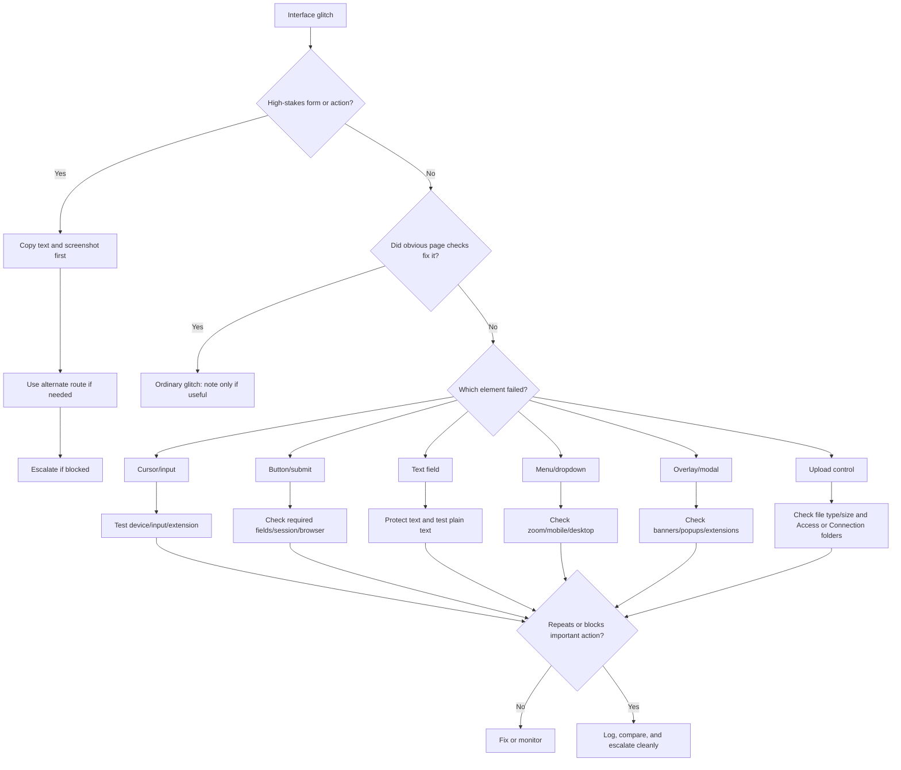

# 🖥 Interface Glitches  
**First created:** 2025-09-16 | **Last updated:** 2026-05-30  
*Button, cursor, field, overlay, menu, form, and visible-screen triage for when the interface stops cooperating.*  

---

## 🌱 Purpose

This folder is for moments when the screen itself becomes the problem.

A button will not click.
A text field locks.
A cursor jumps.
A menu vanishes.
A form refuses to submit.
A page flickers.
Typed text disappears.
A checkbox cannot be selected.
An invisible layer seems to block interaction.
The page looks available, but the action does not work.

Most interface glitches are ordinary.

Browsers cache old scripts.
Extensions break pages.
Ad blockers hide elements.
Zoom settings distort layouts.
Mobile and desktop views behave differently.
Accessibility settings can change focus behaviour.
Web forms are often built badly because apparently humanity enjoys suffering.

But interface glitches matter because they can block action while preserving the appearance of access.

You can see the form.
You can read the button.
You can type the words.
But the system does not let the action complete.

This folder helps people:

* check obvious browser and device causes first;
* identify what visible element failed;
* avoid overwriting or losing typed content;
* preserve screen evidence;
* compare browser, device, account, and network behaviour;
* distinguish interface failure from login, connection, or data problems;
* and escalate when the broken interface blocks important access, evidence, forms, care, money, or deadlines.

The rule here is simple:

> Screenshot before reset.
> Copy text before refresh.
> Test one layer at a time.

---

## 🧭 What Belongs Here

Use this folder when the weirdness affects visible interaction with a screen.

Examples include:

* button will not click;
* submit button stays grey;
* text field will not accept input;
* cursor jumps, drifts, or deletes text;
* dropdown will not open;
* checkbox or radio button will not select;
* date picker breaks;
* page flickers or reloads during entry;
* typed text disappears;
* menu vanishes;
* upload button does nothing;
* invisible overlay blocks clicks;
* pop-up or modal traps the page;
* form appears complete but cannot proceed;
* page works on mobile but not desktop, or desktop but not mobile;
* certain text, keywords, files, or attachments seem to trigger interface failure.

If the issue is mainly about login, MFA, permissions, or account lockout, route to:

```text id="30j9n8"
../🔑_Access_Barriers/
```

If the issue is mainly about Wi-Fi, upload transfer, routing, or signal, route to:

```text id="kly155"
../🌐_Connection_Hiccups/
```

If the issue is mainly about records, timestamps, attachments, or altered data, route to:

```text id="dly72x"
../📂_Data_Shifts/
```

If the issue is mainly about repetition, timing, or clustering, route to:

```text id="qv0y4q"
../🎛_Systematic_Patterns/
```

Interface Glitches is for the visible surface.

Other folders may explain the gate, pipe, record, or pattern underneath.

---

## 🧰 Obvious Small Fixes First

Before treating an interface glitch as meaningful, check the ordinary causes.

### Basic page checks

* Wait a few seconds for the page to finish loading.
* Refresh once, after copying any typed text.
* Scroll up and down to check for hidden required fields.
* Check whether an error message appeared off-screen.
* Reset zoom to 100%.
* Try full-screen or a wider window.
* Try desktop view instead of mobile view.
* Try mobile view instead of desktop view.
* Check whether a pop-up, cookie banner, chat widget, or modal is covering the page.
* Press `Tab` to see whether focus moves to hidden elements.

### Browser checks

* Try another browser.
* Try private/incognito mode.
* Disable extensions.
* Disable ad blocker or script blocker for one controlled test.
* Clear cookies for the site, after preserving the failure state.
* Check whether third-party cookies are required.
* Check whether JavaScript is blocked.
* Check whether the browser is out of date.

### Device checks

* Try another device.
* Try an external mouse or keyboard if cursor/input is odd.
* Check trackpad sensitivity.
* Check touchscreen behaviour.
* Check accessibility settings.
* Restart the app or browser.
* Restart the device if the issue is not high-stakes.

### Content checks

* Save typed text elsewhere before changing anything.
* Try a short harmless test entry if safe.
* Try removing unusual formatting.
* Try plain text instead of pasted rich text.
* Try a shorter filename.
* Avoid repeated submission attempts with high-stakes forms.

These checks are not dismissal.

They protect you from losing content, corrupting a form, or turning one useful failure into a pile of unclear attempts.

---

## 🛑 Preserve Before Refreshing

Interface glitches often vanish when refreshed.

That can be useful for fixing the problem.

It can also destroy evidence.

Before refreshing, clearing cache, reinstalling, or changing settings, preserve what you can:

* screenshot the full page;
* screenshot the broken element;
* copy typed text into a safe note;
* record the URL or page title;
* record the exact time;
* note what you clicked or typed immediately before the failure;
* capture the error message if any;
* screen-record the issue if safe;
* save drafts before continuing;
* avoid repeated final-submit attempts if a deadline, payment, or formal record is involved.

For high-stakes forms, the broken screen may be the evidence.

Do not tidy it away before recording it.

---

## 🧪 Locate The Interface Layer

Use comparison tests to identify what kind of interface failure you are dealing with.

| Test                                | What it helps distinguish                           |
| ----------------------------------- | --------------------------------------------------- |
| Same page, different browser        | Browser/cache/extension problem vs site problem     |
| Same page, private/incognito window | Cookie/session problem vs general page problem      |
| Same account, different device      | Device/input issue vs account/site issue            |
| Same device, different account      | Account-specific interface state vs general bug     |
| Mobile view vs desktop view         | Responsive layout bug                               |
| Extensions on/off                   | Ad blocker/script blocker/content tool conflict     |
| Zoom reset to 100%                  | Layout scaling problem                              |
| Keyboard navigation with `Tab`      | Hidden focus, overlay, or inaccessible control      |
| Short plain-text test               | Content/formatting trigger vs general input failure |
| Different network                   | Connection/session issue masquerading as UI failure |

Do not run every test.

Pick the smallest safe comparison.

If the form is high-stakes, preserve first, test once, then escalate through a human or alternate route.

---

## 🧾 What To Record

For interface glitches, record the specific visible element and action.

Capture:

* date and time, including timezone;
* website, app, portal, or form name;
* URL or page route if safe;
* account used, masked if needed;
* device and operating system;
* browser or app version;
* screen size or mobile/desktop view;
* zoom level;
* extensions or blockers active;
* network type;
* exact UI element affected;
* action attempted;
* visible symptom;
* error text;
* whether typed text was lost;
* whether the issue appeared after typing, pasting, uploading, scrolling, or clicking;
* whether another browser/device/account worked;
* screenshots or screen recordings;
* practical impact.

Write the visible behaviour first.

Good:

```text id="xk4buh"
Submit button stayed grey after all required fields were completed. No field-level error shown. Worked in Firefox, failed in Chrome.
```

Less useful:

```text id="8mboe2"
The site blocked me.
```

That may become the concern.

The record starts with the screen.

---

## 🧾 Minimal Interface Glitch Log

```yaml id="52zzca"
when: 2026-05-30T21:00:00+01:00
category: "interface_glitch"
site_or_app: ""
page_or_form: ""
url_or_route: ""
account_identifier_masked: ""
device: ""
os_browser_app: ""
view: "desktop / mobile / tablet"
zoom_level: ""
extensions_or_blockers: ""
network_type: "wifi / mobile_data / public_wifi / vpn / proxy / wired"
ui_element_affected: "button / text_field / dropdown / checkbox / cursor / menu / overlay / upload_control / page"
action_attempted: ""
visible_symptom: ""
error_text: ""
typed_text_lost: null
trigger_observed: ""
comparison_tests:
  different_browser: null
  private_window: null
  different_device: null
  different_account: null
  mobile_vs_desktop: null
  extensions_off: null
artifacts:
  - ""
context: ""
impact: ""
next_step: ""
```

---

## 🖱 Cursor And Input Glitches

Cursor issues are common and irritating, but they can also destroy text.

Ordinary causes include:

* trackpad sensitivity;
* palm rejection failures;
* Bluetooth mouse problems;
* touchscreen input;
* browser autofill;
* accessibility settings;
* page scripts rewriting fields;
* lag from heavy pages;
* remote desktop or virtual machine delay;
* grammar tools or browser extensions interfering with text entry.

Record:

* where the cursor moved from and to;
* whether text was selected, deleted, duplicated, or rearranged;
* whether the issue happens only in one field or across apps;
* whether it happens after pasting;
* whether it happens with extensions disabled;
* whether an external keyboard/mouse changes the behaviour;
* whether screen recording shows the movement.

First move:

```text id="bjxj12"
Copy the text elsewhere before continuing.
```

The text is the fragile bit.

Protect that first.

---

## 🧱 Button And Submit Failures

Button failures are especially important when they block formal action.

Examples:

* submit button stays grey;
* button clicks but nothing happens;
* button spins forever;
* page scrolls but does not submit;
* form validates but never posts;
* upload button opens nothing;
* save works but submit fails;
* button appears only briefly then vanishes.

Ordinary causes include:

* missing required field;
* hidden validation error;
* browser autofill not triggering validation;
* disabled JavaScript;
* extension interference;
* expired session;
* incomplete upload;
* required checkbox off-screen;
* date format mismatch;
* file type or file size error.

Record:

* whether all required fields were completed;
* whether any hidden error appeared;
* whether clicking produced a spinner, network activity, or nothing;
* whether the same form worked with shorter/plain text;
* whether another browser worked;
* whether the failure happened at final submission;
* whether the action was deadline-sensitive.

If login or permission is involved, route also to:

```text id="40d4wq"
../🔑_Access_Barriers/
```

---

## 📝 Text Field Locking And Text Loss

Text field failure can feel small until it eats important testimony, complaint wording, notes, or evidence descriptions.

Examples:

* field refuses input;
* pasted text disappears;
* typing lags or rewrites;
* field deletes content after a certain length;
* form reloads while typing;
* autosave restores an older version;
* text appears in preview but not final submission.

Ordinary causes include:

* character limits;
* unsupported formatting;
* special characters;
* emoji handling;
* browser translation tools;
* grammar extensions;
* session expiry;
* autosave conflict;
* network interruption.

Protect the text:

* draft in a separate editor first;
* paste plain text;
* save a local copy;
* screenshot before submitting;
* note character count;
* avoid drafting high-stakes material directly into unstable forms.

A form is not a diary.

Do not trust it with the only copy.

---

## 🫥 Overlays, Modals, And Vanishing Menus

Sometimes the page looks broken because another layer is sitting on top.

Common culprits:

* cookie banners;
* chat widgets;
* pop-ups;
* accessibility overlays;
* ad containers;
* invisible modals;
* sticky headers;
* mobile keyboard overlays;
* browser translation bars;
* extension-injected panels;
* institutional timeout warnings.

Signs of overlay trouble:

* cursor changes but click does nothing;
* button is visible but unreachable;
* tab navigation skips the area;
* page scrolls behind a frozen element;
* right-click or inspect shows another layer;
* issue appears at certain screen widths.

Record:

* screenshot of full page;
* whether resizing window changes it;
* whether zoom reset helps;
* whether private/incognito mode helps;
* whether extensions off helps;
* whether keyboard navigation reaches the button.

This is the “the screen says yes but the invisible duvet says no” category.

Technically undignified. Very real.

---

## 🚦 When To Ignore, Log, Or Escalate

### 🟢 Ordinary interface glitch

Likely ordinary if:

* it happens once;
* refresh fixes it;
* another browser works;
* resetting zoom fixes it;
* disabling an extension fixes it;
* a hidden required field explains it;
* it has low impact;
* the same issue is reported as a known bug.

Action:

* fix and move on;
* note only if useful.

---

### 🟡 Worth logging

Log the glitch if:

* it blocks an important action;
* it causes text loss;
* it affects evidence, complaints, care, legal, medical, safeguarding, employment, financial, education, or institutional forms;
* it repeats at the same page element;
* it happens after specific text, files, or actions;
* it differs across browser, device, account, or network;
* it occurs at final submission.

Action:

* screenshot or record;
* copy text elsewhere;
* test one alternate browser/device if safe;
* log exact element and action.

---

### 🟠 Pattern suspected

Treat as pattern-suspected if:

* the same element fails repeatedly;
* submit fails only for sensitive content;
* text fields lock after particular phrases or file names;
* cursor or input problems repeat around specific tasks;
* one account sees a broken interface while another does not;
* the issue appears during escalation, deadline, complaint, or evidence workflows;
* failure clusters with access barriers, connection hiccups, or data shifts.

Action:

* build a timeline;
* preserve artifacts;
* compare with related folders;
* avoid repeated final-submit attempts;
* use an alternate route if the action matters.

---

### 🔴 Escalate now

Escalate promptly if the interface glitch blocks:

* legal filing;
* medical access;
* safeguarding contact;
* urgent support;
* evidence submission;
* banking or essential payments;
* housing, immigration, education, employment, or benefits processes;
* contact with advisers, clinicians, solicitors, journalists, or advocates.

Action:

* preserve the screen;
* copy any typed text;
* use a verified alternate submission or contact route;
* contact the responsible office or support route;
* state the impact and request manual acceptance, deadline protection, or confirmation.

---

## 🚩 Interface Glitch Red Flags

One red flag is not proof.

Several together deserve a proper record.

Watch for:

* button failure only at final submission;
* field locking after specific content;
* cursor jumping or deleting text repeatedly in one workflow;
* disappearing menus around account, complaint, or evidence pages;
* upload button failing only for specific files;
* form accepts harmless test text but fails with real content;
* one account sees disabled controls while another does not;
* visible page differs materially across devices;
* interface breaks around deadlines or escalation;
* submit appears successful but no confirmation appears;
* confirmation appears briefly then vanishes;
* support says the form is working while your screen shows otherwise.

The key question is:

```text id="2v14hj"
Which visible element failed, after what action, and compared with what?
```

Not:

```text id="cwplfu"
Why is the whole system doing this to me?
```

Start with the element.

The element is enough.

---

## 🗂 Planned / Existing Nodes

| Node                                        | Scope                                                            | Status             |
| ------------------------------------------- | ---------------------------------------------------------------- | ------------------ |
| `🖱️_cursor_jump_triage.md`                 | Cursor drift, text deletion, selection jumps, input misbehaviour | Planned            |
| `🧱_button_wont_click_triage.md`            | Buttons that fail, spin, vanish, or refuse submission            | Planned            |
| `📝_text_field_lock_triage.md`              | Locked fields, text loss, paste failure, autosave weirdness      | Planned            |
| `🫥_vanishing_menu_or_overlay_triage.md`    | Hidden overlays, menus, modals, and click interception           | Planned            |
| `🧪_extensions_zoom_and_browser_checks.md`  | Practical browser, zoom, extension, and layout checks            | Planned            |
| `🎥_screen_recording_interface_glitches.md` | How to safely record visible UI failures                         | Planned            |
| `🚩_interface_glitch_red_flags.md`          | Pattern indicators and escalation cues                           | Planned            |
| `🧮_ui_sabotage_catalogue.md`               | Master taxonomy of interface-level containment                   | Existing / planned |
| `🪞_form_field_disruption_logs.md`          | Logs of disappearing or disabled fields                          | Existing / planned |
| `🧰_browser_console_tracekit.md`            | Capturing console and network traces                             | Existing / planned |
| `🎥_interface_glitch_gallery.md`            | Visual archive of recurring UI failures                          | Existing / planned |
| `🧱_submission_gate_failures.md`            | Cross-platform collection of submission failures                 | Existing / planned |
| `📊_interface_anomaly_charts.md`            | Frequency and clustering charts for interface anomalies          | Existing / planned |

---

## 🧪 Suggested First-Build Set

For the first practical build, prioritise:

```text id="7jh8i6"
🖱️_cursor_jump_triage.md
🧱_button_wont_click_triage.md
📝_text_field_lock_triage.md
🧪_extensions_zoom_and_browser_checks.md
🎥_screen_recording_interface_glitches.md
```

These five give users immediate help: protect text, diagnose button and field failures, check ordinary browser causes, and preserve visible evidence before the screen tidies itself up.

---

## 🗺 Mini Routing Diagram



---

## 🌌 Constellations

🩻 🖥 🖱️ 🧱 🫥 — visible-screen failure; cursor and input disruption; button refusal; overlays; form triage.

---

## ✨ Stardust

interface glitch, button failure, cursor jump, text field locked, overlay problem, form submission failure, ui triage, screen recording, browser extensions, visible refusal

---

## 🏮 Footer

*🖥 Interface Glitches* is a living node of the **Polaris Protocol**.
It holds the visible interaction layer of Weirdness Screening: the place where buttons, fields, cursors, menus, overlays, and forms are checked, preserved, compared, and escalated when the screen itself becomes the obstruction.

> 📡 Cross-references:
>
> * [🩻 Weirdness Screening](../README.md) — *parent triage doorway for ordinary glitches, persistent anomalies, and escalation-worthy weirdness*
> * [🔑 Access Barriers](../🔑_Access_Barriers/) — *login, MFA, permission, and submission barriers*
> * [🌐 Connection Hiccups](../🌐_Connection_Hiccups/) — *network, upload, signal, and router-level anomalies*
> * [📂 Data Shifts](../📂_Data_Shifts/) — *record integrity, metadata drift, and missing files*
> * [🎛 Systematic Patterns](../🎛_Systematic_Patterns/) — *recurrence, timing, and clustering analysis*
> * [📬 Comms Breaks](../📬_Comms_Breaks/) — *message, call, and attachment disruption*

*Survivor authorship is sovereign. Containment is never neutral.*

*Last updated: 2026-05-30*
