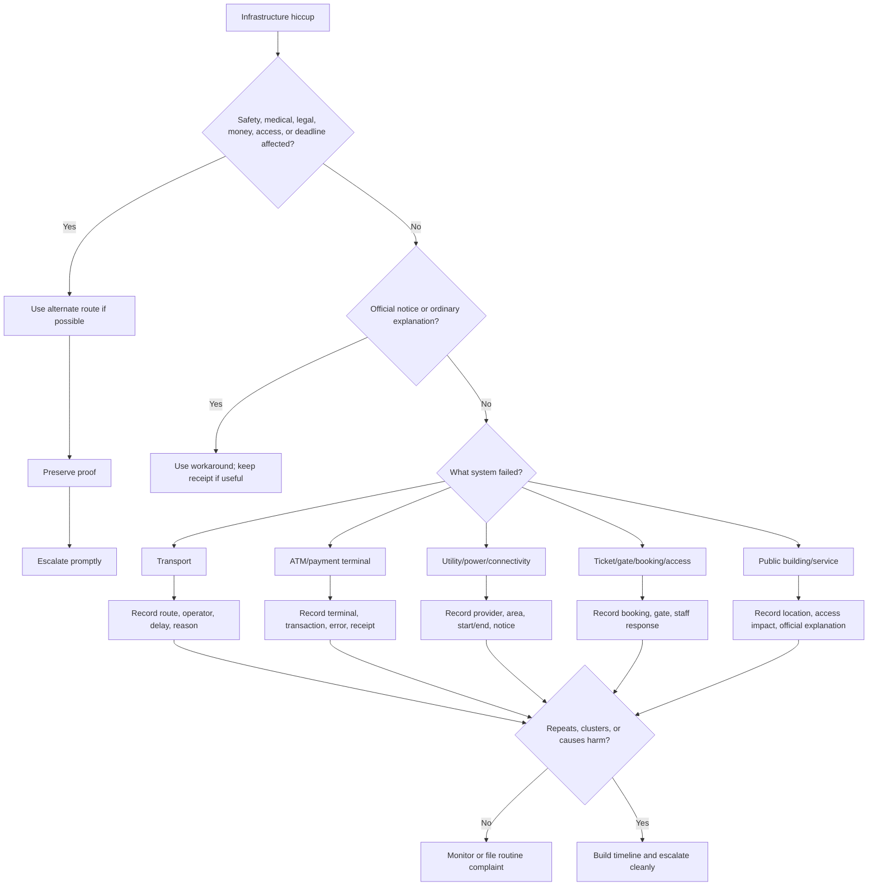

# 🚉 Infrastructure Hiccups  
**First created:** 2025-09-16 | **Last updated:** 2026-05-30  
*Public-service, transport, utility, payment-terminal, ticketing, and local infrastructure triage for when the world outside the device starts stuttering.*

---

## 🌱 Purpose

This folder is for external systems that fail around you.

The train is suddenly cancelled.
The ticket gate will not open.
The ATM is down.
The card terminal fails.
The payment network freezes.
The power flickers.
The booking system crashes.
The lift is out.
The local network disappears.
The public service you need becomes unavailable at exactly the wrong moment.

Most infrastructure hiccups are ordinary.

Transport breaks.
Card terminals fail.
ATMs run out of cash.
Power cuts happen.
Staffing shortages are real.
Maintenance windows exist.
Weather ruins everything because Britain is apparently still surprised by water falling from the sky.

But infrastructure hiccups matter because they can block movement, money, communication, appointments, care, work, evidence, protest, reporting, or escape routes.

This folder helps people:

* check ordinary public-service explanations first;
* preserve official notices, receipts, timestamps, and photos;
* compare local reports;
* distinguish personal-device issues from wider service failure;
* record disruptions that affect important access;
* and escalate when a public or third-party system failure causes practical harm.

The rule here is simple:

> Check the notice.
> Record the place and time.
> Keep the receipt.
> Escalate if the disruption blocks something important.

---

## 🧭 What Belongs Here

Use this folder when the weirdness affects public, commercial, civic, or shared infrastructure outside your personal device.

Examples include:

* train, tram, tube, bus, or coach disruption;
* ticket gates failing;
* booking systems crashing;
* ATM failures;
* card terminal outages;
* bank payment network interruptions;
* utility outages;
* power cuts;
* broadband area outages;
* public Wi-Fi outages;
* lift, door, gate, or access-control failure in public buildings;
* delivery or logistics disruption affecting access;
* hospital, council, university, court, venue, or transport portals failing at service level;
* local systems failing around public events, appointments, deadlines, protests, hearings, reporting, or travel.

If the issue is mainly your personal Wi-Fi, router, VPN, upload, or mobile signal, route to:

```text id="q7qkz5"
../🌐_Connection_Hiccups/
```

If the issue is mainly login, MFA, permissions, or portal access, route to:

```text id="kxnoyw"
../🔑_Access_Barriers/
```

If the issue is mainly a booking, checkout, delivery option, stock status, or consumer purchase flow, route also to:

```text id="lxok1n"
../🛒_Service_Blockages/
```

If the issue is mainly repetition, timing, or clustering, route to:

```text id="g10hga"
../🎛_Systematic_Patterns/
```

Infrastructure Hiccups is for shared systems.

Other folders may explain the personal device, account, interface, or transaction layer.

---

## 🧰 Obvious Small Fixes First

Before treating an infrastructure hiccup as meaningful, check ordinary explanations.

### For transport

* Check the official transport status page.
* Check station signs or announcements.
* Check operator social media if available.
* Check alternative route planners.
* Ask staff for the stated reason.
* Save ticket or booking references.
* Photograph platform boards if relevant.
* Note whether other passengers are affected.
* Check whether the disruption is weather, staffing, signal, engineering, police incident, power, or unknown.

### For ATMs and payment terminals

* Check whether one machine failed or all machines failed.
* Try another terminal if safe.
* Ask staff whether card payments are down generally.
* Check whether cash works if card fails, or card works if cash fails.
* Keep receipts or failed-transaction slips.
* Screenshot banking app status only if safe and private.
* Do not repeatedly test large or sensitive transactions.
* Check with the bank or provider before assuming funds are lost.

### For utilities and power

* Check provider outage maps.
* Check neighbours or nearby businesses.
* Note start and end times.
* Photograph meter, router lights, or outage notice if useful.
* Preserve any official estimated restoration time.
* Record whether mobile data still works.
* Note any affected medical, safety, heating, refrigeration, or accessibility needs.

### For public-building access

* Check whether the failure affects everyone or only your card/ticket/account.
* Ask for a manual entry route.
* Photograph signage.
* Note staff explanation.
* Keep access tickets, appointment letters, emails, or booking confirmations.
* If safety or accessibility is affected, escalate promptly.

These checks are not dismissal.

They turn “everything broke” into “this system failed, here, then, with this stated explanation.”

That travels further.

---

## 🧪 Local Cross-Checking

Infrastructure disruptions are often easier to verify than personal device weirdness because other people may be affected too.

Useful cross-checks:

| Check                     | What it helps distinguish                    |
| ------------------------- | -------------------------------------------- |
| Official status page      | Known outage vs unexplained local failure    |
| Staff explanation         | Operational reason and accountability route  |
| Local signs/photos        | Evidence of public notice                    |
| Other users nearby        | Individual issue vs wider disruption         |
| Nearby venue/shop check   | Single terminal/building vs area-level issue |
| Alternative route/service | Whether disruption is isolated               |
| Receipt/ticket reference  | Proof of attempted access                    |
| Timestamped photo         | Place/time anchor                            |
| Local news/social reports | Wider pattern or public incident             |
| Provider complaint record | Later escalation trail                       |

For public systems, the question is often:

```text id="rwufle"
Was this just me, this site, this route, this provider, or this area?
```

That distinction matters.

---

## 🧾 What To Record

For infrastructure hiccups, record place, time, service, impact, and official explanation.

Capture:

* date and time, including timezone;
* location, kept as broad as safety allows;
* service or provider;
* route, branch, station, venue, machine, terminal, or building if relevant;
* action attempted;
* symptom;
* stated reason;
* official notice or screenshot;
* staff explanation;
* ticket, booking, transaction, appointment, or receipt reference;
* whether others were affected;
* whether alternative routes worked;
* start and end time if known;
* money, access, travel, safety, care, or deadline impact;
* photos, receipts, screenshots, or notices.

Good:

```text id="7o3v91"
Card terminals failed in three shops on same street between 14:10 and 14:35. Staff in two shops said provider outage. Cash still accepted.
```

Less useful:

```text id="seuncr"
The infrastructure was targeting me.
```

Maybe the disruption matters.

But the record starts with the service layer.

---

## 🧾 Minimal Infrastructure Hiccup Log

```yaml id="2smkja"
when: 2026-05-30T21:20:00+01:00
category: "infrastructure_hiccup"
service_type: "transport / atm / payment_terminal / utility / public_wifi / access_gate / booking_system / public_building / other"
provider_or_operator: ""
location_or_route: ""
action_attempted: ""
symptom: ""
official_reason_given: ""
staff_explanation: ""
others_affected: null
alternative_route_or_service_available: null
start_time: ""
end_time: ""
reference_numbers:
  ticket_or_booking: ""
  transaction: ""
  appointment: ""
artifacts:
  - ""
context: ""
impact: ""
next_step: ""
```

---

## 🚉 Transport Disruptions

Transport disruption can be ordinary, but it still deserves a record when it affects appointments, legal access, medical care, support contact, work, protest, reporting, or safety.

Record:

* operator;
* route;
* station or stop;
* scheduled time;
* actual time;
* cancellation or delay reason;
* platform signs;
* announcements;
* ticket reference;
* alternative route offered;
* whether refund/compensation applies;
* impact on appointment, work, deadline, or safety.

Ordinary causes include:

* signal failure;
* points failure;
* staffing shortage;
* weather;
* trespass;
* police incident;
* engineering works;
* vehicle fault;
* congestion;
* power issue.

Escalate if:

* the disruption causes missed legal, medical, safeguarding, employment, education, or housing access;
* assistance was refused;
* accessibility needs were not met;
* no alternative route was provided where one should have been;
* refunds or delay compensation are relevant.

---

## 🏧 ATM And Card Terminal Failures

Payment infrastructure matters because money access is practical freedom.

Record:

* bank or card provider;
* ATM location or merchant;
* transaction attempted;
* amount, if safe to record;
* error text;
* whether card was retained;
* whether account was debited;
* whether receipt printed;
* whether other terminals worked;
* whether cash or another card worked;
* whether the merchant reported general outage;
* whether bank app or provider status showed issues.

Do not repeatedly test payments if money might be reserved, duplicated, declined, or fraud-flagged.

For money issues:

1. preserve receipt or error;
2. check account safely;
3. contact provider;
4. record reference number;
5. avoid turning one failed payment into five pending authorisations.

Financial systems do love making a meal of things.

Do not feed them more cutlery.

---

## 🔌 Utility, Power, And Connectivity Outages

Utility failures can affect safety, medical equipment, heating, refrigeration, work, communication, and evidence preservation.

Record:

* provider;
* service affected: power, gas, water, broadband, mobile, public Wi-Fi;
* area affected;
* start and end time;
* outage notice;
* estimated restoration time;
* whether neighbours or nearby services were affected;
* whether backup options worked;
* whether any vulnerable-person, medical, accessibility, or safety issue arose.

Escalate promptly if:

* medical devices are affected;
* safety is affected;
* heating, water, refrigeration, or essential communication is affected;
* outage information is missing or misleading;
* repeated outages happen without explanation;
* the provider fails to meet support obligations.

---

## 🎫 Ticketing, Gates, Booking, And Public Access

Sometimes the issue is not the transport or venue itself, but the gatekeeping system around it.

Examples:

* ticket gate rejects valid ticket;
* QR code will not scan;
* booking disappears;
* appointment check-in fails;
* public building access card fails;
* lift or accessible entrance is unavailable;
* kiosk freezes;
* queue system loses your place;
* machine says “out of service” at critical moment.

Record:

* booking or ticket reference;
* screenshot of valid booking;
* location of gate, kiosk, or entrance;
* staff response;
* manual route offered or refused;
* whether others were affected;
* accessibility or safety impact;
* whether the provider later confirms the booking or access right.

If the issue is a consumer booking or delivery service, route also to:

```text id="8ehx4e"
../🛒_Service_Blockages/
```

If the issue is account login to the booking system, route also to:

```text id="by0afs"
../🔑_Access_Barriers/
```

---

## 🚦 When To Ignore, Log, Or Escalate

### 🟢 Ordinary infrastructure hiccup

Likely ordinary if:

* official outage notice explains it;
* many unrelated users are affected;
* staff give consistent explanations;
* the issue resolves quickly;
* an alternative route works;
* no important access, money, safety, care, or deadline is affected.

Action:

* use the workaround;
* keep receipt only if compensation or later proof may be needed.

---

### 🟡 Worth logging

Log the hiccup if:

* it interrupts travel, money, access, care, work, evidence, support, or a deadline;
* official explanations are missing, vague, or contradictory;
* the disruption affects a specific location, route, provider, or service repeatedly;
* your access fails while others’ access works;
* payment or booking references may matter later;
* compensation, complaint, refund, or formal record may be needed.

Action:

* record time and place;
* preserve receipts, tickets, photos, and notices;
* ask for the stated reason;
* note practical impact.

---

### 🟠 Pattern suspected

Treat as pattern-suspected if:

* the same route, service, venue, or provider fails repeatedly around important events;
* transport, payment, access, and communication problems cluster together;
* infrastructure disruptions align with deadlines, hearings, appointments, protests, filings, or evidence activity;
* official explanations change between incidents;
* one person/account/ticket is affected differently from others nearby;
* outages appear narrow, timed, or oddly convenient.

Action:

* build a timeline;
* compare with local reports;
* preserve official notices;
* cross-reference related folders;
* escalate if impact warrants it.

---

### 🔴 Escalate now

Escalate promptly if the infrastructure hiccup affects:

* emergency or safety access;
* medical appointments or care;
* safeguarding;
* legal, court, tribunal, immigration, housing, employment, education, or benefits processes;
* essential payments or banking;
* disability access;
* evidence preservation or submission;
* travel to a high-stakes appointment;
* ability to contact advisers, clinicians, solicitors, advocates, journalists, or support workers.

Action:

* use a verified alternate route if possible;
* preserve proof of disruption;
* ask staff or provider for written confirmation if available;
* contact the responsible body;
* state the practical impact and requested remedy;
* seek refund, compensation, deadline protection, manual access, or written confirmation where relevant.

---

## 🚩 Infrastructure Hiccup Red Flags

One red flag is not proof.

Several together deserve a proper record.

Watch for:

* outage affecting only one narrow place or route without explanation;
* payment systems failing across several nearby services at once;
* public access failing while private or staff access works;
* ticket or booking rejected despite valid confirmation;
* disruptions aligning repeatedly with appointments, deadlines, protests, hearings, or evidence activity;
* official status page showing normal service while local service is clearly down;
* staff explanations contradicting official notices;
* same provider failing at the same time or place repeatedly;
* accessibility routes failing without alternative support;
* payment attempts creating holds or pending transactions without completion;
* transport disruption causing repeated missed high-stakes access;
* infrastructure failures clustering with comms, connection, access, or data issues.

The key question is:

```text id="xffvrs"
Which shared system failed, where, when, and who else was affected?
```

Not:

```text id="nx133d"
Was the entire city personally inconveniencing me?
```

Start with the system.

The system is plenty.

---

## 🗂 Planned / Existing Nodes

| Node                                    | Scope                                                                         | Status             |
| --------------------------------------- | ----------------------------------------------------------------------------- | ------------------ |
| `🚉_transport_disruption_log.md`        | Train, bus, tram, tube, coach, route, and station disruption records          | Planned            |
| `🏧_atm_or_card_terminal_failure.md`    | ATM, card terminal, and payment-network outage triage                         | Planned            |
| `🔌_utility_or_power_outage_log.md`     | Power, broadband, mobile, water, gas, and public Wi-Fi outage logging         | Planned            |
| `🎫_ticket_gate_or_booking_failure.md`  | Ticketing, QR code, booking, kiosk, and public access failures                | Planned            |
| `🧾_official_notice_capture_guide.md`   | How to preserve signs, provider notices, staff explanations, and status pages | Planned            |
| `🗺️_local_cross_checking.md`           | Comparing nearby users, venues, routes, and provider reports                  | Planned            |
| `🚩_infrastructure_hiccup_red_flags.md` | Pattern indicators and escalation cues                                        | Planned            |
| `💳_payment_system_outage_registry.md`  | Card, ATM, and bank-network disruption registry                               | Existing / planned |
| `🚦_transit_blackout_casebook.md`       | Case studies of transport disruptions around public events                    | Existing / planned |
| `🔌_utility_disruption_log.md`          | Data-centre, broadband, power, or grid-level dropout logs                     | Existing / planned |
| `🏧_atm_freeze_patterns.md`             | Repeating ATM and banking error patterns                                      | Existing / planned |
| `📈_infrastructure_sync_chart.md`       | Timeline overlays of outages and significant event windows                    | Existing / planned |
| `🧰_field_kit_infrastructure_logs.md`   | Field collection templates for timestamping and cross-verification            | Existing / planned |

---

## 🧪 Suggested First-Build Set

For the first practical build, prioritise:

```text id="1our78"
🚉_transport_disruption_log.md
🏧_atm_or_card_terminal_failure.md
🔌_utility_or_power_outage_log.md
🎫_ticket_gate_or_booking_failure.md
🧾_official_notice_capture_guide.md
```

These five give users immediate help: log movement disruption, preserve payment problems, record utility outages, capture ticket/access failures, and save official notices before they disappear.

---

## 🗺 Mini Routing Diagram



---

## 🌌 Constellations

🩻 🚉 🏧 🔌 🎫 — public-system disruption; movement; money access; utilities; ticketing and civic gates.

---

## ✨ Stardust

infrastructure outage, transport disruption, atm failure, payment terminal, utility outage, ticket gate failure, public service disruption, local cross-checking, official notice, escalation evidence

---

## 🏮 Footer

*🚉 Infrastructure Hiccups* is a living node of the **Polaris Protocol**.
It holds the shared-systems layer of Weirdness Screening: the place where transport, utilities, payment terminals, ticketing, public access, and civic service interruptions are checked, recorded, compared, and escalated when infrastructure failure blocks ordinary life.

> 📡 Cross-references:
>
> * [🩻 Weirdness Screening](../README.md) — *parent triage doorway for ordinary glitches, persistent anomalies, and escalation-worthy weirdness*
> * [🌐 Connection Hiccups](../🌐_Connection_Hiccups/) — *network, upload, signal, and router-level anomalies*
> * [🔑 Access Barriers](../🔑_Access_Barriers/) — *login, MFA, permission, and submission barriers*
> * [🛒 Service Blockages](../🛒_Service_Blockages/) — *checkout, booking, stock, and consumer access failures*
> * [🎛 Systematic Patterns](../🎛_Systematic_Patterns/) — *recurrence, timing, and clustering analysis*
> * [📬 Comms Breaks](../📬_Comms_Breaks/) — *message, call, and attachment disruption*

*Survivor authorship is sovereign. Containment is never neutral.*

*Last updated: 2026-05-30*
