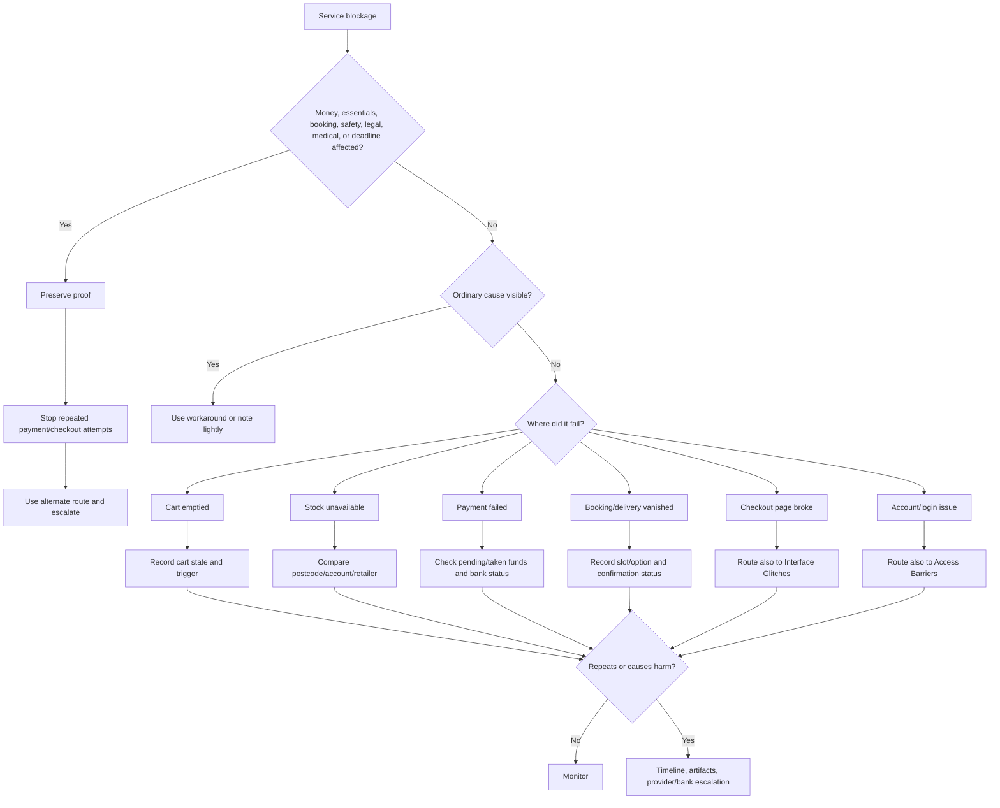

# 🛒 Service Blockages  
**First created:** 2025-09-16 | **Last updated:** 2026-05-30  
*Checkout, cart, stock, booking, delivery, payment, account, and consumer-service triage for when access to goods or services quietly fails.*

---

## 🌱 Purpose

This folder is for consumer-facing systems that refuse, delay, vanish, or misbehave.

A cart empties.
An item is always out of stock.
A payment fails.
A booking disappears.
A delivery option vanishes.
A checkout page loops.
A discount will not apply.
A valid card is rejected.
A service works for someone else but not for you.
A product appears available until the final step.

Most service blockages are ordinary.

Stock systems lag.
Retail sites break.
Payment processors fail.
Cards get fraud-flagged.
Delivery zones change.
Postcodes confuse logistics.
Bookings time out.
Cookies corrupt baskets.
Retail platforms are held together with vibes, tracking pixels, and the desperate labour of people who should have been allowed to go home.

But service blockages matter because consumer systems are access systems.

They decide who can buy, book, travel, receive deliveries, replace essentials, access tools, pay deposits, use vouchers, or obtain support.

This folder helps people:

* check ordinary retail, payment, and booking causes first;
* compare account, guest, postcode, browser, device, and payment routes;
* preserve cart, checkout, stock, and error evidence;
* avoid repeated payment attempts that create holds or fraud flags;
* log repeated or selective failures;
* and escalate when service denial affects essentials, money, bookings, safety, evidence, work, care, or deadlines.

The rule here is simple:

> Check the basket.
> Check the route.
> Keep the receipt.
> Do not keep feeding the payment goblin.

---

## 🧭 What Belongs Here

Use this folder when the weirdness affects access to consumer goods, bookings, payments, deliveries, orders, or service transactions.

Examples include:

* cart emptying;
* basket contents changing;
* item listed as available but unavailable at checkout;
* item always “out of stock” for one account or postcode;
* checkout button failing;
* valid payment card declined;
* payment spinning indefinitely;
* payment authorised but order not created;
* order cancelled without clear explanation;
* booking slot vanishing;
* delivery options disappearing;
* postcode rejected inconsistently;
* discount, voucher, or credit not applying;
* service available in guest mode but not logged-in mode;
* price, stock, delivery, or booking availability changing by account, device, location, or payment method.

If the issue is mainly card terminals, ATMs, transport, utilities, or public infrastructure, route to:

```text id="txwo53"
../🚉_Infrastructure_Hiccups/
```

If the issue is mainly login, permissions, account lockout, or MFA, route to:

```text id="rs77ni"
../🔑_Access_Barriers/
```

If the issue is mainly visible button, form, field, or checkout-page behaviour, route also to:

```text id="x0h6wk"
../🖥_Interface_Glitches/
```

If the issue is mainly repetition, timing, or clustering, route to:

```text id="96iw4b"
../🎛_Systematic_Patterns/
```

Service Blockages is for consumer access.

Other folders may explain the payment infrastructure, account gate, screen failure, or pattern underneath.

---

## 🧰 Obvious Small Fixes First

Before treating a service blockage as meaningful, check ordinary causes.

### Basket and checkout checks

* Refresh once after screenshotting the cart.
* Check whether the item is still in stock.
* Check quantity limits.
* Check whether the cart expired.
* Check whether the item has delivery restrictions.
* Check whether a variant, size, colour, format, or seller changed.
* Try a shorter cart with one item.
* Try guest checkout if safe.
* Try logged-in checkout if guest fails.
* Try another browser.
* Try private/incognito mode.
* Clear site cookies after preserving the failure state.
* Disable extensions or ad blockers for one controlled test.
* Check whether a cookie banner, overlay, or pop-up is blocking checkout.

### Payment checks

* Check card details.
* Check billing address.
* Check postcode format.
* Try another payment method if safe.
* Try PayPal, bank transfer, gift card, Apple Pay, Google Pay, or another route if available.
* Check whether the bank/app shows pending authorisations.
* Check whether a 3D Secure or bank approval window was blocked.
* Do not repeatedly retry large or urgent payments without checking for holds.

### Stock and delivery checks

* Check another postcode if appropriate.
* Check another retailer.
* Check click-and-collect vs delivery.
* Check delivery date and fulfilment method.
* Check whether stock differs by store, seller, or warehouse.
* Check whether the item is restricted, recalled, age-gated, region-gated, or seller-limited.
* Check whether a VPN or location setting is changing availability.

### Booking checks

* Screenshot the slot before selecting it if the booking matters.
* Check whether the slot is held temporarily.
* Check whether payment timeout released it.
* Try another device/browser.
* Check whether confirmation email arrived.
* Keep booking reference if any appears.
* Contact the provider promptly if money was taken but booking failed.

These checks are not dismissal.

They stop ordinary retail chaos from masquerading as a pattern, and they protect you from turning one failed checkout into six pending charges and a headache with a customer-service chatbot named Oliver.

---

## 🛑 Do Not Over-Test Payments

Payment systems can create real consequences.

Repeated attempts may cause:

* pending authorisations;
* duplicate charges;
* fraud flags;
* account freezes;
* card blocks;
* order cancellations;
* voucher loss;
* booking holds;
* delivery-slot loss;
* confusing transaction records.

For payment failure:

1. screenshot the error;
2. check whether money is pending or taken;
3. record transaction time and amount;
4. try one alternate payment route if safe;
5. contact bank, merchant, or provider if money moved;
6. stop repeated retries until the payment state is clear.

Do not feed the payment goblin.

It has already had enough.

---

## 🧪 Comparison Tests

Use comparison to locate the blockage.

| Test                           | What it helps distinguish                                    |
| ------------------------------ | ------------------------------------------------------------ |
| Logged-in vs guest checkout    | Account-specific problem vs general checkout issue           |
| Same item, different browser   | Browser/cache/extension issue vs retailer issue              |
| Same account, different device | Device/browser issue vs account/service issue                |
| Same cart, different postcode  | Delivery-zone or regional availability issue                 |
| Same item, different retailer  | Product supply issue vs platform-specific issue              |
| Different payment method       | Card/bank issue vs checkout issue                            |
| VPN on/off                     | Location, fraud, or regional filtering issue                 |
| Smaller cart                   | Basket/item interaction or quantity limit                    |
| Another person checking stock  | Personal/account-specific visibility vs general stock status |
| Store pickup vs delivery       | Fulfilment-route issue                                       |

Do not run every test.

Pick the smallest comparison that answers the next useful question.

If money, essentials, legal, medical, work, travel, or safety access is involved, preserve evidence and escalate instead of endlessly experimenting.

---

## 🧾 What To Record

For service blockages, record the transaction pathway.

Capture:

* date and time, including timezone;
* retailer, provider, booking platform, or service;
* account state: logged-in or guest;
* device and browser/app;
* network type and VPN/proxy status;
* item, booking, service, SKU, ISBN, reference, or product URL;
* postcode or region tested, if relevant;
* cart contents;
* price shown;
* stock status shown;
* delivery or pickup options shown;
* payment method attempted, masked safely;
* failure step;
* exact error text;
* whether money was authorised, pending, taken, or not touched;
* order or booking reference if generated;
* confirmation email status;
* comparison tests tried;
* screenshots of listing, cart, checkout, error page, and confirmation status;
* practical impact.

Good:

```text id="d94kli"
Item showed in stock at 19:12. Cart accepted item. Checkout failed after postcode entry with “delivery unavailable.” Same postcode worked for other items. Guest checkout showed same result.
```

Less useful:

```text id="s6nz92"
The site blocked me from buying it.
```

That may become the concern.

The record starts with the pathway.

---

## 🧾 Minimal Service Blockage Log

```yaml id="k4fn8h"
when: 2026-05-30T21:45:00+01:00
category: "service_blockage"
retailer_or_provider: ""
service_type: "shopping / booking / delivery / payment / subscription / support / other"
account_state: "logged_in / guest / unknown"
device: ""
os_browser_app: ""
network_type: "wifi / mobile_data / public_wifi / vpn / proxy / wired"
vpn_or_proxy: null
item_or_service:
  name: ""
  sku_or_reference: ""
  url: ""
  postcode_or_region: ""
cart_or_booking_state:
  stock_status_shown: ""
  price_shown: ""
  delivery_or_booking_options: ""
  cart_contents: ""
payment:
  method_masked: ""
  amount: ""
  authorised_pending_taken: "none / pending / taken / unknown"
failure_step: ""
error_text: ""
confirmation_reference: ""
confirmation_email_received: null
comparison_tests:
  guest_vs_logged_in: null
  different_browser: null
  different_device: null
  different_postcode: null
  different_payment_method: null
  different_retailer: null
  vpn_on_off: null
artifacts:
  - ""
context: ""
impact: ""
next_step: ""
```

---

## 🛒 Cart Emptying And Checkout Loops

Cart failures are often ordinary, but they are worth logging when they repeat or affect important goods/services.

Ordinary causes include:

* expired session;
* cookies blocked;
* stock changed;
* quantity limit;
* item removed by seller;
* browser extension conflict;
* checkout timeout;
* location mismatch;
* guest/login cart conflict;
* site update or maintenance;
* fulfilment route no longer available.

Record:

* cart contents before failure;
* screenshot before checkout;
* whether the cart emptied after refresh, login, postcode, payment, or delivery selection;
* whether the same cart survives in another browser;
* whether guest vs logged-in cart differs;
* whether one item causes the cart to fail;
* whether checkout loops back to cart or login.

If checkout fails because visible buttons or fields break, route also to:

```text id="4p9qe1"
../🖥_Interface_Glitches/
```

If checkout fails because login or account access breaks, route also to:

```text id="w1gfyk"
../🔑_Access_Barriers/
```

---

## 📦 Phantom Stock And Selective Availability

Phantom stock means an item appears available but cannot actually be bought, booked, delivered, or collected.

Ordinary causes include:

* stock database lag;
* item reserved by another customer;
* warehouse mismatch;
* third-party seller issue;
* recalled item;
* location restriction;
* age or ID restriction;
* delivery-zone limit;
* product discontinued but listing still indexed;
* stock visible before fulfilment rules apply.

Record:

* listing stock status;
* checkout stock status;
* postcode or store tested;
* account state;
* time checked;
* screenshots at listing and checkout;
* whether another postcode sees availability;
* whether another account sees availability;
* whether another retailer has the same issue;
* whether the item is essential, restricted, sensitive, or deadline-linked.

The clean statement is:

```text id="uzxbdz"
Listed as in stock. Checkout says unavailable. Availability differs by postcode/account/time.
```

That is enough to start.

---

## 💳 Payment Declines And Pending Authorisations

Payment failure is not just annoying. It can create money confusion.

Ordinary causes include:

* fraud check;
* insufficient funds;
* incorrect billing address;
* expired card;
* 3D Secure failure;
* blocked pop-up;
* bank outage;
* merchant processor outage;
* duplicate transaction protection;
* VPN or location mismatch;
* high-value or unusual purchase flag.

Record:

* merchant;
* amount;
* time;
* payment method, masked;
* failure message;
* whether bank/app shows pending authorisation;
* whether merchant generated order reference;
* whether confirmation email arrived;
* whether bank approved or declined;
* whether another payment method worked;
* whether funds were released.

If payment infrastructure is failing across physical terminals or public systems, route also to:

```text id="gf19hj"
../🚉_Infrastructure_Hiccups/
```

If the payment page itself visually breaks, route also to:

```text id="1tiqqx"
../🖥_Interface_Glitches/
```

---

## 🎟️ Booking And Delivery Option Vanishes

Booking and delivery systems often fail at the boundary between availability and commitment.

Examples:

* slot appears, then vanishes;
* booking reference appears but no confirmation arrives;
* delivery option disappears after login;
* postcode accepted at listing but rejected at checkout;
* collection option available on one device but not another;
* appointment time disappears after payment;
* reservation holds but cannot complete.

Record:

* booking/service provider;
* slot or delivery option shown;
* time selected;
* postcode or location;
* logged-in or guest state;
* payment status;
* confirmation reference;
* confirmation email status;
* screenshots before and after selection;
* whether another route works;
* whether provider can see the booking.

For high-stakes appointments, do not simply keep refreshing.

Contact the provider and ask for manual confirmation.

---

## 🚦 When To Ignore, Log, Or Escalate

### 🟢 Ordinary service blockage

Likely ordinary if:

* stock genuinely runs out;
* another payment method works;
* checkout succeeds after refreshing;
* status page confirms outage;
* the issue affects many unrelated users;
* the item or booking is low-stakes;
* no money was taken or held;
* the merchant gives a clear explanation.

Action:

* use the workaround;
* keep receipt only if useful.

---

### 🟡 Worth logging

Log the blockage if:

* the service matters;
* payment, booking, delivery, or essentials are affected;
* money is pending or taken without confirmation;
* stock or availability differs by account, postcode, device, or browser;
* the same item or service fails repeatedly;
* checkout fails at the same step;
* delivery or booking options vanish without explanation;
* support explanations are vague or contradictory.

Action:

* preserve listing, cart, checkout, and error screenshots;
* record time, item, postcode, account state, and payment status;
* test one comparison route if safe;
* contact provider if money or booking is unclear.

---

### 🟠 Pattern suspected

Treat as pattern-suspected if:

* the same item is repeatedly unavailable only for one account or postcode;
* payment fails repeatedly despite valid methods;
* bookings vanish around specific events, deadlines, appointments, or travel;
* consumer access differs by device/account/location without clear reason;
* checkout failure clusters with login, connection, or interface problems;
* money is repeatedly held without order creation;
* provider explanations change between incidents.

Action:

* build a timeline;
* preserve artifacts;
* compare across account/device/postcode/payment route;
* avoid repeated payment attempts;
* escalate to provider, bank, merchant, regulator, adviser, or support route if impact warrants it.

---

### 🔴 Escalate now

Escalate promptly if the service blockage affects:

* essential food, medicine, mobility, heating, communication, or safety supplies;
* medical, legal, safeguarding, housing, immigration, employment, education, or benefits access;
* urgent travel or appointments;
* essential payments;
* evidence preservation or submission;
* large sums of money;
* repeated pending authorisations;
* access to support services;
* a booking needed for care, work, safety, or legal obligations.

Action:

* stop repeated checkout/payment attempts;
* preserve proof;
* use a verified alternate provider or channel if possible;
* contact merchant, bank, provider, adviser, or responsible body;
* ask for manual booking, payment reversal, confirmation, refund, deadline protection, or alternative access.

---

## 🚩 Service Blockage Red Flags

One red flag is not proof.

Several together deserve a proper record.

Watch for:

* item shown as available until final checkout;
* stock differs by account, postcode, device, or browser;
* cart empties after specific item is added;
* payment fails only for certain merchant/service combinations;
* money pending but no order or booking created;
* delivery options vanish after login;
* booking slots disappear after entering personal details;
* checkout loops around high-stakes goods or services;
* same service fails around deadlines, appointments, travel, complaints, or evidence activity;
* support says no issue while screenshots show failure;
* confirmation appears briefly then vanishes;
* repeated cancellations without clear reason;
* alternate account or postcode succeeds where main one fails.

The key question is:

```text id="85vd90"
Which step in the service pathway failed, and what changed when account, postcode, device, or payment route changed?
```

Not:

```text id="viux6y"
Why is the shopping cart personally cursed?
```

Though, frankly, some carts do have the spiritual energy of a haunted cupboard.

Still: pathway first.

---

## 🗂 Planned / Existing Nodes

| Node                                         | Scope                                                                            | Status             |
| -------------------------------------------- | -------------------------------------------------------------------------------- | ------------------ |
| `🛒_cart_emptying_triage.md`                 | Basket clearing, checkout loops, and cart-state failures                         | Planned            |
| `📦_phantom_stock_triage.md`                 | Listed availability vs checkout unavailability                                   | Planned            |
| `💳_payment_decline_triage.md`               | Valid-card declines, pending authorisations, and payment ambiguity               | Planned            |
| `🎟️_booking_or_delivery_option_vanishes.md` | Booking slots, delivery options, collection routes, and appointment availability | Planned            |
| `🧪_guest_account_postcode_payment_tests.md` | Comparison tests for account, region, browser, and payment route                 | Planned            |
| `🧾_service_blockage_log_template.md`        | Standard service-blockage logging format                                         | Planned            |
| `🚩_service_blockage_red_flags.md`           | Pattern indicators and escalation cues                                           | Planned            |
| `🧾_phantom_stock_registry.md`               | Logs of items falsely marked unavailable or out of stock                         | Existing / planned |
| `💳_payment_auth_failure_log.md`             | Transaction-layer declines, reversals, and authorisation failures                | Existing / planned |
| `📦_cart_reset_patterns.md`                  | Disappearing baskets and interrupted checkout sessions                           | Existing / planned |
| `🪞_retail_shadowban_index.md`               | Suppressed, delisted, hidden, or selectively unavailable products                | Existing / planned |
| `📈_service_blockage_timeline.md`            | Correlating service failures with events, deadlines, or escalation windows       | Existing / planned |
| `🧰_consumer_countermeasure_kit.md`          | Alternate purchasing routes, documentation methods, and practical workarounds    | Existing / planned |

---

## 🧪 Suggested First-Build Set

For the first practical build, prioritise:

```text id="ryem1m"
🛒_cart_emptying_triage.md
📦_phantom_stock_triage.md
💳_payment_decline_triage.md
🎟️_booking_or_delivery_option_vanishes.md
🧪_guest_account_postcode_payment_tests.md
```

These five give users immediate help: preserve the cart, test stock claims, avoid payment chaos, protect bookings, and compare account/postcode/payment routes without spiralling.

---

## 🗺 Mini Routing Diagram



---

## 🌌 Constellations

🩻 🛒 📦 💳 🎟️ — consumer access; checkout friction; phantom stock; payment ambiguity; booking and delivery gates.

---

## ✨ Stardust

service blockage, checkout failure, cart emptying, phantom stock, payment decline, pending authorisation, booking failure, delivery unavailable, consumer access, retail triage

---

## 🏮 Footer

*🛒 Service Blockages* is a living node of the **Polaris Protocol**.
It holds the consumer-access layer of Weirdness Screening: the place where carts, checkout flows, stock systems, bookings, delivery options, and payment routes are checked, preserved, compared, and escalated when service friction blocks ordinary access.

> 📡 Cross-references:
>
> * [🩻 Weirdness Screening](../README.md) — *parent triage doorway for ordinary glitches, persistent anomalies, and escalation-worthy weirdness*
> * [🚉 Infrastructure Hiccups](../🚉_Infrastructure_Hiccups/) — *transport, utility, payment-terminal, public-service, and shared-system disruptions*
> * [🔑 Access Barriers](../🔑_Access_Barriers/) — *login, MFA, permission, and submission barriers*
> * [🖥 Interface Glitches](../🖥_Interface_Glitches/) — *visible UI refusal, cursor oddities, and broken forms*
> * [🎛 Systematic Patterns](../🎛_Systematic_Patterns/) — *recurrence, timing, and clustering analysis*
> * [🌐 Connection Hiccups](../🌐_Connection_Hiccups/) — *network, upload, signal, and router-level anomalies*

*Survivor authorship is sovereign. Containment is never neutral.*

*Last updated: 2026-05-30*
