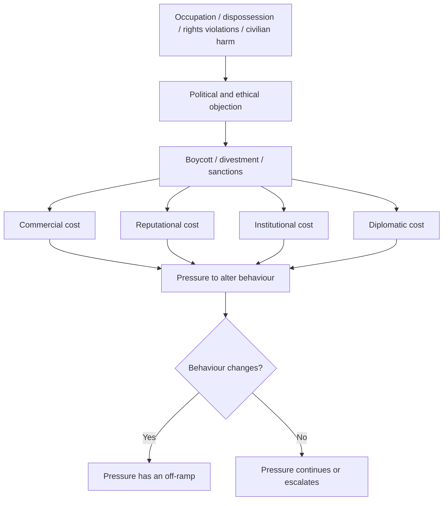
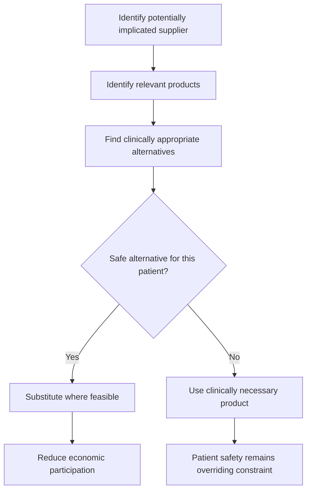
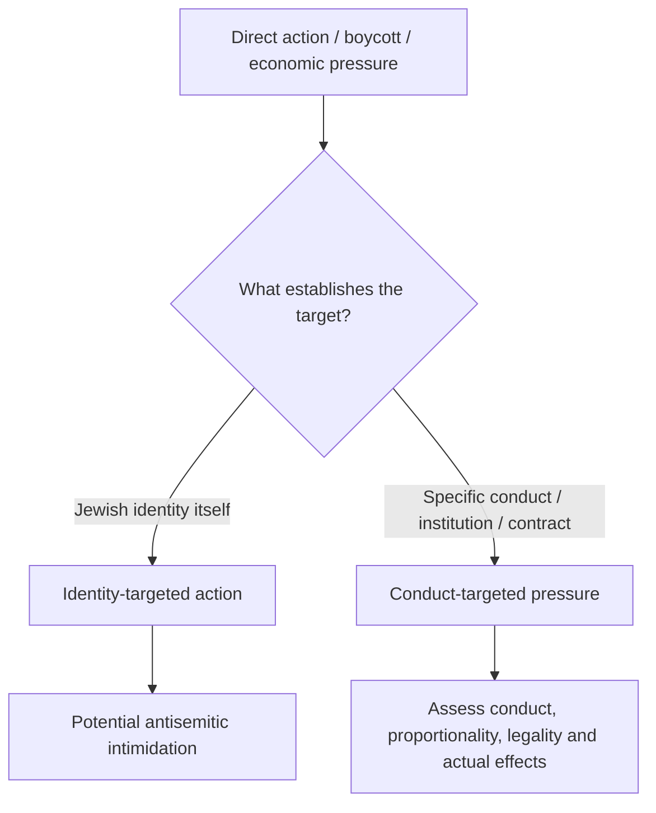
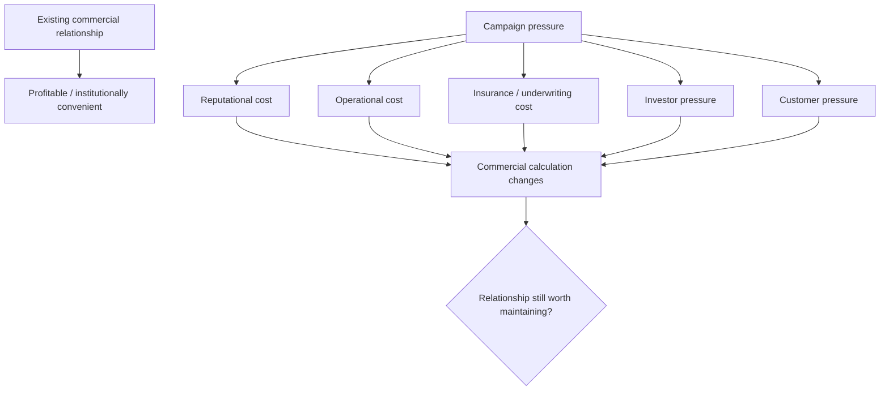
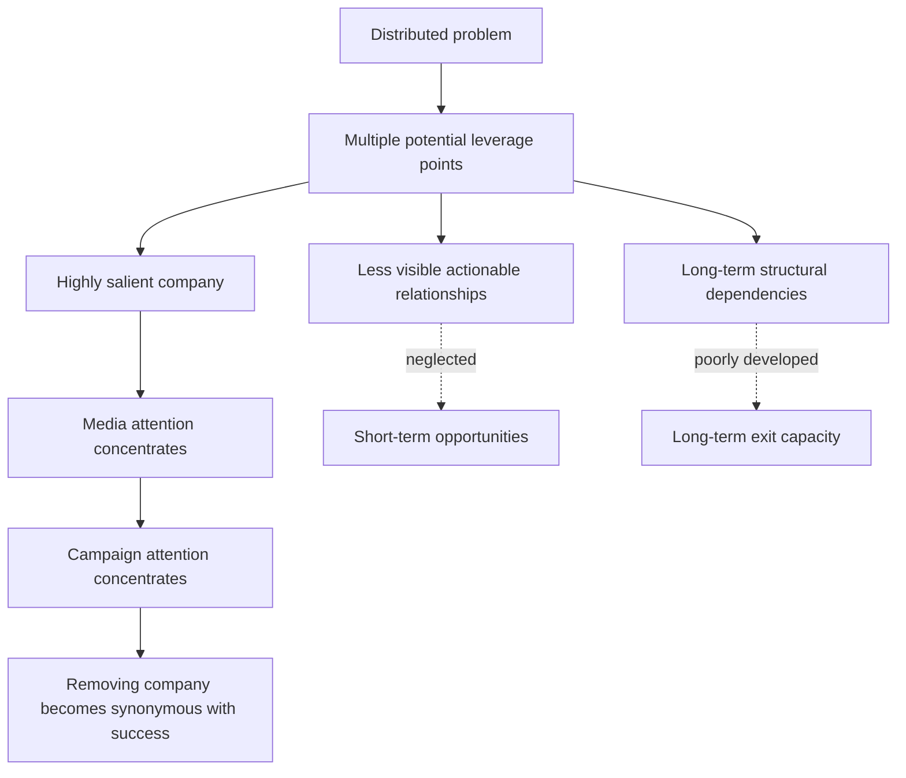
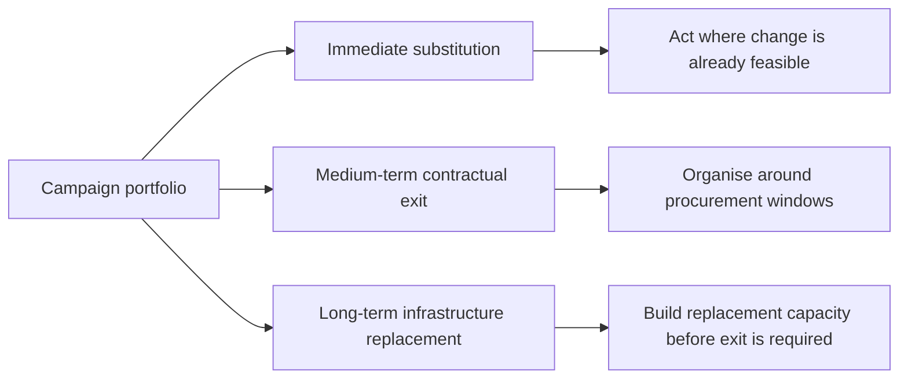

# 🎯 What Was BDS Supposed To Do?
**First created:** 2026-08-23 | **Last updated:** 2026-08-23  
*Recovering boycott, divestment and sanctions as an attempted mechanism for behavioural change rather than a ritual of punishment.*

---

## 🛰️ Orientation

Before asking whether a campaign worked, it is worth remembering what it was trying to do.

Boycott, divestment and sanctions are frequently metabolised in public discussion as punishment:

> *You have done something bad, therefore we will make you suffer.*

That is not a very useful account of the underlying mechanism.

The Palestinian civil-society BDS call issued in 2005 explicitly sought sustained international pressure until specified political and legal conditions changed. It drew directly on the precedent of international pressure against apartheid South Africa and framed boycott, divestment and sanctions as tools for changing the conditions under which continued occupation and denial of Palestinian rights remained politically and economically sustainable.

In other words:

**the point was supposed to be behavioural change.**

Not punishment as an end in itself.

That distinction matters.

---

## 🎯 Start With The Desired Outcome

The simplest model is:


The target of the intervention is not suffering.

The target is the behaviour.

That means the relevant question is not:

> **Did the target suffer enough?**

It is:

> **Did continuing the behaviour become harder, costlier or less attractive?**

This is a basic but important distinction.

---

## ♻️ BDS As Negative Feedback

BDS can usefully be understood as an attempted **negative-feedback mechanism**.

A political system produces an outcome.

That outcome generates a corrective signal.

Civil society then attempts to connect the signal to material consequences.



The 2005 Palestinian call itself used the language of sustained measures **until** its stated demands were met. The contemporary BDS movement likewise describes the campaign as nonviolent pressure intended to secure compliance with international law.

The existence of an **until** matters.

It means the intervention contains a proposed condition for behavioural change.

---

## 💢 Punishment Is A Different Model

Punishment can be retrospective.

```text
you did X
↓
you deserve Y
```

Behavioural pressure is conditional and prospective.

```text
you are continuing X
↓
continuing X incurs increasing cost
↓
change X
↓
the rationale for that pressure changes
```

The two can coexist emotionally.

People taking part in a boycott may be furious.

They may want accountability.

They may describe what they are doing as punishment.

That does not establish that punishment is the most useful analytical description of the campaign mechanism.

---

## 🩸 Anger Is Not Necessarily The Objective

People have visceral responses to watching civilians being killed.

That is not peculiar to Palestine.

People watching Russian attacks on Ukrainian civilians may demand sanctions against Russia without possessing an animating hatred of Russian people.

People can condemn attacks that kill Iranian civilians without supporting the IRGC.

The same distinction should be available here.


The emotional register may be anger.

The political objective can still be:

**make the conduct stop.**

Conflating affect with objective produces bad analysis.

---

## 🧿 What The 2005 Call Actually Asked For

The original Palestinian civil-society call did not emerge in 2023.

It was issued in July 2005 by a broad collection of Palestinian civil-society organisations, including unions, professional associations, refugee networks and other organisations. Its stated demands concerned occupation and colonisation, equality for Palestinian citizens of Israel, and Palestinian refugee rights.

The movement itself explicitly cites the anti-apartheid struggle in South Africa as an inspiration.

That history matters because the acute organising that followed the destruction in Gaza after October 2023 did not invent the underlying tool.

It intensified an existing strategy.

The question became immediate:

> **What relationships within our own professions, institutions, companies and governments can we actually change?**

That is a very different question from:

> **Who would we most enjoy punishing?**

---

## 🧑‍⚕️ When Moral Objection Becomes Operational

Healthcare organising is particularly revealing because clinicians cannot simply treat political purity as the overriding objective.

The patient remains in the loop.

That creates a demanding form of boycott design:



That is not a very good architecture for indiscriminate punishment.

It is much closer to **targeted withdrawal under professional safeguards**.

Campaign infrastructure around medicines has included clinicians doing the boring work that makes such choices possible: identifying products, manufacturers and potential alternatives rather than simply telling patients or healthcare workers to fend for themselves.

That work matters because political pressure becomes much more actionable when someone has already built the exit route.

---

## 💊 Why The Teva Example Matters

A pharmaceutical boycott illustrates the difference between symbolic opposition and executable change.

If a medicine:

- has another suitable manufacturer;
- has a clinically acceptable alternative;
- can be substituted without compromising patient safety;
- and falls within an institution's purchasing discretion;

then an ethical procurement preference may potentially be implemented relatively quickly.

If there is no safe alternative, the clinical decision remains the clinical decision.

The interesting feature is therefore not merely the choice of company.

It is the creation of **substitution capacity**.


That is intervention design.

---

## 🩺 This Is Also Professional Ethics

There is a longer history of professions using institutional non-cooperation, boycotts and sanctions in response to systems regarded as seriously unethical.

The Palestinian BDS call itself explicitly invoked the South African anti-apartheid precedent.

That comparison should be used carefully.

The situations are not identical.

The useful point is narrower:

> **Professional boycott as a mechanism of ethical and institutional pressure did not begin with Palestine.**

Doctors, universities, unions, churches, sporting organisations and other professional or civic bodies have previously treated continued institutional participation as something capable of carrying ethical consequences.

For healthcare workers, this is especially unsurprising.

Medicine already asks practitioners to think about:

- civilian protection;
- medical neutrality;
- complicity;
- access to treatment;
- discrimination;
- professional duties during war;
- the treatment of prisoners;
- the destruction or obstruction of healthcare systems.

Organisations such as Doctors Against Genocide emerged after 2023 specifically around healthcare professionals attempting to connect mass-atrocity prevention, medical ethics and civilian protection.

Again: the intervention may be politically controversial.

The existence of the intervention is not conceptually bizarre.

---

## 🕯️ The Acute 2023 Question

After October 2023, many people were no longer asking only:

> *What position do I hold on Israel and Palestine?*

They were asking:

> **What can I do, from where I am, that might create some immediate pressure against further civilian destruction?**

Those are different questions.

The latter generates:

- workplace organising;
- procurement scrutiny;
- shareholder pressure;
- divestment campaigns;
- medical supply mapping;
- academic organising;
- cultural boycott;
- arms-company campaigning;
- banking campaigns;
- lobbying for sanctions or embargoes.

The shared intuition is fairly simple:

```text
if governments will not create sufficient negative feedback,
civil society will try to create some.
```

The scale and effectiveness of that feedback are separate questions.

---

## 📉 It Did Not Achieve The Larger Immediate Objective

It is also important not to romanticise the result.

The acute organising sought, among other things, to contribute to pressure capable of protecting Palestinian civilians and changing the trajectory of events in Gaza.

The catastrophic level of civilian death, destruction and displacement demonstrates that civil-society economic pressure did not achieve that larger protective objective at anything approaching the required speed.

That should produce analysis rather than ritual.

What worked?

What failed?

What was too slow?

What was mis-targeted?

Where did governments or companies absorb the pressure?

Where was substitution possible?

Where had existing dependency already made withdrawal extremely expensive?

Where did the campaign become better at generating attention than changing behaviour?

Those are questions for improvement, not reasons to forget what the intervention was trying to do.

---

## 🪞 How Behavioural Pressure Became Punishment

One of the most consequential narrative transformations around BDS has been the movement from:

```text
pressure intended to alter conduct
```

toward:

```text
punishment directed at Israel / Israelis / Jews
```

Those categories should not be casually merged.

The BDS National Committee says its institutional boycott framework does not call for boycotting individuals merely because they are Israeli and describes its platform as opposing racism, including antisemitism.

That claim does not mean that every person acting under a BDS banner behaves impeccably.

No political movement receives that exemption.

Antisemitic people can support Palestinian causes.

Antisemitic rhetoric can occur in boycott spaces.

Individuals can choose targets badly.

Direct action can become threatening.

Jewish people can reasonably experience particular acts as intimidating.

None of those propositions establishes that **economic pressure directed at conduct or institutional complicity is inherently intimidation of Jews**.

That requires another step of analysis.

---

## ✡️ Jewish Fear Is Real Information — But It Is Not The Whole Analysis

Historic boycotts of Jews are part of Jewish collective memory for extremely good reasons.

Economic exclusion was one component of much larger structures of antisemitic persecution.

That historical memory can make contemporary boycott language frightening.

The fear should not be mocked.

But:

> **this resembles something I have learned to fear**

and

> **this contemporary intervention has the same target, mechanism and objective**

are different claims.

The first describes an embodied historical response.

The second requires evidence.

---

## 🎯 Conduct-Targeted Pressure Versus Identity-Targeted Intimidation

A useful distinction is:



This is not a magic decision tree.

Political rhetoric can blur categories.

A company can be targeted for pretextual reasons.

An institution can be both Jewish and politically active.

Context matters.

But the first analytical question should not simply be:

> **Does Israel appear somewhere in the story?**

It should be:

- Who is being targeted?
- What relationship makes them a target?
- What behaviour is the intervention attempting to change?
- Is Jewish identity itself being assigned culpability?
- Would the target cease to be targeted if the relevant conduct or relationship changed?

That last question is particularly useful.

---

## 🏘️ Settlements Make The Distinction Visible

Consider economic activity linked to settlements in occupied territory.

A person may oppose settler violence and oppose continued settlement expansion.

If a campaign then tries to make settlement-linked commerce less profitable, it does not automatically follow that the campaign is threatening that person **as a Jew**.

The mechanism may simply be:


If Jews are targeted regardless of whether they have any relationship to the conduct, that is another matter.

The distinction is not complicated.

It merely becomes politically inconvenient surprisingly often.

---

## 🏢 Companies Need Reasons Too

One under-discussed feature of economic campaigning is that companies operate inside their own constraint systems.

A board cannot necessarily say:

> *We have decided that this feels morally horrible, so we are terminating everything immediately.*

There may be:

- contracts;
- fiduciary obligations;
- shareholder pressure;
- procurement rules;
- underwriting conditions;
- financing;
- political exposure;
- supply dependencies;
- litigation risk.

Campaign pressure can alter that internal calculation.



This is one reason superficially strange-looking direct action can make sense as economic intervention.

The aim may be to create **a reason that can travel through the institution**.

---

## 🎨 Why Paint Can Be About A Spreadsheet

Throwing paint on a building is visually dramatic.

Its actual intended mechanism may be considerably more boring.

A superficial intervention can potentially generate:

- remediation costs;
- temporary closure;
- safety inspection;
- disrupted operations;
- insurance consequences;
- contractual delays;
- adverse publicity.

That does not decide whether the act is lawful.

It does not decide whether it should legally count as violence.

It does not establish that nobody was frightened or harmed.

Those are separate questions.

But analysing direct action requires distinguishing:

**what an intervention looks like**

from

**what leverage it was designed to produce.**

Sometimes the paint is there because the spreadsheet is the actual battlefield.

---

## ⚖️ Direct Action, Violence And Intimidation Need Separate Analysis

There is a wider conversation to be had about:

- property damage;
- sabotage;
- trespass;
- intimidation;
- threats;
- violence against people;
- economic coercion;
- protest;
- proportionality;
- criminalisation.

This node does not need to settle that entire debate.

Its narrower point is methodological:

```text
unlawful
≠ automatically violent against people

politically confrontational
≠ automatically identity-targeted

economically coercive
≠ automatically punitive in purpose

Israel-related
≠ automatically antisemitic
```

Each additional classification requires evidence.

---

## 🕸️ When One Target Eats The Campaign

Once boycott is understood as behavioural intervention, target selection becomes critically important.

A campaign can drift from:

```text
What behaviour can we alter?
```

toward:

```text
Which company symbolises everything we oppose?
```

That is a dangerous substitution.



This is where BDS connects to the wider problem of **absorption and selective sacrifice**.

A spectacular corporate target can absorb an extraordinary amount of opposition.

Removing it may be worthwhile.

But if substantially the same underlying conduct continues through other relationships, the original intervention has not yet succeeded.

---

## 💊 Teva And 💾 Palantir Are Different Problems

This creates an important distinction between **moral relevance** and **campaign horizon**.

Suppose one relationship has:

- identified substitutes;
- relatively low switching costs;
- professional guidance already developed;
- purchasing decisions capable of changing comparatively quickly.

Suppose another involves:

- major infrastructure;
- integration work;
- data migration;
- staff training;
- interoperability;
- sunk costs;
- vendor dependency;
- long procurement cycles.

The answer is not:

> *Only campaign against the easy one.*

Nor is it:

> *Talk exclusively about the enormous famous one.*

The rational answer is:



That is a strategy.

---

## 🧭 What Was The Point?

The point was not supposed to be:

- finding the most evil-looking company;
- demonstrating ideological purity;
- permanently punishing people for national identity;
- making Jewish people frightened;
- producing the most dramatic possible protest image;
- winning a discourse war.

The point was to create **material reasons for behaviour to change**.

That means the campaign should continuously return to its output.

---

## 🔬 Questions Worth Asking Now

After more than two decades of BDS organising, and after the acute escalation of mobilisation following 2023:

- What behaviours were particular campaigns intended to change?
- Which interventions actually altered procurement or investment?
- Which targets were substitutable?
- Which were already locked into infrastructure?
- Which campaigns produced alternative capacity rather than merely objection?
- Where did reputational pressure change corporate decisions?
- Where did pressure generate enormous attention but little changed behaviour?
- Which campaigns created viable off-ramps?
- Which campaigns became symbolic targets detached from the original objective?
- Where did establishment criticism converge on a company that could absorb the hit?
- Which less glamorous interventions may have produced better marginal returns?
- How should short-, medium- and long-term campaigns interact?
- How can civilian, worker and patient harms created by intervention be minimised?
- What would count as success?
- What conditions should end a boycott?
- Most importantly: **did the behaviour change?**

---

## 🌱 Improvement Is Not Betrayal

Looking critically at campaign design is not an argument against the objective.

It is the opposite.

If the purpose was to help protect Palestinian civilians and create meaningful pressure for rights and compliance with international law, then ineffective strategy should not acquire sacred status merely because considerable effort has already gone into it.

The campaign is a tool.

Palestinians are not there to justify the continued existence of the tool.

That means asking what produces the strongest useful feedback now.

And changing the intervention when necessary.

---

## 📚 Source Pathways

The following organisations and resources are useful for tracing different parts of the ecology rather than treating BDS as a single homogeneous actor:

- **BDS Movement / Palestinian BDS National Committee** — original call, movement objectives, targeting principles and strategic campaign guidance.
- **Boycott Teva** — practical medicine-focused boycott and substitution work.
- **Medact** — health-professional organising around militarism, Palestine and professional ethics.
- **Doctors Against Genocide** — international healthcare-worker organising around atrocity prevention, civilian protection and medical ethics.
- **Jewish Voice for Peace / health-professional organising** — useful for tracing Jewish participation in healthcare solidarity campaigning and for resisting the analytical collapse of Jewish identity into Israeli state policy.
- **South African anti-apartheid professional-boycott history** — comparative precedent for understanding professional non-cooperation as institutional pressure rather than merely interpersonal punishment.

These sources should not be treated as interchangeable or neutral authorities.

They document what different organisers say they are trying to do.

That is necessary evidence when fact-checking claims about the purpose of a campaign.

---

## 🌌 Constellations

🎯 ♻️ 💸 🩺 🕸️ — boycott strategy; behavioural feedback; professional ethics; target selection; narrative transformation.

## ✨ Stardust

palestine, bds, boycott, divestment, sanctions, behavioural change, negative feedback, professional ethics, procurement, antisemitism, campaign strategy

---

## 🏮 Footer

*🎯 What Was BDS Supposed To Do?* is a living node of the **Polaris Protocol**.  
It reconstructs boycott, divestment and sanctions as an attempted mechanism for changing behaviour and examines how that mechanism can be obscured when economic pressure is interpreted primarily through the language of punishment, identity or symbolic corporate targeting.

> 📡 Cross-references:
>
> - [🌍 Global Powers](./) — *international power, economic relationships and external leverage around Palestine*
> - [💸 Incentivising Behavioural Change and BDS](./💸_incentivising_behavioural_change_and_bds.md) — *applied campaign design, substitutability, target selection and intervention horizons*
> - [🌀 Absorption and Selective Sacrifice](../../../../../🌑_1_Origin_Points/🪿_Embodied_Information_Ecology/♻️_Cybernetics/🌀_absorption_and_selective_sacrifice.md) — *how systems receive corrective pressure while containing its capacity to propagate*
> - [💸 Making Harm Too Expensive To Continue](../../../../../🌕_5_Long_Strategies/💸_Business_Is_Tooling/💸_making_harm_too_expensive_to_continue.md) — *general theory of constructing durable economic negative feedback around harmful conduct*
>
> 🏮 Return To:
>
> - [🌍 Global Powers](./) — *1up*
> - [🇵🇸 Palestine Factchecking](../..) — *3up*
> - [🌌 Polaris Protocol - Root](../../../../../README.md) — *root*

*Survivor authorship is sovereign. Containment is never neutral.*

_Last updated: 2026-08-23_
