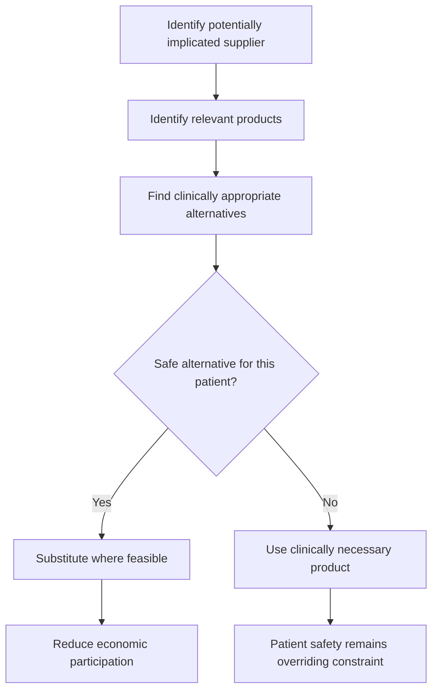
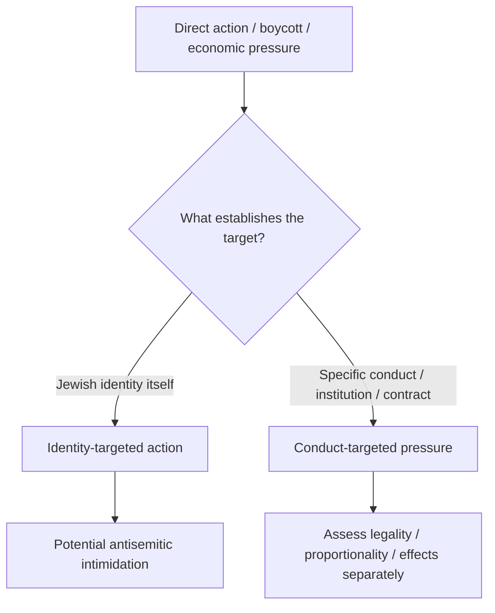
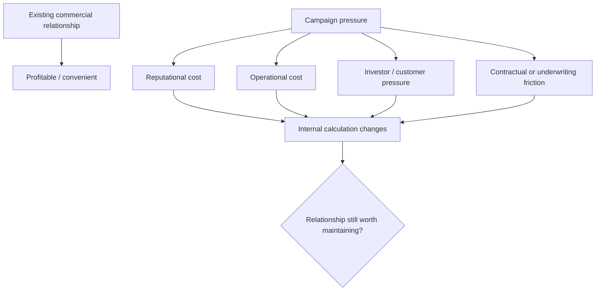

# 🎯 What Was BDS Supposed To Do?  
**First created:** 2026-08-23 | **Last updated:** 2026-08-23  
*Recovering boycott, divestment and sanctions as an attempted mechanism for behavioural change rather than treating economic pressure primarily as ritual punishment.*

---

## 🛰️ Orientation

Before asking whether a campaign worked, it is worth remembering what it was trying to do.

Boycott, divestment and sanctions are frequently metabolised in public discussion as:

> *You have done something bad, therefore we will make you suffer.*

That framing loses the mechanism.

The more useful model is:

> **conduct considered harmful continues → participation in that conduct becomes materially costlier → incentives change → behaviour becomes less attractive to continue.**

The target is not suffering.

The target is **behaviour**.

---

## 🎯 Start With The Desired Outcome


That final step matters.

A pressure campaign designed around behavioural change should contain an **off-ramp**.

If relevant behaviour changes, the rationale for maintaining exactly the same pressure should also change.

---

## ♻️ BDS As Attempted Negative Feedback


The useful analytical question is therefore:

> **Did continuing the relevant conduct become harder, costlier or less attractive?**

---

## 💢 Punishment Is A Different Model

Punishment can be retrospective:

```text
you did X
↓
you deserve Y
```

Behavioural pressure is conditional:

```text
you are continuing X
↓
continuing X incurs additional cost
↓
change X
↓
the intervention can change too
```

People may emotionally experience their own participation as punitive.

They may be furious.

They may want accountability.

That does not make punishment the best description of the intervention's underlying design.

---

## 🕯️ 2005 And 2023 Are Different Moments

The longer Palestinian BDS movement predates the acute mobilisation that followed October 2023.

Those periods should not be collapsed.

The longer movement concerns sustained Palestinian demands around occupation, settlement, rights and international pressure.

The acute 2023–24 period produced a more immediate question across professions and institutions:

> **What can we actually change from where we are, now, that might create some negative feedback against further civilian destruction?**

That generated accelerated organising around:

- procurement;
- medicines;
- investment;
- banking;
- arms supply;
- university relationships;
- professional bodies;
- cultural institutions;
- sanctions and embargoes.

The acute mobilisation did not invent the underlying tool.

It intensified the search for **immediately actionable leverage**.

---

## 🩸 Anger Is Not Necessarily The Objective

People respond viscerally to images and accounts of civilian death.

That occurs across conflicts.

Someone can react angrily to civilians being killed in Ukraine without hating Russians.

Someone can oppose attacks killing Iranian civilians without supporting the IRGC.

Likewise:


The emotional register may be fury.

The political objective can still be:

> **make the conduct stop.**

Affect and objective should not be treated as identical.

---

## 🧑‍⚕️ The Professional Organising Ecology

One important feature of the post-2023 period was that the work did not belong to one monolithic organisation.

Different groups contributed different forms of professional infrastructure.

Relevant source pathways include:

- **BDS Movement / Palestinian BDS National Committee** — movement objectives and target logic;
- **Boycott Teva** — medicines, manufacturers and practical substitution work;
- **Medact** — health-professional organising and ethical/political framing;
- **Doctors Against Genocide** — clinician-led organising around civilian protection and atrocity prevention;
- **Jewish Voice for Peace health-professional networks / HAC** — Jewish participation in healthcare solidarity work;
- student and clinician networks operating nationally and internationally;
- historical professional-boycott precedents, including anti-apartheid organising.

The important point is not that all of these organisations are identical.

They are not.

It is that a broad political objective gets translated into **profession-specific action by people who understand the systems they are trying to alter**.

---

## 💊 When Moral Objection Becomes Operational

Medicine makes this particularly visible because the patient remains in the loop.



That is not an architecture optimised for indiscriminate punishment.

It is targeted withdrawal under professional safeguards.

---

## 🩺 The Teva Work Is Existing Campaign Capital

The significance of medicine-alternative work is not merely that alternatives exist.

It is that clinicians and organisers have already invested effort in:

- identifying products;
- mapping manufacturers;
- locating possible alternatives;
- distinguishing straightforward substitution from clinically complex change;
- preserving patient-safety exceptions;
- making the intervention usable by people inside healthcare.

That changes the **marginal cost of further action**.

A campaign where the exit map already exists is different from one where an institution still has to invent the exit from scratch.


This is accumulated organisational capital.

It should be treated as such.

---

## 🩺 Professional Boycott Has Historical Precedent

The use of professional non-cooperation as political and ethical pressure did not begin with Palestine.

The anti-apartheid movement provides an obvious comparative research pathway.

Medical bodies, universities, sporting organisations, unions and other professional institutions all faced debates over whether continued institutional cooperation helped normalise or sustain apartheid South Africa.

The precise medical-association history should be sourced carefully rather than treated as folklore.

But the analytical precedent is important:

> **professional communities have previously treated institutional participation itself as ethically consequential.**

This matters because “medicine has become political” is often presented as though the phenomenon were novel.

It is not.

The useful historical questions are:

- Which medical bodies participated?
- What forms did non-cooperation take?
- What arguments were made in favour?
- What arguments were made against?
- Were individuals or institutions targeted?
- What safeguards were used?
- How did medical-professional pressure interact with wider anti-apartheid sanctions?

This should eventually become a sourced comparative section or linked fact-check.

---

## 🪞 How Behavioural Pressure Became Punishment

A major narrative transformation is:

```text
pressure intended to alter conduct
```

becoming:

```text
punishment directed at Israel / Israelis / Jews
```

Those categories are not interchangeable.

Antisemitism can occur within pro-Palestinian campaigning.

Individuals can target Jews.

Direct action can become threatening.

Targets can be chosen badly.

Nothing about the existence of a political campaign makes its participants incapable of racism.

But none of that establishes:

> **economic pressure directed at specified conduct or institutional relationships is inherently intimidation of Jews.**

That requires further evidence.

---

## ✡️ Historical Fear Is Real Information

Historic economic exclusion of Jews is part of Jewish collective memory for very good reasons.

That can make boycott rhetoric frightening.

The fear should be taken seriously.

But:

> **this resembles something I have learned to fear**

and

> **this contemporary action has the same target, mechanism and purpose**

are different claims.

The first concerns perception and historical memory.

The second requires analysis.

---

## 🎯 Identity-Targeted Intimidation Versus Conduct-Targeted Pressure



Useful questions include:

- Who is being targeted?
- Why this target?
- What conduct or relationship establishes relevance?
- Is Jewish identity itself assigned culpability?
- Would the target cease to be targeted if the relevant conduct changed?
- Is a Jewish communal institution being targeted because it is Jewish, or because of some independently specified institutional conduct?
- Are Jews with no relationship to the conduct being made proxies for Israel?

These are better questions than:

> *Does Israel appear somewhere in the story?*

---

## 🏘️ Settlement-Linked Economic Pressure

If someone opposes violent settlement activity and settlement expansion, an attempt to reduce the commercial viability of settlement-linked activity is not automatically a threat to that person **as a Jew**.

The mechanism may be:


Whether a specific campaign is lawful, proportionate or appropriately targeted remains open to analysis.

The point is simply that **conduct-targeted economic pressure and identity-targeted intimidation are analytically separable**.

---

## 🏢 Companies Need Institutionally Usable Reasons

Companies and public bodies operate inside constraint systems.

Decision-makers may face:

- contracts;
- shareholder expectations;
- procurement rules;
- litigation risk;
- political pressure;
- underwriting;
- financing;
- supply dependence.

Campaigning can alter the internal calculation.



This is why protest can seek to produce **institutionally legible consequences** rather than moral conversion.

---

## 🎨 Why Paint Can Be About A Spreadsheet

A superficial physical intervention can be intended to create:

- remediation;
- inspection;
- temporary closure;
- operational delay;
- insurance consequences;
- reputational cost;
- contractual disruption.

The economic leverage can be much larger than the physical act itself.

That does **not** determine whether a particular act is:

- legal;
- proportionate;
- violent;
- intimidating;
- safe.

Those are separate questions.

The useful analytical distinction is between:

**what an intervention physically looks like**

and

**what institutional consequence it is designed to trigger.**

The direct-action classification problem belongs in its own node.

---

## 📉 The Larger Immediate Objective Was Not Achieved

The post-2023 mobilisation sought, among other things, to create enough pressure to contribute to civilian protection and behavioural change.

Whatever successes occurred at individual institutions, the wider protective objective was plainly not achieved at the required speed.

That should generate analysis rather than ritual.

Ask:

- What changed?
- What did not?
- Which campaigns were too slow?
- Which relationships were already too embedded?
- Where had alternatives already been built?
- Where did attention substitute for leverage?
- Where was criticism absorbed?
- Where did campaigns accidentally strengthen incumbency by waiting until exit was extremely expensive?

Failure is information.

---

## 🧭 Campaign Off-Ramps Matter

If behavioural change is genuinely the objective, campaigns need answers to:

- What exact behaviour is being challenged?
- What change would count as material progress?
- What would justify reducing pressure?
- What would justify ending a boycott?
- Is the demand directed at present conduct, or has the target category become permanent?
- Can companies or institutions realistically comply?
- Is there an exit from the intervention other than disappearance?

Without off-ramps, conditional economic pressure can drift toward permanent identity-based exclusion.

That would be a different mechanism.

---

## ⚠️ Failure Modes

BDS-style behavioural campaigns can fail through:

- **symbol capture** — the company becomes more important than the outcome;
- **salience substitution** — attention determines target selection;
- **non-substitutable targeting** — pressure cannot realistically alter purchasing;
- **collateralisation** — patients, workers or civilians bear the campaign's costs;
- **no off-ramp** — changed behaviour cannot actually end the intervention;
- **impossible compliance** — demands cannot be operationalised;
- **no causal pathway** — nobody can explain how pressure reaches the decision point;
- **incumbency strengthening** — delay increases lock-in;
- **identity slippage** — conduct-targeted pressure becomes identity-targeted hostility;
- **heat mistaken for leverage** — publicity becomes the principal performance metric.

These are strategic problems, not reasons to abandon behavioural pressure as a category.

---

## 🔬 The Core Evaluation

Do not ask only:

> **Did somebody pay?**

Ask:

> **Did the behaviour change?**

And if not:

> **What does that failure tell us about the intervention?**

---

## 📚 Source Pathways

- BDS Movement / Palestinian BDS National Committee
- Boycott Teva
- Medact
- Doctors Against Genocide
- Jewish Voice for Peace health-professional organising / HAC
- historical anti-apartheid medical and professional boycott material
- Palestinian and international professional associations involved in post-2023 organising

These sources perform different evidentiary jobs.

They should not be flattened into one authority.

---

## 🌌 Constellations

🎯 ♻️ 💸 🩺 ✡️ — BDS; behavioural feedback; professional ethics; historical memory; campaign evaluation.

## ✨ Stardust

palestine, bds, boycott, divestment, sanctions, behavioural change, negative feedback, professional ethics, antisemitism, procurement, campaign history

---

## 🏮 Footer

*🎯 What Was BDS Supposed To Do?* is a living node of the **Polaris Protocol**.  
It reconstructs boycott, divestment and sanctions as attempted behavioural feedback, distinguishes that mechanism from punishment and identity-targeted intimidation, and preserves the professional and historical contexts required to evaluate the campaign on its intended terms.

> 📡 Cross-references:
>
> - [💸 Incentivising Behavioural Change and BDS](./💸_incentivising_behavioural_change_and_bds.md) — *applied campaign design, substitutability, timing and exit conditions*
> - [🌀 Absorption and Selective Sacrifice](../../../../../🌑_1_Origin_Points/🪿_Embodied_Information_Ecology/♻️_Cybernetics/🌀_absorption_and_selective_sacrifice.md) — *how corrective pressure can be absorbed before reaching underlying structures*
> - [💸 Making Harm Too Expensive To Continue](../../../../../🌕_5_Long_Strategies/💸_Business_Is_Tooling/💸_making_harm_too_expensive_to_continue.md) — *general long-strategy framework for changing harmful economic incentives*
>
> 🏮 Return To:
>
> - [🌍 Global Powers](./README.md) — *1up*
> - [🇵🇸 Palestine Factchecking](../README.md) — *3up*
> - [📲 Press Matters](../../README.md) — *3up*
> - [🌗 In The Moment](../../../README.md) — *3up*
> - [🌌 Polaris Protocol - Root](../../../../README.md) — *root*

*Survivor authorship is sovereign. Containment is never neutral.*

_Last updated: 2026-08-23_
