# 💸 Incentivising Behavioural Change and BDS

**First created:** 2026-08-23 | **Last updated:** 2026-08-23
*If boycott and divestment are supposed to change behaviour, target selection has to be organised around leverage, substitutability, timing and outcomes — not simply which company currently carries the most political heat.*

---

## 🛰️ Orientation

If the purpose of boycott, divestment and sanctions is behavioural change, then campaign strategy cannot stop at identifying objectionable relationships.

It has to ask:

> **Where can pressure actually change something?**

That produces a different set of questions from:

> *Which company is worst?*
> *Which company is most famous?*
> *Which company is easiest to explain?*
> *Which company currently attracts the most press?*

Those questions may matter.

They are not the same as identifying the strongest available intervention.

A company can be an entirely legitimate target and still be a poor **immediate** leverage point.

Another relationship can receive comparatively little public attention while being much easier to change.

A serious divestment strategy therefore needs more than a list of objectionable companies.

It needs an **intervention portfolio**.

---

## 🎯 Start With Behaviour, Not Company

The order matters.


The weaker version runs backwards:


The company is supposed to be a **leverage point**.

It should not automatically become the purpose of the intervention.

---

## 🧭 What Makes A Useful Target?

Potential targets can be evaluated across several dimensions.

### Relationship

How directly does the relevant commercial relationship contribute to, enable, normalise or economically sustain the conduct being challenged?

### Leverage

How much behavioural effect could withdrawal, substitution or pressure plausibly produce?

### Substitutability

Can the product or service be obtained elsewhere without unacceptable consequences?

### Switching Cost

How expensive is exit?

This includes far more than the headline contract price.

### Time To Change

Can the relationship change:

* today;
* at the next purchase;
* this financial year;
* at contract expiry;
* after a replacement system has been built;
* only after wider regulatory change?

### Collateral Effects

Who else bears the cost?

Patients?

Workers?

Service users?

Public institutions?

Smaller suppliers?

### Organising Readiness

Has somebody already done the work required to make withdrawal possible?

### Measurement

How would anyone know whether the intervention worked?

---

## 🧮 A Campaign Is An Allocation Problem

Campaign capacity is finite.

So are:

* public attention;
* clinician time;
* legal expertise;
* investigative capacity;
* media bandwidth;
* procurement expertise;
* political capital;
* volunteer labour;
* institutional goodwill;
* money.

Choosing one target therefore carries an **opportunity cost**.

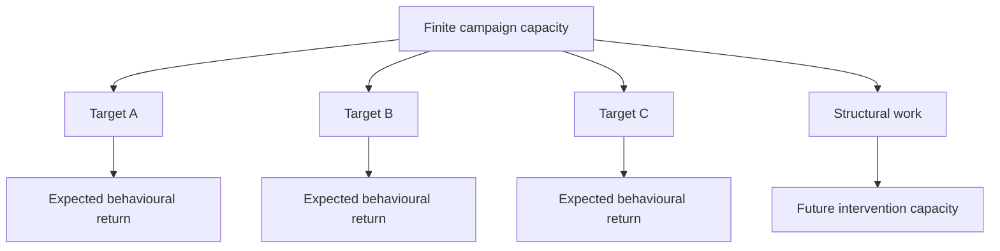

That does not require reducing political organising to an equation.

It means acknowledging that spending six months making one relationship politically legible may mean not spending those six months developing three alternative interventions.

---

## 💊 Teva: What Happens When Someone Builds The Exit Ramp

The medicine-focused boycott work around Teva is useful because clinicians and campaigners have already undertaken part of the difficult implementation work.

The relevant question is not simply:

> *Do we approve of Teva?*

It is:

> **Where can purchasing or prescribing move safely away from Teva without compromising patient care?**

That requires considerably more work.

Campaign materials have mapped particular medicines against alternative manufacturers or therapeutic alternatives.

The resulting structure is approximately:

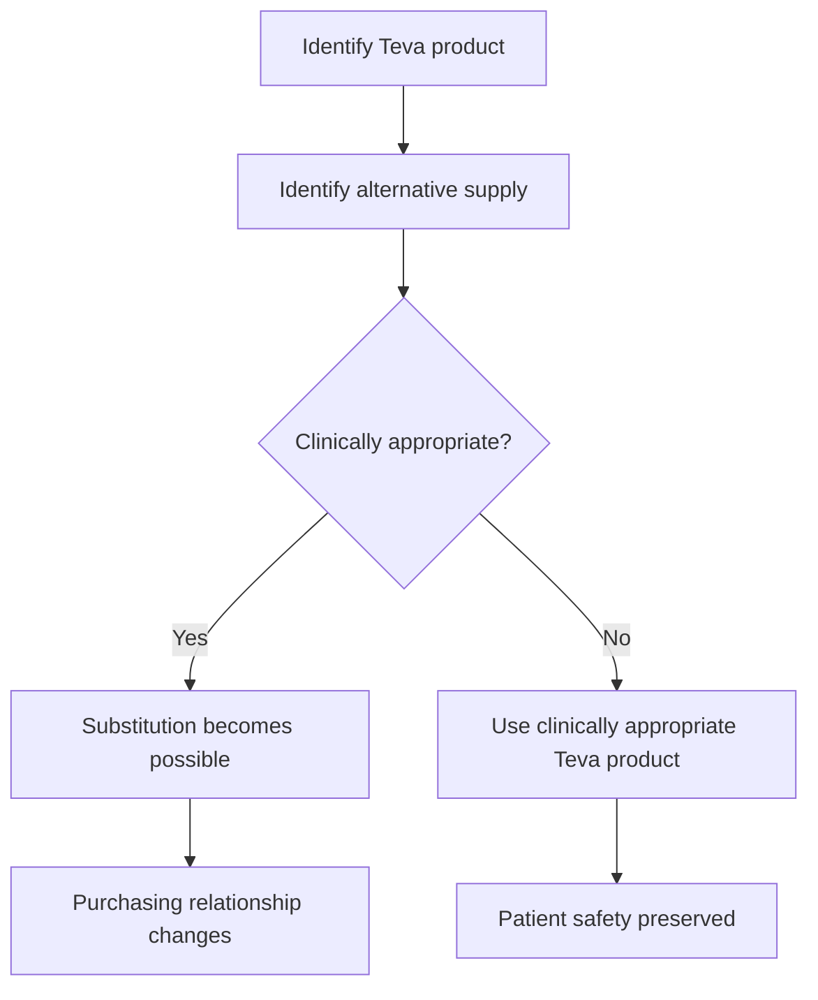

This is an important model because it preserves the hierarchy of objectives.

**The patient does not become collateral damage for the boycott.**

Where substitution is safe and practicable, purchasing can change.

Where it is not, clinical need wins.

That is a much more sophisticated form of intervention than simply producing a blacklist.

---

## 🩺 Professional Knowledge Changes The Feasible Set

A campaign becomes more powerful when people who understand the relevant system help design the intervention.

Clinicians know:

* which medicines are genuinely interchangeable;
* where generic alternatives exist;
* where formulation matters;
* where supply is fragile;
* where changing manufacturer is trivial;
* where changing treatment would be clinically inappropriate.

Procurement professionals know different things.

Pharmacists know different things.

Patients know different things.

Lawyers know different things.

Supply-chain specialists know different things.

The campaign's feasible options expand when those forms of knowledge are combined.


This is one reason professional organising matters.

It turns objection into infrastructure.

---

## 💾 Palantir: A Different Intervention Horizon

Palantir presents a different kind of problem.

The point here is **not**:

> *Palantir should therefore remain in the NHS.*

Nor:

> *There is nothing concerning about Palantir.*

Nor:

> *Always buy from Palantir.*

The point is that deeply integrated enterprise software creates a very different exit problem from a substitutable medicine purchase.

Once an organisation has invested in:

* implementation;
* integration;
* interfaces;
* data migration;
* staff training;
* workflow redesign;
* governance;
* technical support;
* interoperability;

the incumbent acquires structural advantages.

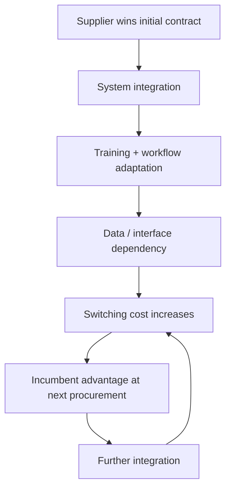

This is **path dependence**.

And path dependence matters for campaigning.

---

## 🪤 Lock-In Changes What "Leave" Means

A campaign against an embedded software supplier may require considerably more than persuading an institution to dislike the supplier.

The institution may need:

* a replacement vendor;
* an interoperable replacement;
* migration funding;
* migration time;
* retraining;
* contractual planning;
* technical capacity;
* governance arrangements;
* assurance that essential services will continue.

Without that work, the organisation can reach the next procurement round and discover that the incumbent is still the cheapest or least disruptive option precisely because so much has already been built around it.

That creates a nasty paradox:

> **the longer an exit is postponed, the more expensive exit may become.**

The appropriate response is not to abandon the campaign.

It is to start building the exit route **before the exit is required**.

---

## ⏱️ Different Targets Need Different Clocks

A useful BDS portfolio therefore contains multiple intervention horizons.

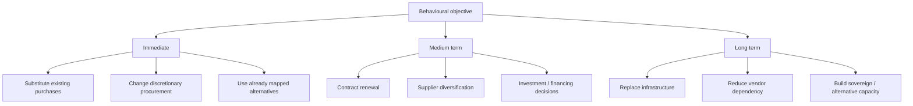

These categories should reinforce each other.

Immediate wins demonstrate that change is possible.

Medium-term campaigns exploit predictable decision points.

Long-term work prevents today's dependencies becoming tomorrow's excuse for inaction.

---

## 🚫 "Teva Now" Does Not Mean "Palantir Forever"

This false binary is worth killing explicitly.

```text
Teva may contain immediately substitutable procurement
≠
Palantir should remain indefinitely
```

And:

```text
Palantir may require long-term exit planning
≠
do nothing about Palantir now
```

The sensible position can be:

> **Take safe, actionable substitutions now while simultaneously building the contractual, technical and institutional capacity required for harder exits later.**

That is not inconsistency.

It is sequencing.

---

## 📰 Salience Is Not Strategy

Palantir has several characteristics that make it unusually easy to turn into a public symbol.

It is:

* enormous;
* technologically consequential;
* associated publicly with intelligence and defence;
* politically controversial;
* involved in major public-sector infrastructure;
* attached to recognisable personalities;
* unusually legible as a corporate antagonist.

That makes it an excellent **conversation object**.

It does not automatically make it the intervention with the greatest marginal return.

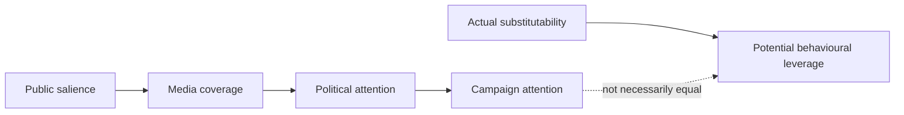

This distinction is important.

**Attention is a resource. It is not an outcome.**

---

## 🕸️ When A Company Becomes An Attention Sink

A sufficiently salient company can become an **absorptive target**.

Criticism from different political directions converges on it.

Campaigners discuss it.

Journalists investigate it.

Politicians criticise it.

Institutions review it.

The company can become the place where multiple anxieties about an entire system are deposited.

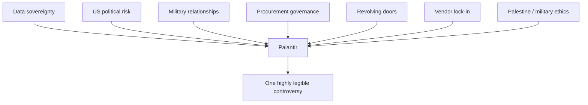

That can be useful.

It can make difficult structural questions discussable.

It can also distort the map.

---

## 🌀 The Selective-Sacrifice Risk

Suppose the campaign eventually succeeds.

Palantir leaves.

That could be a meaningful outcome.

But then ask:

* Who replaces it?
* What happens to the data architecture?
* What happens to procurement governance?
* What happens to US dependency?
* What happens to information-sharing arrangements?
* What happens to the revolving-door problem?
* What happens to the underlying military or foreign-policy relationships?
* What happens to the conduct that originally motivated the campaign?

If most answers are:

> *substantially the same thing, through someone else*

then the campaign has removed a supplier without necessarily correcting the system.


This is where target strategy intersects with **selective sacrifice**.

The sacrifice can be real.

The correction can still be shallow.

---

## 🧿 "CIA-Linked" Is A Conversation Starter, Not An Argument

The intelligence and defence relationships around major technology companies deserve scrutiny.

But simply saying:

> *CIA-linked*

does not complete the analysis.

Britain already participates in deep intelligence relationships with the United States, including through longstanding UK–US intelligence cooperation.

So the useful questions are more specific:

* What information is accessible?
* Under whose jurisdiction?
* Under what contractual terms?
* What is technically compartmented?
* What is legally compartmented?
* What dependencies have been created?
* What happens if political relations deteriorate?
* What sovereign capability has been lost?
* What is the exit mechanism?
* What does the supplier itself control?
* What does the state control?
* Which risks arise from the particular arrangement rather than simply from association with American intelligence?

Those are serious questions.

They are considerably more useful than spooky adjectives.

---

## 🇬🇧 The Better Palantir Conversation Is Bigger Than Palantir

The controversy provides an opportunity to ask something Britain should probably ask periodically anyway:

> **Are our information-sharing and data-dependency arrangements still appropriate for the world we are entering?**

That includes relationships with:

* the United States;
* European partners;
* defence alliances;
* commercial technology suppliers;
* cloud providers;
* intelligence partners;
* international research infrastructure.

The question is not necessarily whether Britain should withdraw from these relationships.

It is whether the current balance between:

**sharing, interoperability, sovereignty, resilience and compartmentation**

still makes sense.

That is a legitimate strategic conversation regardless of anyone's position on BDS.

---

## 🧬 Campaigns Can Produce Useful Questions Without Being The Final Answer

This matters because campaign value is not binary.

A campaign may fail to achieve its primary objective while still:

* exposing procurement practices;
* revealing dependencies;
* generating public expertise;
* changing institutional language;
* producing alternative suppliers;
* making future intervention easier;
* forcing governance questions into mainstream discussion.

Palantir scrutiny has helped make questions about:

* revolving doors;
* public-sector technology;
* data sovereignty;
* procurement;
* defence-tech relationships;
* vendor dependency

more publicly legible.

That is useful.

It still does not answer:

> **Why this company, at this intensity, relative to other available interventions?**

Both propositions can be true.

---

## 📉 Marginal Campaign Return

A useful concept here is **marginal campaign return**.

Suppose another hundred hours of organising could be spent on:

**A.** a famous infrastructure supplier whose exit requires several years;

or

**B.** a procurement category where alternatives already exist and purchasing decisions can change next month.

There is no universal answer.

But there should at least be a question.

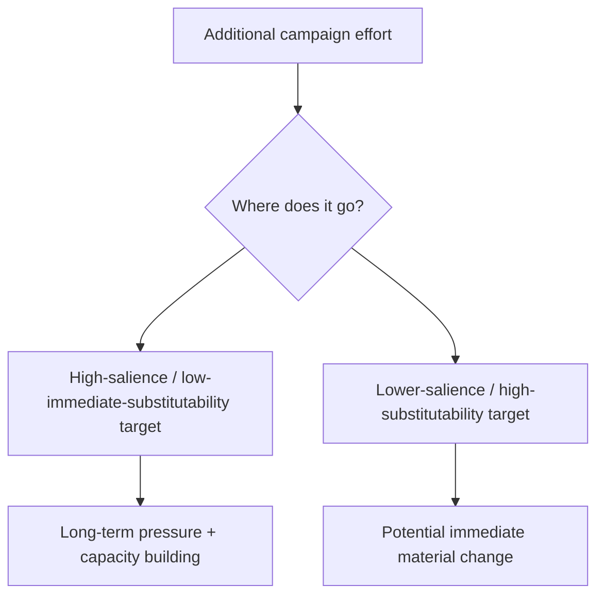

Campaign movements need both.

What they should avoid is allocating effort solely according to which target generates the strongest emotional or media response.

---

## 🧠 The Symbol Is Not The System

This is where campaign design becomes vulnerable to **means–ends inversion**.

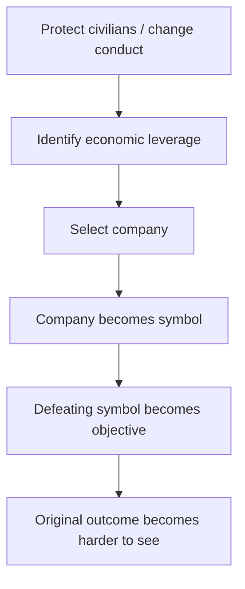

Symbols are useful.

Humans organise around legible things.

“Change the international political economy sustaining this conduct” is not a particularly convenient placard.

A company name is.

The problem begins when the simplification required for mobilisation becomes the analytical model used for strategy.

---

## 🧰 Build Exit Ramps Before Demanding Exit

One of the most constructive things a campaign can do is build the conditions that make compliance easier.

That can include:

* alternative supplier databases;
* procurement guidance;
* contract mapping;
* model ethical-procurement clauses;
* clinical substitution guidance;
* interoperability requirements;
* open standards;
* migration plans;
* financing alternatives;
* legal analysis;
* shareholder resolutions;
* professional guidance;
* public-sector replacement capacity.


This changes the campaign from:

> *Why haven't you left?*

toward:

> **Here is how leaving becomes possible.**

Both pressure and infrastructure matter.

---

## 🏢 Give Institutions A Usable Reason To Change

Organisations contain people who may privately agree with a campaign while lacking institutional authority to act on moral preference alone.

Pressure can change the internal decision environment.

A procurement team may be able to say:

* reputational exposure has increased;
* supply risk has increased;
* insurance has become more difficult;
* customer confidence is affected;
* staff retention is affected;
* investors are concerned;
* contractual risk has changed;
* alternative suppliers now exist.

That converts an external ethical objection into an **institutionally legible cost**.

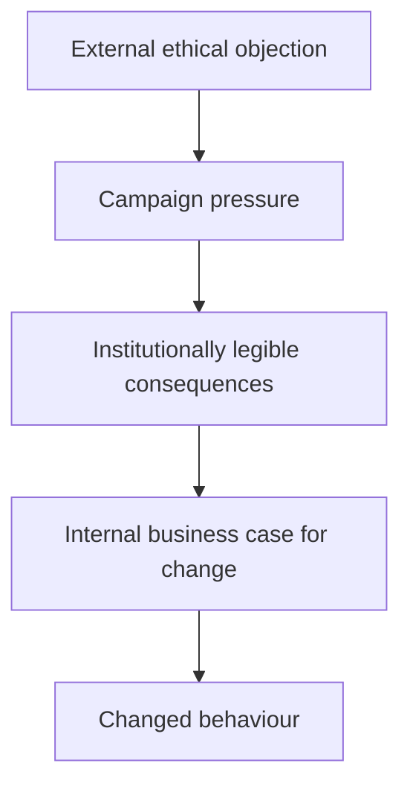

That is not an accidental side effect.

It is often the mechanism.

---

## 💥 Direct Action And Leverage

Some direct-action tactics also make more sense when viewed through this lens.

A superficial physical intervention can create disproportionately large institutional consequences.

For example:


This does not settle whether a particular intervention is lawful, proportionate or violent.

Those questions require their own analysis.

The narrower point is that the intended target of an intervention may be **the institution's cost calculation**, rather than the physical object itself.

Campaign strategy should be analysed at the level where its intended leverage operates.

---

## 🩸 Do Not Make Other People Pay For Your Leverage

Behavioural intervention needs safeguards.

A campaign that externalises its own costs onto vulnerable people can reproduce exactly the problem it claims to oppose.

In healthcare, this means patient safety.

Elsewhere it can mean:

* workers;
* civilians;
* disabled people;
* low-income consumers;
* small suppliers;
* communities dependent on essential infrastructure.

The appropriate question is not simply:

> *Can we create pain?*

It is:

> **Can we make the relevant decision-maker experience the cost of continuing without simply transferring that cost onto someone with less power?**

That is much harder.

It is also much better campaign design.

---

## 📊 Measure Outcomes, Not Heat

A campaign dashboard should not stop at:

```text
mentions
headlines
protests
viral posts
political statements
```

Those are intermediate signals.

The harder measures are:

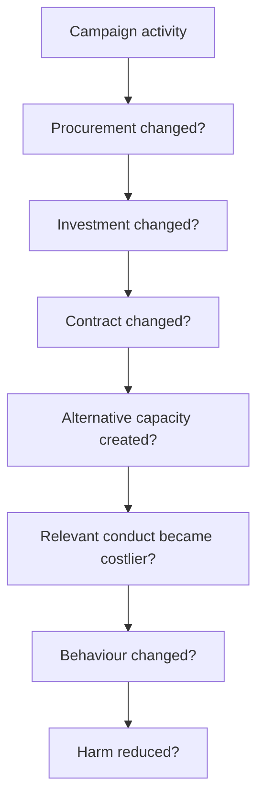

Not every campaign can demonstrate the entire causal chain.

But remembering the chain prevents attention from becoming a substitute for effectiveness.

---

## 🧮 A Simple Target Matrix

A useful campaign assessment can therefore ask:

| Dimension            | Question                                                |
| -------------------- | ------------------------------------------------------- |
| **Relationship**     | How closely is the target connected to the conduct?     |
| **Substitutability** | Is there a viable alternative?                          |
| **Switching cost**   | What does exit actually require?                        |
| **Time horizon**     | When could change realistically occur?                  |
| **Leverage**         | What behaviour could the intervention alter?            |
| **Collateral risk**  | Who else bears the cost?                                |
| **Readiness**        | Has an exit route already been built?                   |
| **Lock-in risk**     | Does delay make future exit harder?                     |
| **Measurability**    | What observable change would count as success?          |
| **Off-ramp**         | What changed behaviour would justify reducing pressure? |

This does not decide political priorities automatically.

It makes the reasoning inspectable.

---

## 🌱 A Portfolio, Not A Purity Test

The strongest version of BDS does not need every participant to pursue the same company at the same moment.

It can contain:

### Immediate substitution

Act where alternatives already exist.

### Procurement intervention

Prepare for identifiable purchasing and renewal windows.

### Divestment

Change financing and ownership relationships where leverage exists.

### Infrastructure strategy

Build the capacity required to exit deeply embedded suppliers.

### Regulation

Change the rules governing what institutions are permitted or required to consider.

### Professional organising

Use domain expertise to identify interventions that outsiders would miss.

### Public education

Make less visible economic relationships legible enough to organise around.

These are complementary.

---

## 🪫 Do Not Burn Every Campaign To Feed One

A movement can accidentally consume its own intervention capacity.

If one target monopolises:

* press attention;
* political argument;
* research;
* legal support;
* activist labour;
* professional expertise;

then other campaigns may become harder to sustain.

That matters even if the dominant campaign is completely justified.

The question is not:

> *Does this target deserve attention?*

It is:

> **How much of the available attention should this target absorb relative to the other routes to the same objective?**

A strategy that cannot answer that question risks allowing salience to allocate its resources for it.

---

## ♻️ Keep Returning To The Feedback Loop

The campaign began because an outcome was considered intolerable.

So keep the outcome in view.

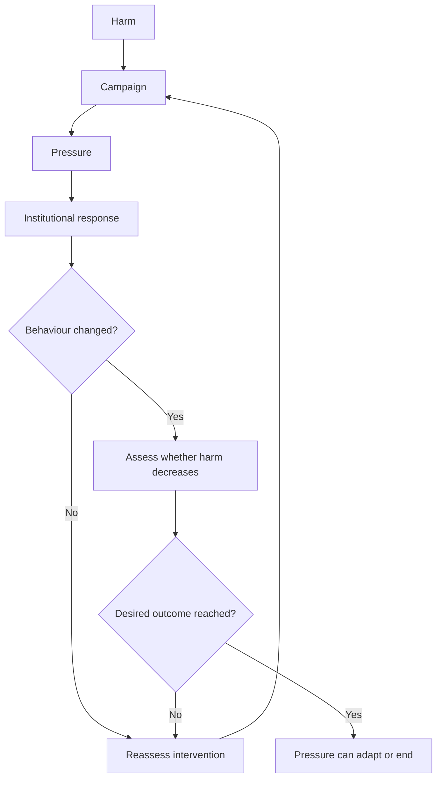

That is what makes the campaign a feedback mechanism rather than an identity.

Failure is information.

Success is information.

Changed conditions are information.

The intervention should be capable of adapting to all three.

---

## 🎯 The Strategic Principle

BDS does not become more serious by identifying the maximum possible number of companies to condemn.

It becomes more serious when it gets better at connecting:

**conduct → relationship → leverage → intervention → behavioural change.**

The target should remain subordinate to the outcome.

The famous company is not automatically the best company.

The hardest company is not automatically the most important company.

The easiest company is not automatically the most important company either.

Different relationships operate on different clocks.

So organise on different clocks.

**Take the available substitution now.
Prepare for the procurement window next year.
Build the infrastructure required for the exit five years from now.**

And keep asking why.

Because the objective was never supposed to be winning the boycott.

It was supposed to be making the boycott unnecessary.

---

## 🌌 Constellations

💸 🎯 ♻️ 🩺 🪤 — behavioural incentives; campaign portfolios; procurement; substitutability; lock-in; strategic divestment.

## ✨ Stardust

palestine, bds, behavioural change, campaign strategy, procurement, substitutability, switching costs, vendor lock-in, divestment, negative feedback

---

## 🏮 Footer

*💸 Incentivising Behavioural Change and BDS* is a living node of the **Polaris Protocol**.
It develops an applied framework for choosing, sequencing and evaluating economic-pressure interventions according to their capacity to alter behaviour, while distinguishing immediate substitution from the longer work required to unwind embedded institutional dependencies.

> 📡 Cross-references:
>
> * [🎯 What Was BDS Supposed To Do?](./🎯_what_was_bds_supposed_to_do.md) — *the originating behavioural logic of boycott, divestment and sanctions and its subsequent narrative transformation*
> * [🌀 Absorption and Selective Sacrifice](../../../../../🌑_1_Origin_Points/🪿_Embodied_Information_Ecology/♻️_Cybernetics/🌀_absorption_and_selective_sacrifice.md) — *how corrective pressure can concentrate on an absorptive target without propagating through the wider system*
> * [💸 Making Harm Too Expensive To Continue](../../../../../🌕_5_Long_Strategies/💸_Business_Is_Tooling/💸_making_harm_too_expensive_to_continue.md) — *generalising behavioural deincentivisation beyond the Palestine case*
>
> 🏮 Return To:
>
> * [🌍 Global Powers](./) — *1up*
> * [🇵🇸 Palestine Factchecking](../..) — *3up*
> * [🌌 Polaris Protocol - Root](../../../../../README.md) — *root*

*Survivor authorship is sovereign. Containment is never neutral.*

*Last updated: 2026-08-23*
