# 💸 Incentivising Behavioural Change and BDS
**First created:** 2026-08-23 | **Last updated:** 2026-08-23  
*If boycott and divestment are supposed to change behaviour, target selection has to be organised around leverage, substitutability, timing, safeguards and outcomes — not simply which company currently carries the most political heat.*

---

## 🛰️ Orientation

If the purpose of BDS is behavioural change, campaign strategy cannot stop at identifying objectionable relationships.

It has to ask:

> **Where can pressure actually change something?**

A company can be an entirely legitimate target while being a poor **immediate** leverage point.

Another relationship can receive little press while being comparatively easy to change.

A serious strategy therefore needs an **intervention portfolio**.

---

## 🎯 Start With Behaviour, Not Company

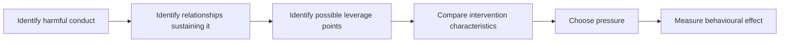

Not:


The company is the leverage point.

Not the purpose.

---

## 🧭 Target Assessment

Evaluate:

### Relationship
How closely is the relationship connected to the conduct?

### Leverage
What decision can pressure plausibly alter?

### Substitutability
Is another product, supplier or system available?

### Switching Cost
What does exit actually require?

### Time Horizon
Can change occur now, next year, or only after years of preparation?

### Collateral Effects
Who else bears the cost?

### Organising Readiness
Has someone already built the exit route?

### Lock-In Risk
Does delay make later exit more expensive?

### Measurability
What observable change counts as success?

### Off-Ramp
What changed behaviour permits pressure to decrease?

---

## 🧮 Campaign Capacity Is Finite

Campaigns allocate scarce:

- attention;
- clinician time;
- legal expertise;
- procurement expertise;
- investigative labour;
- media bandwidth;
- political capital;
- money;
- volunteer capacity.

Choosing one target therefore carries an opportunity cost.

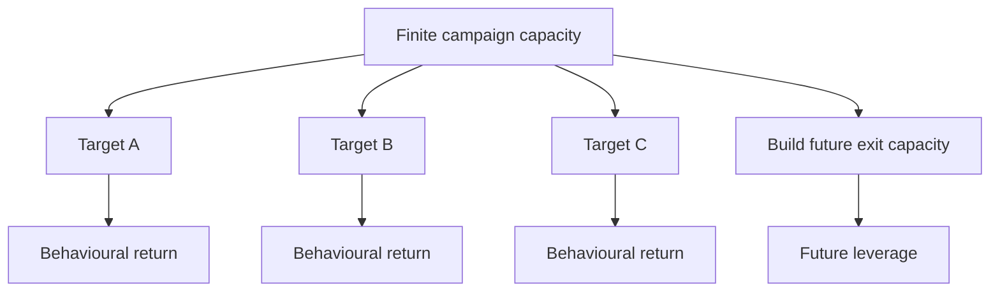

---

## 💊 Teva: An Exit Ramp Partly Built Already

The significance of the clinician-developed alternatives work is not merely that substitutes exist.

It is that part of the campaign infrastructure has already been built.

People have already done work to:

- identify Teva products;
- identify alternative manufacturers;
- identify therapeutically plausible alternatives;
- preserve clinical exceptions;
- distinguish where substitution is easy from where it is inappropriate.

That lowers the marginal effort required to create real procurement change.

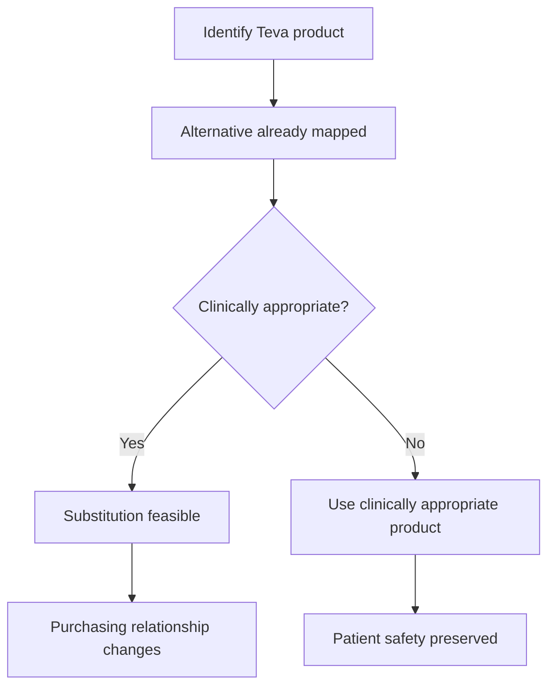

The patient remains more important than the boycott.

That is good campaign design.

---

## 🩺 Professional Knowledge Expands The Feasible Set

Clinicians, pharmacists, procurement professionals, lawyers, patients and supply-chain specialists each see different constraints.


The campaign gets stronger when objection becomes infrastructure.

---

## 💾 Palantir: A Different Clock

Embedded enterprise software involves:

- integration;
- interfaces;
- migration;
- staff training;
- workflow redesign;
- support;
- governance;
- interoperability;
- sunk cost.

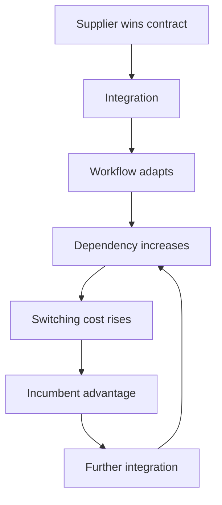

This is path dependence.

It does **not** mean:

> *leave Palantir in the NHS forever.*

It means:

> **if you want a credible exit, build the exit before the next procurement forces the decision.**

---

## 🪤 Lock-In Changes The Campaign

A software exit may require:

- a replacement supplier;
- migration funding;
- interoperable systems;
- technical capacity;
- contract planning;
- retraining;
- public-sector capability;
- data-governance redesign.

Without this, an institution can arrive at the next procurement and conclude that the incumbent is still cheapest precisely because the institution has already spent years becoming dependent on it.

The longer exit is postponed, the more expensive exit may become.

---

## ⏱️ Different Targets Need Different Clocks

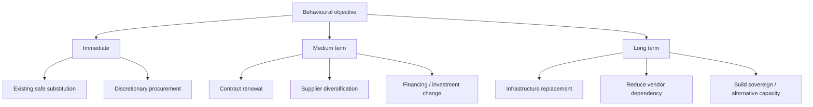

The rational strategy is:

**take available substitutions now; organise around predictable contract points; build hard exits before they are needed.**

---

## 🚫 Teva Now Does Not Mean Palantir Forever

```text
Teva may contain immediately substitutable procurement
≠
Palantir should remain indefinitely
```

And:

```text
Palantir may need long-term exit preparation
≠
Palantir should receive no pressure now
```

This is sequencing, not ideological inconsistency.

---

## 📰 Salience Is Not Strategy

Palantir is unusually easy to turn into a public symbol.

It is:

- enormous;
- politically controversial;
- connected publicly with defence and intelligence;
- deeply embedded in public-sector discussion;
- associated with recognisable personalities;
- easy to narrate.

That makes it an excellent **conversation object**.

It does not automatically make it the highest-return immediate campaign target.

---

## 🧽 Palantir As An Institutionally Absorptive Target

There is another dimension beyond simple salience.

A large technology supplier deeply integrated into government, defence, military or intelligence-adjacent systems may be able to sustain enormous reputational criticism because its **institutional utility protects the relationship**.

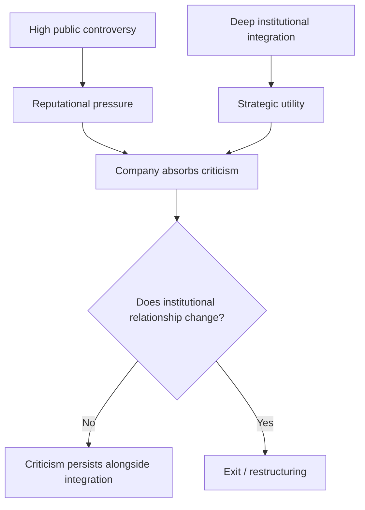

That gives the target a peculiar robustness.

Criticism can become extremely loud while the institutional relationship remains extremely durable.

---

## 🕸️ The Attention-Sink Problem

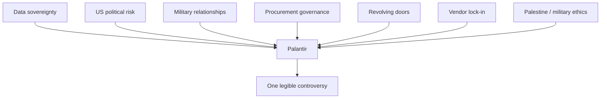

This is useful because the company opens conversations that otherwise remain abstract.

It is risky because **one company can begin standing in for several different systems problems**.

---

## 🌀 Selective-Sacrifice Risk

Suppose Palantir leaves.

Then ask:

- Who replaces it?
- Does the data architecture change?
- Does procurement governance change?
- Does US dependency change?
- Do information-sharing assumptions change?
- Does revolving-door governance change?
- Does the underlying conduct motivating the campaign change?

If the answer is:

> *same system, different supplier*

then removing the supplier may be worthwhile without being sufficient.

---

## 🧿 Intelligence Associations Need Specific Analysis

“CIA-linked” can open a conversation.

It does not finish one.

Britain already maintains extensive intelligence and defence relationships with the United States.

So ask:

- What information can the supplier access?
- Under whose jurisdiction?
- What remains sovereign?
- What is compartmented?
- What happens under political deterioration?
- How portable is the data?
- What capability has Britain outsourced?
- What is the exit mechanism?
- What specific risk follows from this arrangement?

Those are stronger questions than association alone.

---

## 🇬🇧 The Bigger Data-Sovereignty Question

The useful conversation is:

> **Are Britain's information-sharing and technology dependencies still optimally structured for the geopolitical environment we are entering?**

That can include:

- the US;
- European partners;
- defence alliances;
- cloud providers;
- intelligence partners;
- commercial software;
- research infrastructure.

The relevant balance is among:

**sharing, interoperability, sovereignty, resilience and compartmentation.**

This remains a worthwhile conversation even if Palantir eventually disappears from it.

---

## 📉 Marginal Campaign Return

Ask what the **next unit of organising effort** can accomplish.

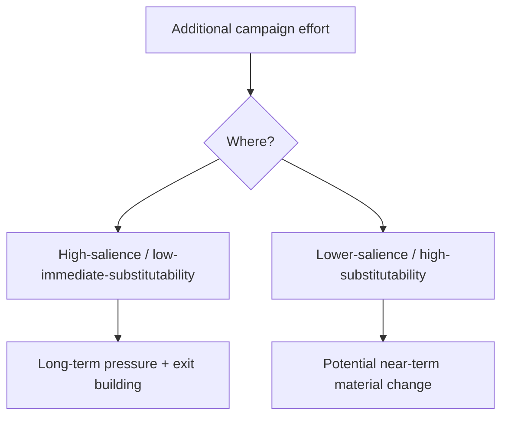

Both may be necessary.

The error is allowing attention alone to allocate strategy.

---

## 🧰 Build Exit Ramps

Campaign infrastructure can include:

- alternative supplier databases;
- clinical substitution guides;
- contract mapping;
- ethical procurement clauses;
- migration plans;
- interoperability standards;
- financing alternatives;
- legal analysis;
- public replacement capacity;
- professional guidance.


Pressure and replacement capacity work better together.

---

## 🏢 Give Institutions A Usable Reason To Move

External concern can become internally actionable through:

- reputational cost;
- customer pressure;
- staff pressure;
- financing;
- insurance;
- legal exposure;
- alternative supply;
- contractual risk.

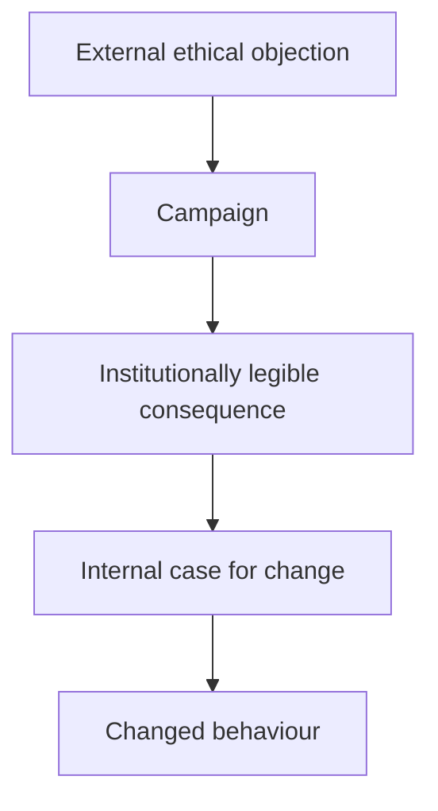

That translation is often the real mechanism.

---

## 💥 Direct Action And Leverage

A limited physical intervention may create a larger economic consequence through:

- remediation;
- inspection;
- shutdown;
- contractual interruption;
- insurance;
- publicity.

That does not settle the separate questions of legality, violence, intimidation or proportionality.

Those need their own taxonomy.

The campaign analysis should simply identify **where the intended leverage operates**.

---

## 🩸 Do Not Externalise Campaign Costs Downward

Pressure should reach decision-makers rather than merely harming people with less power.

Ask about:

- patients;
- workers;
- civilians;
- disabled people;
- low-income consumers;
- service users;
- small suppliers.

A campaign reproduces the problem it opposes if it simply externalises its own costs onto the vulnerable.

---

## ⚠️ Failure Modes

### Symbol Capture
The target becomes more important than the outcome.

### Salience Allocation
Press interest determines strategy.

### No Off-Ramp
The campaign cannot define changed behaviour that would reduce pressure.

### Non-Substitutability
The target cannot realistically be exited without unacceptable consequences.

### Lock-In Delay
Years of campaigning occur without building replacement capacity.

### Collateralisation
Patients, workers or civilians absorb the cost.

### Impossible Compliance
There is no practical route for the institution to satisfy the demand.

### Absorptive Targeting
A highly robust actor consumes enormous criticism while the surrounding system changes very little.

### Selective Sacrifice
Removing one company becomes sufficient proof that the problem has been addressed.

### Heat Without Transmission
Publicity increases; relevant decision incentives do not.

---

## 📊 Measure Outcomes, Not Heat

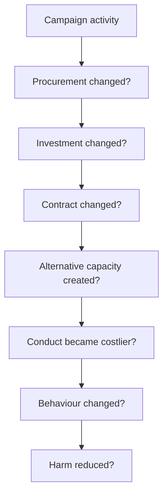

Headlines are signals.

They are not the end of the causal chain.

---

## 🧮 Target Matrix

| Dimension | Question |
|---|---|
| Relationship | How closely is the target connected to the conduct? |
| Substitutability | Is there a viable alternative? |
| Switching cost | What does exit actually require? |
| Time horizon | When could change realistically occur? |
| Leverage | What behaviour could change? |
| Collateral risk | Who else bears the cost? |
| Readiness | Has the exit route already been built? |
| Lock-in risk | Does delay make future exit harder? |
| Absorptive capacity | Can the target simply withstand the criticism? |
| Measurability | What observable result counts as success? |
| Off-ramp | What change permits pressure to adapt or end? |

---

## 🌱 A Portfolio, Not A Purity Test

A mature strategy can combine:

- immediate substitution;
- procurement intervention;
- divestment;
- infrastructure exit;
- regulation;
- professional organising;
- public education;
- replacement-capacity building.

The campaign does not need one company to carry the entire political meaning of the problem.

---

## 🪫 Do Not Burn Every Campaign To Feed One

The question is not:

> *Does this target deserve attention?*

It is:

> **How much of the available attention should this target absorb relative to other routes to the same objective?**

A movement that cannot answer that risks allowing salience to set strategy by default.

---

## ♻️ Keep Returning To The Outcome

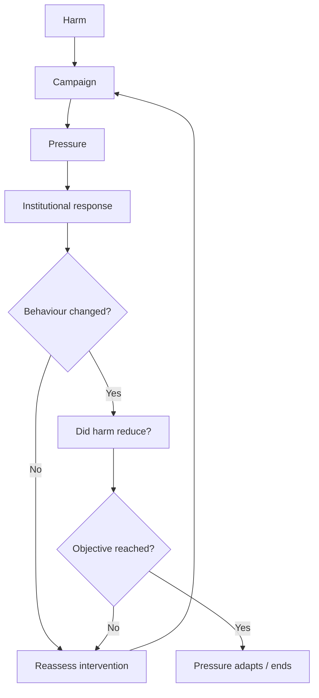

The campaign should remain capable of learning.

---

## 🌌 Constellations

💸 🎯 ♻️ 🪤 🧽 — campaign portfolios; substitutability; lock-in; absorptive targets; behavioural leverage.

## ✨ Stardust

palestine, bds, behavioural change, campaign strategy, procurement, substitutability, switching costs, vendor lock-in, absorptive targets, divestment

---

## 🏮 Footer

*💸 Incentivising Behavioural Change and BDS* is a living node of the **Polaris Protocol**.  
It develops an applied framework for choosing, sequencing and evaluating economic-pressure interventions according to their ability to alter behaviour, while distinguishing immediately executable substitutions from the longer work required to unwind embedded and criticism-resistant institutional dependencies.

> 📡 Cross-references:
>
> - [🎯 What Was BDS Supposed To Do?](./🎯_what_was_bds_supposed_to_do.md) — *the originating behavioural logic of boycott, divestment and sanctions*
> - [🌀 Absorption and Selective Sacrifice](../../../../../🌑_1_Origin_Points/🪿_Embodied_Information_Ecology/♻️_Cybernetics/🌀_absorption_and_selective_sacrifice.md) — *absorptive targets, bounded accountability and selective sacrifice*
> - [💸 Making Harm Too Expensive To Continue](../../../../../🌕_5_Long_Strategies/💸_Business_Is_Tooling/💸_making_harm_too_expensive_to_continue.md) — *general long-term design of economic negative feedback*
>
> 🏮 Return To:
>
> - [🌍 Global Powers](./README.md) — *1up*
> - [🇵🇸 Palestine Factchecking](../README.md) — *3up*
> - [📲 Press Matters](../../README.md) — *3up*
> - [🌗 In The Moment](../../../README.md) — *3up*
> - [🌌 Polaris Protocol - Root](../../../../README.md) — *root*

*Survivor authorship is sovereign. Containment is never neutral.*

_Last updated: 2026-08-23_
