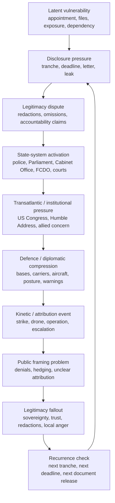
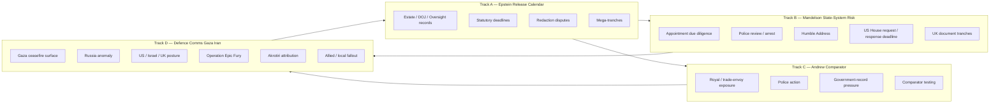
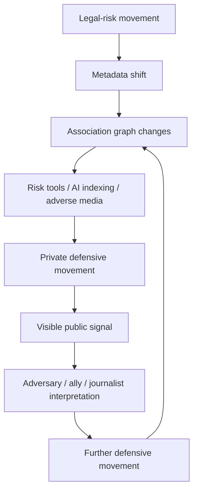
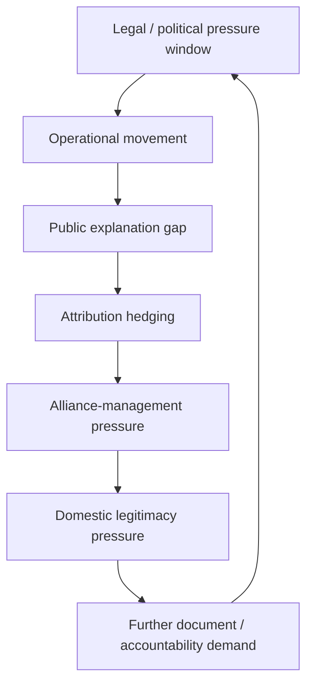
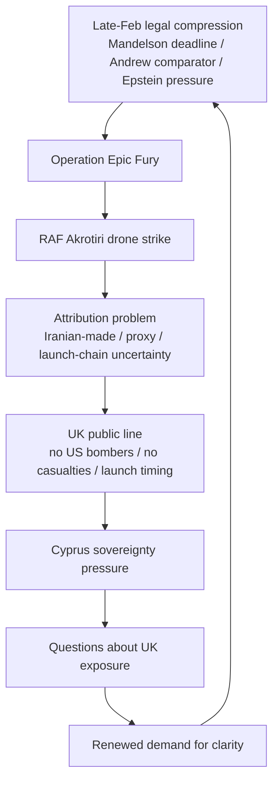
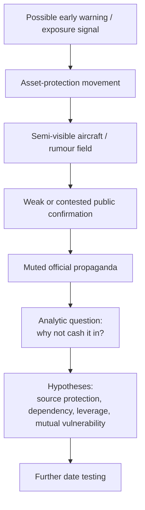
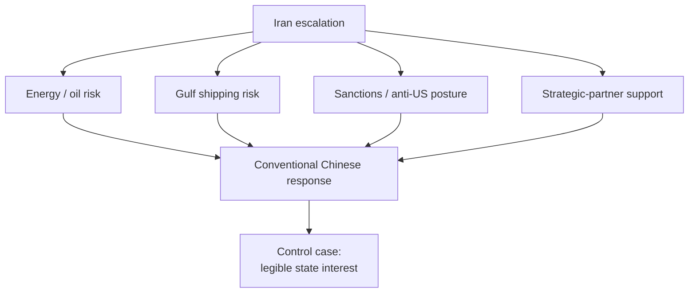

# 🔁 Pressure Cycle Mermaid Analysis  
**First created:** 2026-06-22 | **Last updated:** 2026-06-22  
*A visual analysis node showing how legal exposure, disclosure pressure, state activation, defence compression, attribution lag, and legitimacy fallout cycle through the `✈️_World_War_Epstein` cluster.*

---

## 🛰️ Orientation  

This node visualises the pressure cycle identified in the quick-reference Track A / B / C / D CSV.

The purpose is not to prove causation.

The purpose is to make the repeated sequence visible.

Across the cluster, the pattern repeatedly moves through:

1. latent vulnerability;
2. disclosure or legal pressure;
3. legitimacy dispute;
4. state-system activation;
5. transatlantic or parliamentary pressure;
6. defence / diplomatic compression;
7. kinetic or attribution event;
8. public framing;
9. local or institutional fallout;
10. recurrence check.

This is the working cycle behind the cluster.

Not a verdict.

A rhythm.

---

## 🧿 Core Claim  

The important pattern is not a single straight line.

It is a cycle.

Legal exposure creates pressure.  
Pressure activates institutions.  
Institutional activation creates visible movement.  
Movement becomes a signal.  
Signals are read by allies, adversaries, journalists, markets, and political offices.  
That reading creates defence and comms pressure.  
Defence and comms pressure produces public explanation problems.  
Explanation problems create legitimacy fallout.  
Legitimacy fallout feeds the next disclosure or accountability demand.

That cycle can repeat without a central conductor.

---

## 🔁 Core Cycle  

This is the cycle the CSV begins to expose.

The value of the diagram is that it makes the pattern legible without forcing every date into a causal chain.

---

## 🗂️ Track Overlay  

The useful point is the feedback loop.

Track D does not sit outside the legal calendar.

It feeds back into the demand for explanation.

That explanation then reactivates Track A, B, and C.

---

## 🧬 Pressure Phases  

| Phase | Meaning | Typical evidence |
|---|---|---|
| `latent_anchor` | A vulnerability exists before crisis becomes public. | Appointment records, old files, prior due diligence, existing relationships. |
| `disclosure_pulse` | New material or a deadline enters the system. | File tranche, DOJ letter, oversight release, document demand. |
| `legitimacy_dispute` | The release is challenged as incomplete, redacted, or managed. | Press criticism, parliamentary questions, redaction arguments. |
| `state_activation` | Formal systems begin moving. | Police review, arrest, Parliament, FCDO, Cabinet Office, court process. |
| `transatlantic_pressure` | The issue crosses borders or institutions. | US congressional request, UK-US diplomatic concern, allied pressure. |
| `defence_compression` | Military or diplomatic posture tightens. | Carriers, aircraft, base posture, warnings, regional movement. |
| `kinetic_event` | A strike, attack, operation, or direct incident occurs. | Operation, drone strike, base attack, escalation event. |
| `attribution_comms` | Public language struggles to catch up with operational reality. | Iranian-made vs Iranian-launched, proxy language, denials, hedging. |
| `legitimacy_fallout` | The public, Parliament, local states, or allies demand explanation. | Cyprus anger, redaction concern, sovereignty pressure, trust collapse. |
| `recurrence_check` | The next tranche or deadline tests whether the cycle repeats. | Later document releases, renewed reporting, further hearings. |

---

## 🧮 Association Leakage Layer  

This is the data cascade layer underneath the visible calendar.

A file release does not only create a public document.

It creates metadata.

Metadata changes associations.

Associations alter risk perception.

Risk perception moves people.

The movement becomes the next signal.

---

## 🛰️ Defence-Comms Compression  

This is why Track D matters.

Military posture may move faster than public explanation.

When that happens near legal-risk windows, the public may read the delay as concealment.

Sometimes that suspicion may be wrong.

Sometimes it may be right.

Either way, the comms gap becomes operationally relevant.

---

## 🇬🇧 Akrotiri As Cycle Example  

Akrotiri is useful because it shows the whole cycle in miniature.

A military event becomes an attribution problem.  
An attribution problem becomes a public line problem.  
A public line problem becomes a sovereignty problem.  
A sovereignty problem becomes a legitimacy problem.  
A legitimacy problem feeds the wider pressure calendar.

---

## 🇷🇺 Russia As Restraint Signal  

Russia matters because restraint can be signal.

The unanswered question is not only what Russia did.

It is what Russia chose not to do.

---

## 🇨🇳 China As Baseline  

China helps calibrate the analysis.

Not every rival-state movement is strange.

Some movement is exactly what one would expect.

That makes Russia’s difference easier to see.

---

## 🧯 What This Diagram Does Not Claim  

This node does not claim that:

- the cycle proves causation;
- every date belongs in the same chain;
- legal pressure caused kinetic events;
- all actors coordinated;
- all attribution lag indicates wrongdoing;
- Russia definitely had foreknowledge;
- China is harmless;
- Akrotiri proves UK offensive participation;
- metadata is evidence by itself.

The diagram shows structure.

It does not deliver a verdict.

---

## 🛠️ How To Use This Node  

Use this node with the CSV.

For each date, assign a likely `cycle_phase`.

Then ask:

| Question | Purpose |
|---|---|
| Does the event start a new cycle or continue an existing one? | Finds recurrence. |
| Does it sit in legal, political, defence, comms, or legitimacy space? | Classifies the pressure. |
| Does it create new public data? | Tests data cascade. |
| Does it create defensive movement? | Tests association leakage. |
| Does public explanation lag behind movement? | Tests comms brittleness. |
| Does the event feed the next accountability demand? | Tests cycle continuation. |

The point is not to force the model.

The point is to see where the model fails.

A useful diagram should expose both pattern and noise.

---

## 🧩 Working Formulation  

The `✈️_World_War_Epstein` pattern is best understood as a pressure cycle, not a straight-line accusation.

Legal exposure produces disclosure pressure.  
Disclosure pressure produces legitimacy disputes.  
Legitimacy disputes activate state systems.  
State activation produces visible movement.  
Visible movement is read by allies, adversaries, journalists, and political offices.  
That reading compresses defence and comms.  
Defence and comms produce attribution problems.  
Attribution problems produce legitimacy fallout.  
Legitimacy fallout produces the next demand for disclosure.

That cycle can repeat.

And when it repeats across Track A, Track B, Track C, and Track D, it becomes worth modelling.

Not as proof.

As brittleness.

---

## 🌌 Constellations  

🔁 🧮 🧬 🛰️ 🧯 🛡️ — pressure cycles, metadata cascades, shared-risk calendars, defence comms, press checks, and planning models.

---

## ✨ Stardust  

pressure cycle, mermaid, Track A, Track B, Track C, Track D, legal calendar, attribution lag, association leakage, metadata cascade, defence compression, legitimacy fallout

---

## 🏮 Footer  

*Pressure Cycle Mermaid Analysis* is a living node of the **Polaris Protocol**.  
It turns the Track A / B / C / D quick-reference CSV into a visual cycle model for analysis, reporting, and defence planning.

It does not claim causation.

It maps recurrence.

> 📡 Cross-references:
>
> - [🗓️ Track A Epstein Release Calendar](./🗓️_track_a_epstein_release_calendar.md) — *broad Epstein disclosure and oversight pressure*  
> - [📲 Track B Mandelson State System Risk](./📲_track_b_mandelson_state_system_risk.md) — *Mandelson-specific state-system exposure*  
> - [👑 Track C Andrew Comparator](./👑_track_c_andrew_comparator.md) — *Andrew as comparator track*  
> - [🛰️ Track D Defence Comms Gaza Iran](./🛰️_track_d_defence_comms_gaza_iran.md) — *defence and comms anomaly calendar*  
> - [🧮 Association Leakage And Metadata Escalation](./🧮_association_leakage_and_metadata_escalation.md) — *technical mechanism for weak-signal movement*  
> - [🧬 Shared Risk Calendar And Chain Dependency](./🧬_shared_risk_calendar_and_chain_dependency.md) — *legal calendars as strategic pressure points*  
> - [🧯 What Journalists Should Check Next](./🧯_what_journalists_should_check_next.md) — *press-facing verification checklist*  
> - [🛡️ What Defence Planners Should Model](./🛡️_what_defence_planners_should_model.md) — *planning model for brittleness and exposure*  

*Survivor authorship is sovereign. Containment is never neutral.*  

_Last updated: 2026-06-22_
