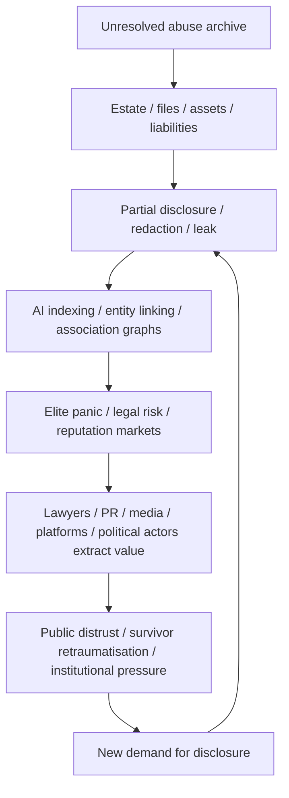

# 🪱 The Estate As Disaster Capitalism Macro  
**First created:** 2026-06-22 | **Last updated:** 2026-06-22  
*How an unresolved harm archive can behave like a self-propagating extraction engine when pumped through AI, legal systems, media markets, elite panic, and reputation infrastructure.*

---

## 🛰️ Orientation  

This node adds the extraction-loop analysis to the `✈️_World_War_Epstein` cluster.

The point is not only that Epstein left files, assets, names, secrets, victims, lawyers, and institutional liabilities behind.

The sharper point is that the estate itself can behave like a **disaster-capitalism macro**.

An unresolved harm archive enters:

- courts;
- estate administration;
- victim-compensation processes;
- media markets;
- political opposition systems;
- AI indexing;
- social platforms;
- adverse-media tools;
- legal databases;
- reputation-management firms;
- intelligence-adjacent monitoring;
- elite panic networks.

Then it starts producing value for everyone except the harmed.

That is the worm.

---

## 🧿 Core Claim  

The Epstein estate should not be treated as a passive legal object.

It behaves like an active extraction engine.

Alive, Epstein appears to have brokered:

```text
access + secrecy + money + prestige + exploitation + leverage
```

Dead, the estate can continue the same macro through:

```text
files + names + redactions + panic + legal fees + media cycles + AI association graphs
```

Same macro.

Different host.

The blunt formulation:

> Epstein’s estate is not behaving like the remains of a criminal enterprise. It is behaving like the automated continuation of one.

---

## 🪱 The Worm Model  

A worm does not need a mastermind once it is running.

It needs a host environment.

In this case, the host environment is:

- unresolved abuse;
- incomplete disclosure;
- survivors still fighting for repair;
- estate assets;
- reputational risk;
- redactions;
- partial release cycles;
- searchable documents;
- AI entity-linking;
- elite fear;
- public distrust;
- geopolitical stress;
- media incentives;
- legal billing;
- and institutional cowardice.

The worm feeds on uncertainty.

Every partial disclosure creates more speculation.

Every redaction creates more suspicion.

Every name-link creates more extraction.

Every defensive movement creates another signal.

Every signal feeds another cycle.

---

## 🧬 Disaster-Capitalism Macro  

The disaster-capitalism macro works like this:



The cycle keeps running because the underlying harm has not been resolved.

That is the disaster-capitalism structure.

The disaster is abuse.

The capitalisation is everything built on top of unresolved abuse.

---

## 📈 The Stockbroker-Bro Structure  

Epstein’s background matters because this was never only a sexual-abuse story.

It was also a brokerage story.

He operated like a market-maker for:

- proximity;
- secrecy;
- access;
- prestige;
- financial dependency;
- sexual exploitation;
- reputation risk;
- compromise;
- information asymmetry;
- social proof;
- elite introductions;
- and silence.

That is the “stockbroker bro” structure.

Not merely a predator with rich friends.

A broker of access, exposure, and dependency.

The estate inherits that structure.

It can keep converting unresolved harm into tradable signals.

---

## 🧨 Post-Mortem Fuckery Hypothesis  

There is a fair-comment hypothesis that this is exactly the kind of post-mortem fuckery Epstein would have wanted or tolerated.

Not as a proved fact.

As a behavioural inference from the structure.

The hypothesis:

> A paranoid, vindictive operator who built power through secrecy, leverage, social access, and asymmetric information may have had incentives to leave behind systems, files, trusts, instructions, omissions, or legal structures that kept others exposed after his death.

That does not require a cartoon villain button.

It may require only:

- messy estate structures;
- incomplete records;
- deliberate ambiguity;
- asymmetric information;
- protected intermediaries;
- survivor claims forced through slow process;
- names appearing without full context;
- legal fights over disclosure;
- assets and liabilities tangled together;
- enough uncertainty to make exposed people keep moving.

The cruelty is not only in what was done while he was alive.

It is in the possibility that the architecture keeps working after death.

---

## 🧮 AI As Pump  

AI changes the estate’s behaviour.

Before AI, files had to be searched manually, slowly, unevenly.

Now a large harm archive can be:

- ingested;
- indexed;
- summarised;
- entity-linked;
- clustered;
- searched;
- cross-referenced;
- sentiment-scored;
- mapped;
- misread;
- decontextualised;
- and re-circulated at speed.

That means an unresolved estate becomes more volatile.

AI does not need to know the truth to move the system.

It only needs to produce plausible associations.

Those associations then feed:

- journalists;
- lawyers;
- investors;
- politicians;
- donors;
- hostile states;
- conspiracy markets;
- reputation managers;
- social media;
- and anxious elites.

The estate becomes AI-pumped.

That is why the worm accelerates.

---

## 🕸️ Association Without Resolution  

A resolved estate would narrow the field.

It would establish:

- what happened;
- who was harmed;
- who was compensated;
- what assets remain;
- what records exist;
- what redactions are justified;
- what names mean;
- what allegations are substantiated;
- what is still unknown;
- who is legally responsible;
- who is not.

An unresolved estate does the opposite.

It leaves everything in a semi-active state.

Names float.

Redactions pulse.

Files drip.

Lawyers bill.

Platforms amplify.

Politicians posture.

Adversaries monitor.

Survivors are dragged back through the machinery.

That is not accountability.

That is extraction.

---

## ⚖️ The Resolution Problem  

The cycle has to be closed.

Not buried.

Closed.

That means converting the estate from an extraction engine into an accountable structure.

Possible closure principles:

| Principle | Purpose |
|---|---|
| Survivor-centred settlement | Stop making harmed people fund the truth with their bodies. |
| Transparent asset accounting | Prevent assets from being hidden, drained, or laundered through process. |
| Clear disclosure rules | Separate victim protection from elite protection. |
| Redaction accountability | Redactions need reasons, categories, and review. |
| Independent archival handling | Prevent interested parties from controlling the harm archive. |
| AI-use safeguards | Stop automated association tools from retraumatising survivors or laundering weak links into certainty. |
| Anti-extraction design | Reduce incentives for endless media, legal, platform, and political monetisation. |
| Public-interest summary | Provide enough clarity to reduce speculation without exposing victims. |
| Adversary-risk review | Treat unresolved elite exposure as a national-security vulnerability. |

The estate must stop being a market-maker.

---

## 🧯 What Must Not Happen  

The wrong answer is to destroy or bury evidence.

The wrong answer is also to let the estate keep generating value through unresolved harm.

Do not:

- suppress survivor claims;
- hide elite names under fake privacy arguments;
- expose victims for public consumption;
- drip-feed files for political advantage;
- let platforms monetise speculation cycles;
- let AI tools turn weak association into pseudo-proof;
- let lawyers drain the estate while survivors wait;
- let hostile states treat the archive as leverage;
- let governments use “national security” as a blanket cover for embarrassment;
- let the scandal remain permanently unresolved because too many powerful people benefit from uncertainty.

The goal is not secrecy.

The goal is accountable closure.

---

## 📲 Press Handling  

The press line should be sharp but careful:

> The Epstein estate is not merely a set of remaining assets and files. In an AI-mediated information environment, an unresolved harm archive can behave like an extraction engine: producing legal fees, media cycles, reputation panic, political leverage, platform engagement, and geopolitical risk while survivors continue carrying the cost.

That is reportable.

The stronger follow-up question:

> Who benefits from the estate remaining unresolved?

That is the right question.

Not because it proves conspiracy.

Because unresolved harm creates markets.

---

## 🛡️ Defence-Planning Implication  

Defence planners should treat unresolved elite harm archives as strategic vulnerabilities.

Not because the scandal itself is military.

Because unresolved exposure can be exploited through:

- blackmail;
- leverage;
- public destabilisation;
- elite panic;
- foreign intelligence;
- reputational coercion;
- political distraction;
- alliance mistrust;
- legal-calendar sensitivity;
- and AI-amplified association leakage.

A state that cannot resolve elite exposure becomes governable through it.

That is the national-security lesson.

---

## 🧩 Working Formulation  

The Epstein estate behaves like a disaster-capitalism macro.

It converts unresolved abuse into recurring value for lawyers, media, platforms, political actors, reputation managers, adversaries, and elite networks.

AI accelerates the process by turning files into searchable association graphs.

The result is a worm: a self-propagating exposure parasite that feeds on partial disclosure, redaction, panic, and unresolved harm.

The cycle must be resolved.

Not buried.

Resolved.

If the estate remains a market-maker, the system will keep monetising harm in perpetuity.

And that is exactly the kind of post-mortem fuckery a paranoid, vindictive access-broker would plausibly leave behind.

---

## 🌌 Constellations  

🪱 🧮 🧬 🔁 📲 🛡️ — estate worm, association leakage, shared-risk calendars, pressure cycles, press handling, and defence exposure.

---

## ✨ Stardust  

Epstein estate, disaster capitalism, harm archive, AI indexing, association graphs, survivor repair, legal extraction, media cycles, reputation markets, post-mortem fuckery, estate worm

---

## 🏮 Footer  

*The Estate As Disaster Capitalism Macro* is a living node of the **Polaris Protocol**.  
It adds the extraction-loop analysis to the `✈️_World_War_Epstein` cluster: not scandal as gossip, but unresolved harm as active infrastructure.

It argues for accountable closure rather than permanent monetisation.

The worm must be stopped without burying the evidence.

> 📡 Cross-references:
>
> - [🔁 Pressure Cycle Mermaid Analysis](./🔁_pressure_cycle_mermaid_analysis.md) — *visual model of the recurring pressure cycle*  
> - [🧮 Association Leakage And Metadata Escalation](./🧮_association_leakage_and_metadata_escalation.md) — *technical mechanism for weak-signal movement*  
> - [🧬 Shared Risk Calendar And Chain Dependency](./🧬_shared_risk_calendar_and_chain_dependency.md) — *legal calendars as strategic pressure points*  
> - [🧯 What Journalists Should Check Next](./🧯_what_journalists_should_check_next.md) — *press-facing verification checklist*  
> - [🛡️ What Defence Planners Should Model](./🛡️_what_defence_planners_should_model.md) — *planning model for brittleness and exposure*  

*Survivor authorship is sovereign. Containment is never neutral.*  

_Last updated: 2026-06-22_
