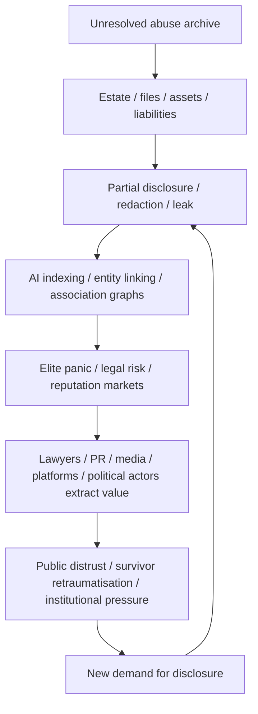

# 🪱 The Estate As Disaster Capitalism Macro  
**First created:** 2026-06-22 | **Last updated:** 2026-06-22  
*How an unresolved harm archive can behave like a self-propagating extraction engine when pumped through AI, legal systems, media markets, elite panic, and reputation infrastructure.*

---

## 🛰️ Orientation  

This node adds the extraction-loop analysis to the `✈️_World_War_Epstein` cluster.

The point is not only that Epstein left files, assets, names, secrets, victims, lawyers, and institutional liabilities behind.

The sharper point is that the estate itself can behave like a **disaster-capitalism macro**.

An unresolved harm archive enters:

- courts;
- estate administration;
- victim-compensation processes;
- media markets;
- political opposition systems;
- AI indexing;
- social platforms;
- adverse-media tools;
- legal databases;
- reputation-management firms;
- intelligence-adjacent monitoring;
- elite panic networks.

Then it starts producing value for everyone except the harmed.

That is the worm.

---

## 🧿 Core Claim  

The Epstein estate should not be treated as a passive legal object.

It behaves like an active extraction engine.

Alive, Epstein appears to have brokered:

```text
access + secrecy + money + prestige + exploitation + leverage
```

Dead, the estate can continue the same macro through:

```text
files + names + redactions + panic + legal fees + media cycles + AI association graphs
```

Same macro.

Different host.

The blunt formulation:

> Epstein’s estate is not behaving like the remains of a criminal enterprise. It is behaving like the automated continuation of one.

---

## 🪱 The Worm Model  

A worm does not need a mastermind once it is running.

It needs a host environment.

In this case, the host environment is:

- unresolved abuse;
- incomplete disclosure;
- survivors still fighting for repair;
- estate assets;
- reputational risk;
- redactions;
- partial release cycles;
- searchable documents;
- AI entity-linking;
- elite fear;
- public distrust;
- geopolitical stress;
- media incentives;
- legal billing;
- and institutional cowardice.

The worm feeds on uncertainty.

Every partial disclosure creates more speculation.

Every redaction creates more suspicion.

Every name-link creates more extraction.

Every defensive movement creates another signal.

Every signal feeds another cycle.

---

## 🧬 Disaster-Capitalism Macro  

The disaster-capitalism macro works like this:



The cycle keeps running because the underlying harm has not been resolved.

That is the disaster-capitalism structure.

The disaster is abuse.

The capitalisation is everything built on top of unresolved abuse.

---

## 📈 The Stockbroker-Bro Structure  

Epstein’s background matters because this was never only a sexual-abuse story.

It was also a brokerage story.

He operated like a market-maker for:

- proximity;
- secrecy;
- access;
- prestige;
- financial dependency;
- sexual exploitation;
- reputation risk;
- compromise;
- information asymmetry;
- social proof;
- elite introductions;
- and silence.

That is the “stockbroker bro” structure.

Not merely a predator with rich friends.

A broker of access, exposure, and dependency.

The estate inherits that structure.

It can keep converting unresolved harm into tradable signals.

---

## 🧨 Post-Mortem Fuckery Hypothesis  

There is a fair-comment hypothesis that this is exactly the kind of post-mortem fuckery Epstein would have wanted or tolerated.

Not as a proved fact.

As a behavioural inference from the structure.

The hypothesis:

> A paranoid, vindictive operator who built power through secrecy, leverage, social access, and asymmetric information may have had incentives to leave behind systems, files, trusts, instructions, omissions, or legal structures that kept others exposed after his death.

That does not require a cartoon villain button.

It may require only:

- messy estate structures;
- incomplete records;
- deliberate ambiguity;
- asymmetric information;
- protected intermediaries;
- survivor claims forced through slow process;
- names appearing without full context;
- legal fights over disclosure;
- assets and liabilities tangled together;
- enough uncertainty to make exposed people keep moving.

The cruelty is not only in what was done while he was alive.

It is in the possibility that the architecture keeps working after death.

---

## 🧮 AI As Pump  

AI changes the estate’s behaviour.

Before AI, files had to be searched manually, slowly, unevenly.

Now a large harm archive can be:

- ingested;
- indexed;
- summarised;
- entity-linked;
- clustered;
- searched;
- cross-referenced;
- sentiment-scored;
- mapped;
- misread;
- decontextualised;
- and re-circulated at speed.

That means an unresolved estate becomes more volatile.

AI does not need to know the truth to move the system.

It only needs to produce plausible associations.

Those associations then feed:

- journalists;
- lawyers;
- investors;
- politicians;
- donors;
- hostile states;
- conspiracy markets;
- reputation managers;
- social media;
- and anxious elites.

The estate becomes AI-pumped.

That is why the worm accelerates.

---

## 🕸️ Association Without Resolution  

A resolved estate would narrow the field.

It would establish:

- what happened;
- who was harmed;
- who was compensated;
- what assets remain;
- what records exist;
- what redactions are justified;
- what names mean;
- what allegations are substantiated;
- what is still unknown;
- who is legally responsible;
- who is not.

An unresolved estate does the opposite.

It leaves everything in a semi-active state.

Names float.

Redactions pulse.

Files drip.

Lawyers bill.

Platforms amplify.

Politicians posture.

Adversaries monitor.

Survivors are dragged back through the machinery.

That is not accountability.

That is extraction.

---

## ⚖️ The Resolution Problem  

The cycle has to be closed.

Not buried.

Closed.

That means converting the estate from an extraction engine into an accountable structure.

Possible closure principles:

| Principle | Purpose |
|---|---|
| Survivor-centred settlement | Stop making harmed people fund the truth with their bodies. |
| Transparent asset accounting | Prevent assets from being hidden, drained, or laundered through process. |
| Clear disclosure rules | Separate victim protection from elite protection. |
| Redaction accountability | Redactions need reasons, categories, and review. |
| Independent archival handling | Prevent interested parties from controlling the harm archive. |
| AI-use safeguards | Stop automated association tools from retraumatising survivors or laundering weak links into certainty. |
| Anti-extraction design | Reduce incentives for endless media, legal, platform, and political monetisation. |
| Public-interest summary | Provide enough clarity to reduce speculation without exposing victims. |
| Adversary-risk review | Treat unresolved elite exposure as a national-security vulnerability. |

The estate must stop being a market-maker.

---

## 🧯 What Must Not Happen  

The wrong answer is to destroy or bury evidence.

The wrong answer is also to let the estate keep generating value through unresolved harm.

Do not:

- suppress survivor claims;
- hide elite names under fake privacy arguments;
- expose victims for public consumption;
- drip-feed files for political advantage;
- let platforms monetise speculation cycles;
- let AI tools turn weak association into pseudo-proof;
- let lawyers drain the estate while survivors wait;
- let hostile states treat the archive as leverage;
- let governments use “national security” as a blanket cover for embarrassment;
- let the scandal remain permanently unresolved because too many powerful people benefit from uncertainty.

The goal is not secrecy.

The goal is accountable closure.

---

## 📲 Press Handling  

The press line should be sharp but careful:

> The Epstein estate is not merely a set of remaining assets and files. In an AI-mediated information environment, an unresolved harm archive can behave like an extraction engine: producing legal fees, media cycles, reputation panic, political leverage, platform engagement, and geopolitical risk while survivors continue carrying the cost.

That is reportable.

The stronger follow-up question:

> Who benefits from the estate remaining unresolved?

That is the right question.

Not because it proves conspiracy.

Because unresolved harm creates markets.

---

## 🛡️ Defence-Planning Implication  

Defence planners should treat unresolved elite harm archives as strategic vulnerabilities.

Not because the scandal itself is military.

Because unresolved exposure can be exploited through:

- blackmail;
- leverage;
- public destabilisation;
- elite panic;
- foreign intelligence;
- reputational coercion;
- political distraction;
- alliance mistrust;
- legal-calendar sensitivity;
- and AI-amplified association leakage.

A state that cannot resolve elite exposure becomes governable through it.

That is the national-security lesson.

---

## 🧩 Working Formulation  

The Epstein estate behaves like a disaster-capitalism macro.

It converts unresolved abuse into recurring value for lawyers, media, platforms, political actors, reputation managers, adversaries, and elite networks.

AI accelerates the process by turning files into searchable association graphs.

The result is a worm: a self-propagating exposure parasite that feeds on partial disclosure, redaction, panic, and unresolved harm.

The cycle must be resolved.

Not buried.

Resolved.

If the estate remains a market-maker, the system will keep monetising harm in perpetuity.

And that is exactly the kind of post-mortem fuckery a paranoid, vindictive access-broker would plausibly leave behind.  

---

## 🗣️ The Bragging-Rights Test  

A useful investigative test is whether Epstein ever bragged, hinted, joked, threatened, or philosophised to close contacts about what would happen after his death.

The claim should not be framed as proved.

But it is a reasonable behavioural line of inquiry.

A paranoid, vindictive access-broker who built power through secrecy, leverage, proximity, reputation risk, and asymmetric information would plausibly have treated posthumous exposure as part of the power game.

Investigators and journalists should therefore look for evidence of:

- dead-man-switch talk;
- estate-control talk;
- “if anything happens to me” comments;
- boasts about files, tapes, names, or records;
- threats that powerful people would go down with him;
- jokes about people still needing him after death;
- instructions to lawyers, trustees, fixers, assistants, or archivists;
- unusual document custody arrangements;
- repeated references to leverage surviving him;
- close contacts suddenly changing posture after his death.

The question is not only what structures existed.

The question is whether he performed those structures socially.

Arrogant operators often tell on themselves.

Not necessarily in one clean confession.

Often in jokes, boasts, threats, insinuations, and little demonstrations of control.

The investigative line is simple:

> Who heard Epstein talk about what would happen to his files, names, money, records, or enemies after he died?

That is where the worm may have left fingerprints.  

The post-mortem design question is not speculative decoration. It is an investigative lead. If Epstein understood his archive as leverage while alive, then close contacts may have heard him describe, threaten, joke about, or boast about leverage surviving him. That social-performance trail matters.

---

## 🧠 Why This Sounds Mad — And Why It Still Fits  

This section needs an explicit caution.

At first glance, the idea that an estate could be structured to keep producing leverage after death sounds paranoid.

That does not mean it is implausible.

It means the claim has to be handled carefully.

The point is not:

> “Epstein definitely designed every later consequence from beyond the grave.”

The point is:

> A post-conviction Epstein, operating from entitlement, grievance, paranoia, leverage, and contempt for other people, had a worldview in which this kind of posthumous fuckery would make behavioural sense.

After his first conviction, Epstein did not appear to become a chastened man seeking genuine accountability.

He appears to have remained invested in:

- access;
- status;
- leverage;
- reputational warfare;
- victim control;
- legal containment;
- elite dependency;
- score-settling;
- information asymmetry;
- and the belief that other people were fools, hypocrites, enemies, or useful objects.

That matters.

A person who sees the world this way does not necessarily experience an estate as a neutral legal instrument.

They may experience it as a final operating environment.

A last machine.

A way to keep power moving after the body is gone.

---

## 🧨 Entitlement, Grievance, And Post-Conviction Control  

The behavioural model is important.

Epstein’s later posture appears to fit a familiar pattern in coercive and predatory operators:

| Trait | Estate-risk implication |
|---|---|
| Entitlement | “My money, files, and relationships should keep working for me.” |
| Grievance | “If I go down, others deserve to suffer too.” |
| Paranoia | “I need leverage that survives betrayal, arrest, or death.” |
| Vindictiveness | “People who abandon me should remain exposed.” |
| Contempt | “Victims, lawyers, journalists, and institutions can be managed.” |
| Access-broker mindset | “Everything is a relationship market.” |
| Information-hoarding | “Secrets are assets.” |
| Legal calculation | “Process can be used as punishment.” |

That does not prove a specific posthumous design.

But it makes the risk model credible.

This is not random fantasy.

It is structurally consistent with the behaviour of a man who treated people, secrets, money, and institutions as instruments.

---

## 🪦 The Estate As Final Leverage Environment  

A normal estate distributes assets and settles liabilities.

A predatory leverage estate may do something darker.

It may preserve ambiguity.

It may create dependencies.

It may force survivors through slow process.

It may keep names unresolved.

It may leave files searchable but incomplete.

It may make powerful people uncertain about what is known.

It may create incentives for lawyers, intermediaries, institutions, and recipients to keep feeding from the unresolved structure.

It may turn “repair” into another form of control.

That is why this node treats the estate as a possible continuation of the operating model.

Not because Epstein was supernatural.

Because he was methodical, entitled, and vicious enough that posthumous leverage belongs in the investigative frame.

---

## 🧯 The Careful Formulation  

The careful formulation is:

> Based on Epstein’s known behavioural pattern — exploitation, calculation, secrecy, access-brokering, leverage, legal containment, entitlement, and post-conviction grievance — it is reasonable to investigate whether his estate, files, trusts, donations, instructions, or document-custody arrangements were structured in ways that preserved leverage, contaminated accountability routes, or prolonged control after death.

That is the line.

Not “this definitely happened.”

Not “nothing to see here.”

A reasonable investigative hypothesis.

And frankly, exactly the sort of ugly thing the architecture invites.  

This sounds extreme only if the estate is imagined as ordinary. Once it is read against Epstein’s post-conviction worldview — entitled, paranoid, aggrieved, calculating, and contemptuous — the possibility of posthumous leverage stops being melodrama and becomes an investigative question.

---

## 🕊️ Restitution-Washing And Charitable Capture  

There is an especially ugly failure mode where an estate like this does not merely defend itself.

It tries to contaminate the field around it.

The mechanism is simple:

> Donate to the people, causes, institutions, legal networks, human-rights organisations, academic centres, survivor-support structures, or public-interest bodies most likely to challenge you — then frame the money as restitution, remorse, public good, or repair.

On the surface, this can look like accountability.

Underneath, it may function as silencing infrastructure.

A predatory estate can use “doing good” language to create:

- conflicts of interest;
- reputational hesitation;
- institutional embarrassment;
- donor dependency;
- contaminated advocacy routes;
- difficulty criticising the estate without implicating one’s own funding;
- pressure on organisations to remain “balanced” or “grateful”;
- laundering of abusive wealth through respectable causes;
- future claims that critics are attacking money meant for victims or human rights;
- a chilling effect on lawyers, journalists, researchers, and campaigners.

This is restitution-washing.

It is not repair.

It is containment dressed as repair.

---

## ⚖️ The Donation Trap  

The donation trap works because almost everyone near the harm needs money.

Survivor-support groups need money.  
Legal clinics need money.  
Human-rights organisations need money.  
Journalists need funding.  
Archives need funding.  
Researchers need funding.  
Public-interest lawyers need funding.  

A sufficiently cynical estate can exploit that need.

The dangerous version is not merely:

> “Here is compensation for harm.”

The dangerous version is:

> “Here is money placed so broadly and strategically that anyone who might challenge the estate risks discovering that their own institution, cause, funder, adviser, or allied organisation has been touched by it.”

That creates a moral and procedural fog.

It makes opposition harder.

It makes clean accountability harder.

It turns restitution into a second-order control surface.

---

## 🧨 Why This Fits The Behavioural Pattern  

This should be treated as an investigative hypothesis, not a proved fact without records.

But it fits the wider behavioural model.

A paranoid, vindictive access-broker who built power through leverage, proximity, secrecy, reputation risk, and asymmetric dependency would plausibly understand charitable giving as another form of control.

Not generosity.

Positioning.

The public wording would likely be clean:

> repair, restitution, accountability, survivor support, human rights, legal reform, education, prevention, public interest.

The operational effect could be dirtier:

> bind the critics, contaminate the field, create hesitation, seed conflicts, and make the estate harder to confront cleanly.

This is exactly why estate donations, grants, trusts, cy-près arrangements, settlement-linked funds, academic gifts, human-rights gifts, and legal-support funding need close scrutiny.

Not because all such funding is bad.

Because money from an unresolved harm archive can carry strategic contamination.

---

## 🛠️ What To Check  

Journalists, investigators, trustees, lawyers, and public-interest organisations should ask:

| Question | Why it matters |
|---|---|
| Which organisations received estate-linked funds? | Identifies possible capture points. |
| Were donations framed as restitution, prevention, education, or public good? | Tests laundering language. |
| Were recipients connected to victims, legal reform, trafficking work, human rights, journalism, archives, academia, or litigation? | Tests whether likely challengers were touched. |
| Were any grants restricted, conditional, anonymous, donor-advised, or routed through intermediaries? | Tests hidden control. |
| Did any recipient later soften criticism, avoid litigation, decline comment, or change research direction? | Tests chilling effect. |
| Were victims consulted before funds were distributed in their name? | Tests survivor sovereignty. |
| Did funding create conflicts for lawyers, trustees, academics, or campaigners? | Tests procedural contamination. |
| Were grants used to argue that the estate was “making good”? | Tests reputational laundering. |
| Did donations reduce available funds for direct survivor compensation? | Tests extraction from repair. |
| Was there independent oversight of the funding logic? | Tests accountability. |

The key question is blunt:

> Was money used to repair harm, or to manage the people who might expose it?

---

## 🧯 Boundary  

Not every donation from a bad source has the same meaning.

Some money may genuinely support survivors or prevent future harm.

Some recipients may accept contaminated money under strict conditions because they are trying to redirect harm into repair.

That distinction matters.

The problem is not the idea of restitution.

The problem is restitution being structured by the same logic as the abuse network: secrecy, dependency, leverage, reputation management, and asymmetric control.

If the estate funds repair, the structure must be survivor-centred, transparent, independently governed, conflict-checked, and insulated from reputational laundering.

Otherwise the money becomes another host for the worm.  

A particularly dangerous form of the worm is restitution-washing: using donations to human-rights, legal, survivor-support, academic, or public-interest causes not only to appear remorseful, but to contaminate the very institutions most likely to challenge the estate.

---

## 👻 The Ghost As System Behaviour  

This node does not require any conspiracy theory about Epstein’s death.

It can accept the simplest position:

> Epstein died, and what remains is his estate, his files, his money, his victims, his records, his legal residue, his institutional damage, and the systems still processing him.

That is enough.

The problem is that the estate and its surrounding legal-financial architecture allow Epstein’s impact to keep moving after death.

Not as a supernatural ghost.

As system behaviour.

His “ghost” is the unresolved structure:

- files that still trigger panic;
- assets that still need accounting;
- survivors still forced into process;
- names still unresolved;
- redactions still generating suspicion;
- lawyers still billing;
- institutions still distancing;
- platforms still amplifying;
- AI systems still linking entities;
- political actors still exploiting the pressure;
- adversaries still reading the exposure field;
- public trust still being damaged.

That is the haunting.

Not a mystery story.

A governance failure.

---

## 🗣️ The Talker Problem  

Epstein’s ghost behaves like a talker.

It keeps making the room respond.

Every tranche, leak, redaction, court filing, estate movement, donation, compensation dispute, or name-link becomes another utterance.

The estate “talks” through:

| Channel | What it says |
|---|---|
| Redactions | Something is still being withheld. |
| Partial releases | There is more to come. |
| Estate disputes | The money is not cleanly resolved. |
| Survivor claims | The harm is not repaired. |
| AI association graphs | These names may connect. |
| Legal delays | The system is still protecting itself. |
| Donations or restitution language | The estate wants moral repositioning. |
| Elite panic | Someone still feels exposed. |
| Political use | The archive remains useful as leverage. |

That is why the cycle is so corrosive.

The dead man does not need to speak.

The estate speaks for him.

And because the estate remains unresolved, the speaking does not stop.

---

## 🪦 Beyond-The-Grave Impact Without Death Conspiracy  

The important point is this:

> Even if Epstein’s death was exactly what the official account says it was, the legal, financial, archival, and reputational structure left behind still gives him impact beyond the grave.

That is the part that needs resolving.

Not because of mysticism.

Because unresolved coercive systems can outlive the coercive person.

A predator can die while the machinery keeps working.

That machinery can still:

- discipline survivors;
- frighten elites;
- distort journalism;
- create legal markets;
- contaminate charities;
- activate conspiracy markets;
- pressure governments;
- destabilise public trust;
- and turn harm into recurring value.

That is what makes it so shitty.

The ghost is not proof that he is secretly alive.

The ghost is proof that the estate has not been properly killed as an extraction system.

---

## 🧯 How To Stop The Ghost Talking  

The answer is not silence.

Silence feeds the ghost.

The answer is accountable closure:

- survivor-centred repair;
- transparent estate accounting;
- independent archive governance;
- clear disclosure standards;
- redaction accountability;
- conflict-checked restitution structures;
- limits on extraction by intermediaries;
- AI-use safeguards;
- public-interest reporting that does not turn survivors into content;
- and a final map of what remains unresolved.

The aim is not to erase the evidence.

The aim is to stop the estate from using evidence, money, ambiguity, and institutional fear as a posthumous control system.

The ghost stops talking when the structure stops producing leverage.  

The estate is Epstein’s ghost in system form. It does not require any conspiracy theory about his death. Even accepting that his death was simply his death, the estate, files, assets, redactions, donations, survivor claims, legal disputes, and AI-indexed association graphs allow his operating model to keep affecting the living. That is the haunting: not supernatural presence, but unresolved coercive infrastructure.

---

## 🌌 Constellations  

🪱 🧮 🧬 🔁 📲 🛡️ — estate worm, association leakage, shared-risk calendars, pressure cycles, press handling, and defence exposure.

---

## ✨ Stardust  

Epstein estate, disaster capitalism, harm archive, AI indexing, association graphs, survivor repair, legal extraction, media cycles, reputation markets, post-mortem fuckery, estate worm

---

## 🏮 Footer  

*The Estate As Disaster Capitalism Macro* is a living node of the **Polaris Protocol**.  
It adds the extraction-loop analysis to the `✈️_World_War_Epstein` cluster: not scandal as gossip, but unresolved harm as active infrastructure.

It argues for accountable closure rather than permanent monetisation.

The worm must be stopped without burying the evidence.

> 📡 Cross-references:
>
> - [🔁 Pressure Cycle Mermaid Analysis](./🔁_pressure_cycle_mermaid_analysis.md) — *visual model of the recurring pressure cycle*  
> - [🧮 Association Leakage And Metadata Escalation](./🧮_association_leakage_and_metadata_escalation.md) — *technical mechanism for weak-signal movement*  
> - [🧬 Shared Risk Calendar And Chain Dependency](./🧬_shared_risk_calendar_and_chain_dependency.md) — *legal calendars as strategic pressure points*  
> - [🧯 What Journalists Should Check Next](./🧯_what_journalists_should_check_next.md) — *press-facing verification checklist*  
> - [🛡️ What Defence Planners Should Model](./🛡️_what_defence_planners_should_model.md) — *planning model for brittleness and exposure*  

*Survivor authorship is sovereign. Containment is never neutral.*  

_Last updated: 2026-06-22_
