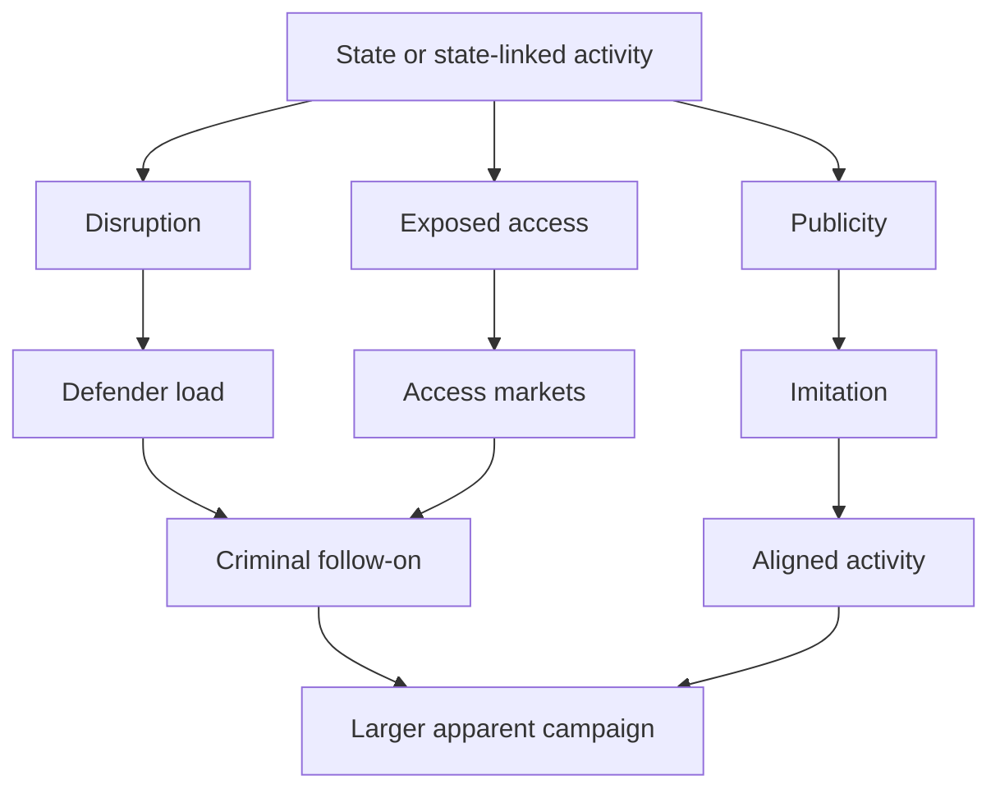

# 🌊 Riding Every Wave
**First created:** 2026-08-14 | **Last updated:** 2026-08-20  
*How state campaigns, aligned actors, shared vulnerabilities, criminal follow-on and ordinary opportunism can overlap without sharing a command structure.*

---

## 🛰️ Orientation

Cyber campaigns rarely arrive as a neat procession of attributable
incidents conducted by one actor under one chain of command.

Conflict changes the environment around an attack.

A state operation may generate publicity, expose vulnerable
infrastructure, reveal working techniques, consume defensive capacity,
create stolen access, attract ideologically aligned actors and advertise
profitable targets. Criminal groups may then exploit the same
environment. Some may have relationships with the state. Some may merely
share its enemies. Some may have noticed that everyone is looking the
other way.

The resulting activity can look like one large campaign from a distance.

It may not be.

The analytical task is therefore not simply to ask:

> **Who is attacking?**

It is also to ask:

> **Which wave are we looking at, what produced it, and what kind of relationship—if any—connects it to the waves around it?**

---

## 🌊 One Conflict Can Produce Several Waves

A useful starting model distinguishes between several kinds of activity
that may coexist.

### 🏛️ State-directed activity

Operations can be directly tasked, coordinated, resourced or controlled
by a state institution.

This is the strongest organisational relationship.

Evidence may include:

- government attribution;
- intelligence reporting;
- command relationships;
- infrastructure or tooling tied to state operators;
- tasking patterns;
- operational coordination;
- or technical evidence linking activity to a previously attributed
    state unit.

Even here, attribution should remain evidence-led. State interest in an
outcome does not by itself establish state direction of an operation.

### 🕸️ State-linked or proxy activity

An actor may have an established relationship with a state while
retaining significant operational autonomy.

Relationships can include:

- funding;
- technical assistance;
- historical cooperation;
- ideological alignment;
- personnel overlap;
- intelligence sharing;
- tolerated activity;
- or intermittent tasking.

"State-linked" therefore does not automatically mean:

> **the government ordered this particular incident.**

The relationship between actor and state and the attribution of a
specific operation are separate evidentiary questions.

### 💰 Commissioned Or Purchased Outcomes

A customer may commission an outcome without selecting the hands-on operator or technical method.

An operator may obtain access without knowing who will ultimately buy or use it.

A plausible chain is:

```text
requirement
→ commissioner
→ payer or procurement route
→ intermediary
→ access broker or operator
→ effect, data, or access
→ end user or later beneficiary
```

The customer can enter before the intrusion, during it, or after access already exists.

Those timings support different claims:

```text
commission before access
→ possible prior tasking

purchase after compromise
→ later acquisition, not automatically original direction

payment for an outcome
→ relationship and demand, not automatically method control
```

This is a distinct way of riding a wave.

The later customer may redirect, deepen, publicise, or operationalise access created for another purpose.

The commissioning chain must be evidenced rather than inferred from usefulness alone.

### 📣 Aligned opportunism

Conflict attracts participants.

Hacktivists, ideological fellow-travellers, patriotic hacking groups and
other sympathetic actors may independently attack the same adversary.

Their activity may reinforce a state's strategic objectives without
being commissioned by that state.

Alignment of interests is not proof of command.

### 🤑 Criminal follow-on

Criminal actors may exploit conditions created by earlier activity.

This can include:

- monetising stolen credentials;
- purchasing access from brokers;
- deploying ransomware into already-weakened environments;
- extorting disrupted organisations;
- exploiting vulnerabilities publicised by earlier incidents;
- reusing publicly discussed techniques;
- targeting sectors revealed to be poorly defended.

This activity may be **causally downstream** from a state campaign
without being **organisationally downstream** from the state.

That distinction matters.

### 📡 Narrative Follow-On

An operational wave can also produce a publicity wave.

Later actors may:

- claim an intrusion they did not initiate;
- exaggerate the operational effect;
- selectively publish the most politically useful victims;
- wrap criminal access in ideological language;
- amplify genuine stolen material;
- or use public attention to advertise capability, recruit participants, or attract customers.

The narrative actor, hands-on operator, customer, and publicity selector may be different people.

Narrative coordination therefore has to be tested separately from intrusion coordination.

### 🦹 Background opportunistic crime

Some attacks occurring during a conflict will simply be crime.

War does not suspend the normal cybercrime economy.

Indeed, instability may increase ordinary offending by:

- stretching defenders;
- increasing the number of exposed systems;
- creating confusion about attribution;
- disrupting routine maintenance;
- increasing demand for illicit access;
- generating more politically plausible cover for criminal activity.

A rise in cybercrime during conflict does not require every criminal
actor to have joined the war.

Sometimes war increases crime because war increases opportunity.

---

### 🧬 Shared-vulnerability waves

One exploitable product can generate a cross-sector victim list without
any actor selecting each victim for its strategic value.

A shared-vulnerability wave may look like:

```text
widely used software
→ one exploitable flaw
→ mass scanning or repeatable access
→ victims across several sectors
→ data theft or extortion at scale
```

The resulting victim list may include energy, healthcare, finance,
defence, industrial, retail, and ordinary commercial organisations.

That distribution can resemble strategic cross-sector targeting.

The organising mechanism may instead be:

> **Who was running the vulnerable product?**

rather than:

> **Which sectors did the attacker choose for geopolitical effect?**

This does not make the campaign strategically irrelevant.

It changes the attribution question.

Record:

```text
COMMON VULNERABILITY:
COMMON PRODUCT:
EXPOSURE POPULATION:
COMPROMISED POPULATION:
PUBLISHED / EXTORTED POPULATION:
SELECTIVE POST-COMPROMISE BEHAVIOUR:
```

The denominator matters.

Four geopolitically interesting victims among four compromised
organisations would mean something different from four interesting
victims among fifty organisations reached through the same vulnerable
platform.

---

## 🧿 Downstream Is Not The Same As Directed

One of the easiest analytical errors is to see a sequence like this:

```text
state operation
      ↓
system disruption
      ↓
criminal exploitation
```

and silently convert it into:

```text
state
  ↓
criminal operator
```

Those are different claims.

The first describes a **causal sequence**.

The second describes a **command or organisational relationship**.

A criminal group can benefit from conditions created by state activity
without receiving instructions, funding or assistance from that state.

Likewise, criminals can reuse:

- credentials;
- exposed services;
- vulnerabilities;
- malware concepts;
- target lists;
- public reporting;
- or generalised defender exhaustion

created by an earlier campaign.

The state operation may therefore help explain **why the later crime
became possible or profitable** while explaining nothing about **who
ordered the later crime**.

The reverse caution also matters.

Absence of command does not make every upstream decision consequence-free.

A commissioner, provider, platform, broker, or earlier operator may knowingly create:

- reusable capability;
- transferable access;
- a market for stolen data;
- a public target list;
- defender overload;
- or conditions in which wider downstream harm is foreseeable.

That may create governance, due-diligence, facilitation, or risk-allocation questions even where it does not prove command responsibility for the later actor.

Keep the propositions separate:

```text
causal contribution
≠
operational direction

foreseeable ecosystem support
≠
intent for every downstream offence

no direct command
≠
no responsibility question at all
```

---

## 🪜 Initial Access And Later Use May Have Different Organising Logic

The first actor to enter a system may be selecting for ease.

A later actor may select for value.

The chain can look like:

```text
mass scanning
→ opportunistic compromise
→ persistence or data access
→ criminal sorting
→ access sale or affiliate use
→ later customer recognises strategic value
```

Or:

```text
shared-vulnerability campaign
→ broad victim pool
→ selective extortion
→ selective publication
→ selective resale or follow-on tasking
```

This means two propositions can coexist:

```text
INITIAL ACCESS WAS OPPORTUNISTIC
```

and:

```text
LATER EXPLOITATION WAS SELECTIVE
```

The commissioning chain may enter at several points:

```text
BEFORE ACCESS
→ target or outcome commissioned in advance

AFTER ACCESS
→ broker or operator shops an existing foothold to possible customers

AFTER DATA THEFT
→ buyer acquires a dataset, intelligence value, or coercive opportunity

AFTER PUBLICATION
→ later actor amplifies, weaponises, or acts on material already released
```

But selective later use must be demonstrated.

It cannot be inferred merely because some compromised organisations
would be useful to a state at war.

Useful evidence might include:

- which victims were compromised compared with the exposed customer
    population;
- which victims received extortion demands;
- which victims were named publicly;
- which data categories were prioritised;
- evidence of access sale;
- payment timing and procurement route;
- whether the same operator offered access to several customers;
- whether a commissioner specified the target, outcome, method, or publicity decision;
- later intrusion by a different actor;
- tasking or communications;
- or operational effects inconsistent with ordinary extortion.

Without that evidence:

```text
STRATEGICALLY INTERESTING VICTIM
≠
STRATEGICALLY SELECTED VICTIM
```

And:

```text
POSSIBLE LATER STATE CUSTOMER
≠
EVIDENCE OF A LATER STATE CUSTOMER
```

---

## 🌀 Conflict Changes The Opportunity Environment

Large cyber campaigns do not operate inside sealed laboratories.

They alter the environment in which subsequent actors make decisions.

A significant attack can produce several secondary effects at once:



From outside, this can resemble coordinated escalation.

Sometimes it is.

Sometimes it is several actors riding the same wave.

---

## 🧩 Several Relationships Can Exist At Once

An actor relationship should not be forced into a single binary category
of either **state-controlled** or **completely unrelated**.

The useful questions are more granular.

### Organisational relationship

Is there evidence that the actors belong to, work for, receive direction
from or maintain an established relationship with the same organisation?

### Operational relationship

Is there evidence that actors coordinated this specific campaign or
incident?

### Technical relationship

Do incidents share infrastructure, malware, credentials, tooling or
techniques?

Shared techniques alone may be weak evidence if those techniques are
widely available.

### Causal relationship

Did one incident create conditions that enabled another?

This relationship may exist even where the actors have never
communicated.

### Strategic relationship

Do separate actors produce effects beneficial to the same state or
political objective?

Strategic alignment alone does not establish operational coordination.

### Temporal relationship

Did events occur close together?

Temporal clustering is useful for identifying patterns.

It is not proof of common command.

### Market relationship

Did credentials, access, data, tooling, infrastructure, or services change hands?

A market relationship can establish transfer and demand without establishing a shared political objective.

### Commissioning relationship

Did a requirement generator, commissioner, payer, or intermediary request or purchase a particular target, access type, dataset, effect, or publication decision?

Commissioning can exist without day-to-day control of method.

### Narrative relationship

Did one actor claim, frame, exaggerate, publish, or amplify another actor’s activity?

Shared messaging does not automatically prove shared intrusion infrastructure.

### Downstream-use relationship

Did a later actor use access, data, publicity, or disruption created by an earlier wave?

Later use may be selective even where the original access was opportunistic.

### Governance relationship

Did the same defensive seam, fragmented responsibility, delayed disclosure, or overloaded response pathway enable several otherwise separate actors?

The common cause may sit on the defender’s side of the boundary.

---

## ⚖️ Do Not Make Criminal Activity Do Too Much Evidentiary Work

The appearance of criminal activity does not automatically weaken a
state attribution.

A campaign may contain:

- state operations;
- proxy operations;
- criminal opportunism;
- unrelated crime;
- and incidents that remain unattributed.

Finding a criminal layer therefore does not establish that the state
layer was imaginary.

Equally, establishing state responsibility for part of a campaign does
not permit every nearby ransomware infection, intrusion or service
disruption to be assigned to the state.

Both errors flatten a mixed environment into a single story.

---

## 🪆 Attribution Can Be Nested

A useful way to record complex campaigns is to attribute at several
levels.

For example:

```text
CAMPAIGN ENVIRONMENT
│
├── Wave A
│   └── state-directed — high confidence
│
├── Wave B
│   └── established state-linked actor
│       └── direction for this incident unproven
│
├── Wave C
│   └── aligned actor claim
│       └── claim not independently verified
│
├── Wave D
│   └── criminal exploitation
│       └── possibly enabled by earlier disruption
│
└── Wave E
    └── unattributed / background activity
```

This prevents one attribution judgment from contaminating every incident
in the surrounding period.

It also allows confidence to change independently at each layer.

---

## 🔎 Questions For Reading A Wave

When a new cluster of incidents appears around an existing state
campaign, ask:

- What is actually shared between the incidents?
- Are we seeing shared command, shared tooling, shared opportunity or
    merely shared timing?
- Is one vulnerable product producing the apparent cross-sector
    pattern?
- What is the exposed-customer denominator behind the named victims?
- Was initial access opportunistic but later exploitation selective?
- Who generated the requirement, if any?
- Who commissioned or paid for the outcome?
- What did payment purchase: access, data, disruption, concealment, or publicity?
- Did the customer enter before access, after compromise, or after publication?
- Did the commissioner control method, timing, scope, or only the desired result?
- Is the actor already known to have a relationship with the suspected
    state?
- If so, is there evidence connecting that relationship to **this
    operation**?
- Did earlier incidents expose access or vulnerabilities later actors
    could exploit?
- Has publicity made the target class more attractive?
- Has defensive capacity been diverted elsewhere?
- Could criminal activity plausibly have increased independently
    because the environment became more permissive?
- Is an actor claiming responsibility?
- Does independent evidence corroborate the claim?
- Who selected which incidents or victims to publicise?
- Was a later actor using access, data, or attention created by an earlier wave?
- Are investigators attributing an incident, an operational cluster or
    the entire campaign?
- Are we accidentally using evidence from one wave to attribute
    another?

The goal is not to fragment everything until attribution becomes
impossible.

The goal is to describe the relationships that the evidence actually
supports.

---

## 🧪 Worked Example — The August 2026 Waves

The infrastructure picture visible by 20 August contains several
different waves.

### 🚰 Water and operational technology

The Minnesota / core water wave carries the strongest Iran-linked
assessment.

The public record includes:

- repeated interference with internet-facing PLCs;
- operational and some physical effects;
- prior government warnings about Iranian-affiliated targeting of the
    same class of technology;
- reported investigative and intelligence assessments favouring
    Iran;
- and a responsibility claim from APT IRAN / CyberAv3ngers, an actor
  ecosystem with a previously established IRGC relationship.

On 19 August, a new joint NSA, CISA, FBI, Department of Energy, and Environmental Protection Agency advisory confirmed an active threat to Siemens S7 Series PLCs and assessed that actors were developing capability for possible future operational effects.

The advisory strengthened the active-threat and target-class findings without naming the operator of the recent local water incidents. Formal public federal attribution of the current wave remained absent through 19 August, and the stronger assessment cannot automatically
be inherited by every incident in every affected state.

- [KSTP: APT IRAN and CyberAv3ngers claim the Minnesota water
    attacks](https://kstp.com/kstp-news/top-news/hacking-group-linked-to-iran-claims-responsibility-for-cyberattack-on-minnesota-water-systems-report-says/)
- [CISA and partners: prior attribution of IRGC-affiliated PLC
    activity](https://www.cisa.gov/news-events/cybersecurity-advisories/aa23-335a)
- [FBI: current water-sector PLC operational-disruption
    warning](https://www.fbi.gov/investigate/cyber/alerts/2026/malicious-cyber-actors-targeting-water-and-wastewater-sector-internet--facing-programmable-logic-controllers-causing-operational-disruptions)
- [NSA, CISA, FBI, DOE and EPA: active threat to Siemens S7 Series PLCs](https://media.defense.gov/2026/Aug/18/2003983494/-1/-1/1/CSA_ACTIVE_THREAT_TO_SIEMENS_S7_SERIES_PLCS.PDF)
- [Reuters: active PLC warning without formal Iran attribution for the recent local water incidents](https://www.reuters.com/world/us-warns-siemens-devices-can-be-hacked-amid-fears-iran-is-breaching-water-plants-2026-08-19/)

### 🏥 Healthcare ransomware

The AnMed incident is increasingly consistent with a conventional
ransomware and extortion wave. The Gentlemen claimed responsibility,
and AnMed's Facebook page was later used to publish repeated ransom
demands. The claimed volume and categories of stolen data had not been
verified publicly.

That criminal attribution does not weaken the separate evidence
concerning the water core.

- [The Record: AnMed Facebook takeover and ransomware
    demands](https://therecord.media/ransomware-group-hijacks-hospital-facebook-amid-cyberattack-response)
- [AnMed recovery and service effects reported by HIPAA
    Journal](https://www.hipaajournal.com/anmed-closes-almost-80-facilities-while-it-grapples-with-cyberattack/)

### 🏛️ Local-government disruption

Suisun City developed an extortion indicator when its council considered
a perpetrator demand. Darlington County remained unattributed in the
reviewed record.

They belong to the same **local-government exposure watch**.

That does not establish that they belong to the same operation.

- [San Francisco Chronicle: Suisun City considers a perpetrator
    demand](https://www.sfchronicle.com/bayarea/article/suisun-city-cyberattack-demand-22384401.php)
- [Darlington County statement reported by News and
    Press](https://www.newsandpress.net/darlington-county-issues-statement-on-cybersecurity-incident/)

### 🧬 Cl0p and shared enterprise software

Cl0p's claims concerning Shell, Philips, GE, Fiserv, and dozens of other
organisations provide the clearest shared-vulnerability comparator.

Reuters reported mass data-extortion claims across nearly fifty organisations. PTC separately documented a critical remote-code-execution vulnerability affecting Windchill and FlexPLM.

The current organising mechanism is therefore better described as:

```text
shared enterprise software
→ scalable criminal exploitation
→ cross-sector victim list
```

than:

```text
one state sponsor
→ strategic selection of every named sector
```

The possibility of selective post-compromise use remains a testable
hypothesis, not a current finding.

- [Reuters: Cl0p mass-extortion campaign](https://www.reuters.com/legal/government/philips-shell-targeted-by-hacking-group-2026-08-13/)
- [PTC: Windchill and FlexPLM vulnerability advisory](https://www.ptc.com/en/about/trust-center/advisory-center/active-advisories/windchill-flexplm-rce-vulnerability)

### 🇫🇷 French public-administration exposure

Repeated 2026 compromise of French government-held financial and taxpayer data creates a distinct administrative-exposure wave.

The February FICOBA access and the later DGFiP taxpayer-data theft share a sensitive state-data environment and identity-access problem. The August data sale supports a criminal explanation for that breach.

It does not prove the February and August incidents shared an operator, customer, commissioner, or sponsor.

- [French Economy and Finance Ministry: illegitimate access to FICOBA](https://presse.economie.gouv.fr/?p=171314)
- [Reuters: French taxpayers’ data stolen in Finance Ministry cyberattack](https://www.reuters.com/legal/litigation/french-taxpayers-data-stolen-cyber-attack-french-finance-ministry-says-2026-08-14/)
- [Reuters: French government response and further DGFiP breach disclosure](https://www.reuters.com/world/france-use-ai-tools-test-cybsecurity-vulnerabilities-after-tax-agency-hacking-2026-08-18/)

### Current wave assessment

```text
COMMON WARTIME ENVIRONMENT:
🟢 ESTABLISHED

MULTIPLE OVERLAPPING THREAT ECOSYSTEMS:
🟡 PROBABLE / STRONGLY SUPPORTED

ONE COMMON OPERATOR:
⚪ NOT ESTABLISHED

ONE COMMON CUSTOMER:
⚪ NOT ESTABLISHED

ONE COMMON COMMISSIONER:
⚪ NOT ESTABLISHED

ONE COMMON STATE SPONSOR:
⚪ NOT ESTABLISHED
```

The pattern is becoming more differentiated as the evidence improves.

That is analytical progress, not the disappearance of the campaign.

---

## 🚨 Failure Mode: Everybody Works For Tehran

A state-linked actor appears.

A criminal actor appears later.

Both attack similar systems.

The incidents occur during the same geopolitical confrontation.

The temptation is to draw one enormous arrow back to the state.

That may eventually be correct.

But the intermediate relationships still require evidence.

Otherwise:

```text
same enemy
+ same period
+ similar target
= same command
```

quietly becomes the attribution method.

It is not one.

---

## 🚨 Failure Mode: One Criminal Means No State Campaign

The inverse error is equally poor.

If some incidents turn out to be:

- ransomware;
- financially motivated intrusion;
- opportunistic scanning;
- access brokerage;
- or unrelated criminal exploitation,

that does not automatically disprove evidence connecting other incidents
to a state actor.

Mixed campaigns are allowed to be mixed.

Finding an opportunist riding the wave does not prove there was no wave.

---

## 🚨 Failure Mode: No Command Means No Responsibility Question

A later actor may not have received orders from the actor who created the opportunity.

That defeats a claim of command only where command is the proposition being tested.

It does not automatically answer whether an earlier actor:

- commissioned a risky outcome;
- created or subsidised a reusable capability market;
- transferred access without adequate control;
- ignored foreseeable downstream use;
- externalised risk onto victims or public infrastructure;
- or failed to mitigate a hazard it had helped create.

Those questions require their own evidence and legal analysis.

The discipline is:

```text
do not invent command
+
do not erase causation, facilitation, foreseeability, or governance responsibility
```

---

## 🧭 What This Model Preserves

This approach allows several propositions to remain true simultaneously:

> A state may initiate or direct a cyber campaign.

> State-linked actors may participate with varying degrees of autonomy.

> Ideologically aligned actors may independently join the activity.

> Criminals may exploit the resulting disruption.

> Commissioners or customers may purchase access or outcomes after an opportunistic compromise.

> Narrative actors may claim, select, exaggerate, or amplify activity conducted elsewhere.

> Some crime may be indirectly enabled by the campaign.

> Other crime may simply rise because conflict creates opportunity.

> None of those relationships should be upgraded into command without
> evidence.

> Absence of command should not erase evidence of causal contribution, foreseeable ecosystem support, or risk externalisation.

The purpose is not to make attribution weaker.

It is to make attribution **more precise**.

---

## 🌌 Constellations

🌊 🕸️ 🧿 🪆 📊 💰 📡 — campaign ecology; layered attribution; state-linked activity; commissioned outcomes; access markets; narrative follow-on; criminal opportunism; causal versus organisational relationships.

---

## ✨ Stardust

cyber conflict, attribution, state operations, proxy actors, criminal follow-on, shared vulnerabilities, selective exploitation, access markets, commissioning, procurement routes, later customers, narrative amplification, publicity selection, foreseeable ecosystem support, risk externalisation, opportunistic crime, campaign waves, causal relationships, command relationships, conflict ecology

---

## 🏮 Footer

*🌊 Riding Every Wave* is a living node of the **Polaris Protocol**.
It provides a reusable framework for distinguishing state-directed operations, affiliated or aligned participation, commissioned or purchased outcomes, shared-vulnerability waves, narrative follow-on, criminal exploitation and ordinary opportunism within conflict-driven cyber campaigns.
It preserves causal, technical, market, commissioning and downstream-use relationships without converting them automatically into organisational attribution.

> 📡 Cross-references:
>
> - [🇮🇷 Data Wars: IRGC Edition](./README.md) — *root orientation and pack map*
> - [🧬 One War, Many Threat Ecosystems](./🧬_one_war_many_threat_ecosystems.md) — *the ecosystem map produced by overlapping waves*
> - [🕸️ Attribution Is Not A Light Switch](./🕸️_attribution_is_not_a_light_switch.md) — *confidence, evidence and proposition-level attribution*
> - [🧅 The Operator May Not Know The Customer](./🧅_the_operator_may_not_know_the_customer.md) — *commissioning, procurement, access transfer and layered operational roles*
> - [🔎 Confidence Labels And Source Rules](./🔎_confidence_labels_and_source_rules.md) — *separating actor claims, investigative assessments and formal attribution*
> - [📚 Sources And Evidence Register](./📚_sources_and_evidence_register.md) — *claim-level provenance and source independence*
> - [📰 How To Report Without Overclaiming](./📰_how_to_report_without_overclaiming.md) — *language for downstream, linked, aligned and directed activity*
> - [⏱️ Timeline Of Essential Infrastructure Attacks](./⏱️_timeline_of_essential_infrastructure_attacks.md) — *incident-level chronology in which different campaign waves can be recorded separately*
> - [📉 Small Disruptions Can Make A Campaign](./📉_small_disruptions_can_make_a_campaign.md) — *cumulative pressure across distributed incidents*
>
> 🏮 Return To:
>
> - [🇮🇷 Data Wars: IRGC Edition](./README.md) — *1up*
> - [🌊 Playing Defence](../README.md) — *2up*
> - [📲_Press Matters](../../README.md) — *3up*
> - [🌓 In The Moment](../../../README.md) — *4up*
> - [🌌 Polaris Protocol — Root](../../../../README.md) — *root*  

*Survivor authorship is sovereign. Containment is never neutral.*

_Last updated: 2026-08-20_
