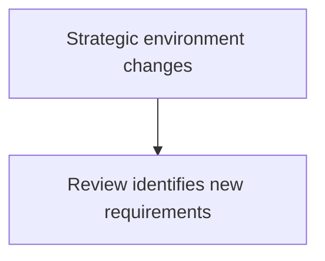
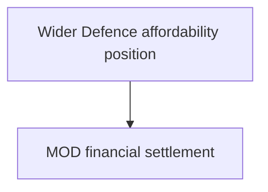

# 🧩 Training Debrief — Silent Truncation Audit
**Audit date:** 2026-09-07  
**Scope:** `🌓_3_In_The_Moment/📲_Press_Matters/🌊_Playing_Defence/🪖_Training_Debrief/`

---

## 🧭 Audit question

Check whether any other Training Debrief nodes suffered silent truncation.

Method:

- compare the supplied source captures against `notes.txt`;
- compare the supplied source captures against the first cleaned/House-Style bundle;
- inspect endings;
- inspect Markdown / Mermaid fences;
- inspect source lists;
- inspect Carry Forward / Cross-links;
- inspect Footer structure;
- pay particular attention to the longest nodes and files with suspicious endings.

This audit distinguishes three different failure types:

1. **source-level truncation** — part of the actual drafted node is missing;
2. **dirty capture** — the node is substantially complete but includes wrapper fences, assistant commentary or rendering debris;
3. **cleanup-induced loss** — the original source contained legitimate material which the first House-Style cleanup accidentally removed.

Those are not the same problem.

---

## 🩺 Overall verdict

### No additional source-level silent truncation was found

Beyond the two already-identified failures:

- `🧠_assessment_and_differential.md`;
- `🪟_transparency_and_earned_loyalty.md`;

the remaining substantive source files appear to contain coherent bodies whose scope matches the intended node descriptions in `notes.txt`.

The two known gaps have now been separately recovered/reconstructed.

### But the first cleanup pass did introduce some losses

Several cleaned files lost legitimate terminal material while their Footers were being standardised.

The most commonly affected material was:

- `## 📡 Carry Forward`;
- `## 📡 Next`;
- `## 📚 Initial sources`;
- `📚 Sources`.

This is not evidence that the original drafts were truncated.

It is evidence that the **cleanup transform was too aggressive around terminal sections**.

### One cleaned file is structurally broken

`🚑_immediate_management.md` contains a malformed Mermaid close in the first diagram:

```text
````
```

followed by a stray:

```text
```
```

The source body is intact, but the cleaned Markdown requires repair.

---

## 📊 Node-by-node verdict

| Node | Source-level truncation? | Notes alignment | Structural / cleanup finding | Verdict |
|---|---|---|---|---|
| `🩺_presenting_complaint.md` | **No evidence** | Strong | Source ends coherently, but lacks current Footer; first cleanup removed `Next` + `Initial sources` | **Substantively intact; restore terminal material** |
| `📋_history_of_presenting_complaint.md` | **No evidence** | Strong | Source contains one unclosed Mermaid block; prose continues coherently afterwards; cleanup repaired fence | **Intact; markup defect only** |
| `🔬_tests_and_investigations.md` | **No evidence** | Strong | Source body and diagrams coherent; first cleanup removed `Carry Forward` | **Intact; restore routing section** |
| `🚑_immediate_management.md` | **No evidence** | Strong | Source contains wrapper/postamble debris; first cleanup removed `Carry Forward` + `Initial sources`; cleaned first Mermaid is malformed | **Intact source; cleaned file needs repair** |
| `💊_long_term_management.md` | **No evidence** | Strong | Source has wrapper/postamble debris; first cleanup removed `Carry Forward` | **Intact; restore routing section** |
| `🛡️_prevention_and_resilience.md` | **No evidence** | Strong | Source has wrapper/postamble debris; first cleanup removed `Carry Forward` | **Intact; restore routing section** |
| `⚙️_the_feedback_machine.md` | **No evidence** | Strong | Very long source remains coherent through full Footer; first cleanup removed `Carry Forward` + `Initial sources` | **Intact; restore provenance/routing** |
| `🪖_what_training_is_for.md` | **No evidence** | Strong | Very long source remains coherent through full Footer; first cleanup removed `Carry Forward` + `Initial sources` | **Intact; restore provenance/routing** |
| `💷_thirty_million_pounds.md` | **No evidence** | Strong | Source has one unclosed Mermaid block; cleanup repaired it; first cleanup removed `Carry Forward` + `Sources` | **Intact; restore sources/routing** |
| `🧾_the_blank_cheque_exercise.md` | **No evidence** | Strong | Long body and Cross-links survive; no material truncation signal identified | **Intact** |
| `🔭_what_does_ready_actually_look_like.md` | **No evidence** | Strong | Long body, Initial sources and Cross-links survive; fences balanced | **Intact** |
| `🧠_assessment_and_differential.md` | **Yes — known** | Strong surviving scope | Original supplied source stopped during first Mermaid diagram | **Recovered/reconstructed separately** |
| `🪟_transparency_and_earned_loyalty.md` | **Yes — known** | Strong surviving scope | Original supplied file was only the index description | **Recovered from chat history and repaired separately** |

---

## 🔎 Comparison with `notes.txt`

The intended division of labour recorded in `notes.txt` is still recognisable across the surviving files.

### `🩺_presenting_complaint.md`

`notes.txt` assigns it:

- the immediate Army collective-training cut;
- Forces reaction;
- what stopped;
- what remains protected;
- why personnel are concerned;
- what is not yet known.

The supplied source covers those functions.

No missing middle or abrupt conceptual break was identified.

The suspicious feature is only the absence of the newer House-Style Footer and the first cleanup's removal of its `Next` and `Initial sources` sections.

### `📋_history_of_presenting_complaint.md`

`notes.txt` assigns it:

- post-war force changes;
- Falklands;
- Balkans;
- 9/11;
- Iraq / Afghanistan;
- austerity;
- Army 2020;
- Ukraine;
- SDRs;
- current readiness policy;
- recurring recommendations and implementation gaps.

The supplied source contains that historical sweep and ends with the intended proposition:

> History does not tell us who to blame for the current complaint.  
> It tells us which questions Britain has already paid to learn how to ask.

The missing Mermaid fence occurs substantially before the ending.

That is a formatting defect, not a truncation point.

### `🔬_tests_and_investigations.md`

`notes.txt` assigns it:

- decision chain;
- training requirements;
- personnel;
- estate;
- equipment;
- service comparison;
- readiness measures;
- future-planning questions.

The source covers that diagnostic programme.

Its ending is complete.

The first cleanup removed its routing section, not its investigative body.

### `🚑_immediate_management.md`

`notes.txt` assigns it practical routes for:

- Streeting;
- Healey;
- Burnham;
- Treasury;
- MOD;
- Army leadership.

The source contains those actor-specific interventions and a coherent final management proposition.

The capture includes assistant commentary after the completed Footer.

That postamble should be removed.

The actual node body should not.

### `💊_long_term_management.md`

`notes.txt` assigns it five-to-fifty-year reform of:

- people;
- instructors;
- recruitment;
- retention;
- estate;
- equipment;
- medicine;
- rehabilitation;
- veterans;
- industry;
- institutional knowledge.

Those areas appear in the source.

The source reaches a deliberate ending and then contains assistant commentary outside the node.

No silent truncation signal identified.

### `🛡️_prevention_and_resilience.md`

`notes.txt` assigns it:

- adaptability;
- spare capacity;
- learning systems;
- redundancy;
- institutional memory;
- resilience against strategic surprise.

The source covers those functions and reaches the intended "make being partly wrong cheaper" resilience logic.

No source-level truncation identified.

### `⚙️_the_feedback_machine.md`

`notes.txt` calls this the cybernetic core:

- front-line experience;
- training;
- doctrine;
- command;
- procurement;
- MOD;
- ministers;
- Treasury;
- delayed / distorted / suppressed feedback.

The very long source carries this architecture all the way to a coherent Footer.

Its length does not appear to have caused source capture failure.

The first cleanup did, however, remove the original `Carry Forward` and `Initial sources` sections.

### `🪖_what_training_is_for.md`

`notes.txt` assigns it:

- tacit knowledge;
- cohesion;
- live exercises;
- simulation;
- stress inoculation;
- skill decay;
- overfitting;
- unlearning.

The long source contains those subjects and reaches the intended "orchestra still has to rehearse" conclusion.

No source-level truncation identified.

Again, terminal routing/provenance was lost during cleanup.

### `💷_thirty_million_pounds.md`

`notes.txt` assigns it:

- who knew what when;
- why Army training was selected;
- alternatives;
- protected spending;
- accepted readiness risk.

The source contains the handover chronology, £30m counterfactual, service asymmetry, risk ownership and public-answer test.

Its single missing Mermaid close is followed by the rest of the node.

The node was therefore not truncated at that point.

The first cleanup accidentally removed the source list and Carry Forward section.

### `🧾_the_blank_cheque_exercise.md`

`notes.txt` assigns it:

- ideal force;
- desired training system;
- cross-service asks;
- joint-command opportunities;
- disagreements;
- costs;
- minimum credible alternatives.

The long source covers these functions and reaches a complete ending.

No material loss identified.

### `🔭_what_does_ready_actually_look_like.md`

`notes.txt` assigns it:

- functional readiness outputs before KPIs or spending;
- scale;
- duration;
- people;
- allies;
- logistics;
- support;
- evidence proving capability.

The long source covers these functions, includes the senior-governance/counter-specialisation layer, and retains Initial sources.

No truncation signal identified.

---

## 🧱 Structural defects in the supplied source captures

### `📋_history_of_presenting_complaint.md`

One Mermaid block begins but does not close.

The affected section is the recurring-loop diagram beginning:



The prose continues normally after the diagram.

**Action:** add the missing closing triple fence.

### `💷_thirty_million_pounds.md`

One Mermaid block begins but does not close.

The affected section is the decision-chain diagram beginning:



The prose continues normally afterwards.

**Action:** add the missing closing triple fence.

### `🚑_immediate_management.md`

The source capture contains outer rendering fences and assistant postamble material.

Those are capture artefacts.

The first cleanup removed the debris, but left the opening diagram with a four-backtick close followed by a stray triple fence.

**Action:** repair the first Mermaid block to one normal opening and one normal closing triple fence.

---

## 🧹 Cleanup-induced losses

The first House-Style bundle should not be treated as lossless.

### Restore to `🩺_presenting_complaint.md`

- `## 📡 Next`
- `## 📚 Initial sources`

### Restore to `🔬_tests_and_investigations.md`

- `## 📡 Carry Forward`

### Restore to `🚑_immediate_management.md`

- `## 📡 Carry Forward`
- `## 📚 Initial sources`

### Restore to `💊_long_term_management.md`

- `## 📡 Carry Forward`

### Restore to `🛡️_prevention_and_resilience.md`

- `## 📡 Carry Forward`

### Restore to `⚙️_the_feedback_machine.md`

- `## 📡 Carry Forward`
- `## 📚 Initial sources`

### Restore to `🪖_what_training_is_for.md`

- `## 📡 Carry Forward`
- `## 📚 Initial sources`

### Restore to `💷_thirty_million_pounds.md`

- `📡 Carry Forward`
- `📚 Sources`

These sections can be reconciled with the new Footer Cross-links rather than duplicated blindly.

The correct editorial question is:

> **Does this information belong in the body as routing/provenance, or has the current Footer already absorbed it without losing meaning?**

Source lists should not disappear merely because Cross-links have been standardised.

---

## 🧪 Long-node rendering-risk check

The longest supplied nodes were specifically checked because rendering/copy failure was most plausible there.

### `🔭_what_does_ready_actually_look_like.md`

Approximately 2,700 source lines.

- coherent ending;
- balanced code fences;
- Initial sources present;
- Cross-links present;
- no abrupt semantic cutoff.

**Verdict:** no silent truncation signal.

### `🧾_the_blank_cheque_exercise.md`

Approximately 2,300 source lines.

- coherent ending;
- balanced code fences;
- Cross-links present;
- no abrupt semantic cutoff.

**Verdict:** no silent truncation signal.

### `⚙️_the_feedback_machine.md`

Approximately 2,170 source lines.

- coherent ending;
- balanced fences;
- complete Footer;
- original sources/routing present before cleanup.

**Verdict:** no source truncation; cleanup lost terminal provenance/routing.

### `🪖_what_training_is_for.md`

Approximately 2,090 source lines.

- coherent ending;
- balanced fences;
- complete Footer;
- original sources/routing present before cleanup.

**Verdict:** no source truncation; cleanup lost terminal provenance/routing.

### `💊_long_term_management.md` / `🛡️_prevention_and_resilience.md`

Both long sources reach coherent conclusions and then contain obvious assistant commentary outside the completed node.

**Verdict:** dirty capture, not truncation.

---

## 🧭 What this changes in the TODO list

The old task:

- [ ] Check whether any other nodes suffered silent truncation

can now become:

- [x] **Check whether any other nodes suffered silent truncation**
  - No additional source-level truncation found.
  - `🧠` and `🪟` remain the only confirmed original capture failures and have now been separately recovered/rebuilt.

But add a new repair task:

- [ ] **Repair cleanup-induced terminal losses**
  - restore or deliberately re-route source lists;
  - restore or reconcile Carry Forward / Next sections;
  - repair `🚑` Mermaid fencing;
  - replace the old cleaned `🧠` and `🪟` placeholders with their recovered finished files.

---

## ✅ Recommended next pass

Before moving to the `/data/` provenance layer:

1. repair `🚑_immediate_management.md` fencing;
2. restore/reconcile terminal provenance and routing in the eight affected nodes;
3. insert the finished `🧠_assessment_and_differential.md`;
4. insert the finished `🪟_transparency_and_earned_loyalty.md`;
5. run one final mechanical check for:
   - exactly one H1;
   - balanced fences;
   - Constellations → `---` → Stardust → `---` → Footer;
   - Cross-links;
   - breadcrumb appendix;
   - source list where the source draft contained one;
   - absolute final `_Last updated:_` line.

After that, the cluster is safe to move into the six-file `/data/` build without carrying known capture defects forward.

---

*Survivor authorship is sovereign. Containment is never neutral.*

_Last updated: 2026-09-07_
