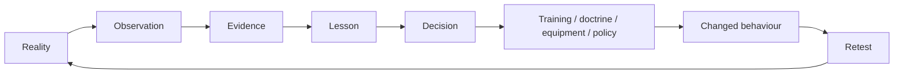
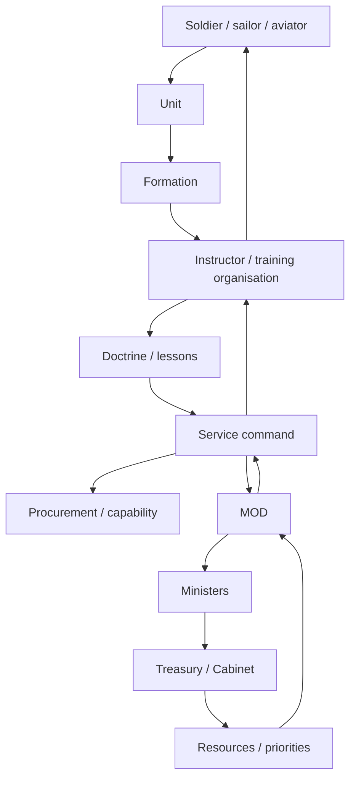
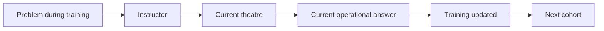
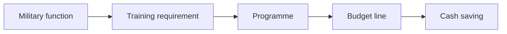
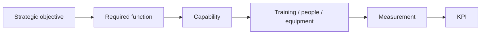
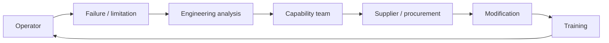
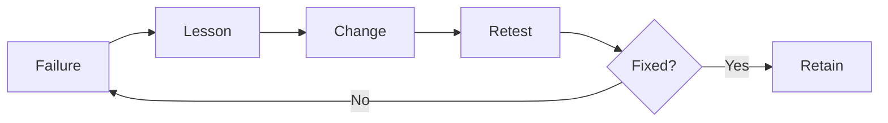
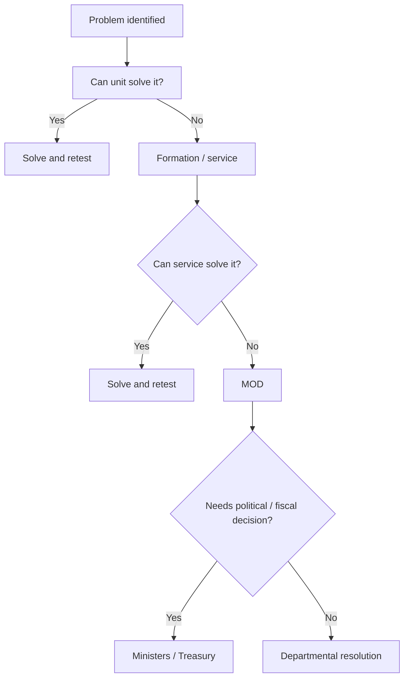
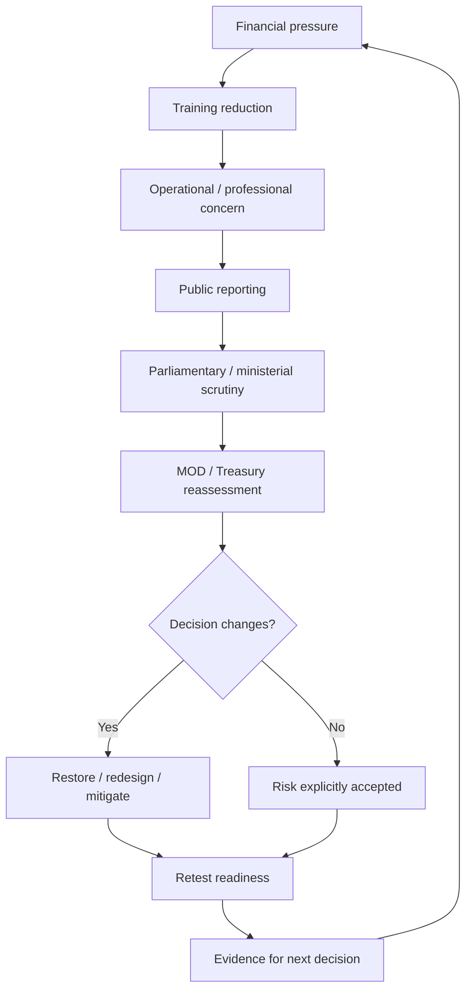
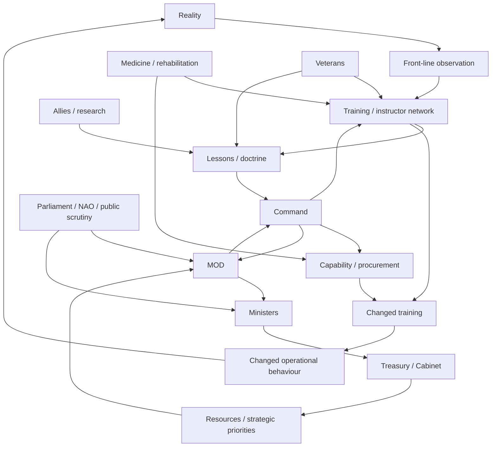

# ⚙️ The Feedback Machine

**First created:** 2026-09-07 | **Last updated:** 2026-09-07
*The cybernetic core of Training Debrief: how operational experience becomes institutional knowledge, how knowledge becomes changed behaviour, and where the signal gets lost.*

---

## ⚙️ Orientation

An Army learns when reality changes what it does next.

That sounds obvious.

It is not.

Military organisations generate extraordinary quantities of information:

* exercises;
* operations;
* casualties;
* equipment failures;
* logistics failures;
* intelligence;
* after-action reviews;
* instructors;
* allies;
* research;
* procurement trials;
* medical evidence;
* soldiers saying:

> **this does not fucking work.**

But information existing somewhere inside an institution is not the same thing as the institution learning.

The cybernetic question is:

> **Does useful information change future behaviour?**

That requires a feedback machine.

---

## 🔁 1. The basic loop

At its simplest:



Every arrow matters.

A failure anywhere in the loop can produce institutional non-learning.

---

## 🧠 2. Information is not feedback

Suppose a platoon discovers during an exercise that:

> a procedure does not work under realistic conditions.

Several things can happen.

### Level 1 — observation

Someone notices.

### Level 2 — recording

Someone writes it down.

### Level 3 — transmission

The finding reaches someone able to act.

### Level 4 — interpretation

The institution correctly understands why it happened.

### Level 5 — decision

Something changes.

### Level 6 — implementation

The change reaches the people who need it.

### Level 7 — validation

The new approach is tested.

Only then has the loop actually closed.

Everything before that is merely:

> **information in transit.**

---

## 📡 3. The full Defence feedback chain

Operational information may need to travel through something like:



That is not one feedback loop.

It is a network of nested loops.

And each institutional boundary creates an opportunity for:

* delay;
* distortion;
* abstraction;
* suppression;
* misunderstanding.

---

## 🪖 4. Start at the sharp end

The people closest to an operational system often encounter failure first.

They discover:

* equipment that behaves differently from specification;
* procedures that become awkward under stress;
* logistics that take longer than planned;
* communications that fail;
* assumptions that do not survive terrain;
* training that did not prepare them;
* threats which doctrine did not anticipate.

That information is valuable because it is generated by:

> **contact between the designed system and reality.**

But proximity to the problem does not automatically mean possessing the whole explanation.

The soldier may know:

> **this thing keeps fucking failing.**

An engineer may know why.

A logistician may know why the replacement never arrives.

Procurement may know why the contract cannot easily change.

Treasury may know why money cannot move.

Good feedback architecture joins those perspectives.

It does not declare one layer omniscient.

---

## 🧩 5. Rank is context, not a truth score

Hierarchy matters in military organisations.

Authority matters.

Experience matters.

But:

> **rank is not a truth score.**

A junior technician may understand a specific technical failure better than a general.

A general may understand strategic constraints invisible to the technician.

An instructor may see the same error repeated across twenty units.

A civil servant may see the procurement structure producing it.

A minister may see competing national priorities.

The feedback machine works when those forms of knowledge can be combined.

It fails when:

> **who said it**

becomes more important than:

> **whether it is true.**

---

## 🎓 6. Instructors are information routers

This is one reason instructors matter so much.

An instructor does not merely transmit established knowledge from institution to trainee.

A good instructor sits between:

> **what the institution thinks happens**

and:

> **what practitioners report actually happens.**

That makes training organisations unusually important cybernetic nodes.

They can:

* receive operational lessons;
* compare experiences across units;
* identify repeated patterns;
* modify training;
* test new behaviour;
* send findings back upwards.

An instructor corps is therefore partly:

> **the military's nervous system.**

Under-resource it and you are not merely reducing teaching capacity.

You may be reducing the institution's ability to feel.

---

## ⚡ 7. The fast loop

Simon Akam's account of Iraq and Afghanistan contains examples of very fast operational learning.

One especially useful example is almost comically simple.

During IED-search training, an instructor encounters a question about the calibration of a Valon detector.

Rather than relying upon an old manual or waiting for a formal doctrine cycle, the instructor contacts Afghanistan.

The answer returns.

Training changes.

The loop is approximately:



That is beautiful cybernetics.

Reality reaches the next person before the institution has time to fossilise the old answer.

---

## 🧈 8. The feedback needs to move like fucking butter

That does not mean:

> eliminate governance.

Some information requires:

* verification;
* safety review;
* intelligence handling;
* legal assessment;
* engineering testing;
* procurement approval.

The goal is not frictionlessness.

The goal is:

> **the minimum friction required to preserve accuracy, safety and accountability.**

Like a surgical glove.

You need the glove.

But if the glove is so thick that nobody can feel what they are touching:

the control has defeated the function.

> **Do not abolish the glove. Make the fucking glove fit.**

---

## 🐌 9. The slow loop

Some lessons cannot move at operational speed.

Changing:

* doctrine;
* major equipment;
* force structure;
* contracts;
* legislation;
* strategic policy;

can take years.

That is not automatically failure.

The problem appears when:

> **slow becomes indefinitely delayed.**

A healthy slow loop looks like:

```text
problem identified
→ evidence gathered
→ decision required
→ owner identified
→ change implemented
→ outcome retested
```

An unhealthy slow loop looks like:

```text
problem identified
→ review
→ consultation
→ report
→ recommendation
→ new review
→ organisational restructure
→ nobody remembers why we started
```

---

## 📉 10. Latency is itself a readiness variable

One of the most useful measures for a learning institution is:

> **How long does it take for valid negative information to change practice?**

Different lessons will have different legitimate timelines.

But the institution should know its latency.

For example:

| Feedback type                 | Appropriate timescale |
| ----------------------------- | --------------------- |
| Immediate training correction | hours / days          |
| Tactical procedure            | days / weeks          |
| Instructor package            | weeks                 |
| Doctrine                      | months                |
| Equipment modification        | months / years        |
| Procurement architecture      | years                 |
| Force design                  | years                 |
| Strategic settlement          | years                 |

The point is not rigid targets.

It is detecting pathological delay.

---

## 📉 11. Signal attenuation

Information can lose force as it moves upwards.

For example:

```text
“We cannot reliably perform X”
        ↓
“We are experiencing difficulty with X”
        ↓
“There are challenges around X”
        ↓
“X remains under review”
        ↓
“Delivery continues”
```

Every sentence may be technically defensible.

The final recipient may nevertheless receive a completely different understanding of reality.

That is signal attenuation.

---

## 🪄 12. The euphemism gradient

Large organisations develop languages which make difficult information easier to process.

Sometimes that is useful.

Sometimes it becomes anaesthetic.

Possible translations include:

> failure → challenge

> shortage → pressure

> unavailable → constrained

> cancelled → reprioritised

> risk → opportunity

> cannot → difficult

> we warned you → lessons identified

None of those words is inherently dishonest.

The problem is cumulative.

If every layer removes a little emotional and operational force from the message, senior decision-makers may eventually receive:

> **perfectly polished nonsense.**

---

## 🧾 13. Financial translation can erase capability

The same thing happens when military information enters financial systems.

An exercise may begin as:

> **required collective rehearsal for function X.**

Then become:

> training activity.

Then:

> discretionary activity.

Then:

> £30 million expenditure.

By the time Treasury sees the line, the capability may have disappeared from the description.



The reverse translation must therefore remain possible:


If nobody can perform that reverse translation:

the financial system is operating partly blind.

---

## 💷 14. Treasury needs feedback too

Treasury is not outside the cybernetic system.

It is one of its control nodes.

Treasury receives information about:

* affordability;
* forecasts;
* spending;
* programme performance;
* departmental priorities.

But if the information reaching Treasury says only:

> **MOD can save £30 million by reducing training**

without preserving:

> **what operational output changes**

then Treasury cannot properly compare risks.

The Treasury question should therefore be:

> **What capability consequence attaches to this saving?**

Not because Treasury should command exercises.

Because financial control without functional feedback can optimise the wrong variable.

---

## 🎯 15. Goodhart is waiting in the bushes

Once a measure becomes important, institutions begin optimising around it.

That is dangerous in readiness.

Suppose the KPI is:

> percentage of mandatory training completed.

The institution may become excellent at completing mandatory training.

That does not necessarily mean:

> formations can fight.

Likewise:

* recruitment target met;
* exercise conducted;
* equipment delivered;
* spending target achieved;
* review recommendation closed.

All can become administratively green while function remains weak.

The feedback machine therefore needs to keep asking:

> **Did the underlying capability improve?**

---

## 🔭 16. Objectives before indicators

This is why the sequence should be:



Not:

```text
KPI
→ activity
→ target achieved
→ presumably capability
```

KPIs are instruments.

They are not the patient.

---

## 🧪 17. Exercises are sensors

An exercise is not merely preparation.

It is also an experiment.

It asks:

> **Does the system actually work?**

A useful exercise may discover:

* radios fail;
* logistics are slow;
* doctrine is wrong;
* command is confused;
* equipment interfaces badly;
* medical assumptions are unrealistic.

That is not necessarily an unsuccessful exercise.

It may be a very successful sensor.

The dangerous exercise is the one designed primarily to demonstrate that everything already works.

---

## 💥 18. Failure in training is cheap information

The whole point of rehearsal is partly to fail somewhere safer.

If twelve things break during an exercise and the institution fixes all twelve before combat:

excellent.

If nobody wants twelve things to break because the exercise must demonstrate readiness:

the feedback function has been inverted.

The exercise has become:

> performance

rather than:

> measurement.

---

## 🩻 19. Near-misses are information too

The system should capture:

> **that nearly went wrong**

rather than waiting for:

> **that went wrong.**

Near-misses reveal:

* lucky timing;
* hidden workload;
* fragile assumptions;
* human workarounds;
* almost-exhausted capacity.

A near-miss is often an unusually cheap lesson.

Use it.

---

## 🧯 20. Human workarounds can hide broken systems

Military personnel are extremely good at adaptation.

That is operationally useful.

Institutionally, it can conceal pathology.

Suppose a process requires ten hours.

Personnel quietly work fourteen.

Output arrives.

Dashboard:

> green.

The system learns:

> capacity adequate.

Reality:

> humans absorbed four hours of institutional failure.

Repeat that often enough and:

> **the better people are at coping with a broken system, the longer the broken system can look functional.**

The feedback machine must therefore capture the workaround.

Not merely the output.

---

## 🧠 21. Tacit knowledge is real data

Not every important observation arrives as a spreadsheet.

People know things through:

* repeated experience;
* pattern recognition;
* physical handling;
* professional judgement.

That knowledge can be difficult to formalise.

It should not therefore be discarded as:

> anecdotal.

Anecdote is weak evidence for prevalence.

Repeated professional observation can be strong evidence that:

> **something requires investigation.**

The feedback machine needs routes for qualitative signals to trigger quantitative inquiry.

---

## 🔬 22. One complaint is not proof

The reverse matters too.

Someone saying:

> this is broken

does not automatically prove systemic failure.

The appropriate loop is:

```text
signal
→ investigate
→ compare
→ test
→ decide
```

Not:

```text
signal
→ ignore
```

and not:

```text
signal
→ immediately redesign entire Army
```

Listening is not the same as automatically agreeing.

---

## 🪖 23. Afghanistan: adaptation and overfitting

The Afghanistan training system became increasingly effective at teaching lessons generated by Afghanistan.

That was good.

It also created a future problem.

Repeated adaptation can produce assumptions so embedded that people stop noticing they are assumptions.

Examples included expectations around:

* air superiority;
* casualty evacuation;
* IED threat;
* counterinsurgency;
* tactical tempo.

When the strategic problem changed, some learned behaviour had to be actively unlearned.

At Brecon, Iraq and Afghanistan veterans could reflexively stop to treat casualties and prepare helicopter landing zones.

For a different type of fight, instructors sometimes had to re-teach:

> **“Fucking leave him and come back for him!”**

That line matters because it demonstrates something important:

> **learning can itself become the next thing that needs correcting.**

---

## 🔄 24. Unlearning is training too

A learning organisation does not merely accumulate lessons.

It also removes lessons whose assumptions no longer hold.

Therefore doctrine and training should periodically ask:

* what behaviour are we reinforcing?
* what assumptions created it?
* are those assumptions still valid?
* what would make the behaviour dangerous?

Institutional memory without institutional revision becomes dogma.

---

## 🧭 25. Context labels should travel with lessons

Every lesson should ideally retain information about:

* where it was learned;
* under what conditions;
* against what threat;
* with what equipment;
* with what allies;
* under what legal constraints.

That helps later users distinguish:

> **universal principle**

from:

> **context-specific adaptation.**

For example:

> logistics matters

is broad.

> helicopter evacuation will always be available within a particular timeframe

is not.

Do not store those two forms of knowledge as if they possess the same portability.

---

## 🗺️ 26. Ukraine should feed the machine without becoming the machine

Ukraine is generating enormous quantities of military learning around:

* drones;
* electronic warfare;
* artillery;
* air defence;
* logistics;
* mobilisation;
* casualty replacement;
* industrial endurance.

Britain should absorb that aggressively.

But:

> **the next war is not guaranteed to be Ukraine with different flags.**

The cybernetic task is therefore:

```text
observe Ukraine
→ identify mechanisms
→ test against British requirements
→ adapt
→ exercise
→ retain what survives testing
```

Not:

```text
Ukraine did X
→ everyone do X forever
```

---

## 🎓 27. Instructor prestige affects information quality

If instructor postings are:

* under-resourced;
* career-limiting;
* lower prestige;
* disconnected from current operations;

the feedback machine degrades.

The people translating operational learning into the next cohort need:

* credibility;
* currency;
* expertise;
* institutional influence.

Otherwise information arrives but does not carry enough organisational weight to change behaviour.

Akam's account of OPTAG is useful precisely because improving training required improving the status and quality of the institution doing the teaching.

---

## ❄️ 28. Command is an information filter

Commanders cannot receive every raw observation.

Filtering is necessary.

The problem is not filtering.

The problem is filtering without preserving:

* severity;
* uncertainty;
* dissent;
* recurrence.

A useful command summary should answer:

> What happened?

> How confident are we?

> How often?

> What is the consequence?

> Who disagrees?

> What needs deciding?

Compression should reduce volume.

Not meaning.

---

## 🧠 29. Senior leaders need protected access to ugly information

One of the easiest ways to make a system stupid is to ensure senior leaders only encounter information after everybody has made it presentable.

Senior leaders should periodically receive:

* raw after-action themes;
* dissenting assessments;
* instructor feedback;
* frontline observations;
* technical warnings.

Not every complaint.

Enough unpolished information to calibrate whether the polished briefings still resemble reality.

---

## 🪟 30. The translation layer matters

Operational people and strategic leaders often speak different languages.

One may say:

> **We cannot do X safely at this tempo.**

Another needs:

> capability impact, probability, cost, alternative, decision required.

Translation is legitimate.

The problem comes when translation becomes substitution.

The strategic version should preserve the operational meaning.

This is why the system needs people who can move between:

* tactical;
* operational;
* strategic;
* financial;
* political;

without flattening one into another.

---

## 🧾 31. Procurement is another feedback loop

Equipment learning should flow:



Possible failure points include:

* contract rigidity;
* intellectual-property barriers;
* slow approvals;
* supplier incentives;
* safety certification;
* budget cycles;
* requirements frozen too early.

The question is not simply:

> **Is procurement slow?**

Some procurement should be slow.

The question is:

> **Can valid operational feedback alter the thing being procured before the problem becomes obsolete?**

---

## 🛒 32. Procurement should remember why the requirement exists

Requirements can become detached from their originating problem.

Eventually an institution may optimise delivery of:

> Requirement 14B

while nobody can clearly explain:

> **what operational problem 14B was meant to solve.**

Every significant requirement should preserve a line back to:

* operational need;
* evidence;
* user;
* intended capability.

Otherwise procurement can become cybernetically closed:

> procurement measures procurement.

---

## 🧱 33. Contracts can become memory

Contracts are not merely financial instruments.

They can fossilise old assumptions.

A ten-year contract may encode:

* staffing assumptions;
* technology assumptions;
* training assumptions;
* supply assumptions.

If the environment changes faster than the contract:

the institution needs mechanisms for adaptation.

Otherwise yesterday's requirement becomes tomorrow's constraint.

---

## 🩺 34. Medical feedback belongs in the loop

Casualty data can reveal:

* equipment problems;
* training gaps;
* protective-equipment limitations;
* evacuation assumptions;
* occupational injury;
* rehabilitation requirements.

Medicine therefore should not sit downstream as:

> **what happens after military activity.**

Medical evidence should travel back into:

* training;
* equipment;
* doctrine;
* personnel policy;
* force design.

The injured body can contain information about the system that injured it.

The state has an obligation to listen.

---

## 🦿 35. Rehabilitation generates knowledge too

Rehabilitation teams learn:

* what injuries persist;
* which equipment restores function;
* what environments create barriers;
* what occupational demands matter;
* what long-term consequences were underestimated.

That information can improve:

* prevention;
* protective equipment;
* training;
* medical planning;
* veteran policy.

The feedback loop should not stop when someone leaves the battlefield.

Or when someone leaves uniform.

---

## 🎖️ 36. Veterans remain part of institutional memory

Veterans may hold information about:

* operational practice;
* equipment;
* leadership;
* injury;
* transition;
* long-term consequences.

Some of that information becomes more visible only after service.

A mature system needs safe ways to hear it.

Not because every veteran account is universally representative.

Because institutional time horizons should extend beyond the employment contract.

---

## 📚 37. Reviews are sensors, not treatment

Britain is very good at producing reviews.

A review can:

* gather evidence;
* identify patterns;
* propose intervention.

It cannot implement itself.

Therefore:

> **review published**

must not be recorded as:

> **problem solved.**

The actual loop is:

```text
review
→ recommendation
→ owner
→ resource
→ implementation
→ test
→ outcome
```

Without the second half:

the review is diagnostic imaging left unread on the screen.

---

## 🔁 38. Repeated recommendations are diagnostic

If successive reviews repeatedly recommend:

* better procurement;
* improved readiness;
* stronger estate;
* better recruitment;
* better retention;
* improved lessons;
* greater jointness;

that recurrence is itself data.

The question becomes:

> **Why does the recommendation keep regenerating?**

Possible causes:

* never implemented;
* partially implemented;
* implemented then defunded;
* wrong intervention;
* new version of old problem;
* ownership lost;
* strategic environment changed.

A repeated recommendation should trigger implementation archaeology.

Not another surprised announcement.

---

## 🗃️ 39. Institutional memory needs version control

For each significant lesson or recommendation, retain:

```text
problem
→ evidence
→ recommendation
→ decision
→ owner
→ implementation
→ outcome
→ subsequent revision
```

This lets future officials answer:

> **Why do we do this?**

And:

> **Why did we stop doing the previous thing?**

Without that, institutional knowledge becomes folklore.

---

## 🧠 40. Preserve negative knowledge

Institutions particularly need to remember:

> **We tried this. It failed. Here is why.**

Otherwise failed ideas return wearing new branding.

Negative knowledge is strategically valuable because it reduces the number of mistakes each generation must personally rediscover.

---

## 🕳️ 41. Suppression can be deliberate or emergent

Not every lost lesson is censored.

Feedback can disappear through:

* hierarchy;
* workload;
* classification;
* bureaucracy;
* career incentives;
* reputational anxiety;
* poor record systems;
* departmental boundaries;
* staff turnover;
* political inconvenience.

Several mechanisms can produce the same observable outcome:

> **important information did not change behaviour.**

Do not infer motive before establishing mechanism.

But do not confuse absence of conspiracy with absence of failure.

---

## 🔒 42. Classification can protect information and imprison it

Some Defence information must remain classified.

Obviously.

But classification creates a cybernetic cost.

Information that cannot travel cannot easily teach.

The appropriate question is:

> **What is the least sensitive form of this lesson that still preserves its operational meaning?**

Perhaps:

* tactical detail remains classified;
* general failure mechanism becomes doctrine;
* aggregate lesson enters training;
* public version explains governance.

Security should control distribution.

It should not automatically terminate learning.

---

## 🪟 43. Transparency is an external feedback channel

Parliament, auditors, researchers, journalists and the public can all provide external feedback.

They may notice:

* repeated failure;
* contradictory policy;
* strange expenditure;
* institutional blind spots.

They will sometimes be wrong.

That is normal.

The correct response is not:

> outsiders cannot understand Defence.

It is:

> **which external signals deserve investigation?**

A closed institution loses access to sensors it does not control.

---

## 🧿 44. Bounded explanation protects the loop

The public does not need:

* live vulnerabilities;
* classified readiness data;
* operational plans;
* exploitable technical details.

But caution should not become fog.

The public can understand:

* system architecture;
* strategic purpose;
* aggregate constraints;
* governance;
* spending;
* historical lessons;
* implementation.

The Polaris rule remains:

> **The goal is bounded explanation.
> Not reckless disclosure.
> Not managed ignorance.**

That is not only a transparency principle.

It is cybernetic.

Outside scrutiny cannot correct a system it is forbidden even to conceptualise.

---

## 🧭 45. The Chris Brown problem

The Iraq lessons controversy provides a useful difficult case.

Lieutenant General Chris Brown produced a lessons report whose handling became controversial.

The report was restricted, revised and did not become the MOD's formal submission to the Chilcot process in its original form.

That can be read as evidence of institutional discomfort with negative feedback.

But there is another important layer.

Jock Stirrup later argued that the work was too tactical and insufficiently strategic, with opinion sometimes substituting for analysis.

Those propositions can coexist.

A report can contain important uncomfortable information **and** require better analytical translation.

That creates the deeper question:

> **How does tactical experience become valid strategic evidence?**

The answer cannot be:

> publish every frontline opinion unchanged.

Nor:

> senior people rewrite the uncomfortable bits until everyone feels better.

The feedback machine needs a translation layer which strengthens evidence without sterilising meaning.

---

## 🧪 46. Challenge should improve the signal

Good challenge asks:

* what is the evidence?
* what is anecdotal?
* what is representative?
* what alternative explanation exists?
* what confidence should attach?
* what strategic conclusion actually follows?

That should make a report harder to dismiss.

Challenge becomes dysfunctional when it asks:

> **How can we make this less embarrassing?**

The distinction is methodological.

Not cosmetic.

---

## 🧱 47. Accountability is part of cybernetics

This is the uncomfortable part.

Suppose:

```text
failure
→ lesson
→ procedure changed
→ nobody responsible
```

The institution may improve technically.

But incentives may remain unchanged.

If decision-makers repeatedly learn that poor decisions produce:

* new procedure;
* new training;
* new guidance;

but no consequence for the structures or incentives that produced the decision, the system receives incomplete feedback.

> **An institution cannot learn reliably if negative feedback changes procedures but never changes power.**

Accountability is not merely punishment.

It is one mechanism by which organisations update incentives.

---

## ⚖️ 48. Accountability needs calibration

The opposite failure is also possible.

If every honest mistake destroys a career:

people will hide mistakes.

That kills feedback.

Therefore distinguish:

* reasonable decision under uncertainty;
* understandable error;
* negligence;
* repeated failure;
* ignored warning;
* deliberate concealment;
* misconduct.

A learning institution needs:

> **psychological and professional safety for honest error**

alongside:

> **real consequences for culpable behaviour.**

Otherwise either fear or impunity destroys the loop.

---

## 🧨 49. “Consequences travel down; careers travel up”

This is a useful hypothesis to test, not a universal accusation.

Operational failure can impose consequences upon:

* junior personnel;
* casualties;
* families;
* instructors;
* units.

Senior institutional consequences may be less visible.

If that asymmetry exists repeatedly, it creates a cybernetic problem.

The people experiencing the strongest negative feedback may possess the least authority to change the system.

The people with the most authority may experience the weakest feedback.

That is exactly backwards.

---

## 🏦 50. Ministers and Treasury need the sharp end translated, not hidden

A minister does not need to know every tactical detail.

The Chancellor does not need to understand every exercise.

But they need the causal chain:

```text
decision
→ changed resource
→ changed activity
→ changed capability
→ changed risk
```

Without that:

political control becomes control over inputs rather than outcomes.

Civilian control works best when military expertise makes consequences legible enough for civilian leaders to make actual choices.

---

## 🪖 51. The military must also receive political feedback

The loop runs both ways.

Military professionals need to understand:

* political objectives;
* fiscal limits;
* legal constraints;
* public legitimacy;
* alliance priorities.

Otherwise military planning can optimise:

> **best military answer**

without recognising the wider state system.

Civilian leadership therefore also needs to communicate clearly:

> this is the objective;

> this is the constraint;

> this is the risk we are willing to accept.

Ambiguity at the political level propagates downwards too.

---

## 🧩 52. Strategic ambiguity creates operational noise

If government has not decided:

* what commitments matter most;
* what risk is acceptable;
* what future it is preparing for;

lower levels must infer.

Different parts of Defence may infer differently.

That produces:

* incompatible priorities;
* confused procurement;
* training mismatch;
* duplicated effort.

The feedback machine therefore requires a reasonably clear reference signal:

> **What is the system trying to achieve?**

Cybernetics without an objective is merely movement.

---

## 🔭 53. Readiness is the output signal

The ultimate question is not:

> Did information travel?

It is:

> **Did the system become more capable of doing what Britain requires?**

That is why this node connects directly to:

`🔭_what_does_ready_actually_look_like.md`

Without a functional definition of readiness, the feedback machine cannot tell whether its corrections worked.

---

## 🧪 54. Retest or it did not close

This deserves repetition.

After changing:

* doctrine;
* equipment;
* training;
* organisation;

test again.



A recommendation implemented is not the endpoint.

The endpoint is:

> **function improved.**

---

## 📊 55. Measure the feedback machine itself

Possible measures include:

* time from observation to decision;
* time from decision to implementation;
* percentage of lessons assigned an owner;
* percentage retested;
* recurrence of previously closed problems;
* instructor currency;
* number of unresolved high-risk lessons;
* proportion of major procurement changes originating in user feedback;
* number of recommendations repeatedly rediscovered.

Do not turn these into another meaningless dashboard.

Use them diagnostically.

---

## 🚦 56. Track stuck signals

A useful system could flag lessons that have become stuck at one boundary.

For example:

```text
front line → instructor       5 days
instructor → doctrine         20 days
doctrine → capability         80 days
capability → procurement      400 days
procurement → modification    ???
```

Now the bottleneck becomes visible.

The point is not:

> procurement bad.

The point is:

> **here is where this particular signal stopped moving.**

That is actionable.

---

## 🗺️ 57. Map who can change what

Feedback is useless if sent to someone without the relevant lever.

For each problem, identify:

| Problem                  | Likely control node        |
| ------------------------ | -------------------------- |
| Tactical procedure       | unit / training / doctrine |
| Instructor quality       | service command            |
| Equipment fault          | capability / procurement   |
| Estate shortage          | MOD / estate governance    |
| Personnel shortage       | service / MOD              |
| Budget rigidity          | MOD / Treasury             |
| Strategic overcommitment | ministers / Cabinet        |
| Legislative constraint   | government / Parliament    |

Then send the signal to the level capable of changing the variable.

Do not repeatedly ask the bottom of the system to compensate for something only the top can alter.

---

## 🧯 58. Escalation is part of feedback design

When a problem cannot be solved at one level:

it should move.



A system without escalation routes converts structural problems into local coping.

That is how workarounds become permanent.

---

## 🧠 59. Ask whether meaning survives the journey

At every institutional boundary:

> **What did the sender mean?**

> **What did the receiver hear?**

That question should be routine.

Especially across:

* military ↔ civil service;
* technical ↔ generalist;
* MOD ↔ Treasury;
* Defence ↔ Parliament;
* classified ↔ public.

Many apparent disagreements are partly translation failures.

Some are genuine disagreements.

The system needs to know which.

---

## 🧾 60. The September 2026 training problem is itself a feedback test

The current collective-training dispute gives us a live diagnostic opportunity.

The original signal may have been:

> Army affordability pressure.

That became:

> identify savings.

Then:

> reduce some collective training.

Now the signal is travelling back upwards through:

* Army concern;
* professional press;
* national press;
* Parliament;
* ministers;
* Treasury.

The question is:

> **Does the returning signal change the original decision?**

Maybe the answer should ultimately be:

> no.

Perhaps the reduction is rational.

But if so, the system should be able to explain:

* what risk was identified;
* what alternatives were tested;
* what mitigation exists;
* who accepted the trade-off.

That would demonstrate a functioning feedback machine.

---

## 🔁 61. The current loop



The interesting question is not whether the original decision survives.

It is whether the institution can **reconsider it intelligently**.

---

## 🧠 62. Healthy feedback does not guarantee agreement

This matters.

A soldier can warn.

Army Command can understand.

MOD can understand.

The minister can understand.

Treasury can understand.

And government can still decide:

> **No. We are accepting that risk.**

That can be legitimate civilian government.

The cybernetic requirement is not:

> frontline opinion always wins.

It is:

> **the decision-maker receives the signal intact enough to know what they are choosing.**

That is a much stronger model of democratic control.

---

## ⚠️ 63. Suppression begins when disagreement cannot travel

The dangerous condition is not:

> someone disagreed with the final decision.

It is:

> **the disagreement could not reach the final decision.**

Or arrived transformed into something unrecognisable.

That is when hierarchy stops coordinating information and begins obstructing it.

---

## 🪟 64. Public communication is the final translation layer

After government decides, another translation occurs:

> institution → public.

Again, compression is necessary.

But the public-facing explanation should preserve:

* objective;
* broad constraint;
* trade-off;
* mitigation;
* accountability.

Not:

> **everything remains world-leading, thank you for your interest.**

The public does not need every detail.

It needs enough of the map to understand what its government is doing.

---

## 🧠 65. The cybernetic failure modes

The principal failure modes across this cluster are therefore:

### Sensor failure

Nobody detects the problem.

### Reporting failure

Someone detects it but does not report it.

### Transmission failure

It is reported but does not reach the right level.

### Compression failure

The message loses meaning.

### Interpretation failure

The receiver misunderstands the cause.

### Decision failure

The wrong intervention is selected.

### Implementation failure

The intervention does not happen.

### Validation failure

Nobody checks whether it worked.

### Memory failure

The institution later forgets the lesson.

### Incentive failure

Nothing changes the conditions producing recurrence.

That is the differential diagnosis of institutional non-learning.

---

## 🩺 66. The information pathology test

Whenever the same Defence problem appears again, ask:

1. Did we know about this before?
2. Who knew?
3. When?
4. What did they report?
5. Where did the report go?
6. How was it translated?
7. Who could act?
8. What did they decide?
9. Was it funded?
10. Was it implemented?
11. Was it retested?
12. Why has the problem returned?

That sequence is much more useful than:

> **Why are these people incompetent?**

Sometimes they may have been.

First find where the signal died.

---

## 🧠 67. The deeper institutional diagnosis

A functioning Defence institution does not need perfect foresight.

It needs the capacity to notice:

> **we were wrong**

quickly enough to matter.

That is one of the most important military capabilities available.

Because no doctrine survives contact with every future.

No procurement programme predicts every threat.

No strategic review gets the next twenty years exactly right.

The advantage belongs partly to the institution which can update fastest without losing coherence.

---

## 🧭 68. The governing principle

The feedback machine should therefore optimise for:

> **accurate information reaching the person with the relevant lever before the information becomes obsolete.**

Everything else supports that.

* hierarchy;
* doctrine;
* reviews;
* procurement;
* data;
* dashboards;
* committees;
* Treasury controls.

They are machinery.

The output is adaptation.

---

## ⚙️ Working model



The arrows are the system.

The boxes are only where the information pauses.

---

## 🧈 Final rule

If the person at the bottom says:

> **this does not work**

and the person at the top eventually hears:

> **delivery remains broadly on track,**

the institution has an information problem.

If the person at the top says:

> **this is the strategic objective**

and the person at the bottom receives incompatible tasks without enough resources to execute it,

the institution also has an information problem.

The machine has to work in both directions.

> **Sharp-end reality upwards.
> Strategic intent downwards.
> Resources and authority towards the problem.
> Evidence back into the next decision.**

Make the feedback move like fucking butter.

---

---

## 🌌 Constellations
⚙️ 🪖 🧠 🎓 💷 🧾 🪟 🔁 — cybernetics; institutional learning; military training; lessons; doctrine; procurement; Treasury; accountability; feedback.

---

## ✨ Stardust
military cybernetics, defence feedback, institutional learning, british army, lessons learned, OPTAG, Simon Akam, military training, doctrine, procurement, treasury, readiness, after action review, organisational learning, defence accountability, negative feedback

---

## 🏮 Footer

*⚙️ The Feedback Machine* is a living node of the **Polaris Protocol**.  
It treats information flow as military capability: lessons matter only when they change behaviour and return to reality for testing.

> 📡 Cross-references:
>
> - [`🪖_what_training_is_for.md`](./🪖_what_training_is_for.md) — *training as rehearsal, sensor and adaptation mechanism*
> - [`💷_thirty_million_pounds.md`](./💷_thirty_million_pounds.md) — *how capability became a financial saving*
> - [`🪟_transparency_and_earned_loyalty.md`](./🪟_transparency_and_earned_loyalty.md) — *external feedback, scrutiny and public trust*
> - [`🧾_the_blank_cheque_exercise.md`](./🧾_the_blank_cheque_exercise.md) — *allowing unconstrained professional requirements to reach political decision-makers before affordability is reapplied*
> - [`🔭_what_does_ready_actually_look_like.md`](./🔭_what_does_ready_actually_look_like.md) — *the output signal against which adaptation must be tested*
> - [`🔬_tests_and_investigations.md`](./🔬_tests_and_investigations.md) — *locating current information gaps*
> - [`🧠_assessment_and_differential.md`](./🧠_assessment_and_differential.md) — *distinguishing feedback failure from other causes*
> - [`data/strategic_reviews.md`](./data/strategic_reviews.md) — *repeated lessons and implementation*
>  
> 🏮 Return To:
>
> - [🪖 Training Debrief](./README.md) — *1up*
> - [🌊 Playing Defence](../README.md) — *2up*
> - [📲 Press Matters](../../README.md) — *3up*
> - [🌓 In The Moment](../../../README.md) — *4up*
> - [🌌 Polaris Protocol — Root](../../../../README.md) — *root*

*Survivor authorship is sovereign. Containment is never neutral.*

_Last updated: 2026-09-07_
