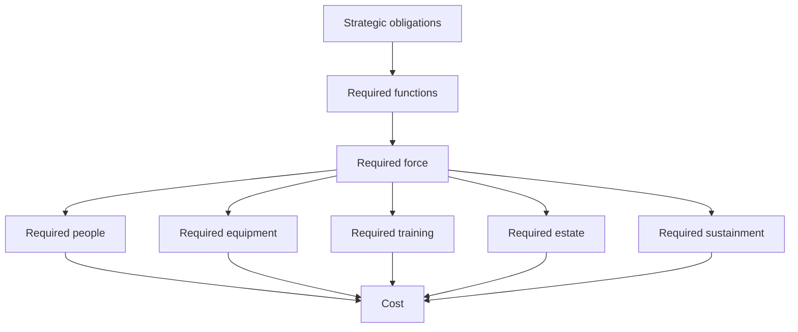
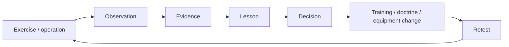
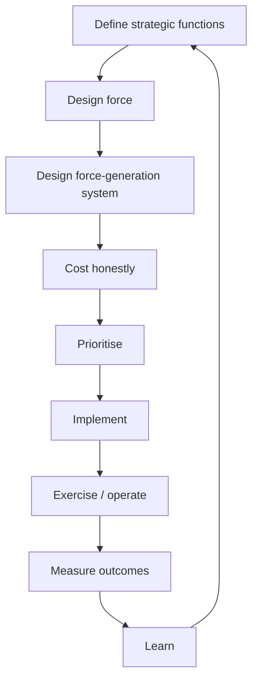

# 💊 Long-Term Management
**First created:** 2026-09-07 | **Last updated:** 2026-09-07  
*Five-to-fifty-year reform of British force generation: people, training, estate, equipment, medicine, industry and institutional knowledge.*

---

## 💊 Orientation

The immediate training problem can be stabilised.

That is not the same as curing the condition which produced it.

If Britain restores approximately £30 million of collective training tomorrow but leaves unchanged:

- recruitment;
- retention;
- instructor capacity;
- estate;
- equipment availability;
- medical support;
- rehabilitation;
- veterans' systems;
- industrial resilience;
- institutional memory;
- budget architecture;

then the next pressure will appear somewhere else.

Possibly training again.

Possibly maintenance.

Possibly accommodation.

Possibly people.

The long-term objective should therefore not be:

> **prevent this particular cancellation happening again.**

It should be:

> **build a force-generation system capable of repeatedly producing, sustaining, adapting and regenerating the military capability Britain's strategy requires.**

That is a much bigger project.

It also has to outlive governments.

---

## 🧬 Force generation is the patient

The visible military is not the whole military system.

A deployable formation emerges from a chain:

```mermaid
flowchart LR
    A["Recruit"] --> B["Train"]
    B --> C["Qualify"]
    C --> D["Join unit"]
    D --> E["Train collectively"]
    E --> F["Deploy / hold readiness"]
    F --> G["Recover"]
    G --> H["Retain / retrain"]
    H --> E
````

But each box depends upon another layer:

```text
people
+ instructors
+ estate
+ equipment
+ ammunition
+ logistics
+ medicine
+ families
+ housing
+ industry
+ data
+ institutional knowledge
+ money
= usable force
```

Remove enough supporting structure and the platform remains visible while the capability underneath becomes increasingly difficult to generate.

The long-term management plan therefore has to treat these things as one system.

---

## 🗓️ 1. Use several clocks at once

Defence planning becomes distorted when everything is forced into one electoral or spending-review cycle.

Different problems operate at radically different timescales.

### Five years

What can realistically be repaired, recruited, reordered or redesigned now?

### Ten years

What workforce, estate, training and industrial capacity needs deliberate rebuilding?

### Twenty-five years

What force-generation architecture should support the military of the 2050s?

### Fifty years

What national resilience should Britain want available in 2076?

These horizons should interact.

The fifty-year vision should not become science fiction.

The five-year plan should not become:

> **whatever survives until the next budget.**

---

## 🩺 2. Begin with functional requirements

Before choosing future force numbers, ask:

> **What must Britain actually be able to do?**

Then work backwards.



This order matters.

Otherwise the process becomes:

> available budget
> → force we can afford
> → strategy describing why that force was always exactly what we required.

That is backwards.

---

## 🧩 3. People are not interchangeable units

A personnel number tells us very little by itself.

A functioning force needs the right mixture of:

* ranks;
* trades;
* experience;
* instructors;
* engineers;
* logisticians;
* medics;
* maintainers;
* intelligence specialists;
* cyber personnel;
* operators;
* commanders.

Therefore long-term personnel planning should measure:

> **critical capability distribution**

not merely:

> **total headcount.**

Ten vacancies in one rare trade may matter more than hundreds elsewhere.

---

## 🎖️ 4. Recruitment begins long before application

Recruitment is often treated as:

> advertising → application → training pipeline.

That is too narrow.

People begin imagining careers much earlier.

They encounter:

* aircraft;
* ships;
* engineering;
* robotics;
* cyber;
* medicine;
* logistics;
* satellites;
* AI;
* underwater systems;
* family history;
* cadets;
* air shows;
* universities;
* apprenticeships;
* public-service narratives.

The long-term recruitment strategy should make the actual range of Defence work visible.

Not everyone comes through:

> warrior identity.

Some come through:

> **that looks technically difficult and useful.**

That is not lesser motivation.

It may be exactly the workforce future Defence needs.

---

## 🧰 5. Build multiple entry routes

A twenty-first-century force should not assume every useful person fits one standard career pattern.

Future routes could include:

* traditional regular service;
* reserves;
* accelerated specialist entry;
* technical apprenticeships;
* sponsored degrees;
* medical pathways;
* cyber pathways;
* engineering pathways;
* lateral entry;
* civilian Defence careers;
* industry secondments;
* allied exchange;
* academic fellowships.

The objective is not to dissolve the professional military.

It is to widen the routes through which relevant expertise can enter and remain connected to it.

---

## 🪜 6. Recruitment without retention is expensive theatre

A system which recruits people successfully and then loses them unnecessarily is paying repeatedly for the same capability.

Retention therefore has to be treated as a readiness function.

Investigate and manage:

* pay;
* housing;
* family stability;
* childcare;
* geographic disruption;
* career progression;
* training access;
* healthcare;
* administrative burden;
* dignity;
* predictable leave;
* equipment;
* meaningful work.

People will tolerate hardship for work they believe matters.

That does not mean institutions should deliberately manufacture unnecessary hardship as a character-building exercise.

---

## 🏠 7. Service families are part of force generation

A deployable person does not exist in a vacuum.

Family systems absorb:

* moves;
* separation;
* uncertainty;
* childcare;
* school disruption;
* housing problems;
* injury;
* deployment stress.

If family life becomes structurally incompatible with continued service, Defence loses experienced personnel.

Therefore:

> **family policy is retention policy.**

And retention policy is readiness policy.

The military household is not decorative welfare attached to the real force.

It is part of the system that allows experienced people to stay.

---

## 🎓 8. Make instruction prestigious

Akam's OPTAG history gives a clear lesson:

> **the institution does not automatically place its best expertise where it is most useful for learning.**

Instructor posts need to be attractive enough that excellent people want them.

Long-term reform should consider:

* promotion value;
* selection criteria;
* pay where appropriate;
* repeat instructor pathways;
* academic accreditation;
* exchange opportunities;
* operational currency;
* professional recognition.

Teaching the next cohort should not look like disappearing from the real career.

It is the real career.

---

## 🔁 9. Build an instructor reserve

High-intensity conflict could rapidly increase training demand.

Britain therefore needs more than enough instructors for the peacetime pipeline.

It needs surge capacity.

Potential sources include:

* reservists;
* recently retired personnel;
* veterans;
* civilian specialists;
* allies;
* industry;
* accredited instructors outside current full-time establishment.

That does not mean anyone who once served can instantly teach.

It means Britain should know:

> **who could be brought back, for what role, under what standards, within what timeframe.**

That is mobilisation planning for knowledge.

---

## 🧠 10. Treat institutional memory as capability

Experienced people carry information that databases do not fully capture.

They remember:

* what failed;
* why it failed;
* which workaround worked;
* which policy already existed under another name;
* which supplier promised what;
* which training method produced useful behaviour;
* which reform quietly died.

When those people leave, institutions can rediscover old lessons at enormous cost.

Therefore institutional knowledge needs deliberate preservation.

---

## Knowledge should exist in several forms

### Human

People who remember.

### Written

Doctrine, lessons, reports, histories.

### Searchable

Systems where previous findings can actually be found.

### Relational

People know who possesses unusual expertise.

### Practical

Skills are exercised rather than merely archived.

A PDF nobody can find is not institutional memory.

It is archaeology.

---

## ⚙️ 11. Preserve negative knowledge

Institutions are good at recording:

> what worked.

They must also preserve:

> **what we tried before and why we stopped.**

Otherwise old bad ideas return wearing:

* new branding;
* new consultants;
* new software;
* new PowerPoint.

A serious lessons architecture needs:

```text
problem
→ intervention
→ result
→ failure modes
→ why it changed
→ what would make it worth trying again
```

This prevents institutional amnesia from masquerading as innovation.

---

## 🏚️ 12. Treat estate as operational infrastructure

The Defence estate needs to be managed according to function, not merely ownership.

For each major site, ask:

* what capability does it generate?
* how much capacity does it have?
* what condition is it in?
* what would failure remove?
* what future demand is expected?
* what investment is required?

The categories:

> owned
> available
> usable
> suitable

must not be treated as synonyms.

---

## 🏗️ 13. Build estate for the force Britain wants next

Training areas designed around previous wars may not automatically support future requirements.

Future estate may need:

* urban environments;
* drone training;
* electronic warfare;
* degraded communications;
* robotics;
* autonomous systems;
* longer-range firing;
* dispersed logistics;
* allied formations;
* contested medical evacuation;
* realistic infrastructure.

Some existing estate can adapt.

Some may need rebuilding.

Some may genuinely be obsolete.

But estate decisions should follow training requirements.

Not simply land value.

---

## 🔧 14. Equipment availability is part of training policy

A formation cannot build competence on equipment that exists only on paper.

Long-term equipment planning therefore needs to include:

* training fleets;
* spares;
* ammunition;
* maintenance;
* simulators;
* upgrade cycles;
* instructor equipment;
* realistic availability assumptions.

Procurement should ask not only:

> **How many platforms do we buy?**

But:

> **How many usable training hours does this fleet generate across its life?**

That is a very different question.

---

## 🔄 15. Design procurement around lifecycle capability

The purchase price is only one part of the cost.

Every major system creates requirements for:

* training;
* maintenance;
* software;
* spares;
* storage;
* upgrades;
* personnel;
* infrastructure;
* disposal.

Cheap procurement with unaffordable support is not cheap.

Future acquisition should therefore measure:

> **cost per sustained usable capability**

rather than:

> **cost per object delivered.**

---

## 🤖 16. Modernisation should reduce burden somewhere real

Technology should solve identifiable problems.

For every major modernisation investment, ask:

> Which human or operational constraint does this relieve?

Possible answers:

* less maintenance;
* faster analysis;
* safer reconnaissance;
* cheaper repetition;
* better logistics;
* improved survivability;
* reduced personnel burden;
* faster training;
* better decision support.

If nobody can identify the functional gain beyond:

> transformation,

we have not finished the business case.

---

## 🪖 17. Live and synthetic training should be designed together

Long-term training architecture should stop treating:

> live

and:

> synthetic

as competing ideological camps.

The better design question is:

> **Which training objective belongs where?**

Synthetic systems may be ideal for:

* repetition;
* command decisions;
* procedural rehearsal;
* distributed scenarios;
* rare-event practice.

Live environments may remain necessary for:

* physical integration;
* logistics;
* terrain;
* fatigue;
* real machinery;
* weather;
* live-fire;
* interpersonal uncertainty.

The future training system should combine them intentionally.

Not replace whichever one is expensive that year.

---

## 🩻 18. Military medicine belongs in force design

Medicine is not something that begins after the soldier is injured.

It begins with:

* prevention;
* occupational health;
* physical conditioning;
* mental health;
* training safety;
* exposure management;
* early treatment.

Then continues through:

* battlefield care;
* evacuation;
* surgery;
* rehabilitation;
* prosthetics;
* pain management;
* long-term follow-up.

Military medicine is therefore both:

> **readiness infrastructure**

and:

> **the state's obligation after harm.**

---

## 🩸 19. Prepare medicine for the war being planned

Future medical planning should test assumptions about:

* casualty volume;
* evacuation;
* contested airspace;
* delayed evacuation;
* prolonged field care;
* burns;
* blast injury;
* limb loss;
* neurological injury;
* psychological trauma;
* mass-casualty systems.

If future Defence planning anticipates prolonged high-intensity warfare, medical capacity should not quietly remain designed for a much smaller casualty model.

---

## 🦿 20. Rehabilitation technology is Defence technology

Defence innovation is usually discussed through:

* weapons;
* sensors;
* autonomy;
* communications;
* AI.

But if the state accepts the risk of catastrophic occupational injury, then advanced rehabilitation is also Defence technology.

That includes:

* prosthetics;
* neuroprosthetics;
* exoskeletons;
* pain technology;
* rehabilitation robotics;
* assistive AI;
* adaptive equipment;
* regenerative medicine where evidence supports it.

The technological obligation should not stop at:

> **how do we make the soldier more capable before injury?**

It must also ask:

> **how do we give as much capability as possible back afterwards?**

---

## ♿ 21. Injury creates a long-term state obligation

A service-related catastrophic injury may create decades of need.

That can include:

* surgery;
* rehabilitation;
* prosthetic replacement;
* mobility equipment;
* pain treatment;
* housing adaptation;
* psychological care;
* employment support;
* family support;
* compensation;
* pensions.

This should not be framed as:

> veterans are expensive.

The correct frame is:

> **the state acquired a long-term occupational obligation when it accepted the risk that produced the injury.**

That obligation belongs inside the true cost of Defence.

---

## 🎖️ 22. Veterans policy is part of recruitment credibility

Potential recruits observe what happens to people after service.

They observe:

* injured personnel;
* veterans;
* families;
* housing;
* healthcare;
* compensation;
* transition into civilian life.

If the message becomes:

> serve now; argue with bureaucracy later,

that damages trust before recruitment even begins.

A credible veteran system therefore supports:

* moral obligation;
* retention;
* recruitment;
* institutional legitimacy.

Honours are meaningful.

They are not substitute healthcare.

---

## 🧭 23. Build a lifelong service pathway

The boundary between:

> serving

and:

> veteran

can be too abrupt.

Britain should think in terms of a longer Defence relationship.

A person might move through:

```text
regular service
→ reserve
→ civilian Defence role
→ industry
→ instructor reserve
→ mentoring
→ veterans' community
```

Not everyone will.

But the architecture should permit expertise to remain available.

Leaving uniform should not mean institutional knowledge disappears over the horizon.

---

## 🏭 24. Industrial capacity is readiness

War consumes things.

Therefore force generation includes the ability to:

* manufacture;
* repair;
* replenish;
* modify;
* transport;
* scale production.

Industrial capability matters for:

* ammunition;
* drones;
* vehicles;
* electronics;
* communications;
* ships;
* aircraft;
* medical supplies;
* spares.

A force that can fight magnificently for three weeks and then cannot replace anything is not fully resilient.

---

## 🧱 25. Retain strategic industrial options

Not everything needs sovereign production.

Allies and global supply chains are essential.

But some dependencies require deliberate judgement.

For each strategically important capability, ask:

* can Britain produce it?
* can allies produce it?
* how long does replacement take?
* which components are single-source?
* where are chokepoints?
* what surge capacity exists?
* what happens during allied simultaneous demand?

This is not an argument for national autarky.

It is an argument for knowing where the fucking dependencies are.

---

## 🏭 26. Design surge before the emergency

Industrial mobilisation cannot begin with:

> war has started, please build factory.

Long-term planning should identify:

* mothballed capacity;
* convertible factories;
* skilled workforces;
* tooling;
* regulatory pathways;
* supplier maps;
* material requirements;
* university and technical capacity.

The aim is not to keep enormous unused factories forever.

It is to understand:

> **how capacity expands when the demand curve stops being normal.**

---

## 🎓 27. Skills policy is Defence policy

Many future Defence shortages will also be national shortages.

For example:

* engineering;
* nuclear;
* cyber;
* AI;
* medicine;
* robotics;
* shipbuilding;
* advanced manufacturing.

MOD cannot solve those entirely through military recruitment.

Long-term Defence policy therefore overlaps with:

* education;
* apprenticeships;
* universities;
* industrial strategy;
* regional development.

That is not mission creep.

It is recognising where the workforce actually comes from.

---

## 🌍 28. Use regional industrial memory

Britain still contains communities shaped by:

* shipbuilding;
* aerospace;
* munitions;
* engineering;
* airfields;
* ports;
* military bases.

That history can be strategically useful.

Not as nostalgia.

As:

* skills;
* identity;
* infrastructure;
* recruitment;
* supply chains;
* local legitimacy.

Future Defence investment can rebuild capability while also creating durable regional employment.

That is a stronger political settlement than pretending Defence exists somewhere abstract called:

> military spending.

---

## 🤝 29. Alliance capacity should be planned deliberately

Britain does not need to be the world's perfect generalist military.

No country is.

Long-term force design should identify:

* what Britain must do independently;
* what it should lead;
* what allies can provide;
* what Britain provides allies;
* which dependencies are acceptable;
* which are strategically dangerous.

The useful question is:

> **What should each service ask the other services and allies to provide?**

That may reveal where duplicated capability can genuinely be joint.

It may also reveal where apparent duplication is actually resilience.

---

## 🧩 30. Joint does not automatically mean better

There is a recurring administrative temptation:

> merge things → efficiency.

Sometimes yes.

Sometimes no.

A capability should become joint when shared organisation improves:

* function;
* resilience;
* interoperability;
* cost;
* learning.

Not simply because three services currently possess versions of it.

Redundancy can sometimes be deliberate.

So:

> **integrate by design**

should not become:

> **centralise by reflex.**

---

## 📚 31. Institutional knowledge needs an owner

Lessons cannot simply belong to:

> Defence.

That is too vague.

There should be identifiable responsibility for:

* lessons capture;
* preservation;
* doctrine update;
* training translation;
* review follow-through;
* closure.

For every major review recommendation:

```text
recommendation
→ owner
→ implementation date
→ evidence
→ outcome
→ retained / changed / abandoned
→ reason
```

Without that, the institutional memory problem remains unsolved.

---

## 🔁 32. Review implementation, not only policy

Britain is not short of defence reviews.

Future governance should therefore include systematic review of the **previous review**.

Before publishing another major strategy, ask:

* what did the last one recommend?
* what was funded?
* what was implemented?
* what failed?
* what became obsolete?
* why?

A strategy should inherit the evidence record of its predecessor.

Not simply the stationery.

---

## 🧠 33. Preserve dissent

Long-term institutional learning requires people who can say:

> **this is not working**

without destroying their careers.

That does not mean every complaint is correct.

It means disagreement must be processable.

Useful dissent can come from:

* junior ranks;
* instructors;
* operators;
* civil servants;
* scientists;
* medical personnel;
* contractors;
* veterans;
* allies.

Rank is relevant.

It is not a truth score.

The institution should know how to distinguish:

> friction

from:

> signal.

---

## 🧈 34. Make feedback move like fucking butter

The desired future loop is:



The important measurement is:

> **time from useful observation to validated change.**

That is a real institutional performance measure.

Not every lesson should move instantly.

Some require:

* evidence;
* safety review;
* legal review;
* trials.

But unnecessary delay is also risk.

---

## 📊 35. Use OKRs before KPIs

The force needs objectives first.

For example:

### Objective

Generate a brigade capable of specified NATO functions at required readiness.

### Key results

* collective validation achieved;
* equipment availability threshold met;
* logistics validated;
* command integration demonstrated;
* allied interoperability demonstrated;
* personnel availability sufficient.

Then KPIs can measure the system supporting those outcomes.

Without that sequence:

> **we delivered 97% of mandatory training modules**

can coexist beautifully with:

> **the formation cannot actually do the thing.**

---

## 💷 36. Price capability honestly

Budgets should increasingly distinguish:

> **what something costs**

from:

> **what capability the expenditure produces.**

For example:

£30 million of training is not inherently worth £30 million.

Its capability value may be:

* lower;
* equal;
* substantially higher.

Likewise:

a £500 million programme is not automatically more strategically important because the number is larger.

Long-term planning needs stronger functional costing:

```text
cost
→ capability generated
→ readiness contribution
→ resilience contribution
→ opportunity cost
```

That makes trade-offs more intelligible.

---

## 🪙 37. Protect preventative expenditure from invisibility

Prevention suffers from a political problem.

When it works:

nothing happens.

This affects:

* training;
* maintenance;
* medicine;
* safety;
* infrastructure;
* cyber defence.

The casualty prevented by training does not arrive at Treasury carrying an invoice saying:

> **£4.7 million saved, cheers.**

Therefore preventative capability needs explicit protection in decision models.

Otherwise visible purchases systematically defeat invisible avoided failures.

---

## 🧾 38. Build the five-year reset

The first five-year phase should be practical.

### People

* identify critical trade shortages;
* stabilise retention;
* repair recruitment bottlenecks;
* strengthen reserves.

### Instructors

* map vacancies;
* increase posting prestige;
* build surge lists.

### Training

* define minimum credible collective-training requirements;
* validate synthetic substitution.

### Estate

* identify high-readiness bottlenecks;
* fund priority repair;
* protect training capacity.

### Equipment

* measure training availability;
* strengthen spares and maintenance.

### Medicine

* map current readiness and rehabilitation gaps.

### Veterans

* reduce avoidable administrative fragmentation.

### Industry

* identify critical production and supply-chain vulnerabilities.

### Knowledge

* establish review and lessons ownership.

This should produce an **honest five-year implementation plan**, not merely another aspirations document.

---

## 🗓️ 39. Ten-to-twenty-five-year programme

The middle horizon should tackle structural problems that cannot be solved immediately.

Possible goals:

* rebuilt training estate;
* stable instructor system;
* mature synthetic/live architecture;
* redesigned recruitment pathways;
* improved housing stock;
* resilient medical pathways;
* industrial surge agreements;
* allied force-generation integration;
* modernised logistics;
* improved equipment availability;
* institutional knowledge infrastructure.

The test is:

> **does the system become easier to sustain each year?**

Not:

> did spending rise?

---

## 🔭 40. Fifty-year resilience

By 2076, nobody drafting this node should assume Britain will:

* fight today's wars;
* use today's technologies;
* retain today's service structure;
* have today's demographics;
* possess today's alliances unchanged.

Therefore fifty-year planning should focus less on platforms and more on **adaptive capacity**.

Britain should aim to preserve the ability to:

* recruit;
* train;
* manufacture;
* repair;
* mobilise;
* learn;
* care for casualties;
* integrate new technology;
* work with allies;
* regenerate lost capability.

That is the durable inheritance.

Not one particular tank.

---

## 🪴 41. Build slack deliberately

Efficiency systems tend to treat unused capacity as waste.

Resilience systems sometimes call it:

> **reserve.**

Defence requires some deliberate slack in:

* instructors;
* estate;
* industrial capacity;
* equipment;
* medical capacity;
* personnel;
* logistics.

Too much is expensive.

Too little means every unexpected demand becomes a crisis.

The design problem is not:

> eliminate spare capacity.

It is:

> **identify the amount of reserve required to absorb plausible shock.**

---

## 🚒 42. Stop designing around perpetual firefighting

A system in chronic crisis becomes very good at crisis response.

That can create a strange institutional identity:

> look how brilliantly we solved this emergency.

Eventually someone should ask:

> **why do we keep having the same fucking emergency?**

Long-term management should therefore reward:

* prevention;
* maintenance;
* early intervention;
* stable capacity;
* boring competence.

Not only heroic recovery.

---

## 🧠 43. Leadership needs humility as capability

A serious reset cannot depend upon everyone protecting:

* previous decisions;
* institutional territory;
* professional ego.

Sometimes the right person to ask is:

> **Who do I find personally irritating who is nevertheless extremely good at this?**

Call them.

Sometimes a previous opponent identified the problem correctly.

Sometimes an unpopular reform failed for the wrong reason.

Sometimes a retired person remembers the thing everyone else forgot.

Humility is not soft leadership.

It is an information-gathering strategy.

---

## 🪖 44. Raise the fucking bar

Senior military leadership carries a signalling function.

Preparation becomes visible through:

* competence;
* clarity;
* behaviour;
* judgement;
* calm;
* standards.

The point is not:

> perform macho seriousness.

The point is:

> **demonstrate that expertise, rehearsal and responsibility matter from the top down.**

People notice what leadership visibly values.

If preparation is treated as administrative background, the organisation will eventually learn that too.

---

## 🪟 45. Make enough competence visible to earn trust

Defence necessarily keeps secrets.

That creates a democratic problem.

Much excellent work may remain invisible.

Therefore what can safely be shown should demonstrate:

* competence;
* lawful conduct;
* learning;
* stewardship;
* care for personnel;
* honest trade-offs.

The rule remains:

> **bounded explanation.**

Not reckless disclosure.

Not managed ignorance.

The public should be able to understand the system sufficiently to judge whether its institutions are behaving responsibly.

---

## 🪖 46. Loyalty is earned through treatment, not demanded through symbolism

A state cannot reasonably ask:

> serve us

while treating people as disposable inputs.

Institutional loyalty grows from:

* competent leadership;
* fair treatment;
* proper preparation;
* support after injury;
* family support;
* honest communication;
* meaningful work.

This is not sentimental.

It is force generation.

People stay in institutions they believe will still be there when the difficult bit happens.

---

## 🩻 47. Measure the whole patient

A future force-generation dashboard should connect:

* recruitment;
* retention;
* trained strength;
* instructor availability;
* collective training;
* estate condition;
* equipment availability;
* medical readiness;
* rehabilitation;
* family support;
* industrial capacity;
* ammunition;
* logistics;
* institutional learning.

Not because one giant dashboard fixes anything.

But because these variables should stop being discussed as separate unrelated crises.

They are one organism.

---

## 🧪 48. Five-year diagnostic review cycle

Every five years, government should be able to answer:

### Strategy

What changed in the threat environment?

### Force

What functions are now required?

### People

Do we possess the necessary workforce?

### Training

Can we generate collective competence?

### Estate

Can the infrastructure support it?

### Equipment

Is usable availability sufficient?

### Medicine

Can we prevent, treat and rehabilitate foreseeable harm?

### Industry

Can we replenish and scale?

### Knowledge

What did we learn?

### Money

Is the system funded?

That is a Defence review.

Not simply a new list of things to buy.

---

## 🪜 49. Reform sequence

The order matters.



Not:

```text
announce technology
→ announce money
→ announce strategy
→ discover people problem
→ discover estate problem
→ emergency review
```

We have tried variants of that.

The novelty is wearing off.

---

## 💊 Long-term management plan

## Years 0–5: repair

* stabilise critical personnel;
* restore collective-training rhythm;
* rebuild instructor capacity;
* map estate constraints;
* improve equipment availability;
* protect medical and rehabilitation pathways;
* identify industrial choke points;
* create lessons ownership;
* produce a costed force-generation baseline.

## Years 5–10: rebuild

* modernise priority estate;
* mature recruitment and lateral-entry routes;
* embed instructor careers;
* strengthen reserves;
* integrate live and synthetic training;
* improve family and housing systems;
* build industrial surge mechanisms.

## Years 10–25: redesign

* reassess service boundaries;
* deepen allied integration;
* redesign logistics;
* adapt workforce structures;
* reshape national technical-skills pathways;
* maintain resilient medical systems;
* replace obsolete infrastructure deliberately rather than through decay.

## Years 25–50: preserve adaptability

* maintain mobilisation capacity;
* retain industrial options;
* preserve training depth;
* regenerate expertise;
* adapt to technological change;
* ensure institutional knowledge survives generations.

---

## 🧿 Long-term success criteria

By the end of this process Britain should be able to answer:

> **What does the force need to do?**

> **How many people does that require?**

> **How are they recruited and retained?**

> **Who trains them?**

> **Where do they train?**

> **What equipment do they actually have available?**

> **How is it sustained?**

> **How are casualties treated and rehabilitated?**

> **How does industry replace losses?**

> **How are lessons retained?**

> **How much does the entire system cost?**

And most importantly:

> **Can it do all of this repeatedly, rather than once?**

---

## 🏥 The final clinical principle

The Armed Forces are often discussed as platforms.

Ships.

Aircraft.

Tanks.

Missiles.

But a military is better understood as a **regenerative system**.

It has to produce capability.

Use capability.

Recover capability.

Replace capability.

Learn.

Then produce capability again.

If the system can only generate the first deployment, it is not resilient.

If it cannot retain the people who learned from the first deployment, it is not learning.

If it cannot care properly for people injured during the deployment, it is externalising its own costs.

If it cannot replace the equipment consumed during the deployment, it is not sustainable.

If it cannot train the next formation because £30 million disappeared from the wrong spreadsheet:

the problem is larger than the spreadsheet.

---

---

## 🌌 Constellations
💊 🪖 🎓 🏚️ 🩻 🦿 🏭 ⚙️ 🔭 — force generation; recruitment; retention; training; military medicine; rehabilitation; veterans; industrial capacity; institutional learning; long-term resilience.

---

## ✨ Stardust
british defence, force generation, british army, military recruitment, retention, instructors, training estate, defence equipment, military medicine, rehabilitation, veterans, defence industry, industrial mobilisation, institutional memory, readiness, strategic defence review, long term defence planning

---

## 🏮 Footer

*💊 Long-Term Management* is a living node of the **Polaris Protocol**.  
It treats long-term Defence reform as reconstruction of a regenerative force-generation system rather than a sequence of isolated spending lines.

> 📡 Cross-references:
>
> - [`🛡️_prevention_and_resilience.md`](./🛡️_prevention_and_resilience.md) — *safeguards against recurrent degradation*
> - [`🧾_the_blank_cheque_exercise.md`](./🧾_the_blank_cheque_exercise.md) — *defining unconstrained requirements before prioritisation*
> - [`🔭_what_does_ready_actually_look_like.md`](./🔭_what_does_ready_actually_look_like.md) — *functional readiness outputs*
> - [`⚙️_the_feedback_machine.md`](./⚙️_the_feedback_machine.md) — *institutional learning and feedback*
> - [`🪖_what_training_is_for.md`](./🪖_what_training_is_for.md) — *how collective competence is generated*
> - [`🏚️_estate`](./data/source_bank.md) — *evidence on training infrastructure*
> - [`data/strategic_reviews.md`](./data/strategic_reviews.md) — *recurring recommendations and implementation*
> - [`data/open_questions.md`](./data/open_questions.md) — *unresolved long-term design questions*
>  
> 🏮 Return To:
>
> - [🪖 Training Debrief](./README.md) — *1up*
> - [🌊 Playing Defence](../README.md) — *2up*
> - [📲 Press Matters](../../README.md) — *3up*
> - [🌓 In The Moment](../../../README.md) — *4up*
> - [🌌 Polaris Protocol — Root](../../../../README.md) — *root*

*Survivor authorship is sovereign. Containment is never neutral.*

_Last updated: 2026-09-07_
