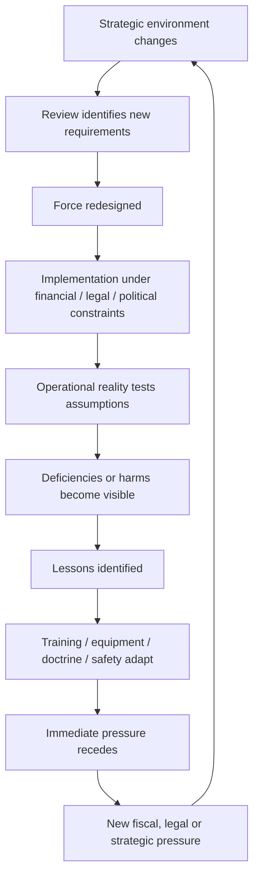

# 📋 History of Presenting Complaint  
**First created:** 2026-09-07 | **Last updated:** 2026-09-14  
*A longitudinal history of British force design, operational learning, training risk, affordability pressure and the recurring problem of sustaining readiness through strategic change.*  

---

## 📋 History of the Presenting Complaint  

The September 2026 Army collective-training dispute is not an isolated event.

It sits at the end of a much longer sequence in which Britain has repeatedly:

1. reassessed the strategic environment;
2. redesigned its Armed Forces around a new set of assumptions;
3. reduced, expanded or redistributed capability;
4. encountered events which tested those assumptions;
5. adapted operationally;
6. identified lessons;
7. entered another period of fiscal, legal or political pressure;
8. reviewed Defence again.

*Rinse and repeat.*  

This does not mean Britain has spent the entire post-war period making the same mistake.  

Different governments faced different:

- threats;
- alliances;
- technologies;
- economic conditions;
- force structures;
- inherited contracts;
- wars;
- personnel problems;
- industrial constraints;
- legal environments;
- public expectations about acceptable risk.

The useful historical question is therefore not:  

> **Which government ruined Defence?**  

It is:

> **What did Britain think its Armed Forces needed to do, what force did it build for that purpose, what happened when that force met reality, what did it learn, and did those lessons survive the next strategic, legal or financial settlement?**

---

## 🧭 The Recurring Tension  

British defence planning repeatedly has to reconcile several things which do not naturally remain in balance:

- political ambition;
- strategic obligations;
- personnel;
- equipment;
- training;
- readiness;
- estate;
- industrial capacity;
- technology;
- alliances;
- law;
- safety;
- money.

Strategic reviews are attempts to make those things coherent.  

They are not evidence that coherence was subsequently achieved.  

The House of Commons Library notes that governments inherit force numbers, capabilities and long-term procurement commitments from predecessors, and that major equipment programmes may take years or decades to deliver. Reviews therefore operate inside inherited constraints rather than designing the Armed Forces from a blank sheet.  

- [House of Commons Library: *A brief guide to previous British defence reviews*](https://commonslibrary.parliament.uk/research-briefings/cbp-7313/)  

That distinction matters throughout this history.

> **Review published ≠ force delivered.**

And, increasingly:

> **Risk removed from one part of the system ≠ risk removed from the system.**

---

## 1. 🌍 Before the Current Problem: What Sort of Force Was Britain Maintaining?

The post-1945 Armed Forces were shaped heavily by:

- NATO;
- the Cold War;
- the Soviet threat;
- the British Army of the Rhine;
- nuclear deterrence;
- imperial withdrawal;
- Northern Ireland;
- maritime obligations;
- overseas commitments;
- alliance warfare.

For much of the Cold War, substantial parts of British force design therefore rested on relatively legible assumptions about:

- where a major European conflict might occur;
- who the principal adversary was;
- which allies would participate;
- what major formations were required;
- which infrastructure supported them.

Those assumptions did not make planning simple. They supplied a relatively stable strategic reference point.

The end of the Cold War removed much of that reference point at the same time that Britain continued a longer adjustment to post-imperial strategic status.

That wider cultural history is larger than this node can resolve. It nevertheless matters because assumptions about what Britain *should* do internationally are inherited as well as calculated. Strategic ambition does not begin again from zero every time a government publishes a review.

---

## 2. ⚓ 1981–1982: Plans Meet The Falklands

The 1981 Defence Review associated with Defence Secretary John Nott was principally an attempt to bring the Defence programme and equipment commitments into line with available resources, while concentrating capability around the government's assessment of Britain's principal NATO requirements.

Shortly afterwards, Argentina invaded the Falkland Islands.

If you would like links to follow for Argentina's case, see [🇫🇰 Falkland Islands](../../../../🌑_1_Origin_Points/🪿_Embodied_Information_Ecology/🫀🕸️_Information_Is_Experienced/📼_Politicians_Gone_Wild/🛶_Flag_It_Yourself/📍_Postcard_List/🇫🇰_falkland_islands.md) as a postcard stop, on the satirical trek around British Overseas Territories that I would *never ever* really send politicians on.

The resulting conflict became one of Britain's clearest modern examples of a force-planning settlement being tested almost immediately by a contingency lying outside the scenario around which much of that settlement had been constructed.

This episode should not be reduced to:

> **Nott review bad; Falklands proved it.**

Nor does the evidence establish:

> **Nott cuts caused Argentina to invade.**

The Franks-era parliamentary record did, however, accept that the planned withdrawal of HMS *Endurance* could have sent Argentina the wrong signal about British commitment.

- [UK Parliament / Hansard: *Falkland Islands Review (Cmnd. 8787)*](https://hansard.parliament.uk/Lords/1983-01-25/debates/d6e95858-e0a6-44ef-b419-871448f0c2eb/FalklandIslandsReview%28Cmnd8787%29)

The more useful lesson is structural.

Military capability cannot always be regenerated immediately after a political decision determines that it is no longer required.

The interval between:

> **we intend to remove this capability**

and

> **we no longer possess this capability**

can itself become strategically important.

The Falklands therefore matter here because they expose the importance of:

- assumptions;
- warning time;
- geography;
- signalling;
- reversibility;
- reinforcement;
- allied support which is actually available rather than merely hoped for.

The islands also remain a useful warning against collapsing **UK sovereign responsibility**, **NATO treaty obligation**, **allied strategic interest** and **bilateral support** into the same category. The Falklands lie outside the geographical scope of NATO's Article 5 guarantee as defined by Article 6.

- [NATO: *The North Atlantic Treaty*](https://www.nato.int/cps/en/natohq/official_texts_17120.htm)

The contemporary planning question is therefore wider than 1982:

> **Which territories does Britain intend to defend, against which contingencies, with what warning time, from which infrastructure, and with what degree of allied support actually assumed?**

Different Overseas Territories produce different answers.

That is precisely why the assumptions should be explicit.

---

## 3. 🧊 1990: Options for Change and the Peace Dividend

The collapse of the Soviet threat created the possibility of substantial reductions.

`Options for Change` in 1990 sought smaller Armed Forces for a different strategic environment.

The MOD later summarised the aim as creating:

> smaller forces, better equipped, properly trained and housed, motivated, flexible and mobile.

- [MOD: *Records Appraisal Report 2020*](https://www.gov.uk/government/publications/ministry-of-defence-records-appraisal-report-2020/mod-appraisal-report-2020-accessible-version)

This is worth remembering.

The stated objective was not simply:

> **smaller military.**

It was:

> **smaller but sufficiently capable military.**

That distinction recurs repeatedly in later reviews.

The difficult question is therefore always:

> **What enabling systems have to remain intact for a smaller force genuinely to remain better trained, flexible and usable?**

---

## 4. 🕊️ The 1990s: The Supposedly Peaceful Decade Was Rather Busy

The immediate post-Cold-War environment did not produce an absence of military activity.

British forces operated in or around:

- the Gulf;
- the Balkans;
- Bosnia;
- Kosovo;
- Sierra Leone;
- continuing commitments elsewhere.

The nature of demand changed.

Instead of preparing principally for one enormous NATO confrontation in Central Europe, the Armed Forces increasingly needed:

- expeditionary capability;
- joint operations;
- deployability;
- peace support;
- coalition interoperability;
- logistics over distance;
- rapidly configurable forces.

This produces one of the first important historical warnings for the present cluster:

> **A fall in one category of threat does not necessarily produce a proportional fall in military workload.**

The workload may instead change shape.

---

## 5. 🧩 1994: Front Line First and the Problem of Deciding What Counts as Support

The 1994 Defence Costs Study, commonly associated with **Front Line First**, sought further efficiencies.

It also accelerated greater tri-service organisation and joint structures.

The MOD's own later institutional history identifies the reforms as important to the development of:

- integrated Head Office structures;
- Permanent Joint Headquarters;
- Joint Staff College;
- Defence Estates;
- greater use of agencies and contracting.

- [MOD: *Records Appraisal Report 2020*](https://www.gov.uk/government/publications/ministry-of-defence-records-appraisal-report-2020/mod-appraisal-report-2020-accessible-version)

There is an important conceptual question here which recurs throughout later Defence reform:

> **What counts as front line?**

A battalion looks like front-line capability.  
An instructor may not.  
A training area may not.  
A logistics organisation may not.  
An estate-maintenance function may not.  
A procurement specialist may not.  

But removing enough supposedly peripheral capability eventually alters whether the visible front-line asset can function.

This cluster will repeatedly test the distinction between:

**nominal front-line strength**

and

**the enabling system required to make that strength usable.**

---

## 6. 🧭 1998: The Strategic Defence Review and Expeditionary Britain

The 1998 Strategic Defence Review attempted to construct a force appropriate to the post-Cold-War environment.

It emphasised flexible, expeditionary Armed Forces able to operate at distance from the United Kingdom.

The period also accelerated joint working across Defence.

Later MOD accounts identify the review with further joint organisations, including the Defence Logistics Organisation and Joint Helicopter Command.

- [House of Commons Library: *A brief guide to previous British defence reviews*](https://commonslibrary.parliament.uk/research-briefings/cbp-7313/)
- [MOD: *Records Appraisal Report 2020*](https://www.gov.uk/government/publications/ministry-of-defence-records-appraisal-report-2020/mod-appraisal-report-2020-accessible-version)

The strategic proposition was broadly:

> Britain no longer needed simply to maintain the Cold-War force in miniature.

It needed forces capable of:

- deploying;
- sustaining operations;
- working jointly;
- operating with allies;
- responding to less geographically predictable crises.

Then came that fateful day in September.

---

## 7. 🏙️ 2001: 9/11 and Another Strategic Reset

The attacks of 11 September 2001 altered the international security environment again.

Britain's post-Cold-War expeditionary model was now used in a much more demanding sequence of operations.

The UK entered Afghanistan.

It later entered Iraq.

Instead of occasional expeditionary intervention, the Armed Forces entered a period of sustained operational demand.

This matters because force design is not tested only by:

> **Can the force perform this operation?**

It is also tested by:

> **Can the force keep performing operations at this intensity without degrading the people and systems underneath it?**

The answer depends upon:

- deployment frequency;
- personnel;
- families;
- equipment;
- maintenance;
- training;
- reserves;
- medical support;
- logistics;
- institutional learning.

---

## 8. 🇮🇶 Iraq and 🇦🇫 Afghanistan: The Operational Learning Machine Accelerates

This is where Simon Akam's *The Changing of the Guard: The British Army Since 9/11* becomes particularly useful.

The Army's experience in Iraq and Afghanistan generated extensive adaptation in:

- training;
- equipment;
- doctrine;
- infrastructure;
- medical response;
- counter-IED work;
- operational feedback.

The important point for the present cluster is not simply that mistakes occurred.

It is that **the Army demonstrated substantial capacity to learn when operational consequences made the need for learning unavoidable.**

For the detailed examples below, Akam is an important narrative source. Where a claim currently depends upon his reporting rather than an independently located primary source, it is labelled accordingly rather than silently promoted into institutional fact.

### 8.1 🥾 OPTAG

Akam describes reform of the Operational Training and Advisory Group around problems including:

- compressed preparation periods;
- theatre currency among instructors;
- institutional prestige;
- training which did not always represent operational reality closely enough.

He describes reform seeking:

- more credible instructors;
- greater theatre currency;
- more realistic environments;
- rapid incorporation of lessons from deployed forces.

The wider proposition — that lessons from theatre were rapidly fed back into subsequent pre-deployment training — is also reflected in parliamentary and official evidence from the period.

The healthy feedback loop was:

> **theatre → instructor → trainee.**

That is organisational learning at useful speed.

### 8.2 🏚️ Representative Infrastructure

Akam also describes the move away from inadequate approximations toward more representative training environments, including developments at Lydd/Hythe, Longcross and Thetford.

The point was not aesthetic realism.

It was functional realism.

Personnel needed repeated exposure to environments sufficiently similar to those they might encounter operationally that useful behaviour could become rehearsed.

This supplies a wider proposition which later sections will test independently:

> **training infrastructure is itself military capability.**

Owning land is not enough.

The land has to permit the right kind of practice.

### 8.3 🛸 BATUS

Akam describes BATUS training evolving to incorporate combinations of villages, dismounted activity, drones, casualty simulation, different opposition and less predictable sequences.

The detailed history requires independent sourcing alongside Akam before every component is carried forward as an established finding.

But the underlying question is already useful.

New technology has long been capable of **improving physical collective training**.

That is different from demonstrating that it can replace every function of physical collective training.

---

## 9. 🩸 Training Becomes Visibly Connected To Casualties

The story of Derek Derenalagi is important here, but it must be used carefully.

Derenalagi suffered catastrophic injuries in Afghanistan in 2007 and subsequently became a bilateral prosthetic user.

Akam describes Richard Wesley bringing Derenalagi to a meeting concerning funding for more representative training facilities.

The significance is not:

> **better facilities would definitely have prevented Derenalagi's injury.**

The evidence does not establish that.

The significance is that the human category of risk became impossible to leave outside the room.

A budget request for training infrastructure can look like:

> **£20 million versus £0.**

But the underlying problem contains:

- injury;
- death;
- rehabilitation;
- lifelong state obligations;
- operational effectiveness.

The history therefore generates one of this cluster's central questions:

> **When training expenditure purchases risk reduction, how do we count the casualty which never happens?**

Successful prevention produces absent events.

Absent events are difficult to invoice.

---

## 10. 🔁 The Army Gets Very Good At Afghanistan — Which Creates Another Problem

Akam's argument becomes especially useful when the Army begins leaving the conflict environment for which it had become highly adapted.

Afghanistan encouraged rational habits built around conditions including:

- coalition air superiority;
- sophisticated casualty evacuation;
- pervasive IED risk;
- counter-insurgency;
- strong emphasis on casualty minimisation.

Those habits could become problematic in another type of war.

Akam records instructors at Brecon confronting experienced Iraq/Afghanistan personnel whose casualty response had become deeply automatic. In his account, the Afghanistan-conditioned reflex was to stop and organise evacuation.

In another war, where helicopters may not arrive and stopping an attack may create more casualties, personnel needed to learn another response.

Hence Akam's memorable reported instruction:

> **“Fucking leave him and come back for him.”**

The profanity matters because it communicates how deeply the previous behaviour had been learned.

This supplies an important lesson for 2026:

> **unlearning is training too.**

Experienced soldiers cannot always be updated simply by receiving new information.

Automatic responses sometimes have to be deliberately changed through practice.

---

## 11. 🧠 Tactical Learning Succeeds; Strategic Learning Becomes More Complicated

Akam's wider criticism is that the Army's operational and training systems changed dramatically while senior institutional accountability was much less visibly transformed.

This is where the Operation Telic lessons process becomes useful.

The MOD has subsequently published the **Operation Telic Lessons Compendium**, providing a primary documentary source for the institutional lessons exercise.

- [GOV.UK: *Operation Telic lessons compendium*](https://www.gov.uk/government/publications/operation-telic-lessons-compendium)

Contemporary reporting also documented controversy around the circulation and treatment of critical findings.

- [The Guardian: Richard Norton-Taylor, “Defence chiefs gag damning Iraq invasion findings”](https://www.theguardian.com/uk/2010/may/27/defence-chiefs-gag-iraq-report)

Akam records disagreement over how the report should be interpreted, including Jock Stirrup's argument that some criticism reflected methodological problems and an insufficient distinction between tactical perspectives and strategic objectives.

The exact history should therefore not be reduced to:

> **senior officers suppressed the truth.**

Nor should institutional disagreement automatically dissolve the problem.

The deeper systems question is:

> **How does tactical experience become valid strategic evidence?**

If the bottom says:

> **strategy does not understand what happened**

while the top says:

> **tactical analysis does not understand strategy**

then Defence requires a better translation layer.

---

## 12. 🪟 FOI and the Problem of Institutional Embarrassment

The Telic lessons material also became public partly through Freedom of Information processes.

That matters beyond Iraq.

Defence possesses unusually strong legitimate reasons for withholding information.

Operational plans, vulnerabilities, intelligence and classified capability should not simply be made public.

But this creates an institutional trust problem if:

> **security sensitivity**

and

> **reputational discomfort**

become difficult for outsiders to distinguish.

A military institution asking the public to accept necessary secrecy therefore has an unusually strong interest in demonstrating transparency where disclosure is safe.

The long-term lesson is not:

> **publish everything.**

It is:

> **make the boundary between necessary secrecy and institutional embarrassment credible.**

This becomes important later because intangible Defence expenditure — including training — may depend heavily upon public willingness to trust professional military judgement.

---

## 13. 💷 2010: Operational Lessons Meet Austerity

By 2010 Britain had accumulated:

- nearly a decade of Afghanistan;
- Iraq;
- extensive operational adaptation;
- equipment lessons;
- training lessons;
- casualty experience;
- major financial pressure following the global financial crisis.

The 2010 Strategic Defence and Security Review therefore attempted to reform Defence while addressing affordability.

Government subsequently described the programme as seeking:

- battle-winning Armed Forces;
- a smaller, more professional MOD;
- a realistic approach to affordability.

- [GOV.UK: *2010 to 2015 government policy: armed forces and Ministry of Defence reform*](https://www.gov.uk/government/publications/2010-to-2015-government-policy-armed-forces-and-ministry-of-defence-reform/2010-to-2015-government-policy-armed-forces-and-ministry-of-defence-reform)

The institution was simultaneously being asked to:

**retain lessons from sustained war**

and

**become substantially cheaper.**

This does not automatically mean every reduction was wrong.

It means implementation should be examined carefully for whether capability was genuinely redesigned or merely compressed.

---

## 14. 🪖 Army 2020: Smaller, Integrated, Adaptable

Army 2020 followed the 2010 review.

The planned structure envisaged a smaller Regular Army integrated more closely with an expanded Reserve.

Government described the future force as:

> a fully integrated Regular and Reserve force of 120,000 by 2020.

It was intended to shift from sustained campaigning toward contingency.

- [GOV.UK: “Army 2020: Defining the Future of the British Army”](https://www.gov.uk/government/news/093-2012-army-2020-defining-the-future-of-the-british-army)
- [GOV.UK: “Army 2020: transforming the British Army for the future”](https://www.gov.uk/government/news/army-2020-transforming-the-british-army-for-the-future)

This was not simply a numerical reduction.

It was a different force-generation model.

Its success therefore depended upon things including:

- reserve recruitment;
- reserve integration;
- readiness;
- training;
- personnel availability;
- mobilisation assumptions.

A force may retain a convincing nominal total only if the components of the manpower model actually produce usable capability.

---

## 15. 🇷🇺 2014: Crimea Changes The Weather

Russia's seizure of Crimea in 2014 made the European security environment look significantly different from the one surrounding the 2010 SDSR.

The post-Cold-War assumption that high-intensity state warfare in Europe had become remote was becoming increasingly difficult to maintain.

This does not mean Britain's expeditionary experience suddenly became irrelevant.

It means the force now had to retain or rebuild competence for a different category of conflict while carrying the institutional legacy of the previous one.

---

## 16. 📑 SDSR 2015 and the Return of State Competition

The 2015 review responded to:

- Russia;
- terrorism;
- instability;
- cyber threats;
- changing alliance demands.

Once again, strategic ambition and force capacity had to be reconciled.

The important question for this cluster is not merely whether headline Defence spending increased.

It is:

> **Was the force-generation system underneath the headline capability becoming more robust?**

That requires later evidence concerning:

- personnel;
- readiness;
- estate;
- maintenance;
- training;
- stockpiles;
- industrial capacity.

---

## 17. ⚖️ 2015–2017: Parliament Asks Where Training Risk Should Live

This period needs to sit inside the history, not as an afterthought.

In October 2015, the Defence Sub-Committee opened **Beyond Endurance? Military exercises and the duty of care**, examining health and safety during military training, exercises and selection, and whether Defence was learning effectively from accidents and deaths.

By February 2016, official statistics recorded **135 Armed Forces personnel deaths during training and exercises since 1 January 2000**:

- 115 Regular personnel;
- 20 on-duty Reservists;
- 89 Army;
- 24 Royal Navy/Royal Marines;
- 22 RAF.

The Army total included 34 deaths during collective training and 47 during individual training.

- [UK Parliament: *Beyond endurance? Military exercises and the duty of care*](https://publications.parliament.uk/pa/cm201516/cmselect/cmdfence/598/59805.htm)
- [GOV.UK: *Training and exercise deaths in the UK Armed Forces: 2016*](https://www.gov.uk/government/statistics/training-and-exercise-deaths-in-the-uk-armed-forces-2016)

This was therefore not a theoretical dispute about whether soldiers should be tougher.

People had died.

At the same time, the parliamentary evidence exposed another risk.

Senior military witnesses raised concern that health-and-safety principles could be interpreted so restrictively that training ceased adequately to prepare people for operations.

General Sir Richard Barrons told the Committee in March 2016 that the difficulty was not necessarily the legislation itself but how requirements including **ALARP — as low as reasonably practicable — were interpreted and applied**.

- [UK Parliament: *Beyond endurance? — oral evidence, 2 March 2016*](https://committees.parliament.uk/work/6178/beyond-endurance-military-exercises-and-the-duty-of-care-inquiry/publications/oral-evidence/)

The Government's response subsequently stated that military training is inherently hazardous, particularly where weapons, vehicles or strenuous physical activity are involved, and that risk should be reduced ALARP while still permitting realistic and effective preparation for operational output.

- [UK Parliament: *Government Response to Beyond endurance?*](https://publications.parliament.uk/pa/cm201617/cmselect/cmdfence/525/52504.htm)

The Committee returned to the subject in a follow-up inquiry later in 2016.

- [UK Parliament: *Military exercises and the duty of care: follow up inquiry*](https://committees.parliament.uk/work/2135/military-exercises-and-the-duty-of-care-follow-up-inquiry/)

The important historical lesson is therefore not:

> **health and safety got in the way.**

Nor is it:

> **military necessity defeats health and safety.**

It is:

> **Defence has to distinguish necessary training risk from avoidable harm, and it has to account for where risk moves when realistic exposure is removed.**

That is a much more difficult systems problem.

---

## 18. 🩺 Risk Does Not Disappear When It Leaves The Training Estate

Suppose a military task retains a non-zero risk of serious injury even when performed competently.

Training can expose somebody to part of that hazard in an environment where:

- supervisors can intervene;
- medical support is planned;
- equipment can be checked;
- the scenario can be stopped;
- the terrain is known;
- exposure can be progressive;
- an adversary is not actively exploiting mistakes.

Alternatively, realistic exposure can be reduced.

The training environment may become safer.

But if the task remains operationally necessary, first meaningful exposure may then occur:

- overseas;
- under fire;
- while exhausted;
- in unfamiliar terrain;
- with constrained medical support;
- while another person is actively trying to defeat the trainee.

This does not establish that more dangerous training is automatically better.

The training deaths examined by Parliament demonstrate exactly why that proposition would be irresponsible.

It establishes a different question:

> **Did a particular safety control reduce total risk, or did it transfer risk from training into operations?**

The relevant unit of analysis is therefore the whole risk pathway.

---

## 19. 🪖 Regulars, Reservists, Recruits and Cadets Are Not The Same Population

The parliamentary statistics already show that this question is not confined to full-time Regular personnel.

Reservists were among those who died during training and exercise.

Future force design makes the distinction more important.

### Regular personnel

The problem may be maintaining, integrating and adapting established competence through repeated exposure.

### Reservists

Reservists may be required to generate operationally meaningful capability with:

- less continuous exposure;
- competing civilian obligations;
- different training frequency;
- variable recency of practice.

A reserve-heavy force model therefore cannot be evaluated simply by counting people.

It has to ask:

> **What competence can reliably be regenerated, on what timescale, using what training infrastructure?**

### Recruits

Recruits are acquiring hazardous competencies rather than merely refreshing them.

Progression therefore matters particularly strongly.

### Cadets

Cadet activity has different purposes and duties again.

It may contribute to:

- confidence;
- skills;
- familiarity;
- recruitment awareness;
- youth development.

It is not simply miniature Regular Army preparation.

Age, safeguarding, developmental status and the purpose of the activity change what risk can be justified.

The phrase **military training** therefore conceals several distinct populations and several distinct risk calculations.

---

## 20. 🧱 The Estate Problem Accumulates Quietly

Training capability also depends upon physical infrastructure.

Training land that technically exists may still be constrained by:

- availability;
- maintenance;
- safety;
- environmental restrictions;
- competing users;
- infrastructure condition.

The same is true of accommodation and supporting estate.

The exact scale of each constraint requires separate evidence.

But one later example demonstrates the general point very clearly: an estate asset can exist on paper while being unavailable to the unit which needs it.

A smaller force does not automatically need proportionally less training infrastructure.

If the force is expected to generate high readiness from fewer personnel, access to appropriate training may become more rather than less important.

---

## 21. 🌐 2021: Integrated Review and the Technological Turn

The 2021 Integrated Review described a more competitive international system shaped by:

- state competition;
- technology;
- cyber;
- space;
- China;
- Russia;
- new domains.

The accompanying Defence Command Paper explicitly argued against protecting old capabilities simply because they had previously succeeded.

- [GOV.UK: *The Integrated Review 2021*](https://www.gov.uk/government/collections/the-integrated-review-2021)
- [GOV.UK: Defence Secretary oral statement on the Defence Command Paper](https://www.gov.uk/government/speeches/defence-secretary-oral-statement-on-the-defence-command-paper)

Modernisation is necessary.

The question is how modernisation is validated.

A technology programme should not become strategically valuable merely because:

- it is new;
- it is digital;
- it contains AI;
- it promises efficiency.

The relevant test remains:

> **Which functional military output does this improve?**

---

## 22. 🕹️ Synthetic Training Is Not New

The current enthusiasm for AI, VR and synthetic environments can sound as though Defence has discovered simulation recently.

It has not.

Air forces have used forms of synthetic aviation training for generations.

The RAF traces simulated aviation training within the Service to a model cockpit in **1910**, with computerised simulators arriving in the 1950s.

- [Royal Air Force: “The Great Simulation: Accelerating the Pipeline”](https://www.raf.mod.uk/news/articles/the-great-simulation-accelerating-the-pipeline/)

The attraction is obvious.

Aviation contains many tasks which can be represented with high fidelity through:

- cockpit controls;
- instruments;
- displays;
- communications;
- visual information;
- warning systems;
- procedural sequences.

Synthetic systems can therefore allow repeated rehearsal of:

- emergencies;
- procedures;
- decision-making;
- rare events;
- multi-aircraft scenarios;

without consuming the same aircraft hours, fuel, airspace or physical risk.

In 2021 the RAF said approximately half of Combat Air training was already being conducted on synthetic devices.

- [Royal Air Force: “£274-million training boost for RAF”](https://www.raf.mod.uk/news/articles/274-million-training-boost-for-raf/)

Yet the RAF's own modern synthetic-training programme explicitly says systems such as **Gladiator** complement rather than replace live flying.

- [Royal Air Force: “Chief of the Air Staff opens Gladiator, the RAF's new synthetic training system”](https://www.raf.mod.uk/news/articles/chief-of-the-air-staff-opens-gladiator-the-rafs-new-synthetic-training-system/)

The High-G Training and Test Facility supplies an even better example.

A representative cockpit and simulated environment are combined with a centrifuge capable of reproducing physiological exposure to high G.

- [GOV.UK: “New fast jet training takes off”](https://www.gov.uk/government/news/new-fast-jet-training-takes-off)

The model is therefore not:

> **simulation or reality.**

It is:

> **simulate what can be simulated well, introduce physical exposure where the body must learn, and retain live activity where reality still matters.**

---

## 23. 🥾 Land Is A Different Simulation Problem

Land warfare contains variables which are harder to reproduce through a headset alone.

A person may be:

- wet;
- cold;
- hot;
- hungry;
- sleep deprived;
- carrying weight;
- moving over broken ground;
- stuck in mud;
- operating in dust or sand;
- handling equipment with gloves;
- moving casualties;
- working around vehicles;
- losing communications;
- managing other exhausted people.

Gravity remains stubbornly analogue.

That does not make synthetic land training useless.

Quite the opposite.

Synthetic systems may be particularly valuable for:

- equipment familiarisation;
- weapon-handling sequences before live firing;
- emergency procedures;
- communications;
- tactical decision-making;
- command-post activity;
- recognition;
- navigation and terrain familiarisation;
- mission rehearsal;
- repeated procedural drills.

The important possibility is that synthetic preparation can make later physical training **safer and more productive**.

A person who has already rehearsed the procedure may be better able to concentrate on the physical hazard when it is introduced.

The useful training sequence may therefore be:

> **synthetic repetition → controlled physical practice → realistic collective application**

rather than:

> **synthetic system purchased → physical competence assumed.**

This is not an argument against technology.

It is an argument for validating technology against the human task.

---

## 24. 🧠 The Human Is Part Of The Safety System

Technology programmes create another information problem.

A system may be:

- technically impressive;
- contractually deliverable;
- cheaper per training event;
- attractive in a demonstration;
- measurable;
- modern;
- visually persuasive.

None of those facts establishes that it prepares the eventual operator adequately.

The people who incur the operational morbidity and mortality risk possess relevant information.

That does not mean the most junior operator gets a veto over procurement.

It means questions such as these belong inside evaluation:

- What does this system genuinely help you practise?
- What does it fail to reproduce?
- Which skills transfer into live activity?
- Which do not?
- Does it make subsequent live training safer?
- What mistakes appear when people transition from synthetic to live activity?
- What would still need to be practised physically before deployment?

If an instructor repeatedly observes a failure at the synthetic-to-live boundary, that is not merely customer feedback.

It may be hazard information.

Human feedback is therefore part of:

- training validation;
- procurement;
- safety;
- doctrine;
- lessons;
- force generation.

The feedback needs to move like fucking butter.

---

## 25. 🇺🇦 2022: Ukraine Breaks Several Comfortable Assumptions

Russia's full-scale invasion of Ukraine brought high-intensity state warfare back into Europe on a scale Western governments had not experienced for decades.

It highlighted the continuing importance of:

- mass;
- artillery;
- ammunition;
- drones;
- electronic warfare;
- air defence;
- logistics;
- industrial replenishment;
- training;
- mobilisation;
- casualty replacement;
- endurance.

The war did not demonstrate that technology was unimportant.

Quite the opposite.

It demonstrated that **new technology and traditional military requirements coexist**.

Drones did not abolish artillery.

AI did not abolish logistics.

Simulation did not abolish physical operations.

Modern warfare layered new dependencies onto old ones.

---

## 26. 🇺🇦 Operation Interflex: Useful Activity Creates Another Capacity Problem

Britain's training of Ukrainian personnel through Operation Interflex is an important example of the difference between a capability problem and a blame problem.

Training Ukrainians is strategically valuable.

It also consumes training capacity.

The National Audit Office found that:

- 89% of one tranche of Ukrainian trainees said the training left them better prepared to survive on the battlefield;
- British Army units bidding for training sites in 2023 were rejected **eight times more frequently than in 2019** because facilities were unavailable;
- **more than a quarter of the Army's training estate** was being used for Interflex;
- MOD acknowledged that the programme constrained the Army's capacity to train its own soldiers on those sites.

- [National Audit Office: *Investigation into military support for Ukraine*](https://www.nao.org.uk/press-releases/investigation-into-military-support-for-ukraine/)

That is not evidence that Interflex is a mistake.

It is evidence that:

> **useful strategic commitments still consume finite force-generation capacity.**

This is precisely why nominal assets and usable systems have to be distinguished.

---

## 27. 🔄 2023: The Integrated Review Refresh Admits The World Changed Faster Than Expected

Following the invasion of Ukraine, the government refreshed the 2021 Integrated Review.

The House of Commons Library notes that the 2023 Refresh concluded that the transition toward a:

> multipolar, fragmented and contested world

had happened more quickly and definitively than anticipated.

- [House of Commons Library: *A brief guide to previous British defence reviews*](https://commonslibrary.parliament.uk/research-briefings/cbp-7313/)

An assumption changed.

The strategic document changed with it.

The remaining question is:

> **How quickly did the force-generation system underneath the document change too?**

---

## 28. 🏋️ 2024: The Training-Risk Argument Returns

RUSI published criticism in 2024 arguing that an excessively bureaucratic safety regime was restricting realistic Army training at scale.

- [RUSI: “A Bureaucratic Approach to Safety is Weakening the British Army's Training”](https://www.rusi.org/explore-our-research/publications/commentary/bureaucratic-approach-safety-weakening-british-armys-training)

The article should be treated as professional commentary, not an official finding.

But historically it is important because the underlying argument was not new.

Parliament had already examined the tension between realistic preparation, avoidable training deaths and institutional interpretation of safety obligations in 2015–17.

The question had therefore survived.

That recurrence is itself information.

---

## 29. 🛡️ 2025: Warfighting Readiness Becomes Explicit Policy

The 2025 Strategic Defence Review is the immediate policy baseline for the current dispute.

It describes a strategic environment involving:

- war in Europe;
- Russian aggression;
- nuclear risks;
- cyber attack;
- rapidly changing technology;
- potentially high-intensity and prolonged conflict.

Its central response is a move toward:

> **warfighting readiness.**

The review also calls for a more integrated force and a NATO-first approach.

- [GOV.UK: *Strategic Defence Review 2025 — Making Britain Safer: secure at home, strong abroad*](https://www.gov.uk/government/publications/the-strategic-defence-review-2025-making-britain-safer-secure-at-home-strong-abroad/the-strategic-defence-review-2025-making-britain-safer-secure-at-home-strong-abroad)

John Healey's statement introducing the review acknowledged directly that the Army had for too long been asked to do more with less.

- [GOV.UK: Strategic Defence Review oral statement](https://www.gov.uk/government/speeches/strategic-defence-review-oral-statement)

This makes the present training problem especially important.

The current government did not inherit a strategic framework which regarded training and readiness as marginal.

Its own review identified them as central.

---

## 30. 🪖 What SDR 2025 Actually Says About Training

The review does not describe training as a peripheral administrative activity.

It says training must become a **strategic and institutional priority** for restoring Army readiness at all levels.

It supports:

- individual training;
- collective training;
- NATO-oriented training;
- simulation;
- rapid incorporation of operational lessons;
- integrated training;
- live firing.

The review advocates advanced synthetic environments capable of making training more effective and efficient.

But it also says live firing over long distances remains essential to assuring Army fighting capability.

The policy is therefore not:

> **old physical training versus clever digital training.**

It is:

> **use technology aggressively while retaining the physical and live activity needed to generate and validate real fighting capability.**

That is consistent with the much older aviation model.

The difficult question is where the substitution boundary lies for each military task.

---

## 31. 🧩 Integrated By Design

The review also argues that Defence must move beyond merely being joint toward being integrated by design.

This matters because the current issue should not ultimately be treated as only an Army question.

The longer planning problem concerns:

- Army;
- Royal Navy;
- Royal Air Force;
- Strategic Command;
- reserves;
- industry;
- allies;
- civilian expertise.

The question becomes:

> **What functions should remain service-specific, what should genuinely be joint, and what should be integrated from the beginning rather than bolted together later?**

That makes the apparent concentration of the September 2026 training problem in the Army especially worth investigating.

It does not yet explain it.

---

## 32. 💷 June–September 2026: Strategic Ambition Meets Implementation

The 2026 sequence can now be described more precisely.

### 16 June

Parliament was already asking whether the number of military exercises would be reduced during the current or following financial year.

### 26 June

MOD replied that activity remained under continuous review and was aligned to readiness and operational priorities.

### 30 June

The Government published the **Defence Investment Plan**, backed by approximately **£298 billion over four years**.

The Prime Minister simultaneously announced a further **£15 billion** increase over the period.

The DIP was explicitly presented as the implementation mechanism for the 2025 Strategic Defence Review and the move to warfighting readiness.

- [GOV.UK: *The Defence Investment Plan*](https://www.gov.uk/government/publications/the-defence-investment-plan)
- [GOV.UK: *The Defence Investment Plan Funding explainer*](https://www.gov.uk/government/publications/the-defence-investment-plan/the-defence-investment-plan-funding-explainer)
- [GOV.UK: PM speech announcing the Defence Investment Plan, 30 June 2026](https://www.gov.uk/government/speeches/pm-speech-announcing-the-defence-investment-plan-30-june-2026)

### 4 September

Ben Obese-Jecty tabled parliamentary questions concerning the scope of a directive stopping collective training and cancellation of Royal Tank Regiment live firing.

### 9 September

MOD's answer framed the position as prioritisation, protecting activity required for readiness, operational commitments, safety-critical requirements and NATO obligations.

### September reporting

Reporting then described an approximately **£30 million in-year Army saving requirement** and curtailed major collective-training activity.

The precise origin and decision chain behind that requirement remain unresolved.

That distinction matters.

The current evidence does **not yet establish** that:

- Treasury selected Army training;
- ministers personally selected the affected exercises;
- Army Command preferred this option;
- the £30 million could simply have been moved from another programme;
- the problem was purely Army-specific;
- the final distribution of pressure across all three Services had already been settled when the story emerged.

What it does establish is a sharper implementation question:

> **How did a government which had just made warfighting readiness central policy, increased Defence funding and published a major investment plan nevertheless reach a point where an approximately £30 million in-year problem affected Army collective training?**

That is not an accusation.

It is exactly the sort of question an implementation history is supposed to generate.

---

## 33. 🏭 Capability, Capital and What Becomes Politically Visible

There is another recurring planning problem worth carrying forward carefully.

Modern Defence necessarily depends heavily upon industry.

Ships, aircraft, weapons, software, synthetic environments, infrastructure and maintenance frequently require long-term commercial relationships.

That is not inherently pathological.

But large programmes can become unusually visible because they have:

- named contractors;
- procurement milestones;
- ministerial announcements;
- measurable capital values;
- jobs attached to constituencies;
- demonstrations;
- organised commercial advocates.

Routine training activity often does not.

A cancelled exercise has no factory opening.

An instructor's time has no ribbon to cut.

Repeated rehearsal may generate no new platform and no dramatic photograph.

This creates a legitimate governance question:

> **Does Defence decision-making see capital programmes more clearly than the human activity required to turn those programmes into capability?**

That question should be investigated through decision records, procurement, budgets and outcomes.

It should not be answered in advance by assuming corruption.

The same evidential discipline applies where political donors, lobbyists, advisers or commercially interested actors intersect with Defence policy:

> **follow the requirement → follow the decision → follow the procurement → follow the money → then decide what the evidence supports.**

---

## 34. ⏳ Defence Has To Think Longer Than An Electoral Cycle

Governments change.

Ministers change.

Budgets change.

Military capability often takes much longer.

A training system may have to support:

- people who have not yet joined;
- equipment which will remain in service for decades;
- alliances whose plans span multiple governments;
- infrastructure which cannot be regenerated quickly;
- rare competencies which disappear quietly once the people holding them leave.

Democracy should determine strategic priorities.

But the machinery which translates those priorities into credible capability needs enough continuity to survive electoral churn.

That is one reason Parliament, professional military education, Defence institutions, independent research organisations and successive reviews repeatedly return to similar questions.

The recurrence is itself information.

---

## 🔁 What The History Appears To Show So Far

Several patterns are sufficiently plausible to investigate, but not yet sufficiently established to treat as final diagnoses.

### 1. Strategic requirements change faster than institutions

Britain has repeatedly moved between:

- continental deterrence;
- expeditionary operations;
- counter-insurgency;
- state competition;
- NATO reinforcement;
- high-intensity warfare.

Each transition requires different mixes of:

- people;
- training;
- equipment;
- doctrine;
- infrastructure.

Institutional adaptation therefore has to be continuous.

### 2. Operational pressure accelerates learning

Iraq and Afghanistan show that:

- deficiencies can become extremely visible during conflict;
- resources can suddenly become available;
- feedback loops can shorten dramatically;
- training can transform rapidly.

This is positive evidence about military adaptability.

It also raises an uncomfortable question:

> **Does Britain sometimes require operational harm before preparedness becomes politically valuable enough to fund?**

That remains a question, not a conclusion.

### 3. Successful adaptation can itself become a future constraint

Afghanistan-specific competence demonstrates that:

> **being extremely good at yesterday's war does not guarantee preparedness for tomorrow's.**

Expertise may need to be deliberately unlearned or recalibrated.

Training cannot therefore be treated as a one-time investment.

### 4. Enabling systems are vulnerable to being mistaken for overhead

Training, estate, instructors, logistics, reserves and support functions may appear less tangible than:

- platforms;
- ships;
- aircraft;
- vehicles;
- missiles.

But platforms without enabling systems are nominal capability.

### 5. Smaller forces demand more from force generation, not necessarily less

Reducing personnel does not automatically reduce the complexity of Britain's commitments.

A smaller force asked to maintain high readiness may depend more heavily upon:

- training;
- retention;
- reserves;
- maintenance;
- rapid regeneration;
- allied integration.

The sustainability of the system matters as much as headline strength.

### 6. Risk can move instead of disappearing

The 2015–17 duty-of-care debate makes this explicit.

A control can reduce training risk while increasing operational risk.

A live activity can expose personnel unnecessarily.

A synthetic system can make later live training safer.

A legal protection can reduce institutional exposure while potentially changing operational behaviour.

A financial saving can create a deferred capability cost.

The relevant question is therefore:

> **What happened to the risk?**

### 7. Technology is most useful when its substitution boundary is known

Aviation demonstrates that sophisticated simulation and live activity can coexist for decades.

The question is not whether synthetic training is modern or useful.

It is:

> **Which competence does it produce, which physical or collective realities does it fail to reproduce, and how is transfer into live performance validated?**

### 8. Human feedback is part of capability assurance

People who operate, instruct, maintain and survive systems possess information which may not appear in procurement metrics.

That information does not automatically override strategic judgement.

It must, however, be capable of reaching it.

### 9. Reviews repeatedly recognise many of these problems

The historical story is not simply:

> **government never understood Defence.**

Reviews repeatedly identify genuine problems.

They repeatedly contain:

- sophisticated threat assessment;
- sensible reforms;
- adaptation;
- attempts at integration;
- new technology;
- improved training.

The harder question is:

> **What survives implementation and the next affordability cycle?**

---

## ⚙️ The Possible Recurring Loop

The history presently suggests a pattern worth testing:

This is not yet a diagnosis.

The `/data/` work needs to establish:

- which loops actually occurred;
- which recommendations genuinely repeated;
- which reforms survived;
- which reforms were abandoned;
- which risks were reduced;
- which risks were merely displaced;
- why.

---

## 🧈 The Information Problem

Information has to travel between:

- people experiencing operations;
- people injured during training or operations;
- instructors;
- training establishments;
- maintainers;
- medics;
- commanders;
- service chiefs;
- MOD officials;
- lawyers;
- contractors;
- ministers;
- Treasury;
- Parliament;
- the public.

The Iraq lessons process suggests that this transmission can become harder as evidence approaches questions of:

- strategic responsibility;
- institutional reputation;
- political accountability.

The training-risk history adds another problem.

Information can also be lost when an embodied warning is translated into:

- a safety metric;
- a legal metric;
- a procurement metric;
- a financial metric.

The challenge is therefore not merely gathering lessons.

It is preserving their informational content while they move through increasingly different organisational levels.

Or, in the language of this cluster:

> **The feedback needs to move like fucking butter.**

---

## 🩻 Historical Provisional Assessment

The current training dispute emerges from an Armed Forces system which has spent several decades adapting repeatedly to strategic change while also being subjected to recurring affordability pressure, force restructuring, changing legal expectations and changing ideas about acceptable training risk.

The historical evidence does not justify the proposition that Britain has simply neglected training continuously for 30 years.

It supports something more complicated.

Britain has repeatedly demonstrated that it understands the importance of:

- realistic preparation;
- duty of care;
- operational learning;
- joint working;
- adaptable forces;
- modernisation;
- readiness.

It has also repeatedly faced difficulty sustaining all of:

- ambition;
- force size;
- training;
- equipment;
- infrastructure;
- personnel;
- safety;
- legal accountability;
- financial affordability

at the same time.

The history also shows that **training modernisation and realistic training are not natural opposites**.

Synthetic systems may remove unnecessary exposure, increase repetition and improve preparation before physical risk is introduced.

But physical and collective competence cannot safely be inferred merely from the existence of a sophisticated simulator.

The central historical problem is therefore becoming clearer:

> **Britain repeatedly has to decide not whether risk exists, but where to put it, who carries it, how to prepare for it, and which parts of the system remain visible when money becomes tight.**

The present £30 million dispute may represent:

- a temporary and rational adaptation within that system;
- another manifestation of a recurring implementation problem;
- or both.

The next task is to investigate which.

---

## 🔬 Questions Carried Forward

The history generates specific questions for later nodes:

- Which strategic-review recommendations concerning training repeatedly recur?
- Which were implemented?
- Which later disappeared?
- What happened to Army collective-training capacity after Afghanistan?
- How did Army 2020 affect force-generation assumptions?
- How did the 2015–17 duty-of-care work change training practice?
- Which safety controls reduced total risk, and which may have displaced it?
- How are Regular, Reserve, recruit and cadet training risks assessed differently?
- What impact has Operation Interflex had on domestic training capacity?
- Which estate constraints predate the current savings requirement?
- Which competencies can synthetic training genuinely replace?
- Which can it only prepare people to practise more safely?
- How is synthetic-to-live transfer measured?
- What did SDR 2025 assume would happen to live collective training?
- How did the 2026 spending settlement translate those assumptions into resources?
- Why did the September 2026 problem become especially visible in the Army?
- What alternatives were considered across Defence?
- When did Parliament first become aware that training might be reduced?
- Who formally accepted any resulting readiness risk?
- How does operator and instructor evidence enter procurement and training validation?
- Does Defence protect highly visible capital capability more effectively than low-visibility force-generation activity?
- Which assumptions concerning Overseas Territories and allied support are explicit, and which remain inherited?

---

History does not tell us who to blame for the current complaint.

It tells us which questions Britain has already paid — sometimes in money, sometimes in institutional pain, and sometimes in bodies — to learn how to ask.

---

## 🌌 Constellations
📋 🪖 ⚖️ 💷 🕹️ — Defence reviews; force generation; training risk; affordability; synthetic and live readiness.

*Follow the evidence:*  

- [📖 Simon Akam: *The Changing of the Guard: The British Army Since 9/11*](https://www.simonakam.com/the-changing-of-the-guard)
- [📄 House of Commons Library: *A brief guide to previous British defence reviews*](https://commonslibrary.parliament.uk/research-briefings/cbp-7313/)
- [📄 MOD: *Records Appraisal Report 2020*](https://www.gov.uk/government/publications/ministry-of-defence-records-appraisal-report-2020/mod-appraisal-report-2020-accessible-version)
- [📄 GOV.UK: *Operation Telic lessons compendium*](https://www.gov.uk/government/publications/operation-telic-lessons-compendium)
- [📄 GOV.UK: *2010 to 2015 government policy: armed forces and Ministry of Defence reform*](https://www.gov.uk/government/publications/2010-to-2015-government-policy-armed-forces-and-ministry-of-defence-reform/2010-to-2015-government-policy-armed-forces-and-ministry-of-defence-reform)
- [📄 GOV.UK: “Army 2020: Defining the Future of the British Army”](https://www.gov.uk/government/news/093-2012-army-2020-defining-the-future-of-the-british-army)
- [📄 UK Parliament: *Beyond endurance? Military exercises and the duty of care*](https://committees.parliament.uk/work/6178/beyond-endurance-military-exercises-and-the-duty-of-care-inquiry/)
- [📄 GOV.UK: *Training and exercise deaths in the UK Armed Forces: 2016*](https://www.gov.uk/government/statistics/training-and-exercise-deaths-in-the-uk-armed-forces-2016)
- [📄 UK Parliament: *Military exercises and the duty of care: follow up inquiry*](https://committees.parliament.uk/work/2135/military-exercises-and-the-duty-of-care-follow-up-inquiry/)
- [📄 HSE: “HSE's position on realistic training in the military”](https://www.hse.gov.uk/services/armedforces/realistic-training.htm)
- [📄 GOV.UK: *The Integrated Review 2021*](https://www.gov.uk/government/collections/the-integrated-review-2021)
- [📄 National Audit Office: *Investigation into military support for Ukraine*](https://www.nao.org.uk/press-releases/investigation-into-military-support-for-ukraine/)
- [📄 RUSI: “A Bureaucratic Approach to Safety is Weakening the British Army's Training”](https://www.rusi.org/explore-our-research/publications/commentary/bureaucratic-approach-safety-weakening-british-armys-training)
- [📄 Royal Air Force: “The Great Simulation: Accelerating the Pipeline”](https://www.raf.mod.uk/news/articles/the-great-simulation-accelerating-the-pipeline/)
- [📄 Royal Air Force: “£274-million training boost for RAF”](https://www.raf.mod.uk/news/articles/274-million-training-boost-for-raf/)
- [📄 Royal Air Force: “Chief of the Air Staff opens Gladiator”](https://www.raf.mod.uk/news/articles/chief-of-the-air-staff-opens-gladiator-the-rafs-new-synthetic-training-system/)
- [📄 GOV.UK: *Strategic Defence Review 2025*](https://www.gov.uk/government/publications/the-strategic-defence-review-2025-making-britain-safer-secure-at-home-strong-abroad/the-strategic-defence-review-2025-making-britain-safer-secure-at-home-strong-abroad)
- [📄 GOV.UK: *The Defence Investment Plan*](https://www.gov.uk/government/publications/the-defence-investment-plan)
- [📄 NATO: *The North Atlantic Treaty*](https://www.nato.int/cps/en/natohq/official_texts_17120.htm)
- [📰 The Guardian: Richard Norton-Taylor, “Defence chiefs gag damning Iraq invasion findings”](https://www.theguardian.com/uk/2010/may/27/defence-chiefs-gag-iraq-report)

---

## ✨ Stardust
british defence reviews, British Army, force generation, military training, duty of care, ALARP, Iraq, Afghanistan, Army 2020, reserves, synthetic training, flight simulation, Operation Interflex, SDR 2025, Defence Investment Plan, warfighting readiness, collective training, operational risk

---

## 🏮 Footer

*📋 History of Presenting Complaint* is a living node of the **Polaris Protocol**.  

It places the current training dispute inside the longer history of British force redesign, operational adaptation, training risk, strategic review and affordability pressure. It treats training not simply as expenditure, but as one of the places where strategic ambition, law, technology, safety and human risk meet.

> 📡 Cross-references:
>
> - [🩺 Presenting Complaint](./🩺_presenting_complaint.md) — *the immediate September 2026 complaint*
- [🪖 Futures of Defence](../../../../../🌕_5_Long_Strategies/❤️‍🩹_Rehabilitated_Tech/🤖_AI_Beyond_AI/🪖_futures_of_defence.md) — *where emerging technology can reduce avoidable physical risk without substituting synthetic confidence for operational competence*  
> - [🔬 Tests And Investigations](./🔬_tests_and_investigations.md) — *what evidence would establish the problem*
> - [🪖 What Training Is For](./🪖_what_training_is_for.md) — *collective competence and the function of training*
> - [⚙️ The Feedback Machine](./⚙️_the_feedback_machine.md) — *institutional learning and signal transmission*
> - [🪟 Transparency And Earned Loyalty](./🪟_transparency_and_earned_loyalty.md) — *Telic lessons, FOI and public trust*
> - [💷 Thirty Million Pounds](./💷_thirty_million_pounds.md) — *the immediate affordability decision*
> - [🔭 What Does Ready Actually Look Like](./🔭_what_does_ready_actually_look_like.md) — *functional readiness outputs*
>  
> 🏮 Return To:
>
> - [🪖 Training Debrief](./README.md) — *1up*
> - [🌊 Playing Defence](../README.md) — *2up*
> - [📲 Press Matters](../../README.md) — *3up*
> - [🌓 In The Moment](../../../README.md) — *4up*
> - [🌌 Polaris Protocol — Root](../../../../README.md) — *root*

*Survivor authorship is sovereign. Containment is never neutral.*

_Last updated: 2026-09-14_
