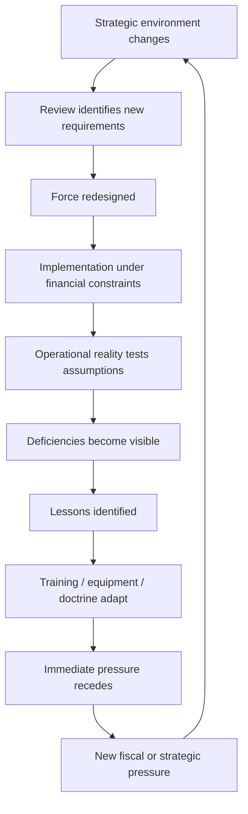

# 📋 History of Presenting Complaint  
**First created:** 2026-09-07 | **Last updated:** 2026-09-08  
*A longitudinal history of British force design, operational learning, affordability pressure and the recurring problem of sustaining readiness through strategic change.*  

---

## 📋 History of the Presenting Complaint  

The September 2026 Army collective-training dispute is not an isolated event.

It sits at the end of a much longer sequence in which Britain has repeatedly:
1. reassessed the strategic environment;
2. redesigned its Armed Forces around a new set of assumptions;
3. reduced, expanded or redistributed capability;
4. encountered events which tested those assumptions;
5. adapted operationally;
6. identified lessons;
7. entered another period of fiscal or political pressure;
8. reviewed Defence again.

*Rinse and repeat.*  

This does not mean Britain has spent the entire post-war period making the same mistake.  

Different governments faced different:
- threats;
- alliances;
- technologies;
- economic conditions;
- force structures;
- inherited contracts;
- wars;
- personnel problems;
- industrial constraints.

The useful historical question is therefore not:  

> **Which government ruined Defence?**  

It is:

> **What did Britain think its Armed Forces needed to do, what force did it build for that purpose, what happened when that force met reality, what did it learn, and did those lessons survive the next strategic or financial settlement?**

---

## 🧭 The Recurring Tension  

British defence planning repeatedly has to reconcile several things which do not naturally remain in balance:

- political ambition;
- strategic obligations;
- personnel;
- equipment;
- training;
- readiness;
- estate;
- industrial capacity;
- technology;
- alliances;
- money.

Strategic reviews are attempts to make those things coherent.  

They are not evidence that coherence was subsequently achieved.  

The House of Commons Library notes that governments inherit force numbers, capabilities and long-term procurement commitments from predecessors, and that major equipment programmes may take years or decades to deliver.  

Reviews therefore operate inside inherited constraints rather than designing the Armed Forces from a blank sheet.  

[House of Commons Library: *A brief guide to previous British defence reviews*](https://commonslibrary.parliament.uk/research-briefings/cbp-7313/)  

That distinction matters throughout this history.

> **Review published ≠ force delivered.**

---

## 1. 🌍 Before the Current Problem: What Sort of Force Was Britain Maintaining?

The post-1945 Armed Forces were shaped heavily by:
- NATO;
- the Cold War;
- the Soviet threat;
- the British Army of the Rhine;
- nuclear deterrence;
- imperial withdrawal;
- Northern Ireland;
- maritime obligations;
- overseas commitments;
- alliance warfare.

For much of the Cold War, substantial parts of British force design therefore rested on relatively legible assumptions about:
- where a major European conflict might occur;
- who the principal adversary was;
- which allies would participate;
- what major formations were required;
- which infrastructure supported them.

Those assumptions did not make planning simple, instead, they supplied a relatively stable strategic reference point.

The end of the Cold War, and the transformation of European power in the aftermath of the fall of the USSR, are significant markers for many in the removal of that reference point.   

History did continue outside of Europe, however, and as we come into a new world, many are catching up world history and context which had been previously downplayed not only in reference to establishment defence thought, but also as a wider post-imperial continuity of centring Britain as the imperial core.  

Put frankly: we were and are still adjusting our cultural perspective, moving on from being The British Empire™️, and as the behaviours were passed on intragenerationally and our society is shaped around imperialism which is no longer the same shape as it was, adjusting to the new world continues over time.  

---

## 2. ⚓ 1981–1982: Plans Meet The Falklands

The 1981 Defence Review associated with Defence Secretary John Nott was principally an attempt to bring the Defence programme and equipment commitments into line with available resources.  

Shortly afterwards, Argentina invaded the Falkland Islands.

The resulting conflict became one of Britain's most obvious modern examples of a strategic planning assumption encountering an unexpected operational demand.

This episode should not be reduced to:

> **Nott review bad; Falklands proved it.**

The more useful lesson is structural.
Military capability cannot always be regenerated immediately after a political decision determines that it is no longer required.

The interval between:
> **we intend to remove this capability**
and
> **we no longer possess this capability**
can itself become strategically important.
> 
The Falklands subsequently acquired a much larger place in British cultural memory than in the technical history of Defence reviews, but for this cluster its significance is narrower:
> **strategic surprise can arrive during the implementation window of apparently rational force restructuring.**

This is an early example of why assumptions, warning time and reversibility matter.

---

## 3. 🧊 1990: Options for Change and the Peace Dividend

The collapse of the Soviet threat created the possibility of substantial reductions.
`Options for Change` in 1990 sought smaller Armed Forces for a different strategic environment.

The MOD later summarised the aim as creating:
> smaller forces, better equipped, properly trained and housed, motivated, flexible and mobile.

[MOD Records Appraisal Report 2020](https://www.gov.uk/government/publications/ministry-of-defence-records-appraisal-report-2020/mod-appraisal-report-2020-accessible-version)

This is worth remembering.
The stated objective was not simply:
> **smaller military.**

It was:
> **smaller but sufficiently capable military.**

That distinction recurs repeatedly in later reviews.

The difficult question is therefore always:
> **What enabling systems have to remain intact for a smaller force genuinely to remain better trained, flexible and usable?**

---

## 4. 🕊️ The 1990s: The Supposedly Peaceful Decade Was Rather Busy

The immediate post-Cold-War environment did not produce an absence of military activity.  

British forces operated in or around:
- the Gulf;
- the Balkans;
- Bosnia;
- Kosovo;
- Sierra Leone;
- continuing commitments elsewhere.

The nature of demand changed.

Instead of preparing principally for one enormous NATO confrontation in Central Europe, the Armed Forces increasingly needed:
- expeditionary capability;
- joint operations;
- deployability;
- peace support;
- coalition interoperability;
- logistics over distance;
- rapidly configurable forces.

This produces one of the first important historical warnings for the present cluster:
> **A fall in one category of threat does not necessarily produce a proportional fall in military workload.**

The workload may instead change shape.

---

## 5. 🧩 1994: Front Line First and the Problem of Deciding What Counts as Support

The 1994 Defence Costs Study, commonly associated with **Front Line First**, sought further efficiencies.
It also accelerated greater tri-service organisation and joint structures.
The MOD's own later institutional history identifies the reforms as important to the development of:
- integrated Head Office structures;
- Permanent Joint Headquarters;
- Joint Staff College;
- Defence Estates;
- greater use of agencies and contracting.
[MOD: Records Appraisal Report 2020](https://www.gov.uk/government/publications/ministry-of-defence-records-appraisal-report-2020/mod-appraisal-report-2020-accessible-version)
There is an important conceptual question here which recurs throughout later Defence reform:
> **What counts as front line?**
A battalion looks like front-line capability.
An instructor may not.
A training area may not.
A logistics organisation may not.
An estate-maintenance function may not.
A procurement specialist may not.
But removing enough supposedly peripheral capability eventually alters whether the visible front-line asset can function.
This cluster will repeatedly test the distinction between:
**nominal front-line strength**
and
**the enabling system required to make that strength usable.**

---

## 6. 🧭 1998: the Strategic Defence Review and expeditionary Britain
The 1998 Strategic Defence Review attempted to construct a force appropriate to the post-Cold-War environment.
It emphasised flexible, expeditionary Armed Forces able to operate at distance from the United Kingdom.
The period also accelerated joint working across Defence.
Later MOD accounts identify the review with further joint organisations, including the Defence Logistics Organisation and Joint Helicopter Command.
[House of Commons Library: *A brief guide to previous British defence reviews*](https://commonslibrary.parliament.uk/research-briefings/cbp-7313/)  
[MOD: Records Appraisal Report 2020](https://www.gov.uk/government/publications/ministry-of-defence-records-appraisal-report-2020/mod-appraisal-report-2020-accessible-version)
The strategic proposition was broadly:
> Britain no longer needed simply to maintain the Cold-War force in miniature.
It needed forces capable of:
- deploying;
- sustaining operations;
- working jointly;
- operating with allies;
- responding to less geographically predictable crises.
Then came 9/11.

---

## 7. 🏙️ 2001: 9/11 and another strategic reset
The attacks of 11 September 2001 altered the international security environment again.
Britain's post-Cold-War expeditionary model was now used in a much more demanding sequence of operations.
The UK entered Afghanistan.
It later entered Iraq.
Instead of occasional expeditionary intervention, the Armed Forces entered a period of sustained operational demand.
This matters because force design is not tested only by:
> **Can the force perform this operation?**
It is also tested by:
> **Can the force keep performing operations at this intensity without degrading the people and systems underneath it?**
The answer depends upon:
- deployment frequency;
- personnel;
- families;
- equipment;
- maintenance;
- training;
- reserves;
- medical support;
- logistics;
- institutional learning.

---

## 8. 🇮🇶 Iraq and 🇦🇫 Afghanistan: the operational learning machine accelerates
This is where Simon Akam's *The Changing of the Guard: The British Army Since 9/11* becomes particularly useful.
The Army's experience in Iraq and Afghanistan generated extensive adaptation in:
- training;
- equipment;
- doctrine;
- infrastructure;
- medical response;
- counter-IED work;
- operational feedback.
The important point for the present cluster is not simply that mistakes occurred.
It is that **the Army demonstrated substantial capacity to learn when operational consequences made the need for learning unavoidable.**

---

## 🥾 OPTAG
Akam describes the reform of the Operational Training and Advisory Group.
Problems included:
- compressed preparation periods;
- insufficient theatre-specific experience among some instructors;
- limited institutional prestige;
- training that did not always represent operational reality closely enough.
Reform sought:
- more credible instructors;
- greater theatre currency;
- more realistic environments;
- rapid incorporation of lessons from deployed forces.
One especially striking example involves training being paused while current information was obtained directly from Afghanistan and then passed immediately to the next cohort.
The feedback loop was extraordinarily short:
> **theatre → instructor → trainee.**
That is healthy organisational learning.

---

## 🏚️ Representative infrastructure  

Akam also describes the move away from inadequate approximations toward more realistic training environments.
Improved facilities were developed at locations including:
- Lydd/Hythe;
- Longcross;
- Thetford.
The point was not aesthetic realism.
It was functional realism.
Personnel needed repeated exposure to environments sufficiently similar to those they might encounter operationally that useful behaviour could become rehearsed.
This demonstrates a wider principle:
> **training infrastructure is itself military capability.**
Owning land is not enough.
The land has to permit the right kind of practice.

---

## 🛸 BATUS

Training at BATUS also evolved.
Akam describes increasingly realistic combinations of:
- villages;
- dismounted fighting;
- drones;
- casualties;
- different enemy formations;
- unpredictable sequences.
The technological point is particularly important now.
**Drones entering training are not a post-Ukraine discovery.**
Technology was already being integrated into physical collective training because the objective was to make the physical exercise more representative.
This is relevant to current discussion of AI, VR and synthetic training.
Historically, new technology has often improved collective training.
That is different from demonstrating that it can replace all of it.

---

## 9. 🩸 Training becomes visibly connected to casualties

The story of Derek Derenalagi is important here, but it must be used carefully.
Derenalagi suffered catastrophic injuries in Afghanistan in 2007, losing both legs.
Akam describes Richard Wesley bringing him to a meeting concerning funding for more representative training facilities.
The significance is not:
> **better facilities would definitely have prevented Derenalagi's injury.**
The evidence does not establish that.
The significance is that the human category of risk became impossible to leave outside the room.
A budget request for training infrastructure can look like:
> **£20 million versus £0.**
But the underlying problem contains:
- injury;
- death;
- rehabilitation;
- lifelong state obligations;
- operational effectiveness.
The history therefore reinforces one of this cluster's central propositions:
> **training expenditure partly purchases risk reduction, and successful prevention is intrinsically difficult to count.**

---

## 10. 🔁 The Army gets very good at Afghanistan — which creates another problem
Akam's argument becomes especially useful when the Army begins leaving the conflict environment for which it had become highly adapted.
Afghanistan encouraged rational habits built around conditions including:
- coalition air superiority;
- sophisticated casualty evacuation;
- pervasive IED risk;
- counter-insurgency;
- strong emphasis on casualty minimisation.
Those habits could become problematic in another type of war.
At Brecon, Akam records instructors confronting experienced Iraq/Afghanistan personnel whose casualty response had become deeply automatic.
The Afghanistan-conditioned reflex was to stop and organise evacuation.
In a different war, where helicopters may not arrive and stopping the attack may create more casualties, personnel needed to learn another response.
Hence the memorable instruction:
> **“Fucking leave him and come back for him!”**
The profanity matters because it communicates how deeply the previous behaviour had been learned.
This supplies an important lesson for 2026:
> **unlearning is training too.**
Experienced soldiers cannot always be updated simply by receiving new information.
Automatic responses sometimes have to be deliberately changed through practice.

---

## 11. 🧠 Tactical learning succeeds; strategic learning becomes more complicated
Akam's wider criticism is that the Army's operational and training systems changed dramatically while senior institutional accountability was much less visibly transformed.
This is where the Ben Barry and Chris Brown lessons processes become relevant.
Lt Gen Chris Brown's joint study of higher-level strategic issues reportedly reached a first draft by early 2010.
Akam describes criticism within it concerning strategic direction, including the observation that the last Chief of the Defence Staff directive concerning Iraq dated from 2005.
The report then entered increasingly restricted circulation and went through repeated revision.
Brown's impression, as Akam describes it, was essentially that nobody wanted to be left holding responsibility when blame was distributed across Whitehall.
Contemporary reporting made the dispute public:
- [The Guardian: Richard Norton-Taylor, “Defence chiefs gag damning Iraq invasion findings”](https://www.theguardian.com/uk/2010/may/27/defence-chiefs-gag-iraq-report)
Jock Stirrup later disputed the interpretation that the report was rejected simply because it was embarrassing.
Akam records Stirrup arguing that it had methodological weaknesses, particularly that tactical perspectives were sometimes used without sufficient treatment of strategic objectives and that some analysis became personal opinion.
Both propositions can matter.
There may have been institutional discomfort with criticism.
There may also have been legitimate disagreement about the quality and level of analysis.
The deeper systems problem is potentially:
> **How does tactical experience become valid strategic evidence?**
If the bottom says:
> **strategy does not understand what happened**
while the top says:
> **tactical analysis does not understand strategy**
then Defence requires a better translation layer.

---

## 12. 🪟 FOI and the problem of institutional embarrassment

The Brown material also became public partly because of Freedom of Information processes.
That matters beyond Iraq.
Defence possesses unusually strong legitimate reasons for withholding information.
Operational plans, vulnerabilities, intelligence and classified capability should not simply be made public.
But this creates an institutional trust problem if:
> **security sensitivity**
and
> **reputational discomfort**
become difficult for outsiders to distinguish.
A military institution asking the public to accept necessary secrecy therefore has an unusually strong interest in demonstrating transparency where disclosure is safe.
The long-term lesson is not:
> **publish everything.**
It is:
> **make the boundary between necessary secrecy and institutional embarrassment credible.**
This becomes important later because intangible Defence expenditure — including training — may depend heavily upon public willingness to trust professional military judgement.

---

## 13. 💷 2010: operational lessons meet austerity

This is one of the most important conjunctions in the entire history.
By 2010 Britain had accumulated:
- nearly a decade of Afghanistan;
- Iraq;
- extensive operational adaptation;
- equipment lessons;
- training lessons;
- casualty experience;
- major financial pressure following the global financial crisis.
The 2010 Strategic Defence and Security Review therefore attempted to reform Defence while addressing affordability.
Government subsequently described the programme as seeking:
- battle-winning Armed Forces;
- a smaller, more professional MOD;
- a realistic approach to affordability.
[GOV.UK: *2010 to 2015 government policy: armed forces and Ministry of Defence reform*](https://www.gov.uk/government/publications/2010-to-2015-government-policy-armed-forces-and-ministry-of-defence-reform/2010-to-2015-government-policy-armed-forces-and-ministry-of-defence-reform)
The difficulty is obvious.
The institution was simultaneously being asked to:
**retain lessons from sustained war**
and
**become substantially cheaper.**
This does not automatically mean every reduction was wrong.
It means implementation should be examined carefully for whether capability was genuinely redesigned or merely compressed.

---

## 14. 🪖 Army 2020: smaller, integrated, adaptable

Army 2020 followed the 2010 review.
The planned structure envisaged a smaller Regular Army integrated more closely with an expanded Reserve.
Government described the future force as:
> a fully integrated Regular and Reserve force of 120,000 by 2020.
It was intended to shift from sustained campaigning toward contingency.
[GOV.UK: “Army 2020: Defining the Future of the British Army”](https://www.gov.uk/government/news/093-2012-army-2020-defining-the-future-of-the-british-army)  
[GOV.UK: “Army 2020: transforming the British Army for the future”](https://www.gov.uk/government/news/army-2020-transforming-the-british-army-for-the-future)
This was not simply a numerical reduction.
It was a different force-generation model.
Its success therefore depended upon things including:
- reserve recruitment;
- reserve integration;
- readiness;
- training;
- personnel availability;
- mobilisation assumptions.
That distinction matters.
A force may retain the same nominal total only if every component of the new manpower model actually materialises as planned.

---

## 15. 🇷🇺 2014: Crimea changes the weather

Russia's seizure of Crimea in 2014 made the European security environment look significantly different from the one surrounding the 2010 SDSR.

The post-Cold-War assumption that high-intensity state warfare in Europe had become remote was becoming increasingly difficult to maintain.

This does not mean Britain's expeditionary experience suddenly became irrelevant.
It means the force now had to retain or rebuild competence for a different category of conflict while carrying the institutional legacy of the previous one.

---

## 16. 📑 SDSR 2015 and the return of state competition

The 2015 review responded to:
- Russia;
- terrorism;
- instability;
- cyber threats;
- changing alliance demands.
Once again, strategic ambition and force capacity had to be reconciled.
The important question for this cluster is not merely whether headline Defence spending increased.
It is:
> **Was the force-generation system underneath the headline capability becoming more robust?**
That requires later evidence concerning:
- personnel;
- readiness;
- estate;
- maintenance;
- training;
- stockpiles;
- industrial capacity.

---

## 17. 🧱 The estate problem accumulates quietly
Training capability also depends upon physical infrastructure.
Training land that technically exists may still be constrained by:
- availability;
- maintenance;
- safety;
- environmental restrictions;
- competing users;
- deterioration;
- infrastructure condition.
The same is true of accommodation and supporting estate.
This becomes increasingly important because a smaller force does not automatically need proportionally less training infrastructure.
Indeed, if the force is expected to generate high readiness from fewer personnel, access to high-quality training may become more important.

---

## 18. 🌐 2021: Integrated Review and the technological turn

The 2021 Integrated Review described a more competitive international system shaped by:
- state competition;
- technology;
- cyber;
- space;
- China;
- Russia;
- new domains.
The accompanying Defence Command Paper explicitly argued against protecting old capabilities simply because they had previously succeeded.
It warned that sentimentality combined with:
> over-ambition and under-resourcing
could create harder consequences later and risk service personnel.
[GOV.UK: *The Integrated Review 2021*](https://www.gov.uk/government/collections/the-integrated-review-2021)  
[GOV.UK: Defence Secretary oral statement on the Defence Command Paper](https://www.gov.uk/government/speeches/defence-secretary-oral-statement-on-the-defence-command-paper)
This is an important argument.
Modernisation is necessary.
The question is how modernisation is validated.
A technology programme should not become strategically valuable merely because:
- it is new;
- it is digital;
- it contains AI;
- it promises efficiency.
The relevant test remains:
> **Which functional military output does this improve?**

---

## 19. 🇺🇦 2022: Ukraine breaks several comfortable assumptions

Russia's full-scale invasion of Ukraine brought high-intensity state warfare back into Europe on a scale Western governments had not experienced for decades.
It highlighted the continuing importance of:
- mass;
- artillery;
- ammunition;
- drones;
- electronic warfare;
- air defence;
- logistics;
- industrial replenishment;
- training;
- mobilisation;
- casualty replacement;
- endurance.
The war did not demonstrate that technology was unimportant.
Quite the opposite.
It demonstrated that **new technology and traditional military requirements coexist**.
Drones did not abolish artillery.
AI did not abolish logistics.
Simulation did not abolish physical operations.
Modern warfare layered new dependencies onto old ones.

---

## 20. 🇺🇦 Operation Interflex: useful activity creates another capacity problem

Britain's training of Ukrainian personnel through Operation Interflex is an important example of the difference between a capability problem and a blame problem.
Training Ukrainians is strategically valuable.
It also consumes training capacity.
The National Audit Office found that British Army units bidding for training sites in 2023 were rejected **eight times more frequently than in 2019** because facilities were unavailable.
At the same time, 89% of one tranche of Ukrainian trainees said the training left them better prepared to survive on the battlefield.
[National Audit Office: *Investigation into military support for Ukraine*](https://www.nao.org.uk/press-releases/investigation-into-military-support-for-ukraine/)
That is not evidence that Interflex is a mistake.
It is evidence that:
> **useful strategic commitments still consume finite force-generation capacity.**
This is precisely why nominal assets and usable systems have to be distinguished.

---

## 21. 🔄 2023: the Integrated Review Refresh admits the world changed faster than expected

Following the invasion of Ukraine, the government refreshed the 2021 Integrated Review.
The House of Commons Library notes that the 2023 Refresh concluded that the transition toward a:
> multipolar, fragmented and contested world
had happened more quickly and definitively than anticipated.
[House of Commons Library: *A brief guide to previous British defence reviews*](https://commonslibrary.parliament.uk/research-briefings/cbp-7313/)
This is an excellent example of the kind of adaptation this cluster is interested in.
An assumption changed.
The strategic document changed with it.
The remaining question is:
> **How quickly did the force-generation system underneath the document change too?**

---

## 22. 🏋️ 2024: concerns about training scale already exist

Before the current £30 million controversy, training itself was already being debated.
RUSI published criticism in 2024 arguing that an excessively bureaucratic safety regime was restricting realistic Army training at scale.
The argument was controversial but relevant: insufficient realism in training could itself create operational risk.
[RUSI: “A Bureaucratic Approach to Safety is Weakening the British Army’s Training”](https://www.rusi.org/explore-our-research/publications/commentary/bureaucratic-approach-safety-weakening-british-armys-training)
The important point is not whether every RUSI recommendation should be adopted.
It is that:
> **the quality and scale of collective training were already subjects of professional concern before the September 2026 financial restriction.**

---

## 23. 🛡️ 2025: warfighting readiness becomes explicit policy

The 2025 Strategic Defence Review is the immediate policy baseline for the current dispute.
It describes a strategic environment involving:
- war in Europe;
- Russian aggression;
- nuclear risks;
- cyber attack;
- rapidly changing technology;
- potentially high-intensity and prolonged conflict.
Its central response is a move toward:
> **warfighting readiness.**
The review also calls for a more integrated force and a NATO-first approach.
[GOV.UK: *Strategic Defence Review 2025 — Making Britain Safer: secure at home, strong abroad*](https://www.gov.uk/government/publications/the-strategic-defence-review-2025-making-britain-safer-secure-at-home-strong-abroad/the-strategic-defence-review-2025-making-britain-safer-secure-at-home-strong-abroad)
John Healey's statement introducing the review acknowledged directly that:
> for too long, the Army had been asked to do more with less.
[GOV.UK: Strategic Defence Review oral statement](https://www.gov.uk/government/speeches/strategic-defence-review-oral-statement)
This makes the present training problem especially important.
The current government did not inherit a strategic framework which regarded training and readiness as marginal.
Its own review identified them as central.

---

## 24. 🪖 What SDR 2025 actually says about training

The review is particularly useful because it does not describe training as a peripheral administrative activity.
It says training must become a **strategic and institutional priority** for restoring Army readiness at all levels.
It also explicitly supports:
- individual training;
- collective training;
- NATO-oriented training;
- simulation;
- rapid incorporation of operational lessons;
- integrated training;
- live firing.
The review advocates a common virtual training environment and argues that sufficiently capable synthetic systems may reduce reliance on live activity.
But it also says live firing remains essential to assuring Army fighting capability.
That nuance matters.
The policy is not:
> **old physical training versus clever digital training.**
It is:
> **use technology aggressively while retaining the live activity needed to validate real fighting capability.**
The present dispute therefore turns partly upon where that boundary actually lies.

---

## 25. 🧠 The review also identifies the feedback problem

SDR 2025 says training and education must adapt to:
- operational lessons;
- innovation;
- research.
It calls for policy changes intended to let those delivering training revise courses more rapidly.
That is effectively a recognition of the problem Akam documents during Iraq and Afghanistan:
> **the institution needs short feedback loops between operational experience and preparation.**
There is therefore substantial continuity between:
**Akam's description of healthy theatre-to-instructor feedback**
and
**the 2025 review's aspiration for adaptive training.**
The challenge is implementation.

---

## 26. 🧩 Integrated by design

The review also argues that Defence must move beyond merely being joint toward being:
> **integrated by design.**
This matters for the Training Debrief because the current issue should not ultimately be treated as only an Army question.
The longer planning problem concerns:
- Army;
- Royal Navy;
- Royal Air Force;
- Strategic Command;
- reserves;
- industry;
- allies;
- civilian expertise.
The question becomes:
> **What functions should remain service-specific, what should genuinely be joint, and what should be integrated from the beginning rather than bolted together later?**

---

## 27. 💷 2026: strategic ambition meets affordability again

The Defence Investment Plan attempted to translate the 2025 strategic framework into spending and programmes.
Meanwhile, Parliament had already begun asking questions about training reductions.
By September 2026, reporting emerged that the Army had been required to produce approximately £30 million in savings and that major collective-training activity was being reduced or reprioritised.
This creates the current presenting contradiction:
> **Britain has recently declared that it must restore warfighting readiness and make training a strategic priority, while a comparatively small affordability problem has nevertheless reached collective Army training.**
That does not prove the policy is incoherent.
It establishes the question the rest of this cluster must answer.

---

## 🔁 What the history appears to show so far

Several patterns are sufficiently plausible to investigate, but not yet sufficiently established to treat as final diagnoses.

---

### 1. Strategic requirements change faster than institutions
Britain has repeatedly moved between:
- continental deterrence;
- expeditionary operations;
- counter-insurgency;
- state competition;
- NATO reinforcement;
- high-intensity warfare.
Each transition requires different mixes of:
- people;
- training;
- equipment;
- doctrine;
- infrastructure.
Institutional adaptation therefore has to be continuous.

---

### 2. Operational pressure accelerates learning

Iraq and Afghanistan show that:
- deficiencies can become extremely visible during conflict;
- resources can suddenly become available;
- feedback loops can shorten dramatically;
- training can transform rapidly.
This is positive evidence about military adaptability.
It also raises an uncomfortable question:
> **Does Britain sometimes require operational harm before preparedness becomes politically valuable enough to fund?**

---

### 3. Successful adaptation can itself become a future constraint

Afghanistan-specific competence demonstrates that:
> **being extremely good at yesterday's war does not guarantee preparedness for tomorrow's.**
Expertise may need to be deliberately unlearned or recalibrated.
Therefore training cannot be treated as a one-time investment.

---

### 4. Enabling systems are vulnerable to being mistaken for overhead

Training, estate, instructors, logistics, reserves and support functions may appear less tangible than:
- platforms;
- ships;
- aircraft;
- vehicles;
- missiles.
But platforms without enabling systems are nominal capability.

---

### 5. Smaller forces demand more from force generation, not necessarily less

Reducing personnel does not automatically reduce the complexity of Britain's commitments.
A smaller force asked to maintain high readiness may depend more heavily upon:
- training;
- retention;
- reserves;
- maintenance;
- rapid regeneration;
- allied integration.
The sustainability of the system matters as much as headline strength.

---

### 6. Reviews repeatedly recognise many of these problems

The historical story is not simply:
> **government never understood Defence.**
Reviews repeatedly identify genuine problems.
They repeatedly contain:
- sophisticated threat assessment;
- sensible reforms;
- adaptation;
- attempts at integration;
- new technology;
- improved training.
The harder question is:
> **What survives implementation and the next affordability cycle?**

---

## ⚙️ The possible recurring loop

The history presently suggests a pattern worth testing:

This is not yet a diagnosis.

The /data/ work needs to establish:

* which loops actually occurred;
* which recommendations genuinely repeated;
* which reforms survived;
* which reforms were abandoned;
* why.

---

## 🧈 The information problem

There is another historical pattern running alongside money and force structure.

Information has to travel between:

* people experiencing operations;
* instructors;
* training establishments;
* commanders;
* service chiefs;
* MOD officials;
* ministers;
* Treasury;
* Parliament;
* the public.

The Iraq lessons process suggests that this transmission can become harder as evidence approaches questions of:

* strategic responsibility;
* institutional reputation;
* political accountability.

The challenge is therefore not merely gathering lessons.

It is preserving their informational content while they move through increasingly different organisational levels.

Or, in the language of this cluster:

The feedback needs to move like fucking butter.

---

## 🩻 Historical provisional assessment

The current training dispute emerges from an Armed Forces system which has spent several decades adapting repeatedly to strategic change while also being subjected to recurring affordability pressure and force restructuring.

The historical evidence does not yet justify the proposition that Britain has simply neglected training continuously for 30 years.

It supports something more complicated.

Britain has repeatedly demonstrated that it understands the importance of:

* realistic preparation;
* operational learning;
* joint working;
* adaptable forces;
* modernisation;
* readiness.

It has also repeatedly faced difficulty sustaining all of:

* ambition;
* force size;
* training;
* equipment;
* infrastructure;
* personnel;
* financial affordability

at the same time.

The present £30 million dispute may therefore represent either:

* a temporary and rational adaptation within that system;
* another manifestation of a recurring implementation problem;
* or both.

The next task is to investigate which.

---

## 🔬 Questions carried forward

The history generates several specific questions for later nodes:

* Which strategic-review recommendations concerning training repeatedly recur?
* Which were implemented?
* Which later disappeared?
* What happened to Army collective-training capacity after Afghanistan?
* How did Army 2020 affect force-generation assumptions?
* What impact has Operation Interflex had on domestic training capacity?
* Which estate constraints predate the current savings requirement?
* How much can synthetic training genuinely replace?
* What did SDR 2025 assume would happen to live collective training?
* How did the 2026 spending settlement translate those assumptions into resources?
* When did Parliament first become aware that training might be reduced?
* Who formally accepted any resulting readiness risk?

---

## 📡 Next

Continue to:

* 🔬_tests_and_investigations.md — what evidence would establish the problem;
* 🪖_what_training_is_for.md — why collective competence requires repeated practice;
* ⚙️_the_feedback_machine.md — how lessons move through the institution;
* 🪟_transparency_and_earned_loyalty.md — Brown, Stirrup, FOI and public trust;
* 💷_thirty_million_pounds.md — the immediate 2026 decision;
* 🔭_what_does_ready_actually_look_like.md — designing from functional outputs rather than budget lines.

---

📚 Initial source bank

* Simon Akam, The Changing of the Guard: The British Army Since 9/11.
* House of Commons Library: A brief guide to previous British defence reviews
* MOD: Records Appraisal Report 2020
* GOV.UK: 2010 to 2015 government policy: armed forces and Ministry of Defence reform
* GOV.UK: “Army 2020: Defining the Future of the British Army”
* GOV.UK: “Army 2020: transforming the British Army for the future”
* GOV.UK: The Integrated Review 2021
* GOV.UK: Defence Secretary oral statement on the Defence Command Paper
* National Audit Office: Investigation into military support for Ukraine
* RUSI: “A Bureaucratic Approach to Safety is Weakening the British Army’s Training”
* GOV.UK: Strategic Defence Review 2025 — Making Britain Safer: secure at home, strong abroad
* GOV.UK: Strategic Defence Review oral statement
* The Guardian: Richard Norton-Taylor, “Defence chiefs gag damning Iraq invasion findings”

Further detail should be added from:

* data/strategic_reviews.md;
* data/timeline.md;
* data/parliamentary_questions.md;
* data/source_bank.md.

---

🌌 Constellations

📋 🪖 ⚙️ 💷 🏋️ 🪟 🇺🇦 — Defence reviews; Army reform; Iraq and Afghanistan; austerity; training; Ukraine; warfighting readiness; institutional learning.

---

✨ Stardust

British defence reviews, British Army, Options for Change, Front Line First, Strategic Defence Review, Iraq, Afghanistan, OPTAG, BATUS, SDSR 2010, Army 2020, Integrated Review, Ukraine, Operation Interflex, SDR 2025, warfighting readiness, collective training

---

History does not tell us who to blame for the current complaint.

It tells us which questions Britain has already paid to learn how to ask.

---

## 🌌 Constellations
🪖 ⚙️ 🔭 💷 🧠 — training; readiness; force generation; Defence governance; institutional learning.

---

## ✨ Stardust
british defence, army training, readiness, force generation, defence governance, institutional learning

---

## 🏮 Footer

*📋 History of Presenting Complaint* is a living node of the **Polaris Protocol**.  
It places the current training dispute inside the longer history of British force redesign, operational adaptation, strategic review and affordability pressure.

> 📡 Cross-references:
>
> - [🪖 What Training Is For](./🪖_what_training_is_for.md) — *collective competence and the function of training*
> - [⚙️ The Feedback Machine](./⚙️_the_feedback_machine.md) — *institutional learning and signal transmission*
> - [🔭 What Does Ready Actually Look Like](./🔭_what_does_ready_actually_look_like.md) — *functional readiness outputs*
> - [💷 Thirty Million Pounds](./💷_thirty_million_pounds.md) — *the immediate affordability decision*
>  
> 🏮 Return To:
>
> - [🪖 Training Debrief](./README.md) — *1up*
> - [🌊 Playing Defence](../README.md) — *2up*
> - [📲 Press Matters](../../README.md) — *3up*
> - [🌓 In The Moment](../../../README.md) — *4up*
> - [🌌 Polaris Protocol — Root](../../../../README.md) — *root*

*Survivor authorship is sovereign. Containment is never neutral.*

_Last updated: 2026-09-08_
