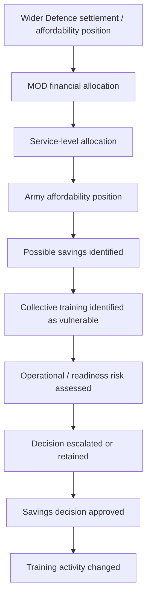
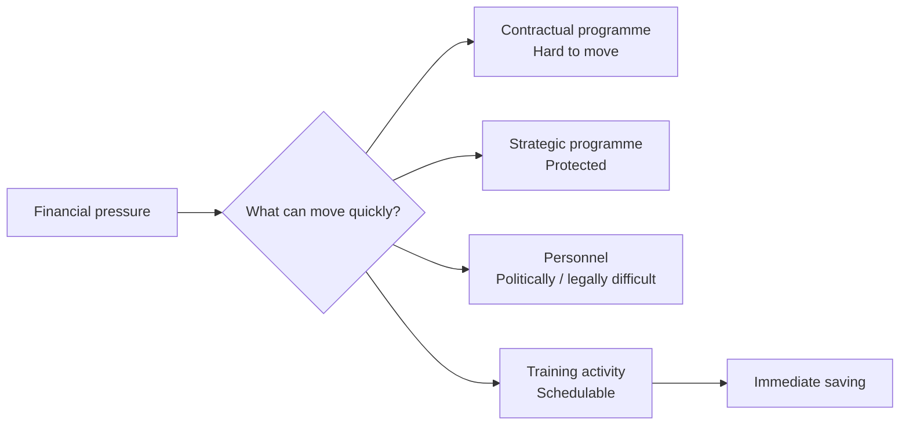
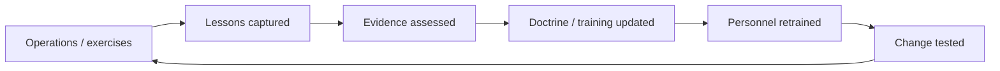
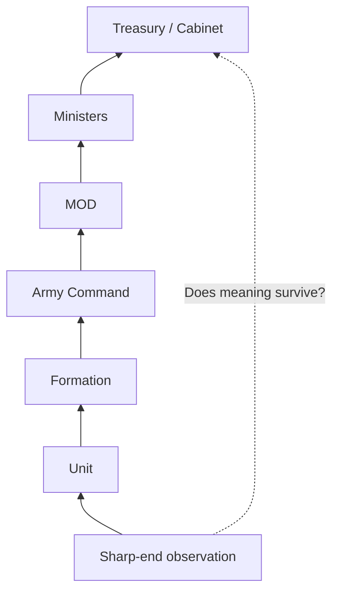
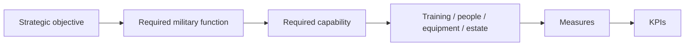

# 🔬 Tests And Investigations

**First created:** 2026-09-07 | **Last updated:** 2026-09-07
*What would we actually need to know before diagnosing Britain's current Army training problem?*

---

## 🔬 Orientation

The presenting complaint is straightforward enough:

> The British Army has reportedly been required to find approximately £30 million in savings, with significant collective training activity among the things affected.

The history is considerably less straightforward.

Britain has spent decades changing:

* force structure;
* strategic assumptions;
* personnel numbers;
* training models;
* estate;
* equipment;
* readiness requirements;
* alliance commitments;
* technology;
* procurement;
* deployment patterns.

The temptation is therefore to diagnose immediately.

Treasury cut the Army.

Army Command protected the wrong thing.

Ministers failed to understand readiness.

Procurement ate everything.

Austerity broke the system.

The Army is inefficient.

Technology is replacing exercises.

The current government fucked it.

The previous government fucked it.

Everybody fucked it.

Possibly.

But **none of those propositions should be the starting assumption**.

Before diagnosis comes investigation.

The useful question is:

> **What evidence would allow us to distinguish between competing explanations for why collective training has become vulnerable?**

This node is the investigation request.

---

## 🩸 1. Confirm the presenting complaint

Before investigating causes, establish precisely what has happened.

We need to know:

* the exact savings requirement;
* who received it;
* when;
* whether £30 million is the final figure or an approximate reporting figure;
* the financial year affected;
* which budget or budgets it applies to;
* which activities have been cancelled;
* which have been postponed;
* which have been reduced;
* which have been protected;
* what Defence means by **essential**;
* what Defence means by **non-essential**;
* what Defence means by **collective training**;
* whether the restriction applies Army-wide;
* whether exemptions exist;
* how long the restriction is expected to remain.

These distinctions matter.

**Cancelled** is not **postponed**.

**Reduced** is not **eliminated**.

**Training** is not one homogeneous activity.

And:

> **£30 million of expenditure does not necessarily equal £30 million of capability.**

---

## 🧾 2. Reconstruct the decision chain

This is the first major investigation.

Not:

> Who can we blame?

But:

> **How did the decision actually travel through the system?**

We need the earliest identifiable point at which somebody knew that the available financial settlement might affect collective training.

Then work forwards.



For every stage, ask:

* who owned the decision;
* who advised;
* who was consulted;
* what alternatives were presented;
* what risks were identified;
* whether the decision was escalated;
* whether ministers were informed;
* whether Treasury was involved;
* whether additional funding was requested;
* who formally accepted the resulting risk.

The important distinction is between:

> **the person who identified the saving**

and:

> **the person who created the financial conditions requiring the saving**

and:

> **the person who accepted the consequence.**

Those may be three different people.

---

## 🧿 3. Establish who could reasonably have known what, when

The current political chronology needs particular care.

Relevant offices and figures include:

* Defence Secretary;
* Armed Forces Minister;
* Chancellor;
* Prime Minister;
* Chief of the Defence Staff;
* Chief of the General Staff;
* Army Command;
* MOD Permanent Secretary;
* MOD finance;
* Treasury;
* relevant parliamentary committees.

For each:

| Question                                     | Evidence needed                                        |
| -------------------------------------------- | ------------------------------------------------------ |
| When could they first reasonably have known? | briefings, PQs, statements, published plans, reporting |
| Did their office possess the information?    | departmental chronology                                |
| Did they personally receive it?              | only claim where evidenced                             |
| Could they alter the decision?               | statutory/institutional responsibility                 |
| Did they seek alternatives?                  | correspondence, statements, parliamentary answers      |
| Did they accept a readiness risk?            | risk documentation or explicit ministerial answer      |

This avoids the extremely common mistake of treating:

> **was in office**

as equivalent to:

> **personally made this decision.**

It also avoids the opposite mistake:

> **I inherited it, therefore it isn't my problem.**

Government changes personnel.

Government does not stop governing.

---

## 💷 4. Identify the actual financial constraint

“Defence needs to save money” is insufficiently precise.

We need to establish:

* which spending category is constrained;
* whether this is an in-year pressure;
* whether the problem concerns RDEL;
* whether underspends elsewhere can legally or practically be moved;
* which budgets are ringfenced;
* which commitments are contractual;
* which expenditure is politically protected;
* what Treasury flexibilities exist;
* what MOD flexibilities exist;
* what has already been deferred;
* whether the Army has already exhausted easier savings.

The central counterfactual is:

> **If collective training had been protected, where could the £30 million realistically have come from instead?**

If the answer is:

> nowhere without causing greater damage,

that materially changes the assessment.

If the answer is:

> several alternatives existed but training was easiest to cancel,

that also materially changes the assessment.

---

## 🧮 5. Test whether flexibility became a liability

Training has a dangerous accounting characteristic.

It can often be stopped.

A shipbuilding contract cannot necessarily be stopped next Tuesday.

A submarine programme cannot casually be paused for three months.

Some equipment payments are already committed.

An exercise can disappear from the calendar.

That creates a hypothesis worth testing:



The question is:

> **Was training selected because it produced the least capability damage, or because it produced the fastest administratively available saving?**

Those are not the same optimisation problem.

---

## 🪖 6. Establish the Army's actual training requirement

Before asking whether training is adequate, define adequate.

For each relevant formation or capability:

* what individual training is required;
* what collective training is required;
* at what scale;
* how frequently;
* with which supporting arms;
* with which equipment;
* with which allied forces;
* with which live-fire component;
* with which synthetic component;
* what certification or validation is required;
* what must be repeated to prevent skill fade;
* what must be changed when doctrine changes.

The 2025 Strategic Defence Review matters here because current policy explicitly treats training as part of restoring readiness.

The investigation therefore needs to compare:

> **training required by the force model**

with:

> **training currently being delivered.**

Not merely:

> **training delivered this year versus training delivered last year.**

The baseline itself may already be inadequate.

---

## 🧠 7. Ask what training is trying to produce

This cluster should resist measuring activity before defining the functional output.

The objective is not:

> maximise exercise days.

The objective is something closer to:

> **produce formations capable of performing required military functions at the required notice, scale and level of integration.**

That means defining readiness in observable terms.

For example:

* mobilisation time;
* deployability;
* collective competence;
* command competence;
* logistics performance;
* equipment availability;
* allied interoperability;
* ability to operate when communications fail;
* ability to operate without assumed air superiority;
* casualty management;
* adaptation to changed doctrine;
* ability to sustain operations.

Only once the functional output is clear should we decide which KPIs measure it.

Otherwise Defence risks producing beautiful dashboards describing a force that cannot do the thing.

---

## 🔭 8. What does “ready” actually mean?

This requires several layers.

## Individual readiness

Can the person perform their role?

## Team readiness

Can people perform together?

## Unit readiness

Can the unit execute its assigned functions?

## Formation readiness

Can larger formations integrate:

* manoeuvre;
* fires;
* intelligence;
* engineering;
* communications;
* logistics;
* medical support;
* command?

## Joint readiness

Can the Army operate effectively with:

* RAF;
* Royal Navy;
* Strategic Command;
* cyber;
* space;
* intelligence?

## Allied readiness

Can Britain actually fight as part of NATO and other coalition structures?

## Sustained readiness

Can it do so for longer than the opening phase?

This final category is especially important.

A force can be capable of deploying once without being capable of sustaining a war.

---

## 🏋️ 9. Measure collective competence, not attendance

A training metric such as:

> X personnel attended Exercise Y

may be administratively useful.

It does not necessarily establish that the intended capability was produced.

Better questions include:

* What could the formation do before the exercise?
* What could it do afterwards?
* Which failures were identified?
* Were those failures subsequently retested?
* Did command relationships improve?
* Did logistics perform?
* Did communications degrade realistically?
* Were personnel exposed to useful uncertainty?
* Were allied systems integrated?
* Did the exercise reveal equipment problems?
* Did the exercise change doctrine or procedure?

The purpose of training is partly to discover failure **before an adversary does**.

A successful exercise is therefore not necessarily one in which everything went well.

Sometimes:

> **we found twelve things that broke**

is an excellent training result.

Provided somebody then fixes them.

---

## ⚙️ 10. Test the feedback loop

Akam's Iraq and Afghanistan material gives us a useful benchmark.

At its healthiest, operational learning could move:

> **theatre → instructor → next cohort.**

We need to know what the equivalent loop looks like now.



At every arrow:

> **How long does this take?**

And:

> **Who can stop it?**

Useful investigations include:

* lessons-learned systems;
* exercise after-action reporting;
* doctrine revision times;
* instructor feedback;
* Ukraine lesson integration;
* NATO lesson integration;
* course-change authority;
* classification barriers;
* procurement barriers;
* safety bureaucracy;
* estate limitations.

The feedback machine is only as fast as its slowest compulsory gate.

---

## 🎓 11. Instructor capacity

A training system requires trainers.

Investigate:

* establishment;
* actual staffing;
* vacancies;
* rank distribution;
* experience;
* instructor currency;
* operational experience;
* retention;
* posting incentives;
* prestige;
* civilian instructors;
* reservist contribution;
* allied instructors;
* contractor dependence.

Akam's OPTAG material gives us a historical warning:

> **expertise does not automatically travel to the place where the organisation most needs it.**

Prestige matters.

Career incentives matter.

Posting systems matter.

Therefore ask:

> **Are the people Defence most needs teaching currently incentivised to teach?**

---

## 🧩 12. Personnel: establishment is not availability

Headline Army numbers are not sufficient.

We need to distinguish:

* establishment;
* trained strength;
* trade-qualified strength;
* medically deployable personnel;
* personnel currently assigned elsewhere;
* instructors;
* trainees;
* personnel on leave;
* personnel preparing for deployment;
* personnel recovering from deployment;
* vacancies in critical trades;
* reserve availability.

The functional question is:

> **How many people are actually available to generate the required formation at the required time?**

A nominal soldier is not automatically available capability.

---

## 🏚️ 13. Estate: owned is not usable

Map:

* training areas;
* ranges;
* representative urban environments;
* accommodation;
* maintenance condition;
* availability;
* closures;
* competing demand;
* environmental restrictions;
* safety restrictions;
* transport;
* capacity.

Operation Interflex is particularly useful here because strategically valuable activity can still consume finite domestic training capacity.

Earlier Polaris work has already identified the core distinction:

> **empty ≠ available**

and:

> **owned ≠ usable.**

The same principle applies to training estate.

---

## 🚚 14. Logistics must be inside the exercise

A formation is not ready merely because the fighting elements can manoeuvre.

Investigate training for:

* fuel;
* ammunition;
* food;
* water;
* repair;
* recovery;
* transport;
* spares;
* medical evacuation;
* blood;
* communications;
* resupply under threat.

If logistics is consistently abstracted away during training, readiness can become fictional.

The Tuesday-roster question applies:

> **Who actually moves the fucking thing?**

---

## 🩸 15. Medical capability and casualty assumptions

Afghanistan created particular expectations around casualty evacuation.

Akam's Brecon example demonstrates why assumptions learned in one conflict may become dangerous in another.

Investigate:

* current CASEVAC assumptions;
* contested-airspace planning;
* prolonged field care;
* mass-casualty training;
* blood availability;
* rehabilitation pathways;
* casualty replacement;
* psychological preparation;
* training for degraded evacuation.

The objective is not to publish sensitive operational detail.

It is to establish whether current training reflects the casualty environment Defence itself says future war may produce.

---

## 🚁 16. Equipment availability during training

Owning equipment is different from being able to train with it.

For major systems, investigate:

* fleet size;
* availability;
* maintenance;
* spares;
* training allocation;
* simulator allocation;
* ammunition availability;
* instructor availability;
* restrictions on usage;
* cannibalisation;
* upgrade cycles.

If a formation is expected to fight with equipment it rarely trains with collectively, that is relevant.

If equipment is unavailable because it is being prioritised for operations, that is also relevant.

The explanation matters.

---

## 🤖 17. Synthetic versus live training

Do not frame this as:

> technology good

versus:

> muddy soldiers good.

Synthetic training can provide:

* repetition;
* scenario variation;
* lower marginal cost;
* decision practice;
* equipment familiarisation;
* distributed training;
* environments difficult to reproduce physically.

Live training provides things synthetic environments may reproduce imperfectly:

* physical exhaustion;
* terrain;
* weather;
* equipment failure;
* real logistics;
* interpersonal friction;
* physical movement;
* sensory overload;
* uncertainty generated by actual humans;
* trust.

The investigation therefore needs to ask:

> **For each training objective, what can be synthetic, what must remain live, and what evidence supports that allocation?**

Not:

> How much money can simulation save?

The first is force design.

The second is an accounting question.

---

## 🌐 18. Service-by-service comparison

The Army should not be investigated in isolation.

For the Royal Navy and RAF establish:

* current savings requirements;
* training reductions;
* exercise cancellations;
* flying-hour changes;
* sea-time changes;
* simulator substitution;
* readiness consequences;
* protected activity.

Then ask:

> **Why are the effects different?**

Possible explanations include:

* different financial pressures;
* different cost structures;
* different readiness models;
* different contractual commitments;
* different safety requirements;
* different ability to defer activity;
* different ministerial prioritisation.

Do not infer discrimination between services merely from different outcomes.

Investigate the mechanism.

---

## 🧩 19. Joint training

If Defence intends to be **integrated by design**, then service-specific readiness is not enough.

Investigate whether the three services have sufficient opportunities to practise together.

Questions include:

* Which exercises genuinely require multiple services?
* Which capabilities depend upon joint integration?
* How frequently is that integration rehearsed?
* Which joint exercises have been reduced?
* Are communications systems interoperable in practice?
* Are logistics systems integrated?
* Are command structures rehearsed?
* Does training include degraded or denied systems?
* Where does Strategic Command fit?

You cannot integrate three forces for the first time after somebody starts shooting at them.

---

## 🤝 20. NATO and allied training

Britain's force model is explicitly alliance-dependent.

Therefore readiness has to include:

* NATO standards;
* multinational exercises;
* command interoperability;
* communications;
* logistics;
* reinforcement;
* host-nation support;
* allied doctrine;
* shared operating procedures.

Investigate:

* which allied exercises Britain is committed to;
* which have been reduced;
* whether reductions affect NATO obligations;
* whether allies are compensating;
* whether Britain is compensating for allies elsewhere.

The relevant output is not national self-sufficiency.

It is credible allied warfighting capability.

---

## 🗺️ 21. Commitments versus force capacity

Build a public-domain commitments map.

Not operational plans.

Not classified readiness information.

The broad commitments already publicly acknowledged.

For example:

* homeland defence;
* NATO;
* nuclear deterrence;
* overseas territories;
* standing deployments;
* training Ukraine;
* maritime commitments;
* air policing;
* contingency requirements;
* support to civil authorities.

Then ask:

> **How many simultaneous demands is the current force model designed to sustain?**

And:

> **Which commitments consume the same scarce people, estate or equipment?**

The same unit cannot be in two places.

The same range cannot necessarily host two exercises.

The same instructor cannot teach two courses simultaneously.

This sounds embarrassingly obvious.

That does not make it administratively unimportant.

---

## 📋 22. The Tuesday-roster test

Every strategic ambition eventually becomes a roster.

For any commitment:

* Who commands it?
* Which unit performs it?
* How many personnel?
* Which trades?
* Which equipment?
* Which training precedes it?
* Which logistics support it?
* Which medical system?
* Which maintenance cycle?
* Which relief unit?
* What happens if another crisis begins?
* What gets cancelled to make it possible?

This is where strategy becomes executable state capacity.

> **What does Tuesday look like?**

If nobody can answer that, the policy is not yet a force plan.

---

## 🧾 23. The blank-cheque investigation

There is another test worth conducting separately from affordability.

Ask each service:

> **If the immediate answer to every request were “yes”, what training system would you actually design?**

Not because government should fund everything requested.

It should not.

The purpose is diagnostic.

Constraints can become so normal that organisations stop articulating what they actually require and instead ask only for what they think Treasury might permit.

So ask for:

### Ideal requirement

What would genuinely maximise resilience?

### Costed requirement

What would it cost?

### Minimum viable requirement

What cannot safely be lost?

### Five-year transition

What could realistically be changed now?

### Twenty-five-to-fifty-year direction

What should Britain begin building for 2050–2076?

Only then reintroduce constraints.

Otherwise:

> **austerity can become embedded inside the imagination before the budgeting conversation even begins.**

---

## 🔭 24. Future-force questions

The investigation should not assume the current Army structure is the correct structure plus insufficient money.

Ask:

* Which capabilities should expand?
* Which should contract?
* Which should disappear?
* Which should become joint?
* Which should sit under another service?
* Which should involve reserves?
* Which could involve civilians?
* Which require sovereign capability?
* Which can safely depend upon allies?
* Which need industrial mobilisation capacity?
* Which skills will be scarce?
* Which technologies alter training requirements?
* Which technologies create entirely new training requirements?

The objective is not:

> preserve every existing institution.

It is:

> **produce the functions Britain expects Defence to perform.**

---

## 🧠 25. Ask the awkward personnel question

Every large organisation contains people who:

* dislike each other;
* compete;
* belong to different institutional camps;
* have different theories;
* have previously argued;
* would not voluntarily spend Christmas together.

Fine.

The useful question is:

> **Who is extremely fucking good at the thing we currently need?**

A serious reset should identify:

* serving expertise;
* retired expertise;
* reservists;
* civilian specialists;
* academics;
* industry;
* allied personnel;
* people whose previous warnings proved correct;
* people whose previous proposals failed;
* internal dissenters.

Not every disagreement is obstruction.

Sometimes the person being a pain in the arse has found the fault.

---

## 🪟 26. Test whether bad news can travel upwards

This may be one of the most important investigations.

Ask personnel at several organisational levels:

> **What happens when you tell the next level that something cannot be delivered?**

Does the answer become:

* accepted;
* investigated;
* resourced;
* mitigated;
* downgraded;
* reframed;
* delayed;
* turned into a more convenient metric?

Then ask the next level the same question.

The purpose is not to manufacture conflict between ranks.

It is to identify information loss.



The crucial variable is not simply:

> **Did information move?**

It is:

> **Did its meaning survive the journey?**

---

## 🧈 27. Measure the friction

The desired system is not one with no governance.

It is one where necessary governance does not destroy useful information.

The analogy is good surgical gloves.

The point of the glove is protection.

But the glove also has to preserve enough tactile information that the person wearing it can distinguish what they are touching.

Defence governance has the same problem.

Too little control creates danger.

Too much poorly designed control destroys sensitivity.

We therefore need to identify friction created by:

* approval chains;
* JSPs;
* classification;
* procurement;
* safety rules;
* estate booking;
* finance;
* personnel policy;
* course accreditation;
* inter-service boundaries.

Then distinguish:

> **friction that manages genuine risk**

from:

> **friction that exists because the system accumulated it.**

Do not abolish the glove.

Make the fucking glove fit.

---

## 📊 28. KPIs come after objectives

Do not begin with:

* exercise days;
* personnel numbers;
* money spent;
* courses completed;
* equipment purchased.

Begin with:

> **What functional output are we trying to achieve?**

Then define the measures.



If the chain runs backwards:

```text
KPI → activity → budget → hopefully readiness
```

we may be measuring administrative survival rather than military capability.

---

## 🧪 29. Useful evidence sources

This investigation should preferentially use material already in the public domain.

### Primary / official

* Strategic Defence Reviews;
* Defence Command Papers;
* Defence Investment Plan;
* MOD annual reports;
* service publications;
* parliamentary questions;
* ministerial statements;
* Defence Committee evidence;
* Public Accounts Committee evidence;
* NAO reports;
* Defence Safety Authority material;
* procurement publications;
* published doctrine where appropriate.

### Parliamentary

* Hansard;
* written questions;
* committee transcripts;
* committee reports;
* ministerial correspondence released publicly.

### Professional / scholarly

* RUSI;
* RAND;
* IISS;
* King's College London;
* service journals;
* peer-reviewed military studies;
* historical scholarship;
* operational histories.

### Contemporary reporting

* Forces News;
* specialist defence press;
* BBC;
* Reuters;
* Financial Times;
* Times;
* Telegraph;
* Guardian;
* other reporting where evidentially useful.

### Lived professional evidence

* serving personnel where lawfully and safely published;
* veterans;
* instructors;
* service families;
* disabled veterans;
* former senior commanders;
* civilian Defence staff.

Rank is relevant context.

It is not a truth score.

---

## 🚧 30. What this investigation does **not** require

We do not need:

* classified operational plans;
* classified readiness data;
* sensitive vulnerabilities;
* unit locations not already legitimately public;
* intelligence assessments;
* targeting information;
* detailed mobilisation plans;
* anything which would materially assist a hostile actor.

The objective is bounded explanation.

The existing Polaris rule elsewhere in `🌊_Playing_Defence` is useful here:

> **Not reckless disclosure.
> Not managed ignorance.**

There is already an enormous amount that can be evaluated through:

* published policy;
* budgets;
* parliamentary accountability;
* historical evidence;
* aggregate capability information;
* professional scholarship.

The public does not need the war plan to ask whether government has funded the training policy it publicly announced.

---

## ⚠️ 31. Absence of public evidence is not evidence of absence

Several investigation outcomes will remain uncertain.

For example:

> We found no public evidence that Treasury was asked for £30 million.

This supports:

> **No such request has been identified in the public record reviewed.**

It does **not** support:

> **Treasury was never asked.**

Likewise:

> We found no published readiness assessment.

does not establish:

> **No readiness assessment occurred.**

Where public evidence stops, say so.

Then decide whether the missing information belongs in:

* parliamentary scrutiny;
* FOI;
* committee inquiry;
* ministerial clarification;
* future historical record.

---

## 🗂️ 32. Investigation matrix

The cluster should eventually be able to populate something like this:

| Investigation             | Current evidence              | Confidence | Missing evidence         | Best route                   |
| ------------------------- | ----------------------------- | ---------: | ------------------------ | ---------------------------- |
| Exact £30m requirement    | reporting / official response |        TBD | documentary confirmation | MOD / PQ                     |
| Decision origin           | incomplete                    |        low | chronology               | PQ / committee               |
| Ministerial knowledge     | incomplete                    |        low | briefing chronology      | ministerial clarification    |
| Army training requirement | partial                       |     medium | detailed public baseline | MOD / doctrine / scholarship |
| Readiness effect          | disputed / incomplete         |        low | assessment methodology   | MOD / expert evidence        |
| RAF comparison            | incomplete                    |        low | equivalent reduction     | PQ                           |
| Navy comparison           | incomplete                    |        low | equivalent reduction     | PQ                           |
| Estate constraint         | evidence exists               |     medium | current utilisation      | NAO / MOD                    |
| Instructor capacity       | TBD                           |        TBD | staffing / vacancies     | MOD / scholarship            |
| Synthetic substitution    | policy evidence exists        |     medium | effectiveness evidence   | trials / scholarship         |
| NATO consequence          | TBD                           |        TBD | obligation comparison    | NATO / MOD                   |
| Alternative savings       | unknown                       |        low | options considered       | government clarification     |

This table should change as evidence arrives.

That is the point.

---

## 🩻 33. What would materially change the diagnosis?

Several findings would substantially alter the eventual assessment.

### Finding A

Army Command concluded the affected activity could be postponed with negligible readiness consequences.

**Implication:** current criticism may be overstating the capability effect.

### Finding B

Army Command warned of significant readiness consequences but was ordered to proceed.

**Implication:** identify where and why that risk was accepted.

### Finding C

The Army independently selected training from several available savings.

**Implication:** investigate Army prioritisation rather than assuming Treasury imposed the specific trade-off.

### Finding D

Army budgets contain effectively unavoidable in-year commitments leaving training as one of very few movable lines.

**Implication:** the deeper problem may be budget architecture rather than the individual decision.

### Finding E

Equivalent RAF and Navy reductions exist but have simply received less reporting.

**Implication:** this is a wider Defence affordability story.

### Finding F

Other services were protected while Army collective training absorbed disproportionate pressure.

**Implication:** investigate why.

### Finding G

£30 million can be restored without significant displacement elsewhere.

**Implication:** immediate political resolution becomes substantially easier.

The investigation should be designed to **permit us to be wrong**.

Otherwise it is not an investigation.

---

## 🧭 34. The question underneath all the questions

Ultimately:

> **What does Britain want its Armed Forces to be able to do, under what conditions, for how long, and what combination of people, training, equipment, infrastructure and alliances is actually required to do it?**

Everything else follows from that.

Money matters.

Technology matters.

Personnel numbers matter.

Platforms matter.

But none of those is the objective.

They are inputs.

The objective is functional capability.

---

## 🔬 Working investigation request

Before diagnosing the September 2026 Army training dispute, establish:

1. **what has actually been reduced;**
2. **why the saving was required;**
3. **why training was selected;**
4. **who knew and when;**
5. **who accepted the readiness consequence;**
6. **what the Army actually requires to meet current policy;**
7. **whether people, estate and equipment permit that training;**
8. **whether RAF and Navy experience comparable constraints;**
9. **whether current readiness measures describe functional capability;**
10. **what force-generation system Britain actually wants for the next five, twenty-five and fifty years.**

Only then diagnose.

---

## 🧿 Provisional conclusion

The £30 million question is important.

But it is an investigation trigger, not yet an explanation.

If Britain has a £30 million problem, find the £30 million problem.

If Britain has a training-capacity problem, find the training-capacity problem.

If Britain has an estate problem, find the estate problem.

If Britain has a personnel problem, find the personnel problem.

If Britain has a force-design problem, find the force-design problem.

If Britain has an information problem in which people at the sharp end know something that repeatedly loses meaning on its journey towards ministers, **find the fucking information problem**.

Do not make one small budget line carry the explanatory burden for thirty years of Defence policy.

And do not spend another thirty years commissioning reviews which correctly identify the same problem without changing the machinery that keeps reproducing it.

---

---

## 🌌 Constellations
🔬 🪖 ⚙️ 💷 🔭 🏚️ 🧠 — Army training; readiness measurement; force generation; Defence affordability; estate; personnel; institutional feedback; future force design.

---

## ✨ Stardust
british army training, collective training, readiness, force generation, defence affordability, army estate, military personnel, synthetic training, live training, nato interoperability, defence investment plan, strategic defence review, army readiness, military exercises, defence feedback loops

---

## 🏮 Footer

*🔬 Tests And Investigations* is a living node of the **Polaris Protocol**.  
It defines the evidence required before the cluster assigns causes, responsibility or capability consequences.

> 📡 Cross-references:
>
> - [`🧠_assessment_and_differential.md`](./🧠_assessment_and_differential.md) — *competing explanations once the evidence is assembled*
> - [`🚑_immediate_management.md`](./🚑_immediate_management.md) — *what can be done about the current disruption*
> - [`🧾_the_blank_cheque_exercise.md`](./🧾_the_blank_cheque_exercise.md) — *discovering unconstrained requirements before reintroducing affordability*
> - [`🔭_what_does_ready_actually_look_like.md`](./🔭_what_does_ready_actually_look_like.md) — *defining functional outputs*
> - [`⚙️_the_feedback_machine.md`](./⚙️_the_feedback_machine.md) — *testing whether information survives institutional transmission*
> - [`🪖_what_training_is_for.md`](./🪖_what_training_is_for.md) — *evidence on collective competence and skill retention*
> - [`💷_thirty_million_pounds.md`](./💷_thirty_million_pounds.md) — *reconstructing the immediate affordability decision*
> - [`data/open_questions.md`](./data/open_questions.md) — *live evidential gaps*
>  
> 🏮 Return To:
>
> - [🪖 Training Debrief](./README.md) — *1up*
> - [🌊 Playing Defence](../README.md) — *2up*
> - [📲 Press Matters](../../README.md) — *3up*
> - [🌓 In The Moment](../../../README.md) — *4up*
> - [🌌 Polaris Protocol — Root](../../../../README.md) — *root*

*Survivor authorship is sovereign. Containment is never neutral.*

_Last updated: 2026-09-07_
