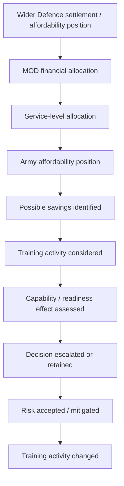
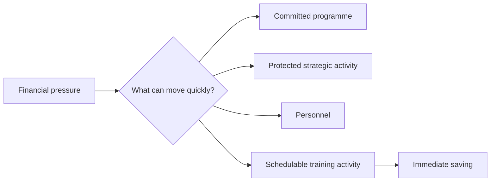

# 🔬 Tests And Investigations
**First created:** 2026-09-07 | **Last updated:** 2026-09-14  
*What would we actually need to know before diagnosing Britain's current Army training problem?*

---

## 🔬 Orientation

The presenting complaint is straightforward enough:

> The British Army has reportedly been required to find approximately **£30 million in savings**, with significant collective-training activity among the things affected.

The history is considerably less straightforward.

Britain has spent decades changing:

- force structure;
- strategic assumptions;
- personnel numbers;
- training models;
- estate;
- equipment;
- readiness requirements;
- alliance commitments;
- technology;
- procurement;
- deployment patterns.

The temptation is therefore to diagnose immediately.

Treasury cut the Army.

Army Command protected the wrong thing.

Ministers failed to understand readiness.

Procurement ate everything.

Austerity broke the system.

The Army is inefficient.

Technology is replacing exercises.

The current government fucked it.

The previous government fucked it.

Everybody fucked it.

Possibly.

But **none of those propositions should be the starting assumption**.

Before diagnosis comes investigation.

The useful question is:

> **What evidence would allow us to distinguish between competing explanations for why collective training has become vulnerable?**

This node is the investigation request.

It does not assume that the reported £30 million pressure created a £30 million capability loss, that every exercise change was financially driven, that every Service was treated identically, or that every absence in the public record represents an absence inside Defence.

The job is to reconstruct the system carefully enough that those propositions can be tested.

---

## 🩸 1. Confirm the presenting complaint

Before investigating causes, establish precisely what has happened.

We need to know:

- the exact savings requirement;
- whether approximately £30 million is the final figure or a reporting approximation;
- which organisation or command received the requirement;
- when it was received;
- the financial year affected;
- which budget or budgets it applies to;
- which activities have been cancelled;
- which have been postponed;
- which have been reduced;
- which have been redesigned;
- which have been protected;
- what Defence means in this context by **essential**, **non-essential** and **collective training**;
- whether the restriction applies Army-wide;
- whether exemptions exist;
- how long the restriction is expected to remain.

These distinctions matter.

**Cancelled** is not **postponed**.

**Reduced** is not **eliminated**.

**Redesigned** is not necessarily **degraded**.

And **training** is not one homogeneous activity.

The immediate evidence base should therefore distinguish:

```text
reported saving
      ↓
specific activity changed
      ↓
training function affected
      ↓
mitigation or replacement
      ↓
readiness consequence
```

Do not jump directly from the first box to the last.

> **£30 million of expenditure does not necessarily equal £30 million of capability.**

---

## 🧾 2. Reconstruct the decision chain

This is the first major investigation.

Not:

> Who can we blame?

But:

> **How did the decision actually travel through the system?**

Identify the earliest point at which the affordability position could reasonably have affected collective training, then work forwards.



For every stage ask:

- who owned the decision;
- who advised;
- who was consulted;
- what alternatives were presented;
- what risks were identified;
- whether the decision was escalated;
- whether ministers were informed;
- whether HM Treasury was involved;
- whether additional funding or flexibility was requested;
- what mitigation was proposed;
- who had authority to accept the resulting risk.

The important distinction is between:

> **the person who identified the saving**

and:

> **the person who created the financial conditions requiring a saving**

and:

> **the person who accepted the capability consequence.**

Those may be different people.

---

## 🧿 3. Establish who could reasonably have known what, when

Political chronology needs particular care.

Relevant offices and institutions may include:

- Secretary of State for Defence;
- Minister for the Armed Forces;
- Chancellor of the Exchequer;
- Prime Minister;
- Chief of the Defence Staff;
- Chief of the General Staff;
- Army Command;
- MOD Permanent Secretary;
- MOD finance functions;
- HM Treasury;
- relevant parliamentary committees.

For each, distinguish institutional possession from personal knowledge.

| Question | Evidence needed |
| --- | --- |
| When could the office first reasonably have known? | briefings, published plans, PQs, statements, reporting |
| Did the organisation possess the information? | departmental chronology |
| Did the individual personally receive it? | claim only where evidenced |
| What authority did they possess? | formal responsibilities and delegations |
| Were alternatives sought? | correspondence, answers, minutes or statements where public |
| Was capability or readiness risk accepted? | risk documentation or explicit accountable answer |

This avoids treating:

> **was in office**

as equivalent to:

> **personally made this decision.**

It also avoids the opposite error:

> **I inherited it, therefore it isn't my problem.**

Government changes personnel.

Government does not stop governing.

---

## 💷 4. Identify the actual financial constraint

“Defence needs to save money” is insufficiently precise.

Establish:

- which spending category is constrained;
- whether this is an in-year pressure;
- whether the relevant pressure sits in resource or capital expenditure;
- which budgets are delegated;
- which budgets are ringfenced;
- what can legally and practically be moved;
- which commitments are contractual;
- which expenditure has already been committed;
- what has already been deferred;
- whether the Army had already exhausted other savings;
- what Treasury and MOD flexibilities existed at the relevant time.

Do not assume that a large capital programme can simply be raided to fund a smaller resource pressure.

Likewise, do not assume that the existence of contractual commitments proves that training was the only movable line.

The counterfactual is:

> **If the affected collective training had been protected, where could the required saving realistically have come from instead, and what would the consequence have been?**

If the answer is:

> nowhere without causing greater capability damage,

that materially changes the diagnosis.

If several lower-cost alternatives existed but training was administratively easiest to stop, that changes it in another direction.

---

## 🧮 5. Test whether flexibility became a liability

Training has a potentially dangerous accounting characteristic.

It can often be changed quickly.

A long-term equipment programme may have contractual, industrial or strategic constraints.

Personnel expenditure may be difficult to alter in-year.

An exercise can sometimes disappear from the calendar.

That creates a hypothesis worth testing:



The question is:

> **Was training selected because changing it produced the least capability damage, or because it produced the fastest administratively available saving?**

Those are different optimisation problems.

This remains a hypothesis until the budget architecture and alternatives considered are established.

---

## 🪖 6. Establish the Army's actual training requirement

Before asking whether training is adequate, define adequate.

For each relevant capability or formation establish:

- required individual training;
- required collective training;
- required scale;
- required frequency;
- supporting arms and functions;
- equipment;
- live-fire requirement;
- synthetic component;
- joint component;
- allied component;
- validation or certification requirement;
- skill-fade assumptions;
- retraining required after doctrinal or equipment change.

Current policy matters because the 2025 Strategic Defence Review explicitly treats training as part of restoring warfighting readiness and supports both advanced simulation and necessary live activity.

The investigation therefore compares:

> **training required by the force model**

with:

> **training actually being delivered.**

Not merely:

> **training delivered this year versus training delivered last year.**

The historical baseline may itself be inadequate, excessive, differently configured, or designed for another requirement.

---

## 🧠 7. Ask what training is trying to produce

Do not measure activity before defining the output.

The objective is not:

> maximise exercise days.

It is closer to:

> **produce forces capable of performing required military functions at the required notice, scale, duration and level of integration.**

That means identifying observable outputs such as:

- mobilisation;
- deployability;
- collective competence;
- command competence;
- logistics performance;
- equipment integration;
- allied interoperability;
- operation under degraded communications;
- adaptation to changed doctrine;
- casualty management;
- sustainment;
- regeneration.

Only once the functional output is clear should measures and KPIs be selected.

Otherwise Defence can produce beautiful dashboards describing a force that cannot do the thing.

---

## 🔭 8. Define readiness before measuring it

Readiness is not one state.

### Individual readiness

Can the person perform the required role?

### Team readiness

Can people perform together?

### Unit readiness

Can the unit execute its assigned functions?

### Formation readiness

Can larger formations integrate manoeuvre, fires, intelligence, engineering, communications, logistics, medical support and command?

### Joint and integrated readiness

Can the required military functions work across Services, commands and domains?

### Allied readiness

Can Britain operate effectively inside NATO and other coalition structures?

### Sustained readiness

Can the force continue after the opening phase, rotate, recover and regenerate?

That final category matters.

A force capable of deploying once is not necessarily a force capable of sustaining conflict.

---

## 🏋️ 9. Measure collective competence, not attendance

A metric such as:

> X personnel attended Exercise Y

may be administratively useful.

It does not establish that the intended capability was produced.

Ask instead:

- What could the formation do before the activity?
- What could it do afterwards?
- Which failures were identified?
- Were those failures subsequently retested?
- Did command relationships improve?
- Did logistics perform?
- Did communications degrade realistically?
- Were personnel exposed to useful uncertainty?
- Were allied or joint systems integrated?
- Did equipment fail?
- Did the exercise alter doctrine, procedure or subsequent training?

The purpose of training is partly to discover failure **before an adversary does**.

A successful exercise is therefore not necessarily one in which everything went well.

Sometimes:

> **we found twelve things that broke**

is an excellent result.

Provided somebody then fixes them.

---

## ⚙️ 10. Test the feedback loop

Historical Iraq and Afghanistan material gives a useful benchmark: at its healthiest, operational learning could move rapidly from theatre into training.

The current investigation needs to establish the equivalent loop now.


At every arrow ask:

> **How long does this take?**

And:

> **Who can stop it?**

Investigate:

- lessons systems;
- after-action reporting;
- doctrine-revision times;
- instructor feedback;
- incorporation of Ukraine lessons;
- NATO learning;
- course-change authority;
- classification barriers;
- procurement barriers;
- safety controls;
- estate limitations.

The feedback machine is only as fast as its slowest compulsory gate.

---

## 🎓 11. Establish instructor capacity

Instructor capacity must be established rather than inferred from overall personnel strength.

Investigate:

- authorised instructor establishment;
- filled posts;
- vacancies;
- Regular, Reserve and FTRS contribution where relevant;
- civilian and contractor contribution;
- rank and trade distribution;
- qualification requirements;
- operational currency;
- average tenure;
- instructor-to-student demand;
- whether posts are deliberately held vacant;
- whether instructors are routinely diverted to other tasks;
- whether shortages are local, trade-specific or systemic.

The historical OPTAG experience provides a warning:

> **expertise does not automatically travel to the place where the organisation most needs it.**

The current question is whether that problem exists now, in what form, and with what consequence.

Career incentives matter.

Prestige matters.

Posting systems matter.

Therefore ask:

> **Are the people Defence most needs teaching currently able and incentivised to teach?**

---

## 🧩 12. Personnel: strength is not availability

Use official personnel categories before inventing analytical ones.

Depending upon the question, relevant published measures may include:

- Strength;
- Regular Strength;
- Full-Time Trained Strength;
- Army Full-Time Trade Trained Strength;
- Volunteer Reserve strength;
- trained Reserve strength;
- gains to trained or trade-trained strength;
- trained or trade-trained outflow.

Then establish which population is functionally relevant to the capability under examination.

Where evidence permits, distinguish:

- Medically Fully Deployable;
- Medically Limited Deployable;
- Medically Non-Deployable;
- committed personnel;
- instructors;
- trainees;
- critical-trade vacancies;
- Reserve availability;
- personnel assigned elsewhere;
- recovery, leave and post-deployment effects.

Do not crudely subtract every person with a medical limitation from military capability. Medical categories do not map neatly onto “usable” and “unusable” for every task.

The investigation is not trying to manufacture one magical **real Army number**.

It is trying to answer:

> **How many appropriately trained and available people can generate the particular capability at the required time?**

Or:

> **trained ≠ trade trained ≠ medically unrestricted ≠ available to this formation on Tuesday.**

---

## 🏚️ 13. Estate: owned is not usable

Treat estate availability as a chain.

```text
exists
↓
safe / serviceable
↓
available on required date
↓
configured for required training
↓
has required ranges / infrastructure
↓
has supporting instructors / equipment
↓
usable for required training output
```

Investigate:

- ownership or access;
- physical condition;
- maintenance;
- safety restrictions;
- environmental restrictions;
- availability;
- competing users;
- short-notice demand;
- accommodation;
- transport;
- range capacity;
- representative environments;
- infrastructure required for live/synthetic integration.

Operation Interflex is a useful contemporary example of **capacity contention**: strategically valuable activity can consume finite training-estate capacity.

That does not make Interflex a catch-all explanation for estate weakness.

The rule is:

> **owned ≠ usable.**

---

## 🚚 14. Put logistics inside the exercise

A formation is not ready merely because its fighting elements can manoeuvre.

For each sustainment function distinguish whether it was:

- physically exercised;
- synthetically represented;
- administratively assumed;
- omitted.

Investigate:

- fuel;
- ammunition;
- food;
- water;
- spares;
- maintenance;
- repair;
- recovery;
- transport;
- communications;
- medical supply;
- resupply under threat.

The important question is not simply:

> Was logistics included?

It is:

> **Which sustainment functions were genuinely exercised, and which existed only as exercise assumptions?**

The Tuesday-roster question applies:

> **Who actually moves the fucking thing?**

---

## 🩸 15. Test medical capability and casualty assumptions

Start from current requirements rather than assuming that Afghanistan-era casualty models remain appropriate.

Ask:

> **What casualty-care and evacuation assumptions are embedded in current training, and do they match current doctrine and the casualty environment Defence says it is preparing for?**

Investigate:

- point-of-injury care;
- combat-life-saver competence;
- evacuation assumptions and timelines;
- delayed or prolonged evacuation;
- contested-airspace assumptions;
- mass-casualty training;
- blood;
- treatment capacity;
- patient movement;
- personnel recovery;
- casualty replacement;
- regeneration;
- psychological preparation where relevant.

Maintain a critical distinction:

> **Medical support present at an exercise ≠ medical system tested by the exercise.**

A real ambulance standing by to make training safe does not by itself establish that operational casualty handling was exercised.

---

## 🚁 16. Equipment inventory is not training availability

Treat equipment as another availability chain.

```text
inventory
↓
in service
↓
serviceable / available
↓
allocated
↓
available for training
↓
available at required scale
↓
usable throughout the activity
```

Investigate:

- inventory;
- in-service fleet;
- availability where appropriately public;
- maintenance;
- spares;
- training allocation;
- ammunition;
- simulator access;
- instructor access;
- usage restrictions;
- upgrade and conversion periods;
- substitution with different equipment;
- cannibalisation where evidenced;
- whether equipment constraints changed exercise design.

The investigation does not require publication of operationally sensitive readiness figures.

It can often establish whether equipment availability constrained training without establishing the precise number of available platforms.

### Fleet transition

Ask:

> **Is the formation training on the equipment it is expected to fight with now, the equipment it will fight with next, or an interim mixture?**

Then establish:

- conversion burden;
- instructor qualification on old and new systems;
- estate compatibility;
- simulator availability;
- doctrine changes;
- whether equipment arrival precedes collective competence;
- whether transition temporarily reduces usable fleet scale.

### Human factors

Equipment can itself create training or medical constraints.

Where relevant investigate:

- noise;
- vibration;
- motion effects;
- ergonomics;
- cognitive workload;
- fatigue;
- PPE interaction;
- safety mitigations and their training consequences.

The question is:

> **Does the equipment itself alter how much usable capability can safely be generated?**

---

## ⛓️ 17. Test the whole availability chain

Sections 11–16 should not be treated as independent inventories.

They form one force-generation system.

```text
Required military capability
          ↓
Suitable trained people
          ↓
Available instructors
          ↓
Usable estate
          ↓
Available equipment
          ↓
Sustainment
          ↓
Medical support
          ↓
Collective activity
          ↓
Validated capability
```

At every arrow ask:

> **What can break here?**

Four useful rules follow:

> **Strength is not availability.**

> **Owned is not usable.**

> **Inventory is not capability.**

> **Support present is not support tested.**

---

## 🤖 18. Test synthetic substitution

Do not frame the investigation as:

> technology good

versus:

> muddy soldiers good.

The question is narrower.

For each affected training objective establish:

- the intended output;
- the previous live component;
- the synthetic component;
- whether technology **augments, prepares for, substitutes for, or validates** live activity;
- what evidence supports that allocation;
- what evidence exists for transfer into real performance;
- whether subsequent live validation occurs;
- whether certification requirements change;
- which physical, environmental or collective variables are absent;
- whether total risk is reduced or merely relocated.

The key question is:

> **What function is being transferred from live to synthetic training, and what evidence demonstrates that the required competence still transfers into real performance?**

The wider future-facing question — how VR, AR, synthetic environments and human-machine systems might be deliberately integrated to reduce physical risk and improve future training — belongs in [🪖 Futures of Defence](../../../../🌕_5_Long_Strategies/❤️‍🩹_Rehabilitated_Tech/🤖_AI_Beyond_AI/🪖_futures_of_defence.md).

---

## 🌐 19. Compare the Services properly

Do not infer different affordability treatment simply from different exercise programmes.

For the Army, Royal Navy and Royal Air Force separate:

### Planned strategic reprioritisation

Changes intended before the immediate affordability dispute.

### Ordinary programme variation

Exercise programmes vary because of operational demand, readiness cycles, allies, host nations, equipment and other routine factors.

### Additional affordability action

Only after controlling for the first two categories should activity altered specifically because of immediate financial pressure be isolated.

| Service | Baseline programme | Planned strategic change | Normal variation | Additional affordability action | Protected outputs | Readiness effect |
| --- | --- | --- | --- | --- | --- | --- |
| Army | establish | establish | establish | establish | establish | establish |
| Royal Navy | establish | establish | establish | establish | establish | establish |
| Royal Air Force | establish | establish | establish | establish | establish | establish |

Then ask:

> **After controlling for planned changes and normal variation, did the Services actually experience materially different affordability treatment?**

Possible mechanisms include:

- different financial pressures;
- different cost structures;
- different readiness cycles;
- different contractual commitments;
- different training models;
- different operational commitments;
- different ability to defer activity;
- different assessed consequences;
- different prioritisation.

> **Do not infer inter-Service favouritism from different outcomes. Investigate the mechanism.**

---

## 🧩 20. Test integrated-force training

If Defence intends to be **integrated by design**, service-specific readiness is insufficient.

For each affected exercise establish which functions were supposed to integrate across:

- Army;
- Royal Navy;
- Royal Air Force;
- relevant joint command structures;
- cyber;
- space;
- electromagnetic activity;
- intelligence;
- communications and information systems;
- medical;
- logistics;
- allies.

Ask:

- Which command relationships were being rehearsed?
- Which communications and data systems were being integrated?
- Were joint fires or targeting functions relevant?
- Which sustainment functions crossed Service boundaries?
- Were degraded systems exercised?
- Did allied elements participate?
- Was a specifically integrated output being validated?
- If the activity disappears, where will equivalent integration next be tested?

The core question is:

> **What integration was this exercise supposed to make work before somebody needs it operationally?**

You cannot integrate three forces for the first time after somebody starts shooting at them.

---

## 🤝 21. Test NATO and allied readiness

Britain's current force model is explicitly alliance-dependent.

Start from:

> **Which publicly acknowledged alliance requirement is the force being generated to meet?**

For relevant training establish:

- whether it contributes to a NATO-assigned or NATO-oriented requirement;
- readiness notice where appropriately public;
- required scale;
- multinational validation or certification;
- interoperability standards;
- command integration;
- communications and data requirements;
- reinforcement requirements;
- host-nation-support dependencies;
- logistics interoperability;
- whether training with actual partner formations is required;
- whether an equivalent multinational opportunity exists if an activity is removed.

Do not confuse branding with function.

> **NATO-relevant training is not synonymous with an exercise carrying a NATO logo.**

A domestic exercise may generate capability intended for NATO.

A multinational exercise does not automatically validate every relevant readiness requirement.

Investigate the capability relationship.

---

## 🗺️ 22. Map commitments against force capacity

Build a bounded public-domain commitments map.

Not operational plans.

Not classified readiness information.

Start with the Government's own strategic framework and then map publicly acknowledged commitments beneath it.

Broadly, that means considering functions associated with:

- defence of the United Kingdom, Overseas Territories and Crown Dependencies, and national resilience;
- Euro-Atlantic deterrence and defence centred on NATO;
- wider global shaping, partnership and other acknowledged commitments.

For each commitment establish:

- required military function;
- relevant force type;
- readiness requirement;
- duration;
- whether standing, recurring or contingent;
- training requirement;
- specialist personnel;
- estate dependency;
- equipment dependency;
- logistics dependency;
- medical dependency;
- allied dependency.

This is also where Overseas Territories belong in the force-capacity investigation.

The question is:

> **What publicly declared Defence functions do the Overseas Territories generate, and what force-generation requirements follow?**

Whether NATO itself has a treaty or strategic obligation in a particular geography is a separate question and should not be inferred from the United Kingdom's sovereign responsibilities.

Then ask:

> **Which commitments consume the same scarce people, equipment, estate or support functions?**

The same resource cannot always satisfy two demands simultaneously.

Embarrassingly obvious.

Administratively important.

---

## 🔀 23. Run the simultaneity test

Defence can potentially demonstrate:

> capability A exists;

> capability B exists;

> capability C exists;

without demonstrating:

> **A + B + C can be sustained simultaneously.**

For publicly acknowledged commitments ask:

- which can plausibly overlap;
- which standing commitments already consume capacity;
- which draw upon the same formations or force elements;
- which draw upon the same specialist trades;
- which use the same lift;
- which require the same training estate;
- which need the same logistics;
- which need the same medical capability;
- which need the same intelligence, cyber or communications support;
- which require relief formations;
- which can be delayed;
- which cannot;
- what regeneration follows.

The central distinction is:

> **Can Britain perform each task?**

is not equivalent to:

> **Which combinations can Britain perform simultaneously, at the required readiness, for the required duration?**

Sequence matters too.

```text
Commitment A + Commitment B
            ↓
Initial force generated
            ↓
Sustained operation
            ↓
Relief / rotation
            ↓
Recovery
            ↓
Retraining
            ↓
Ready again
```

Where does the system bottleneck?

A heavily committed force may possess enough people to deploy while progressively consuming its opportunity to **train the next force**.

---

## 📋 24. Apply the Tuesday-roster test

This test does not require publication of sensitive readiness figures, mobilisation plans or detailed operational tasking.

It asks whether strategic commitments have been translated internally into executable resource requirements, and whether sufficient aggregate evidence exists to test the plausibility of the resulting force model.

For any commitment ask:

- Who commands the function?
- What force element or type of unit is required?
- How many personnel?
- Which trades?
- Which equipment?
- Which training precedes it?
- Which logistics support it?
- Which medical system?
- Which maintenance cycle?
- Which relief or rotation?
- What happens if another crisis begins?
- What gets displaced to make it possible?

This is where strategy becomes executable state capacity.

> **What does Tuesday look like?**

If nobody can answer that, the policy is not yet a force plan.

---

## 🧾 25. Run the unconstrained-requirement test

Before affordability modifies the answer, establish what capability the professional requirement actually implies.

This is not an invitation to fund everything anybody wants.

It is a diagnostic test against allowing constraint to become embedded inside the requirement before the budgeting conversation begins.

For each requirement establish:

### Ideal requirement

What would maximise the intended military output?

### Costed requirement

What would it cost?

### Minimum viable requirement

What cannot be lost without changing the output or accepting additional risk?

### Near term — approximately five years

What can realistically change inside current personnel, estate, programme and spending constraints?

### Future-force horizon — toward 2040

What should Britain already be building given the operating environments Defence itself expects to face?

### Generational horizon — beyond 2040

Which capabilities have sufficiently long lead times that decisions must precede precise operational requirements?

These are **Polaris analytical horizons**, not formal MOD planning cycles.

For every proposed requirement state the assumptions underneath it:

- threat or mission;
- readiness;
- warning time;
- allied contribution;
- mobilisation;
- technology;
- acceptable risk.

Otherwise an apparently objective requirement can conceal a very expensive assumption.

> **Austerity should not become embedded inside the imagination before the budgeting conversation even begins.**

---

## 🔭 26. Test today's decisions against the future force

Do not assume the current force structure is correct plus insufficient money.

But keep the forensic question narrow:

> **Do today's force-generation decisions remain compatible with the future force Defence says it intends to build?**

Investigate:

- capabilities expected to expand;
- capabilities expected to contract;
- functions expected to become more integrated;
- skills likely to become scarce;
- sovereign dependencies;
- allied dependencies;
- infrastructure with long lead times;
- technologies creating new training requirements;
- transition burdens between current and future systems.

For any capability being reduced ask:

> **What is its regeneration time?**

A saving can be rational in the immediate year and still be strategically expensive if it dismantles something slow, difficult or costly to rebuild.

The broader normative design of future military technology and training belongs in [🪖 Futures of Defence](../../../../🌕_5_Long_Strategies/❤️‍🩹_Rehabilitated_Tech/🤖_AI_Beyond_AI/🪖_futures_of_defence.md).

---

## 🧠 27. Find the people who actually know

Every large organisation contains people who:

- dislike each other;
- compete;
- belong to different institutional camps;
- hold different theories;
- have previously argued;
- would not voluntarily spend Christmas together.

Fine.

The useful question remains:

> **Who is extremely fucking good at the thing we currently need?**

Deliberately sample different forms of expertise:

- current command responsibility;
- recent operational experience;
- instructors;
- specialist trades;
- maintainers;
- medics;
- logisticians;
- reservists;
- veterans with relevant recent experience;
- civilian Defence specialists;
- technical specialists;
- industry;
- academics;
- allied personnel;
- internal dissenters;
- people associated with successful previous reforms;
- people associated with failed previous reforms.

Then ask:

- What evidence underpins the view?
- Which experience is actually relevant?
- Where does the expertise stop?
- What incentives or conflicts exist?
- What was predicted previously?
- What happened?
- Can the claim be independently tested?

> **Rank is relevant context. It is not a truth score.**

A history of being right deserves attention, not permanent infallibility.

A history of being wrong deserves examination, not automatic exclusion.

And no, this is not a hunt for whoever already agrees with Polaris.

---

## 🪟 28. Test whether bad news can travel upwards

Distinguish three separate functions.

### Transmission

Did the information reach the next level?

### Fidelity

Did its meaning survive?

### Consequence

Did somebody with authority act upon it?

```text
sharp-end signal
      ↓
transmitted?
      ↓
meaning preserved?
      ↓
correct authority reached?
      ↓
decision made?
      ↓
effect implemented?
      ↓
outcome retested?
```

At each transition investigate changes in:

- severity;
- uncertainty;
- urgency;
- recommended action;
- estimated cost;
- risk owner;
- wording.

A reporting system can technically function while still destroying information.

For example:

> **cannot reliably perform X**

can travel upwards and emerge as:

> **minor opportunity to optimise X.**

The crucial variable is not simply:

> **Did information move?**

It is:

> **Did its meaning survive the journey, reach the person able to act, and produce a retested change?**

---

## 🧈 29. Measure governance friction

Do not begin from:

> regulation is restrictive.

Begin from:

> **What risk is this control intended to manage?**

For any potentially restrictive process establish:

1. what rule or control exists;
2. who owns it;
3. which hazard or governance failure it addresses;
4. what evidence produced it;
5. whether it is law, Defence policy, local interpretation or accumulated custom;
6. what burden it creates;
7. what benefit it produces;
8. whether alternative controls exist;
9. whether implementation is proportionate;
10. whether operational evidence has caused it to change.

Relevant friction may arise through:

- approval chains;
- JSPs;
- classification;
- procurement;
- safety rules;
- estate booking;
- finance;
- personnel policy;
- course accreditation;
- inter-Service boundaries.

This is particularly important when examining health and safety.

Do not conclude:

> health and safety stopped realistic training.

Ask instead:

> **Which particular safety controls were criticised as inhibiting realistic training, what risks were they managing, what evidence existed on each side, and what happened subsequently?**

The desired system is not one with no governance.

It is one where necessary governance does not destroy useful preparation.

The analogy remains good surgical gloves.

The glove exists for protection.

It must also preserve enough tactile information for the person wearing it to distinguish what they are touching.

Too little control creates danger.

Too much poorly designed control destroys sensitivity.

> **Do not abolish the glove. Make the fucking glove fit.**

---

## 📊 30. Put KPIs after objectives

Begin with:

> **What functional output are we trying to achieve?**

Then define the measures.


If the chain runs backwards:

```text
KPI → activity → budget → hopefully readiness
```

we may be measuring administrative survival rather than military capability.

### Goodhart test

Ask:

> **Does improving the metric necessarily improve the capability we care about?**

If not:

- how could it be gamed;
- how could it be optimised accidentally;
- what important variable does it omit?

### Cross-category test

Where Defence distinguishes between investing, generating readiness and operating, test whether apparent success in one category transfers cost or risk into another.

Successful programme delivery does not itself establish readiness.

Maintaining current output by consuming future training capacity, personnel resilience, stock or maintenance can create delayed failure.

> **Do not permit today's KPI to borrow invisibly from tomorrow's capability.**

---

## 🧪 31. Use evidence according to function

Do not treat sources as one flat hierarchy of prestige.

Different evidence answers different questions.

### Tier 1 — controlling and current official evidence

Use principally for:

- current policy;
- formal responsibilities;
- budget allocations;
- doctrine;
- official statistics;
- departmental structures.

Relevant material includes:

- legislation where applicable;
- Strategic Defence Reviews;
- Defence Investment Plan material;
- MOD Annual Reports and Accounts;
- Estimates;
- Treasury material;
- current doctrine;
- public MOD and Service directions;
- official personnel statistics;
- Defence Safety Authority material.

### Tier 2 — independent and public accountability evidence

Use to test performance, implementation and official claims.

Relevant material includes:

- National Audit Office;
- Defence Committee;
- Public Accounts Committee;
- other parliamentary committees;
- Hansard;
- written parliamentary questions;
- coroners;
- public service inquiries;
- other statutory investigations.

### Tier 3 — professional and scholarly evidence

Use for:

- interpretation;
- comparison;
- doctrinal criticism;
- empirical research;
- historical context.

Relevant material includes:

- RUSI;
- RAND;
- IISS;
- King's College London;
- peer-reviewed work;
- service journals;
- serious military history.

### Tier 4 — journalism

Use particularly for:

- contemporaneous events;
- internal or leaked material;
- interviews;
- identifying questions official sources have not answered.

Corroborate where possible.

### Tier 5 — lived professional evidence

Relevant voices include:

- serving personnel speaking lawfully and safely;
- instructors;
- maintainers;
- medics;
- logisticians;
- reservists;
- veterans;
- civilian Defence staff;
- service families where relevant.

> **Tier describes evidential function, not human importance or automatic reliability.**

A corporal may be the strongest source for what happened during a particular training serial.

The Annual Report may be the strongest source for audited departmental expenditure.

Neither can answer the other's question.

---

## 🚧 32. Ask only for the granularity the investigation needs

This investigation does **not** require:

- classified operational plans;
- classified readiness data;
- sensitive vulnerabilities;
- non-public unit locations;
- intelligence assessments;
- targeting information;
- detailed mobilisation plans;
- information which would materially assist a hostile actor.

The governing principle is:

> **Ask for the minimum level of granularity necessary to test the public-policy proposition.**

If aggregate evidence answers the question, unit-level detail is unnecessary.

This should guide:

- parliamentary questions;
- FOI;
- journalism;
- committee scrutiny;
- Polaris itself.

There is already an enormous amount that can be evaluated through:

- published policy;
- budgets;
- parliamentary accountability;
- historical evidence;
- aggregate capability information;
- professional scholarship.

The public does not need the war plan to ask whether government funded the training policy it publicly announced.

> **Not reckless disclosure. Not managed ignorance.**

---

## ⚠️ 33. Treat absence of public evidence properly

Several outcomes will remain uncertain.

Use consistent formulations.

### Identified

> **Public evidence establishes X.**

### Not identified

> **No public evidence establishing X has been identified in the material reviewed.**

### Not publicly ascertainable

> **The available public record does not permit X to be determined.**

Keep the logic explicit:

```text
No public evidence found
          ≠
Evidence that the event did not occur
```

But also:

```text
Not publicly provable
          ≠
Immune from scrutiny
```

For example:

> No public evidence has been identified that HM Treasury was asked for a particular flexibility.

does not establish:

> HM Treasury was never asked.

Likewise:

> No published readiness assessment has been identified.

does not establish:

> No readiness assessment occurred.

Where public evidence legitimately stops, determine whether the issue belongs with:

- parliamentary scrutiny;
- FOI;
- committee inquiry;
- ministerial clarification;
- audit;
- another authorised oversight mechanism;
- future historical record.

Security and accountability are not mutually exclusive.

---

## 🗂️ 34. Maintain a live investigation matrix

The cluster should maintain a live matrix which distinguishes the immediate dispute from the larger force-generation questions.

| Investigation | Current evidence | Confidence | Missing evidence | Best route |
| --- | --- | ---: | --- | --- |
| Exact £30m requirement | reporting / official response | TBD | documentary confirmation | MOD / PQ |
| Activities affected | partial public reporting | TBD | complete scope and duration | MOD / PQ |
| Decision origin | incomplete | low | chronology | PQ / committee |
| Financial mechanism | incomplete | low | budget category / flexibilities | MOD / Treasury / accounts |
| Ministerial knowledge | incomplete | low | briefing chronology | clarification / committee |
| Risk acceptance | not publicly established | low | risk ownership / escalation | MOD / committee |
| Army training requirement | partial policy/doctrine | medium | relevant current baseline | MOD / doctrine |
| Readiness effect | incomplete / contested | low | assessment methodology | MOD / expert evidence |
| Instructor capacity | to establish | TBD | staffing / currency / demand | MOD / evidence |
| Estate constraint | evidence exists | medium | current utilisation / contention | NAO / MOD |
| Equipment training availability | to establish | TBD | appropriate aggregate evidence | MOD / committee |
| Synthetic substitution | policy evidence exists | medium | transfer / validation evidence | trials / scholarship |
| Royal Navy comparison | incomplete | low | controlled baseline comparison | MOD / PQ |
| RAF comparison | incomplete | low | controlled baseline comparison | MOD / PQ |
| Integrated-force consequence | to establish | TBD | affected outputs | MOD / doctrine |
| NATO consequence | to establish | TBD | requirement relationship | MOD / NATO public material |
| Alternative savings | unknown | low | options considered | government clarification |
| Regeneration time | to establish | TBD | capability-specific evidence | MOD / scholarship |
| Simultaneity | to establish | TBD | aggregate force-demand model | committee / MOD |

This table should change as evidence arrives.

That is the point.

---

## 🩻 35. Design the investigation to permit a different diagnosis

Several findings would materially alter the eventual assessment.

### Finding A — negligible readiness effect

Army Command assessed that affected activity could be postponed or redesigned with negligible readiness consequences.

**Implication:** criticism based upon assumed capability loss may be overstated.

### Finding B — material risk accepted above Army Command

Professional advice identified significant readiness consequences and the decision nevertheless proceeded.

**Implication:** establish where the risk was accepted, by whom, under what authority and against which competing requirement.

### Finding C — Army selected the trade-off

The Army independently selected training from several available savings.

**Implication:** investigate Army prioritisation rather than assuming Treasury imposed the specific decision.

### Finding D — budget architecture left very little flexibility

Effectively unavoidable in-year commitments left training among very few movable lines.

**Implication:** the deeper problem may be budget architecture rather than the individual decision.

### Finding E — equivalent Service pressure exists

Comparable Royal Navy and RAF reductions exist but received less reporting or took different forms.

**Implication:** this is more clearly a Defence-wide affordability story.

### Finding F — Army absorbed disproportionate additional pressure

After controlling for planned programme changes and normal variation, other Services were materially better protected.

**Implication:** investigate the mechanism and rationale.

### Finding G — the money is readily recoverable

The immediate saving could be restored without material displacement elsewhere.

**Implication:** immediate political resolution becomes easier.

### Finding H — mitigation works

Synthetic, redesigned or alternative activity demonstrably preserves the required output.

**Implication:** counting cancelled exercise activity may materially overstate readiness loss.

### Finding I — mitigation does not validate the lost function

Replacement activity cannot reproduce or validate an important collective output.

**Implication:** the relevant issue is capability substitution, not simply money saved.

### Finding J — the real bottleneck is elsewhere

Estate, instructors, equipment, personnel, logistics or another constraint would have prevented the planned activity regardless of the £30 million pressure.

**Implication:** the financial story may be a trigger, symptom or secondary factor rather than the principal cause.

The investigation should be designed to **permit us to be wrong**.

Otherwise it is not an investigation.

---

## 🧭 36. The question underneath all the questions

Ultimately:

> **What does Britain want its Armed Forces to be able to do, under what conditions, at what notice, at what scale, for how long, and what combination of people, training, equipment, infrastructure, support and alliances is actually required to do it?**

Everything else follows from that.

Money matters.

Technology matters.

Personnel numbers matter.

Platforms matter.

But none of those is the objective.

They are inputs.

The objective is functional capability.

---

## 🔬 Working investigation request

Before diagnosing the September 2026 Army training dispute, establish:

1. **what has actually changed;**
2. **which changes were caused by the immediate affordability pressure;**
3. **what financial constraint produced that pressure;**
4. **why the affected training was selected;**
5. **what alternatives were genuinely available;**
6. **who knew what, and when;**
7. **where authority sat;**
8. **who assessed, mitigated and accepted any capability or readiness consequence;**
9. **what training the current force model actually requires;**
10. **whether personnel, instructors, estate, equipment, logistics and medical systems permit it;**
11. **what live functions are being augmented or substituted synthetically, and with what validation;**
12. **whether Army, Royal Navy and RAF are experiencing comparable additional pressure after controlling for planned change;**
13. **whether affected activity generates integrated or NATO-relevant capability;**
14. **whether Britain's publicly acknowledged commitments can be generated simultaneously and sustained;**
15. **whether current measures describe functional capability rather than administrative activity;**
16. **whether useful information survives its journey from the sharp end to decision-makers;**
17. **whether governance controls manage risk proportionately or create avoidable force-generation friction;**
18. **what capabilities are slow or expensive to regenerate once lost;**
19. **whether today's decisions remain compatible with the future force Defence says it intends to build.**

Only then diagnose.

---

## 🧿 Provisional conclusion

The £30 million question is important.

But it is an investigation trigger, not yet an explanation.

If Britain has a £30 million problem, find the £30 million problem.

If Britain has a training-capacity problem, find the training-capacity problem.

If Britain has an estate problem, find the estate problem.

If Britain has a personnel problem, find the personnel problem.

If Britain has an equipment-availability problem, find the equipment-availability problem.

If Britain has a force-design problem, find the force-design problem.

If Britain has an information problem in which people at the sharp end know something that repeatedly loses meaning on its journey towards ministers, **find the fucking information problem**.

Do not make one small budget line carry the explanatory burden for thirty years of Defence policy.

And do not spend another thirty years commissioning reviews which correctly identify the same problem without changing the machinery that keeps reproducing it.

---

## 📡 Carry Forward

This node feeds directly into:

- [`🧠_assessment_and_differential.md`](./🧠_assessment_and_differential.md) — *competing explanations once the evidence is assembled*
- [`🚑_immediate_management.md`](./🚑_immediate_management.md) — *what can be done about the current disruption*
- [`🧾_the_blank_cheque_exercise.md`](./🧾_the_blank_cheque_exercise.md) — *testing unconstrained requirements before reintroducing affordability*
- [`🔭_what_does_ready_actually_look_like.md`](./🔭_what_does_ready_actually_look_like.md) — *defining functional readiness outputs*
- [`⚙️_the_feedback_machine.md`](./⚙️_the_feedback_machine.md) — *testing whether information survives institutional transmission*
- [`🪖_what_training_is_for.md`](./🪖_what_training_is_for.md) — *evidence on collective competence, skill retention and training function*
- [`💷_thirty_million_pounds.md`](./💷_thirty_million_pounds.md) — *reconstructing the immediate affordability decision*
- [🪖 Futures of Defence](../../../../🌕_5_Long_Strategies/❤️‍🩹_Rehabilitated_Tech/🤖_AI_Beyond_AI/🪖_futures_of_defence.md) — *future synthetic/live integration, risk placement and human-machine training architecture*
- [`data/open_questions.md`](./data/open_questions.md) — *live evidential gaps*
- [`data/parliamentary_questions.md`](./data/parliamentary_questions.md) — *current governance and accountability questions*
- [`data/source_bank.md`](./data/source_bank.md) — *working evidence base*

---

## 🌌 Constellations
🔬 🪖 ⚙️ 💷 🔭 — collective training; readiness measurement; force generation; Defence affordability; institutional feedback.

---

## ✨ Stardust
british defence, army training, collective training, readiness, force generation, defence affordability, synthetic training, nato interoperability, institutional feedback, capability risk

---

## 🏮 Footer

*🔬 Tests And Investigations* is a living node of the **Polaris Protocol**.  
It defines the evidence required before the Training Debrief assigns causes, responsibility or capability consequences to the September 2026 Army training dispute. It treats the immediate affordability story as one possible entry point into a wider force-generation system rather than allowing a single budget line to become the diagnosis.

> 📡 Cross-references:
>
> - [`🧠_assessment_and_differential.md`](./🧠_assessment_and_differential.md) — *competing explanations once the evidence is assembled*
> - [`🚑_immediate_management.md`](./🚑_immediate_management.md) — *what can be done about the current disruption*
> - [`🧾_the_blank_cheque_exercise.md`](./🧾_the_blank_cheque_exercise.md) — *testing unconstrained requirements before reintroducing affordability*
> - [`🔭_what_does_ready_actually_look_like.md`](./🔭_what_does_ready_actually_look_like.md) — *defining functional readiness outputs*
> - [`⚙️_the_feedback_machine.md`](./⚙️_the_feedback_machine.md) — *testing whether information survives institutional transmission*
> - [`🪖_what_training_is_for.md`](./🪖_what_training_is_for.md) — *evidence on collective competence and skill retention*
> - [`💷_thirty_million_pounds.md`](./💷_thirty_million_pounds.md) — *reconstructing the immediate affordability decision*
> - [🪖 Futures of Defence](../../../../🌕_5_Long_Strategies/❤️‍🩹_Rehabilitated_Tech/🤖_AI_Beyond_AI/🪖_futures_of_defence.md) — *future synthetic/live integration, risk placement and human-machine training architecture*
> - [`data/open_questions.md`](./data/open_questions.md) — *live evidential gaps*
>
> 🏮 Return To:
>
> - [🪖 Training Debrief](./README.md) — *1up*
> - [🌊 Playing Defence](../README.md) — *2up*
> - [📲 Press Matters](../../README.md) — *3up*
> - [🌓 In The Moment](../../../README.md) — *4up*
> - [🌌 Polaris Protocol — Root](../../../../README.md) — *root*

*Survivor authorship is sovereign. Containment is never neutral.*

_Last updated: 2026-09-14_
