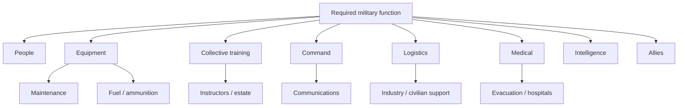
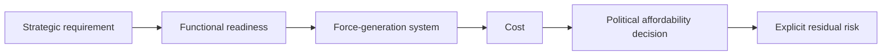

# 🔭 What Does Ready Actually Look Like?
**First created:** 2026-09-07 | **Last updated:** 2026-09-07  
*Define readiness by functional output before KPIs, platforms or spending — and make sure no single professional specialism gets to define the output alone.*

---

## 🔭 Orientation

Britain says it wants Armed Forces which are:

> **ready to deter, fight and win.**

Good.

Ready to do what?

At what scale?

At what notice?

For how long?

Against what level of resistance?

With which allies?

Using what logistics?

With what casualty system?

How quickly can the force recover afterwards?

And:

> **Who gets to decide what counts as ready?**

That final question matters more under the post-2025 Defence structure.

The Chief of the Defence Staff is now formally accountable for the readiness of the Armed Forces, commands the Service Chiefs, and leads the Military Strategic Headquarters responsible for force design and war planning across the integrated force.

That creates clearer accountability.

It also creates a potential concentration point.

Every senior military leader arrives with professional formation:

- service;
- branch;
- operational experience;
- technical expertise;
- command experience;
- capability experience;
- financial experience.

That expertise is necessary.

It also affects what is easiest to see.

So this node treats readiness as two related problems:

1. **What functional military output does Britain actually require?**
2. **Does the governance system combine enough different professional perspectives to recognise everything required to produce it?**

The answer cannot simply be:

> whatever we currently own.

Nor:

> whatever we currently measure.

Nor:

> whatever the most senior specialist naturally notices first.

---

# 🎯 1. Readiness is an output

A Defence budget is not readiness.

A platform is not readiness.

A soldier is not readiness.

An exercise is not readiness.

A stockpile is not readiness.

A software programme is not readiness.

All may contribute to readiness.

The useful definition is functional:

> **Can the force perform the required military task, under the expected conditions, at the required scale and notice, for the required duration, while absorbing plausible disruption?**

That is the output.

---

# 🧩 2. Readiness is a system property

At a deliberately simplified level:

```text
mission
+
people
+
equipment
+
training
+
command
+
communications
+
intelligence
+
logistics
+
medicine
+
estate
+
industry
+
allies
+
time
=
usable military capability
```

No individual component owns readiness.

Readiness emerges from the relationships between them.

Which means:

> **a system can possess excellent components and still fail as a system.**

---

# 🧠 3. Readiness therefore needs multiple professional lenses

An engineer may see:

- equipment availability;
- maintainability;
- technical integration;
- capability architecture.

An infantry officer may see:

- collective competence;
- tactical cohesion;
- physical endurance;
- command relationships.

A logistician may see:

- fuel;
- transport;
- stocks;
- throughput.

A medic may see:

- casualty assumptions;
- evacuation;
- treatment capacity;
- rehabilitation.

A Treasury official may see:

- affordability;
- opportunity cost;
- fiscal sustainability.

A minister may see:

- political commitments;
- alliances;
- public legitimacy;
- competing national priorities.

None is sufficient alone.

The readiness picture is produced by:

> **joining the views.**

---

# 🧭 4. Specialisation is necessary

The answer is not to create senior leaders with no specialism.

That would merely produce:

> people who know less about everything.

Deep expertise is valuable.

The current CDS, Air Chief Marshal Sir Richard Knighton, came through the Royal Air Force as an engineer and has extensive experience in acquisition, support, strategic planning and capability, including previous appointments as Deputy Chief of Defence Staff for Financial and Military Capability and Deputy Commander Capability and People.

That professional formation may be enormously useful for an Armed Forces attempting to integrate:

- sophisticated platforms;
- software;
- AI;
- autonomy;
- industrial capability;
- multi-domain systems.

The analytical question is not:

> **Is that background bad?**

It plainly is not.

The question is:

> **What does the governance architecture use to compensate for the things any particular professional background will naturally foreground less strongly?**

---

# ⚖️ 5. Counter-specialisation is governance

A useful rule:

> **Specialisation is necessary. Counter-specialisation is governance.**

Every CDS will have professional biases.

So will every:

- Service Chief;
- Permanent Secretary;
- minister;
- Chancellor;
- procurement leader.

The objective is not eliminating bias.

It is preventing one person's professional instinct from quietly becoming:

> **Defence's definition of what matters.**

---

# 🛩️ 6. The catalogue problem

Some capability is easy to see.

You can point at:

- aircraft;
- ships;
- vehicles;
- missiles;
- satellites;
- factories;
- digital systems.

They persist.

They have:

- programmes;
- contracts;
- milestones;
- acquisition costs.

Collective readiness behaves differently.

You cannot buy it once.

You manufacture it repeatedly through:

- people;
- equipment;
- instructors;
- exercises;
- logistics;
- command;
- rehearsal.

Then:

> **it decays.**

That makes readiness particularly vulnerable inside organisations whose strongest administrative machinery is built around durable assets and capital programmes.

---

# 🪖 7. Perishable capability still counts as capability

Suppose Britain buys:

> a sophisticated platform.

Its acquisition may create capability potential.

But usable military capability still requires:

```text
platform
+
trained operator
+
trained team
+
maintenance
+
communications
+
logistics
+
command
+
collective rehearsal
=
operational capability
```

The platform persists.

Several other terms decay.

That asymmetry matters.

---

# 🫙 8. You cannot put readiness on the shelf

A missile can remain in inventory.

A vehicle can remain in a depot.

Collective competence cannot simply be stored.

People:

- leave;
- change roles;
- forget;
- lose currency;
- join new teams.

Doctrine changes.

Threats change.

Equipment changes.

Therefore readiness requires:

> **maintenance expenditure.**

Not because the system failed.

Because readiness is perishable by design.

---

# 📉 9. Decay should be part of the readiness model

For each capability ask:

> **How quickly does competence degrade without rehearsal?**

Different skills will have different decay curves.

Some may remain robust for years.

Others may deteriorate quickly.

That means a cancelled exercise does not simply save:

> £X this year.

It may change:

> the future state of a perishable capability.

The relevant question becomes:

> **When does the loss become operationally meaningful?**

---

# 🎯 10. Start with the task

Before discussing force size, ask:

> **What does Britain expect its Armed Forces to do?**

Possible functions include:

- defend the United Kingdom;
- defend sovereign territories;
- contribute to NATO collective defence;
- maintain the nuclear deterrent;
- protect UK airspace;
- protect maritime approaches;
- secure critical infrastructure;
- provide intelligence and surveillance;
- provide expeditionary capability;
- support allies;
- sustain prolonged operations;
- respond to domestic emergencies;
- regenerate forces after losses.

Not all require the same force.

Not all can necessarily be performed simultaneously.

That is precisely why the list matters.

---

# 🗺️ 11. Strategy must become executable

A political commitment is not yet military capability.

Translate:

```text
political commitment
→ military task
→ required force
→ notice
→ movement
→ fighting capability
→ sustainment
→ reinforcement
→ recovery
```

Until that translation happens:

> **commitment**

and:

> **capability**

may exist comfortably in separate documents.

War will eventually introduce them.

It would be preferable if government did so first.

---

# 📐 12. Every readiness requirement needs dimensions

For each task specify:

### Function

What must happen?

### Scale

How much force?

### Notice

How quickly?

### Duration

How long?

### Conditions

Against what plausible disruption?

### Concurrency

What else must Britain do simultaneously?

### Recovery

How quickly must capability regenerate?

Without these dimensions:

> **ready**

remains too vague to govern.

---

# 🪜 13. Define the organisational level

Readiness can exist at several layers.

### Individual

Can the person perform their role?

### Crew / team

Can the small group operate together?

### Unit

Can the battalion, squadron, ship or equivalent perform its task?

### Formation

Can multiple units operate together?

### Joint force

Can land, air, maritime, cyber, space and supporting functions integrate?

### Allied force

Can Britain actually operate inside the intended coalition?

A system can be ready at one layer and unready at another.

---

# 🪖 14. Individual competence does not aggregate automatically

Suppose:

- soldiers are qualified;
- vehicles exist;
- radios function;
- ammunition exists.

That does not prove a formation can:

- manoeuvre;
- communicate;
- coordinate effects;
- sustain itself;
- evacuate casualties;
- adapt under pressure;
- fight alongside allies.

A unit is not merely:

> **a collection of individually trained people.**

It is:

> **a relationship between them.**

That relationship has to be practised.

---

# ⚓ 15. Platform ownership is not availability

The same principle applies at sea.

A ship can exist while being:

- in maintenance;
- short of crew;
- awaiting certification;
- undergoing repair.

So ask:

> **How many can perform the required function?**

Then:

> for how long?

Then:

> what replaces them?

The inventory is an input.

The output is:

> **usable maritime power over time.**

---

# ✈️ 16. Aircraft count is not usable air power

Likewise:

> 100 aircraft

does not tell us:

- serviceability;
- crew availability;
- sortie generation;
- weapon stocks;
- tanker support;
- maintenance;
- airfield resilience.

The functional question is:

> **What air effect can Britain sustainably generate?**

---

# 🔗 17. Build the dependency graph

For every major task:



Then ask:

> **Which dependency fails first?**

That question often tells us more than the headline force number.

---

# ⏱️ 18. Readiness contains time

A force deployable in:

> six months

is different from one deployable in:

> six days.

So readiness includes:

### Notice

How quickly must it act?

### Duration

How long must it operate?

### Recovery

How quickly can it return to readiness?

### Regeneration

How quickly can losses be replaced?

Time is capability.

---

# ⌛ 19. Available eventually is a different capability

Suppose Britain can generate a formation after:

> 180 days.

Useful.

But if the strategic requirement is:

> 30 days,

the capability does not satisfy that requirement.

This does not mean the formation is useless.

It means:

> **its readiness state does not match the task.**

---

# 📆 20. Attach a clock

A useful readiness framework might distinguish:

- immediate;
- high readiness;
- medium readiness;
- regenerating;
- reserve;
- mobilisation-dependent.

Exact thresholds may remain sensitive.

The conceptual distinction should not.

Otherwise:

> **ready**

can mean anything from:

> deploy tomorrow

to:

> we could probably reconstruct this given enough warning.

---

# ⌛ 21. Duration matters too

Another common mistake is asking whether the force can:

> arrive.

War cares whether it can:

> stay.

For each task ask:

> **How long can meaningful activity continue before a critical resource becomes limiting?**

Potential constraints include:

- ammunition;
- fuel;
- spare parts;
- personnel;
- maintenance;
- medical capacity;
- transport.

A force prepared for an excellent first week may still be poorly prepared for a long war.

---

# 🔁 22. The second force matters

If the first formation deploys:

- who replaces casualties?
- who rotates exhausted personnel?
- who repairs equipment?
- who replenishes ammunition?
- who trains replacements?

Readiness is not only:

> **first contact.**

It includes:

> **what Britain can still do afterwards.**

---

# 🧯 23. Regeneration is readiness

Therefore:

```text
initial force
+
sustainment
+
replacement
+
repair
+
retraining
=
persistent capability
```

Without regeneration:

readiness is consumable.

---

# 🧑‍🏫 24. Instructor capacity is readiness

If Britain needs to expand the force, the limiting variable may not be:

> willing recruits.

It may be:

> instructors.

Then instructor capacity is mobilisation capability.

Likewise:

- training areas;
- ranges;
- accommodation;
- equipment;
- administrative throughput.

A country cannot mobilise trained capability faster than its force-generation system can produce it.

---

# 🏚️ 25. Estate is readiness

A unit may exist.

Its equipment may exist.

But:

> where does it train?

Where does it mobilise?

Where is equipment repaired?

Where do people live?

Where does ammunition move?

Estate should therefore be assessed as:

> **usable operational infrastructure.**

Not:

> property on MOD's books.

---

# 🧰 26. Maintenance is readiness

Sophisticated equipment without maintenance depth is:

> **temporary capability.**

Assess:

- maintenance workforce;
- spare parts;
- repair time;
- depot capacity;
- technical support;
- supplier dependence.

The glamorous platform cannot escape the workshop.

---

# 📦 27. Stockpiles are readiness

Ask:

> **At plausible rates of use, how long do critical stocks last?**

Including:

- ammunition;
- missiles;
- fuel;
- medical supplies;
- spare parts.

Exact quantities may be sensitive.

But Defence itself must know whether:

> **planned operational duration and available stocks agree.**

---

# 🏭 28. Production is readiness too

Stockpiles answer:

> what do we possess?

Industry answers:

> **what can we replace?**

So material readiness includes:

```text
stored capacity
+
production capacity
+
repair capacity
```

A large stockpile without replenishment eventually becomes a countdown.

---

# 🩺 29. Medical readiness is operational readiness

A credible force requires:

- battlefield care;
- evacuation;
- surgery;
- rehabilitation;
- mental-health support;
- casualty replacement planning.

Medical constraints affect operational decisions.

Medicine is not:

> aftercare.

It is part of the fighting system.

---

# 🩸 30. Casualty assumptions belong in force planning

For every serious force plan:

> **What casualty burden are we planning to absorb?**

Then:

- can medical systems handle it?
- can personnel be replaced?
- can units remain coherent?
- can families be supported?

The exact number may remain protected.

The arithmetic cannot remain undone.

---

# 🧑‍🔧 31. Personnel establishment is not readiness

A headline establishment does not tell us:

- role fill;
- scarce skills;
- deployability;
- instructional burden;
- existing commitments;
- medical limitations.

A large organisation can be constrained by a small number of:

- engineers;
- pilots;
- maintainers;
- medics;
- linguists;
- cyber specialists;
- nuclear specialists.

Readiness therefore needs:

> **critical-skill mapping.**

---

# 🏠 32. Retention is readiness

If a specialist takes:

> years to train

and then leaves rapidly:

the force-generation system is unstable.

Retention problems may therefore become readiness problems long before the establishment number visibly collapses.

People policy is not separate from military capability.

---

# 🤝 33. Allied readiness is real readiness

Britain's strategy is deliberately alliance-heavy.

That makes sense.

But every dependency should specify:

> **What exactly is the ally expected to provide?**

Then:

- has it agreed?
- is it available on the same clock?
- could it be required elsewhere?
- have the forces practised together?

Alliance is not a magic multiplier.

It is an operational relationship.

---

# 🌐 34. NATO membership is not interoperability

Two NATO forces do not automatically have:

- compatible communications;
- aligned logistics;
- interoperable ammunition;
- rehearsed command relationships.

Those properties require:

> **practice.**

Interoperability is something forces do.

Not something treaties automatically produce.

---

# 🧩 35. Joint readiness matters

Britain increasingly describes an integrated force.

Then test the integration.

A future military effect may require:

```text
sensor
→ intelligence
→ command
→ aircraft
→ ship
→ land formation
→ cyber
→ logistics
```

If those relationships have not been exercised:

integration remains partly theoretical.

---

# 📡 36. Communications are readiness

A force which cannot communicate under:

- electronic attack;
- cyber disruption;
- infrastructure failure;

may retain weapons while losing coordination.

Test:

- alternative communications;
- degraded-mode procedures;
- redundancy;
- operator competence.

A network which works only in peacetime conditions is not sufficient evidence of wartime readiness.

---

# 🧠 37. Command itself must be ready

Headquarters need:

- trained staff;
- information;
- authority;
- communications;
- rehearsed decision processes.

So ask:

> **Can the command system make useful decisions at the required speed under degraded conditions?**

Not:

> does the headquarters exist?

---

# 🧪 38. Exercises should break things

A useful exercise may deliberately:

- remove communications;
- delay intelligence;
- destroy the preferred plan;
- create casualties;
- overload logistics;
- force command adaptation.

The purpose is not humiliation.

It is to discover whether:

> **the function survives contact with friction.**

---

# 🛡️ 39. Readiness includes degraded operation

Perfect conditions should not define the standard.

Ask:

> **What function remains when important components fail?**

For example:

- equipment loss;
- satellite disruption;
- delayed ally;
- fuel constraint;
- cyber attack.

A resilient force becomes:

> less capable.

It does not immediately become:

> incapable.

---

# 🪜 40. Use a functional readiness ladder

### Level 5 — resilient

Can perform the required task and absorb substantial disruption.

### Level 4 — ready

Can perform the task at required notice and duration.

### Level 3 — constrained

Can perform the task with material limitations.

### Level 2 — fragile

Can perform only under favourable assumptions.

### Level 1 — nominal

Capability exists principally on paper.

### Level 0 — absent

Function cannot currently be generated.

Exact assessments may remain classified.

The framework should not.

---

# 🎯 41. Objectives before indicators

Start with:

### Objective

> Generate the military function required by strategy.

Then define key results.

For example:

- formation achieves required collective competence;
- equipment availability supports task;
- logistics sustain required duration;
- command system validated;
- allied integration demonstrated;
- personnel fill supports deployment and recovery.

Then:

> **choose KPIs.**

Not before.

---

# 📊 42. KPIs are evidence, not capability

Useful indicators may include:

- equipment availability;
- trained personnel;
- exercise outcomes;
- sortie generation;
- repair times;
- stock depth;
- mobilisation speed;
- retention;
- allied certification.

But:

> **the dashboard is the instrument panel.**

It is not:

> **the engine.**

A green metric can coexist with a broken system if the wrong thing is being measured.

---

# 💷 43. Spending is an input

Likewise:

> £X billion spent

proves:

> £X billion was spent.

Every significant programme should connect:

```text
money
→ intervention
→ changed capability
→ readiness output
```

If the final arrow cannot be explained:

the investment case is incomplete.

---

# 🛒 44. Procurement needs operational endpoints

Instead of:

> 50 vehicles delivered,

ask:

> **What military function can now be generated that could not previously be generated?**

Instead of:

> contract awarded,

ask:

> **When does usable capability appear?**

Instead of:

> programme complete,

ask:

> **Did the operational problem improve?**

Procurement should not measure procurement.

---

# 🪖 45. Training needs operational endpoints too

Instead of:

> exercise completed,

ask:

> **What competence was demonstrated?**

Instead of:

> 5,000 personnel trained,

ask:

> **What can they now do?**

Instead of:

> synthetic training increased,

ask:

> **What validated competence resulted?**

Activity is not output.

---

# ⚖️ 46. This is where senior incentives matter

The post-2025 Defence architecture deliberately strengthens CDS authority.

The CDS is:

- professional head of the Armed Forces;
- Military Strategic Commander;
- in command of the Service Chiefs;
- head of the Military Strategic Headquarters;
- accountable for Armed Forces readiness.

That creates a much clearer place for responsibility to sit.

It also means:

> **the information reaching CDS must be unusually good.**

A strong centre is only as intelligent as the signals it receives.

---

# 🧭 47. The current CDS has three stated priorities

Sir Richard Knighton has publicly framed his priorities around:

> **readiness;**

> **people;**

> **transformation.**

Those priorities can reinforce one another.

Technology can:

- improve readiness;
- reduce burden;
- improve training;
- increase survivability.

People make transformation usable.

Readiness tells us whether either worked.

But they can also compete.

For example:

```text
investment in transformation
vs
near-term training

future capability
vs
current sustainment

capital asset
vs
perishable human competence
```

The governance system needs to make those tensions visible.

---

# 🪞 48. Do not infer preference from biography

Knighton's engineering, RAF and capability background does **not** establish that he undervalues:

- people;
- training;
- collective competence.

Indeed, he has publicly identified both readiness and people as central priorities.

The useful analytical proposition is broader:

> **Every professional background creates characteristic areas of unusually high visibility.**

Therefore:

> **every senior leader needs counterweights.**

This is an institutional-design question.

Not a personality diagnosis.

---

# 🪖 49. VCDS is an important counterweight

The current Vice Chief of the Defence Staff, General Dame Sharon Nesmith, is an Army officer.

Her formal responsibilities include:

- senior military judgement on future capability requirements;
- Defence Board leadership for military personnel and training;
- coordinating implementation and monitoring of top-level decisions;
- deputising for CDS.

That makes the CDS/VCDS relationship particularly relevant to this cluster.

If collective training becomes vulnerable:

> **the architecture already contains a senior military role specifically responsible for personnel and training.**

The public-record question is therefore not simply:

> Why did an RAF CDS allow Army training to be cut?

That framing would be crude.

The better question is:

> **How did the integrated senior military system assess, challenge, escalate and ultimately accept the capability consequence?**

---

# 🔀 50. Service Chiefs are sensors as well as commanders

The new structure puts Service Chiefs under CDS command.

That should improve integration.

But integration must not mean:

> **service-specific evidence gets compressed until everybody agrees.**

The Army needs to be able to say:

> this damages land-force generation.

The Navy:

> this creates maritime risk.

The RAF:

> this affects air-power generation.

Then MSHQ integrates those signals.

Integration should produce:

> **joint judgement.**

Not:

> **premature consensus.**

---

# 🧠 51. Disagreement is readiness information

If CDS, VCDS and a Service Chief disagree about readiness:

that disagreement may itself be important evidence.

Record:

- the competing assessment;
- assumptions;
- evidence;
- final decision;
- risk owner.

Senior disagreement does not necessarily mean governance failed.

A system in which senior professionals:

> **cannot disagree safely**

is much more worrying.

---

# 🛡️ 52. Somebody needs permission to confiscate the catalogue

Every senior specialist should have people around them authorised to say:

> **Sir, the programme is impressive.**

> **The equipment is excellent.**

> **The transformation case is strong.**

> **But this boring recurring activity is what turns those assets into a fighting force.**

That is not obstruction.

That is governance.

Like shiny things all you want.

> **Just make sure somebody senior is authorised to confiscate the catalogue occasionally.**

🛩️✨

---

# 🧠 53. Austerity can survive inside people's heads

There is another readiness problem.

After prolonged periods of financial constraint, senior officials and military leaders become skilled at:

- prioritising;
- compromising;
- deferring;
- absorbing;
- making do.

Those are valuable executive skills.

But they can create a behavioural legacy.

People may stop asking for:

> what they actually believe is required,

because they already know:

> **the answer will be no.**

The requirement is then compressed before ministers ever see it.

---

# 🧾 54. Do not pre-austerise professional advice

A genuine Defence reset therefore requires permission from civilian leadership:

> **Tell us the professional requirement first.**

Not:

> Tell us the version you think Treasury will tolerate.

Government may still refuse.

Treasury may still challenge.

Priorities still exist.

But the original requirement must survive long enough for the political system to see:

> **what it is choosing not to buy.**

That is one purpose of:

`🧾_the_blank_cheque_exercise.md`

---

# 🤝 55. Permission requires backing

This cannot be rhetorical.

If government tells senior military leaders:

> be candid about what you need,

and then punishes the first person who publicly or internally identifies a serious shortfall:

the organisation learns immediately.

The lesson becomes:

> **manage expectations before they reach ministers.**

A genuine reset therefore needs reasonable political backing for professional candour.

Not:

> every request granted.

But:

> **honest requirements will be heard without automatic reputational penalty.**

---

# 🧠 56. Readiness needs a protected negative channel

Senior governance should preserve a route for saying:

> **No. This is below minimum credible readiness.**

That message should reach:

- CDS;
- ministers;

without being progressively translated into:

> pressure;

then:

> challenge;

then:

> manageable constraint;

then:

> broadly on track.

This is where:

`⚙️_the_feedback_machine.md`

becomes part of readiness architecture.

---

# 📐 57. Define the minimum credible state

For each major function distinguish:

### Ideal

The level professionals would prefer with substantial resilience.

### Minimum credible

The lowest level at which the task can still be performed with tolerable risk.

### Failure threshold

Below this, stop describing the function as reliably available.

This is more useful than asking:

> **How much Defence would you like?**

It identifies:

> **where strategy stops working.**

---

# 🧮 58. Then show the political choice

A mature submission should say:

> Function X requires Level 4 readiness.

> Current force generates Level 3.

> Reaching Level 4 requires interventions A, B and C.

> Government has chosen not to fund all of them.

> Residual risks are X and Y.

That is:

> **civilian control.**

The political system has made a choice with the military consequence visible.

---

# 🧪 59. Readiness must be demonstrated

A force should periodically prove major functions through:

- realistic exercises;
- mobilisation tests;
- logistics rehearsals;
- degraded communications;
- allied exercises;
- medical exercises.

A spreadsheet saying:

> **should work**

is not validation.

The closer the test resembles the required function:

the stronger the evidence.

---

# 🪖 60. Collective training is both production and measurement

A large exercise does two things.

It:

### produces readiness

through rehearsal.

And:

### measures readiness

through performance.

That means reducing collective training can affect both:

> **the capability**

and:

> **the sensor used to determine whether the capability exists.**

That is why training should not be treated simply as discretionary activity.

---

# 🩻 61. Near misses are evidence

Suppose an exercise succeeds only because:

- one experienced person improvises;
- spare equipment happens to exist;
- weather remains favourable;
- a supplier accelerates delivery.

Record it.

The event succeeded.

The system may still be fragile.

Readiness evidence should include:

> **how close success came to failure.**

---

# 🧯 62. Workarounds are readiness debt

If personnel repeatedly compensate for:

- missing staff;
- broken equipment;
- poor software;
- housing problems;
- logistics delays;

the output may remain green while the system deteriorates underneath.

Ask:

> **What invisible human effort is keeping this capability working?**

The better people become at coping with a broken system:

the longer the broken system can look functional.

---

# 🧠 63. Ask the people doing the job

Central data is not enough.

Ask:

- operators;
- crews;
- instructors;
- engineers;
- logisticians;
- medics;
- junior personnel.

Not:

> Do you feel ready?

Ask:

> **What stops you doing the task?**

> **What takes too long?**

> **What repeatedly fails?**

> **What are you compensating for manually?**

Those are readiness questions.

---

# 📐 64. Combine quantitative and qualitative evidence

Quantitative evidence can tell us:

> how often something fails.

Professional testimony may tell us:

> **why.**

A strong assessment combines:

- metrics;
- technical evidence;
- exercise performance;
- professional judgement;
- after-action reporting.

Neither:

> dashboard

nor:

> anecdote

should govern alone.

---

# 🔬 65. Evidence hierarchy

### Strong evidence

- realistic exercise performance;
- validated operational performance;
- demonstrated mobilisation;
- demonstrated sustainment.

### Moderate evidence

- partial exercise;
- technical testing;
- recent comparable performance.

### Weaker evidence

- administrative readiness;
- declared availability;
- modelling.

### Insufficient alone

- spending increased;
- platform purchased;
- programme announced;
- strategy published.

The question is always:

> **What proves the function exists?**

---

# ⏳ 66. Evidence decays too

A capability demonstrated:

> five years ago

may no longer exist unchanged.

Because:

- personnel changed;
- equipment changed;
- doctrine changed;
- allies changed;
- threats changed.

Every readiness claim should therefore know:

> **When was this last validated?**

Evidence itself has a shelf life.

---

# 🧪 67. “Untested” is a legitimate status

One useful readiness label is:

> **untested at required scale.**

That does not mean:

> incapable.

It means:

> **we do not currently possess direct validation.**

Preserve that uncertainty.

Do not manufacture confidence because the dashboard requires a colour.

---

# 🔁 68. Retest after major change

Retest when:

- force structure changes;
- equipment changes;
- doctrine changes;
- training changes;
- alliance assumptions change;
- synthetic systems replace live activity.

Do not assume old evidence automatically validates the new system.

---

# 🔀 69. Define concurrency

Can Britain do:

> Mission A

and:

> Mission B

at the same time?

A force may use the same:

- aircraft;
- ships;
- specialists;
- headquarters;
- logistics;

for several commitments.

Policy documents can make commitments look independent.

Reality may reveal:

> **they share the same Tuesday roster.**

---

# 🌧️ 70. The Tuesday roster test

Every readiness claim eventually faces:

> **Who is doing this on Tuesday?**

Actually.

If the answer requires:

- everyone present;
- nothing broken;
- no sickness;
- no leave;
- no simultaneous task;

the readiness claim is fragile.

Then make Tuesday worse:

- bad weather;
- equipment failure;
- missing specialist;
- delayed ally;
- another emergency.

Does the function survive?

That is resilience.

---

# 📉 71. Readiness debt

Operational commitments can consume:

- training time;
- personnel;
- maintenance;
- equipment life;
- family stability.

If recovery does not follow:

the force accumulates readiness debt.

Possible signs include:

- deferred maintenance;
- cancelled training;
- repeated deployment;
- disrupted leave;
- depleted instructor cadres.

Readiness therefore needs a balance sheet as well as a snapshot.

---

# 🔁 72. Recovery time should be measured

After deployment or major exercise:

> **How long until the force is genuinely ready again?**

Include:

- personnel recovery;
- maintenance;
- restocking;
- leave;
- retraining.

A force kept permanently at nominal high readiness without recovery can eventually become:

> **permanently tired instead.**

---

# 🚚 73. Movement is capability

Being ready in barracks is insufficient if the force cannot reach the task.

Assess:

- sealift;
- airlift;
- rail;
- roads;
- ports;
- customs;
- host-nation support.

One of Defence's least glamorous questions is:

> **How does it actually get there?**

That is why it is useful.

---

# 🏠 74. Domestic commitments consume real capacity

Military support to domestic emergencies may be valuable.

But personnel used domestically are:

> **not additional people.**

For each civil-contingency assumption ask:

> Which military capability supplies them?

And:

> What if an overseas crisis happens simultaneously?

Supporting government requires opportunity-cost visibility.

---

# 🎯 75. Readiness must match ambition

The governing equation is:

```text
political commitments
≈
military tasks
≈
available force
≈
force-generation capacity
≈
resources
```

If one side moves:

something else must move.

Possible responses include:

- more resources;
- fewer commitments;
- greater allied dependence;
- longer notice;
- lower scale;
- accepted risk.

What should not happen is:

> **retain every commitment and redefine readiness until the spreadsheet turns green.**

---

# 💷 76. Only now should money enter

Once Britain has defined:

- function;
- scale;
- notice;
- duration;
- resilience;
- regeneration;

cost it.

The sequence should be:



Not:

```text
budget
→ force
→ whatever that force can currently do
→ redefine that as the requirement
```

That is budgeting.

It is not strategy.

---

# 📊 77. A readiness dashboard

For each major function:

### Mission
What task?

### Scale
How much force?

### Notice
How quickly?

### Duration
How long?

### Personnel
Enough people and critical skills?

### Equipment
Available and serviceable?

### Collective training
Practised at required scale?

### Command
Validated?

### Logistics
Sustainable?

### Medical
Casualty system viable?

### Allies
Dependencies agreed and exercised?

### Industry
Repair and replenishment possible?

### Regeneration
What produces the second force?

### Evidence
When was it last tested?

### Confidence
How certain are we?

### Residual risk
What remains fragile?

### Owner
Who has authority to fix it?

That is much closer to a readiness dashboard.

---

# 🚦 78. Give colours actual meanings

If Defence wants red, amber and green:

fine.

Define them.

### Green

Required function can be performed at required notice and duration with planned resilience.

### Amber

Function remains available but with meaningful constraint or reduced margin.

### Red

Stated requirement cannot currently be met.

Then:

> **green means something.**

---

# 🧠 79. Show confidence separately

Do not turn uncertain evidence into fake precision.

Use:

- high confidence;
- moderate confidence;
- low confidence;
- untested.

For example:

> **Sustainment: Amber / Moderate confidence — last large-scale validation eighteen months ago.**

Now the reader knows:

- the assessed state;
- how much confidence to place in it.

---

# 🪟 80. Some readiness evidence can be public

Specific formation readiness may legitimately remain classified.

But public reporting can still provide:

- aggregate trends;
- whether planned exercises occurred;
- recruitment and retention;
- estate condition;
- broad availability trends;
- major recovery programmes;
- significant known bottlenecks.

The public needs:

> **the strategic map.**

Not:

> exploitable variables.

That is bounded transparency.

---

# 🧿 81. Public claims need receipts

If government says:

> **readiness has improved,**

ask:

> **What category of evidence shows that?**

Possible answers:

- better exercise performance;
- improved equipment availability;
- greater stock depth;
- faster mobilisation;
- stronger personnel fill;
- validated interoperability.

No sensitive number necessarily needs publication.

But:

> **readiness improved because government says readiness improved**

is circular.

---

# 🧾 82. A readiness statement template

For each major function:

```text
Function:
Strategic purpose:
Scale:
Notice:
Duration:
Concurrency requirement:
Required people:
Required equipment:
Required collective training:
Required command:
Required logistics:
Required medical support:
Required allied support:
Critical dependencies:
Regeneration requirement:
Evidence of capability:
Date last validated:
Confidence:
Known constraint:
Residual risk:
Risk owner:
Decision required:
```

Now:

> **ready**

has an operational meaning.

---

# 💷 83. Apply this to the £30 million case

The current Army training dispute should therefore not be framed only as:

> **Did £30 million disappear?**

Ask:

> **Which readiness outputs depended upon the affected activity?**

Then:

- when were they last validated?
- what replaces the activity?
- how quickly does the competence decay?
- when is it next exercised?
- who assessed the resulting risk?
- did VCDS/personnel-and-training governance challenge it?
- what did the Army advise?
- what did MSHQ conclude?
- who ultimately accepted the residual risk?

That converts:

> financial saving

into:

> **military consequence.**

---

# ⚙️ 84. The feedback machine needs the output definition

`⚙️_the_feedback_machine.md`

asks whether evidence changes behaviour.

To know whether the intervention worked:

we need a defined outcome.

```text
problem
→ lesson
→ change
→ retest
→ readiness improved?
```

Without the final question:

the feedback loop remains open.

---

# 🧾 85. The blank cheque needs it too

`🧾_the_blank_cheque_exercise.md`

asks professionals what they would build if affordability temporarily disappeared.

This node tells them:

> **what they must describe.**

Not:

> platforms wanted.

But:

> functions required.

The blank-cheque submission should therefore be expressed in readiness outputs first.

Only then:

> shopping list.

---

# 🧠 86. The reset is partly psychological

Britain can increase Defence spending and still fail to reset Defence if the people inside it continue behaving as though:

> **every requirement must first be made politically inexpensive.**

A genuine reset requires senior leadership to have room to say:

> This is what the function requires.

> This is the minimum credible version.

> This is where we are below it.

> This is what I recommend.

Government may still say no.

But it must receive the uncompressed signal first.

---

# 🤝 87. That responsibility runs both ways

Military leadership owes ministers:

- candour;
- prioritisation;
- realistic costing;
- willingness to stop doing things;
- acknowledgement of uncertainty.

Civilian leadership owes military professionals:

- permission to give unwelcome advice;
- serious consideration;
- clear decisions;
- ownership of political trade-offs;
- reasonable protection from punishment merely for identifying a real requirement.

Neither side gets a blank cheque.

Both sides owe the system:

> **an honest signal.**

---

# 🧭 88. The governance test

For every readiness shortfall ask:

1. Who first knew?
2. Which professional lens identified it?
3. Who disagreed?
4. Did the Service Chief see it?
5. Did VCDS see it?
6. Did CDS see it?
7. Did the capability consequence survive translation?
8. Did ministers understand it?
9. Was Treasury involved where relevant?
10. Who possessed the lever?
11. What decision was made?
12. Who owns the residual risk?

This makes accountability structural rather than theatrical.

---

# 🛡️ Working principles

1. **Readiness is a functional output, not an input.**
2. **Define the mission before defining the metric.**
3. **State scale, notice, duration, concurrency and recovery.**
4. **Individual readiness does not prove collective readiness.**
5. **Platform ownership does not prove usable capability.**
6. **Perishable capability requires repeated investment.**
7. **Training both produces readiness and tests it.**
8. **Logistics, medicine, estate, maintenance and industry are readiness.**
9. **Allied dependence must be explicit and exercised.**
10. **Regeneration matters after the first force is committed.**
11. **KPIs are evidence, not the objective.**
12. **Spending is an input, not proof.**
13. **Evidence has a shelf life.**
14. **Untested capability should be labelled untested.**
15. **Professional specialisation requires institutional counterweights.**
16. **Integration must preserve useful disagreement.**
17. **Professional advice should not be pre-austerised before ministers receive it.**
18. **Residual risk needs an owner.**
19. **Political ambition and funded military capability must eventually agree.**
20. **Readiness must be demonstrated, not merely declared.**

---

# 🔭 The core test

For every major military commitment Britain should be able to answer:

> **What must we actually be able to do?**

> **At what scale?**

> **At what notice?**

> **For how long?**

> **While doing what else?**

> **With which people?**

> **With what equipment?**

> **With what collective training?**

> **With what logistics?**

> **With what medical support?**

> **With which allies?**

> **How do we replace losses?**

> **When did we last prove we can do it?**

> **Who disagrees with the assessment?**

> **How confident are we?**

> **Who owns the risk if we cannot?**

If those questions cannot be answered:

the problem is not merely that readiness may be low.

It is that:

> **readiness has not been adequately defined.**

---

# 🧈 Working Rule

Start with:

> **What must Britain be able to do?**

Then:

> **What system produces that ability?**

Then:

> **What evidence proves the system works?**

Then:

> **Which professional perspective might we be missing?**

Then:

> **What does it cost?**

Then:

> **What can Britain afford?**

And only then:

> **Which indicators should ministers watch?**

The function comes first.

The evidence comes next.

The money comes after the requirement is visible.

The KPI comes last.

---

## 📚 Initial sources

- [GOV.UK: “Strategic Defence Review 2025 – Making Britain Safer: secure at home, strong abroad”](https://www.gov.uk/government/publications/the-strategic-defence-review-2025-making-britain-safer-secure-at-home-strong-abroad)
- [GOV.UK: “Air Chief Marshal Sir Richard Knighton KCB ADC FREng”](https://www.gov.uk/government/people/richard-knighton)
- [GOV.UK: “Air Chief Marshal Sir Richard Knighton takes over as Chief of Defence Staff”](https://www.gov.uk/government/news/air-chief-marshal-sir-richard-knighton-takes-over-as-chief-of-defence-staff)
- [GOV.UK: “Chief of the Defence Staff speech — 15 December 2025”](https://www.gov.uk/government/speeches/chief-of-the-defence-staff-speech-15-december-2025)
- [GOV.UK: “General Dame Sharon Nesmith DCB ADC”](https://www.gov.uk/government/people/sharon-nesmith)
- [RUSI: “Mobilisation and Training for War: Preparing to Break Glass”](https://www.rusi.org/explore-our-research/publications/occasional-papers/mobilisation-and-training-war-preparing-break-glass)
- [RUSI: “The Long War: Fighting Beyond the First Battle”](https://www.rusi.org/explore-our-research/publications/commentary/long-war-fighting-beyond-first-battle)
- [National Audit Office: “Investigation into military support for Ukraine”](https://www.nao.org.uk/reports/investigation-into-military-support-for-ukraine/)
- [National Audit Office: “Delivering the defence estate”](https://www.nao.org.uk/reports/delivering-the-defence-estate/)

See also:

- `data/source_bank.md`
- `data/strategic_reviews.md`
- `data/current_reporting.md`
- `data/parliamentary_questions.md`
- `data/open_questions.md`

---

## 📡 Cross-links

- [`🧾_the_blank_cheque_exercise.md`](./🧾_the_blank_cheque_exercise.md) — *recovering the professional requirement before affordability compresses it*
- [`🪖_what_training_is_for.md`](./🪖_what_training_is_for.md) — *collective competence as both readiness generation and evidence*
- [`⚙️_the_feedback_machine.md`](./⚙️_the_feedback_machine.md) — *whether negative readiness signals reach people with authority intact*
- [`💷_thirty_million_pounds.md`](./💷_thirty_million_pounds.md) — *the live test of translating financial savings into readiness consequences*
- [`🪟_transparency_and_earned_loyalty.md`](./🪟_transparency_and_earned_loyalty.md) — *what aggregate readiness information can safely become public*
- [`💊_long_term_management.md`](./💊_long_term_management.md) — *building the force-generation system over decades*
- [`🛡️_prevention_and_resilience.md`](./🛡️_prevention_and_resilience.md) — *graceful degradation, redundancy and regeneration*
- [`🧠_assessment_and_differential.md`](./🧠_assessment_and_differential.md) — *distinguishing affordability, architecture, professional skew and other possible causes*
- [`🔬_tests_and_investigations.md`](./🔬_tests_and_investigations.md) — *what evidence is required before diagnosing the current problem*
- [`data/strategic_reviews.md`](./data/strategic_reviews.md) — *how successive reviews define tasks and readiness*
- [`data/current_reporting.md`](./data/current_reporting.md) — *contemporary readiness claims and evidence*
- [`data/open_questions.md`](./data/open_questions.md) — *unresolved readiness variables*

### 🧭 Breadcrumbs

`🌊_Playing_Defence`  
→ `🪖_Training_Debrief`  
→ `🔭_what_does_ready_actually_look_like.md`

---

## 🌌 Constellations

🔭 🪖 ⚙️ 🧠 📦 🩺 🤝 🏭 — readiness; functional outputs; CDS; VCDS; professional specialisation; counter-specialisation; force generation; collective training; sustainment; regeneration; evidence.


## ✨ Stardust

British military readiness, UK defence readiness, Chief of Defence Staff, Richard Knighton, Sharon Nesmith, Vice Chief of Defence Staff, Military Strategic Headquarters, Defence Reform, professional military judgement, functional readiness, force generation, collective training, NATO readiness, logistics, sustainment, mobilisation, regeneration, equipment availability, military medicine, defence industry, readiness metrics, OKRs, KPIs, institutional incentives, austerity, capability planning

---

## 🏮 Footer

*Training Debrief* is a living analytical cluster of the **Polaris Protocol**.

This node treats readiness as a system property.

A budget cannot be ready.

A tank cannot be ready in isolation.

An AI programme cannot be ready in isolation.

A recruitment figure cannot be ready.

And no single professional specialism — however valuable — can define readiness alone.

The force is ready when people, equipment, collective competence, command, logistics, medicine, allies, industry and regeneration can produce the required military function on the required clock.

A genuine Defence reset therefore needs more than money.

It needs senior professionals to have permission to tell government what the function actually requires before they begin negotiating against the answer they expect to receive.

> **Define the job.  
> Preserve the signal.  
> Test the function.  
> Then make the trade-off.**

*Survivor authorship is sovereign. Containment is never neutral.*

*Last updated: 2026-09-07*
