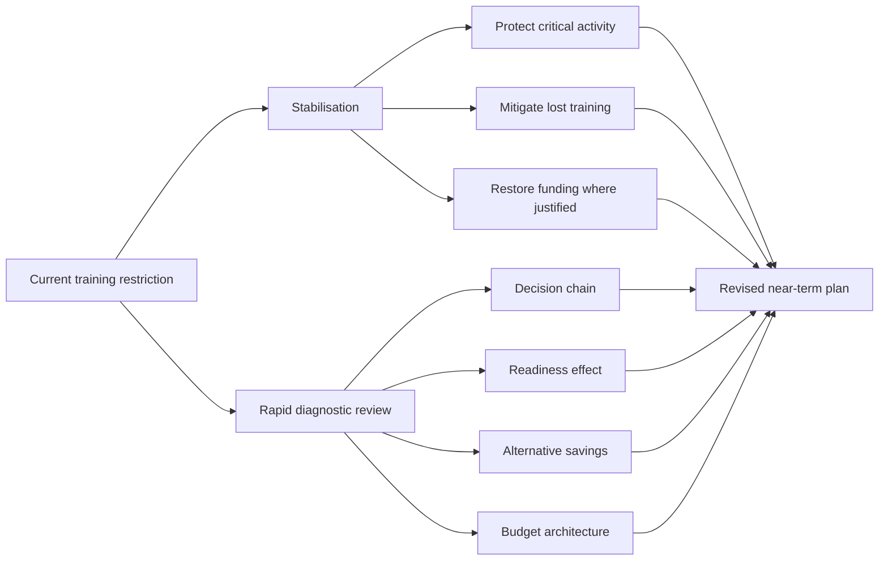
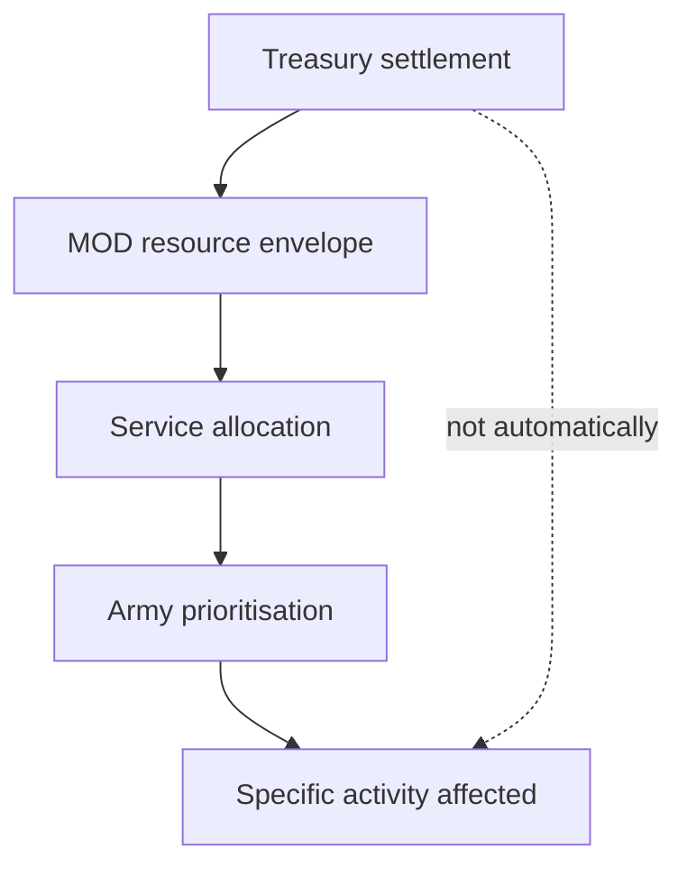
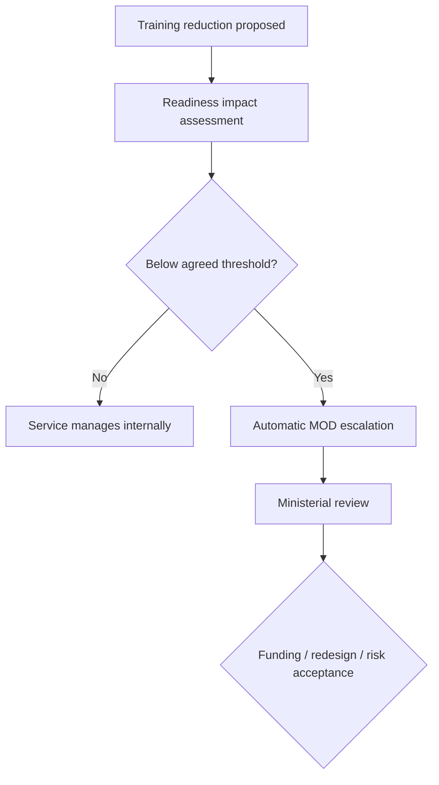

# 🚑 Immediate Management
**First created:** 2026-09-07 | **Last updated:** 2026-09-07  
*What government, Defence and Army leadership can do now about the reported collective-training reduction without waiting for another strategic review.*

---

## 🚑 Orientation

The long-term diagnosis is not complete.

That does not mean nothing can be done.

The immediate presenting problem is sufficiently specific:

> **The British Army has reportedly reduced or suspended significant collective-training activity while seeking approximately £30 million of savings.**

The current public record does not yet establish:

- exactly where the financial pressure originated;
- which alternatives were considered;
- how much capability is affected;
- what mitigation already exists;
- who formally accepted the readiness risk.

Those questions matter.

But they need not all be answered before sensible immediate management begins.

Medicine does not generally require:

> complete understanding of the patient's entire life history

before somebody treats the thing presently causing harm.

The immediate objective should therefore be:

> **prevent avoidable degradation of collective readiness while establishing exactly what has been cut, why, what can be restored, and what must change if restoration is impossible.**

---

## 🩸 First principle: stabilise before redesigning the whole patient

Do not respond to a £30 million training dispute by commissioning a five-year philosophical review while the exercises disappear from the calendar.

Equally:

do not throw £30 million at the headline and declare the underlying problem cured.

Immediate management needs two tracks running together.



One stream keeps the force functioning.

The other establishes why the problem occurred.

---

## ⏱️ 1. Put a short clock on the review

This does not need another grand Defence review.

The Strategic Defence Review already exists.

The Defence Investment Plan already exists.

The immediate question is narrower:

> **Does the current reduction in collective training materially undermine the readiness model government has already adopted?**

Streeting should require a rapid joint assessment from:

* Chief of the Defence Staff;
* Chief of the General Staff;
* Army Command;
* MOD finance;
* relevant training leadership;
* Defence readiness staff.

It should answer, in aggregate and without publishing sensitive operational information:

1. What activity has been cancelled?
2. What has merely been postponed?
3. What capability was each affected activity intended to generate?
4. Which formations are affected?
5. Can the competence be generated another way?
6. Can the training be recovered later?
7. What is the financial cost of restoration?
8. What other savings options exist?
9. What readiness risk remains if the restriction continues?
10. Who is accepting that risk?

That is enough for immediate ministerial decision-making.

---

## 🪖 2. Triage the training, rather than treating it as one category

Not all exercises have equal value.

Not all cancellations have equal consequences.

The Army should rapidly sort affected activity into something like:

| Category                                 | Immediate approach          |
| ---------------------------------------- | --------------------------- |
| Required for deployment / quick reaction | Protect                     |
| Required for formal readiness validation | Presumptively protect       |
| Required for NATO commitment             | Protect or replace credibly |
| High-value collective competence         | Restore where possible      |
| Useful but recoverable later             | Reschedule                  |
| Duplicative / low marginal value         | Consider cancelling         |
| Better delivered synthetically           | Redesign where validated    |
| Obsolete because doctrine changed        | Stop                        |

This is not special pleading for every exercise.

It is basic clinical triage.

> **Save the function, not necessarily the appointment.**

If an exercise genuinely no longer represents how Britain expects to fight:

good.

Change it.

If it is required to produce competence government still says it needs:

do not call it non-essential merely because the invoice is movable.

---

## 🧠 3. Streeting: establish the clinical picture

As Defence Secretary, Wes Streeting now owns the departmental response.

That does not mean he personally created the underlying problem.

He inherited:

* the current force;
* the current financial position;
* the SDR;
* the Defence Investment Plan;
* the existing training calendar;
* existing contracts;
* whatever decisions were already moving through MOD.

His immediate job is not to defend every inherited decision.

It is to establish whether the decision still makes sense.

---

## Streeting should ask five brutally simple questions

### 1. What exactly am I losing?

Not:

> £30 million.

Capability.

What military capability disappears, degrades or moves later?

---

### 2. When do I get it back?

If training is postponed:

when is the replacement activity?

Who has booked:

* the estate;
* the personnel;
* the equipment;
* the instructors;
* the ammunition;
* the allied participation?

A promise to:

> catch up later

is not a recovery plan until something is on the calendar.

---

### 3. What happens if I restore it?

Where does the financial pressure move?

If the answer is:

> something worse,

Streeting needs to know what.

---

### 4. Who disagrees?

He should specifically ask for dissenting professional views.

Not because the dissenters must be correct.

Because a rapid ministerial review in a hierarchical institution needs protection against accidental consensus manufacture.

Ask:

> **Who thinks this is a bad idea, and why?**

Put them in the room.

---

### 5. What decision would you make if the £30 million problem disappeared?

This separates:

> **training transformation**

from:

> **financial retrenchment.**

If Army leadership would still cancel the same exercises with unlimited funding because the activity is obsolete:

excellent.

That is modernisation.

If the exercises would immediately return:

then this is primarily a financial decision.

Call it one.

---

## 💷 4. Healey: perform the Treasury counterfactual

John Healey now occupies a particularly useful position.

He previously led Defence.

He is now Chancellor.

That gives him an unusually direct institutional vantage point from which to ask:

> **Is this genuinely the least harmful place to find £30 million?**

The answer may still be yes.

But Treasury should test it.

---

## The immediate Treasury exercise

Ask MOD for:

### Option A — current plan

Continue the training reduction.

State:

* cash saving;
* readiness consequence;
* mitigation;
* recovery cost.

### Option B — restore £30 million

Identify the exact Treasury mechanism required.

### Option C — partial restoration

Protect the highest-value collective activity and retain some savings elsewhere.

### Option D — internal MOD reallocation

Identify alternative expenditure and its consequences.

### Option E — supplier / contractual adjustment

Identify whether any near-term commercial flexibility can reasonably be negotiated.

The objective is not:

> Treasury finds free money.

There is no magical £30 million tree behind Horse Guards.

The objective is:

> **make the trade-off explicit enough that ministers know which risk they are purchasing.**

---

## 🧾 5. Do not confuse Treasury control with Treasury micro-management

This distinction needs to remain clean.

Treasury may control the settlement.

MOD controls many choices within that settlement.

Army Command controls some choices within MOD's allocation.

Therefore the review should establish:



The public accountability question is:

> **At which arrow did collective training become the selected saving?**

That determines the appropriate intervention.

---

## 🌹 6. Burnham: force the strategic reconciliation

The Prime Minister does not need to decide which battalion trains on which range.

He does need to decide whether the government's strategic promises remain internally coherent.

Burnham's question should be:

> **Can I simultaneously maintain the government's stated Defence commitments, current force structure, current spending path and current readiness expectations?**

If yes:

show the working.

If no:

one of those variables has to move.

---

## The No. 10 intervention should therefore be narrow

Require Defence and Treasury jointly to state:

* what current strategy requires;
* what the current settlement funds;
* where the material gaps are;
* which are temporary;
* which are structural;
* what risk government is accepting.

The purpose is not a new SDR.

It is implementation control.

The strategic review should not exist in one room while the financial consequences exist in another.

---

## 🪖 7. Army leadership: make the operational consequence legible

Army leadership has a different job.

It should not simply say:

> **we need more money.**

That is too easy to dismiss.

Nor should it describe every lost activity as catastrophic.

That destroys calibration.

The useful military answer is:

> **If you remove X, this is the function we lose; this is when degradation becomes meaningful; this is what can replace it; this is what cannot.**

For each affected activity:

```text
Training activity
↓
Military function produced
↓
Skill-decay / readiness consequence
↓
Substitute available?
↓
Recovery time
↓
Operational risk
```

That translation layer is crucial.

Civilian ministers should not have to become brigadiers to understand the decision.

Military professionals should not have to become Treasury economists to explain why preparation matters.

Someone has to translate.

---

## 🧮 8. Restore selectively before restoring blindly

If additional money can be made available quickly, do not simply recreate the original calendar without review.

Use the interruption.

Ask:

> **Which exercises would we deliberately buy again today?**

That produces three useful buckets.

### Restore

Activity still clearly required.

### Redesign

Objective remains necessary but exercise format can improve.

### Retire

Activity no longer generates sufficient value.

This turns a bad financial shock into a potentially useful clinical review.

Do not waste the opportunity.

---

## 💉 9. Protect the highest-risk omissions first

If full restoration is impossible, prioritise activity where cancellation produces the greatest risk.

Possible criteria include:

* operational imminence;
* readiness certification;
* NATO requirement;
* collective scale difficult to recreate;
* scarce equipment integration;
* command integration;
* live-fire requirement;
* logistics rehearsal;
* allied participation;
* long lead times;
* skills vulnerable to decay.

This should be professionally determined.

Not:

> biggest exercise first.

Not:

> most photogenic tanks first.

Not:

> whatever generates the worst newspaper headline.

---

## 📅 10. Put recovery training on the calendar now

Postponement creates hidden debt.

If an exercise is moved from:

> September

to:

> later,

the future calendar becomes more crowded.

That can create:

* estate clashes;
* personnel clashes;
* equipment clashes;
* instructor shortages;
* deployment conflicts.

So every postponed activity should receive one of three statuses:

```text
RESCHEDULED — new date and resources identified

REPLACED — alternative method and validation identified

CANCELLED — capability consequence explicitly accepted
```

There should not be a fourth category:

> **somehow later.**

---

## 🏚️ 11. Reserve estate capacity for recovery

Money alone cannot restore training if the training estate is full.

Operation Interflex already demonstrates that strategically valuable commitments can compete for finite training infrastructure.

Therefore MOD should simultaneously review:

* range availability;
* training-area availability;
* instructor availability;
* equipment windows;
* allied exercise opportunities.

If restoration funding arrives after the usable estate window has gone:

the money has arrived too late.

---

## 🤝 12. Ask allies what can be shared

Britain does not train in strategic isolation.

If domestic capacity is constrained, Defence can investigate whether some activity can be recovered through:

* NATO exercises;
* allied training areas;
* multinational exercises;
* reciprocal arrangements;
* existing overseas activity.

This should not become:

> Britain cannot train its own Army, please lend us a field.

It is ordinary alliance optimisation.

If an exercise Britain already intended to conduct can be integrated efficiently into allied activity:

good.

Use the alliance.

---

## 🤖 13. Use synthetic training where it actually works

This is an obvious mitigation option.

Use:

* simulation;
* VR;
* synthetic environments;
* distributed command exercises;
* digital rehearsal;

where the learning objective can genuinely be achieved that way.

That may preserve:

* decision-making;
* command practice;
* scenario exposure;
* procedural knowledge;
* repetition.

But do not claim synthetic training has replaced:

* physical logistics;
* terrain;
* fatigue;
* equipment failure;
* real vehicle integration;
* live-fire competence;
* actual human friction;

unless evidence demonstrates that the relevant objective does not require them.

The rule is:

> **substitute the method, not the outcome.**

---

## 📦 14. Review commercially movable expenditure too

Before assuming all existing contracts are immovable:

ask.

Large procurement programmes have:

* suppliers;
* schedules;
* milestones;
* payment profiles;
* commercial relationships.

Not every payment can move.

Moving some may cost more than it saves.

Some programmes are strategically far more important than the training being protected.

Fine.

But government should know whether serious commercial negotiation has occurred.

The question is not:

> **Why don't we cancel a submarine to pay for an exercise?**

Obviously not.

The question is:

> **Was every apparently rigid pound actually tested for flexibility before human preparation became the flexible line?**

That is a fair procurement-governance question.

---

## 🧱 15. Do not raid maintenance to save training

Immediate fixes can create worse pathology.

Restoring exercises by stripping:

* maintenance;
* spares;
* estate repair;
* accommodation;
* medical support;

may simply move the damage one step sideways.

The objective is not:

> training line restored.

It is:

> **readiness preserved.**

Any alternative saving therefore needs the same functional test.

What capability does **that** reduction remove?

---

## 🧩 16. Do not make personnel absorb the difference invisibly

This deserves an explicit red line.

A common organisational response to lost capacity is:

> the people will cope.

They often will.

That is why it is dangerous.

Do not restore readiness through:

* excessive working hours;
* destroyed leave;
* compressed training;
* repeated short-notice tasking;
* instructor overload;
* unsustainable family disruption.

That is not free mitigation.

It is borrowing capability from:

> retention, health and future readiness.

If personnel are the bridging mechanism, record the cost.

---

## 🦴 17. Protect the physical-risk principle

There is a reason training deserves unusually serious treatment.

Service personnel ultimately carry the physical downside of insufficient preparation.

That does not mean they get an unlimited claim on public resources.

It means government should be particularly cautious about using preparation as an invisible balancing item.

A tank has a price.

A drone has a price.

A contract has a price.

An exercise has a price.

> **The casualty that never happens because a unit rehearsed the situation properly has no invoice.**

Prevention is financially quiet.

That should not make it strategically silent.

---

## 📢 18. Communicate the decision like adults

The public explanation should not become:

> Everything is fine.

Nor:

> The Army is broken.

Both are useless.

A better public statement would answer:

* what category of activity changed;
* why;
* what remains protected;
* what mitigation exists;
* whether activity will be restored;
* when the review will conclude;
* whether the strategic readiness requirement has changed.

Sensitive detail can remain sensitive.

The public does not need:

* unit vulnerabilities;
* exact readiness states;
* classified deficiencies;
* operational plans.

But it can reasonably expect to know whether:

> **training policy and Defence funding still agree with one another.**

That is bounded explanation.

Not reckless disclosure.

Not managed ignorance.

---

## 🪟 19. Give Parliament a proper answer

The parliamentary record matters because questions about reductions to training activity predate the September reporting.

The immediate response should therefore include a clean ministerial account of:

* when concerns first arose;
* what was meant by previous answers;
* what changed subsequently;
* whether the current situation was foreseeable at that point.

This does not require ritual humiliation.

It requires chronology.

If circumstances changed:

say when.

If earlier answers used a narrower definition of training:

explain it.

If officials genuinely did not yet know:

say that.

A clear chronology will do more for trust than another round of:

> we continue to prioritise readiness.

---

## 📊 20. Publish a bounded recovery metric

Do not publish sensitive readiness data.

Do publish enough aggregate information to make recovery falsifiable.

For example:

* proportion of affected activity restored;
* proportion rescheduled;
* proportion replaced;
* proportion permanently cancelled;
* aggregate reason categories;
* progress against the revised training programme.

The public does not need to know:

> Battalion X can currently do Y at Z hours' notice.

It can know:

> **80% of the collective activity initially affected has now been restored or credibly replaced.**

That makes government communication testable.

---

## 🧭 21. One named owner for the immediate problem

The current issue crosses:

* Treasury;
* MOD;
* Army;
* No. 10.

That makes diffusion of responsibility particularly easy.

Someone should own the immediate recovery plan.

Institutionally, the Defence Secretary is the obvious ministerial owner for:

> **Is the force still being prepared to execute Defence policy?**

That does not give Streeting authority over every Treasury decision.

It gives Parliament and the public a clear point at which the answer has to come together.

Distributed input.

Named ownership.

---

## 🔁 22. Add an automatic review trigger

If training falls below an agreed readiness floor, the issue should escalate automatically.

Not depend upon:

* newspaper coverage;
* an MP noticing;
* someone leaking;
* a minister happening to ask.

For example:



This turns readiness from:

> somebody ought to mention this

into governance.

---

## 🧠 23. Ask one counterfactual before approving any cancellation

The question is extremely simple:

> **If the conflict we are preparing for began during the period in which this exercise would have occurred, would we regret cancelling it?**

That does not automatically determine the answer.

Governments cannot fund everything merely because it might someday matter.

But if the answer is:

> **yes, substantially**

then the saving needs a very strong justification.

---

## 🛠️ 24. Practical actor map

## 🧠 Wes Streeting — Defence Secretary

Immediate tasks:

* commission the rapid readiness assessment;
* establish the decision chronology;
* require dissenting professional advice;
* identify which training must be restored;
* distinguish modernisation from retrenchment;
* own the public explanation;
* return to Treasury where funding is genuinely required.

His question:

> **What capability am I accepting less of?**

---

## 💷 John Healey — Chancellor

Immediate tasks:

* test the £30 million counterfactual;
* establish Treasury flexibility;
* examine whether a small targeted adjustment is preferable to readiness degradation;
* ask whether budget architecture created the wrong local incentive;
* force alternative savings to be compared on functional consequence.

His question:

> **Is this really the cheapest way to save £30 million once capability consequences are included?**

---

## 🌹 Andy Burnham — Prime Minister

Immediate tasks:

* reconcile Defence strategy with Treasury reality;
* require a joint MOD–Treasury answer;
* determine whether current strategic ambition remains funded;
* decide any cross-government risk that cannot be resolved departmentally.

His question:

> **Does the government's strategy still add up?**

---

## 🏦 HM Treasury

Immediate tasks:

* state clearly which constraints are real;
* identify permissible flexibilities;
* test alternative spending profiles;
* distinguish accounting inconvenience from genuine fiscal impossibility.

Its question:

> **Which pound can move, at what cost?**

---

## ❄️ MOD

Immediate tasks:

* reconstruct the internal allocation chain;
* quantify readiness consequences;
* test procurement and programme flexibility;
* protect joint and NATO requirements;
* coordinate estate and recovery capacity.

Its question:

> **Why did this particular activity become the margin?**

---

## 🪖 Army leadership

Immediate tasks:

* rank affected activity by operational value;
* identify substitutes;
* identify non-substitutable collective training;
* specify recovery requirements;
* communicate consequences in functional rather than purely military language;
* identify where doctrine genuinely supports redesign.

Its question:

> **What does the soldier or formation become less able to do if this disappears?**

---

## 🩹 25. Minimum viable immediate package

If government wanted the least dramatic credible intervention, it could do this:

1. **Freeze further avoidable collective-training cancellations pending rapid review.**
2. **Protect deployment, NATO, readiness-validation and difficult-to-recreate activity.**
3. **Require Army Command to rank all affected exercises by functional consequence.**
4. **Require MOD to identify alternative savings and commercial flexibilities.**
5. **Require Treasury to test whether targeted funding or budget movement is possible.**
6. **Place every postponed activity into a dated recovery programme.**
7. **Publish a bounded explanation of the outcome.**
8. **Name the ministerial owner of residual readiness risk.**

That is not a revolution.

It is competent incident management.

---

## 🚫 26. Things not to do

### Do not announce another giant review

You already have strategic reviews.

Use them.

### Do not automatically restore every exercise

Some activity may genuinely need redesign.

### Do not call every reduction transformation

Modernisation needs evidence.

### Do not blame Treasury before reconstructing the chain

Follow the pound.

### Do not let Treasury hide behind departmental discretion if the settlement itself is impossible

Follow the risk back up.

### Do not let Army Command hide behind civilian decisions if it selected the specific trade-off

Follow the decision back down.

### Do not let ministers hide behind inheritance indefinitely

Once informed, ownership begins.

### Do not make soldiers compensate through invisible labour

That merely moves the bill.

### Do not wait for an operational failure to discover whether the gamble worked

That is what training was for.

---

## 🧯 27. The political opportunity

There is an obvious temptation for every political actor to treat this as a defensive communications problem.

That would waste it.

Streeting can demonstrate:

> **I inherited a difficult decision, reviewed it professionally, changed what needed changing and explained why.**

Healey can demonstrate:

> **Fiscal discipline means comparing consequences, not reflexively refusing small adjustments.**

Burnham can demonstrate:

> **The government's Defence rhetoric has an implementation mechanism behind it.**

Army leadership can demonstrate:

> **We can distinguish what we genuinely need from what we merely prefer.**

Treasury can demonstrate:

> **We understand that £30 million of preventative capability may carry value not visible in the cash line.**

Nobody needs to lose face.

Everyone needs to do the work.

---

## 🪜 28. Immediate management should create better long-term evidence

Every temporary intervention should generate information for the later nodes.

Record:

* which exercises mattered most;
* which were successfully substituted;
* which could not be;
* which estate bottlenecks appeared;
* which contractual flexibilities existed;
* how quickly funding could move;
* where information slowed;
* which approval steps added value;
* which merely added delay.

That turns the current disruption into a controlled learning event.

The useful outcome is not merely:

> **training restored.**

It is:

> **next time the system knows what to protect before the crisis reaches the newspaper.**

---

## 🩺 Immediate management summary

### Problem

Reported reduction in significant Army collective training to achieve approximately £30 million in savings.

### Immediate objective

Prevent unnecessary loss of collective readiness while establishing whether the reduction is financially necessary, operationally acceptable, recoverable or better redesigned.

### Immediate interventions

* rapid readiness review;
* training triage;
* temporary protection of highest-value activity;
* Treasury counterfactual;
* alternative-savings analysis;
* recovery scheduling;
* estate reservation;
* synthetic substitution where validated;
* alliance mitigation;
* explicit risk ownership;
* bounded parliamentary and public explanation.

### Responsible minister

Defence Secretary for the integrated departmental answer.

### Cross-government escalation

Chancellor and Prime Minister where Defence requirements and available resources cannot be reconciled within MOD.

### Success criterion

> **Required collective competence is preserved or credibly recovered, and any remaining readiness risk is knowingly accepted rather than accidentally inherited.**

---

## 🌱 The larger principle

Immediate management does not require deciding whether Britain historically spends:

> too much

or:

> too little

on Defence.

It requires something much more basic.

If government has told people:

> **You may have to fight.**

then before cancelling the activity intended to prepare them to do so, government should know:

* what that preparation produces;
* what replaces it;
* what happens without it;
* what the alternative costs;
* who accepts the risk.

That is not militarism.

That is occupational responsibility.

---

---

---

## 📡 Carry Forward

This node feeds into:

* [`💊_long_term_management.md`](./💊_long_term_management.md) — redesigning the underlying system rather than repeatedly treating crises;
* [`🛡️_prevention_and_resilience.md`](./🛡️_prevention_and_resilience.md) — automatic protections against recurring readiness degradation;
* [`💷_thirty_million_pounds.md`](./💷_thirty_million_pounds.md) — reconstructing the immediate financial decision;
* [`🧾_the_blank_cheque_exercise.md`](./🧾_the_blank_cheque_exercise.md) — establishing unconstrained requirements before prioritisation;
* [`🔭_what_does_ready_actually_look_like.md`](./🔭_what_does_ready_actually_look_like.md) — defining what the intervention is trying to preserve;
* [`⚙️_the_feedback_machine.md`](./⚙️_the_feedback_machine.md) — turning this incident into institutional learning;
* [`data/parliamentary_questions.md`](./data/parliamentary_questions.md) — reconstructing ministerial knowledge and accountability;
* [`data/open_questions.md`](./data/open_questions.md) — unresolved evidence;
* [`data/current_reporting.md`](./data/current_reporting.md) — tracking how the decision and any reversal are publicly described.

---

## 📚 Initial sources

* [GOV.UK: “The Rt Hon Wes Streeting MP”](https://www.gov.uk/government/people/wes-streeting)
* [GOV.UK: “Chancellor takes axe to delays holding back growth”](https://www.gov.uk/government/news/chancellor-takes-axe-to-delays-holding-back-growth)
* [The Times: “British Army ordered to suspend major war games to save money”](https://www.thetimes.com/uk/defence/article/british-army-training-suspended-money-d7tzxljrl)
* [GOV.UK: *Strategic Defence Review 2025 — Making Britain Safer: secure at home, strong abroad*](https://www.gov.uk/government/publications/the-strategic-defence-review-2025-making-britain-safer-secure-at-home-strong-abroad/the-strategic-defence-review-2025-making-britain-safer-secure-at-home-strong-abroad)
* [GOV.UK: *Defence Investment Plan*](https://www.gov.uk/government/publications/defence-investment-plan)
* [National Audit Office: *Investigation into military support for Ukraine*](https://www.nao.org.uk/press-releases/investigation-into-military-support-for-ukraine/)

Further evidential work should be drawn from:

* `data/parliamentary_questions.md`;
* `data/timeline.md`;
* `data/current_reporting.md`;
* `data/source_bank.md`;
* `data/open_questions.md`.

---

## 🌌 Constellations
🚑 🪖 💷 🧠 ⚙️ 🏚️ 🔭 — immediate stabilisation; Army collective training; Treasury; Defence governance; readiness; recovery; institutional learning.

---

## ✨ Stardust
british army training, wes streeting, john healey, andy burnham, treasury, ministry of defence, army command, collective training, defence readiness, training cuts, defence budget, military exercises, readiness recovery, warfighting readiness

---

## 🏮 Footer

*🚑 Immediate Management* is a living node of the **Polaris Protocol**.  
It sets out immediate stabilisation, review and recovery options for the current collective-training disruption.

> 📡 Cross-references:
>
> - [`💊_long_term_management.md`](./💊_long_term_management.md) — *redesigning the underlying system rather than repeatedly treating crises*
> - [`🛡️_prevention_and_resilience.md`](./🛡️_prevention_and_resilience.md) — *automatic protections against recurring readiness degradation*
> - [`💷_thirty_million_pounds.md`](./💷_thirty_million_pounds.md) — *reconstructing the immediate financial decision*
> - [`🧾_the_blank_cheque_exercise.md`](./🧾_the_blank_cheque_exercise.md) — *establishing unconstrained requirements before prioritisation*
> - [`🔭_what_does_ready_actually_look_like.md`](./🔭_what_does_ready_actually_look_like.md) — *defining what the intervention is trying to preserve*
> - [`⚙️_the_feedback_machine.md`](./⚙️_the_feedback_machine.md) — *turning this incident into institutional learning*
> - [`data/parliamentary_questions.md`](./data/parliamentary_questions.md) — *reconstructing ministerial knowledge and accountability*
> - [`data/open_questions.md`](./data/open_questions.md) — *unresolved evidence*
>  
> 🏮 Return To:
>
> - [🪖 Training Debrief](./README.md) — *1up*
> - [🌊 Playing Defence](../README.md) — *2up*
> - [📲 Press Matters](../../README.md) — *3up*
> - [🌓 In The Moment](../../../README.md) — *4up*
> - [🌌 Polaris Protocol — Root](../../../../README.md) — *root*

*Survivor authorship is sovereign. Containment is never neutral.*

_Last updated: 2026-09-07_
