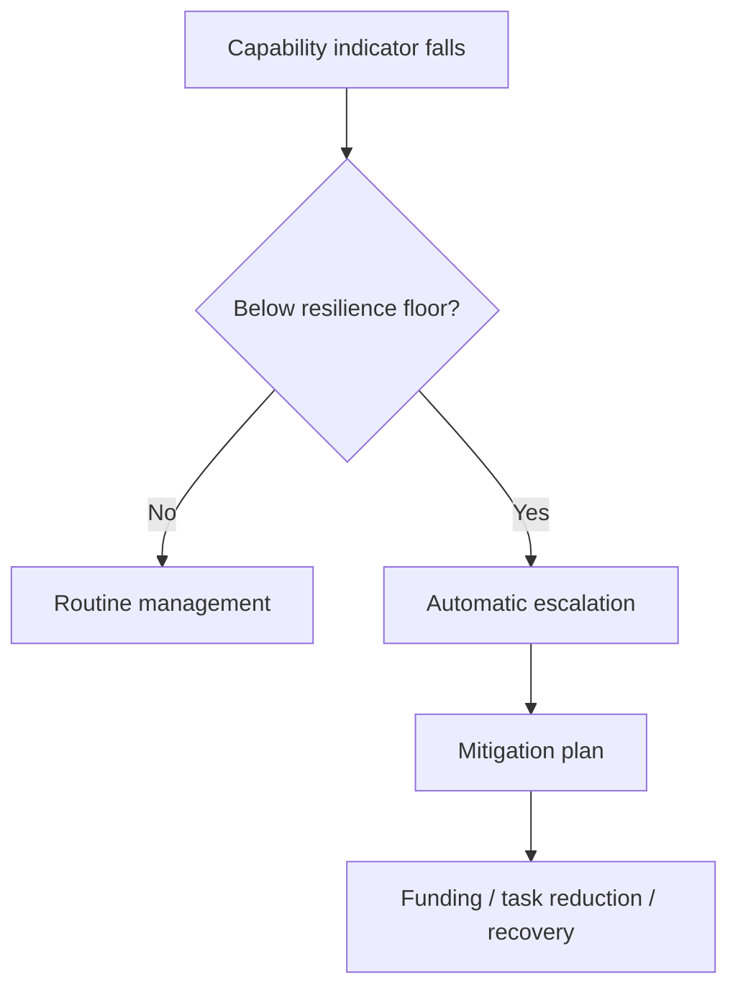

# 🛡️ Prevention And Resilience
**First created:** 2026-09-07 | **Last updated:** 2026-09-07  
*How Britain stops presenting with the same readiness problem every few years: spare capacity, adaptability, redundancy, institutional memory and systems built to survive strategic surprise.*

---

## 🛡️ Orientation

Immediate management treats the current episode.

Long-term management rebuilds the force-generation system.

Prevention asks a different question:

> **How do we stop the same pathology recreating itself under the next shock?**

Because there will be another shock.

It may be:

- another war;
- another financial crisis;
- another procurement failure;
- another recruitment problem;
- another alliance commitment;
- another estate constraint;
- another technological transition;
- another hostile-state surprise;
- another government with different priorities.

The objective cannot therefore be:

> design a Defence system that works perfectly when assumptions remain stable.

It has to be:

> **design a Defence system which remains useful when some of its assumptions are wrong.**

That is resilience.

---

## 🧬 1. Resilience is not the absence of failure

A resilient system still experiences:

- mistakes;
- broken equipment;
- poor predictions;
- bad exercises;
- recruitment dips;
- supply disruption;
- political mistakes;
- strategic surprise.

The difference is that those failures do not automatically become cascading institutional crises.

A useful shorthand is:

```text id="1ml6at"
robustness = resist the hit

resilience = recover after the hit

adaptability = change because of the hit
````

Defence needs all three.

---

## 🧱 2. Stop optimising every reserve out of the system

Highly efficient systems look attractive during normal conditions.

Every spare:

* person;
* vehicle;
* bed;
* instructor;
* building;
* supplier;
* training slot;

can appear to be:

> unused capacity.

But in a shock, that unused capacity acquires another name:

> **reserve.**

The difficult question is not:

> How do we eliminate all spare capacity?

It is:

> **How much spare capacity does the system need before efficiency starts consuming resilience?**

---

## 🌳 3. Spare capacity should be deliberate

Slack should exist where failure would otherwise propagate.

Potential examples include:

* instructor capacity;
* critical trades;
* training estate;
* medical capacity;
* spares;
* ammunition;
* logistics;
* repair;
* communications;
* industrial supply;
* reserve personnel.

Not every category needs the same buffer.

Some are expensive to hold.

Some can be regenerated quickly.

Some take years.

The correct design question is therefore:

> **Which capabilities are slow enough to regenerate that Britain must carry reserve before the crisis begins?**

---

## ⏱️ 4. Measure regeneration time

One of the most useful resilience metrics is:

> **If we lose this capability tomorrow, how long until we can recreate it?**

That should apply to:

* specialist personnel;
* instructors;
* platforms;
* ammunition;
* manufacturing lines;
* training estate;
* medical capability;
* software;
* supply chains.

A capability which can be replaced in three weeks is different from one requiring:

> twelve years, a shipyard and three hundred people who no longer work in Britain.

The longer the regeneration time:

the stronger the argument for redundancy.

---

## 🧩 5. Redundancy is not automatically waste

Public administration often dislikes duplication.

Sometimes correctly.

Two organisations doing the same job badly is not resilience.

But some redundancy is protective.

Examples might include:

* multiple suppliers;
* reserve communications pathways;
* several training locations;
* overlapping technical expertise;
* backup logistics;
* allied alternatives.

The correct distinction is:

```text id="3ckcqz"
duplication without purpose = waste

redundancy designed around failure = resilience
```

Do not remove the second because the spreadsheet cannot distinguish them.

---

## 🔗 6. Find single points of failure

Every major Defence capability should have a simple resilience question attached:

> **What single failure could stop this entire function?**

Possible answers:

* one supplier;
* one site;
* one software system;
* one specialist team;
* one rare component;
* one allied dependency;
* one approval process.

Then ask:

> What happens if it fails?

If the answer is:

> **everything stops,**

the next question is obvious.

Why?

---

## 🧵 7. Map dependencies, not just assets

Platforms are visible.

Dependencies are less so.

A ship depends on:

* crew;
* fuel;
* maintenance;
* dockyard;
* ammunition;
* software;
* communications;
* intelligence;
* logistics.

A training exercise depends on:

* people;
* instructors;
* estate;
* equipment;
* ammunition;
* transport;
* accommodation;
* safety approvals;
* funding.

Therefore resilience planning should map:

> **systems behind systems.**

The visible object is not necessarily the critical node.

---

## 🪢 8. Build around graceful degradation

Not every system can remain at 100% during crisis.

So design for:

> **degrade usefully rather than collapse completely.**

For example:

* reduced capability;
* slower tempo;
* alternate communications;
* partial training;
* allied support;
* distributed logistics.

A resilient military should know:

> what is the 80% mode?

Then:

> 60%?

Then:

> minimum credible function?

That is much safer than discovering degraded operation live.

---

## 🪜 9. Define minimum readiness floors

If training, staffing, estate or equipment falls below a defined functional threshold, automatic action should follow.

Not:

> somebody might notice.

For example:



The exact thresholds may need to remain sensitive.

The existence of the governance mechanism does not.

---

## 💷 10. Protect preventative capability from annual raids

Some budget lines are repeatedly tempting because cutting them produces immediate savings while consequences arrive later.

That includes:

* training;
* maintenance;
* estate;
* prevention;
* stockpiles;
* instructor capacity.

These areas need explicit resilience treatment.

Not necessarily absolute ringfencing.

But stronger escalation before cuts.

If a proposed saving reduces:

> **future ability to generate force**

the decision should trigger a higher evidential threshold.

---

## 🧮 11. Add resilience accounting

Standard accounting asks:

> What does this cost?

Resilience accounting should also ask:

> **What future failure does this prevent or soften?**

For example:

```text id="awvklb"
£X spare capacity
↓
supports Y function
↓
absorbs Z plausible shock
↓
reduces recovery time by N
```

The numbers will not always be precise.

That does not make the concept invalid.

Businesses routinely pay for:

* insurance;
* backups;
* cybersecurity;
* continuity planning.

Defence should not pretend resilience becomes economically irrational merely because its value appears during bad days.

---

## 🧪 12. Stress-test budgets, not only forces

Military exercises test forces.

Budget systems should also be exercised.

Ask:

> **What happens if Defence suddenly needs another £500 million this year?**

Or:

> £5 billion?

Or:

> an urgent mobilisation?

Which budgets can move?

What happens to existing programmes?

Which approvals slow response?

Which suppliers can scale?

Which expenditure becomes the default casualty?

This would reveal whether current budget architecture remains functional under stress.

---

## 🪖 13. Exercise mobilisation before mobilisation

Mobilisation planning should not live as an elegant document waiting for emergency.

Exercise:

* reserve call-up;
* training expansion;
* logistics;
* industrial surge;
* medical capacity;
* accommodation;
* transport;
* legal processes;
* employer relationships.

The useful question is:

> **If Britain needed to expand capability quickly, where would the first bottleneck appear?**

Find it during peacetime.

That is cheaper.

---

## 🎓 14. Maintain instructor depth before demand spikes

Training demand increases sharply when force expansion begins.

But instructor supply cannot instantly increase with it.

Therefore instructor resilience needs:

* reserve capacity;
* retired expertise;
* retraining pathways;
* allied support;
* documented teaching material;
* accreditation.

Do not discover during mobilisation that everybody capable of teaching is already needed somewhere else.

---

## 🧠 15. Institutional memory should survive staff turnover

A resilient institution cannot depend upon:

> Dave remembers what happened last time.

Dave will eventually retire.

Or move.

Or die.

Institutional memory therefore needs:

* searchable archives;
* lessons records;
* implementation trackers;
* source preservation;
* handover systems;
* oral histories where appropriate;
* repeatable training.

The goal is not to preserve every piece of bureaucracy forever.

It is to preserve the **why**.

---

## 📚 16. Every major decision should retain its reasoning

Future officials should be able to find:

* what decision was made;
* what alternatives existed;
* what assumptions were used;
* what risk was accepted;
* what evidence supported it;
* what later happened.

Otherwise the institution learns:

> outcome

without remembering:

> reasoning.

That makes later review far weaker.

---

## 🔁 17. Build lessons into normal operations

Lessons systems should not activate only after catastrophe.

Every significant:

* exercise;
* operation;
* procurement;
* training reform;
* mobilisation test;

should generate:

```text id="lr90j7"
what happened
→ why
→ what changed
→ who owns change
→ when retested
```

The final step matters.

A lesson is not learned because someone wrote it down.

A lesson is learned when behaviour changes.

---

## ⚙️ 18. Retest fixes

This is one of the most neglected steps in institutional learning.

Suppose an exercise reveals:

> logistics failed.

A process changes.

Fine.

The next question should be:

> **Did the change fix the problem?**

Without retesting:

```text id="md2uo2"
failure
→ recommendation
→ policy
→ assumed success
```

is not learning.

It is administrative optimism.

---

## 🧈 19. Make negative feedback easy to transmit

Healthy systems make bad news cheap to report.

Unhealthy systems make bad news personally expensive.

If reporting:

> this is not working

creates:

* career damage;
* reputational conflict;
* bureaucratic punishment;
* accusations of disloyalty;

the institution will eventually lose access to its own sensory system.

Resilience therefore requires:

> **low-friction negative feedback.**

The feedback needs to move like fucking butter.

---

## 🧿 20. Distinguish dissent from disobedience

Military hierarchy is necessary.

So is professional disagreement.

The institution needs processes where someone can say:

> **I will execute the lawful decision, but this is my assessment of the risk.**

That distinction protects:

* civilian control;
* military professionalism;
* institutional learning.

It also makes later accountability clearer.

---

## 🪟 21. Make uncertainty visible

Plans often become politically dangerous when uncertainty disappears during briefing.

For example:

```text id="01v81w"
Assessment:
60% confidence

Brief:
likely

Statement:
expected

Headline:
will
```

Resilience requires maintaining confidence labels through institutional translation.

Not every uncertainty belongs in public.

But decision-makers need to know:

> **which assumptions are solid and which are bets.**

---

## 🎲 22. Keep an assumptions register

Major strategy should record assumptions such as:

* warning time;
* allied support;
* supply availability;
* air superiority;
* mobilisation speed;
* casualty rates;
* recruitment;
* industrial output.

Then periodically test:

> **Is this still true?**

This is particularly important because past operational success can make assumptions invisible.

---

## 🧨 23. Hunt for assumptions likely to fail together

Strategic planning often tests one variable at a time.

But crises compound.

For example:

* ally unavailable;
* supply chain disrupted;
* recruitment low;
* estate constrained;
* cyberattack ongoing.

The relevant question is not always:

> Can we survive X?

It is:

> **Can we survive X while Y and Z are also happening?**

That is where resilience gets real.

---

## 🌩️ 24. Plan for strategic surprise explicitly

Strategic surprise does not mean:

> nobody anywhere imagined this possibility.

Often somebody did.

Surprise can mean:

* dismissed probability;
* wrong timing;
* wrong scale;
* wrong actor;
* wrong method;
* wrong combination.

So resilience should not attempt to predict every future event.

It should preserve enough adaptive capacity that prediction failure is survivable.

---

## 🌀 25. Optimise for adaptability, not perfect forecasting

No review written in 2026 can specify precisely what Britain will need in 2046.

That means some future investment should favour:

* modular systems;
* adaptable training areas;
* reconfigurable technology;
* open architecture;
* transferable skills;
* flexible logistics;
* broad technical competence.

The objective is not:

> guess exactly right.

It is:

> **make being partly wrong cheaper.**

---

## 🧰 26. Preserve generalist capacity alongside specialists

Future Defence will need deep specialists.

But excessive specialisation can create brittleness.

The system also needs people who understand how:

* domains connect;
* logistics affects operations;
* medicine affects endurance;
* procurement affects training;
* data affects command.

Resilience benefits from:

> **specialists with connective tissue.**

Not everyone needs to know everything.

Someone needs to know how the boxes connect.

---

## 🧩 27. Do not overfit to the last war

Afghanistan produced highly useful adaptations.

Some later required unlearning.

Ukraine is generating another huge learning wave.

Use it.

But do not assume:

> **the next war is Ukraine with different flags.**

Lessons should be separated into:

### Universal

* logistics matters;
* adaptation matters;
* training matters;
* people matter.

### Context-dependent

* specific threat;
* terrain;
* air situation;
* casualty evacuation;
* communications;
* technology.

That distinction helps prevent future overfitting.

---

## 🌍 28. Use allies as resilience, not dependency camouflage

Alliances create genuine redundancy.

Britain does not need sovereign versions of every capability.

But allied dependency should be visible.

Ask:

* who provides the backup?
* what if they are busy?
* what if their politics change?
* what if they are suffering the same shock?
* what if infrastructure is disrupted?

An allied capability counts as resilience when the dependency is understood.

Not when it is merely assumed.

---

## 🪢 29. Avoid correlated allied failure

NATO states may share:

* suppliers;
* software;
* ammunition;
* infrastructure;
* doctrine.

That creates strength.

It can also create correlated vulnerability.

If everybody relies on:

> the same factory

then thirty allies may still have one point of failure.

Alliance resilience therefore needs some diversity.

---

## 🏭 30. Industrial redundancy needs realistic economics

Britain cannot maintain a spare factory for everything.

So industrial resilience should combine:

* stockpiles;
* diversified suppliers;
* surge contracts;
* convertible capacity;
* allied production;
* strategic reserves.

The answer will differ by product.

A drone component and a nuclear submarine component have entirely different regeneration problems.

Treat them accordingly.

---

## 🔧 31. Repair capacity matters as much as replacement

Resilience is not only:

> buy more.

It is also:

> **fix faster.**

Invest in:

* maintainers;
* repair facilities;
* diagnostics;
* spare parts;
* engineering data;
* battlefield repair where appropriate.

A repaired platform can return capability much faster than a replacement platform can be procured.

---

## 🩻 32. Medical resilience needs surge capacity too

High-intensity conflict can produce sudden medical demand.

The system needs resilience across:

* battlefield care;
* evacuation;
* surgery;
* rehabilitation;
* prosthetics;
* mental health;
* long-term follow-up.

Medical capacity should therefore be included in mobilisation exercises.

Not treated as the part we solve after casualties appear.

---

## 🦿 33. Rehabilitation capacity preserves human capability

Rehabilitation is also resilience.

It determines how much function can be restored after injury.

That affects:

* individual life;
* families;
* return to work;
* military retention where possible;
* veteran outcomes;
* future care burden.

The state should therefore invest in rehabilitation before it knows exactly who will need it.

That is what preparedness means.

---

## 🧩 34. Personnel resilience requires sustainable tempo

The force cannot use human beings as infinite elastic.

Repeated high tempo can produce:

* burnout;
* injury;
* family breakdown;
* retention loss;
* skill drain.

Therefore operational resilience should include limits on:

> how much hidden adaptation is being provided by human overwork.

If every crisis is solved by asking the same people to work harder:

that is not resilience.

That is delayed failure.

---

## 🏡 35. Family resilience is force resilience

If families cannot absorb:

* repeated moves;
* deployments;
* housing problems;
* school disruption;
* long separations;

personnel eventually leave.

So family support is not decorative.

It is part of the reserve that keeps experienced capability inside the force.

---

## 🔄 36. Build succession before the expert leaves

For scarce roles:

* identify successors;
* overlap postings;
* document tacit knowledge;
* create mentoring;
* preserve networks.

Do not allow:

> **only person who knows how this works retires Friday**

to remain a plausible administrative event.

---

## 🧪 37. Run red teams against force generation

Red-teaming should not only ask:

> How would an adversary defeat the Army?

Also ask:

> **How would we accidentally make the Army unable to generate itself?**

Possible attack surfaces include:

* staffing;
* finance;
* training estate;
* procurement;
* software;
* industry;
* supply chain;
* bureaucracy.

This is institutional threat modelling.

---

## 📉 38. Treat trends before thresholds

Waiting until readiness formally fails is late.

Resilience monitoring should identify:

* worsening retention;
* training cancellation trend;
* estate downtime;
* equipment availability decline;
* instructor vacancy growth;
* supplier concentration.

The useful intervention point is:

> **before the line crosses red.**

---

## 🚦 39. Create amber conditions with consequences

Organisations often have:

> green

and:

> red.

Everything remains green until it suddenly becomes a crisis.

A meaningful amber state should trigger:

* additional scrutiny;
* recovery planning;
* funding review;
* task review.

Amber must mean:

> **do something now.**

Not:

> watch quietly until red.

---

## 🧾 40. Build readiness debt into the ledger

Cancelled maintenance creates maintenance debt.

Cancelled training creates training debt.

Deferred estate repair creates infrastructure debt.

These should be recorded as liabilities.

Not disappear because the current-year cash saving was achieved.

For every deferral:

```text id="7f2zd4"
saving now
→ capability debt
→ recovery action
→ recovery cost
→ deadline
```

This would make repeated borrowing from future readiness much harder to hide.

---

## 💳 41. Do not let temporary measures become permanent by inertia

Many systems accumulate:

> temporary

arrangements.

Then nobody remembers when they were supposed to end.

Every emergency measure should have:

* owner;
* start date;
* review date;
* exit criteria.

If retained:

state why.

Temporary policy should not acquire immortality through administrative forgetfulness.

---

## 🔭 42. Preserve strategic option value

Some capability is worth maintaining because it keeps future choices open.

Option value may exist in:

* estate;
* industrial capacity;
* skills;
* reserve structures;
* alliance access;
* infrastructure.

Selling or closing something may generate immediate savings but make future regeneration extremely expensive.

Before irreversible decisions:

> **price the option being destroyed.**

---

## 🌲 43. Prefer reversible decisions under uncertainty

Where uncertainty is high, reversible decisions are often valuable.

For example:

* mothball rather than destroy;
* lease rather than sell;
* retain design knowledge;
* preserve small cadre;
* maintain minimal supply chain.

Not always.

Some old capability should genuinely end.

But irreversibility deserves an explicit premium.

---

## 🪖 44. Exercise the boring failures

Exercises naturally gravitate toward:

> the interesting war bit.

Resilience also requires rehearsal of:

* IT outage;
* fuel delay;
* staff sickness;
* broken bridge;
* supplier failure;
* communications loss;
* payroll problem;
* accommodation failure.

Because real systems often fail through boring things.

The enemy does not need to destroy capability you have already disabled administratively.

---

## 🧯 45. Separate crisis heroism from institutional health

A system can appear excellent because individuals repeatedly save it.

That creates dangerous praise.

> Look how brilliantly everybody responded.

Good.

Now ask:

> **Why did they need to?**

Heroic adaptation should be rewarded.

It should also trigger investigation into whether the crisis was avoidable.

---

## 🧠 46. Learn from near-misses

Defence should treat:

> nearly failed

as information.

Not only:

> failed.

Near-misses reveal:

* fragile assumptions;
* stretched capacity;
* lucky timing;
* human workaround.

Waiting for actual catastrophe wastes free evidence.

---

## 🪟 47. Public scrutiny can increase resilience

Secrecy is necessary in Defence.

Total opacity is not.

External scrutiny can reveal:

* repeated procurement failure;
* estate decay;
* personnel problems;
* contradictory commitments.

Useful institutions include:

* Parliament;
* NAO;
* committees;
* auditors;
* researchers;
* journalists;
* veterans;
* civil society.

The point is not:

> disclose everything.

The point is:

> **allow enough outside sensory input that institutional blind spots do not become permanent.**

---

## 🧿 48. Bounded transparency should be designed in

The existing Polaris rule applies:

> **Not reckless disclosure.
> Not managed ignorance.**

A resilient democracy should explain:

* objectives;
* aggregate preparedness;
* implementation progress;
* major trade-offs;
* lessons learned where safe.

It should protect:

* exploitable vulnerabilities;
* operational detail;
* targeting information;
* sensitive readiness data.

Opacity should be specific.

Not ambient.

---

## 📜 49. Make review recommendations decay-resistant

For each major review recommendation:

```text id="2yuo4f"
recommendation
→ owner
→ budget
→ deadline
→ status
→ outcome
→ review
```

If government rejects one:

record why.

If it becomes obsolete:

record why.

If it is still outstanding ten years later:

that should be immediately visible.

This prevents the institutional trick where every new review rediscovers the previous review's unfinished homework.

---

## ⏳ 50. Give lessons a half-life check

Every few years, ask:

> Which important lessons are currently fading from organisational memory?

Examples might include:

* particular training disciplines;
* mobilisation expertise;
* industrial skills;
* medical practices;
* alliance procedures.

Some knowledge naturally loses relevance.

Some is being accidentally lost.

Distinguish them.

---

## 🎲 51. Keep multiple futures alive

Strategic planning should avoid one forecast becoming doctrine.

Use several plausible futures.

For example:

### Future A

Long Russian confrontation.

### Future B

Major Indo-Pacific crisis.

### Future C

Distributed proxy / grey-zone pressure.

### Future D

Alliance fragmentation.

### Future E

Domestic infrastructure crisis alongside external conflict.

Then ask:

> **Which capabilities are useful across several futures?**

Those often deserve resilience priority.

---

## 🧭 52. Build no-regrets capability

Some investments retain value under many scenarios.

Examples may include:

* logistics;
* training;
* repair;
* medicine;
* communications;
* engineering;
* cyber defence;
* institutional learning.

These are often less glamorous than exquisite platforms.

But they are useful across a much wider range of futures.

---

## 🌐 53. Protect civilian infrastructure interfaces

Modern military resilience depends upon civilian systems:

* ports;
* power;
* communications;
* cloud;
* rail;
* roads;
* fuel;
* healthcare;
* industry.

Therefore Defence resilience cannot stop at the gate.

It must understand:

> **which civilian failures become military failures.**

This should be mapped with appropriate public and private partners.

---

## 🧵 54. Civil resilience and military resilience overlap

The same infrastructure can support:

* civilian life;
* military movement;
* emergency response;
* industry.

Investments that improve:

* ports;
* communications;
* energy;
* repair;
* medical capacity;

may therefore produce wider national resilience.

That does not mean militarising every public service.

It means recognising shared physical systems.

---

## 🛡️ 55. Resilience against political change

A forty-year capability cannot depend upon one party remaining in office.

Therefore durable Defence policy benefits from:

* cross-party understanding;
* transparent assumptions;
* documented trade-offs;
* long-term contracts with review points;
* parliamentary scrutiny;
* stable professional institutions.

Political disagreement will continue.

The aim is not consensus on everything.

It is preventing every election from resetting strategic memory to zero.

---

## 🧱 56. Make resilience boring enough to survive governments

The strongest systems often look uninteresting.

* maintenance happens;
* instructors exist;
* estate works;
* supplies arrive;
* people stay;
* lessons move;
* backup exists.

No dramatic launch.

No giant banner.

Just:

> **the fucking thing still works.**

That is a legitimate strategic achievement.

---

## 🧠 57. Define resilience outputs

Useful outcomes might include:

### Personnel

Critical roles remain fillable under surge.

### Training

Collective competence can be recovered after disruption.

### Estate

Alternative capacity exists for critical activity.

### Equipment

Failures do not create whole-capability collapse.

### Industry

Critical production can expand within defined time.

### Medicine

Casualty surges can be absorbed.

### Knowledge

Lessons survive personnel turnover.

### Governance

Readiness decline triggers intervention before crisis.

These are stronger measures than:

> money spent on resilience.

---

## 📊 58. Create a resilience scorecard carefully

A scorecard should never pretend a complicated military can be collapsed into one magic number.

But several indicators can sit together:

* regeneration times;
* staffing depth;
* instructor depth;
* estate spare capacity;
* supply concentration;
* maintenance backlog;
* training debt;
* readiness trend;
* lessons closure rate.

The point is pattern recognition.

Not gamified bureaucracy.

---

## 🦚 59. Pre-agree escalation routes

When readiness pressure emerges, institutions should already know:

* who gets told;
* who owns mitigation;
* when ministers become involved;
* when Treasury becomes involved;
* what evidence is required.

Do not improvise governance during the crisis.

That creates both delay and blame confusion.

---

## 🧮 60. Pre-agree the sacrifice hierarchy

This sounds grim.

It is better than pretending no sacrifice will ever be required.

If budgets or capacity collapse, Defence should have principles for prioritisation.

For example:

1. legally required activity;
2. imminent operational readiness;
3. NATO / allied obligations;
4. non-recoverable collective competence;
5. recoverable activity;
6. lower-value discretionary activity.

The exact hierarchy will vary.

But deciding nothing in advance means:

> **whatever is easiest to cancel wins.**

That is not strategy.

---

## 🧠 61. Keep one question permanently open

Every major Defence planning cycle should ask:

> **What are we currently assuming will not happen?**

Then:

> **What if it does?**

This does not mean preparing equally for every absurd possibility.

It is a guard against assumptions becoming invisible.

---

## 🔮 62. Future surprise is unavoidable

By 2076, Britain will have encountered events none of us can specify today.

Some technologies will surprise us.

Some alliances will change.

Some threats will disappear.

Others will arrive.

Resilience therefore cannot mean:

> perfect preparation for every future.

It means:

> **preserve enough people, knowledge, infrastructure, relationships and adaptive capacity that the country can respond before surprise becomes defeat.**

---

## 🩺 Relapse-prevention plan

## Every year

* review training debt;
* review critical personnel gaps;
* review estate capacity;
* review equipment availability;
* review supply-chain concentration;
* review readiness trends.

## Every major exercise

* capture lessons;
* assign owners;
* retest fixes.

## Every spending review

* stress-test readiness consequences;
* identify protected preventative capability;
* assess resilience loss from proposed savings.

## Every strategic review

* audit previous implementation;
* update assumptions;
* test alternative futures;
* identify regeneration times.

## Every major crisis

* record workarounds;
* identify which reserve was consumed;
* replenish it.

---

## 🛡️ Resilience principles

A future British force should be designed so that:

1. **one failure rarely destroys an entire function;**
2. **critical capabilities possess enough spare capacity to absorb disruption;**
3. **slow-to-regenerate capability is protected before crisis;**
4. **training debt remains visible;**
5. **negative information moves upwards without losing meaning;**
6. **lessons are retested rather than merely archived;**
7. **strategy records its assumptions;**
8. **budgets are stress-tested against operational consequences;**
9. **allied dependency is understood rather than assumed;**
10. **strategic surprise produces adaptation rather than institutional paralysis.**

---

## 🧠 The deeper prevention principle

The goal is not to build a Defence system which never breaks.

That would be fantasy.

The goal is to build one where:

> **breakage reveals information, reserve buys time, feedback produces change, and the institution comes out of the shock more capable of surviving the next one.**

That is the difference between:

> crisis management

and:

> resilience.

---

## 🌱 The gardening problem

A resilient system looks expensive right up until the day it is needed.

That is why it is politically vulnerable.

The spare instructor looks unused.

The extra training slot looks inefficient.

The second supplier looks duplicative.

The maintained but quiet site looks unnecessary.

Then the weather changes.

And suddenly everybody wants to know:

> **why did we cut the fucking roots off?**

Prevention is mostly the discipline of remembering that healthy systems require things which do not look dramatic every day.

---

---

## 🌌 Constellations
🛡️ 🌳 ⚙️ 🧠 🏚️ 🏭 🩻 🔭 — resilience; redundancy; spare capacity; institutional memory; strategic surprise; force regeneration; civil-military infrastructure; adaptive Defence.

---

## ✨ Stardust
defence resilience, british army readiness, strategic surprise, force generation, redundancy, spare capacity, military mobilisation, institutional memory, lessons learned, defence estate, industrial resilience, training debt, readiness debt, military adaptability, defence planning

---

## 🏮 Footer

*🛡️ Prevention And Resilience* is a living node of the **Polaris Protocol**.  
It identifies the redundancy, option value, learning capacity and reserve required to make future strategic error less damaging.

> 📡 Cross-references:
>
> - [`💊_long_term_management.md`](./💊_long_term_management.md) — *rebuilding the underlying force-generation system*
> - [`⚙️_the_feedback_machine.md`](./⚙️_the_feedback_machine.md) — *institutional cybernetics and negative feedback*
> - [`🪖_what_training_is_for.md`](./🪖_what_training_is_for.md) — *why competence needs repeated rehearsal*
> - [`🧾_the_blank_cheque_exercise.md`](./🧾_the_blank_cheque_exercise.md) — *identifying unconstrained resilience requirements*
> - [`🔭_what_does_ready_actually_look_like.md`](./🔭_what_does_ready_actually_look_like.md) — *functional readiness outputs*
> - [`🪟_transparency_and_earned_loyalty.md`](./🪟_transparency_and_earned_loyalty.md) — *public scrutiny and institutional trust*
> - [`data/strategic_reviews.md`](./data/strategic_reviews.md) — *recurring recommendations and unfinished implementation*
> - [`data/timeline.md`](./data/timeline.md) — *strategic shocks and adaptation*
>  
> 🏮 Return To:
>
> - [🪖 Training Debrief](./README.md) — *1up*
> - [🌊 Playing Defence](../README.md) — *2up*
> - [📲 Press Matters](../../README.md) — *3up*
> - [🌓 In The Moment](../../../README.md) — *4up*
> - [🌌 Polaris Protocol — Root](../../../../README.md) — *root*

*Survivor authorship is sovereign. Containment is never neutral.*

_Last updated: 2026-09-07_
