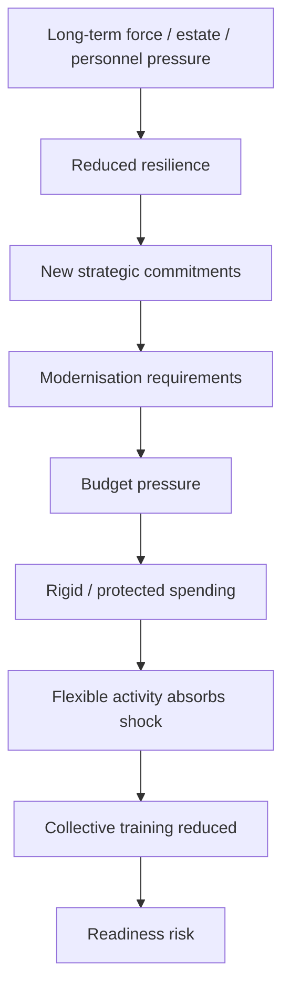
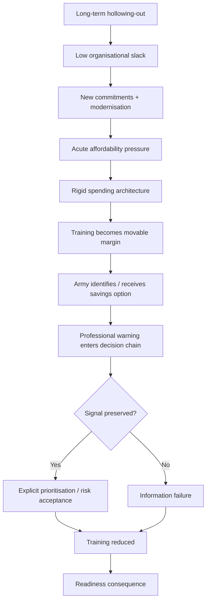

# 🧠 Assessment And Differential
**First created:** 2026-09-07 | **Last updated:** 2026-09-07  
*A provisional systemic diagnosis of the British Army collective-training problem, testing competing explanations before assigning responsibility.*

---

## 🧠 Orientation

The presenting complaint is now reasonably clear.

Britain says it is moving towards:

> **warfighting readiness**

while the Army has reportedly been required to reduce or suspend some collective-training activity in order to make approximately £30 million of savings.

That is a genuine contradiction worth investigating.

It is not yet a complete diagnosis.

The wrong move now would be to choose whichever institution one already dislikes and write:

> **Aha. It was them.**

Possible villains are plentiful:

- Treasury;
- ministers;
- Army Command;
- MOD finance;
- procurement;
- previous governments;
- modernisation programmes;
- contractors;
- strategic overreach;
- bureaucracy.

Several may have contributed.

None should be convicted because they were standing nearest the budget when the music stopped.

This node therefore does a different job from [🔬 Tests And Investigations](./🔬_tests_and_investigations.md).

`🔬` asks:

> **What evidence do we need?**

This node asks:

> **What explanations currently remain live, what would each imply, and what evidence would distinguish them?**

The diagnosis remains provisional.

That is not weakness.

It is what diagnosis is for.

---

## 🩻 Provisional assessment

The evidence currently supports a cautious systemic assessment:

> **Britain appears to have a Defence system in which strategic ambition, operational commitments, inherited programmes, personnel capacity, estate, modernisation and available near-term spending are not yet sufficiently aligned to protect all of the force-generation activity that current policy says is necessary for warfighting readiness.**

The reported £30 million training reduction may therefore be:

- the immediate problem;
- a symptom of a deeper affordability problem;
- a symptom of budget architecture;
- evidence of accumulated hollowing-out;
- a rational temporary prioritisation;
- an unintended consequence of modernisation;
- the result of competing commitments;
- evidence of poor information flow;
- evidence of poor prioritisation;
- or some combination of these.

This is a **multifactorial differential**.

That matters.

Because treating a systems problem as one bad decision by one person is an excellent way to replace the person and preserve the system.

---

## 🧬 The working differential

At present, seven explanations deserve serious testing:

1. **Acute affordability pressure**
2. **Budget architecture and lock-in**
3. **Modernisation transition costs**
4. **Accumulated hollowing-out**
5. **Competing commitments**
6. **Poor feedback and information transmission**
7. **Bad prioritisation**

These are not mutually exclusive.

Indeed, the most plausible eventual diagnosis may be a chain:



The diagnostic task is therefore not merely:

> Which box caused the problem?

It is also:

> **Which arrows carried the problem from one part of the system into another?**

---

## 💷 1. Differential: acute affordability pressure

The simplest explanation is also the most ordinary.

Defence had an in-year financial problem.

Savings were required.

Collective Army training was one of the activities available to reduce, defer or redesign.

On this reading, there is no mysterious institutional pathology.

There is:

> **not enough near-term money for everything currently planned.**

That explanation remains plausible.

But it is incomplete until several questions are answered.

### Evidence which would strengthen it

- a clear in-year savings requirement existed;
- the timing of the requirement matches the training changes;
- the affected activity would largely return if funding returned;
- alternatives were examined and had greater capability consequences;
- the saving is temporary rather than part of an unacknowledged force-design change.

### Evidence which would weaken it

- the same training changes would have happened without the £30 million constraint;
- the affected activity had already been judged obsolete or low-value;
- the principal cause was estate, personnel or equipment availability rather than cash;
- the £30 million figure describes savings captured after a training redesign rather than the reason for it.

The cleanest test remains:

> **If the £30 million constraint disappeared tomorrow, would the decision remain the same?**

If yes:

affordability is not the whole diagnosis.

If no:

affordability is probably causal.

If partly:

welcome to Defence.

---

## 🧱 2. Differential: budget architecture and lock-in

The next possibility is more structural.

Defence may possess enough money in aggregate while still having too little money available at the point where this decision was made.

Large programmes can be:

- contractually committed;
- politically protected;
- strategically designated;
- difficult to alter quickly;
- expensive to cancel;
- attached to long procurement cycles;
- funded through different accounting structures.

Training is different.

Exercises can often be:

- postponed;
- reduced;
- rescheduled;
- redesigned;
- cancelled.

That flexibility is operationally useful.

It can also make training financially vulnerable.

The diagnostic question is therefore:

> **Was collective training reduced because it was the least valuable activity available, or because it was one of the easiest activities to stop?**

Those are not the same thing.

If the second is true, the pathology is:

> **financial flexibility becoming capability vulnerability.**

### Evidence which would strengthen this diagnosis

- substantial spending lines were effectively immovable in-year;
- the Army had few genuinely flexible alternatives;
- commercial or programme restructuring was not feasible on the required clock;
- training absorbed pressure primarily because it could move quickly;
- similar patterns recur across financial years.

### Evidence which would weaken it

- several equally flexible alternatives existed;
- those alternatives were properly assessed and carried greater capability cost;
- the affected training was independently assessed as the least damaging option.

A budget can therefore be:

> balanced

while the capability system is:

> badly prioritised by the shape of what can move.

That would be an architectural diagnosis.

Not merely an accounting one.

---

## 🤖 3. Differential: modernisation transition costs

The Army is not standing still.

Its training system is being changed in response to:

- lessons from Ukraine;
- counter-drone requirements;
- simulation;
- AI and analytics;
- virtual environments;
- new force structures;
- different operational assumptions.

Some apparent reduction in traditional activity may therefore be genuine transformation.

That possibility needs to be taken seriously.

It would be foolish to preserve every exercise simply because:

> **this is how we have always trained.**

Training exists to produce capability.

If another method produces the same or better capability at lower cost, use it.

But modernisation creates a dangerous rhetorical shortcut:

```text
old activity reduced
        +
new technology introduced
        ↓
modernisation
```

That conclusion does not automatically follow.

The correct test is functional.

### Ask

- What competence did the old activity produce?
- What new method replaces that function?
- Has the substitution been validated?
- At what scale?
- Under what conditions?
- What physical, human and logistical friction remains missing?
- Is the change doctrine-led or budget-led?
- Would the new method still be preferred if the £30 million constraint vanished?

The difference between:

> **modernising training**

and:

> **cutting training while modernisation is happening nearby**

is evidence.

Not vocabulary.

### Evidence which would strengthen this diagnosis

- clear training doctrine supports the replacement;
- affected activity has an identified synthetic or redesigned substitute;
- competence is measured before and after;
- live activity remains where physical collective friction is necessary;
- the change would survive removal of the immediate savings requirement.

### Evidence which would weaken it

- synthetic activity is being credited without validated equivalence;
- live activity is removed primarily because it costs more;
- recovery plans assume later restoration of the supposedly obsolete activity;
- Army personnel describe the change as financial rather than doctrinal.

Modernisation may be part of the answer.

It should not become a magic word which makes capability loss disappear.

---

## 🕳️ 4. Differential: accumulated hollowing-out

A small immediate cut can become strategically important when it lands on a system with little remaining slack.

The £30 million question therefore cannot be assessed only by its cash value.

The relevant prior condition includes:

- trained personnel;
- instructors;
- estate;
- equipment availability;
- ammunition;
- logistics;
- maintenance;
- medical support;
- reserve capacity;
- recovery time;
- accumulated training debt.

If those systems are already under pressure, then even a modest reduction can have disproportionate effects.

This is the hollowing-out differential.

The logic is:

```text
repeated small constraints
        ↓
less spare capacity
        ↓
more dependence on perfect scheduling
        ↓
less ability to absorb disruption
        ↓
ordinary saving becomes readiness problem
```

A resilient force can tolerate some cancelled activity.

A brittle force cannot tolerate very much.

### Evidence which would strengthen this diagnosis

- previous training debt remains unrecovered;
- estate constraints already reduce exercise opportunity;
- instructor shortages delay regeneration;
- equipment availability limits realistic collective training;
- operational commitments repeatedly displace training;
- the force can generate one deployment but struggles to regenerate afterwards.

### Evidence which would weaken it

- training capacity has substantial spare headroom;
- deferred activity can be rescheduled quickly;
- affected formations remain above validated readiness thresholds;
- recovery does not displace later training.

The deeper question is therefore:

> **How much shock can the current force-generation system absorb before “temporary” becomes structural?**

That is not answered by saying £30 million is small.

Small loads break systems already carrying too much weight.

---

## 🌍 5. Differential: competing commitments

Another possibility is that the training problem is partly the consequence of Britain asking the same finite military system to support several important objectives simultaneously.

Possible pressures include:

- current operations;
- NATO commitments;
- Ukraine-related training and support;
- rapid-response requirements;
- mobilisation preparation;
- modernisation;
- domestic support tasks;
- alliance exercises;
- estate use;
- instructor demand.

None of those is automatically the wrong priority.

The problem appears when the same people, land, equipment, instructors and money are counted repeatedly.

A plan may be individually reasonable at every line and collectively impossible.

The diagnostic question becomes:

> **Is this genuinely a training-budget problem, or is training the place where conflicting national commitments finally become visible?**

### Evidence which would strengthen this diagnosis

- protected operational or alliance tasks materially displace domestic force generation;
- the same instructor or estate capacity is required by several priorities;
- readiness assumptions depend on activity being completed in mutually incompatible windows;
- government has added tasks faster than it has added regenerative capacity.

### Evidence which would weaken it

- affected training is unrelated to other commitments;
- sufficient capacity exists but money alone prevents execution;
- alternatives could be scheduled without conflict.

This is where the cluster must resist the phrase:

> **Defence needs to prioritise.**

Of course it does.

The diagnostic question is:

> **What has been prioritised over what, by whom, and with what consequence?**

Prioritisation is a decision.

Not an explanation.

---

## ⚙️ 6. Differential: poor feedback and information transmission

A Defence system can possess the relevant knowledge and still make a bad decision because the knowledge changes shape as it travels.

At the sharp end, the signal may be:

> **If we cancel this, the formation will lose difficult-to-regenerate collective competence.**

One level higher:

> **Training pressure will increase.**

Then:

> **Readiness may be affected.**

Then:

> **There is manageable delivery risk.**

Then:

> **The programme remains broadly on track.**

No individual translation has to be dishonest.

The aggregate effect can still be:

> **the important bit disappeared.**

This is the information differential.

It links directly to [⚙️ The Feedback Machine](./⚙️_the_feedback_machine.md).

### Possible failure modes

- operational evidence loses specificity as it rises;
- financial language dominates capability language;
- professional disagreement is compressed before reaching ministers;
- risks are fragmented across owners;
- temporary workarounds mask structural weakness;
- reporting rewards reassurance more than negative information;
- junior or specialist evidence carries insufficient institutional weight;
- ministers receive prioritised options without seeing the original requirement.

A strong central command structure does not solve this automatically.

It can improve integration.

It can also increase the importance of preserving dissent before integration occurs.

### Evidence which would strengthen this diagnosis

- Army professional advice identified a significant consequence which was not visible in the final decision;
- senior leaders received materially different assessments at different stages;
- risk language softened during escalation;
- no clear owner retained responsibility for the original negative signal;
- external reporting reveals information absent from the public or political explanation.

### Evidence which would weaken it

- the capability consequence was clearly documented throughout;
- dissenting advice reached the relevant decision-makers intact;
- the final decision explicitly accepted the stated risk.

The core cybernetic test is simple:

> **Did the information reach somebody with authority in a form that still meant what the originator meant?**

---

## ⚖️ 7. Differential: bad prioritisation

The final explanation is the least complicated and therefore the one institutions may be most reluctant to entertain.

It is possible that the system understood:

- the money;
- the alternatives;
- the readiness consequence;
- the operational requirement;

and still chose badly.

Not every failure needs a hidden mechanism.

Sometimes:

> **the trade-off was wrong.**

That conclusion carries a high evidential threshold.

It should only be reached after ruling out:

- genuine modernisation;
- unavoidable financial constraint;
- competing operational demands;
- missing information;
- contractual lock-in;
- temporary risk with credible recovery.

### Evidence which would strengthen this diagnosis

- decision-makers were clearly informed of significant readiness consequences;
- workable lower-cost alternatives existed;
- those alternatives were rejected for weaker reasons;
- affected activity was operationally important;
- replacement was inadequate;
- recovery was not credible;
- the final risk was accepted despite poor value from the saving.

### Evidence which would weaken it

- training affected was demonstrably lower priority;
- alternatives caused greater capability loss;
- the risk was small, temporary and mitigated;
- later evidence shows the new training model performed better.

Bad prioritisation is therefore:

> **a possible diagnosis after evidence.**

Not:

> **a synonym for a decision I dislike.**

---

## 🔀 The differential may be sequential rather than competitive

The seven explanations should not be treated like contestants where only one survives.

A more realistic model may be:



The eventual diagnosis may therefore read less like:

> Treasury did it.

and more like:

> **a low-resilience force encountered an acute financial constraint inside a spending architecture in which training was comparatively movable; the resulting option then travelled through a senior decision system whose handling of professional readiness evidence remains to be established.**

That is a much less exciting sentence.

It is also a much more useful one.

---

## 🪞 Do not turn professional biography into causation

The strengthened post-2025 Defence architecture makes senior military governance relevant to this case.

That does not make professional biography causal evidence.

The current Chief of the Defence Staff has a professional background associated with:

- the RAF;
- engineering;
- capability;
- investment;
- transformation.

Those are substantial strengths.

They do not establish that he undervalues:

- people;
- training;
- collective competence.

The useful proposition is structural:

> **Every professional background creates characteristic areas of unusually high visibility.**

A land commander may see one set of risks unusually clearly.

An engineer another.

A logistician another.

A submariner another.

A clinician another.

That is why:

> **specialisation is necessary. Counter-specialisation is governance.**

The diagnostic question is not:

> **Did the CDS personally prefer shiny programmes to Army exercises?**

There is no basis for that conclusion here.

The better question is:

> **Did the senior Defence architecture contain effective counterweights so that perishable human and collective capability remained visible alongside persistent capital capability?**

---

## 🪖 The VCDS and Service Chiefs matter to the diagnosis

The current Defence architecture already contains senior counterweights.

The Vice Chief of the Defence Staff carries a formal personnel-and-training role.

Service Chiefs remain important professional sensors.

That creates a useful governance test.

If Army collective training becomes vulnerable, ask:

- What did Army leadership assess?
- What did the VCDS assess?
- What did CDS assess?
- Where did those assessments differ?
- Did disagreement survive integration?
- What assumptions did each rely upon?
- Who made the final military recommendation?
- What risk was presented to ministers?

Integration should mean:

> **joint judgement after specialist evidence is heard.**

Not:

> **specialist evidence disappears so the centre can look tidy.**

If the Army says:

> this damages land-force generation,

that signal should remain recognisable after it enters the integrated system.

The same principle applies when the Navy or RAF brings inconvenient evidence.

---

## 🛩️ The catalogue problem

Capital capability is visible.

It can be:

- photographed;
- contracted;
- counted;
- announced;
- delivered;
- placed on a balance sheet;
- attached to an industrial constituency.

Collective competence is different.

It is:

- relational;
- perishable;
- difficult to store;
- difficult to photograph;
- regenerated repeatedly;
- partly visible only through performance.

You do not permanently own readiness because you bought it once.

You manufacture it repeatedly through people exercising together.

Then it decays.

That creates an institutional asymmetry.

The shiny thing remains visible.

The boring recurring activity looks optional.

This is why every senior specialist needs somebody authorised to say:

> **The programme is excellent. The equipment is impressive. But this boring recurring activity is what turns those assets into a fighting force.**

Like shiny things all you want.

> **Just make sure somebody senior is authorised to confiscate the catalogue occasionally.**

🛩️✨

The joke contains a serious diagnostic.

If the system systematically overvalues persistent assets and undervalues perishable competence, the problem is larger than one £30 million decision.

---

## 🧠 Austerity can become a cognitive prior

There is another possible mechanism underneath several differentials.

Long periods of constraint teach institutions how to survive constraint.

Senior officials and military leaders become good at:

- prioritising;
- compromising;
- deferring;
- making do;
- anticipating objections;
- finding the least-worst option.

Those are useful skills.

But they can become embedded assumptions.

People may stop presenting:

> **what they believe is actually required**

and instead present:

> **what they believe has some chance of being approved.**

The professional requirement is therefore compressed before political choice begins.

That creates a strange democratic problem.

Ministers can honestly believe they funded the military requirement because:

> the military did not ask for more.

While military leaders can honestly believe they acted responsibly because:

> everyone already knew more would be refused.

The missing information is:

> **the unconstrained professional answer.**

This is why [🧾 The Blank Cheque Exercise](./🧾_the_blank_cheque_exercise.md) matters.

Its purpose is not to grant a literal blank cheque.

It is to recover the requirement before affordability negotiates against it.

---

## 🧾 Do not pre-austerise professional advice

A genuine reset requires civilian leadership to permit a different first answer:

> **Tell us what the function actually requires.**

Not:

> Tell us what you think Treasury will tolerate.

Government may still say no.

Treasury may still challenge the cost.

Ministers may decide another national priority matters more.

That is democratic government.

But the original requirement needs to survive long enough for the political system to understand:

> **what it is choosing not to buy.**

Otherwise austerity stops being a political decision and becomes an invisible prior inside professional advice.

That would affect several parts of this differential:

- affordability;
- prioritisation;
- feedback;
- hollowing-out;
- modernisation.

It is therefore not an eighth diagnosis.

It is a mechanism capable of worsening several existing ones.

---

## 🤝 Candour requires reciprocal protection

Permission to give unwelcome advice cannot be rhetorical.

If ministers say:

> **Tell us when the plan does not work.**

and then punish the first senior professional who says:

> **The plan does not work.**

the institution learns immediately.

Next time the requirement arrives already softened.

A healthy system does not require ministers to grant every request.

It requires:

- professional candour;
- preserved disagreement;
- political permission to hear bad news;
- clear decision ownership.

The reciprocal bargain is:

```text
military professionals
state the requirement honestly
        ↓
civilian leadership
hears it without automatic penalty
        ↓
government
makes the trade-off
        ↓
residual risk
is explicitly owned
```

That is civilian control with information intact.

---

## 📉 Distinguish prioritisation from concealment

The system may ultimately decide:

> **Yes, this creates some readiness loss. We accept it.**

That is not automatically governance failure.

Governments accept risk constantly.

The important distinction is whether the risk was:

- visible;
- understood;
- compared;
- mitigated;
- time-bounded;
- owned.

A politically difficult decision can still be competent.

An apparently tidy decision can still be dangerous if the negative information never reached the person accepting the risk.

The node therefore distinguishes:

### Deliberate risk acceptance

> We understand the consequence and judge the alternative worse.

from:

### Emergent risk

> Nobody explicitly chose this outcome; it appeared through several locally reasonable decisions.

The second is especially important.

Because when nobody owns the trade-off:

> **risk becomes an emergent property of everybody's reasonable local decision.**

That is governance failure even if no individual acted irrationally.

---

## 🧪 Findings which would materially change the diagnosis

The investigation should be designed to permit this assessment to be wrong.

Several findings would change it substantially.

### Finding A — negligible readiness effect

Army Command concluded the affected activity could be postponed with negligible readiness consequences.

**Implication:** criticism may be overstating the capability effect.

### Finding B — explicit professional warning

Army Command warned of significant readiness consequences but was directed to proceed.

**Implication:** identify where and why that risk was accepted.

### Finding C — Army-selected savings option

The Army independently selected training from several available savings.

**Implication:** investigate Army prioritisation rather than assuming Treasury imposed the specific trade-off.

### Finding D — spending architecture left almost no movable alternative

Army budgets contained effectively unavoidable in-year commitments leaving training as one of very few flexible lines.

**Implication:** budget architecture becomes a stronger diagnosis.

### Finding E — genuine doctrinal replacement

Affected live activity was replaced by validated modernised training producing the same required competence.

**Implication:** modernisation becomes a stronger explanation and cash-saving criticism weakens.

### Finding F — cross-service pressure

Equivalent RAF and Navy reductions were materially similar but received less reporting.

**Implication:** this is more clearly a Defence-wide affordability issue.

### Finding G — Army-specific pressure

Other services were materially protected while Army collective training absorbed disproportionate pressure.

**Implication:** investigate why land-force generation became the margin.

### Finding H — easy restoration

The £30 million can be restored without significant displacement elsewhere.

**Implication:** immediate political resolution becomes easier and continued degradation harder to justify.

### Finding I — requirement was pre-compressed

Professional advice presented to ministers omitted activity senior military leaders privately regarded as necessary because they expected funding refusal.

**Implication:** learned austerity and information quality become central to the diagnosis.

### Finding J — senior disagreement survived

CDS, VCDS and Army leadership held different assessments, those differences were recorded, and ministers knowingly chose between them.

**Implication:** disagreement itself is not a governance failure; the focus moves to political risk acceptance.

---

## 🧭 What the evidence does not currently justify

This node does **not** presently justify concluding that:

- Treasury caused everything;
- the Chancellor personally refused £30 million;
- the Defence Secretary knowingly damaged readiness;
- the Prime Minister personally selected Army exercises for cancellation;
- Army Command chose badly;
- the CDS undervalued Army training because of his service background;
- the VCDS failed in her training responsibilities;
- Dreadnought caused the cut;
- contractors caused the cut;
- synthetic training is inherently inferior;
- every affected exercise was operationally essential;
- every affected exercise was low-value;
- all Defence spending is fungible;
- £30 million is too small to matter;
- £30 million is automatically worth paying.

Those propositions require evidence.

The current public problem is narrower.

A Defence system committed to warfighting readiness has reportedly reduced or reprioritised some collective Army training for a relatively small saving, and the public explanation does not yet show:

> **how that particular trade-off was selected, how its capability consequence was assessed, how professional disagreement moved through the system, or who ultimately owned the residual risk.**

That is enough to diagnose provisionally.

It is not enough to prosecute personalities.

---

## 🩺 Current differential weighting

At this stage, the most useful weighting is qualitative rather than numerical.

| Differential | Current status | Why it remains live |
|---|---|---|
| Acute affordability pressure | **strongly plausible** | the reported saving is explicitly financial |
| Budget architecture / lock-in | **strongly plausible** | training is comparatively flexible and therefore potentially vulnerable |
| Modernisation transition | **plausible** | Army training is genuinely changing, but functional substitution needs testing |
| Accumulated hollowing-out | **plausible and structurally important** | current resilience depends on personnel, estate, equipment, instructors and recovery capacity |
| Competing commitments | **plausible** | force-generation resources are shared across operational, alliance and modernisation demands |
| Poor feedback / information transmission | **unresolved but high-value to test** | the decision chain and handling of professional readiness evidence are not yet public |
| Bad prioritisation | **possible but not established** | requires evidence that decision-makers understood the consequences and had better alternatives |

This table should change as evidence arrives.

If it does not change when evidence arrives:

the differential is decoration.

---

## 🔬 The discriminating evidence

The most valuable evidence is not the material which merely tells us:

> **there was pressure.**

We already know there was pressure.

The useful evidence discriminates between explanations.

| Evidence | Diagnostic value |
|---|---|
| Original savings instruction | identifies where acute financial pressure originated |
| Army options paper | shows alternatives and Army prioritisation |
| Training programme before / after | establishes actual activity change |
| Readiness assessment | shows capability consequence |
| Ministerial submission | identifies what ministers were told |
| Treasury correspondence | tests funding / flexibility explanations |
| Replacement-training plan | distinguishes transformation from reduction |
| Recovery schedule | distinguishes temporary deferral from structural loss |
| Commercial-options analysis | tests whether supposedly rigid expenditure was challenged |
| Service comparison | tests why Army absorbed more pressure |
| CDS / VCDS / Service Chief assessments | tests counter-specialisation and signal preservation |
| Risk register / acceptance record | identifies who owned residual readiness risk |

The diagnosis should follow that evidence.

Not outrun it.

---

## 🧠 The current working diagnosis

The narrowest defensible diagnosis is:

> **A known wider Defence affordability and force-generation problem appears to have been translated into a comparatively small but operationally sensitive reduction or reprioritisation of British Army collective training. The most plausible systemic explanation is presently mixed: acute financial pressure acting upon a low-slack system in which training is comparatively flexible, while modernisation, competing commitments and accumulated capacity constraints complicate the meaning of the reduction. The public record does not yet establish whether professional readiness concerns were fully preserved through the senior military and ministerial decision chain, whether materially better alternatives existed, or who explicitly accepted the resulting risk.**

That is the assessment.

Not:

> **Treasury hates exercises.**

Not:

> **the generals love toys.**

Not:

> **technology is replacing soldiers.**

Not:

> **£30 million will lose a war.**

The problem is more boring.

Unfortunately, boring systems problems are extremely capable of becoming exciting operational problems later.

---

## 🧿 The deeper institutional diagnosis

The live £30 million case may ultimately prove minor.

The deeper question is more durable:

> **Does Britain possess a Defence system capable of converting strategy into a force-generation requirement, protecting negative professional information while making trade-offs, and sustaining enough slack that short-term financial pressure does not repeatedly consume the very activity intended to create readiness?**

That question survives whichever minister currently occupies which office.

It also survives whichever service currently supplies the CDS.

The architecture needs to work when:

- the problem is land;
- the problem is maritime;
- the problem is air;
- the problem is medical;
- the problem is logistics;
- the problem is cyber;
- the problem is industrial.

No professional specialism can see all of those equally well.

Which is precisely why:

> **specialisation is necessary. Counter-specialisation is governance.**

---

## 🧭 Diagnostic principles

1. **Do not diagnose from one headline.**
2. **Do not confuse cash value with capability value.**
3. **Do not confuse flexible spending with expendable capability.**
4. **Do not treat modernisation as validated substitution without evidence.**
5. **Do not assess a temporary cut without assessing recovery capacity.**
6. **Do not count the same people, estate or equipment twice across competing commitments.**
7. **Do not infer senior preference from professional biography.**
8. **Preserve service-specific evidence before integrating it.**
9. **Treat disagreement as information.**
10. **Ask whether professional advice was pre-austerised before ministers saw it.**
11. **Distinguish deliberate risk acceptance from emergent risk.**
12. **Require an owner for significant residual readiness risk.**
13. **Design the investigation so the preferred diagnosis can lose.**
14. **Change the differential when the evidence changes.**

---

## 📡 Carry forward

The diagnostic sequence now splits in several directions.

- [🚑 Immediate Management](./🚑_immediate_management.md) owns what government and Defence can do about the present problem without waiting for another strategic review.
- [💷 Thirty Million Pounds](./💷_thirty_million_pounds.md) owns the narrow chronology, counterfactual and responsibility trail around the live saving.
- [⚙️ The Feedback Machine](./⚙️_the_feedback_machine.md) owns the movement, distortion and suppression of negative information.
- [🔭 What Does Ready Actually Look Like?](./🔭_what_does_ready_actually_look_like.md) owns the functional definition of readiness and the senior governance architecture around it.
- [🧾 The Blank Cheque Exercise](./🧾_the_blank_cheque_exercise.md) owns the recovery of unconstrained professional requirements before affordability compresses them.
- [🛡️ Prevention And Resilience](./🛡️_prevention_and_resilience.md) owns the question of how to stop the same diagnosis recurring.

The assessment should be revisited when the `/data/` layer is built and the decision chronology becomes firmer.

A differential is useful only while it remains willing to die.

---

## 🌌 Constellations
🧠 🪖 💷 ⚙️ 🔭 — differential diagnosis; collective training; defence affordability; readiness governance; counter-specialisation.

---

## ✨ Stardust
british defence, army training, differential diagnosis, defence affordability, readiness, force generation, budget architecture, institutional feedback, counter-specialisation

---

## 🏮 Footer

*Assessment And Differential* is a living diagnostic node of the **Polaris Protocol**.  
It distinguishes plausible systemic explanations for the Army collective-training problem before assigning personal or institutional blame, and records the evidence capable of changing that assessment.

> 📡 Cross-references:
>
> - [🩺 Presenting Complaint](./🩺_presenting_complaint.md) — *the immediate contradiction being diagnosed*  
> - [🔬 Tests And Investigations](./🔬_tests_and_investigations.md) — *the evidence required to discriminate between explanations*  
> - [💷 Thirty Million Pounds](./💷_thirty_million_pounds.md) — *the live financial and decision-chain case*  
> - [⚙️ The Feedback Machine](./⚙️_the_feedback_machine.md) — *whether negative professional information reaches authority intact*  
> - [🔭 What Does Ready Actually Look Like?](./🔭_what_does_ready_actually_look_like.md) — *functional readiness and senior counter-specialisation*  
>
> 🏮 Return To:
>
> - [🪖 Training Debrief](./README.md) — *1up*  
> - [🌊 Playing Defence](../README.md) — *2up*  
> - [📲 Press Matters](../../README.md) — *3up*  
> - [🌓 In The Moment](../../../README.md) — *4up*  
> - [🌌 Polaris Protocol — Root](../../../../README.md) — *root*

*Survivor authorship is sovereign. Containment is never neutral.*

_Last updated: 2026-09-07_
