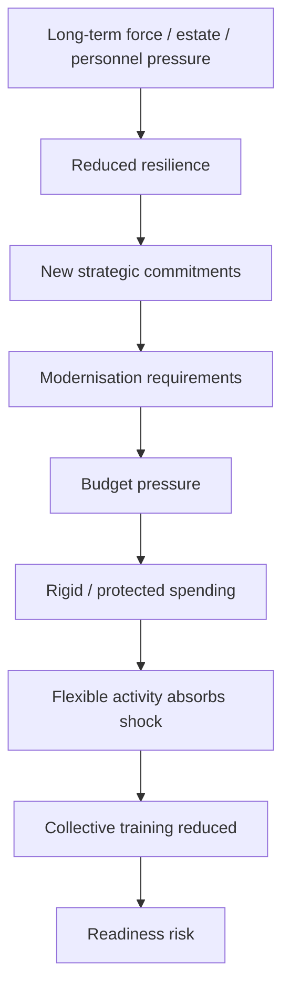

# 🧠 Assessment And Differential
**First created:** 2026-09-07 | **Last updated:** 2026-09-07  
*A provisional systemic diagnosis of the British Army collective-training problem, testing competing explanations before assigning responsibility.*

---

## 🧠 Orientation

The presenting complaint is now reasonably clear.

Britain says it is moving towards:

> **warfighting readiness**

while the Army has reportedly been required to reduce or suspend some collective-training activity in order to make approximately £30 million of savings.

That is a genuine contradiction worth investigating.

It is not yet a complete diagnosis.

The wrong move now would be to choose whichever institution one already dislikes and write:

> **Aha. It was them.**

Possible villains are plentiful:

- Treasury;
- ministers;
- Army Command;
- MOD finance;
- procurement;
- previous governments;
- modernisation programmes;
- contractors;
- strategic overreach;
- bureaucracy.

Several may have contributed.

None should be convicted because they were standing nearest the budget when the music stopped.

---

## 🩻 Provisional assessment

The evidence currently supports a cautious systemic assessment:

> **Britain appears to have a Defence system in which strategic ambition, operational commitments, inherited programmes, personnel capacity, estate, modernisation and available near-term spending are not yet sufficiently aligned to protect all of the force-generation activity that current policy says is necessary for warfighting readiness.**

The reported £30 million training reduction may therefore be:

- the immediate problem;
- a symptom of a deeper affordability problem;
- a symptom of budget architecture;
- evidence of accumulated hollowing-out;
- a rational temporary prioritisation;
- an unintended consequence of modernisation;
- the result of competing commitments;
- evidence of poor information flow;
- evidence of poor prioritisation;
- or some combination of these.

This is a **multifactorial differential**.

That matters.

Because treating a systems problem as one bad decision by one person is an excellent way to replace the person and preserve the system.

---

## 🧬 The working differential

At present, seven explanations deserve serious testing:

1. **Acute affordability pressure**
2. **Budget architecture and lock-in**
3. **Modernisation transition costs**
4. **Accumulated hollowing-out**
5. **Competing commitments**
6. **Poor feedback and information transmission**
7. **Bad prioritisation**

These are not mutually exclusive.

Indeed, the most plausible eventual diagnosis may be a chain:

---

## 🧩 Recovery status

The supplied source ends during the opening differential diagram. The remainder of the drafted node was not present in the uploaded file, so this house-style pass does not reconstruct it from memory or outside material. See [`GAP_ANALYSIS.md`](./GAP_ANALYSIS.md).

---

## 🌌 Constellations
🧠 🪖 💷 ⚙️ 🔭 — differential diagnosis; training; affordability; force generation; institutional feedback.

---

## ✨ Stardust
british defence, army training, differential diagnosis, defence affordability, force generation, readiness, institutional feedback

---

## 🏮 Footer

*Assessment And Differential* is a recovery-incomplete node of the **Polaris Protocol**.  
The surviving fragment is preserved without silently inventing the missing analysis.

> 📡 Cross-references:
>
> - [🔬 Tests And Investigations](./🔬_tests_and_investigations.md) — *evidence required before diagnosis*  
> - [🩺 Presenting Complaint](./🩺_presenting_complaint.md) — *the immediate complaint being assessed*  
> - [🧩 Gap Analysis](./GAP_ANALYSIS.md) — *recovery and coverage status*  
>  
> 🏮 Return To:
>
> - [🪖 Training Debrief](./README.md) — *1up*  
> - [🌊 Playing Defence](../README.md) — *2up*  
> - [📲 Press Matters](../../README.md) — *3up*  
> - [🌓 In The Moment](../../../README.md) — *4up*  
> - [🌌 Polaris Protocol — Root](../../../../README.md) — *root*

*Survivor authorship is sovereign. Containment is never neutral.*

_Last updated: 2026-09-07_