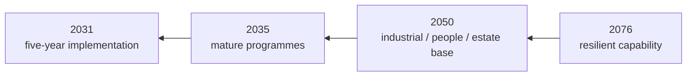

# 🧾 The Blank Cheque Exercise
**First created:** 2026-09-07 | **Last updated:** 2026-09-07  
*A deliberately unrealistic planning exercise: temporarily remove money, politics and institutional embarrassment as constraints, ask what capability each service would actually build, then put the constraints back in and make the trade-offs explicit.*

---

## 🧾 Orientation

Defence planning usually begins inside constraints.

There is:

- an existing force;
- an existing estate;
- existing contracts;
- existing people;
- existing doctrine;
- an existing budget;
- existing political commitments;
- things ministers have already announced;
- things nobody particularly wants to admit were a bad idea.

That is reality.

But it creates a cognitive problem.

If an institution spends long enough asking:

> **What can we afford to do with what we already have?**

it can gradually stop asking:

> **What would we actually need to do the job properly?**

The blank cheque exercise temporarily reverses the sequence.

Not because Britain possesses infinite money.

It does not.

Not because every military wish should be granted.

Absolutely not.

The purpose is diagnostic.

> **First recover the requirement.  
> Then apply the constraint.**

---

# 🎯 1. The question

Ask each service:

> **If money, politics and institutional embarrassment disappeared for one planning cycle, what force would you build to perform the tasks Britain currently expects of you?**

Then ask:

> **What would you stop doing?**

> **What would you build differently?**

> **What would you ask another service to provide?**

> **What do you currently lack but have normalised not having?**

> **What would you never buy again?**

That last question may be especially useful.

---

# 🧠 2. This is not a spending bid

The exercise should not begin:

> Dear Army, Navy and RAF, please submit your Christmas lists.

That would produce predictable results.

The brief must instead begin with:

> **functions.**

For each service:

```text id="f4z3rm"
strategic obligation
→ required military function
→ force required
→ force-generation system
→ training
→ sustainment
→ resilience
→ cost
```

The blank cheque applies to:

> **finding the requirement.**

Not to:

> automatically approving the resulting bill.

---

# 🧮 3. Why temporarily remove money?

Because price affects imagination.

If participants already know:

> Treasury will never fund that,

they may unconsciously exclude the option before analysing it.

That can be rational in ordinary planning.

It is unhelpful during diagnosis.

Suppose the actual requirement is:

> ten units.

But everyone knows the likely settlement affords six.

Planning may quietly become:

> How should we configure six?

The blank cheque exercise first asks:

> **Why did we think ten?**

Only then:

> **What happens if we fund six?**

That preserves the capability consequence.

---

# 🪞 4. Why temporarily remove embarrassment?

Because institutions accumulate sunk decisions.

People may be reluctant to say:

- this programme should stop;
- that assumption failed;
- we bought the wrong thing;
- this command structure does not help;
- another service should own this;
- we need more people than previous plans admitted;
- we need fewer of this platform;
- we should reverse a reform.

Therefore, for the exercise:

> **nobody loses face for identifying a better answer.**

A decision can have been reasonable when made and wrong now.

A decision can also simply have been wrong.

The future force does not care which makes everyone feel nicer.

---

# 🏛️ 5. Why temporarily remove politics?

Because some capability questions become distorted by:

- constituency interests;
- party commitments;
- prestige;
- industrial announcements;
- service identity;
- symbolic programmes.

Those factors eventually matter.

They are legitimate parts of government.

But first ask:

> **What would the military requirement look like if nobody had already promised the answer?**

Then politics can decide whether to fund it.

That produces an actual political decision rather than a requirement pre-shaped to avoid one.

---

# 🔭 6. Start in 2076

The exercise should not begin with:

> What force do we want next year?

Begin much further out.

Ask:

> **What capabilities might Britain need to preserve across the next fifty years, even though we cannot know the exact wars, technologies or alliances of 2076?**

Do not attempt to predict the exact force structure.

That would be fantasy.

Instead identify enduring functions:

- detect;
- decide;
- communicate;
- deter;
- fight;
- move;
- supply;
- repair;
- protect;
- treat;
- replace;
- mobilise;
- learn;
- regenerate.

Those are much more durable than:

> exactly this model of vehicle.

---

# ⏳ 7. Then work backwards

Use four clocks.

### 2076

What must Britain remain capable of regenerating?

### 2050

What workforce, industry, estate and infrastructure must exist?

### 2035

What programmes and skills must already be mature?

### 2031

What needs fixing in the next five years?



This prevents the five-year plan becoming:

> **whatever can be squeezed through the next spending review.**

---

# 🪖 8. Ask the Army

The Army should be asked to design the force it believes is required to meet the strategic tasks government gives it.

Not:

> the largest Army imaginable.

The Army submission should cover:

### Force structure

- formations;
- regulars;
- reserves;
- specialist personnel;
- mobilisation framework.

### Collective training

- minimum exercise frequency;
- brigade/division/corps requirements;
- live firing;
- urban training;
- electronic warfare;
- drones;
- logistics;
- command;
- allied exercises.

### Instructor system

- permanent instructor establishment;
- high-readiness instructor reserve;
- operational currency;
- career incentives.

### Equipment

- operational fleets;
- training fleets;
- spares;
- ammunition;
- maintenance;
- simulation.

### Estate

- manoeuvre areas;
- ranges;
- urban environments;
- accommodation;
- mobilisation capacity.

### Sustainment

- logistics;
- repair;
- medical;
- casualty replacement;
- industrial support.

Then ask:

> **What does the Army currently pretend
