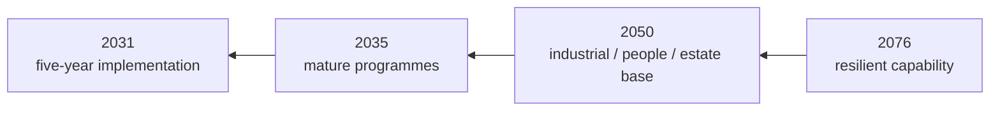
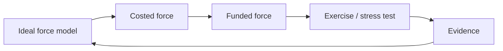

# 🧾 The Blank Cheque Exercise
**First created:** 2026-09-07 | **Last updated:** 2026-09-07  
*A deliberately unrealistic planning exercise: temporarily remove money, politics and institutional embarrassment as constraints, ask what capability each service would actually build, then put the constraints back in and make the trade-offs explicit.*

---

## 🧾 Orientation

Defence planning usually begins inside constraints.

There is:

- an existing force;
- an existing estate;
- existing contracts;
- existing people;
- existing doctrine;
- an existing budget;
- existing political commitments;
- things ministers have already announced;
- things nobody particularly wants to admit were a bad idea.

That is reality.

But it creates a cognitive problem.

If an institution spends long enough asking:

> **What can we afford to do with what we already have?**

it can gradually stop asking:

> **What would we actually need to do the job properly?**

The blank cheque exercise temporarily reverses the sequence.

Not because Britain possesses infinite money.

It does not.

Not because every military wish should be granted.

Absolutely not.

The purpose is diagnostic.

> **First recover the requirement.  
> Then apply the constraint.**

---

# 🎯 1. The question

Ask each service:

> **If money, politics and institutional embarrassment disappeared for one planning cycle, what force would you build to perform the tasks Britain currently expects of you?**

Then ask:

> **What would you stop doing?**

> **What would you build differently?**

> **What would you ask another service to provide?**

> **What do you currently lack but have normalised not having?**

> **What would you never buy again?**

That last question may be especially useful.

---

# 🧠 2. This is not a spending bid

The exercise should not begin:

> Dear Army, Navy and RAF, please submit your Christmas lists.

That would produce predictable results.

The brief must instead begin with:

> **functions.**

For each service:

```text id="f4z3rm"
strategic obligation
→ required military function
→ force required
→ force-generation system
→ training
→ sustainment
→ resilience
→ cost
```

The blank cheque applies to:

> **finding the requirement.**

Not to:

> automatically approving the resulting bill.

---

# 🧮 3. Why temporarily remove money?

Because price affects imagination.

If participants already know:

> Treasury will never fund that,

they may unconsciously exclude the option before analysing it.

That can be rational in ordinary planning.

It is unhelpful during diagnosis.

Suppose the actual requirement is:

> ten units.

But everyone knows the likely settlement affords six.

Planning may quietly become:

> How should we configure six?

The blank cheque exercise first asks:

> **Why did we think ten?**

Only then:

> **What happens if we fund six?**

That preserves the capability consequence.

---

# 🪞 4. Why temporarily remove embarrassment?

Because institutions accumulate sunk decisions.

People may be reluctant to say:

- this programme should stop;
- that assumption failed;
- we bought the wrong thing;
- this command structure does not help;
- another service should own this;
- we need more people than previous plans admitted;
- we need fewer of this platform;
- we should reverse a reform.

Therefore, for the exercise:

> **nobody loses face for identifying a better answer.**

A decision can have been reasonable when made and wrong now.

A decision can also simply have been wrong.

The future force does not care which makes everyone feel nicer.

---

# 🏛️ 5. Why temporarily remove politics?

Because some capability questions become distorted by:

- constituency interests;
- party commitments;
- prestige;
- industrial announcements;
- service identity;
- symbolic programmes.

Those factors eventually matter.

They are legitimate parts of government.

But first ask:

> **What would the military requirement look like if nobody had already promised the answer?**

Then politics can decide whether to fund it.

That produces an actual political decision rather than a requirement pre-shaped to avoid one.

---

# 🔭 6. Start in 2076

The exercise should not begin with:

> What force do we want next year?

Begin much further out.

Ask:

> **What capabilities might Britain need to preserve across the next fifty years, even though we cannot know the exact wars, technologies or alliances of 2076?**

Do not attempt to predict the exact force structure.

That would be fantasy.

Instead identify enduring functions:

- detect;
- decide;
- communicate;
- deter;
- fight;
- move;
- supply;
- repair;
- protect;
- treat;
- replace;
- mobilise;
- learn;
- regenerate.

Those are much more durable than:

> exactly this model of vehicle.

---

# ⏳ 7. Then work backwards

Use four clocks.

### 2076

What must Britain remain capable of regenerating?

### 2050

What workforce, industry, estate and infrastructure must exist?

### 2035

What programmes and skills must already be mature?

### 2031

What needs fixing in the next five years?



This prevents the five-year plan becoming:

> **whatever can be squeezed through the next spending review.**

---

# 🪖 8. Ask the Army

The Army should be asked to design the force it believes is required to meet the strategic tasks government gives it.

Not:

> the largest Army imaginable.

The Army submission should cover:

### Force structure

- formations;
- regulars;
- reserves;
- specialist personnel;
- mobilisation framework.

### Collective training

- minimum exercise frequency;
- brigade/division/corps requirements;
- live firing;
- urban training;
- electronic warfare;
- drones;
- logistics;
- command;
- allied exercises.

### Instructor system

- permanent instructor establishment;
- high-readiness instructor reserve;
- operational currency;
- career incentives.

### Equipment

- operational fleets;
- training fleets;
- spares;
- ammunition;
- maintenance;
- simulation.

### Estate

- manoeuvre areas;
- ranges;
- urban environments;
- accommodation;
- mobilisation capacity.

### Sustainment

- logistics;
- repair;
- medical;
- casualty replacement;
- industrial support.

Then ask:

> **What does the Army currently pretend it can do which this force would reveal it cannot reliably sustain?**

---

# ⚓ 9. Ask the Royal Navy

The Royal Navy submission should similarly begin with functions.

For example:

- continuous deterrence;
- carrier operations;
- anti-submarine warfare;
- surface warfare;
- mine warfare;
- maritime security;
- amphibious activity;
- logistics;
- undersea infrastructure;
- seabed awareness;
- allied integration.

Then ask:

> **What fleet, people, training and maintenance system makes those functions repeatable rather than occasionally demonstrable?**

Especially:

> **How much fleet availability is required simultaneously?**

Ships existing on paper are not the same as ships available.

---

# ✈️ 10. Ask the RAF

For the RAF:

- air defence;
- combat air;
- intelligence and surveillance;
- transport;
- tanking;
- training;
- space;
- command and control;
- electronic warfare;
- remotely piloted and autonomous systems;
- support to land and maritime forces.

Ask:

> **What sortie generation rate is required?**

> **What maintenance depth supports it?**

> **What personnel bottlenecks constrain it?**

> **What training airspace and infrastructure are needed?**

Again:

platform number is not enough.

The function is:

> **usable air power over time.**

---

# 🛰️ 11. Ask Strategic Command too

The three-service framing is useful.

It is not sufficient.

Strategic Command and relevant joint functions need their own submission covering:

- intelligence;
- cyber;
- space;
- digital infrastructure;
- communications;
- medical services;
- logistics;
- doctrine;
- education;
- joint command;
- data.

Otherwise the exercise risks reproducing the same service silos it is supposed to examine.

---

# 🤝 12. Then make them ask each other for things

This is where it becomes fun.

Ask the Army:

> **What do you need the Navy to provide?**

> **What do you need the RAF to provide?**

Ask the Navy:

> **What do you need the Army to provide?**

> **What do you need the RAF to provide?**

Ask the RAF the same.

Then compare answers.

You may discover that:

> Service A believes Service B provides X.

While:

> Service B does not believe X is one of its funded priorities.

Excellent.

You have found a strategic dependency before war did.

---

# 🧩 13. Build the dependency matrix

For example:

| Required function | Army | Navy | RAF | Strategic Command | Ally | Civilian system |
|---|---|---|---|---|---|---|
| Air defence | user | contributor | lead | C2 | NATO | industry |
| Logistics | lead land | maritime | airlift | joint | allies | commercial |
| Medical evacuation | land | maritime | air | medical | allies | NHS |
| Satellite services | user | user | user | lead | allies | industry |
| Cyber defence | user | user | user | lead | allies | industry |

The exact table should come from Defence.

The point is to expose:

> **who believes whom to be responsible for what.**

---

# 🧠 14. Compare the answers before reconciling them

Do not immediately force consensus.

If Army says:

> we need persistent RAF support for X

and RAF says:

> X is only available under particular conditions,

preserve the disagreement.

If Navy says:

> we need Army capacity Y

and Army says:

> Y no longer exists at scale,

preserve that too.

Contradiction is information.

The blank cheque exercise is partly designed to find:

> **incompatible assumptions hidden by normal planning.**

---

# 🪟 15. Publish disagreement where safe

A public version might say:

> Army assessed requirement X as high priority.

> RAF assessed the same function as lower priority because of constraint Y.

> Joint planning subsequently adopted option Z.

That is not institutional weakness.

It shows:

> **a decision happened.**

The alternative—pretending everybody independently wanted precisely the final compromise—is less credible.

---

# 🔀 16. Ask what should actually be joint

For every capability appearing in multiple submissions, ask:

> **Does separate service ownership improve the function?**

Possible candidates for greater jointness may include:

- logistics;
- medical;
- communications;
- cyber;
- intelligence;
- training infrastructure;
- simulation;
- procurement support;
- education;
- data.

But:

> **joint is not automatically better.**

Centralisation can create:

- bottlenecks;
- abstraction;
- loss of service expertise;
- single points of failure.

The test is functional.

---

# 🧱 17. Redundancy may be deliberate

Suppose all three services maintain apparently similar capability.

An efficiency review may say:

> consolidate.

Maybe.

But duplication can provide:

- surge;
- service-specific expertise;
- resilience;
- alternative pathways.

Therefore distinguish:

### accidental duplication

from:

### designed redundancy.

Do not eliminate resilience because two spreadsheet rows look similar.

---

# 🛠️ 18. Ask what should **not** be joint

This matters equally.

Which capabilities require:

- deep service-specific knowledge;
- different operating cultures;
- separate technical systems;
- independent command;
- redundancy?

The blank cheque exercise should be allowed to conclude:

> **centralising this would make it worse.**

Integration by design is not centralisation by reflex.

---

# 🪖 19. Design the ideal training system separately

Each service should submit:

> **its desired training architecture**

before receiving its desired force.

Ask:

- what skills require live training?
- what can be synthetic?
- what requires both?
- what scale?
- how often?
- what decay rate?
- what instructor numbers?
- what estate?
- what allied participation?
- what training equipment?
- what ammunition?
- what validation?

Then cost it.

This avoids training becoming:

> **whatever money remains after platforms.**

---

# 🧑‍🏫 20. Ask instructors separately

Do not ask only senior command what ideal training requires.

Ask:

- instructors;
- training schools;
- exercise planners;
- range staff;
- doctrine staff.

Ask:

> **What would you change if you did not need permission to pretend the current system is adequate?**

That wording may produce useful answers.

---

# 🪖 21. Ask junior personnel separately too

The exercise should contain structured input from people who:

- use the equipment;
- attend the exercises;
- live in the accommodation;
- perform maintenance;
- move supplies.

Not because junior personnel possess the strategic picture.

They do not.

Because they possess information senior planners may not.

The system needs both.

---

# 🛠️ 22. Ask engineers

Engineers should be asked:

> **What equipment would you never design this way again?**

> **Which maintenance burden is avoidable?**

> **Which availability assumptions are unrealistic?**

> **What would make this system easier to repair in war?**

This may produce more useful future-force insight than:

> which shiny platform should we buy next?

---

# 🩺 23. Ask Defence Medical Services

Their blank-cheque submission should include:

- prevention;
- battlefield medicine;
- evacuation;
- surgery;
- rehabilitation;
- prosthetics;
- mental health;
- occupational health;
- long-term follow-up;
- mass-casualty capacity.

And:

> **What casualty assumptions does the proposed force imply?**

A force design which assumes casualties but does not design the medical system to absorb them is incomplete.

---

# 🦿 24. Ask rehabilitation specialists

A future-force exercise should ask:

> **If we are imagining the weapons of 2050, why are we not imagining the rehabilitation technology of 2050?**

Potential areas include:

- advanced prosthetics;
- neuroprosthetics;
- assistive AI;
- rehabilitation robotics;
- pain technology;
- exoskeletons;
- adaptive equipment.

Defence technology should not stop at:

> making humans more capable before injury.

It should include:

> **restoring capability afterwards.**

---

# 🏭 25. Ask industry what can actually scale

Now invite industry.

But do not ask:

> What would you like government to buy?

Ask:

> **What can Britain manufacture, repair and replenish at required wartime rates?**

Then:

- how long to expand?
- what skills are scarce?
- which components are imported?
- where are single suppliers?
- what tooling disappeared?
- what would require allied support?
- what capacity can remain dormant economically?

The glamorous question is:

> what can we invent?

The strategically useful question may be:

> **how many can we make again next month?**

---

# 🧰 26. Ask maintainers before buying more things

A platform which cannot be maintained is a temporary capability.

Therefore:

> **What would you change about the force if through-life maintenance were designed before procurement?**

This may alter:

- fleet sizes;
- platform complexity;
- commonality;
- spares;
- training;
- supplier choice.

The blank cheque is for:

> sustainable capability.

Not museum inventory.

---

# 🗺️ 27. Ask the estate

Well.

Ask the people responsible for it.

For every force proposal:

> **Where does it live?**

> **Where does it train?**

> **Where does it repair?**

> **Where does it mobilise?**

> **Where do its families live?**

An ideal force requiring estate which no longer exists is not an ideal force.

It is PowerPoint.

---

# 🏠 28. Housing belongs in force design

If the proposed personnel model requires:

- higher retention;
- specialist careers;
- stable families;

then accommodation matters.

Do not design:

> ideal workforce

and then hand housing to:

> miscellaneous administration.

The two variables interact.

---

# 👨‍👩‍👧 29. Ask families indirectly

Not:

> What weapons system would you like?

Probably not.

Ask what currently creates avoidable pressure around:

- posting;
- childcare;
- housing;
- schooling;
- employment;
- healthcare;
- geographic movement.

If the future force depends on retaining skilled personnel for fifteen years:

family policy is part of the architecture.

---

# 🎓 30. Ask where the workforce comes from

The ideal force requires:

- engineers;
- doctors;
- nurses;
- linguists;
- cyber specialists;
- nuclear workers;
- mechanics;
- pilots;
- software engineers;
- logisticians;
- intelligence analysts.

Then ask:

> **Where does Britain produce these people?**

The answer may involve:

- schools;
- colleges;
- apprenticeships;
- universities;
- industry;
- reserves.

Defence workforce planning therefore escapes MOD.

That is not scope creep.

It is where the people come from.

---

# 🧪 31. The “Tuesday roster” test

For every proposed capability:

> **Who is doing it on an ordinary Tuesday?**

Not at mobilisation.

Not during a press launch.

Tuesday.

Ask:

- who is on shift?
- who is resting?
- who maintains it?
- who trains them?
- who covers sickness?
- who handles leave?
- who supplies it?
- who repairs it?
- who does the job during another crisis?

If the concept only works at:

> **100% personnel availability forever**

it does not work.

---

# 🌧️ 32. Then make Tuesday unpleasant

Now add:

- bad weather;
- maintenance failure;
- sickness;
- cyber disruption;
- second operational commitment.

Ask again.

A force should possess:

> **slack.**

If every resource is allocated under normal conditions:

the first disruption creates failure.

---

# 🎲 33. Build alternative futures

Do not design one ideal war.

Run the blank-cheque force against several plausible futures.

For example:

### Future A

High-intensity NATO land war.

### Future B

Sustained maritime competition.

### Future C

Major cyber and infrastructure disruption.

### Future D

Alliance fragmentation.

### Future E

Simultaneous domestic emergency and overseas commitment.

### Future F

Something nobody predicted particularly well.

Which investments survive across several?

Those deserve particular attention.

---

# 🧠 34. Hunt assumptions

Every submission should contain:

> **Assumptions on which this force depends.**

For example:

- warning time;
- allied participation;
- air superiority;
- supply-chain availability;
- recruitment;
- mobilisation;
- casualty rates;
- industrial expansion;
- space access;
- secure communications.

Then ask:

> **What if this assumption is wrong?**

That is where resilience begins.

---

# 📉 35. Require a failure version

Each service should submit:

> **How does this force fail?**

Specifically:

- first bottleneck;
- first depleted stock;
- first personnel shortage;
- first maintenance constraint;
- first estate constraint;
- first allied dependency.

A plan whose authors cannot describe failure has not been stress-tested.

---

# 🪞 36. Ask what they would stop

This may be the hardest section.

Blank cheque does not mean:

> keep everything plus more.

Ask each service:

> **What current activity, capability or programme would you willingly stop if sunk cost and embarrassment disappeared?**

Possible answers might include:

- obsolete procedures;
- duplicative systems;
- poor contracts;
- legacy equipment;
- unnecessary administration.

A genuine blank cheque exercise must permit deletion.

Otherwise it is simply expansion planning.

---

# 🧯 37. Ask what the institution is firefighting

Another question:

> **What problem consumes disproportionate senior attention because the underlying system never gets fixed?**

Then ask:

> What would eliminate the recurrence?

This surfaces chronic maintenance problems hidden by competent improvisation.

The objective is:

> fewer emergencies;

not:

> better emergency meetings.

---

# 🔄 38. Ask what must be unlearned

A future force cannot only add capability.

It must identify:

- doctrine tied to past wars;
- processes built around old technology;
- assumptions preserved by habit;
- bureaucracy created for risks which changed.

Ask:

> **What do we need to stop teaching?**

That belongs inside future-force design.

---

# 🧠 39. Invite internal disagreement deliberately

Do not request:

> one service-approved answer.

First collect separate assessments from:

- senior leadership;
- operators;
- instructors;
- engineers;
- logistics;
- medical;
- junior personnel.

Then compare them.

Consensus created before evidence reaches the table is not consensus.

It is compression.

---

# 🗳️ 40. Minority reports are allowed

If a significant professional minority believes:

> Option B is better,

record it.

The final submission can still choose Option A.

But preserve:

- why B was rejected;
- what assumptions make A superior;
- what evidence would cause reconsideration.

This makes future adaptation dramatically easier.

---

# 🔭 41. The ideal force needs an ideal readiness state

Do not merely specify:

> numbers of things.

Specify:

> **what they can do.**

For each major force element:

- readiness state;
- deployment time;
- sustainment period;
- training state;
- equipment availability;
- personnel fill;
- regeneration time.

That prevents:

> force structure

from becoming a catalogue.

---

# ⏱️ 42. Add regeneration

Now ask:

> **After the first force is used, how quickly can Britain produce the second?**

A force which can deploy once but cannot:

- replace casualties;
- replenish ammunition;
- repair platforms;
- train replacements;

is not resilient.

The blank cheque force must include:

> **regeneration architecture.**

---

# 🪖 43. Mobilisation is not “find more people”

The mobilisation submission should specify:

- trainers;
- training sites;
- equipment;
- accommodation;
- medical;
- command;
- transport;
- administrative capacity.

RUSI's *Preparing to Break Glass* argument matters here.

People only become usable military capacity after a force-generation process.

Therefore mobilisation planning must ask:

> **How quickly can Britain turn additional humans into coherent capability?**

---

# 💷 44. Now calculate the terrifying number

Only after all of this:

> **cost the ideal system.**

Include:

- capital;
- operating expenditure;
- people;
- training;
- maintenance;
- estate;
- medical;
- family support;
- industry;
- stockpiles;
- regeneration;
- contingencies.

Do not hide lifecycle cost behind purchase price.

The number may be politically impossible.

Good.

Now Britain knows the actual gap.

---

# 🧮 45. Produce three cost lines

For every major capability proposal:

### Ideal

What professionals would choose without affordability constraint.

### Minimum credible

The lowest-cost model still capable of performing the function with tolerable risk.

### Failure threshold

Below this point, stop pretending the function is reliably available.

That final line is crucial.

---

# 🛡️ 46. Minimum credible does not mean cheapest imaginable

A useful minimum credible force should still have:

- personnel;
- training;
- equipment;
- sustainment;
- maintenance;
- recovery;
- resilience.

If the cheaper option achieves the mission only if:

> nothing breaks;

> nobody leaves;

> allies are always available;

> the first plan works;

then it is not minimum credible.

It is:

> **minimum optimistic.**

---

# 🧠 47. Show what each reduction buys

Now begin reducing the ideal force.

For every saving:

```text id="zoq7b3"
£X saved
→ capability reduced
→ readiness effect
→ resilience effect
→ recovery time
→ accepted risk
```

This is the exact translation missing from many spending discussions.

The political question can then become:

> **Is that reduction worth £X?**

Rather than:

> How do we get the budget number down?

---

# 🪜 48. Build capability ladders

For example:

### Level A — ideal

Full function plus resilience.

### Level B — strong

Full function, less surge.

### Level C — minimum credible

Core function, limited redundancy.

### Level D — fragile

Function available only under favourable assumptions.

### Level E — nominal

Capability exists principally on paper.

Now political leaders can see:

> **where each funding choice places the force.**

---

# 💰 49. Put Treasury in the second room

Treasury should absolutely participate.

Just not first.

Room one:

> **What is required?**

Room two:

> **What can the state afford?**

Then put Defence and Treasury together.

The useful negotiation becomes:

> we cannot afford the ideal;

> here is the minimum credible;

> here are the risks below it;

> here are alternative profiles.

That is much healthier than Defence guessing Treasury's answer before submitting the requirement.

---

# 🏦 50. Treasury should challenge cost, not invent military need

Treasury should ask:

- why does this cost so much?
- what assumptions drive the cost?
- what cheaper design achieves the same function?
- what can be reprofiled?
- what is duplicated?
- what is the opportunity cost?

Excellent questions.

But:

> **financial constraint should not silently redefine the military requirement.**

If government chooses less than the requirement:

record the difference as:

> accepted risk.

Not:

> revised requirement,

unless strategy genuinely changed.

---

# 🏛️ 51. Ministers choose the trade-off

At the end:

civilian government decides.

That is the point.


The military should not decide how much tax Britain raises.

Treasury should not decide what brigade competence means.

Each part of government should contribute its actual expertise.

---

# 🧾 52. Parliament should see the bounded version

A useful public output could show:

- strategic functions;
- ideal broad architecture;
- minimum credible option;
- total cost bands;
- major trade-offs;
- assumptions;
- government choice.

Remove:

- exploitable vulnerabilities;
- detailed readiness;
- classified capabilities.

That would give Parliament something much better than:

> **Defence needs more money**

versus:

> **Defence already gets lots of money.**

Both can be true without answering the actual question.

---

# 🧠 53. The embarrassment amnesty

For the exercise to work, participants need temporary permission to say:

> **We would not do that again.**

That should not automatically trigger:

> whose fault was it?

Accountability matters.

But diagnosis first.

Otherwise participants will defend inherited decisions rather than design the future system.

Call it:

> **the embarrassment amnesty.**

Not legal immunity.

Not freedom from later scrutiny.

Just enough institutional safety to tell the truth about the architecture.

---

# 🛒 54. The procurement confession booth

Ask each service:

> **Which current programme would you redesign if no minister, chief, contractor or newspaper knew who originally supported it?**

That question is probably worth several billion pounds by itself.

---

# 🧑‍🏫 55. The training confession booth

Ask:

> **Which exercises exist because they are genuinely useful?**

> **Which exist because we have always done them?**

> **Which training would you add immediately?**

> **Which synthetic training actually replaces physical activity?**

> **Which does not?**

Then design the training system backwards from competence.

---

# ⚙️ 56. The bureaucracy confession booth

Ask:

> **Which process would you delete tomorrow if you could?**

Then ask:

> Why does it exist?

Possible answer:

> important safety control.

Keep it.

Possible answer:

> nobody remembers.

Investigate.

Possible answer:

> previous incident.

Ask whether current control remains proportionate.

The blank cheque is also permission to remove institutional sludge.

---

# 🧑‍🔧 57. Find the people you dislike who are right

This exercise should deliberately include:

> **Who is extremely good at this whom you personally find irritating?**

Call them.

A serious institutional reset cannot depend upon:

> everyone enjoying each other's company.

The useful person may be:

- retired;
- politically inconvenient;
- from another service;
- academically annoying;
- historically critical.

Fine.

Competence first.

---

# 🧠 58. Professional humility is data acquisition

Leadership humility here is not:

> performative niceness.

It is:

> **actively searching for information your own preferences might exclude.**

Ask:

> Who told us this before?

> Who disagreed?

> Who was right?

> Who understands the bit we keep failing at?

That is institutional learning.

---

# 📜 59. Re-open previous reviews

Before finalising the ideal force, take:

- Strategic Defence Reviews;
- Integrated Reviews;
- Defence Command Papers;
- NAO reports;
- parliamentary committee recommendations;
- operational lessons.

For each relevant recommendation:

```text id="pk0fiz"
recommended
→ funded?
→ implemented?
→ worked?
→ retained?
→ abandoned?
→ why?
```

Do not pay to rediscover the same requirement again.

---

# 🔬 60. Test the ideal force against history

Ask whether the proposed architecture would have handled:

- Falklands;
- Balkans;
- Afghanistan;
- Iraq;
- Ukraine support.

Not because future wars repeat those cases.

Because they reveal different stressors.

Then ask:

> **Where would our ideal force still have failed?**

That protects against self-congratulation.

---

# 🔭 61. Test it against things which did not happen

Preparedness is also about unrealised contingencies.

Ask:

- what if warning time were shorter?
- what if allies were delayed?
- what if a supplier failed?
- what if casualties were higher?
- what if communications were degraded?

The ideal system should not depend on:

> history behaving politely.

---

# 🌍 62. Ask allies for their view

Once Britain has drafted its desired architecture:

ask close allies:

> **What do you assume Britain will provide?**

This could be illuminating.

Compare:

> Britain's self-assessment

with:

> NATO/allied expectations.

Any large discrepancy deserves attention.

---

# 🤝 63. Ask what Britain assumes allies will provide

Then reverse it.

For every capability not funded nationally:

> **Which ally fills the gap?**

Then:

- have they agreed?
- can they provide it simultaneously?
- what happens if they need it themselves?
- what if access is politically constrained?

Alliance planning should distinguish:

> deliberate interdependence

from:

> **capability missing, therefore ally presumably.**

---

# 🧱 64. Ask where redundancy matters most

A useful blank-cheque force probably does not maximise everything.

It places spare capacity where failure would be especially damaging.

Possible areas include:

- communications;
- logistics;
- instructors;
- medical;
- suppliers;
- repair;
- command;
- critical specialists.

The question is:

> **Where is the cheapest extra capacity disproportionately valuable under stress?**

That is resilience engineering.

---

# 📉 65. Calculate option value

Some capacity may appear underused in peacetime.

Ask what option it preserves.

For example:

> spare training area

may preserve mobilisation capacity.

> additional instructor cadre

may preserve expansion speed.

> second supplier

may preserve industrial continuity.

Do not price only:

> current utilisation.

Price:

> **what future option disappears if the capacity goes.**

---

# 📊 66. Then build the five-year plan

After the fifty-year architecture and affordability negotiation:

produce the boring bit.

### Year 1

Stop avoidable degradation.

### Year 2

Fix immediate people/training/maintenance bottlenecks.

### Year 3

Expand estate/instructor/industrial capacity.

### Year 4

Validate new force-generation model.

### Year 5

Exercise the integrated system at scale.

The exact programme comes later.

But the principle is:

> **future imagination must end in an executable calendar.**

---

# 🧭 67. Every programme needs an owner

For each major intervention:

- owner;
- budget;
- start;
- milestone;
- success criterion;
- review point.

Otherwise the blank cheque produces:

> a gorgeous vision document.

Britain has several of those already.

---

# 🎯 68. OKRs before KPIs

The implementation should begin with objectives.

For example:

### Objective

> Generate a brigade capable of performing specified NATO functions at required notice.

### Key results

- trained collective state achieved;
- equipment availability threshold;
- logistics validated;
- command exercised;
- allied integration validated;
- personnel fill achieved.

Then choose KPIs.

Do not let:

> 97% mandatory module completion

become proof that the brigade can do the thing.

---

# 🧪 69. Retest the design

The blank-cheque exercise should not happen once.

Its assumptions should be tested through:

- exercises;
- mobilisation trials;
- war games;
- industry tests;
- medical exercises;
- allied exercises.

Then update.



The blank cheque is part of the feedback machine.

---

# 🔁 70. Repeat after major shocks

Run the exercise again after:

- major war;
- transformative technology;
- alliance change;
- severe fiscal shock;
- major operational failure.

Not because the previous exercise was wasted.

Because the environment changed.

A useful strategy process must be allowed to update.

---

# 💷 71. What happens if the ideal is unaffordable?

Probably:

> **it will be.**

Then Britain has choices.

### Choice A

Spend more.

### Choice B

Reduce commitments.

### Choice C

Increase allied dependence.

### Choice D

Accept lower readiness.

### Choice E

Redesign the force.

### Choice F

Some combination.

What Britain should not do is:

> retain the commitments;

> fund less than the minimum credible system;

> and describe the resulting force as though nothing changed.

That is where strategic incoherence begins.

---

# 🧮 72. Strategy has to balance

The final equation is simple even when the arithmetic is not.

```text id="tzu4p2"
strategic obligations
≈
force
≈
force-generation capacity
≈
money
```

If one side moves:

another must move.

You cannot permanently preserve:

> maximum obligations

while reducing:

> people + training + equipment + estate + sustainment

and solve the mismatch with:

> **transformation.**

Technology can alter the equation.

It cannot repeal it.

---

# 🔭 73. The output is not “give Defence what it wants”

The purpose is to give ministers a better choice.

At the end government should be able to say:

> Defence professionals assess the ideal requirement as A.

> The minimum credible alternative is B.

> Government is funding C.

> C accepts risks X and Y because of competing national priorities.

That is democratic civilian control.

It is much more meaningful than:

> **Defence has been fully funded to meet its requirements**

if the requirement was pre-compressed until it matched the funding.

---

# 🪟 74. Publish enough to make the choice visible

The public should not receive the detailed military plan.

It can receive:

```text id="vuz6kc"
strategic requirement
→ broad professional assessment
→ affordable alternatives
→ government choice
→ accepted trade-off
```

That would allow:

- Parliament;
- researchers;
- voters;

to understand what was actually chosen.

Bounded transparency can preserve security without pretending no trade-off exists.

---

# 🪖 75. The £30 million counterfactual

The current training dispute gives us a tiny version of the blank-cheque test.

Ask the Army:

> **If £30 million appeared tomorrow with no strings attached, what training would you buy back?**

Then ask:

> **What would you still not restore?**

That distinguishes:

> affordability-driven loss

from:

> genuine training reform.

Sometimes a deliberately unrealistic question produces the cleanest real-world answer.

---

# 🧠 76. The deeper reason for doing this

Fifteen years of:

- austerity;
- reductions;
- programme overruns;
- crisis response;
- recruitment problems;
- estate pressure;

can reshape institutional imagination.

People become excellent at:

> coping.

That can make:

> **what would good actually look like?**

surprisingly difficult to answer.

The blank cheque is permission to remember that:

> surviving constraint

and:

> designing the best system

are different intellectual exercises.

Britain needs both.

---

# 🧾 The exercise brief

Each service and major joint function should answer:

1. What strategic functions do you believe Britain requires you to perform?
2. What force best performs them?
3. What force-generation system sustains that force?
4. What training system does it require?
5. What personnel model does it require?
6. What equipment and maintenance architecture?
7. What estate?
8. What medical and rehabilitation capability?
9. What industrial capacity?
10. What mobilisation system?
11. What do you require from other services?
12. What do you require from allies?
13. What should become joint?
14. What should remain separate?
15. Where is deliberate redundancy necessary?
16. Which existing capability would you stop?
17. Which inherited assumption would you discard?
18. Where do internal professional views disagree?
19. What is the ideal cost?
20. What is the minimum credible alternative?
21. At what point does the capability become nominal?
22. What risks arise below the ideal?
23. How quickly can losses be regenerated?
24. What should Britain do in the next five years?
25. What must remain possible in fifty?

Then:

> **show your working.**

---

# 🧠 The rules

### Rule 1

No capability is justified because:

> we have always had it.

### Rule 2

No capability is excluded because:

> Treasury would never pay for it.

Not yet.

### Rule 3

Nobody is punished inside the exercise for saying:

> the old decision was wrong.

### Rule 4

Every platform must connect to a function.

### Rule 5

Every force must connect to a training system.

### Rule 6

Every training system must connect to an estate and instructor model.

### Rule 7

Every operational system must connect to sustainment and medicine.

### Rule 8

Every capability depending on another service or ally must name the dependency.

### Rule 9

Every proposed saving must state the capability consequence.

### Rule 10

Every final compromise must state the residual risk.

---

# 🪄 The trick

The blank cheque never actually exists.

That is the point.

It is a temporary analytical instrument.

We remove the constraint just long enough to discover:

> **what the constraint is doing.**

Then we put:

- money;
- politics;
- industrial reality;
- alliance reality;

back into the model.

And now the country can make an informed choice.

---

# 🧈 Working rule

> **Do not begin by asking what Defence can afford.**

Begin:

> **What does Britain require?**

Then:

> **What produces it?**

Then:

> **What does that cost?**

Then:

> **What can Britain afford?**

Then finally:

> **Which requirement, commitment or margin of safety are we consciously choosing not to buy?**

That last sentence is where strategy begins.

---

## 📡 Cross-links

- [`🔭_what_does_ready_actually_look_like.md`](./🔭_what_does_ready_actually_look_like.md) — *defining the functional outputs before building the force*
- [`🪖_what_training_is_for.md`](./🪖_what_training_is_for.md) — *designing the training architecture around actual competence*
- [`💷_thirty_million_pounds.md`](./💷_thirty_million_pounds.md) — *the live small-scale counterfactual*
- [`⚙️_the_feedback_machine.md`](./⚙️_the_feedback_machine.md) — *preserving disagreement, requirement signals and adaptation*
- [`💊_long_term_management.md`](./💊_long_term_management.md) — *turning the ideal architecture into multi-decade force generation*
- [`🛡️_prevention_and_resilience.md`](./🛡️_prevention_and_resilience.md) — *designing redundancy, option value and regeneration*
- [`🪟_transparency_and_earned_loyalty.md`](./🪟_transparency_and_earned_loyalty.md) — *publishing a bounded version of the eventual trade-off*
- [`🔬_tests_and_investigations.md`](./🔬_tests_and_investigations.md) — *the evidence needed before choosing interventions*
- [`data/strategic_reviews.md`](./data/strategic_reviews.md) — *what previous planning exercises already identified*
- [`data/open_questions.md`](./data/open_questions.md) — *gaps the exercise should attempt to close*

### 🧭 Breadcrumbs

`🌊_Playing_Defence`  
→ `🪖_Training_Debrief`  
→ `🧾_the_blank_cheque_exercise.md`

---

## 🌌 Constellations

🧾 🔭 🪖 ⚓ ✈️ 🛰️ 💷 🧠 — blank cheque; force design; strategic requirements; Army; Navy; RAF; joint command; readiness; affordability; resilience; accepted risk.


## ✨ Stardust

blank cheque exercise, British defence planning, force design, Army force structure, Royal Navy force design, RAF force design, Strategic Command, joint force, minimum credible force, defence affordability, force generation, mobilisation, military training, defence estate, industrial capacity, readiness, capability planning, Treasury, accepted risk

---

## 🏮 Footer

*Training Debrief* is a living analytical cluster of the **Polaris Protocol**.

The blank cheque is not a proposal to hand Defence unlimited money.

It is permission to answer one question before affordability distorts it:

> **What system would actually do the job?**

Once that answer exists, cost and politics return.

They should.

Then Britain can decide what it is willing to buy, what it is willing to stop doing, and what risk it is knowingly willing to carry.

> **Take the budget off the table for ten minutes.  
> Find the requirement.  
> Then put the money back and make the adults choose.**

*Survivor authorship is sovereign. Containment is never neutral.*

*Last updated: 2026-09-07*
