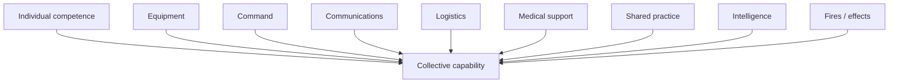
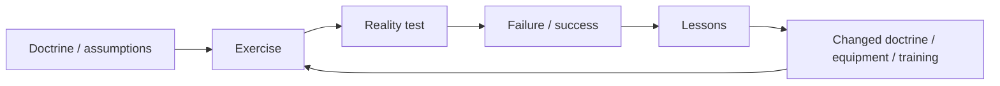
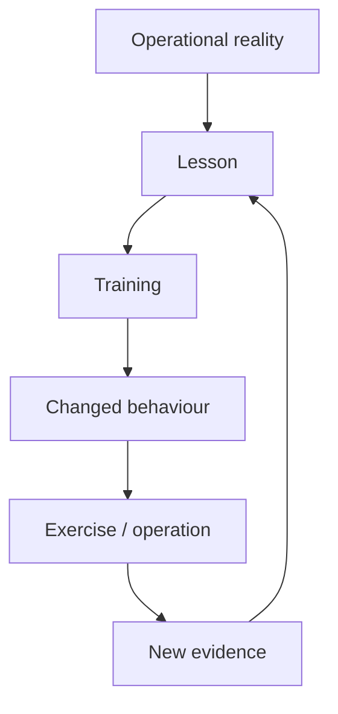

# 🪖 What Training Is For

**First created:** 2026-09-07 | **Last updated:** 2026-09-20  
*Why collective training is not an optional activity around military capability. It is one of the processes by which military capability is created, integrated, tested, retained, corrected, transmitted and regenerated.*

---

## 🪖 Orientation

A military can own:

- soldiers;
- tanks;
- artillery;
- helicopters;
- drones;
- radios;
- ammunition;
- logistics vehicles;
- medical equipment;
- headquarters;
- training areas;
- simulators;
- very expensive computers;

and still not possess a formation capable of fighting effectively.

Because military capability is not simply the sum of military assets.

People and equipment have to learn to operate:

> **together.**

That is the central function of collective training.

Individual competence matters.

Equipment matters.

Doctrine matters.

Technology matters.

But none of them automatically produces:

> **collective competence.**

And collective competence is one of the things Britain is actually purchasing when it pays for military training.

An exercise is therefore not merely an event on a calendar.

It is one intervention inside a larger force-generation system.

The useful question is not:

> **Did training happen?**

It is:

> **What changed in the military system because it happened?**

---

## 1. 🧩 Capability Is Relational

Consider a simplified formation.

It may contain:

- infantry;
- armour;
- artillery;
- engineers;
- signals;
- intelligence;
- logistics;
- medical personnel;
- command;
- drones;
- electronic warfare;
- allied elements.

Each component can be individually excellent.

That does not prove the formation works.

The capability exists partly in the **relationships between them**.



Remove the relationships and you have:

> **a collection of capable things.**

Not necessarily:

> **a capable military system.**

This is why:

> **inventory ≠ capability**

and:

> **qualification ≠ collective competence.**

---

## 2. 🧠 Knowing Your Job Is Not The Same As Knowing Each Other

An individual can know:

- their weapon;
- their vehicle;
- their trade;
- their procedure;
- their doctrine;
- their drone;
- their radio.

Collective performance requires additional knowledge.

People learn:

- how particular colleagues communicate;
- how commanders make decisions;
- how long another element actually takes;
- what information another team needs;
- when somebody is becoming overloaded;
- how equipment behaves around other equipment;
- how logistics interacts with manoeuvre;
- how medical activity affects tempo;
- what happens when communications degrade;
- how somebody responds when the plan goes wrong.

Much of this is not simply written knowledge.

It is:

> **embodied, relational and tacit.**

You acquire it partly by doing the thing together.

---

## 3. 🧠 Tacit Knowledge Matters

Some military knowledge can be written down.

Some can be demonstrated.

Some can be simulated.

Some develops through repeated experience.

A manual can tell you:

> **what should happen.**

Training reveals:

> **what actually happens when several hundred humans, vehicles, radios, drones, weather systems, terrain features and imperfect plans encounter one another at once.**

That difference is not decorative.

It is where much of real military competence lives.

---

## 4. 🧵 Collective Competence Is A Network Property

Collective training should therefore not be understood merely as:

> **individual training, but with more people.**

Something new emerges at scale.

```text
individual skill
+
shared procedures
+
repeated interaction
+
trust
+
command relationships
+
logistics
+
communications
+
uncertainty
+
adaptation
=
collective competence
```

The system has properties its individual members do not possess separately.

That makes collective training a capability-generation activity.

---

## 5. 🧬 Training Changes The State Of The System

This is perhaps the simplest way to understand what training purchases.

Before training, an institution may possess:

```text
people
+
equipment
+
doctrine
+
orders
```

After successful collective training, it may possess:

```text
people
        ↕
shared expectations
        ↕
equipment
        ↕
practised procedures
        ↕
command relationships
        ↕
tested communications
        ↕
tested logistics
        ↕
known failure modes
        ↕
trust
```

The exercise has not merely consumed:

- fuel;
- ammunition;
- staff time;
- money.

It has altered the **state of the military system**.

That is why the value of training cannot be inferred entirely from the cost of the event.

---

## 6. 🪢 Cohesion Is Partly Operational

Cohesion is often discussed as morale.

It is more than morale.

Operational cohesion can include knowing:

- who will respond;
- how quickly;
- what language people use;
- who needs additional information;
- what another team can realistically provide;
- how people behave under pressure;
- whether somebody will say when something has gone wrong.

That produces:

> **predictability inside uncertainty.**

War creates enormous external uncertainty.

A cohesive unit reduces some of the uncertainty inside itself.

That matters.

---

## 7. 🤝 Trust Needs Evidence

Military personnel are asked to trust other people with extraordinary consequences.

Trust cannot be manufactured entirely through instruction.

Repeated shared activity allows people to discover:

- whether another team turns up;
- whether equipment works;
- whether orders are clear;
- whether logistics arrives;
- whether mistakes are acknowledged;
- whether commanders adapt;
- whether people help when the plan collapses.

That is evidence-based trust.

And evidence-based trust is stronger than:

> **the organisation says this should work.**

---

## 8. 🏋️ Training Converts Nominal Strength Into Usable Strength

A force may have:

> **X personnel.**

That is an administrative fact.

It does not automatically tell us:

> **what those personnel can generate together.**

The conversion looks more like:


Training is therefore part of the conversion process between:

> **people on establishment**

and:

> **usable military capability.**

---

## 9. 🎼 The Orchestra Problem

A useful civilian analogy is an orchestra.

Every musician can be individually excellent.

You still rehearse.

Not because:

> perhaps the violinists have forgotten how violins work.

Because the capability being produced is:

> **the orchestra.**

Timing matters.

Coordination matters.

Interpretation matters.

Leadership matters.

Recovery from mistakes matters.

Listening to each other matters.

Military collective training has vastly higher stakes, but the structural point is similar.

You cannot purchase excellent individual musicians and assume you have thereby purchased a rehearsed orchestra.

---

## 10. 🏥 Defence Medicine Provides The Proof Of Concept

We do not actually need to rely entirely upon analogy.

Britain has already applied this principle inside Defence medicine.

During Iraq and Afghanistan, medical personnel could be individually:

- professionally qualified;
- clinically experienced;
- technically competent;
- military trained.

That still did not establish that a deployed medical facility would function correctly **as a system**.

Defence therefore used preparation progressing through:

```text
individual professional competence
        ↓
military-specific competence
        ↓
specialist preparation
        ↓
team training
        ↓
whole-unit / hospital collective validation
        ↓
deployment
```

The point is almost offensively convenient.

> **Qualified individuals ≠ competent collective system.**

That principle applies whether the system contains:

- surgeons;
- medics;
- infantry;
- armour;
- artillery;
- drones;
- logistics;
- headquarters.

The precise relationships change.

The systems problem does not.

---

## 11. 🪖 Scale Changes The Problem

Training at:

- section;
- platoon;
- company;
- battalion;
- brigade;

does not merely repeat the same problem with increasing numbers.

Scale introduces new problems.

For example:

- command span;
- communications;
- movement;
- deconfliction;
- logistics;
- intelligence flow;
- medical support;
- fires;
- engineering;
- reinforcement;
- resupply;
- airspace;
- electronic warfare.

Something which works with thirty people may fail with three hundred.

Something which works with three hundred may fail with three thousand.

Therefore:

> **large-scale collective competence cannot be inferred entirely from small-scale competence.**

It has to be tested.

---

## 12. 🚚 Logistics Becomes Real When Everybody Moves

A classroom can teach logistics.

A simulation can model logistics.

Collective physical activity reveals another category of friction.

How quickly does:

- fuel arrive;
- ammunition move;
- food reach people;
- equipment get recovered;
- broken vehicles get repaired;
- casualties move;
- communications equipment get replaced;
- units physically cross the same infrastructure?

This is why:

> **Who actually moves the fucking thing?**

is a readiness question.

A formation which can fight for six hours but cannot sustain itself is not fully ready.

---

## 13. 📡 Communications Need Collective Rehearsal

Communications systems are especially vulnerable to theoretical competence.

A radio can work.

A procedure can be correct.

A network can still fail when:

- too many people use it;
- terrain intervenes;
- equipment breaks;
- messages compete;
- headquarters move;
- information arrives late;
- people misunderstand priorities;
- an adversary interferes with it.

Collective training lets the organisation discover:

> **whether information still moves when the system is under load.**

That is capability testing.

---

## 14. 🧭 Command Is Also A Practised Skill

Commanders do not merely need knowledge of doctrine.

They need repeated practice making decisions with:

- incomplete information;
- competing priorities;
- tired people;
- changing conditions;
- unexpected failure;
- time pressure.

Subordinates need practice interpreting and executing those decisions.

That creates shared expectations around:

> **how this organisation behaves when the plan stops behaving.**

---

## 15. 🧪 Training Is Partly An Experiment

Training is usually described as preparation.

It is also:

> **testing.**

An exercise asks whether assumptions survive contact with a more complicated environment.

Useful training may discover:

- equipment failure;
- command confusion;
- logistics bottlenecks;
- communications problems;
- unrealistic doctrine;
- poor interoperability;
- unrecognised signatures;
- bad assumptions.

The purpose is partly to discover failure:

> **before an adversary does.**

So:

> **we found twelve things that broke**

can be an excellent training result.

Provided somebody then fixes them.

---

## 16. ⚙️ Training Is A Sensor Inside The Feedback Machine

Training generates information.



Without training, Defence loses more than preparation.

It loses one of the mechanisms by which it discovers:

> **whether its own ideas are wrong.**

---

## 17. 🩸 Defence Medicine Shows What Happens When The Sensor Is Connected

The Defence Medical Services during Iraq and Afghanistan give us an unusually strong example of the complete feedback mechanism.

Operational evidence identified problems.

Interventions followed.

Those interventions included combinations of:

- equipment;
- procedures;
- clinical practice;
- battlefield first aid;
- evacuation;
- training;
- team composition;
- collective validation.

Then outcomes generated more evidence.

```text
operational evidence
        ↓
identified problem
        ↓
intervention
        ↓
training
        ↓
collective validation
        ↓
changed behaviour
        ↓
operational outcome
        ↓
new evidence
        ↺
```

The improvement was not:

> **technology instead of training.**

Nor:

> **training instead of technology.**

Capability changed because several parts of the system changed together.

That is important for every later discussion of:

- drones;
- AI;
- synthetic training;
- equipment modernisation.

---

## 18. 🎓 The Instructor System Matters

Simon Akam's account of OPTAG during Iraq and Afghanistan describes a training organisation which, at points, faced problems involving:

- resources;
- institutional focus;
- theatre currency;
- instructor experience;
- the prestige attached to the training function.

The wider principle matters independently of the individual anecdotes:

> **training quality depends upon who is teaching, what they know, and whether the institution values the teaching function.**

If operational knowledge exists but does not reach instructors:

> **the next cohort does not inherit it.**

---

## 19. ⚡ Theatre → Instructor → Next Cohort

At its healthiest, the learning loop can be extremely short.

```text
current operation
      ↓
operational observation
      ↓
instructor
      ↓
training changed
      ↓
next cohort
```

Training is therefore not merely rehearsal.

It can act as:

> **the transmission mechanism for institutional learning.**

The speed of that transmission is itself a capability.

---

## 20. 🏚️ Representative Environments Matter

Personnel expected to operate around:

- compounds;
- villages;
- streets;
- walls;
- civilian populations;
- difficult terrain;
- vehicles;
- drones;
- contested communications;

benefit from environments which reproduce relevant problems sufficiently well to expose useful behaviour.

This does not mean:

> **every battlefield must be perfectly recreated.**

Impossible.

It means:

> **training realism should be sufficient for the function being tested.**

That is why training estate is not merely land.

It is infrastructure for producing particular forms of competence.

---

## 21. 🤖 Technology Has Always Belonged Inside Training

The choice is not:

> **old-fashioned live training**

versus:

> **modern technology.**

Good training repeatedly absorbs new technology.

If drones improve realism:

> use them.

If simulation increases useful repetition:

> use it.

If AI produces more varied scenarios:

> test it.

If virtual environments allow distributed command practice:

> use them.

If a physical exercise reveals something the synthetic system cannot:

> keep the physical exercise.

Modernisation and collective training are not opposites.

---

## 22. 🖥️ What Simulation Is Good At

Synthetic training can be extremely useful for:

- repetition;
- procedural learning;
- equipment familiarisation;
- command decisions;
- scenario variation;
- distributed participation;
- rare events;
- mission rehearsal;
- reducing some marginal costs;
- situations dangerous or impractical to reproduce physically.

It can also permit:

> **fail → reset → try again**

at a speed impossible in a major live exercise.

That is valuable.

---

## 23. 🌧️ What The Physical World Refuses To Simulate Politely

Live activity introduces friction which is difficult to reproduce completely.

For example:

- weather;
- cold;
- heat;
- mud;
- darkness;
- exhaustion;
- physical movement;
- noise;
- equipment damage;
- maintenance;
- transport delays;
- human misunderstanding;
- actual terrain;
- real logistics.

The physical world has an annoying habit of:

> **not reading the scenario script.**

That is partly why it remains useful.

---

## 24. 🧪 Substitute Functions, Not Formats

The useful question is not:

> **live or synthetic?**

It is:

> **what learning function are we trying to produce?**

Then:

```text
required competence
        ↓
learning function
        ↓
best available training method
        ↓
synthetic / physical / blended
        ↓
validation
```

If simulation reproduces the required function equally or better:

> **excellent. Substitute it.**

If physical exposure contributes a necessary function:

> **retain enough physical training to generate and validate it.**

Hence:

> **substitute functions, not formats.**

---

## 25. 📜 Current Defence Policy Broadly Recognises This

The 2025 Strategic Defence Review makes training a strategic and institutional priority for restoring Army readiness at all levels.

It supports greater use of advanced simulation.

It also retains live activity, including long-distance live firing, where that remains necessary to assure fighting capability.

So the policy baseline is not:

> **simulation replaces reality.**

It is:

> **build a better training architecture using both.**

The relevant implementation question is:

> **Where has substitution actually been validated?**

---

## 26. 🔬 Substitution Needs Evidence

Suppose a training programme previously required:

> **100 units of live activity.**

A synthetic system allows some of that activity to be replaced.

Fine.

The test is:

> **Does the new mixture produce equal or better required competence?**

If yes:

> excellent.

If partly:

> retain the physical components whose learning functions remain necessary.

If unknown:

> **do not book the capability saving before validating the substitution.**

Technology should earn the right to replace an existing training function by demonstrating that the function survives.

---

## 27. 🧠 Stress Inoculation Is A Training Objective

Some training deliberately exposes personnel to:

- uncertainty;
- noise;
- time pressure;
- competing information;
- physical stress;
- simulated danger.

The objective is not suffering for its own sake.

It is partly to reduce the novelty of stress when performance matters.

People can learn:

- how attention changes;
- how communication deteriorates;
- how decision-making changes;
- how procedures hold up.

That is stress inoculation.

---

## 28. 🔥 Stress Must Be Calibrated

The opposite problem exists too.

Training can over-prime people for a particular threat.

```text
too little stress
→ unrealistic preparation

useful stress
→ adaptation

poorly calibrated stress
→ distorted behaviour
```

More realism is therefore not automatically better.

The question is:

> **realistic for what purpose?**

---

## 29. 🩺 Stress Inoculation Is Not Trauma Production

Effective training should increase capacity to function under pressure.

It should not confuse:

> **psychologically useful challenge**

with:

> **unnecessary harm.**

Defence has obligations to understand:

- injury;
- psychological effects;
- cumulative stress;
- recovery;
- instructor behaviour;
- preventable risk.

Training people for danger does not remove the duty to train them intelligently.

---

## 30. ⏳ Skills Decay

Military competence is not acquired once.

Many skills deteriorate without use.

The rate varies.

Some procedural knowledge persists for long periods.

Other abilities require frequent rehearsal.

Collective competence may be especially vulnerable because:

- personnel change;
- commanders rotate;
- equipment changes;
- procedures change;
- teams break apart;
- new people arrive.

Therefore:

> **a unit which was trained is not automatically a unit which remains trained.**

Readiness has a maintenance requirement.

---

## 31. 📉 Training Debt

If activity is postponed, the consequence is not necessarily immediate capability loss.

But the system may accumulate:

- unrehearsed procedures;
- unfamiliar teams;
- missed validation;
- reduced confidence;
- delayed adaptation;
- reduced interoperability.

That is:

> **training debt.**

Some debt can be recovered easily.

Some cannot.

The useful accounting is:

```text
training deferred
        ↓
function affected
        ↓
decay curve
        ↓
mitigation
        ↓
recovery window
        ↓
recovery cost
```

Not:

```text
exercise cancelled
→ £X saved
```

---

## 32. ⌛ Different Capabilities Have Different Decay Curves

A serious training system should be able to ask:

> **How long can this capability go without rehearsal before performance meaningfully degrades?**

The answer may differ for:

- individual weapons;
- vehicle crews;
- drone operators;
- command teams;
- logistics;
- medical response;
- joint fires;
- allied interoperability;
- large-formation manoeuvre.

This matters enormously when deciding which activities can safely be deferred.

Without decay information:

> **non-essential**

may simply mean:

> **the consequence does not arrive this month.**

---

## 33. 🔁 Repetition Produces Automaticity

Under severe pressure, cognitive capacity narrows.

Repeated practice can make necessary actions less cognitively expensive.

That is one reason drills exist.

The purpose is not:

> **make people mindless.**

It is:

> **make routine competence sufficiently automatic that attention remains available for the genuinely novel problem.**

---

## 34. 🧠 Automaticity Creates Another Problem

A behaviour which becomes automatic can survive after the environment which produced it disappears.

Yesterday's competence can become tomorrow's error.

This is the paradox:

> **good training can create habits strong enough that later training is required to remove them.**

---

## 35. 🔄 Unlearning Is Training Too

Akam's Brecon example makes this unusually vivid.

Personnel shaped by Iraq and Afghanistan could carry casualty-response behaviours suited to an environment with sophisticated helicopter evacuation into a different tactical problem.

Hence the deliberately brutal corrective instruction:

> **“Fucking leave him and come back for him.”**

The profanity does rather help.

But the important point is:

> **training sometimes has to overwrite previous training.**

---

## 36. 🧬 Doctrine Lives In Bodies

A document can change overnight.

Embodied behaviour does not.

If somebody has spent years rehearsing:

> **X**

publishing:

> **now do Y**

does not guarantee Y will occur under stress.

The new behaviour must be:

- taught;
- practised;
- repeated;
- tested.

Doctrine becomes capability when it reaches behaviour.

---

## 37. 🧠 Overfitting Is A Military-Learning Problem

Machine-learning language is useful here.

A system can become extremely good at the distribution it repeatedly encounters and worse at generalising beyond it.

Afghanistan generated one extremely powerful learning environment.

Ukraine is generating another.

The challenge is to learn intensely without assuming:

> **the next problem will look exactly like this one.**

Separate:

> **mechanism**

from:

> **context.**

---

## 38. 🧩 Mechanism Versus Context

For example:

### Mechanism

Units require robust logistics under attack.

### Context

The exact logistics problems observed in Ukraine.

### Mechanism

Electronic warfare can disrupt command.

### Context

The particular systems and frequencies currently encountered.

### Mechanism

Casualty assumptions influence tactical behaviour.

### Context

Afghanistan-era helicopter evacuation.

Train the mechanism broadly.

Update the context continuously.

---

## 39. 🎲 Variation Protects Against Overfitting

Useful variation can include:

- different terrain;
- different adversary behaviour;
- communications degradation;
- logistics failure;
- casualty assumptions;
- allied availability;
- air superiority present or absent;
- equipment loss;
- command disruption.

The objective is not random chaos.

It is:

> **preventing one successful solution from becoming the only solution the institution knows.**

---

## 40. 🧨 Surprise Should Happen In Training

If participants always know:

- what will fail;
- when it will fail;
- what the enemy will do;
- what the exercise wants them to demonstrate;

the institution may be rehearsing performance rather than adaptability.

Some uncertainty should therefore be genuine.

That tests:

> **response to the unplanned.**

Which is rather relevant to warfare.

---

## 41. 🛸 Drone Wars: Technical Proficiency Is Not Yet Collective Capability

The Army's 2026 **Drone Wars** competition is useful because it gives us a live example of the training ladder.

Reported tasks placed drone operation inside military problems involving combinations of:

- reconnaissance;
- FPV attack;
- target identification;
- concealment;
- deception;
- thermal signatures;
- movement;
- degraded communications;
- time pressure;
- teamwork.

The question was therefore not merely:

> **Can you fly a drone?**

It was closer to:

> **Can you use a drone to solve a military problem while still behaving like a soldier?**

That is an important step.

But it is not the end.

---

## 42. 🎯 Technical ≠ Tactical ≠ Collective

A useful ladder is:

```text
technical proficiency
        ↓
tactical proficiency
        ↓
team competence
        ↓
unit integration
        ↓
formation competence
```

Drone racing may develop:

- speed;
- precision;
- control.

A tactical competition can add:

- concealment;
- reconnaissance;
- target judgement;
- mission context;
- adaptation;
- teamwork.

But:

> **four excellent people do not automatically create a competent platoon, company, battlegroup or brigade.**

Eventually everybody has to practise together.

---

## 43. 🧑‍🏫 The Important Drone Question Is What Happens Next

Competition can potentially create:

```text
pressure
   ↓
experimentation
   ↓
visible variation
   ↓
identify talent / useful practice
   ↓
organisational learning
```

But the useful output is not merely:

> **who won?**

The important questions are:

- Which techniques emerged?
- Which failed?
- Which depended upon particular individuals?
- Which are transferable?
- Who captures them?
- Who validates them?
- Do participants become instructors?
- Does doctrine change?
- Do training packages change?
- Are techniques tested elsewhere?
- How quickly does useful practice spread?
- How do we avoid turning one successful competition tactic into rigid doctrine?

This is where experimentation either becomes:

> **institutional capability**

or remains:

> **some lads did a cool thing at Sandhurst.**

---

## 44. ☂️ New Warfare Can Produce Very Old Solutions

The Drone Wars evidence also gives us a useful corrective to technological determinism.

Reported experimentation included low-tech adaptation around thermal concealment.

In other words:

> **Have we tried... umbrella?**

Future warfare does not mean every useful adaptation has to contain:

- AI;
- a cloud platform;
- venture capital;
- seventeen dashboards.

Sometimes a changed technological environment makes a very simple physical adaptation newly useful.

Training creates somewhere to discover that.

---

## 45. 🪖 Existing Soldiering Skills Still Matter

Drone warfare does not abolish:

- fieldcraft;
- concealment;
- reconnaissance;
- tactical judgement;
- communication;
- leadership;
- logistics;
- teamwork;
- terrain understanding;
- adaptation under pressure.

It changes the environment in which those skills operate.

Persistent aerial observation makes:

- concealment harder;
- movement more observable;
- signatures more dangerous;
- mistakes more rapidly punishable.

So the adaptation problem is often:

> **existing skill + changed environment + new tool**

not:

> **old soldier bad; drone boy good.**

---

## 46. 🔗 Modernisation Can Increase The Training Requirement

This is one of the most important points in the current dispute.

Successful technological modernisation creates requirements for:

- operators;
- instructors;
- maintainers;
- commanders;
- reconnaissance integration;
- fires integration;
- airspace management;
- communications;
- electronic-warfare understanding;
- counter-UAS;
- concealment;
- signature management;
- logistics;
- doctrine;
- collective practice.

Therefore:

> **modernisation does not necessarily reduce the training requirement.**

It can increase its complexity.

Hence:

> **drone acquisition ≠ drone capability**

> **individual qualification ≠ tactical capability**

> **tactical proficiency ≠ formation-level competence**

Eventually everybody has to practise together.

---

## 47. 🌐 Allied Competence Also Needs Rehearsal

Britain's current strategy is NATO-first.

British readiness therefore cannot be defined entirely nationally.

Collective training may need to establish whether British forces can actually operate with allies across:

- command;
- communications;
- logistics;
- fires;
- intelligence;
- medical systems;
- doctrine.

Interoperability is not created by:

> **both countries being members of NATO.**

It is created partly through repeated practice.

---

## 48. 🤝 Familiarity Reduces Allied Friction

Allied exercises expose:

- terminology differences;
- procedures;
- command relationships;
- technical incompatibilities;
- national restrictions;
- different assumptions.

Those problems are much cheaper to discover:

> **on exercise**

than:

> **during mobilisation.**

An alliance is partly a political commitment.

Military interoperability is part of the work required to make that commitment executable.

---

## 49. 🧱 Joint Competence Requires Practice Too

The Army does not fight in isolation from:

- Royal Navy;
- RAF;
- Cyber & Specialist Operations Command;
- intelligence;
- cyber;
- space.

If future doctrine depends upon integration:

> **integration itself must be trained.**

You cannot sensibly plan to:

> **integrate for the first time after shooting starts.**

---

## 50. 🧠 Mobilisation Is A Training Problem

Mobilisation does not merely mean:

> **find more people.**

RUSI's 2026 work on mobilisation and training emphasises the need for:

- mobilisation planning;
- training capacity;
- instructor capacity;
- unit cohesion;
- collective competence;
- live exercises;
- synthetic technologies;
- use of civilian skills.

The point is simple.

> **Mobilisation without training capacity produces numbers faster than capability.**

---

## 51. 🎓 Instructor Capacity Is Mobilisation Capacity

An instructor who is not currently deployed can look like:

> **overhead.**

During expansion, that instructor becomes:

> **the machine which creates additional trained personnel.**

Cutting instructor depth can therefore reduce future force-generation speed.

The value of an instructor is not only the people they teach today.

It includes:

> **the institution's ability to scale tomorrow.**

---

## 52. 🏚️ Training Estate Is Mobilisation Infrastructure

The same applies to:

- ranges;
- urban training environments;
- accommodation;
- manoeuvre space;
- live-fire facilities;
- electronic-warfare environments.

A training area sitting partially unused today may appear inefficient.

But if the force must expand:

> **where does the extra training happen?**

Estate capacity has option value.

Owned land is not automatically usable training capacity.

But usable training estate is not merely property.

It is part of the force-generation system.

---

## 53. 🇺🇦 Interflex Demonstrates The Capacity Problem

British training support for Ukraine is strategically useful.

It also consumes real training capacity.

That is not a contradiction.

The National Audit Office has documented substantial use of Army training estate by Operation Interflex and increased difficulty for British units seeking training-site access compared with the pre-Interflex period.

The conclusion is not:

> **stop training Ukrainians.**

It is:

> **strategically useful commitments still consume finite force-generation resources.**

Capacity planning has to count them.

---

## 54. 🛡️ Training Can Create Survivability

Interflex also provides evidence that trainees themselves perceived the training as improving their preparation to survive battlefield conditions.

That does not produce a neat equation:

> **X days of training = Y casualties prevented.**

War does not provide that luxury.

But it supports the broader proposition that training can alter knowledge and behaviour relevant to survival.

---

## 55. 🩸 The Casualty Prevented Has No Invoice

A tank has a price.

A drone has a price.

A contract has a price.

An exercise has a price.

The casualty which never happens because somebody rehearsed the situation correctly has:

> **no invoice.**

That makes prevention economically quiet.

It does not make prevention economically worthless.

---

## 56. 🦿 Training And Rehabilitation Belong In One Human-Risk System

Where harm occurs, the state may acquire long-term obligations involving:

- emergency medicine;
- surgery;
- rehabilitation;
- prosthetics;
- pain management;
- mental-health care;
- housing;
- compensation;
- pensions;
- family support.

This does not mean:

> **spend infinitely on training because casualties are expensive.**

It means:

> **training decisions sit inside a wider human-risk system.**

Preparation and consequences should not live in completely separate conceptual ledgers.

---

## 57. 💷 Cost And Value Are Different Variables

Suppose an exercise costs:

> **£5 million.**

That tells us:

> **the purchase price.**

It does not tell us:

> **the value of the capability generated.**

Likewise:

> **£30 million saved**

does not establish:

> **£30 million of capability lost.**

The effect could be:

- lower;
- roughly proportional;
- higher;
- recoverable;
- difficult to recover.

This is why the current dispute cannot be understood from the cash figure alone.

---

## 58. 🧮 Training Has Option Value

Training can create capacity which is never used in combat.

That does not mean the money was wasted.

Preparedness is partly an option.

Britain pays to preserve the ability to respond if required.

This resembles:

- insurance;
- fire services;
- backups;
- emergency medicine.

Success can look like:

> **nothing happened.**

Or:

> **the crisis occurred and the prepared system coped.**

Preventative capability is easy to undervalue because its best outcome may be uneventful.

---

## 59. 🪟 “Non-Essential” Requires A Time Horizon

One reason current language matters is the phrase:

> **non-essential training.**

Non-essential:

> **for what?**

And:

> **over what period?**

An activity may be non-essential:

> **this week**

while essential to:

> **maintaining formation competence across the year.**

An activity may be safely deferred once.

Repeated deferral may produce significant skill decay.

Therefore:

> **essentiality is partly temporal.**

---

## 60. 📆 A Calendar Is Not A Capability Model

Exercises appearing on a schedule can make them look like:

> **events.**

The useful model is:

```text
required capability
        ↓
required competence
        ↓
required rehearsal frequency
        ↓
exercise programme
```

If an event is removed, work backwards.

Which competence changes?

When?

Can it be recovered?

At what cost?

The calendar is merely the visible surface of the capability-generation system.

---

## 61. 🔭 Training Should Be Designed Backwards From Readiness

The sequence should be:


Not:

```text
available training budget
        ↓
affordable exercises
        ↓
whatever competence results
        ↓
call it readiness
```

The first is force generation.

The second is budget-constrained activity planning.

Sometimes budget constraints are unavoidable.

But we should at least know which one we are doing.

---

## 62. 🧪 Training Needs Outcomes, Not Attendance Metrics

Useful measures might include:

- performance before and after training;
- command effectiveness;
- logistics performance;
- communications resilience;
- equipment integration;
- allied interoperability;
- adaptation under uncertainty;
- identified failures;
- correction rate;
- retest results;
- skill retention.

Less useful as standalone evidence:

> **X people attended.**

Attendance establishes that an activity occurred.

It does not establish:

> **what capability emerged.**

---

## 63. 🧠 Training Failure Can Be Evidence Of Training Success

This is counterintuitive enough to state plainly.

If an exercise discovers:

- command failure;
- logistics failure;
- equipment failure;

that does not necessarily mean:

> **the exercise failed.**

It may mean:

> **the exercise worked as a diagnostic instrument.**

The bad outcome is:

> **nobody discovers the failure until operations.**

Training should reward useful discovery.

Not merely smooth performance.

---

## 64. 🦚 Do Not Train The Dashboard

If careers, funding or reputation depend too heavily upon:

> **successful exercise outcomes**

people may rationally begin producing successful exercise outcomes.

That can mean:

- predictable scenarios;
- hidden assistance;
- forgiving assumptions;
- avoiding embarrassing failure.

Then the system becomes optimised for:

> **proving readiness**

rather than:

> **creating and testing readiness.**

That is Goodhart's law in camouflage.

---

## 65. 🧿 The Question Is Not “How Much Training?”

There is no universal answer.

More is not automatically better.

Training consumes:

- money;
- personnel time;
- equipment life;
- ammunition;
- estate;
- fuel.

Bad training can waste all of them.

The useful questions are:

> **What competence is required?**

> **What training creates it?**

> **How often must it be repeated?**

> **How do we know it worked?**

> **What happens if we stop?**

---

## 66. ⚖️ Training Can Legitimately Be Deprioritised

This node should not become:

> **never cancel an exercise.**

Cancellation or postponement may be entirely rational because of:

- operational deployment;
- equipment genuinely unavailable;
- replacement by higher-value activity;
- genuine duplication;
- validated synthetic substitution;
- temporary financial triage with credible recovery.

The question is not:

> **Was training reduced?**

It is:

> **What capability consequence follows, and was that consequence understood and accepted?**

---

## 67. 🧱 Flexible Does Not Mean Expendable

Training can often be cancelled quickly.

That makes it financially flexible.

But flexibility is not evidence of low strategic value.

An exercise can disappear from a calendar much more easily than:

- a submarine contract;
- a long-term procurement programme;
- a permanent salary commitment.

That creates a structural danger:

> **the easiest capability-generation activity to stop may absorb financial shocks generated elsewhere.**

Hence the question:

> **Was training reduced because it was least valuable, or because it was easiest to stop?**

That is a hypothesis to test.

Not an answer to assume.

---

## 68. 🧠 What Training Actually Does

Training performs several functions simultaneously.

It:

### Creates

new competence.

### Integrates

individuals into collective systems.

### Maintains

existing competence.

### Tests

whether doctrine and equipment work.

### Transmits

operational learning.

### Calibrates

stress responses.

### Builds

trust and cohesion.

### Exposes

failure.

### Updates

behaviour when assumptions change.

### Experiments

with emerging tools and tactics.

### Preserves

mobilisation capacity.

### Regenerates

readiness after disruption.

That is considerably more than:

> **an activity.**

---

## 69. ⚙️ Training Is Part Of The Military's Learning Architecture



Remove training from that loop and lessons can remain:

> **words.**

Training is one mechanism through which institutional knowledge becomes embodied behaviour.

---

## 70. 🪖 The Capability Statement

The central proposition of this node is therefore:

> **Collective training is a military capability because it is part of the machinery that creates, integrates, tests, maintains and updates the ability of people and equipment to function together under operational conditions.**

An exercise is not itself the final capability.

But neither is:

- a tank;
- a drone;
- a soldier;
- a doctrine document;
- a headquarters.

Capability emerges from the system.

Training changes the state of that system.

---

## 71. 🧠 The Counterfactual Test

Whenever training is proposed for reduction, ask:

> **What happens if we do not do this?**

Possible answers:

### Nothing material

Then stop doing it.

### Competence decays slowly and can be recovered cheaply

Then defer it if necessary.

### Another method produces the same competence

Use the better method.

### A difficult-to-regenerate collective skill deteriorates

Protect it.

### We do not know

Then:

> **the knowledge gap itself is a risk.**

A serious training system should know what its activities are for.

---

## 72. 🩺 The September 2026 Question

This brings us back to the presenting complaint.

The relevant question is not:

> **Is £30 million a lot of money?**

Nor:

> **Does the Army still train?**

Nor:

> **But what about the drones?**

It is:

> **Which collective capabilities were the affected activities intended to create, maintain, test or update; what replaces those functions; when does competence begin to decay; how quickly can it be recovered; and who has accepted any residual risk?**

That is the capability question.

---

## 73. 🔬 Translate The Saving Back Into Function

For every affected activity:

```text
ACTIVITY
   ↓
FUNCTION
   ↓
COMPETENCE
   ↓
READINESS EFFECT
   ↓
DECAY RATE
   ↓
MITIGATION
   ↓
RECOVERY PLAN
   ↓
RESIDUAL RISK
```

Only then can:

> **£30 million saved**

be translated into:

> **military consequence.**

Without that translation, the cash number tells us very little.

---

## 74. 🔭 What Britain Is Actually Buying

When Britain pays for collective training, it may be buying:

- fewer surprises;
- faster decisions;
- better coordination;
- stronger trust;
- more realistic logistics;
- better interoperability;
- earlier discovery of failure;
- faster adaptation;
- retained skills;
- survivability;
- mobilisation capacity;
- institutional learning;
- regeneration speed.

Some of those outputs are straightforward to measure.

Some are difficult to price.

All can matter.

That is why:

> **£30 million is not necessarily the value of what has been cut.**

£30 million is:

> **the reported amount the institution was trying to save.**

Capability has to be measured separately.

---

## 🛡️ Working Principles

1. **Individual competence does not automatically produce collective competence.**
2. **Collective competence is relational and partly tacit.**
3. **Training changes the state of the military system.**
4. **Technical proficiency ≠ tactical proficiency ≠ collective military capability.**
5. **Training is simultaneously preparation, integration, experimentation, testing and learning.**
6. **Training failure can be useful evidence if failure is captured, corrected and retested.**
7. **Live and synthetic training perform overlapping but non-identical functions.**
8. **Substitute functions, not formats.**
9. **Technology should replace an existing training function only where the substitution is sufficiently validated.**
10. **Successful modernisation can increase the complexity of the training requirement.**
11. **Stress exposure should be purposeful and calibrated.**
12. **Skills decay, including collective skills.**
13. **Deferred training can create training debt rather than immediate capability collapse.**
14. **“Non-essential” requires a time horizon.**
15. **Good training can create habits which later need to be unlearned.**
16. **Operational lessons become capability when they alter behaviour.**
17. **Instructor capacity is force-generation and mobilisation capacity.**
18. **Usable training estate is force-generation infrastructure.**
19. **A cancelled exercise should be assessed by capability consequence, not merely cash saving.**
20. **The casualty prevented by preparation may never appear in the accounts.**
21. **Financial flexibility does not establish strategic expendability.**
22. **If Defence does not know what happens when an activity stops, that knowledge gap is itself relevant.**

---

## 🧾 Questions For The Current Dispute

For every affected category of collective training, establish:

1. What capability was the activity designed to generate?
2. At what scale?
3. Which relationships or systems did it integrate?
4. Was it primarily creating, maintaining, testing or updating competence?
5. How frequently does that competence require rehearsal?
6. How quickly does it decay?
7. Can synthetic training reproduce any of the function?
8. What must remain physical?
9. Has any substitution been validated?
10. Is the activity cancelled, reduced, redesigned or postponed?
11. What replacement activity exists?
12. When will deferred activity be recovered?
13. What readiness effect has been assessed?
14. What allied or joint competence is affected?
15. What operational lessons would otherwise have been tested?
16. What equipment would otherwise have been exercised?
17. What instructor capacity is affected?
18. What estate capacity is affected?
19. Does the change create training debt?
20. How expensive and time-consuming would regeneration be?
21. Who owns the residual risk?

Then ask the simplest question in the entire node:

> **What happens if we don't do this?**

---

## 📡 Carry Forward

This node connects directly to:

- [`📋_history_of_presenting_complaint.md`](./📋_history_of_presenting_complaint.md) — *the historical evidence that capability and training requirements change together*
- [`⚙️_the_feedback_machine.md`](./⚙️_the_feedback_machine.md) — *how training receives and transmits operational learning*
- [`🔭_what_does_ready_actually_look_like.md`](./🔭_what_does_ready_actually_look_like.md) — *defining the capability training is intended to produce*
- [`💷_thirty_million_pounds.md`](./💷_thirty_million_pounds.md) — *translating the current saving back into capability*
- [`🧾_the_blank_cheque_exercise.md`](./🧾_the_blank_cheque_exercise.md) — *establishing unconstrained training requirements before affordability*
- [`🛡️_prevention_and_resilience.md`](./🛡️_prevention_and_resilience.md) — *preserving training capacity, redundancy and institutional memory*
- [`💊_long_term_management.md`](./💊_long_term_management.md) — *instructors, estate, personnel and force-generation reform*
- [`🔬_tests_and_investigations.md`](./🔬_tests_and_investigations.md) — *evidence needed to establish the actual training requirement*
- [`data/strategic_reviews.md`](./data/strategic_reviews.md) — *how training requirements have evolved across reviews*
- [`data/current_reporting.md`](./data/current_reporting.md) — *claims concerning current training transformation*
- [`data/source_bank.md`](./data/source_bank.md) — *underlying evidence*

---

## 📚 Sources

- [GOV.UK: *Strategic Defence Review 2025 — Making Britain Safer: secure at home, strong abroad*](https://www.gov.uk/government/publications/the-strategic-defence-review-2025-making-britain-safer-secure-at-home-strong-abroad/the-strategic-defence-review-2025-making-britain-safer-secure-at-home-strong-abroad)
- [RUSI: Nick Reynolds and Paul O'Neill CBE, *Mobilisation and Training for War: Preparing to Break Glass*](https://www.rusi.org/explore-our-research/publications/research-papers/mobilisation-and-training-war-preparing-break-glass)
- [National Audit Office: *Investigation into military support for Ukraine*](https://www.nao.org.uk/press-releases/investigation-into-military-support-for-ukraine/)
- [GOV.UK: *Operational patient care pathway (JSP 950)*](https://www.gov.uk/government/publications/operational-patient-care-pathway)
- [Military Medicine: “Evolution of First Aid Training in the British Army”](https://academic.oup.com/milmed/article/186/Supplement_1/808/6119471)
- [British Journal of Anaesthesia: “Global lessons: developing military trauma care and lessons for civilian practice”](https://academic.oup.com/bja/article/119/suppl_1/i135/4638478)
- [GOV.UK: “Army medics prepare for Afghan mission”](https://www.gov.uk/government/news/army-medics-prepare-for-afghan-mission)
- [House of Commons Defence Committee: *Beyond endurance? Military exercises and the duty of care*](https://publications.parliament.uk/pa/cm201516/cmselect/cmdfence/598/59805.htm)
- [House of Commons Defence Committee: *Government Response to Beyond endurance?*](https://publications.parliament.uk/pa/cm201617/cmselect/cmdfence/525/52504.htm)
- [Royal Air Force: “The Great Simulation: Accelerating the Pilot Pipeline”](https://www.raf.mod.uk/news/articles/the-great-simulation-accelerating-the-pipeline/)
- Simon Akam, *The Changing of the Guard: The British Army Since 9/11* (Scribe, 2021).

### 🛸 Current Drone Wars evidence layer

The Drone Wars sections above are based on the current Training Debrief working evidence layer and contemporary reporting captured there. They should remain treated as a developing evidence set until the final source-bank pass establishes the complete public description of the competition, participants, tasks and subsequent dissemination mechanism.

---

## 🌌 Constellations

🪖 🧠 ⚙️ 🎓 🧩 🤖 🔁 🩸 🛸 🧱 — collective competence; tacit knowledge; cohesion; training realism; simulation; stress inoculation; skill decay; training debt; OPTAG; Defence Medical Services; Drone Wars; mobilisation; instructors; estate; overfitting; unlearning; force generation.

---

## ✨ Stardust

british army collective training, military readiness, collective competence, tacit knowledge, unit cohesion, live exercises, synthetic training, military simulation, stress inoculation, skill decay, training debt, OPTAG, BATUS, Defence Medical Services, collective validation, Drone Wars, drones, technical proficiency, tactical proficiency, formation competence, mobilisation, training estate, instructors, unlearning, military overfitting, NATO interoperability, force generation

---

## 🏮 Footer

*🪖 What Training Is For* is a living node of the **Polaris Protocol**.

It treats collective training as part of military capability: the machinery that creates, integrates, tests, maintains, transmits and updates collective competence.

The question is not whether every exercise is sacred.

It is whether Defence knows what each activity is **for**.

> **If it produces nothing useful, stop doing it.**
>
> **If another method produces the same function better, replace it.**
>
> **If competence can safely decay and cheaply regenerate, defer it.**
>
> **If removing it damages a difficult-to-recreate capability, know that before you remove it.**
>
> **And if nobody knows what happens when you stop — that is part of the presenting complaint.**

> 🏮 Return To:
>
> - [🪖 Training Debrief](./README.md) — *1up*
> - [🌊 Playing Defence](../README.md) — *2up*
> - [📲 Press Matters](../../README.md) — *3up*
> - [🌓 In The Moment](../../../README.md) — *4up*
> - [🌌 Polaris Protocol — Root](../../../../README.md) — *root*

*Survivor authorship is sovereign. Containment is never neutral.*

_Last updated: 2026-09-20_
