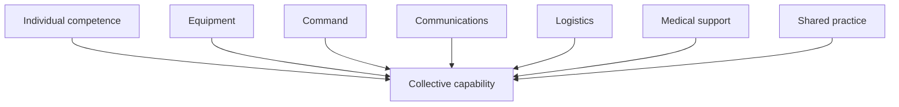
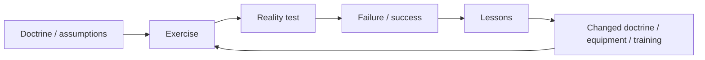
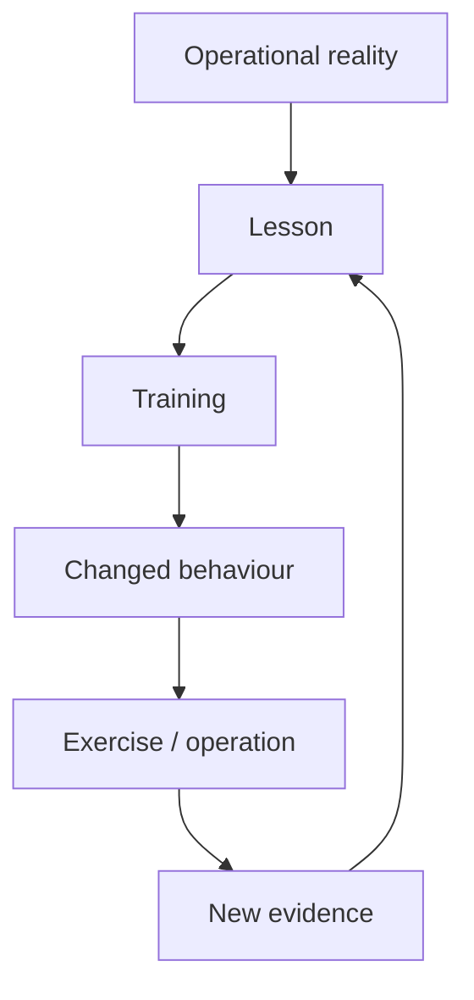

# 🪖 What Training Is For
**First created:** 2026-09-07 | **Last updated:** 2026-09-07  
*Why collective training is not an optional activity around military capability. It is one of the processes by which military capability is created, tested, retained, corrected and regenerated.*

---

## 🪖 Orientation

A military can own:

- soldiers;
- tanks;
- artillery;
- helicopters;
- radios;
- ammunition;
- logistics vehicles;
- medical equipment;
- headquarters;
- training areas;

and still not possess a formation capable of fighting effectively.

Because military capability is not simply the sum of military assets.

People and equipment have to learn to operate:

> **together.**

That is the central function of collective training.

Individual competence matters.

Equipment matters.

Doctrine matters.

Technology matters.

But none of them automatically produces:

> **collective competence.**

And collective competence is one of the things Britain is actually purchasing when it pays for military training.

---

## 🧩 1. Capability is relational

Consider a simplified formation.

It may contain:

- infantry;
- armour;
- artillery;
- engineers;
- signals;
- intelligence;
- logistics;
- medical personnel;
- command.

Each component can be individually excellent.

That does not prove the formation works.

The actual capability exists partly in the relationships between them.



Remove the relationships and you have:

> **a collection of capable things.**

Not necessarily:

> **a capable military system.**

---

## 🧠 2. Knowing your job is not the same as knowing each other

An individual can know:

- their weapon;
- their vehicle;
- their trade;
- their procedure;
- their doctrine.

Collective performance requires additional knowledge.

People learn:

- how particular colleagues communicate;
- how commanders make decisions;
- how long another element actually takes;
- what information another team needs;
- when someone is becoming overloaded;
- how equipment behaves around other equipment;
- how logistics interacts with manoeuvre;
- how medical activity affects tempo.

Much of this is not simply written knowledge.

It is:

> **embodied, relational and tacit.**

You acquire it partly by doing the thing together.

---

## 🧠 3. Tacit knowledge matters

Some military knowledge can be written down.

Some can be demonstrated.

Some can only really be developed through repeated experience.

A manual can tell you:

> what should happen.

Training reveals:

> **what actually happens when several hundred humans, vehicles, radios, weather systems, terrain features and imperfect plans encounter each other at once.**

That difference is not decorative.

It is where much of real military competence lives.

---

## 🧵 4. Collective competence is a network property

This is why collective training should not be understood merely as:

> individual training, but with more people.

Something new emerges at scale.

```text
individual skill
+
shared procedures
+
repeated interaction
+
trust
+
command relationships
+
logistics
+
communications
+
uncertainty
=
collective competence
```

The system has properties its individual members do not possess separately.

That makes collective training a capability-generation activity.

---

## 🪢 5. Cohesion is partly operational

Cohesion is often discussed as morale.

It is more than morale.

Operational cohesion can include knowing:

- who will respond;
- how quickly;
- what language people use;
- who needs additional information;
- what another team can realistically provide;
- how people behave under pressure.

That produces:

> **predictability inside uncertainty.**

In war, the external environment may be chaotic.

A cohesive unit reduces some of the internal uncertainty.

That matters.

---

## 🤝 6. Trust needs evidence

Military personnel are asked to trust other people with extraordinary consequences.

Trust cannot be manufactured entirely by instruction.

Repeated shared activity lets people discover:

- whether another team turns up;
- whether equipment works;
- whether orders are clear;
- whether logistics arrives;
- whether mistakes are acknowledged;
- whether commanders adapt;
- whether people help when the plan collapses.

That is evidence-based trust.

And evidence-based trust is stronger than:

> **the organisation says this should work.**

---

## 🏋️ 7. Training converts nominal strength into usable strength

A force may have:

> X personnel.

That is an administrative fact.

It does not automatically tell us:

> what those personnel can generate together.

The conversion looks more like:


Training is therefore not simply expenditure consumed by personnel.

It is part of the conversion process between:

> **people on establishment**

and:

> **usable military capability.**

---

## 🎼 8. The orchestra problem

A useful civilian analogy is an orchestra.

Every musician can be individually excellent.

You still rehearse.

Not because:

> perhaps the violinists have forgotten how violins work.

Because the capability being produced is:

> **the orchestra.**

Timing matters.

Coordination matters.

Interpretation matters.

Leadership matters.

Recovery from mistakes matters.

Listening to each other matters.

Military collective training has vastly higher stakes, but the structural point is similar.

You cannot purchase excellent individual musicians and assume you have thereby purchased a rehearsed orchestra.

---

## 🪖 9. Scale changes the problem

Training at:

- section;
- platoon;
- company;
- battalion;
- brigade;

does not merely repeat the same problem with increasing numbers.

Scale introduces new problems.

For example:

- command span;
- communications;
- movement;
- deconfliction;
- logistics;
- intelligence flow;
- medical support;
- fires;
- engineering;
- reinforcement;
- resupply.

Something which works with thirty people may fail with three hundred.

Something which works with three hundred may fail with three thousand.

Therefore:

> **large-scale collective competence cannot be inferred entirely from small-scale competence.**

It has to be tested.

---

## 🚚 10. Logistics becomes real when everybody moves

A classroom can teach logistics.

A simulation can model logistics.

But collective activity reveals practical friction.

How quickly does:

- fuel arrive;
- ammunition move;
- food reach people;
- equipment get recovered;
- broken vehicles get repaired;
- casualties move;
- communications equipment get replaced;
- units physically cross the same infrastructure?

This is why:

> **Who actually moves the fucking thing?**

is a readiness question.

A formation which can fight for six hours but cannot sustain itself is not fully ready.

---

## 📡 11. Communications need collective rehearsal

Communications systems are especially vulnerable to theoretical competence.

A radio can work.

A procedure can be correct.

A network can still fail when:

- too many people use it;
- terrain intervenes;
- equipment breaks;
- messages compete;
- headquarters move;
- information arrives late;
- people misunderstand priorities.

Collective training lets the organisation discover:

> **whether information still moves when the system is under load.**

That is capability testing.

---

## 🧭 12. Command is also a practised skill

Commanders do not merely need knowledge of doctrine.

They need repeated practice making decisions with:

- incomplete information;
- competing priorities;
- tired people;
- changing conditions;
- unexpected failure;
- time pressure.

Subordinates also need practice interpreting and executing those decisions.

That creates shared expectations around:

> how this organisation behaves when the plan stops behaving.

---

## 🧪 13. Training is partly an experiment

Training is often described as preparation.

It is also:

> **testing.**

An exercise asks whether assumptions survive contact with a more complicated environment.

That means useful training may discover:

- equipment failure;
- command confusion;
- logistics bottlenecks;
- communications problems;
- unrealistic doctrine;
- poor interoperability.

The purpose is partly to discover failure:

> **before an adversary does.**

As the investigation node already puts it:

> **we found twelve things that broke**

can be an excellent training result.

Provided somebody then fixes them.

---

## ⚙️ 14. Training is a sensor inside the feedback machine

This connects directly to:

`⚙️_the_feedback_machine.md`

Training generates information.



Without training, Defence loses not only preparation.

It loses one of the mechanisms by which it discovers:

> **whether its own ideas are wrong.**

---

## 📚 15. Akam: training after operational failure

Simon Akam's *The Changing of the Guard* provides an unusually useful account of the British Army's attempts to improve training during Iraq and Afghanistan.

The important point for this node is not:

> Afghanistan proves how the Army should train forever.

It is:

> **operational experience exposed gaps between the Army's existing preparation and the environment its personnel actually encountered.**

The institution then attempted to close those gaps.

That is training as adaptation.

---

## 🎓 16. OPTAG: the instructor system matters

Akam's account of OPTAG describes a training organisation which, at points, had problems including:

- inadequate resources;
- insufficient focus;
- instructors whose experience was not always current enough for the theatre they were preparing others to enter;
- a posting which did not necessarily possess the prestige its function deserved.

Richard Wesley's reforms matter because they illustrate a broader principle:

> **training quality depends upon who is teaching, what they know, and whether the institution values the teaching function.**

If operational knowledge exists but does not reach instructors:

the next cohort does not inherit it.

---

## ⚡ 17. Theatre → instructor → next cohort

At its healthiest, Akam's account contains remarkably short feedback loops.

The Valon detector example is useful.

A training question arises.

The instructor contacts Afghanistan.

Current operational information returns.

Training changes.


That is training doing more than rehearsal.

It is acting as:

> **the transmission mechanism for institutional learning.**

---

## 🏚️ 18. Representative environments matter

Akam also describes efforts to improve the physical environments used for preparation.

The contrast between improvised representative environments and more realistic facilities matters.

Personnel expected to operate around:

- compounds;
- villages;
- streets;
- walls;
- civilian populations;
- complex terrain;

benefit from training environments which reproduce relevant problems more faithfully.

This does not mean:

> every battlefield must be recreated perfectly.

Impossible.

It means training realism should be sufficient to expose the behaviours and problems the institution actually wants to test.

---

## 🏜️ 19. BATUS: realism evolves

Akam's account of reforms at BATUS is useful for the same reason.

Training evolved to incorporate features including:

- villages;
- drones;
- simulated casualties;
- greater dismounted activity;
- more varied opposing forces.

This is worth remembering when current discussion presents:

> drones

as though military training discovered them in 2022.

British training environments were incorporating unmanned systems into realistic exercises long before the full-scale invasion of Ukraine.

The lesson is not:

> old training was already perfect.

It is:

> **training itself evolves as the threat environment evolves.**

---

## 🤖 20. Technology has always belonged inside training

This matters for the current simulation debate.

The choice is not:

> old-fashioned live training

versus:

> modern technology.

Good training has repeatedly absorbed new technology.

The relevant question is:

> **What training function does this technology improve?**

If drones improve realism:

use them.

If simulation increases repetition:

use it.

If AI generates more varied scenarios:

test it.

If virtual environments allow distributed command practice:

use them.

Modernisation and collective training are not opposites.

---

## 🖥️ 21. What simulation is good at

Synthetic training can be extremely useful for:

- repetition;
- procedural learning;
- equipment familiarisation;
- command decisions;
- scenario variation;
- distributed participation;
- practising rare events;
- reducing some marginal costs;
- training where physical reproduction would be difficult or unsafe.

It can also allow:

> fail → reset → try again

at a speed impossible in large live exercises.

That is valuable.

---

## 🌧️ 22. What the physical world refuses to simulate politely

Live training introduces forms of friction which are difficult to reproduce completely.

For example:

- weather;
- cold;
- heat;
- mud;
- darkness;
- exhaustion;
- physical movement;
- noise;
- equipment damage;
- maintenance;
- transport delays;
- human misunderstanding;
- actual terrain;
- real logistics.

The physical world has an annoying habit of:

> **not reading the scenario script.**

That is partly why it remains useful.

---

## 🧠 23. Simulation and live training generate different information

This distinction is important.

Synthetic environments can be excellent at testing:

> decisions.

Live environments can be particularly useful for testing:

> **systems interacting physically.**

Neither category is homogeneous.

Neither automatically dominates.

The right design is:

```text
training objective
→ required learning mechanism
→ synthetic / live / blended method
→ test outcome
```

Not:

```text
simulation cheaper
→ therefore replace live training
```

Nor:

```text
live training traditional
→ therefore always superior
```

---

## 📜 24. The 2025 Strategic Defence Review gets this broadly right

The 2025 Strategic Defence Review explicitly treats training as a strategic and institutional priority in restoring Army readiness.

It also recognises the role of advanced simulation.

But it does not treat simulation as proof that physical training has become unnecessary.

The review retains the need for live activity, including live firing at significant ranges.

That gives us an important current-policy baseline:

> **modern synthetic training and live collective training are intended to coexist.**

The public-policy question is therefore not whether Britain should modernise training.

It is:

> **where is the validated boundary between augmentation and substitution?**

---

## 🔬 25. Substitution needs evidence

Suppose an exercise previously required:

> 100 units of live activity.

A new synthetic system allows some of that activity to be replaced.

Fine.

The relevant test is:

> **Does the new mixture produce equal or better required competence?**

If yes:

excellent.

Modernise.

If partly:

retain the physical elements whose learning function remains unique.

If unknown:

> **do not book the capability saving before validating the substitution.**

Technology should earn the right to replace an existing training function by demonstrating that the function survives.

---

## 🧠 26. Stress inoculation is a training objective

Some training deliberately exposes personnel to:

- uncertainty;
- noise;
- time pressure;
- competing information;
- physical stress;
- simulated danger.

The aim is not suffering for its own sake.

It is partly to reduce the novelty of stress when performance matters.

People can learn:

- how their attention changes;
- how communication deteriorates;
- how decision-making changes;
- how procedures hold up.

That is stress inoculation.

---

## 🔥 27. Stress must be calibrated

Akam's OPTAG material also gives us the counterpoint.

Training intended to prepare personnel for threat can potentially over-prime them.

If training repeatedly teaches:

> danger may appear everywhere,

that can influence how people interpret ambiguous environments.

So:

```text
too little stress
→ unrealistic preparation

useful stress
→ adaptation

poorly calibrated stress
→ distorted behaviour
```

This is why training design requires evidence and feedback.

More realism is not automatically better.

The relevant question is:

> **realistic for what purpose?**

---

## 🎯 28. Stress inoculation is not trauma production

This boundary matters.

Effective training should increase capacity to function under pressure.

It should not confuse:

> psychologically useful challenge

with:

> unnecessary harm.

The institution has obligations to understand:

- training injury;
- psychological effects;
- cumulative stress;
- recovery;
- instructor behaviour.

Training people for danger does not remove the duty to train them intelligently.

---

## ⏳ 29. Skills decay

Military competence is not acquired once.

Many skills deteriorate without use.

The rate varies.

Some procedural knowledge may persist for years.

Other abilities require frequent rehearsal.

Collective competence may be especially vulnerable because:

- personnel change;
- commanders rotate;
- equipment changes;
- procedures change;
- teams break apart;
- new people arrive.

Therefore:

> **a unit which was trained is not automatically a unit which remains trained.**

Readiness has a maintenance requirement.

---

## 📉 30. Training debt

This gives us the concept of:

> **training debt.**

If activity is postponed, the consequence is not always immediate loss of capability.

But the system may accumulate:

- unrehearsed procedures;
- unfamiliar teams;
- missed certification;
- reduced confidence;
- delayed adaptation.

Some debt can be recovered easily.

Some cannot.

The correct accounting is:

```text
training deferred
→ capability effect
→ skill-decay window
→ recovery requirement
→ recovery cost
```

Not:

```text
exercise cancelled
→ £X saved
```

---

## ⌛ 31. Different capabilities decay at different rates

A useful future training system should know:

> **How long can this capability go without rehearsal before performance meaningfully degrades?**

That might differ across:

- individual weapons;
- vehicle crews;
- command teams;
- logistics;
- medical response;
- joint fires;
- allied interoperability;
- large-formation manoeuvre.

This matters enormously when deciding which exercises can safely be deferred.

Without decay information:

> **non-essential**

may simply mean:

> **the consequence does not arrive this month.**

---

## 🔁 32. Repetition produces automaticity

Under severe pressure, cognitive capacity narrows.

Repeated practice can make some necessary actions less cognitively expensive.

That is one reason drills exist.

The purpose is not:

> make people mindless.

It is:

> **make routine competence sufficiently automatic that attention remains available for the genuinely novel problem.**

That is particularly valuable when:

- tired;
- frightened;
- overloaded;
- communicating poorly.

---

## 🧠 33. But automaticity creates another problem

A behaviour which becomes automatic can survive after the environment which produced it disappears.

That takes us back to Afghanistan.

A highly rehearsed response may become:

> the obvious thing to do.

Until the assumptions change.

Then yesterday's competence can become tomorrow's error.

This is the paradox:

> **good training can create habits strong enough that later training is required to remove them.**

---

## 🔄 34. Unlearning is training too

Akam's Brecon example makes this unusually vivid.

Veterans of Iraq and Afghanistan could carry deeply learned casualty procedures into a different tactical problem.

The instinct to stop, treat the casualty and prepare for helicopter evacuation made sense inside one operational environment.

In another environment, that behaviour could jeopardise the wider mission or create further casualties.

Hence the deliberately brutal correction:

> **“Fucking leave him and come back for him!”**

The important point is not the profanity.

Although it does rather help.

The point is:

> **training sometimes has to overwrite previous training.**

---

## 🧬 35. Doctrine lives in bodies

This is one reason written doctrine is insufficient.

A document can change overnight.

Embodied behaviour does not.

If someone has spent years rehearsing:

> X,

publishing:

> now do Y

does not guarantee Y will occur under stress.

The new behaviour must itself be:

- taught;
- practised;
- repeated;
- tested.

Doctrine becomes capability when it reaches behaviour.

---

## 🧠 36. Overfitting is a military-learning problem

Machine-learning language is useful here.

A system can become extremely good at the training distribution it repeatedly encounters.

And worse at generalising outside it.

Afghanistan rewarded competence around a particular set of assumptions.

Ukraine is now generating another powerful training distribution.

The challenge is to learn intensely without assuming:

> **the next problem will look exactly like the current one.**

That means separating:

### mechanism

from:

### context.

---

## 🧩 37. Mechanism versus context

For example:

### Mechanism

Units need robust logistics under attack.

### Context

The exact logistics problem observed in Ukraine.

### Mechanism

Electronic warfare can disrupt command.

### Context

The specific systems and frequencies currently used.

### Mechanism

Casualty assumptions affect tactical behaviour.

### Context

Afghanistan-era helicopter evacuation.

Train the mechanism broadly.

Update the context continuously.

---

## 🎲 38. Variation protects against overfitting

Training should therefore expose personnel to variation.

Not every exercise should reproduce:

> the expected war.

Useful variation may include:

- different terrain;
- different adversary behaviour;
- communications degradation;
- logistics failure;
- casualty assumptions;
- allied availability;
- air superiority present or absent;
- equipment loss;
- command disruption.

The objective is not random chaos.

It is:

> **preventing one successful solution from becoming the only solution the institution knows.**

---

## 🧨 39. Surprise should happen in training

If participants always know:

- what will fail;
- when it will fail;
- what the enemy will do;
- what the exercise wants them to demonstrate;

the institution may be rehearsing performance rather than adaptability.

Some uncertainty should therefore be genuine.

That allows training to test:

> **response to the unplanned.**

Which is rather relevant to warfare.

---

## 🌐 40. Allied competence also needs rehearsal

Britain's current strategy is explicitly NATO-first.

That means British readiness cannot be defined entirely nationally.

Collective training may need to establish whether British forces can actually operate with allies across:

- command;
- communications;
- logistics;
- fires;
- intelligence;
- medical systems;
- doctrine.

Interoperability is not created by:

> both countries being members of NATO.

It is created partly by repeated practice.

---

## 🤝 41. Familiarity reduces allied friction

Allied exercises let people learn:

- terminology;
- procedures;
- command relationships;
- technical incompatibilities;
- national restrictions;
- different assumptions.

Those problems are much cheaper to discover:

> **on exercise**

than:

> **during mobilisation.**

An alliance is partly a political commitment.

Military interoperability is the work required to make that commitment executable.

---

## 🧱 42. Joint competence also requires practice

The same applies inside Britain.

The Army does not fight in isolation from:

- Royal Navy;
- RAF;
- Strategic Command;
- intelligence;
- cyber;
- space.

If future doctrine depends upon integration:

then integration itself must be trained.

You cannot sensibly plan to:

> **integrate for the first time after shooting starts.**

---

## 🧠 43. RUSI: collective competence is not optional decoration

RUSI's 2026 paper:

> **“Mobilisation and Training for War: Preparing to Break Glass”**

is especially useful here.

Its mobilisation argument does not reduce readiness to:

> recruit more people when the crisis arrives.

Mobilisation requires a system capable of generating trained force.

Among the requirements it identifies are:

- training capacity;
- instructor capacity;
- mobilisation planning;
- civilian skills;
- live exercises;
- unit cohesion;
- collective competence;
- synthetic technologies used to enhance training.

That combination matters.

The argument is not:

> technology or live exercises.

It is:

> **technology plus the human and institutional systems required to create coherent military units.**

---

## 🧯 44. Mobilisation makes the training problem larger

If Britain ever needs to expand the force quickly:

it does not merely need more people.

It needs more:

- instructors;
- ranges;
- equipment;
- accommodation;
- training areas;
- training organisations.

Because:

> **mobilisation without training capacity produces numbers faster than capability.**

That is why training infrastructure belongs inside mobilisation planning.

---

## 🎓 45. Instructor capacity is mobilisation capacity

This is an important inversion.

An instructor who is not currently deployed may look like:

> overhead.

During expansion, that instructor becomes:

> **the machine which creates additional trained personnel.**

Therefore cutting instructor depth can reduce:

> future force-generation speed.

The value of an instructor is not only the people they teach this year.

It includes the institution's ability to scale.

---

## 🏚️ 46. Training estate is also mobilisation infrastructure

The same applies to:

- ranges;
- urban environments;
- accommodation;
- manoeuvre space.

A training area sitting partially unused today may appear inefficient.

But if the force must expand:

> where does the extra training happen?

Estate capacity has option value.

Owned land is not automatically usable training capacity.

But usable training estate is not merely property either.

It is part of the force-generation system.

---

## 🇺🇦 47. Operation Interflex demonstrates the capacity problem

British training support for Ukraine is strategically valuable.

It has also demonstrated that training capacity is finite.

NAO reporting found substantial use of the Army training estate for Operation Interflex and increased difficulty for British Army units seeking training-site access compared with the pre-Interflex period.

That does not mean:

> stop training Ukrainians.

It means:

> **training commitments consume real training capacity.**

Strategically valuable activities still have opportunity costs.

That is precisely why capacity planning matters.

---

## 🛡️ 48. Training creates survivability

The National Audit Office's work on Operation Interflex provides another useful datapoint.

A large majority of Ukrainian trainees surveyed reported feeling better equipped to survive after the training they received.

That does not establish a neat equation:

> X days training = Y casualties prevented.

War does not give us that luxury.

But it supports the broader proposition that training can improve the knowledge and behaviour relevant to survival.

That matters when evaluating its value.

---

## 🩸 49. The casualty prevented has no invoice

This returns us to one of the central problems in this cluster.

A tank has a price.

A drone has a price.

A contract has a price.

An exercise has a price.

The casualty that never happens because a unit rehearsed the situation properly has:

> **no invoice.**

That makes prevention economically quiet.

But not economically worthless.

---

## 🦿 50. Training and rehabilitation belong in one moral accounting

Where training fails to prevent harm—or where harm could not reasonably have been prevented—the state may acquire long-term obligations involving:

- emergency medicine;
- surgery;
- rehabilitation;
- prosthetics;
- pain management;
- mental health;
- housing;
- compensation;
- pensions;
- family support.

This does not mean:

> spend infinitely on training because casualties are expensive.

It means:

> **training decisions sit inside a wider human-risk system.**

The cost of preparation and the consequences of inadequate preparation should not live in entirely separate ledgers.

---

## 🩻 51. Derek Derenalagi and making risk visible

Akam's account of Derek Derenalagi is powerful precisely because it makes an abstract category human.

Derenalagi suffered catastrophic injuries from an IED in Afghanistan in 2007, including bilateral leg loss.

He survived and later became an elite para-athlete.

Akam recounts Wesley bringing him into a meeting connected with funding for improved representative training infrastructure.

The argument here must remain precise.

We cannot say:

> better training infrastructure would have prevented Derenalagi's injury.

That is not established.

The significance is different.

A category which could otherwise appear as:

> £20 million for training infrastructure

was confronted with the human reality of the risk personnel were being prepared to face.

The accounting acquired a body.

---

## 💷 52. Cost and value are different variables

Suppose an exercise costs:

> £5 million.

That tells us:

> **the purchase price.**

It does not tell us:

> **the value of the capability generated.**

Likewise:

> £30 million saved

does not establish:

> £30 million of capability lost.

The capability effect could be:

- lower;
- roughly proportional;
- higher;
- recoverable;
- unrecoverable.

That is why the current dispute cannot be analysed from the cash figure alone.

---

## 🧮 53. Training has option value

Training can create capacity which is never used in combat.

That does not mean the money was wasted.

Preparedness is partly an option.

Britain pays to preserve the ability to respond if required.

This is structurally similar to:

- insurance;
- fire services;
- backups;
- emergency medicine.

Success can look like:

> nothing happened.

Or:

> the crisis occurred and the prepared system coped.

Preventative capability is easy to undervalue because its best outcome is often uneventful.

---

## 🪟 54. “Non-essential” requires a time horizon

One reason the current language matters is the phrase:

> **non-essential training.**

Non-essential:

> for what?

And:

> over what period?

An activity may be non-essential:

> this week

while essential to:

> maintaining formation competence across the year.

Likewise, an activity may be safely deferred once.

Repeated deferral may create serious skill decay.

Therefore:

> **essentiality is partly temporal.**

---

## 📆 55. A calendar is not a capability model

Exercises appearing on a schedule can make them look like:

> events.

But the useful model is:

```text
required capability
→ required competence
→ required rehearsal frequency
→ exercise programme
```

If the programme is cut, work backwards.

Which competence changes?

When?

Can it be recovered?

At what cost?

The calendar is merely the visible surface of the capability-generation system.

---

## 🔭 56. Training should be designed backwards from readiness

The sequence should therefore be:


Not:

```text
available training budget
→ affordable exercises
→ whatever competence results
→ call it readiness
```

The first is force generation.

The second is budget-constrained activity planning.

Sometimes budget constraints are unavoidable.

But we should at least know which one we are doing.

---

## 🧪 57. Training needs outcomes, not attendance metrics

Useful measures include:

- performance before and after training;
- command effectiveness;
- logistics performance;
- communications resilience;
- equipment integration;
- allied interoperability;
- adaptation under uncertainty;
- identified failures;
- correction rate;
- retest results;
- skill retention.

Less useful as standalone evidence:

> X people attended.

Attendance tells us that training happened.

It does not tell us:

> **what capability emerged.**

---

## 🧠 58. Training failure can be evidence of training success

This is counterintuitive enough to state plainly.

If an exercise discovers:

- command failure;
- logistics failure;
- equipment failure;

that does not necessarily mean:

> the exercise failed.

It may mean:

> **the exercise worked as a diagnostic instrument.**

The bad outcome is:

> nobody discovers the failure until operations.

Training should therefore reward useful discovery.

Not merely smooth performance.

---

## 🦚 59. Do not train the dashboard

If careers, funding or reputation depend too heavily on:

> successful exercise outcomes,

people may rationally begin producing successful exercise outcomes.

That can include:

- predictable scenarios;
- hidden assistance;
- forgiving assumptions;
- avoiding embarrassing failure.

Then the training system becomes optimised for:

> **proving readiness**

rather than:

> **creating and testing readiness.**

That is Goodhart's law in camouflage.

---

## 🧿 60. The question is not “how much training?”

There is no universal answer.

More is not automatically better.

Training consumes:

- money;
- personnel time;
- equipment life;
- ammunition;
- estate;
- fuel.

Poorly designed training can waste all of those.

The better questions are:

> **What competence is required?**

> **What training creates it?**

> **How often must it be repeated?**

> **How do we know it worked?**

> **What happens if we stop?**

---

## ⚖️ 61. Training can legitimately be deprioritised

This node should not turn into:

> never cancel an exercise.

There will be circumstances where cancellation or postponement is rational.

For example:

- operational deployment;
- equipment unavailable for good reason;
- exercise replaced by higher-value activity;
- genuine duplication;
- validated synthetic substitution;
- temporary financial triage with credible recovery.

The question is not:

> **Was training reduced?**

It is:

> **What capability consequence follows, and was that consequence understood and accepted?**

---

## 🧠 62. The September 2026 question

That brings us back to the presenting complaint.

If collective Army training is being reduced to produce roughly £30 million of savings, the relevant public-policy question is not:

> **Is £30 million a lot of money?**

Nor:

> **Does the Army still train at all?**

It is:

> **Which collective capabilities were those activities intended to create or maintain, what replaces them, when does competence begin to decay, and who has accepted the resulting risk?**

That is the capability question.

---

## 🧱 63. Flexible does not mean expendable

Training is particularly vulnerable because it can often be cancelled quickly.

That makes it financially flexible.

But flexibility is not evidence of low strategic value.

An exercise can disappear from a calendar far more easily than:

- a submarine contract;
- a long-term procurement programme;
- a permanent salary commitment.

That creates the danger that:

> **the easiest capability-generation activity to stop absorbs the shock produced elsewhere.**

Hence the recurring question:

> **Was training cut because it was least important, or because it was easiest to stop?**

---

## 🧠 64. The deeper capability model

Training performs several functions simultaneously.

It:

### Creates

new competence.

### Integrates

individuals into collective systems.

### Maintains

existing competence.

### Tests

whether doctrine and equipment work.

### Transmits

operational learning.

### Calibrates

stress responses.

### Builds

trust and cohesion.

### Exposes

failure.

### Updates

behaviour when assumptions change.

### Preserves

mobilisation capacity.

### Regenerates

readiness after disruption.

That is considerably more than:

> **an activity.**

---

## ⚙️ 65. Training is part of the military's learning architecture

This is why the cluster treats training and feedback as inseparable.



Remove training from that loop and lessons can remain:

> words.

Training is one of the mechanisms by which institutional knowledge becomes embodied behaviour.

---

## 🪖 66. The capability statement

The central proposition of this node is therefore:

> **Collective training is a military capability because it is part of the machinery that creates, integrates, tests, maintains and updates the ability of people and equipment to function together under operational conditions.**

An exercise is not itself the final capability.

But neither is a tank.

Neither is a soldier.

Capability emerges from the system.

Training helps create the system.

---

## 🧠 67. The counterfactual test

Whenever training is proposed for reduction, ask:

> **What happens if we do not do this?**

Possible answers:

### Nothing material

Then stop doing it.

### Competence decays slowly and can be recovered cheaply

Then defer it if necessary.

### Another method produces the same competence

Use the better method.

### A difficult-to-regenerate collective skill deteriorates

Protect it.

### We do not know

Then the knowledge gap itself matters.

A serious training system should know what its activities are for.

---

## 🔭 68. What Britain is actually buying

When Britain pays for collective training, it may be buying:

- fewer surprises;
- faster decisions;
- better coordination;
- stronger trust;
- more realistic logistics;
- better interoperability;
- earlier discovery of failure;
- faster adaptation;
- retained skills;
- survivability;
- mobilisation capacity.

Some of those outputs are measurable.

Some are difficult to price.

All can matter.

That is why:

> **£30 million is not necessarily the value of what has been cut.**

£30 million is merely:

> **what it costs to purchase that activity this year.**

---

## 🛡️ Working principles

1. **Individual competence does not automatically produce collective competence.**
2. **Collective competence requires repeated shared practice.**
3. **Training is simultaneously preparation, integration, testing and learning.**
4. **Live and synthetic training perform overlapping but non-identical functions.**
5. **Technology should augment or replace training functions only where the substitution is validated.**
6. **Stress exposure should be purposeful and calibrated.**
7. **Skills decay, including collective skills.**
8. **Good training can create habits which later need to be unlearned.**
9. **Operational lessons only become capability when they alter behaviour.**
10. **Training capacity is part of mobilisation capacity.**
11. **A cancelled exercise should be assessed by capability consequence, not merely cash saving.**
12. **The casualty prevented by preparation may never appear in the accounts.**

---

## 🧾 Questions for the current dispute

For every affected category of collective training, establish:

1. What capability was the activity designed to generate?
2. At what scale?
3. How frequently does that capability require rehearsal?
4. How quickly does it decay?
5. Can synthetic training replace any component?
6. What must remain live?
7. Is the activity being cancelled, reduced or postponed?
8. What replacement activity exists?
9. When will lost activity be recovered?
10. What readiness effect has been assessed?
11. What allied or joint competence is affected?
12. What lessons would otherwise have been tested?
13. What equipment would otherwise have been exercised?
14. What instructor capacity is affected?
15. Who accepted the residual risk?

Only then can:

> **£30 million saved**

be translated into:

> **military consequence.**

---

---

## 🌌 Constellations
🪖 🧠 ⚙️ 🎓 🧩 🤖 🔁 🩸 — collective competence; tacit knowledge; cohesion; training realism; simulation; stress inoculation; skill decay; overfitting; unlearning; force generation.

---

## ✨ Stardust
british army collective training, military readiness, collective competence, tacit knowledge, unit cohesion, live exercises, synthetic training, military simulation, stress inoculation, skill decay, training debt, OPTAG, BATUS, Simon Akam, RUSI, mobilisation, unlearning, military overfitting, NATO interoperability

---

## 🏮 Footer

*🪖 What Training Is For* is a living node of the **Polaris Protocol**.  
It treats collective training as part of military capability: the machinery that creates, integrates, tests, maintains and updates collective competence.

> 📡 Cross-references:
>
> - [`⚙️_the_feedback_machine.md`](./⚙️_the_feedback_machine.md) — *how training receives and transmits operational learning*
> - [`🔭_what_does_ready_actually_look_like.md`](./🔭_what_does_ready_actually_look_like.md) — *defining the capability training is intended to produce*
> - [`💷_thirty_million_pounds.md`](./💷_thirty_million_pounds.md) — *translating the current saving back into capability*
> - [`🧾_the_blank_cheque_exercise.md`](./🧾_the_blank_cheque_exercise.md) — *establishing unconstrained training requirements before affordability*
> - [`🛡️_prevention_and_resilience.md`](./🛡️_prevention_and_resilience.md) — *preserving training capacity, redundancy and institutional memory*
> - [`💊_long_term_management.md`](./💊_long_term_management.md) — *instructors, estate, personnel and force-generation reform*
> - [`🔬_tests_and_investigations.md`](./🔬_tests_and_investigations.md) — *evidence needed to establish the actual training requirement*
> - [`data/strategic_reviews.md`](./data/strategic_reviews.md) — *how training requirements have evolved across reviews*
>  
> 🏮 Return To:
>
> - [🪖 Training Debrief](./README.md) — *1up*
> - [🌊 Playing Defence](../README.md) — *2up*
> - [📲 Press Matters](../../README.md) — *3up*
> - [🌓 In The Moment](../../../README.md) — *4up*
> - [🌌 Polaris Protocol — Root](../../../../README.md) — *root*

*Survivor authorship is sovereign. Containment is never neutral.*

_Last updated: 2026-09-07_
