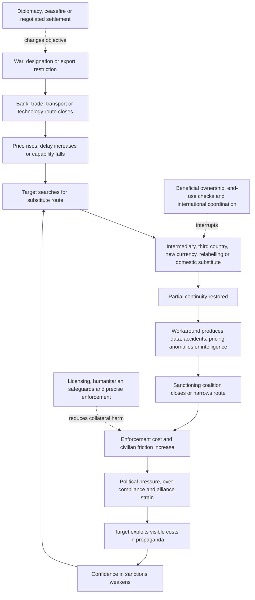

# ⚔️ War, Sanctions And Workarounds  
**First created:** 2026-07-16 | **Last updated:** 2026-07-16  
*Collision-system analysis of how war, sanctions, export controls, payment restrictions, logistics, political pressure, and adaptive workaround systems transmit risk far beyond the formally designated target.*

---

## 🛰️ Orientation

Sanctions are often narrated as a line:

> A state, company, sector, vessel, bank, technology, or individual is restricted.

The actual system is a web.

Restrictions travel through:

- banks
- insurers
- shipping
- ports
- aircraft
- customs
- commodities
- payment systems
- software
- cloud services
- legal advice
- professional services
- trade finance
- supply chains
- third countries
- migrant labour
- humanitarian systems
- political relationships
- public confidence

Workarounds travel through the same systems.

A workaround is not always a hidden criminal payment.

It may be a redesign of:

- ownership
- control
- jurisdiction
- routing
- timing
- documentation
- product description
- end user
- insurer
- currency
- transport mode
- contracting party
- legal argument

until the activity appears to fall outside the restriction, becomes difficult to attribute, or reaches a jurisdiction with weaker enforcement.

The central question is therefore not only:

> Are sanctions working?

It is:

> Which pressure is being imposed, which routes remain open, how does the target adapt, and who finally absorbs the cost?

---

## ✨ Key Features

- Treats sanctions as a transmission system rather than a static blacklist.
- Separates lawful adaptation, circumvention, evasion, and ordinary third-country trade.
- Expands beyond the classic shell-company, offshore-account, and crypto examples.
- Maps shipping, insurance, aviation, commodities, gold, barter, labour, dual-use trade, software, local currencies, and re-export hubs.
- Distinguishes target pressure from civilian, humanitarian, and allied-system costs.
- Tracks the co-evolution of sanctions and workarounds.
- Shows how sanctions enforcement can increase opacity and market concentration.
- Identifies the role of professional intermediaries and ordinary infrastructure.
- Preserves jurisdiction, intent, and evidential discipline.

---

## 🧿 Core Proposition

Sanctions pressure rarely stops at the designated target.

It travels through the systems required to:

- enforce it
- insure it
- finance it
- transport it
- document it
- evade it
- narrate it
- absorb its consequences

The target does not remain passive.

Adaptation may include:

- substitution
- indigenisation
- rerouting
- stockpiling
- concealment
- political bargaining
- coercion
- cost transfer
- alternative settlement
- informal exchange
- legal restructuring

The sanctions system and the workaround system therefore evolve together.

> Every restriction teaches the target something about the enforcement architecture.

A route closed today may become:

- a new intermediary tomorrow
- a third-country trade pattern next month
- a domestic substitute next year
- a political grievance for a decade

---

## 🧱 Material Substrate

The material system includes:

- correspondent banks
- payment networks
- customs systems
- freight forwarders
- ports
- locks
- railways
- roads
- airports
- aircraft lessors
- ship registries
- flag states
- classification societies
- marine insurers
- reinsurers
- commodity traders
- warehouses
- brokers
- refineries
- energy grids
- cloud providers
- software vendors
- chip distributors
- universities
- recruitment agencies
- law firms
- accountants
- trust and company-service providers

A sanctions regime is only as effective as the institutions that can identify, refuse, freeze, inspect, report, and enforce.

---

## 🌦️ Confidence Substrate

Sanctions also depend on confidence in:

- alliance unity
- legal durability
- enforcement consistency
- deterrence
- market compliance
- intelligence quality
- public legitimacy
- political willingness to tolerate costs
- belief that loopholes will be closed
- belief that designated actors cannot simply wait out the coalition

The target may attempt to weaken this confidence by showing:

- continued exports
- stable elite consumption
- substitute imports
- friendly foreign partners
- functioning payment channels
- ineffective enforcement
- rising costs for sanctioning states

Workarounds therefore have a narrative function.

They do not need to replace every restricted flow.

They may only need to prove that isolation is incomplete.

---

## 🧭 Four Different Categories

These should not be collapsed.

### Lawful adaptation

Activity changes in a way permitted by the applicable rules.

Examples may include:

- domestic substitution
- trade in unrestricted goods
- licensed humanitarian activity
- use of an authorised exemption
- lawful withdrawal from a sanctioned market
- redesign of a product that genuinely falls outside a control

### Circumvention

A structure is designed to defeat the purpose of the restriction while attempting to remain formally outside its wording.

### Evasion

Restricted activity is hidden, misrepresented, or conducted in breach of the relevant law.

### Ordinary third-country activity

A third country trades with the target in circumstances not prohibited by its own law or the applicable extraterritorial rules.

Political disapproval is not automatically legal evasion.

> Exposure is not evasion.  
> Association is not proof of control.  
> Trade diversion is a signal, not a verdict.

---

# 🧰 Workaround Catalogue

The catalogue below is deliberately broader than the familiar classics.

Many routes combine several methods.

---

## 🏢 Intermediaries, Fronts And Layered Ownership

Classic routes remain important:

- front companies
- shell companies
- nominee directors
- trusts
- foundations
- layered holding companies
- recently incorporated trading firms
- dormant companies reactivated for trade
- entities with no obvious sector history
- related parties presented as independent
- local partners acting as purchasing agents

The key questions are:

- who owns?
- who controls?
- who benefits?
- who instructed?
- who financed?
- who receives the goods?
- who bears the commercial risk?

A formally separate entity may be operationally dependent.

A connected entity may also conduct legitimate independent business.

Evidence must establish the route.

---

## 🔁 Third-Country Re-Export Hubs

Restricted goods may move through countries that:

- have not adopted the same sanctions
- have weaker export-control enforcement
- serve as regional logistics centres
- retain established trade with both sides
- can plausibly import the goods for domestic use

Indicators may include:

- sudden increases in imports of restricted or high-priority goods
- imports inconsistent with domestic industrial capacity
- new firms with little trading history
- goods routed through multiple jurisdictions
- onward trade shortly after arrival
- unusual changes in destination or consignee
- products sold through distributors with weak end-use controls

A trade surge is a reason to investigate.

It is not automatic proof that every shipment is illicit.

---

## 🧩 Dual-Use Relabelling And Product Substitution

Military and industrial systems often depend on ordinary products.

Potential routes include:

- civilian electronics used in weapons
- machine tools
- sensors
- navigation equipment
- telecommunications components
- drones and drone parts
- vehicle components
- industrial chemicals
- laboratory equipment
- software
- aviation spares

Workarounds may involve:

- false end-use declarations
- altered product codes
- splitting systems into uncontrolled components
- exporting lower-specification substitutes
- relabelling military demand as civilian maintenance
- routing goods through repair or refurbishment markets
- buying consumer products for component extraction
- using obsolete or second-hand equipment
- cannibalising existing machinery

The useful question is not only what the product is called.

It is what capability it provides.

---

## 🛠️ Repair, Refurbishment And Cannibalisation

A restricted system may remain operational through:

- harvesting parts from grounded equipment
- buying used machinery
- obtaining components through maintenance contractors
- reverse engineering
- refurbishing older equipment
- extending service intervals
- using non-certified parts
- adapting civilian components
- purchasing complete consumer goods to extract one component

This is especially relevant to:

- aircraft
- vehicles
- industrial machinery
- telecommunications
- energy infrastructure
- weapons systems

Sanctions can reduce quality and safety without producing immediate failure.

That delay can be mistaken for proof that the restriction had no effect.

---

## ✈️ Aviation Workarounds

Aviation sanctions can generate adaptation through:

- aircraft re-registration
- title disputes
- domestic seizure or retention of leased aircraft
- cannibalisation
- third-country maintenance
- indirect spare-parts purchases
- use of older fleets
- altered flight routes
- intermediary ticketing or charter structures
- wet leasing
- non-standard insurance
- restricted carriers operating through affiliated entities

The sector reveals an important distinction:

> Continued operation is not the same as unchanged capacity.

The relevant indicators include:

- safety
- maintenance intervals
- fleet availability
- insurance
- route access
- spare-part quality
- long-term asset degradation

---

## 🚢 Shadow Fleets And Maritime Obfuscation

Maritime workaround systems may use:

- old vessels
- opaque ownership
- frequent changes of flag
- frequent changes of name
- shell-company ownership
- weak or unknown insurance
- ship-to-ship transfer
- false location data
- disabled or manipulated tracking
- route anomalies
- blending of cargo
- false cargo documentation
- use of permissive ports
- changes in classification
- complex chartering chains
- direct deliveries misreported as ordinary trade

The workaround may transfer risk onto:

- crews
- coastal communities
- other vessels
- insurers
- taxpayers
- the marine environment

A sanctions workaround can therefore become a maritime-safety system.

---

## 🛢️ Commodity Blending And Origin Laundering

Commodities can lose visible origin through:

- blending
- refining
- processing
- repackaging
- relabelling
- transshipment
- transformation into derivative products
- sale through an intermediary trader
- use of certificates that identify the last processing state rather than the original source

This may affect:

- oil
- petroleum products
- metals
- gold
- diamonds
- timber
- coal
- agricultural goods
- petrochemicals

The relevant question is:

> At what point does processing alter the legal origin, and at what point does it merely obscure it?

The answer depends on the applicable regime.

---

## 🪙 Gold, Diamonds And Portable Value

Portable commodities can function as:

- stores of value
- settlement
- collateral
- trade goods
- reserve substitutes
- elite wealth
- methods of moving value outside ordinary banking

Routes may include:

- informal dealers
- neighbouring markets
- artisanal supply chains
- refineries
- jewellery trade
- under-invoicing
- false certificates of origin
- mixing sanctioned and unsanctioned production
- payment in kind

Gold is especially useful where actors distrust:

- banks
- currencies
- payment networks
- asset-freeze exposure

But a gold transaction is not automatically illicit.

Trace source, custody, documentation, counterparty, and applicable law.

---

## 🔄 Barter, Swaps And Countertrade

Restrictions on money do not eliminate exchange.

Actors may use:

- commodity-for-commodity swaps
- energy-for-goods arrangements
- arms-for-resources
- oil-for-services
- debt cancellation
- reciprocal state procurement
- clearing accounts
- offset agreements
- triangular trade

Barter can obscure price and value.

It can also be a lawful response to lack of conventional settlement.

The analytical challenge is to identify:

- actual consideration
- valuation
- connected contracts
- hidden subsidy
- sanctions exposure
- final beneficiary

---

## 💱 Local Currencies And Alternative Settlement

Workarounds may involve:

- bilateral local-currency settlement
- currency swaps
- clearing arrangements
- payment through regional banks
- netting
- offshore currency markets
- central-bank arrangements
- digital currencies
- stablecoins
- informal value-transfer systems

Alternative settlement can reduce dependence on:

- the dollar
- euro clearing
- SWIFT-connected institutions
- Western correspondent banks

This does not make the route unlawful.

It changes:

- visibility
- enforcement leverage
- currency risk
- counterparty risk
- geopolitical dependence

---

## 🪙 Crypto, Stablecoins And Digital Settlement

Virtual assets may be used for:

- cross-border payment
- remittances
- fundraising
- reserve movement
- procurement
- ransomware or cybercrime proceeds
- sanctions-evasion attempts
- ordinary civilian survival under banking restrictions

Methods may include:

- unhosted wallets
- mixers
- chain hopping
- peer-to-peer brokers
- offshore exchanges
- stablecoins
- decentralised services
- over-the-counter desks

Important limits:

- wallet movement is not beneficial ownership
- crypto use is not automatically criminal
- stablecoin use in a sanctioned country is not automatically evasion
- public blockchain data may show movement without proving purpose

See [`🪙_crypto_and_stablecoin_lobbying.md`](./🪙_crypto_and_stablecoin_lobbying.md).

---

## 🏦 Small Banks, Regional Banks And Payment Fragments

Large international banks may withdraw quickly.

Workarounds may move through:

- smaller banks
- regional banks
- newly licensed institutions
- non-bank payment providers
- lightly supervised finance companies
- banks with limited Western exposure
- correspondent chains
- multiple small payments
- payment fragmentation

The system may become:

- less efficient
- more expensive
- more opaque
- more concentrated in specialist intermediaries

Financial exclusion can create a market for actors willing to accept high compliance and enforcement risk.

---

## 🧾 Trade-Based Financial Workarounds

Value can be moved through trade using:

- over-invoicing
- under-invoicing
- false invoicing
- phantom shipments
- multiple invoicing
- misdescription
- manipulated quantity
- manipulated quality
- related-party pricing
- false freight or insurance charges

A payment may look like ordinary trade finance.

The goods and money may tell different stories.

This requires comparison between:

- invoice
- customs declaration
- physical shipment
- market price
- insurance
- freight
- end user
- bank payment

---

## 🧠 Intellectual Property, Software And Remote Services

Not all restricted capability crosses a physical border.

It may move through:

- software downloads
- remote access
- cloud accounts
- source code
- technical manuals
- model weights
- design files
- consulting
- engineering support
- online training
- licence keys
- maintenance credentials
- remote diagnostics

Controls designed around physical goods may struggle with:

- distributed teams
- digital delivery
- open-source components
- outsourced services
- cloud regions
- account sharing

The border may be an authentication system rather than a port.

---

## 🎓 Academic, Scientific And Professional Channels

Technical capacity may move through:

- joint research
- conferences
- visiting appointments
- laboratories
- professional associations
- student placements
- academic publishing
- consulting
- engineering firms
- specialist recruitment

These channels can be:

- lawful
- beneficial
- humanitarian
- scientifically valuable

They can also create:

- knowledge transfer
- procurement contacts
- access to restricted equipment
- dual-use capability

Blanket suspicion damages science and civil society.

The correct approach is specific, proportionate, and evidence-led.

---

## 👷 Labour, Recruitment And Human Capital

Workaround systems may import expertise rather than equipment.

Possible routes include:

- recruitment of engineers
- foreign technical contractors
- migrant labour
- military recruitment
- private military companies
- specialist diaspora networks
- remote work
- false job descriptions
- labour supplied through third countries

Human-capital routes reveal why sanctions analysis cannot be reduced to goods and banks.

Capability travels in people.

The cost may be carried by workers through:

- coercion
- poor conditions
- passport control
- withheld pay
- conflict exposure
- legal precarity

---

## 🪪 Citizenship, Residency And Identity Documents

Restricted actors may seek:

- second citizenship
- residency
- investment visas
- nominee residency
- passports through intermediaries
- changed names or transliterations
- alternative corporate identities

Identity complexity may be legitimate.

It may also make screening more difficult.

Do not treat:

- dual nationality
- transliteration differences
- migration
- diaspora status

as evidence of evasion.

The question is whether identity or documentation is being deliberately used to conceal a restricted person’s control or benefit.

---

## 🏠 Property, Art And Luxury Goods

Value may be stored or transferred through:

- real estate
- art
- yachts
- aircraft
- jewellery
- collectibles
- luxury vehicles
- private clubs
- trusts
- family offices

Possible mechanisms include:

- nominee ownership
- related-party sales
- artificial valuation
- free use without formal ownership
- leasing
- gifts
- beneficial enjoyment through associates

Formal title may not reveal practical benefit.

Practical benefit alone does not prove ownership.

---

## 🧑‍⚖️ Legal, Accounting And Professional-Service Arbitrage

Professional intermediaries may assist with:

- restructuring
- sanctions advice
- licensing
- trusts
- corporate formation
- asset sales
- litigation
- arbitration
- insolvency
- compliance systems
- residency
- beneficial-ownership filings

Most of this work is lawful and necessary.

The risk arises where professional expertise is used to:

- conceal control
- create sham independence
- mislead financial institutions
- defeat reporting
- move assets after designation
- fabricate compliance

Sanctions systems can fail through ordinary letterhead.

---

## 🛡️ Insurance, Reinsurance And Alternative Risk

Trade may continue through:

- non-Western insurers
- state guarantees
- self-insurance
- captive insurers
- weakly capitalised providers
- altered cargo descriptions
- fragmented insurance chains
- uninsured operation
- indemnities hidden in other contracts

Removing conventional insurance may not stop movement.

It may transfer catastrophic risk onto:

- crews
- ports
- coastal states
- customers
- governments
- victims of accidents

---

## 🚪 Free Zones, Warehouses And Transit Regimes

Workarounds may exploit:

- free-trade zones
- bonded warehouses
- transshipment hubs
- temporary import regimes
- inward-processing relief
- duty suspension
- re-export procedures
- parcel and postal systems

These structures are designed to facilitate trade.

Their speed and complexity can make end-use verification difficult.

The route may be hidden in the gap between:

- arrival
- storage
- repackaging
- processing
- onward shipment

---

## 📦 Small Parcels And Distributed Procurement

Large controlled systems may be assembled from many small shipments.

Possible routes include:

- online marketplaces
- postal parcels
- courier services
- purchases by individuals
- distributed buyer networks
- repeated low-value orders
- consumer electronics
- component-level procurement

Each shipment may appear unremarkable.

The capability emerges only after aggregation.

This is the logistics equivalent of structuring payments below scrutiny thresholds.

---

## ⏳ Timing, Stockpiling And Front-Loading

Actors may adapt before sanctions enter into force by:

- stockpiling
- accelerating contracts
- prepaying suppliers
- moving reserves
- changing ownership
- shifting vessels
- securing long-term licences
- building domestic inventories

After restrictions begin, they may:

- draw down reserves
- delay maintenance
- ration components
- prioritise strategic sectors
- wait for political change

A delayed effect is not necessarily an absent effect.

Sanctions clocks are often slower than news clocks.

---

## 🧱 Domestic Substitution And Forced Indigenisation

Sanctions may accelerate:

- local manufacturing
- reverse engineering
- import substitution
- state subsidy
- technology transfer from partners
- standard simplification
- reduced quality requirements
- informal repair economies

This may create:

- genuine resilience
- lower quality
- higher cost
- new monopolies
- political patronage
- industrial learning

A workaround can become an industrial policy.

That does not mean it fully restores the lost capability.

---

## 🌍 Jurisdiction Shopping And Legal Fragmentation

Actors may choose:

- a country with no matching sanctions
- a country with weaker enforcement
- a court with favourable ownership rules
- an arbitration forum
- a flag state
- a registry
- a bank with limited exposure
- a legal form not covered by the original wording

Sanctions are jurisdiction-specific.

A transaction may be:

- prohibited for one actor
- lawful for another
- reportable in one country
- invisible in another

The phrase “sanctions violation” is incomplete without naming the legal regime.

---

## 🧑‍🤝‍🧑 Humanitarian And Civilian Channels

Humanitarian exemptions are essential.

They may cover:

- food
- medicine
- relief operations
- civil-society activity
- remittances
- essential infrastructure

Problems can still arise through:

- bank over-compliance
- delayed licences
- fear of enforcement
- diversion
- taxation by armed actors
- dual-use concerns
- procurement opacity

A humanitarian channel may be abused.

That does not justify treating humanitarian activity itself as suspect.

The system must distinguish:

- exemption
- diversion
- incidental benefit
- coercive extraction
- deliberate evasion

---

# 🧭 Examples Beyond The Classics

A useful node should therefore include examples such as:

- consumer electronics purchased for component harvesting
- aircraft kept flying through cannibalisation
- oil origin blurred through blending or refining
- ships repeatedly renamed and reflagged
- cargo transferred at sea
- old tankers moved into opaque ownership structures
- gold used as settlement or collateral
- barter and countertrade replacing bank payment
- local-currency clearing
- small regional banks replacing global banks
- free zones used for repackaging and re-export
- remote software support replacing physical delivery
- engineers recruited where machinery cannot be imported
- small parcels aggregated into controlled capability
- luxury assets enjoyed through nominees without formal title
- insurance replaced with state guarantees or self-insurance
- front-loaded stockpiling before restrictions begin
- humanitarian exemptions delayed by over-compliance
- domestic substitution creating lower-quality but usable alternatives
- propaganda turning partial workaround success into proof of sanctions failure

The pattern is broader than secret accounts.

It is infrastructure adapting.

---

# ⚔️ War As A Workaround Accelerator

War increases demand for:

- speed
- secrecy
- redundancy
- substitute supply
- political loyalty
- risk tolerance
- state intervention

Ordinary commercial inefficiency may become acceptable where the objective is:

- military continuity
- regime survival
- energy revenue
- elite stability
- strategic autonomy

A workaround that would be commercially irrational in peacetime may be strategically valuable in war.

This is why price alone does not measure success.

A target may accept:

- higher cost
- lower quality
- slower delivery
- more accidents
- greater corruption

to preserve essential capability.

---

## 🧨 Sanctions As Market-Making

Sanctions do not only remove markets.

They can create new ones.

They may generate premiums for:

- risk-tolerant traders
- opaque shipping
- alternative insurance
- specialist lawyers
- compliance consultants
- regional banks
- smugglers
- document providers
- politically connected intermediaries

The restriction raises the value of access.

This can enrich actors who are:

- closer to the state
- willing to accept legal risk
- able to operate across jurisdictions
- protected from competition

Sanctions can therefore increase:

- concentration
- corruption
- patronage
- intermediary power

even while reducing the target’s overall economic capacity.

---

## 🔁 The Adaptation Loop

The loop may continue for years.

Neither side receives a final answer from one enforcement action.

---

## 🕰️ Relevant Clocks

Track:

- political announcement
- legal adoption
- entry into force
- wind-down period
- licence
- designation
- implementation
- bank withdrawal
- customs enforcement
- stock depletion
- substitution
- intelligence discovery
- enforcement action
- court challenge
- alliance review
- humanitarian effect
- military effect
- ceasefire
- reconstruction

The announcement clock is not the implementation clock.

The implementation clock is not the depletion clock.

The depletion clock is not the strategic-effect clock.

---

## 🔗 Transmission Routes

Stress may move through:

- trade
- banking
- shipping
- insurance
- energy
- food
- aviation
- technology
- labour
- remittances
- procurement
- political finance
- media
- public services
- humanitarian systems

Use the sequence:

1. originating restriction or war pressure
2. affected capability
3. carrier
4. workaround route
5. enforcement response
6. observable consequence
7. final cost bearer

---

## 💥 Collision Points

### Crypto and stablecoins

- alternative settlement
- stablecoin use
- wallet tracing
- sanctions compliance
- civilian banking access

### AI and advanced technology

- chips
- cloud access
- export controls
- remote services
- dual-use models
- compute infrastructure

### Far-right political finance

- sanctions scepticism
- donor provenance
- energy interests
- foreign-policy alignment
- alternative financial rails

### Media and platforms

- propaganda
- workaround success stories
- false claims of total isolation
- false claims of total ineffectiveness
- open-source tracking
- disinformation

### Civil liability

- asset freezes
- ownership
- insurance
- contractual frustration
- seizure
- enforcement
- environmental damage

---

## 🧯 Amplifiers

- weak beneficial-ownership systems
- inconsistent allied rules
- unclear guidance
- poor customs capacity
- fragmented data
- permissive registries
- thinly regulated intermediaries
- political corruption
- over-compliance
- humanitarian banking withdrawal
- commodity fungibility
- opaque insurance
- high intermediary profit
- weak end-use checks
- long supply chains
- pressure for symbolic announcements

## 🛡️ Buffers

- precise legal drafting
- coordinated implementation
- beneficial-ownership transparency
- end-use verification
- customs intelligence
- shipping and insurance data
- clear licensing
- humanitarian safeguards
- due-process review
- proportionate enforcement
- allied cost sharing
- public explanation
- sunset and review mechanisms
- diplomatic strategy
- reconstruction planning

---

## 🛠️ Diagnostic Tools

### Objective

- What is the sanction intended to change?
- Revenue?
- procurement?
- elite behaviour?
- military capacity?
- negotiation?

### Legal scope

- Which jurisdiction?
- Which actor?
- Which goods, services, funds, or conduct?
- Which exemptions?

### Material route

- What physical or digital system carries the restricted activity?
- Bank?
- vessel?
- software?
- labour?
- commodity?

### Workaround

- Is this substitution, rerouting, concealment, or ordinary lawful trade?
- What evidence establishes purpose?

### Capacity

- Does the workaround fully replace the lost route?
- Or merely preserve a degraded capability?

### Cost

- Who pays the premium?
- The target state?
- civilians?
- workers?
- allies?
- households?
- the environment?

### Time

- Is the effect immediate, cumulative, delayed, or reversible?

### Narrative

- Is partial continuity being presented as total sanctions failure?
- Is visible pain being presented as strategic success without evidence?

---

## ⚖️ Evidence Discipline

Preserve the distinctions:

- exposure is not evasion
- third-country trade is not automatically unlawful
- a trade surge is not proof shipment by shipment
- crypto use is not automatically criminal
- a shell company is not automatically a front
- nominee ownership is not proof of sanctioned control
- humanitarian activity is not presumptively diversion
- ship-to-ship transfer is not always prohibited
- altered routing is not always concealment
- sanctions pressure is not proof of strategic effect
- continued operation is not unchanged capacity
- higher cost is not the same as failure
- a legal exemption is not a loophole merely because it permits activity
- intelligence claims require attribution and appropriate caution

Use categories such as:

- designation
- legal prohibition
- licence
- customs data
- ownership record
- transaction
- vessel behaviour
- trade anomaly
- enforcement allegation
- court finding
- intelligence assessment
- analytical inference
- unresolved question

---

## 🧪 What Would Disconfirm The Concern?

Evidence that sanctions are more effective and contained may include:

- measurable loss of restricted capability
- sustained depletion
- inability to replace components
- reduced revenue
- lower military output
- effective allied coordination
- falling circumvention premiums
- successful enforcement against intermediaries
- limited civilian spillover
- functioning humanitarian channels
- clear legal compliance
- negotiated policy change

Evidence that a suspected route is lawful may include:

- credible domestic end use
- independent counterparties
- transparent ownership
- normal trade patterns
- valid licensing
- documented humanitarian purpose
- no onward movement
- compliance with applicable jurisdiction

A workaround hypothesis should remain falsifiable.

---

## ✨ Working Rules

> Sanctions pressure rarely stops at the designated target.

> Every restriction teaches the target something about the enforcement architecture.

> The workaround is often not a secret account.  
> It is infrastructure adapting.

> Continued operation is not the same as unchanged capacity.

> Trade diversion is a signal, not a verdict.

> A transaction cannot violate “sanctions” in the abstract.  
> Name the jurisdiction, rule, actor, and conduct.

> Sanctions can remove markets.  
> They can also manufacture profitable intermediaries.

> Humanitarian exemptions are safeguards, not embarrassing loopholes.

> The question is not only whether the target pays.  
> It is who else is made to carry the pressure.

---

## 🌌 Constellations

⚔️ 🚢 ✈️ 🛢️ 🏦 🪙 🧩 🧾 — war pressure; shadow fleets; aviation; commodities; banks; alternative settlement; dual-use trade; documentation.

---

## ✨ Stardust

war, sanctions, circumvention, evasion, shadow fleets, dual use, re-export, trade finance, aviation, insurance, gold, barter, local currencies, crypto, humanitarian exemptions

---

## 📚 Source Anchors

The analytical typologies in this node are consistent with recent official material including:

- FATF, *Complex Proliferation Financing and Sanctions Evasion Schemes* — intermediaries, beneficial-ownership opacity, virtual assets and technology, maritime and shipping exploitation.
- UK Government, *Countering Russian sanctions evasion: guidance for exporters* — circumvention indicators and exporter due diligence.
- European Council and Council of the EU sanctions materials — third-country entities, re-export controls, no-re-export clauses, ports, banks, crypto providers, shadow fleets, and targeted anti-circumvention measures.
- UN Security Council Panel of Experts reports on the DPRK — ship-to-ship transfer, maritime obfuscation, front and shell companies, and financial-network adaptation.

These sources describe enforcement concerns. They do not establish that every activity resembling a typology is unlawful.

---

## 🏮 Footer

*War, Sanctions And Workarounds* is a living node of the **Polaris Protocol**.  
It maps how restrictions travel through banking, trade, shipping, technology, labour, insurance, and humanitarian systems—and how targets, intermediaries, firms, and states redesign those routes in response.  
Its purpose is to distinguish lawful adaptation from evasion, visible continuity from unchanged capacity, and pressure on a designated target from the wider costs exported into civilian and international systems.

> 📡 Cross-references:
>
> - [`README.md`](./README.md) — *Collision Systems cluster route and collision map*
> - [`🪙_crypto_and_stablecoin_lobbying.md`](./🪙_crypto_and_stablecoin_lobbying.md) — *alternative settlement, stablecoins, wallet evidence, and political rails*
> - [`🤖_ai_market_confidence.md`](./🤖_ai_market_confidence.md) — *chips, cloud access, export controls, infrastructure, and strategic urgency*
> - [`💰_far_right_political_finance.md`](./💰_far_right_political_finance.md) — *political donors, foreign-policy alignment, and financial repricing*
> - [`📺_media_ownership_and_platform_power.md`](./📺_media_ownership_and_platform_power.md) — *propaganda, visibility, and the narration of effectiveness*
> - [`🧾_donor_provenance_and_civil_liability.md`](./🧾_donor_provenance_and_civil_liability.md) — *ownership, source of funds, asset freezes, and enforcement*
> - [`💸_can_the_assets_carry_the_risk.md`](./💸_can_the_assets_carry_the_risk.md) — *liquidity, jurisdiction, insurance, and final cost bearing*
> - [`🔗_risk_transmission_between_systems.md`](../🌀_Core_Model/🔗_risk_transmission_between_systems.md) — *carriers, routes, consequences, and cost bearers*
> - [`🌐_cross_border_feedback_loops.md`](../🌀_Core_Model/🌐_cross_border_feedback_loops.md) — *international adaptation, validation, and returned political claims*
> - [`⏱️_temporal_hygiene_rhythm_not_panic.md`](../🌀_Core_Model/⏱️_temporal_hygiene_rhythm_not_panic.md) — *announcement, implementation, depletion, and strategic-effect clocks*
>
> 🏮 Return To:
>
> - [`👹_Collision_Systems`](./) — *current substantive cluster*
> - [`🗻_The_Manifestation_Molehill`](../) — *media-facing pack on fragile confidence systems and democratic coverage under overload*
> - [`👻_Ghosts_Of_Accountability`](../../) — *parent accountability cluster*
> - [`📲_Press_Matters`](../../../) — *press and media-analysis layer*
> - [`🌓_3_In_The_Moment`](../../../../) — *current-events and active-pattern layer*

*Survivor authorship is sovereign. Containment is never neutral.*

_Last updated: 2026-07-16_
