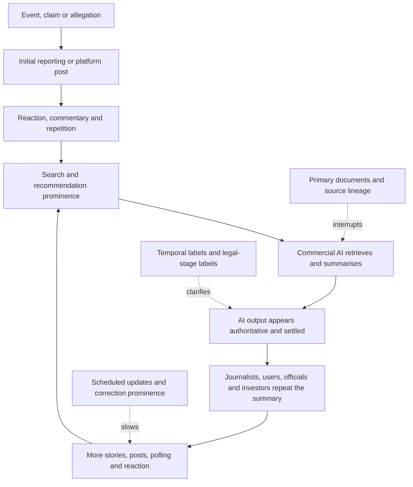

# 🌫️ Public Distrust And Algorithmic Overload  
**First created:** 2026-07-17 | **Last updated:** 2026-07-17  
*Collision-system analysis of how contradictory timelines, repeated claims, algorithmic ranking, synthetic content, commercial pressure, and weakened verification turn complex risk into public fog.*

---

## 🛰️ Orientation

The public does not experience colliding systems as a diagram.

It experiences them as weather:

- pressure
- noise
- contradiction
- interruption
- repetition
- urgency
- exhaustion
- the suspicion that nothing can be known in time to matter

A person may encounter, in one hour:

- a political allegation
- a market reaction
- a platform trend
- an AI summary
- a legal filing
- a correction
- a rumour
- a historical clip presented as current
- an institutional denial
- a new story built from reactions to the first story

The information is not necessarily all false.

The problem is that it arrives without stable sequence, weight, jurisdiction, or stopping rules.

The result is not simply ignorance.

It is ranking failure.

People may know many facts and still be unable to decide:

- which fact came first
- which source is independent
- which process is complete
- which claim is material
- which risk is immediate
- which signal can safely be ignored

> The public experiences colliding systems not as a diagram, but as weather.

---

## ✨ Key Features

- Treats distrust as both a rational response to institutional failure and a vulnerability to manipulation.
- Separates information volume from understanding.
- Explains how reaction, repetition, and algorithmic prominence can simulate corroboration.
- Maps conflicting clocks across media, courts, markets, regulators, politics, and platforms.
- Connects commercial AI to recursive summaries and synthetic consensus.
- Identifies local-journalism loss and newsroom pressure as verification failures.
- Shows how overload produces withdrawal, panic, conspiratorial compression, and fatalism.
- Provides buffers that allow people to disengage without abandoning democratic judgment.
- Preserves the distinction between overload, coordination, distrust, and proof.

---

## 🧿 Core Proposition

Public distrust grows when institutions repeatedly ask people to accept conclusions before the underlying process is visible.

Algorithmic overload intensifies that distrust by rewarding:

- recency
- emotional intensity
- controversy
- repetition
- engagement
- identity conflict
- apparent certainty

The public then faces a double bind.

It is told:

> Pay attention. This is urgent.

And simultaneously:

> Do not draw conclusions yet. The process is incomplete.

Both may be true.

But without temporal hygiene and evidence labels, the combination becomes intolerable.

The result is a public that may:

- overreact
- disengage
- flatten everything into conspiracy
- treat every institution as equally deceptive
- mistake cynicism for sophistication
- become vulnerable to actors offering total explanations

The solution is not more volume.

It is better structure.

---

## 🧱 Material Substrate

The material system includes:

- social platforms
- search engines
- recommendation systems
- notification systems
- commercial AI tools
- newsrooms
- local newspapers
- public broadcasters
- courts
- regulators
- government communications
- polling
- analytics
- moderation teams
- data brokers
- archives
- content farms
- advertising systems
- public-relations firms

The public-information environment is therefore built from institutions with different incentives, capacities, and clocks.

---

## 🌦️ Confidence Substrate

The confidence layer includes beliefs such as:

- trending means important
- repeated means corroborated
- silence means concealment
- a delay means bad faith
- a filing means guilt
- a denial means innocence
- an AI summary means consensus
- high engagement means public support
- criticism means persecution
- withdrawal means apathy
- cynicism means independence

These beliefs can become self-reinforcing.

A person who distrusts everything may become more dependent on the one source that claims to explain everything.

> Total distrust does not produce independence.  
> It can produce captivity to the most emotionally complete narrative.

---

# 🌫️ The Fog Problem

The public-information fog is created by the interaction of:

- too many inputs
- too little sequencing
- unclear source lineage
- conflicting institutional clocks
- weak correction systems
- algorithmic repetition
- collapsing local verification
- synthetic content
- commercial incentives for speed

The fog does not require a central controller.

It can emerge from each institution doing what its incentives reward.

---

## 🔁 Reaction Presented As Development

A common sequence is:

1. event occurs
2. outlet reports
3. politician reacts
4. market reacts
5. influencer reacts
6. regulator says it is monitoring
7. AI summarises the reactions
8. media report that concern is growing

The number of stories increases.

The amount of underlying evidence may not.

Reaction is politically meaningful.

It should not be confused with a new material development.

---

## 🕰️ Old Material Presented As New

Algorithmic systems often resurface:

- old clips
- previous allegations
- resolved cases
- archived documents
- earlier speeches
- historical images

The resurfacing may be useful.

It may also collapse:

- event date
- publication date
- recognition date
- current relevance

A person may encounter an old item without context and experience it as a new event.

That can produce false urgency.

---

## 🪞 Synthetic Corroboration

Synthetic corroboration occurs when apparently separate sources derive from the same original claim.

Examples:

- multiple articles based on one press release
- multiple posts based on one clip
- AI summaries of coverage based on the same source
- commentary on commentary
- polling questions shaped by the media frame
- new reports about the existence of prior reports

The reference count rises.

The evidential base may remain one item.

> Repetition can enlarge confidence without enlarging evidence.

---

## 📲 Notification Conditioning

Notifications convert public life into interruption.

They privilege:

- urgency
- novelty
- fear
- conflict
- social response

A person may begin to associate the notification itself with:

- threat
- obligation
- the need to check
- the possibility of missing danger

This weakens the ability to rank information calmly.

The system becomes less like reading and more like repeated alarm exposure.

---

# 🤖 Commercial AI And Recursive Authority

Commercial AI can intensify overload by:

- summarising incomplete reporting
- flattening claims and findings
- retrieving synthetic content
- merging jurisdictions
- compressing timelines
- presenting uncertainty in authoritative prose
- producing more content from already repeated content

The model may be accurate about what the information environment says.

That does not mean the information environment is independently corroborated.

## Recursive authority loop

The model is not necessarily inventing the claim.

It may be stabilising a recursively manufactured frame.

---

# 🗞️ Newsroom Pressure And Verification Loss

Newsrooms under commercial pressure may become more dependent on:

- wire copy
- press releases
- platform trends
- cheap commentary
- personality interviews
- rapid explainers
- automated summaries
- high-volume publishing

The work most likely to disappear is:

- court reporting
- source development
- local reporting
- archival checking
- legal review
- specialist beats
- long investigations
- careful correction

This produces a paradox.

The information environment becomes more crowded while the verification base becomes thinner.

---

## 🏚️ Local Journalism As A Buffer

Local journalism can answer questions national systems often cannot:

- did the event actually happen here?
- does the organisation have real local structure?
- who attended?
- what does the court record say?
- what did the council decide?
- does the national claim match local reality?

When local reporting disappears, national personalities and platform narratives face fewer grounded checks.

The collapse of local journalism is therefore not only a media problem.

It is a public-reality problem.

---

# 🧠 Ranking Failure

Overload is not simply having too much information.

It is losing the ability to rank:

- source
- evidence
- time
- jurisdiction
- consequence
- reversibility
- urgency

A person may know more facts than before while understanding less.

## Common ranking collapses

- allegation treated as finding
- filing treated as judgment
- market movement treated as proof
- platform trend treated as consensus
- visibility treated as legitimacy
- criticism treated as evidence of persecution
- delay treated as conspiracy
- silence treated as innocence
- emotional intensity treated as importance

The answer is not to eliminate emotion.

It is to stop using emotional intensity as the only ranking system.

---

# 🧨 Conspiratorial Compression

Conspiratorial compression occurs when many interacting systems are collapsed into one intentional actor.

The move is understandable.

A single actor is easier to imagine than:

- market incentives
- ownership structures
- platform design
- political opportunism
- regulatory delay
- institutional fear
- professional error
- cross-border feedback
- commercial AI recursion

But compression creates new errors.

It can transform:

- coordination into omnipotence
- correlation into control
- failure into design
- ambiguity into proof
- every contradiction into confirmation

The challenge is to preserve real power analysis without inventing total control.

> A system can be coercive, self-reinforcing, and dangerous without being centrally orchestrated.

---

## 🕸️ Coordination, Convergence And Incentive

Distinguish:

### Coordination

Actors deliberately plan together.

### Convergence

Actors independently move toward similar behaviour.

### Incentive alignment

Different actors respond similarly because the system rewards the same outcome.

### Contagion

One actor’s behaviour changes another’s expectations.

### Imitation

Actors copy a visible strategy.

These can produce similar public effects.

They require different evidence.

---

# 🧍 Public Consequences

Algorithmic overload can produce:

- withdrawal
- panic
- hypervigilance
- doomscrolling
- compulsive checking
- fatalism
- rage
- numbness
- distrust
- social fragmentation
- inability to re-enter public life

## Withdrawal

A person may stop following news because the volume is intolerable.

That does not mean apathy.

It may be self-protection.

## Panic

A person may treat every update as a direct threat because the system provides no stable hierarchy.

## Cynicism

A person may decide that nothing is true.

This can feel safer than repeatedly being deceived.

## Conspiratorial certainty

A total explanation may become attractive because it reduces ambiguity.

## Fatalism

A person may believe no action matters because every system appears captured.

These are democratic consequences.

---

# 🌍 Some Distrust Is Earned

The node must not treat public distrust as a cognitive defect.

Distrust can be earned through:

- institutional lying
- delayed disclosure
- abusive secrecy
- regulatory failure
- media capture
- legal inequality
- corruption
- unsafe technology
- poor correction
- repeated abandonment

The task is not to restore confidence by messaging.

It is to build trustworthy conduct.

> Distrust cannot be cured by branding the distrusted institution as trustworthy.

---

## 🧯 Trust Repair

Trust repair requires:

- timely disclosure
- visible correction
- honest uncertainty
- process explanation
- evidence labels
- consequences for wrongdoing
- independent review
- local accountability
- realistic promises
- the ability to say “we do not know yet”

Trust is not a tone.

It is a record.

---

# 💰 Collision With Far-Right Political Finance

Far-right movements can benefit from overload because they offer:

- simple enemies
- total explanations
- emotional certainty
- identity
- a promise to punish complexity
- contempt for procedural delay

Political finance then supports:

- content volume
- personalities
- legal defence
- platform distribution
- media access
- influencer networks

Overload makes the audience easier to capture because people want relief from ambiguity.

See [`💰_far_right_political_finance.md`](./💰_far_right_political_finance.md).

---

# 🪙 Collision With Crypto And Meme Finance

Meme finance converts:

- hype into price
- price into public proof
- holding into identity
- criticism into attack

Algorithmic repetition intensifies that loop.

The coin becomes a scoreboard.

Commercial AI becomes a spokesperson.

See [`🪙_crypto_and_stablecoin_lobbying.md`](./🪙_crypto_and_stablecoin_lobbying.md).

---

# 🤖 Collision With AI Market Confidence

AI-market confidence depends partly on:

- adoption claims
- media repetition
- benchmark visibility
- commercial AI summaries
- national-competitiveness narratives

Public overload makes it harder to distinguish:

- pilot
- deployment
- adoption
- revenue
- profit
- valuation

See [`🤖_ai_market_confidence.md`](./🤖_ai_market_confidence.md).

---

# ⚔️ Collision With War And Sanctions

War and sanctions produce:

- rapid claims
- classified evidence
- propaganda
- market reaction
- legal restrictions
- humanitarian consequences
- delayed strategic effects

The public may encounter all clocks at once.

This creates pressure to decide before:

- attribution is complete
- implementation occurs
- depletion becomes visible
- courts review the action
- humanitarian effects are measured

See [`⚔️_war_sanctions_and_workarounds.md`](./⚔️_war_sanctions_and_workarounds.md).

---

# 📺 Collision With Media And Platform Power

Media and platforms determine:

- which stories remain visible
- which reactions become stories
- which corrections are buried
- which personalities become unavoidable
- which metrics are interpreted as public demand

See [`📺_media_ownership_and_platform_power.md`](./📺_media_ownership_and_platform_power.md).

---

# 🧾 Collision With Donor Provenance And Civil Liability

Civil and regulatory processes move slowly.

Public narratives move fast.

This produces common collapses:

- allegation into guilt
- filing into finding
- association into liability
- wealth into collectability
- settlement into admission
- silence into exoneration

See [`🧾_donor_provenance_and_civil_liability.md`](./🧾_donor_provenance_and_civil_liability.md).

---

## 🕰️ Relevant Clocks

Track:

- event
- publication
- virality
- recognition
- reaction
- correction
- legal filing
- regulator review
- judgment
- implementation
- consequence
- archive resurfacing
- AI retrieval
- public memory

The fastest clock is often the least evidentially complete.

The slowest clock may arrive after public attention has moved on.

---

## 🔗 Transmission Routes

Overload may move through:

- notification
- search
- recommendation
- broadcast
- social sharing
- reaction coverage
- AI summary
- political speech
- market movement
- legal process
- institutional silence
- correction

Use the sequence:

1. originating claim or event
2. carrier
3. amplification route
4. receiving public
5. ranking failure
6. behavioural consequence
7. democratic cost

---

## 🧯 Amplifiers

- constant notifications
- weak local journalism
- high-volume synthetic content
- opaque recommendation
- media-cycle capture
- poor source lineage
- low correction prominence
- conflicting jurisdictions
- rapid reaction reporting
- personality-driven news
- commercial pressure for certainty
- public institutions refusing to explain process
- repeated exposure to unresolved threat
- treating all disengagement as ignorance

## 🛡️ Buffers

- local journalism
- primary documents
- source lineage
- timelines
- scheduled updates
- evidence labels
- legal-stage labels
- correction prominence
- independent review
- public-interest broadcasting
- algorithmic user control
- notification limits
- trusted intermediaries
- permission to disengage temporarily
- clear re-entry routes
- institutional honesty

---

## 🛠️ Diagnostic Tools

### Source

- What is the original source?
- Is this independent reporting or repetition?

### Time

- When did the event occur?
- When was it published?
- Is the item resurfaced?

### Stage

- Allegation?
- investigation?
- filing?
- finding?
- judgment?
- enforcement?

### Jurisdiction

- Which court, regulator, country, platform, or market?

### Signal

- Is this an event, reaction, market move, comment, or correction?

### Algorithm

- Why am I seeing this?
- Search?
- recommendation?
- notification?
- repost?
- paid promotion?

### AI

- Is the summary based on primary material?
- Are sources independent?
- Is uncertainty preserved?

### Consequence

- What changed materially?
- Money?
- policy?
- law?
- capacity?
- behaviour?

### Personal load

- Do I need this information now?
- Is there a later scheduled update?
- Can I safely stop?

---

## 🧭 A Public Ranking Ladder

When overwhelmed, rank information in this order:

1. **Primary event or document**
2. **Independent verification**
3. **Institutional process**
4. **Material consequence**
5. **Reaction**
6. **Commentary**
7. **Algorithmic prominence**

This is not absolute.

It is a stabilising default.

---

# 🧹 Exit Without Surrender

People need permission to step away without being told they have abandoned democracy.

Healthy disengagement may include:

- checking at set times
- using one reliable summary
- muting notifications
- avoiding reaction coverage
- returning when a process reaches a real stage
- asking someone trusted to flag material change
- reading primary documents later
- distinguishing personal safety from general political urgency

The goal is not permanent withdrawal.

It is regulated re-entry.

> You do not have to absorb the whole information system in real time to remain politically awake.

---

## 🧭 Re-Entry Questions

Before returning, ask:

- Has anything materially changed?
- Is there a primary document?
- Has a court, regulator, or institution acted?
- Is this still reaction coverage?
- Has the original claim been corrected?
- Is the story relevant to my actual decisions?
- Can I wait for a scheduled update?

This turns re-entry into a choice rather than a compulsion.

---

## ⚖️ Evidence Discipline

Preserve the distinctions:

- distrust is not proof of manipulation
- virality is not consensus
- repetition is not corroboration
- overload is not coordination
- withdrawal is not apathy
- algorithmic influence does not erase agency
- old material is not automatically irrelevant
- reaction is not always meaningless
- institutional delay is not always bad faith
- correction does not erase original harm
- a total explanation is not stronger because it includes every contradiction

Use categories such as:

- primary event
- primary document
- independent report
- institutional process
- reaction
- commentary
- algorithmic signal
- synthetic summary
- correction
- unresolved question

---

## 🧪 What Would Disconfirm The Concern?

Evidence of a healthier information environment may include:

- strong local journalism
- high correction visibility
- transparent recommendation systems
- user control over notifications
- primary-source links
- AI source lineage
- stable public briefings
- fewer reaction-only stories
- clear legal-stage labels
- independent institutional review
- public willingness to say “not yet known”
- measurable reduction in repeated falsehood
- trusted re-entry points after disengagement

A high-volume environment may still be informative.

A platform trend may reflect real public concern.

An AI summary may be accurate and well sourced.

The model should preserve those possibilities.

---

## ✨ Working Rules

> The public experiences colliding systems not as a diagram, but as weather.

> More information is not the same as more understanding.

> Reaction is not always development.

> Repetition can enlarge confidence without enlarging evidence.

> Total distrust does not produce independence.

> A system can be coercive, self-reinforcing, and dangerous without being centrally orchestrated.

> The fastest clock is often the least evidentially complete.

> Trust is not a tone.  
> It is a record.

> You do not have to absorb the whole information system in real time to remain politically awake.

> The goal is not permanent withdrawal.  
> It is regulated re-entry.

---

## 🌌 Constellations

🌫️ 📲 🤖 🗞️ 🕰️ 🧠 🧹 — overload; notifications; commercial AI; newsroom pressure; temporal confusion; ranking failure; re-entry.

---

## ✨ Stardust

public distrust, algorithmic overload, synthetic corroboration, notifications, commercial ai, media pressure, local journalism, conspiracy, temporal hygiene, democratic withdrawal, re-entry

---

## 🏮 Footer

*Public Distrust And Algorithmic Overload* is a living node of the **Polaris Protocol**.  
It maps how platform ranking, commercial AI, repeated claims, conflicting clocks, newsroom pressure, and institutional failure turn complex systems into public fog.  
Its purpose is to distinguish earned distrust from total cynicism, information volume from understanding, and temporary disengagement from democratic surrender.

> 📡 Cross-references:
>
> - [`README.md`](./README.md) — *Collision Systems cluster route and collision map*
> - [`📺_media_ownership_and_platform_power.md`](./📺_media_ownership_and_platform_power.md) — *ownership, prominence, recommendation, and audience transfer*
> - [`🤖_ai_market_confidence.md`](./🤖_ai_market_confidence.md) — *commercial AI, synthetic corroboration, and confidence feedback*
> - [`🪙_crypto_and_stablecoin_lobbying.md`](./🪙_crypto_and_stablecoin_lobbying.md) — *coin hype, identity, and market simulation*
> - [`💰_far_right_political_finance.md`](./💰_far_right_political_finance.md) — *political finance, legitimacy, and accommodation*
> - [`⚔️_war_sanctions_and_workarounds.md`](./⚔️_war_sanctions_and_workarounds.md) — *conflicting clocks, attribution, propaganda, and delayed effects*
> - [`🧾_donor_provenance_and_civil_liability.md`](./🧾_donor_provenance_and_civil_liability.md) — *filing, finding, enforcement, and public-stage confusion*
> - [`⏱️_temporal_hygiene_rhythm_not_panic.md`](../🌀_Core_Model/⏱️_temporal_hygiene_rhythm_not_panic.md) — *event, publication, recognition, institutional, and consequence clocks*
> - [`🌦️_confidence_weather.md`](../🌀_Core_Model/🌦️_confidence_weather.md) — *noise, signal, repricing, and false weather*
> - [`🔗_risk_transmission_between_systems.md`](../🌀_Core_Model/🔗_risk_transmission_between_systems.md) — *carriers, routes, consequences, and final cost bearers*
> - [`🧹_cleanup_map_who_carries_the_cost.md`](../🧹_Exit_And_Cleanup/🧹_cleanup_map_who_carries_the_cost.md) — *cost transfer, repair, and accountability*
>
> 🏮 Return To:
>
> - [`👹_Collision_Systems`](./) — *current substantive cluster*
> - [`🗻_The_Manifestation_Molehill`](../) — *media-facing pack on fragile confidence systems and democratic coverage under overload*
> - [`👻_Ghosts_Of_Accountability`](../../) — *parent accountability cluster*
> - [`📲_Press_Matters`](../../../) — *press and media-analysis layer*
> - [`🌓_3_In_The_Moment`](../../../../) — *current-events and active-pattern layer*

*Survivor authorship is sovereign. Containment is never neutral.*

_Last updated: 2026-07-17_
