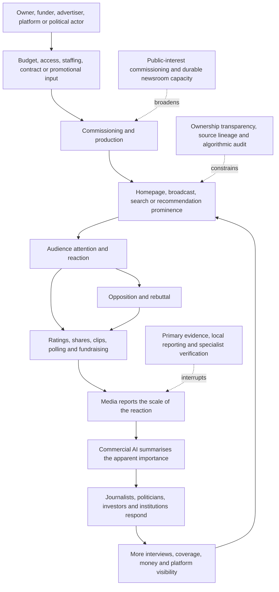

# 📺 Media Ownership And Platform Power  
**First created:** 2026-07-16 | **Last updated:** 2026-07-16  
*Collision-system analysis of how ownership, contracts, distribution, recommendation, monetisation, search, commercial AI, and audience transfer determine which stories remain visible long enough to become politically real.*

---

## 🛰️ Orientation

Media power does not require one owner dictating every sentence.

It can operate through:

- ownership
- appointments
- budgets
- staffing
- contracts
- distribution
- prominence
- recommendation
- search
- monetisation
- access
- audience transfer
- legal pressure
- data
- commercial AI

The key question is not only:

> Who owns the outlet?

It is:

> Who can alter which stories are commissioned, staffed, distributed, monetised, found, repeated, and allowed to remain visible?

A story can be accurate and still disappear.

A personality can be weak and still dominate attention.

A political project can lack broad support while appearing unavoidable because institutions repeatedly organise around its visibility.

> Media power does not need to dictate every sentence.  
> It can decide which stories remain visible long enough to become politically real.

---

## ✨ Key Features

- Separates ownership from direct editorial command.
- Treats staffing, contracts, prominence, recommendation, search, and monetisation as forms of power.
- Distinguishes reach, attention, trust, endorsement, and public support.
- Maps audience transfer between television, newspapers, podcasts, social platforms, newsletters, and political organisations.
- Shows how a personality can become infrastructural even where the formal organisation remains weak.
- Explains how commercial AI can convert repeated visibility into apparent consensus.
- Tracks collisions with far-right political finance, crypto, AI, civil liability, war, and sanctions.
- Identifies the loss of local journalism and verification capacity as structural amplifiers.
- Preserves evidence discipline around ownership, influence, coordination, and algorithmic effects.

---

## 🧿 Core Proposition

Media and platform systems shape politics by allocating:

- attention
- time
- credibility
- repetition
- emotional intensity
- discoverability
- response burden

They do not need to persuade everyone.

They may only need to make a subject:

- unavoidable
- expensive to ignore
- professionally risky to challenge
- familiar enough to feel normal
- prominent enough to attract money and institutional response

The power lies partly in selection.

It also lies in duration.

A story that remains visible accumulates:

- reactions
- commentary
- polling
- interviews
- fundraising
- opposition
- policy attention

Those secondary reactions are then treated as new evidence of the story’s importance.

This creates a self-reinforcing attention system.

---

## 🧱 Material Substrate

The material system includes:

- broadcast licences
- studios
- printing facilities
- newsrooms
- journalists
- editors
- producers
- legal teams
- advertising systems
- subscription systems
- distribution contracts
- cable and satellite carriage
- app stores
- servers
- content-delivery networks
- recommendation systems
- search indexes
- user data
- cloud services
- commercial AI systems
- analytics
- audience-measurement firms
- capital

Media power may therefore be exercised through apparently technical or commercial decisions.

---

## 🌦️ Confidence Substrate

The confidence system may include:

- audience numbers
- ratings
- follower counts
- trending labels
- search prominence
- brand prestige
- elite access
- perceived inevitability
- “everyone is talking about it”
- fear of missing the story
- fear of losing audience
- belief that visibility reflects public demand
- belief that algorithmic distribution is neutral
- belief that repeated coverage independently confirms importance

These signals may be real.

Their interpretation may be wrong.

> Attention is evidence of attention.  
> It is not automatically evidence of support, trust, or democratic importance.

---

# 🏢 Ownership Without A Daily Instruction

Ownership matters.

But the crude model—

> owner gives order, journalist obeys

—misses much of the system.

Owners and controlling investors may shape:

- senior appointments
- strategic priorities
- budget
- acceptable risk
- expansion and closure
- legal posture
- target audience
- commercial partnerships
- acquisition
- sale
- debt tolerance
- technology investment

This can influence editorial output without a specific instruction about every article.

## Ownership questions

Ask:

- Who owns the voting rights?
- Who provides debt?
- Who appoints directors?
- Who can remove senior leadership?
- Which entities hold licences?
- Which related companies supply services?
- Which advertisers or subscribers matter most?
- Are losses being subsidised?
- What future transaction is management preparing for?
- Which political or commercial relationships are valuable?

Ownership is not automatic command.

It is a structure of permission, incentive, and risk.

---

## 🧭 Editorial Independence As A Material Capacity

Editorial independence requires more than principle.

It requires:

- staff
- time
- legal backing
- secure employment
- specialist knowledge
- source protection
- travel
- data
- willingness to absorb complaints
- tolerance for stories that do not immediately monetise

A newsroom may formally remain independent while losing the material ability to investigate.

Cuts affect:

- verification
- court reporting
- local knowledge
- specialist beats
- long investigations
- correction capacity
- institutional memory

Commercial pressure can therefore reshape editorial output without overt censorship.

---

# 📡 Distribution Power

A publisher can produce a story.

Distribution determines whether anyone encounters it.

Distribution power includes:

- channel placement
- homepage prominence
- push notifications
- search ranking
- recommendation
- autoplay
- reposting
- trending systems
- app-store access
- email deliverability
- account verification
- demonetisation
- throttling
- suspension

Platforms may say they do not create the content.

They still control important conditions under which the content becomes socially consequential.

---

## 🔦 Prominence Is Not Neutral

A platform or outlet can change political reality by deciding:

- which item appears first
- which clip autoplays
- which personality is recommended next
- which story receives a notification
- which phrase becomes searchable
- which controversy remains on the homepage
- which correction receives less prominence than the error

Prominence is a scarce resource.

Its allocation should be analysed as a form of power.

---

## 🔍 Search Power

Search systems influence:

- what is findable
- which sources appear authoritative
- whether old material resurfaces
- whether corrections displace falsehoods
- whether a person’s name becomes linked to an allegation
- whether primary sources are visible

Search results are not a neutral index of public truth.

They reflect:

- ranking rules
- optimisation
- authority signals
- commercial incentives
- popularity
- freshness
- language
- location
- legal requests
- synthetic content

The search page can become part of the evidential environment.

---

# 🧲 Recommendation And Audience Transfer

Recommendation systems can move audiences between:

- entertainment
- grievance
- lifestyle
- finance
- conspiracism
- political personalities
- extremist material

The transition may not feel political.

A user may move through:

- humour
- masculinity content
- investment content
- anti-establishment commentary
- immigration content
- authoritarian politics

Each step may be locally plausible.

The overall path may be structurally radicalising.

## Audience transfer questions

- Which audience entered?
- Through what content?
- Which creator received the transfer?
- Which platform feature enabled it?
- Was the transfer monetised?
- Did the new audience enter a political donor or activist system?
- Was the movement measured as organic growth?

Audience transfer is not automatically ideological conversion.

It still alters political capacity.

---

## 🎭 Personality As Infrastructure

A political personality may become more important than the formal organisation.

The personality may carry:

- audience
- donor access
- media relationships
- platform reach
- brand recognition
- grievance
- fundraising
- candidate visibility

This creates concentration risk.

If the personality:

- becomes legally exposed
- loses media protection
- loses access
- becomes repetitive
- alienates donors
- fails to convert attention into organisation

the wider project may weaken quickly.

But institutions can remain trapped because they have organised programming, staffing, and audience expectations around the personality.

---

# 💰 Monetisation And Political Capacity

Media attention can become political finance through:

- advertising
- subscriptions
- memberships
- donations
- merchandise
- live events
- affiliate marketing
- sponsorship
- paid appearances
- consulting
- platform revenue sharing

A political personality can convert controversy into revenue.

Revenue funds further visibility.

Visibility produces further controversy.

The loop does not require majority support.

It requires a sufficiently valuable audience.

> Outrage can be commercially successful without being electorally representative.

---

## 🪙 Collision With Crypto And Meme Finance

Crypto projects depend heavily on:

- visibility
- influencer networks
- platform prominence
- search
- financial media
- commercial AI summaries
- politically coded identity

The loop may be:

1. token activity creates a price movement
2. media report the movement
3. coverage attracts speculative buyers
4. political communities interpret buyers as supporters
5. commercial AI summarises adoption
6. the summary produces more attention

See [`🪙_crypto_and_stablecoin_lobbying.md`](./🪙_crypto_and_stablecoin_lobbying.md).

---

## 🤖 Collision With Commercial AI

Commercial AI affects media through:

- search summaries
- content generation
- newsroom tools
- automated translation
- transcription
- recommendation
- audience diversion
- synthetic-content volume
- source compression

Media affect AI confidence by supplying:

- adoption stories
- company claims
- executive language
- market narratives
- political frames

This creates a recursive environment.

A claim can be:

- announced
- reported
- summarised
- repeated
- retrieved
- presented as established context

without acquiring proportionate independent evidence.

> Ten summaries of one press release do not create ten sources.

---

## 🔁 The Visibility-To-Reality Feed

The loop can turn:

- controversy into evidence of importance
- rebuttal into further visibility
- visibility into money
- money into infrastructure
- infrastructure into apparent inevitability

---

# 📊 Measurement Problems

Media systems use metrics such as:

- ratings
- unique users
- impressions
- views
- watch time
- engagement
- shares
- search interest
- subscriber growth
- sentiment

Each measures something.

None alone measures democratic legitimacy.

## Reach is not trust

A large audience may watch because it is:

- entertained
- alarmed
- opposed
- monitoring
- unable to avoid the content

## Engagement is not endorsement

Anger, correction, and mockery can all increase engagement.

## Ratings are not representation

A profitable niche audience may remain politically unrepresentative.

## Trending is not consensus

A topic may trend because of:

- coordinated activity
- controversy
- news events
- bot activity
- platform design
- a small but intense community

## Repetition is not corroboration

Many outlets may be repeating:

- one source
- one clip
- one press release
- one anonymous briefing
- one platform trend

The number of publications can exceed the number of independent facts.

---

# 🏚️ Local Journalism And Verification Loss

Loss of local journalism weakens:

- council reporting
- court reporting
- local campaign scrutiny
- knowledge of organisations
- detection of false local claims
- accountability between elections
- understanding of whether national narratives fit local reality

National personalities can then dominate because fewer institutions can say:

- that did not happen here
- this organisation has no local structure
- the stated support does not match the records
- the policy effect differs from the national claim

The collapse of local verification creates room for centrally produced confidence narratives.

---

## 🧑‍💼 Newsroom Commercial Pressure

Newsrooms under pressure may become more dependent on:

- cheap commentary
- personality interviews
- wire copy
- platform trends
- press releases
- automated summaries
- predictable conflict
- high-volume publishing

Expensive work is displaced:

- investigation
- source development
- legal review
- specialist reporting
- archival research
- corrections

The result is not necessarily ideological capture.

It may be structural vulnerability.

---

# 🗞️ Media-Cycle Capture

Media-cycle capture occurs when a political actor can repeatedly force institutions to organise around their timing.

Mechanisms include:

- provocation
- ambiguous announcement
- staged conflict
- rapid repetition
- threatening litigation
- attacking the press
- timed leaks
- social-media posts
- manufactured urgency

The cycle becomes:

1. actor provokes
2. outlet reports
3. opponents react
4. reaction becomes the next story
5. actor claims domination of the agenda
6. future coverage treats the actor as unavoidable

The actor may lose the substantive argument while winning the calendar.

---

## ⏱️ Temporal Capture

Fast political actors exploit slower systems:

- courts
- regulators
- standards bodies
- elections
- corrections
- academic research
- investigative reporting

The false or exaggerated claim may dominate for days.

The correction may arrive months later.

By then:

- fundraising has occurred
- the audience has moved
- the policy agenda has shifted
- the original claim has become cultural memory

See [`⏱️_temporal_hygiene_rhythm_not_panic.md`](../🌀_Core_Model/⏱️_temporal_hygiene_rhythm_not_panic.md).

---

# 💰 Collision With Far-Right Political Finance

Media support can form part of political finance through:

- subsidised airtime
- friendly coverage
- paid roles
- event promotion
- audience transfer
- legal support
- advertising
- owner prestige
- donor introductions
- reduced scrutiny

The support may be:

- ideological
- commercial
- defensive
- opportunistic
- accommodation

A movement can appear grassroots while its visibility is privately subsidised.

See [`💰_far_right_political_finance.md`](./💰_far_right_political_finance.md).

---

# ⚔️ Collision With War And Sanctions

Media and platforms shape public understanding of:

- sanctions effectiveness
- civilian harm
- military capability
- workaround systems
- alliance unity
- ceasefire
- escalation
- attribution

Risks include:

- presenting partial workaround success as total sanctions failure
- presenting visible economic pain as proven strategic success
- repeating intelligence claims without attribution
- treating viral footage as verified
- ignoring implementation and depletion clocks
- collapsing lawful third-country trade into evasion

See [`⚔️_war_sanctions_and_workarounds.md`](./⚔️_war_sanctions_and_workarounds.md).

---

# 🧾 Collision With Civil Liability

Media organisations and platforms may face exposure through:

- defamation
- privacy
- data protection
- harassment
- copyright
- platform liability
- advertising
- consumer protection
- employment
- contract
- regulatory duties

Legal exposure can alter:

- commissioning
- takedown
- insurance
- ownership decisions
- platform policy
- source protection
- correction
- settlement

Civil liability can improve accountability.

It can also be used strategically to exhaust smaller publishers and critics.

The key question is:

> Is legal pressure correcting harm, allocating responsibility, or purchasing silence through unequal capacity?

---

## 🌡️ Confidence Weather

Signs of strengthening media confidence may include:

- expanded staffing
- new investment
- advertiser support
- audience growth
- acquisition
- platform promotion
- elite access

Signs of faltering confidence may include:

- staff cuts
- owner distancing
- cautious endorsements
- advertiser withdrawal
- legal review
- rebranding
- reduced prominence
- platform demotion
- donor or presenter exit
- sudden emphasis on governance

The first withdrawal may be:

- less airtime
- fewer invitations
- thinner praise
- more financial scrutiny
- refusal to treat the personality as inevitable

Media permission to defect can precede visible donor exit.

---

## 🕰️ Relevant Clocks

Track:

- ownership change
- financing
- appointment
- commissioning
- publication
- broadcast
- platform amplification
- reaction
- correction
- legal complaint
- regulator action
- advertiser withdrawal
- algorithm change
- archive resurfacing
- AI retrieval
- audience migration

Publication is not recognition.

Recognition is not consequence.

A correction clock is usually slower than a virality clock.

---

## 🔗 Transmission Routes

Risk and influence may move through:

- ownership
- debt
- advertising
- subscriptions
- contracts
- staff
- platform ranking
- search
- recommendation
- data
- litigation
- political access
- commercial AI
- audience transfer
- reputation

Use the sequence:

1. originating decision or claim
2. carrier
3. distribution route
4. receiving audience or institution
5. amplifier or buffer
6. observable consequence
7. final cost bearer

---

## 🧯 Amplifiers

- concentrated ownership
- newsroom cuts
- owner debt
- dependence on one advertiser
- dependence on one platform
- weak local reporting
- personality-driven programming
- opaque recommendation
- poor source lineage
- synthetic content
- high legal costs
- commercial pressure for speed
- treating engagement as public demand
- repeated reaction coverage
- weak correction prominence

## 🛡️ Buffers

- diversified ownership
- transparent financing
- editorial charters
- stable newsroom funding
- strong local journalism
- specialist beats
- public-interest media
- source-lineage display
- algorithmic audit
- correction prominence
- legal support
- clear advertising disclosure
- independent audience measurement
- platform interoperability
- user control over recommendation

---

## 🛠️ Diagnostic Tools

### Ownership

- Who owns voting rights?
- Who supplies debt?
- Who appoints leadership?
- Who absorbs losses?

### Editorial capacity

- Is there enough staff, time, expertise, and legal support to verify?

### Distribution

- How did the item reach the audience?
- Homepage?
- broadcast?
- search?
- recommendation?
- notification?

### Prominence

- Why did this story remain visible?
- Was prominence editorial, algorithmic, commercial, or political?

### Audience

- Is the audience supportive, hostile, curious, or captive?
- Is attention being misread as endorsement?

### Monetisation

- Who earns from the attention?
- Does controversy directly finance further political capacity?

### AI

- Is the apparent consensus based on independent sources?
- Is commercial AI reproducing circular reporting?
- Is model output becoming new evidence of importance?

### Consequence

- Did visibility produce:
  - money?
  - policy?
  - polling?
  - recruitment?
  - litigation?
  - institutional accommodation?

### Cost bearer

- Journalists?
- local communities?
- targets?
- audiences?
- public institutions?
- smaller publishers?
- advertisers?
- taxpayers?

---

## ⚖️ Evidence Discipline

Preserve the distinctions:

- ownership is not automatic editorial command
- access is not capture
- reach is not trust
- ratings are not representation
- attention is not endorsement
- virality is not consensus
- recommendation is not mind control
- audience transfer is not ideological conversion
- repeated coverage is not independent corroboration
- media criticism is not coordinated elite abandonment
- advertiser withdrawal is not proof of political conversion
- algorithmic influence does not erase user agency
- commercial pressure is not necessarily ideological intent
- correlation between coverage and polling is not proof of causation

Use categories such as:

- ownership record
- contract
- appointment
- budget decision
- editorial statement
- distribution data
- audience metric
- platform policy
- legal process
- reported relationship
- behavioural signal
- analytical inference
- unresolved question

---

## 🧪 What Would Disconfirm The Concern?

Evidence of a healthier system may include:

- diverse ownership
- durable editorial independence
- transparent related-party contracts
- strong local reporting
- corrections receiving equal prominence
- recommendation systems that broaden rather than narrow exposure
- clear advertising disclosure
- independent source tracing
- reduced dependence on political personalities
- audience metrics interpreted cautiously
- public-interest work surviving low immediate engagement
- strong separation between owner, advertiser, and editorial decision
- platforms allowing meaningful user control
- commercial AI exposing source lineage

An owner may support robust independent journalism.

A platform may amplify useful public-interest information.

A large audience may genuinely reflect broad concern.

The model should preserve those possibilities.

---

## ✨ Working Rules

> Media power does not need to dictate every sentence.

> It can decide which stories remain visible long enough to become politically real.

> Attention is evidence of attention.

> Reach is not trust.

> Engagement is not endorsement.

> Ratings are not representation.

> Repetition is not corroboration.

> Outrage can be commercially successful without being electorally representative.

> A political actor can lose the argument while winning the calendar.

> The first sign of elite exit may be permission to stop maintaining the performance.

> Commercial AI can turn repeated visibility into the appearance of ambient consensus.

---

## 🌌 Constellations

📺 📡 🔍 🧲 💰 🤖 🗞️ — ownership; distribution; search; recommendation; monetisation; AI; newsroom capacity.

---

## ✨ Stardust

media ownership, platform power, recommendation, search, audience transfer, monetisation, political finance, commercial ai, newsroom pressure, local journalism, confidence weather

---

## 🏮 Footer

*Media Ownership And Platform Power* is a living node of the **Polaris Protocol**.  
It maps how ownership, financing, staffing, distribution, recommendation, search, monetisation, commercial AI, and audience transfer determine which political stories become durable public realities.  
Its purpose is to distinguish ownership from direct command, visibility from support, and repeated circulation from independent evidence—while identifying the material conditions required for journalism to verify rather than merely relay confidence systems.

> 📡 Cross-references:
>
> - [`README.md`](./README.md) — *Collision Systems cluster route and collision map*
> - [`💰_far_right_political_finance.md`](./💰_far_right_political_finance.md) — *media support, donor stages, commercial acceleration, and elite repricing*
> - [`🪙_crypto_and_stablecoin_lobbying.md`](./🪙_crypto_and_stablecoin_lobbying.md) — *coin hype, simulated publics, commercial-AI recursion, and platform attention*
> - [`🤖_ai_market_confidence.md`](./🤖_ai_market_confidence.md) — *synthetic corroboration, market narration, and commercial pressure*
> - [`⚔️_war_sanctions_and_workarounds.md`](./⚔️_war_sanctions_and_workarounds.md) — *propaganda, attribution, workaround narratives, and temporal confusion*
> - [`🧾_donor_provenance_and_civil_liability.md`](./🧾_donor_provenance_and_civil_liability.md) — *ownership, legal exposure, source of funds, and responsibility*
> - [`🌫️_public_distrust_and_algorithmic_overload.md`](./🌫️_public_distrust_and_algorithmic_overload.md) — *the public experience of repetition, contradiction, and ranking failure*
> - [`🌦️_confidence_weather.md`](../🌀_Core_Model/🌦️_confidence_weather.md) — *relational signals, false weather, and institutional repricing*
> - [`🔗_risk_transmission_between_systems.md`](../🌀_Core_Model/🔗_risk_transmission_between_systems.md) — *carriers, routes, consequences, and final cost bearers*
> - [`⏱️_temporal_hygiene_rhythm_not_panic.md`](../🌀_Core_Model/⏱️_temporal_hygiene_rhythm_not_panic.md) — *publication, recognition, correction, and consequence clocks*
>
> 🏮 Return To:
>
> - [`👹_Collision_Systems`](./) — *current substantive cluster*
> - [`🗻_The_Manifestation_Molehill`](../) — *media-facing pack on fragile confidence systems and democratic coverage under overload*
> - [`👻_Ghosts_Of_Accountability`](../../) — *parent accountability cluster*
> - [`📲_Press_Matters`](../../../) — *press and media-analysis layer*
> - [`🌓_3_In_The_Moment`](../../../../) — *current-events and active-pattern layer*

*Survivor authorship is sovereign. Containment is never neutral.*

_Last updated: 2026-07-16_
