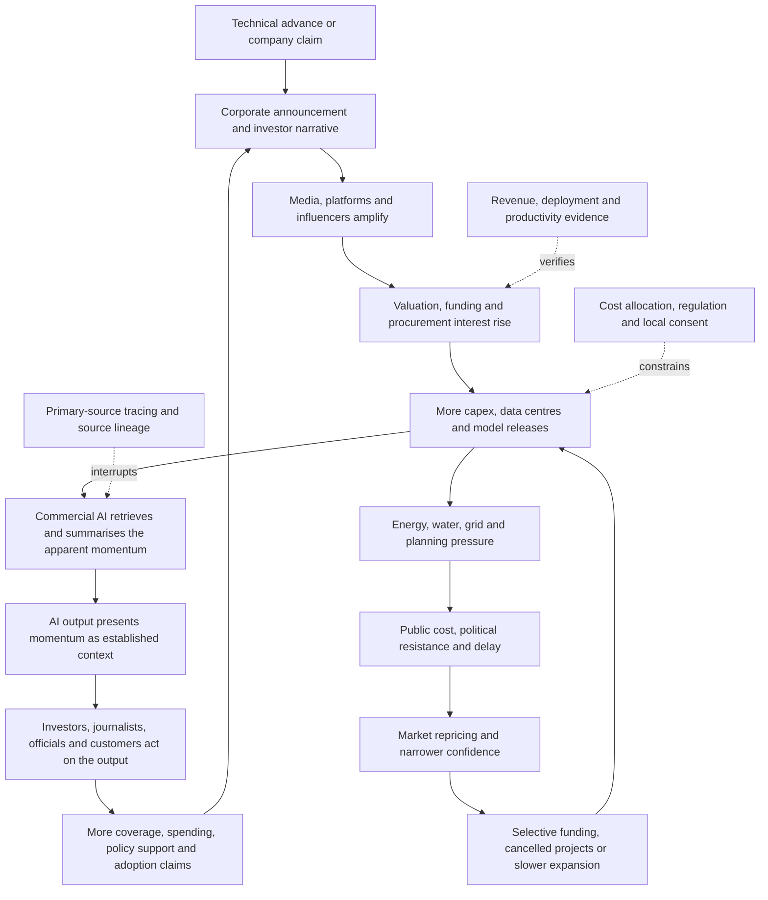

# 🤖 AI Market Confidence  
**First created:** 2026-07-16 | **Last updated:** 2026-07-16  
*Collision-system analysis of a commercial-AI confidence system that is visibly faltering under capital, energy, adoption, legal, and public-pressure tests, but has not cleanly crashed.*

---

## 🛰️ Orientation

Commercial AI market confidence is faltering.

It has not crashed.

That distinction matters.

The system still has:

- extraordinary capital expenditure
- real demand for chips and infrastructure
- powerful incumbent firms
- enterprise and consumer usage
- government interest
- national-security importance
- stock-market support
- procurement pipelines
- considerable technical progress

But confidence is no longer moving in one direction.

The market is increasingly asking:

- where is the revenue?
- which uses are durable?
- who pays for the infrastructure?
- how much electricity is available?
- who carries grid and water costs?
- which firms can survive the spending race?
- how much adoption is real deployment rather than announcement?
- when does present capital expenditure become future cash flow?
- what happens if the answer arrives later than the debt, depreciation, and political backlash?

This is not the end of commercial AI.

It is the point where inevitability begins encountering accounting, infrastructure, law, and public consent.

> The AI confidence system is not collapsing cleanly.  
> It is being asked to show its working.

---

## ✨ Key Features

- Distinguishes faltering confidence from a market crash.
- Separates technical capability from commercial capacity.
- Separates adoption, deployment, revenue, profit, and valuation.
- Treats capital expenditure as both evidence of commitment and a future burden.
- Maps physical dependencies: chips, energy, grids, water, land, data centres, and supply chains.
- Identifies commercial AI as both a producer and consumer of confidence weather.
- Connects AI to crypto, far-right finance, media, war, sanctions, procurement, and public distrust.
- Tracks the shift from broad enthusiasm to selective confidence.
- Identifies the conditions under which local failures could become systemic repricing.
- Preserves the possibility that a real technological transformation can contain bubble-like layers.

---

## 🧿 Core Proposition

Commercial AI currently rests on a two-part proposition:

1. present spending will create future technical and market dominance
2. future dominance will generate enough revenue, productivity, or strategic value to justify present spending

The first part is visible.

The second remains uneven.

The system becomes fragile when present commitments are financed by increasingly confident assumptions about:

- future demand
- falling unit costs
- enterprise integration
- labour substitution
- consumer willingness to pay
- government procurement
- energy availability
- continued investor patience
- stable access to chips and capital
- weak or delayed regulation

The problem is not that AI has no value.

The problem is that several different forms of value are being treated as interchangeable:

- technical usefulness
- social importance
- strategic importance
- commercial adoption
- revenue
- profit
- valuation
- market inevitability

They are related.

They are not the same.

---

## 🌡️ Current Reading: Faltering, Not Crashed

As of 16 July 2026, the confidence system shows both endurance and strain.

### Endurance

- capital expenditure remains extremely high
- chip and infrastructure demand remains strong
- major technology firms can still finance large buildouts
- AI exposure remains deeply embedded across equities, credit, and venture capital
- governments continue treating AI capacity as strategically important
- the wider market has not rejected the AI thesis

### Strain

- markets are questioning whether spending can produce sufficient returns
- leadership is becoming narrower and more selective
- electricity, grid, water, and planning constraints are becoming political issues
- households and governments are resisting the transfer of infrastructure costs
- adoption is increasingly being distinguished from deep operational integration
- valuations require unusually strong future performance
- the system has become large enough that slowing investment could affect the wider economy

This is not a single crash signal.

It is a collection of repricing signals.

> Confidence is becoming conditional before it becomes absent.

---

## 🧱 Material Substrate

Commercial AI requires:

- advanced chips
- chip fabrication
- packaging
- memory
- networking
- data centres
- grid connections
- electricity generation
- cooling
- water
- land
- fibre
- cloud infrastructure
- training data
- specialised labour
- software integration
- maintenance
- security
- customers
- capital

The model may appear weightless.

The commercial system is not.

A useful material question is:

> Which apparently digital promise is waiting for a transformer, a power contract, a planning decision, a cooling system, or a customer budget?

---

## 🌦️ Confidence Substrate

The confidence layer includes:

- benchmark performance
- model-release excitement
- founder prestige
- stock prices
- venture valuations
- analyst forecasts
- national-competitiveness claims
- fear of missing out
- fear of strategic dependence
- enterprise announcements
- government endorsements
- media repetition
- belief that scaling will continue producing capability
- belief that capability will inevitably produce profit

Commercial AI companies can also generate confidence about AI through AI.

Their systems:

- summarise adoption claims
- describe market momentum
- reproduce executive language
- generate promotional material
- shape search results
- assist analysts, journalists, and investors

The confidence system can therefore become partially self-describing.

---

## 🔢 The Missing Equal Signs

A recurring problem is the insertion of imaginary equal signs:

> benchmark gain = useful product

> useful product = deployment

> deployment = adoption

> adoption = revenue

> revenue = profit

> profit = valuation

> valuation = durable economic transformation

Each transition requires evidence.

A system can have:

- impressive benchmarks
- useful pilots
- high usage
- real revenue

and still fail to produce profit at the scale required by its valuation and infrastructure cost.

The analytical task is to find where the chain becomes an assumption.

---

# 🏗️ Capital Expenditure As Promise And Liability

Capital expenditure is one of the strongest signals supporting the AI boom.

It is also one of its largest future tests.

Large expenditure can mean:

- demand is real
- firms are committed
- infrastructure is becoming durable
- technical capability will expand
- suppliers have long order books

It can also create:

- depreciation
- debt
- financing costs
- stranded capacity
- pressure to maintain utilisation
- pressure to create demand
- political pressure for grid subsidy
- vulnerability if revenue arrives late

Capex is therefore both:

- evidence of confidence
- a claim on future cash flow

> Spending proves commitment.  
> It does not by itself prove return.

---

## 🧾 The Capex-To-Revenue Gap

The key question is not whether AI revenue exists.

It does.

The question is whether revenue grows quickly enough, widely enough, and profitably enough to carry:

- infrastructure spending
- energy costs
- model development
- customer acquisition
- security
- legal exposure
- depreciation
- financing costs

Watch:

- capex growth versus AI-attributable revenue
- gross margin
- free cash flow
- customer concentration
- contract duration
- utilisation
- pricing pressure
- cost per useful task
- renewal rates
- conversion from pilot to operational deployment

A widening gap does not automatically prove collapse.

It increases the amount of future success already required.

---

## 🪜 The Adoption Ladder

Do not collapse all usage into adoption.

A useful ladder is:

1. awareness
2. experimentation
3. individual use
4. team pilot
5. paid subscription
6. workflow integration
7. production deployment
8. organisational dependency
9. measurable productivity gain
10. durable revenue or cost saving

A company announcing an AI pilot may be near stage four.

Market narratives may price it as stage nine.

That gap is confidence exposure.

---

## 🧪 Pilot Is Not Deployment

Pilots are easier because they can be:

- small
- subsidised
- temporary
- isolated
- heavily supported
- exempt from normal procurement
- tolerated despite unclear return

Deployment requires:

- reliability
- security
- integration
- legal responsibility
- staff training
- data governance
- maintenance
- measurable benefit
- budget ownership

The commercial test begins after the impressive demonstration.

---

## 💼 Adoption Is Not Profit

A tool may be widely used and still generate weak profit.

Reasons include:

- high inference costs
- low willingness to pay
- competition
- bundling
- customer churn
- free alternatives
- expensive support
- security requirements
- model commoditisation
- declining prices

Usage can support the technological thesis while weakening the pricing thesis.

That is one reason confidence can falter without the technology disappearing.

---

# ⚡ The Energy And Infrastructure Test

The AI buildout now collides directly with:

- electricity prices
- grid capacity
- generation
- transmission
- water
- planning
- local consent
- environmental justice
- land use
- industrial policy

The infrastructure question is no longer peripheral.

It is entering:

- household bills
- state and local politics
- tax policy
- planning disputes
- environmental litigation
- national-security policy

The public may support AI in principle while resisting:

- higher electricity costs
- local pollution
- water pressure
- land acquisition
- hidden subsidies
- weakened environmental review

This is where market confidence meets democratic permission.

---

## 🧾 Who Pays For The Grid?

Data-centre growth can require:

- new generation
- substations
- transmission
- backup power
- storage
- water infrastructure
- road and land development

The political question becomes:

> Are AI firms paying the full cost of the capacity they require, or is part of the bill being transferred to households, taxpayers, and existing users?

A voluntary corporate pledge may help.

It is not the same as enforceable cost allocation.

Track:

- utility tariffs
- tax exemptions
- public subsidies
- infrastructure guarantees
- local planning concessions
- ratepayer protections
- contractual responsibility

---

## 🗺️ Local Friction As Market Signal

A national market can remain enthusiastic while local projects encounter:

- moratoria
- permit delays
- grid queues
- lawsuits
- community opposition
- water restrictions
- pollution claims
- tax disputes

These are not merely public-relations problems.

They can affect:

- deployment timing
- construction cost
- expected utilisation
- financing
- political legitimacy
- geographic concentration

A market thesis built on rapid scaling becomes vulnerable when physical scaling slows.

---

# 🤖 Commercial AI As A Confidence Simulator

Commercial AI is not only the object of market confidence.

It also helps produce market confidence.

AI systems retrieve, summarise, and reproduce:

- company announcements
- investor commentary
- lobbying claims
- adoption stories
- media reports
- analyst notes
- other synthetic summaries

This can produce recursive corroboration.

A company says adoption is growing.

Media report the claim.

AI summarises the coverage.

Investors cite the summary.

New coverage reports investor confidence.

AI retrieves the new coverage.

The references multiply.

The underlying evidence may not.

> Commercial AI can accurately summarise an information environment that has recursively manufactured its own authority.

---

## 🔁 The AI Confidence Feed

The loop can remain active while confidence weakens.

A feedback system does not need to stop completely in order to become unstable.

---

# 📉 Faltering Confidence

Faltering confidence may appear as:

- strong earnings followed by share-price weakness
- good model releases producing smaller valuation gains
- capex questioned rather than automatically rewarded
- investors favouring a narrower set of firms
- more attention to cash flow
- cancelled or delayed data-centre projects
- more cautious corporate adoption language
- greater differentiation between infrastructure winners and application losers
- public resistance to energy and water costs
- government demands for cost protection
- growing legal and copyright exposure

This is not yet a crash.

It is the movement from:

> AI will lift everything.

to:

> Which part of AI, owned by whom, financed how, and profitable when?

That is a more selective market.

It may be healthier.

It may also reveal how much confidence was previously undifferentiated.

---

## 🪫 Confidence Compression

Confidence compression occurs when:

- timelines lengthen
- expected margins fall
- regulation becomes more expensive
- power costs rise
- deployment proves slower
- customers demand lower prices
- models become more interchangeable
- legal exposure grows
- investor patience shortens

The technology can improve while the commercial value assigned to each unit of improvement declines.

This is important.

A better model does not guarantee a better investment.

---

## 🧮 What Would Count As A Crash?

A clean AI-market crash would require more than:

- a bad trading day
- one failed startup
- one delayed data centre
- one disappointing product
- a correction in one stock

Potential crash indicators would include a cluster of:

- broad and sustained valuation collapse
- credit-spread widening
- failed infrastructure financing
- major capex cancellations
- supplier order collapse
- data-centre defaults
- sharp enterprise-spending retreat
- impaired debt
- forced asset sales
- widespread layoffs tied to investment reversal
- reduced access to capital
- contagion into energy, construction, credit, and wider equities

The current system can falter for a long time without crossing that threshold.

---

# 🧬 Local Bubbles Inside A Real Transformation

The choice is not necessarily:

- pure bubble
- pure revolution

A real general-purpose technology can contain:

- overvalued companies
- stranded infrastructure
- weak products
- duplicated investment
- speculative suppliers
- irrational timelines
- genuine productivity gains

The railway can matter even if railway investors lose money.

The internet can transform society while many internet companies fail.

AI can be both:

- technically transformative
- financially overextended in particular layers

The analytical task is to identify which layer is carrying which claim.

---

## 🧱 Stack-Level Confidence

### Chips

Questions:

- Is demand durable?
- How concentrated are customers?
- How much capacity is strategic stockpiling?
- What happens if model efficiency improves?

### Data centres

Questions:

- Are projects financed?
- Is power available?
- Will utilisation justify construction?
- Who carries stranded-asset risk?

### Cloud

Questions:

- Is AI revenue incremental?
- Are services being bundled?
- What are margins after compute?
- How concentrated is demand?

### Frontier models

Questions:

- Can capability gains continue?
- Can pricing cover training and inference?
- Is differentiation durable?
- Who bears legal risk?

### Applications

Questions:

- Does the product solve a recurring problem?
- Does the customer renew?
- Is integration expensive?
- Can the feature be copied or bundled?

### Enterprise adoption

Questions:

- Is use operational?
- Is productivity measured?
- Who owns the budget?
- Does deployment survive compliance review?

Different layers may boom, stagnate, or fail independently.

---

# 🪙 Collision With Crypto And Stablecoins

AI and crypto share:

- speculative capital
- founder mythology
- future-economy language
- national-competitiveness claims
- high energy use
- infrastructure dependency
- political lobbying
- belief that adoption will validate present valuation
- commercial AI systems that amplify market narratives

Possible transmission routes include:

- shared investors
- tokenised AI projects
- compute markets
- automated trading
- political donors
- data-centre energy competition
- confidence contagion
- common media and platform infrastructure

Crypto can provide a scoreboard for hype.

Commercial AI can provide a spokesperson.

See [`🪙_crypto_and_stablecoin_lobbying.md`](./🪙_crypto_and_stablecoin_lobbying.md).

---

# 💰 Collision With Far-Right Political Finance

Commercial AI intersects with far-right political finance through:

- deregulation
- government procurement
- platform governance
- surveillance
- defence technology
- anti-labour promises
- elite donor networks
- national-competition narratives
- synthetic media
- hostility to institutional restraint

The overlap should not be presumed.

Trace:

- money
- advisers
- contracts
- ownership
- lobbying
- policy promises
- media access
- personnel

A donor may support AI deregulation without supporting every far-right position.

A far-right movement may use AI rhetoric without possessing meaningful AI capacity.

See [`💰_far_right_political_finance.md`](./💰_far_right_political_finance.md).

---

# ⚔️ Collision With War And Sanctions

AI is increasingly framed through:

- national security
- military advantage
- intelligence
- cyber operations
- autonomous systems
- export controls
- chip restrictions
- supply-chain sovereignty

War and sanctions can affect:

- chip availability
- energy
- cloud access
- capital
- talent
- data-centre location
- international partnerships

The urgency claim often becomes:

> We must build because rivals will.

This may identify a real strategic problem.

It can also suppress questions about:

- cost
- safety
- law
- labour
- public consent
- alternative strategy

---

# 📺 Collision With Media And Platform Power

Commercial AI affects media through:

- search summaries
- content generation
- recommendation
- newsroom tools
- audience diversion
- advertising
- copyright disputes
- source attribution
- synthetic content volume

Media in turn affect AI-market confidence by:

- repeating company claims
- ranking model releases
- reporting investor enthusiasm
- amplifying benchmark narratives
- normalising adoption claims

The loop becomes dangerous when:

- AI-generated content is reported as public opinion
- platform visibility is treated as adoption
- corporate announcements become multiple apparent sources
- newsroom pressure reduces verification

---

# 🧾 Collision With Civil Liability

Commercial AI exposure may arise through:

- copyright
- privacy
- discrimination
- product liability
- professional negligence
- consumer protection
- employment law
- securities disclosure
- contract
- data provenance
- defamation
- security failures

Legal exposure affects:

- valuation
- insurance
- deployment
- procurement
- lender confidence
- reserves
- pricing
- product design

A technically capable system may become commercially unattractive if the liability cannot be allocated.

---

## 🕰️ Relevant Clocks

Track:

- model release
- benchmark release
- funding round
- earnings
- capex guidance
- construction start
- grid connection
- procurement award
- pilot
- production deployment
- renewal
- regulatory deadline
- court ruling
- settlement
- power contract
- planning approval
- cancellation
- depreciation cycle
- revenue conversion

The model-release clock is faster than:

- enterprise procurement
- infrastructure construction
- regulation
- litigation
- productivity measurement

Confusing these clocks makes acceleration appear more commercially complete than it is.

---

## 🔗 Transmission Routes

Stress may move through:

- equity valuations
- corporate credit
- private credit
- venture capital
- chip suppliers
- construction
- utilities
- grid investment
- cloud contracts
- procurement
- political lobbying
- media narratives
- commercial AI output
- legal judgments
- public resistance

Use the sequence:

1. originating stress
2. carrier
3. transmission route
4. receiving system
5. amplifier or buffer
6. observable consequence
7. final cost bearer

---

## 🧯 Amplifiers

- extreme valuation
- concentrated market leadership
- debt-financed infrastructure
- opaque private credit
- circular investment
- customer concentration
- weak source lineage
- synthetic corroboration
- government urgency
- energy subsidy
- grid bottlenecks
- long construction timelines
- short investor patience
- unclear liability
- unmeasured adoption
- bundled revenue
- pressure to maintain inevitability

## 🛡️ Buffers

- diversified revenue
- strong free cash flow
- conservative debt
- measurable productivity
- durable customer renewal
- transparent AI-attributable revenue
- diversified energy supply
- enforceable cost allocation
- accountable procurement
- modular infrastructure
- independent evaluation
- source-lineage disclosure
- legal clarity
- realistic depreciation
- willingness to cancel weak projects

---

## 🛠️ Diagnostic Tools

### Capability

- What can the system reliably do?
- Under what conditions?
- At what cost?
- Compared with which baseline?

### Adoption

- Is this a demo, pilot, paid use, integration, dependency, or measurable productivity gain?

### Revenue

- Who pays?
- How much?
- Is the revenue incremental?
- Does it recur?

### Profit

- What are training, inference, support, security, and legal costs?
- Are margins improving?

### Capex

- What is being built?
- Who finances it?
- What utilisation is required?
- What happens if demand is late?

### Energy

- Is power available?
- Who pays for new capacity?
- What local opposition exists?

### Confidence

- Is the signal a benchmark, announcement, valuation, contract, renewal, or cash flow?
- Is apparent corroboration independent?

### Transmission

- Which other systems carry the exposure?
- Credit?
- utilities?
- construction?
- politics?
- media?
- crypto?

### Cost bearer

- Shareholders?
- lenders?
- workers?
- ratepayers?
- taxpayers?
- local communities?
- customers?
- public institutions?

---

## ⚖️ Evidence Discipline

Preserve the distinctions:

- benchmark is not deployment
- demo is not product
- pilot is not adoption
- adoption is not productivity
- usage is not revenue
- revenue is not profit
- capex is not return
- valuation is not liquidity
- market importance is not public benefit
- strategic value is not commercial viability
- company announcement is not independent verification
- AI summary is not a new source
- one delayed project is not a crash
- one strong quarter does not settle long-term return
- technical progress does not eliminate financial risk
- financial repricing does not prove technical failure

Use categories such as:

- technical evidence
- primary company disclosure
- contract
- deployment evidence
- revenue evidence
- profitability evidence
- market signal
- infrastructure signal
- legal process
- political claim
- analytical inference
- unresolved question

---

## 🧪 What Would Disconfirm The Concern?

Evidence of durable commercial capacity may include:

- sustained AI-attributable revenue
- improving margins
- strong free cash flow after capex
- measurable productivity gains
- broad enterprise integration
- high renewal rates
- falling cost per useful task
- diversified customers
- infrastructure arriving on time
- full cost allocation to developers
- stable access to energy
- manageable legal exposure
- resilient demand through economic slowdown
- valuations supported by realised cash flow

Evidence against an imminent crash may include:

- continued financing
- stable credit
- strong supplier demand
- selective rather than indiscriminate investment
- project cancellation functioning as discipline rather than contagion
- profitable incumbents absorbing long buildout periods

The model should allow the confidence system to stabilise.

Faltering is not destiny.

---

## ✨ Working Rules

> Confidence is becoming conditional before it becomes absent.

> The AI confidence system is not collapsing cleanly.  
> It is being asked to show its working.

> Spending proves commitment.  
> It does not by itself prove return.

> Benchmark is not deployment.

> Pilot is not adoption.

> Adoption is not profit.

> A better model does not automatically make a better investment.

> The model may be weightless.  
> The commercial system is waiting for a grid connection.

> Commercial AI can accurately summarise an information environment that has recursively manufactured its own authority.

> A real technological transformation can still contain local bubbles, failed firms, stranded assets, and impossible timelines.

> Faltering confidence asks which claims survive accounting.

---

## 🌌 Constellations

🤖 🏗️ ⚡ 📉 🪙 💰 ⚔️ 📺 — commercial AI; capex; energy; repricing; crypto; political finance; security; media amplification.

---

## ✨ Stardust

artificial intelligence, market confidence, capex, data centres, energy, enterprise adoption, productivity, valuation, commercial ai, bubble dynamics, infrastructure, grid costs, market repricing

---

## 🏮 Footer

*AI Market Confidence* is a living node of the **Polaris Protocol**.  
It maps a commercial-AI confidence system that remains materially powerful but is being tested by capital expenditure, revenue conversion, energy constraints, public cost, legal exposure, and narrowing investor confidence.  
Its purpose is to distinguish technical progress from commercial return, selective repricing from systemic collapse, and a real technological transformation from the speculative and infrastructural layers built around it.

> 📡 Cross-references:
>
> - [`README.md`](./README.md) — *Collision Systems cluster route and collision map*
> - [`🪙_crypto_and_stablecoin_lobbying.md`](./🪙_crypto_and_stablecoin_lobbying.md) — *coin simulation, commercial-AI recursion, financial rails, and hype*
> - [`💰_far_right_political_finance.md`](./💰_far_right_political_finance.md) — *commercial acceleration, power finance, and elite repricing*
> - [`⚔️_war_sanctions_and_workarounds.md`](./⚔️_war_sanctions_and_workarounds.md) — *export controls, chip access, strategic urgency, and supply chains*
> - [`📺_media_ownership_and_platform_power.md`](./📺_media_ownership_and_platform_power.md) — *distribution, synthetic content, and attention infrastructure*
> - [`🧾_donor_provenance_and_civil_liability.md`](./🧾_donor_provenance_and_civil_liability.md) — *ownership, legal exposure, collectability, and confidence*
> - [`💸_can_the_assets_carry_the_risk.md`](./💸_can_the_assets_carry_the_risk.md) — *capacity test for liquidity, encumbrance, and cost bearing*
> - [`🌦️_confidence_weather.md`](../🌀_Core_Model/🌦️_confidence_weather.md) — *conditional confidence, quiet signals, and repricing*
> - [`🔗_risk_transmission_between_systems.md`](../🌀_Core_Model/🔗_risk_transmission_between_systems.md) — *carriers, routes, consequences, and cost bearers*
> - [`⏱️_temporal_hygiene_rhythm_not_panic.md`](../🌀_Core_Model/⏱️_temporal_hygiene_rhythm_not_panic.md) — *separating model-release, market, infrastructure, and legal clocks*
>
> 🏮 Return To:
>
> - [`👹_Collision_Systems`](./) — *current substantive cluster*
> - [`🗻_The_Manifestation_Molehill`](../) — *media-facing pack on fragile confidence systems and democratic coverage under overload*
> - [`👻_Ghosts_Of_Accountability`](../../) — *parent accountability cluster*
> - [`📲_Press_Matters`](../../../) — *press and media-analysis layer*
> - [`🌓_3_In_The_Moment`](../../../../) — *current-events and active-pattern layer*

*Survivor authorship is sovereign. Containment is never neutral.*

_Last updated: 2026-07-16_
