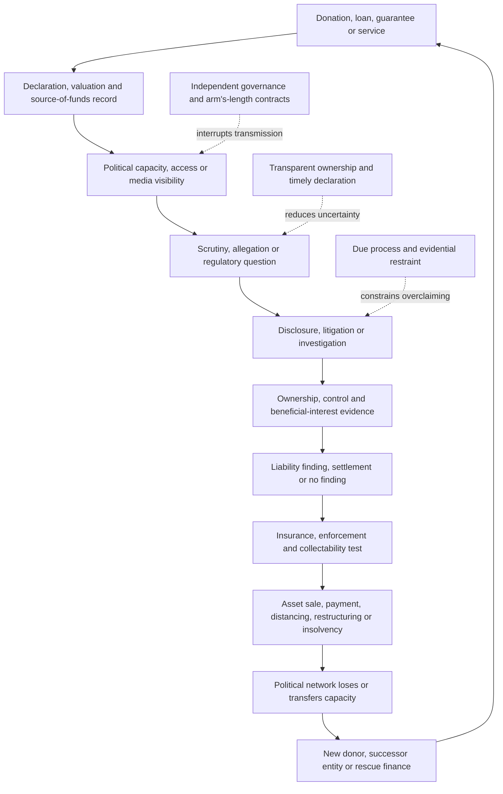

# 🧾 Donor Provenance And Civil Liability  
**First created:** 2026-07-17 | **Last updated:** 2026-07-17  
*Collision-system analysis of where source-of-funds scrutiny meets judgments, settlements, insurance, collectability, political exposure, and the question of whether wealth can be made to answer for harm.*

---

## 🛰️ Orientation

Donor provenance asks:

> Where did the money come from?

Civil liability asks:

> Can the money be made to answer for the harm?

These questions meet when wealth must become:

- documented
- attributable
- lawful
- liquid
- reachable
- collectible
- politically usable

A donor can appear wealthy while the relevant assets are:

- illiquid
- encumbered
- offshore
- disputed
- pledged
- held through trusts
- owned by another entity
- difficult to value
- difficult to enforce against
- reputationally unusable

A political organisation can appear financially secure while relying on support that becomes unstable under:

- litigation
- sanctions scrutiny
- tax investigation
- reputational pressure
- insurance withdrawal
- lender concern
- donor distancing
- asset freezes
- competing claims

The useful question is not only:

> Was money provided?

It is:

> Who supplied it, who controlled it, what legal character did it have, what obligations followed, and could the same wealth still carry the resulting exposure?

---

## ✨ Key Features

- Connects source-of-funds analysis to collectability and civil exposure.
- Separates donor identity, beneficial ownership, control, and final benefit.
- Distinguishes donations, loans, services in kind, guarantees, and related-party support.
- Maps how liability can transmit through donors, parties, media groups, advocacy organisations, lenders, insurers, and platforms.
- Explains why visible wealth is not the same as reachable wealth.
- Treats paperwork as part of the asset rather than an administrative afterthought.
- Shows how reputational loss can alter liquidity, lending, insurance, and political usefulness.
- Preserves strong distinctions between allegation, filing, judgment, enforcement, and recovery.
- Connects directly to the capacity question: can the assets carry the risk?

---

## 🧿 Core Proposition

Provenance and liability meet at the point where political wealth must survive legal scrutiny.

Provenance asks whether the support was:

- lawfully supplied
- correctly declared
- accurately valued
- provided by the named person
- controlled by someone else
- routed through an intermediary
- linked to services or access
- exposed to sanctions, tax, or regulatory restrictions

Civil liability asks whether any resulting obligation can be:

- proved
- quantified
- reduced to judgment or settlement
- enforced
- insured
- collected
- transferred
- avoided
- absorbed

The same structure that obscures provenance may later obstruct recovery.

> Provenance asks where the money came from.  
> Civil liability asks whether the money can be made to answer for the harm.

---

## 🧱 Material Substrate

The material system may include:

- cash
- bank transfers
- loans
- guarantees
- property
- shares
- trusts
- foundations
- private companies
- limited partnerships
- offshore entities
- crypto assets
- media companies
- intellectual property
- future revenue
- legal retainers
- insurance
- indemnities
- escrow
- security interests
- donor-advised vehicles
- services in kind
- related-party contracts

The paperwork includes:

- donation declarations
- loan agreements
- beneficial-ownership registers
- trust deeds
- corporate filings
- shareholder agreements
- bank records
- invoices
- contracts
- insurance policies
- guarantees
- security documents
- court orders
- judgments
- settlement agreements
- asset-freeze notices
- tax filings

The paperwork changes the asset.

---

## 🌦️ Confidence Substrate

The confidence layer may include:

- visible wealth
- elite status
- donor reputation
- political access
- institutional prestige
- belief that the donor can always pay
- belief that litigation will be contained
- belief that insurance will respond
- belief that offshore structures provide permanent protection
- belief that association will remain politically useful
- belief that declarations are complete because they were accepted

A wealthy donor can function as a confidence signal long before anyone tests:

- legal ownership
- liquidity
- encumbrance
- jurisdiction
- collectability
- reputational durability

The confidence system weakens when institutions begin asking for documents rather than accepting status.

---

# 🧾 Provenance Questions

For any donation, loan, service, or guarantee, ask:

- Who is the named donor?
- Who supplied the economic value?
- Who beneficially owns the funds?
- Who controls the entity?
- Was an intermediary used?
- Was there consideration?
- Was the support cash or in kind?
- How was it valued?
- Which jurisdiction applies?
- Was it declared?
- When was it declared?
- Was the donor legally eligible?
- Was the source exposed to sanctions, tax, fraud, or insolvency concerns?
- Did the donor receive access, services, contracts, or policy attention?
- Was the support genuinely independent?

The named donor, legal owner, beneficial owner, controller, and final beneficiary may be different people.

That difference is not automatically unlawful.

It is still analytically important.

---

## 👤 Identity, Ownership And Control

These concepts should remain separate.

### Named donor

The person or entity formally recorded as providing the support.

### Legal owner

The person or entity holding title.

### Beneficial owner

The person who ultimately enjoys the economic benefit.

### Controller

The person able to direct decisions or dispose of value.

### Source of funds

The immediate origin of the money used.

### Source of wealth

The broader activity or assets from which the donor’s wealth arose.

### Final beneficiary

The person or entity that ultimately benefits from the transaction or arrangement.

A clean provenance analysis identifies which question is being answered.

---

## 💷 Forms Of Support

Political finance is broader than declared cash donations.

Support may take the form of:

- loans
- guarantees
- discounted services
- free staff
- office space
- transport
- legal assistance
- media access
- advertising
- events
- data
- technology
- security
- consulting
- research
- introductions
- debt tolerance

Services in kind matter because they can create capacity without an obvious transfer of cash.

The valuation question becomes central.

> A service can be politically valuable even when no invoice is paid.

---

## 🏢 Entity And Intermediary Risk

Support may pass through:

- companies
- trusts
- foundations
- partnerships
- donor vehicles
- trade associations
- media organisations
- advocacy groups
- family offices
- advisers
- law firms
- payment processors

The use of an entity is not inherently suspicious.

The questions are:

- why was it used?
- who controlled it?
- what did it do?
- did it have independent substance?
- was the transaction on ordinary terms?
- did the entity obscure an ineligible or sanctioned source?
- was it created shortly before the transfer?
- did it receive matching funds?

---

# ⚖️ Civil Liability Questions

Civil liability analysis asks:

- Who is the potential defendant?
- What cause of action is alleged?
- What loss is claimed?
- Is the claim time-barred?
- Is there a judgment?
- Is there a settlement?
- Is the obligation enforceable?
- Is insurance available?
- Is there an indemnity?
- Which assets belong to the debtor?
- Which assets are reachable?
- Which jurisdiction can enforce?
- Are there competing creditors?
- Has value been transferred?
- Can the structure be challenged?
- Who finally absorbs the loss?

A legal bill does not accept vibes.

---

## 📜 Claim, Judgment And Recovery

These stages should not be collapsed.

### Allegation

A person asserts wrongdoing.

### Claim

Proceedings are filed or threatened.

### Liability finding

A court, tribunal, or settlement process establishes responsibility.

### Judgment or settlement

A quantified obligation arises.

### Enforcement

Legal mechanisms are used against assets or income.

### Recovery

Value is actually obtained.

A large claim does not prove liability.

A judgment does not guarantee recovery.

A settlement may not imply admission.

A recovered amount may be much smaller than the nominal award.

---

## 💸 Visible Wealth Versus Reachable Wealth

Visible wealth may include:

- property
- listed shares
- private-company interests
- media ownership
- art
- yachts
- aircraft
- crypto
- trusts
- brand value
- future income

But the enforcement analysis asks:

- Who owns it?
- Is it pledged?
- Is it jointly held?
- Is it exempt?
- Is it liquid?
- Is it in the jurisdiction?
- Is it subject to another claim?
- Can it be valued?
- Can it be sold?
- Is the asset politically or reputationally degraded?

> Wealth is not the same as collectability.

---

## 🛡️ Insurance And Indemnity

Insurance may cover some exposure through:

- directors’ and officers’ insurance
- media liability
- professional indemnity
- cyber insurance
- general liability
- employment practices
- legal-expenses cover

But coverage may fail because of:

- exclusions
- late notification
- intentional conduct
- fraud
- sanctions
- dishonesty
- policy limits
- insurer insolvency
- reservation of rights
- aggregation disputes

Indemnities may also shift liability between:

- companies
- officers
- donors
- contractors
- publishers
- political organisations

The existence of insurance is not the same as payment.

---

## 🧱 Separate Entity, Shared Exposure

A donor, party, media company, foundation, and advocacy group may be legally distinct.

Risk can still transmit through:

- guarantees
- shared directors
- related contracts
- common ownership
- indemnities
- reputational dependence
- shared staff
- joint ventures
- coordinated campaigns
- lender covenants
- cross-default clauses

Legal separation matters.

So does economic interdependence.

The analysis must not simply assume one from the other.

---

# 🔗 Collision Routes

## Donor → Political Organisation

Possible transmission:

- donor faces litigation
- assets become less liquid
- new financing becomes harder
- political support is reduced
- the organisation loses operating capacity

## Political Organisation → Donor

Possible transmission:

- scrutiny reaches source of funds
- public association damages reputation
- lenders or insurers reprice
- regulators review related transactions
- the donor distances themselves

## Media Organisation → Donor Or Party

Possible transmission:

- defamation or privacy claim
- legal costs rise
- insurance tightens
- owner absorbs losses
- political programming is reduced
- reputational association weakens

## Think Tank Or Advocacy Group → Political Network

Possible transmission:

- donor provenance questioned
- charity or lobbying rules engaged
- research independence challenged
- grants paused
- staff or trustees withdraw
- policy access becomes less valuable

## Platform Or Technology Company → Political Finance

Possible transmission:

- moderation or liability dispute
- advertising changes
- payment access is restricted
- data or infrastructure contracts are reviewed
- political reach declines

---

## 🧨 Liability As A Repricing Event

Civil exposure may alter a political-finance system before judgment.

The sequence may be:

1. allegation or filing
2. legal review
3. disclosure obligations
4. media scrutiny
5. insurer reservation
6. lender concern
7. donor distancing
8. reduced access
9. settlement pressure
10. enforcement risk

The legal claim becomes a market and political signal.

This does not prove the claim will succeed.

It shows that pending exposure can still change behaviour.

---

## 🌡️ Reputation As A Financial Route

Reputation is not merely symbolic.

It can affect:

- lending
- insurance
- advertising
- subscriptions
- counterparties
- staff recruitment
- donor access
- procurement
- valuation
- liquidity
- willingness to accept an asset

A reputationally damaged asset may remain legally owned and economically valuable.

It may become harder to:

- sell
- pledge
- insure
- use politically
- convert into institutional support

Sometimes association is a risk-transfer route.

---

# 💰 Collision With Far-Right Political Finance

Far-right political-finance systems may depend on:

- concentrated donors
- media subsidy
- services in kind
- loans
- guarantees
- personal wealth
- adjacent organisations
- informal access

Provenance questions become more important as the movement moves from:

- ideological incubation
- growth
- commercial acceleration
- accommodation
- power
- pre-exit
- rescue

A donor may remain ideologically aligned while concluding that:

- legal exposure is too high
- the vehicle is insolvent
- the association is no longer usable
- another political vehicle is safer
- liabilities could reach connected assets

See [`💰_far_right_political_finance.md`](./💰_far_right_political_finance.md).

---

# 🪙 Collision With Crypto And Stablecoins

Crypto complicates:

- source of funds
- beneficial ownership
- wallet control
- valuation
- tracing
- sanctions review
- collectability
- enforcement

Key distinctions:

- wallet movement is not beneficial ownership
- public traceability is not identity certainty
- market price is not forced-sale value
- possession of a key is not always legal ownership
- exchange custody differs from private custody

Crypto can make value easier to move and harder to attribute.

It can also create a detailed public record of movement.

See [`🪙_crypto_and_stablecoin_lobbying.md`](./🪙_crypto_and_stablecoin_lobbying.md).

---

# 🤖 Collision With AI Market Confidence

AI-sector exposure may arise through:

- securities claims
- copyright
- privacy
- discrimination
- product liability
- contract
- procurement
- data provenance
- professional negligence
- employment law

Liability can affect:

- valuation
- insurance
- financing
- deployment
- government contracts
- customer confidence

A technically capable system may still be commercially unattractive if liability cannot be allocated.

See [`🤖_ai_market_confidence.md`](./🤖_ai_market_confidence.md).

---

# 📺 Collision With Media And Platform Power

Media ownership and civil liability meet through:

- defamation
- privacy
- data protection
- copyright
- harassment
- employment
- advertising
- platform duties
- source protection

Legal action may:

- correct harm
- produce disclosure
- force retraction
- allocate responsibility
- exhaust a smaller publisher
- chill investigation
- change ownership risk

The capacity imbalance matters.

A claimant may be pursuing legitimate redress.

A wealthy actor may also use procedure and cost strategically.

See [`📺_media_ownership_and_platform_power.md`](./📺_media_ownership_and_platform_power.md).

---

# ⚔️ Collision With War And Sanctions

Sanctions and wartime measures can affect:

- donor eligibility
- asset freezes
- bank access
- insurance
- ownership declarations
- cross-border enforcement
- contractual performance
- political reputation

A donor may be lawful in one jurisdiction and restricted in another.

The phrase “sanctioned money” is incomplete without:

- the regime
- the person
- the date
- the transaction
- the applicable prohibition

See [`⚔️_war_sanctions_and_workarounds.md`](./⚔️_war_sanctions_and_workarounds.md).

---

## 🕰️ Relevant Clocks

Track:

- source-of-funds date
- transfer date
- declaration date
- publication date
- regulator review
- claim filing
- service
- disclosure
- liability finding
- judgment
- appeal
- settlement
- enforcement
- recovery
- insolvency
- donor withdrawal
- insurer response
- lender repricing

The transfer clock is not the declaration clock.

The filing clock is not the judgment clock.

The judgment clock is not the recovery clock.

---

## 🔁 Provenance-To-Liability Feed

The loop may end in:

- recovery
- settlement
- no liability
- failed enforcement
- restructuring
- donor replacement
- political distancing

---

## 🛠️ Provenance Diagnostic

### Donor

- Who is named?
- Who owns?
- Who controls?
- Who benefits?

### Form

- Donation?
- Loan?
- guarantee?
- service?
- discount?
- debt tolerance?

### Source

- Immediate source of funds?
- Broader source of wealth?
- Jurisdiction?
- Eligibility?

### Declaration

- Was it declared?
- On time?
- Correctly valued?
- To which body?

### Consideration

- What did the donor receive?
- Access?
- contract?
- policy attention?
- prestige?
- nothing identifiable?

### Dependency

- Could the organisation operate without this support?
- Is the relationship concentrated?

---

## 🛠️ Liability Diagnostic

### Claim

- What cause of action?
- Against whom?
- What loss?

### Stage

- Allegation?
- filed claim?
- finding?
- judgment?
- appeal?
- enforcement?

### Asset

- What asset is said to answer?
- Who owns it?
- Is it liquid?
- Is it pledged?

### Jurisdiction

- Where is the defendant?
- Where are the assets?
- Where can judgment be recognised?

### Insurance

- Is there coverage?
- Limit?
- exclusion?
- reservation?

### Recovery

- What is realistically collectible?
- Who has priority?
- What is the forced-sale value?

### Transmission

- Which related organisation loses capacity?
- Who inherits the cost?

---

## 🧯 Amplifiers

- opaque ownership
- donor concentration
- related-party transactions
- offshore complexity
- weak declarations
- poor valuation of services
- no independent governance
- cross-guarantees
- uninsured exposure
- concentrated lenders
- reputational dependence
- weak records
- asset transfers after scrutiny
- litigation used as political spectacle
- public confusion between filing and finding

## 🛡️ Buffers

- transparent beneficial ownership
- timely declarations
- independent compliance
- arm’s-length contracts
- diversified donors
- clear valuation
- segregated assets
- insurance
- documented indemnities
- conservative leverage
- strong records
- independent trustees or directors
- due-process reporting
- realistic recovery analysis

---

## ⚖️ Evidence Discipline

Preserve the distinctions:

- allegation is not judgment
- filing is not proof
- judgment is not recovery
- settlement is not always admission
- wealth is not collectability
- legal ownership is not always control
- association is not liability
- offshore is not unlawful
- trust ownership is not automatically concealment
- donation is not control
- access is not policy capture
- declaration acceptance is not proof of completeness
- asset transfer is not automatically fraudulent
- insurer involvement is not proof of coverage
- reputation loss is not legal liability

Use categories such as:

- declaration
- ownership record
- beneficial-ownership evidence
- transaction record
- contract
- regulatory referral
- filed claim
- court finding
- judgment
- settlement
- enforcement action
- recovery
- analytical inference
- unresolved question

---

## 🧪 What Would Disconfirm The Concern?

Evidence of a healthy structure may include:

- transparent source of funds
- clear beneficial ownership
- timely and accurate declarations
- ordinary commercial terms
- no special access
- diversified donor base
- independent governance
- strong compliance
- no related-party benefit
- adequate insurance
- clear separation of entities
- solvent defendants
- reachable assets
- prompt satisfaction of judgments
- no transfer of costs to workers, small donors, or public institutions

A wealthy donor may be fully legitimate.

An offshore structure may have an ordinary lawful purpose.

A filed claim may fail.

A political organisation may remain operational after donor loss.

The model should preserve those possibilities.

---

## ✨ Working Rules

> Provenance asks where the money came from.

> Civil liability asks whether the money can be made to answer for the harm.

> The paperwork changes the asset.

> A legal bill does not accept vibes.

> Wealth is not the same as collectability.

> Association can be a risk-transfer route.

> A filing is not a finding.

> A judgment is not recovery.

> The donor may own the asset.  
> The creditor still has to reach it.

> The risk is not always the first question.  
> Sometimes the risk is the second answer.

---

## 🌌 Constellations

🧾 💰 ⚖️ 🏢 🛡️ 🌡️ — provenance; political finance; liability; entity structure; insurance; repricing.

---

## ✨ Stardust

donor provenance, beneficial ownership, source of funds, civil liability, collectability, political finance, insurance, enforcement, judgments, settlements, reputational risk

---

## 🏮 Footer

*Donor Provenance And Civil Liability* is a living node of the **Polaris Protocol**.  
It maps where political money, ownership, declarations, litigation, insurance, enforcement, and reputation meet.  
Its purpose is to distinguish visible wealth from reachable wealth, source-of-funds questions from final liability, and public allegation from the slower legal process required to make assets answer for harm.

> 📡 Cross-references:
>
> - [`README.md`](./README.md) — *Collision Systems cluster route and collision map*
> - [`💰_far_right_political_finance.md`](./💰_far_right_political_finance.md) — *donor stages, accommodation, power finance, and elite repricing*
> - [`💸_can_the_assets_carry_the_risk.md`](./💸_can_the_assets_carry_the_risk.md) — *liquidity, ownership, encumbrance, jurisdiction, and collectability*
> - [`🪙_crypto_and_stablecoin_lobbying.md`](./🪙_crypto_and_stablecoin_lobbying.md) — *wallet control, source of funds, valuation, and digital enforcement*
> - [`🤖_ai_market_confidence.md`](./🤖_ai_market_confidence.md) — *legal exposure, valuation, insurance, and commercial viability*
> - [`📺_media_ownership_and_platform_power.md`](./📺_media_ownership_and_platform_power.md) — *ownership, legal pressure, source protection, and unequal capacity*
> - [`⚔️_war_sanctions_and_workarounds.md`](./⚔️_war_sanctions_and_workarounds.md) — *asset freezes, jurisdiction, ownership, and sanctions exposure*
> - [`🔗_risk_transmission_between_systems.md`](../🌀_Core_Model/🔗_risk_transmission_between_systems.md) — *carriers, routes, consequences, and final cost bearers*
> - [`🌦️_confidence_weather.md`](../🌀_Core_Model/🌦️_confidence_weather.md) — *institutional repricing, quiet signals, and withdrawal of confidence*
> - [`⏱️_temporal_hygiene_rhythm_not_panic.md`](../🌀_Core_Model/⏱️_temporal_hygiene_rhythm_not_panic.md) — *declaration, filing, judgment, appeal, and recovery clocks*
>
> 🏮 Return To:
>
> - [`👹_Collision_Systems`](./) — *current substantive cluster*
> - [`🗻_The_Manifestation_Molehill`](../) — *media-facing pack on fragile confidence systems and democratic coverage under overload*
> - [`👻_Ghosts_Of_Accountability`](../../) — *parent accountability cluster*
> - [`📲_Press_Matters`](../../../) — *press and media-analysis layer*
> - [`🌓_3_In_The_Moment`](../../../../) — *current-events and active-pattern layer*

*Survivor authorship is sovereign. Containment is never neutral.*

_Last updated: 2026-07-17_
