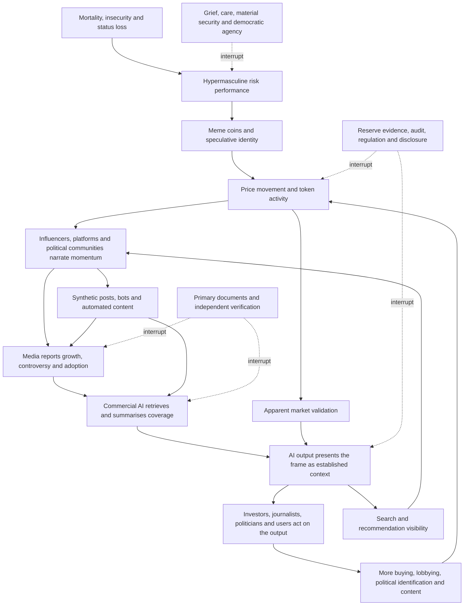

# 🪙 Crypto And Stablecoin Lobbying  
**First created:** 2026-07-16 | **Last updated:** 2026-07-16  
*Collision-system analysis of how crypto assets, meme coins, stablecoin reserves, commercial AI, political lobbying, sanctions pressure, market confidence, and digitally mediated identity interact across borders.*

---

## 🛰️ Orientation

Crypto is not one system.

It can be:

- an asset class
- a payment rail
- a settlement layer
- a speculative market
- a lobbying project
- a sanctions concern
- a political identity
- a media product
- a confidence system
- a claim about the future of the state
- a simulator of public momentum
- a container for unresolved cultural anxiety

Stablecoins sit at the centre of several of those functions.

Meme coins sit at another.

Commercial AI now sits across both.

Together, they can produce a self-reinforcing environment in which:

- hype creates price
- price creates headlines
- headlines create AI summaries
- AI summaries create apparent consensus
- apparent consensus creates more buying, lobbying, and political attention

The system can therefore become politically consequential before its actual adoption, liquidity, or institutional capacity is clear.

The useful question is not only:

> Is crypto good or bad?

It is:

> Which financial, cultural, legal, and political obligations are being moved onto new rails, and who carries the risk when hype, identity, and apparent stability meet actual stress?

---

## ✨ Key Features

- Separates crypto as asset, payment infrastructure, political project, identity system, and confidence simulator.
- Treats stablecoins as claims on reserves rather than self-proving stability.
- Treats meme coins as possible membership tokens, scoreboards, and simulations of movement scale.
- Maps the feedback loop between political hype, token activity, media, and commercial AI.
- Connects the 2020 meme-coin boom to mortality, vulnerability, status loss, and digitally hypermasculine risk performance.
- Uses Barbenheimer as a cultural warning that technological apocalypse and commodified identity were being processed in parallel rather than integrated.
- Explains how lobbying converts market interest into regulatory and political infrastructure.
- Maps collision points with far-right finance, AI, sanctions, media, and civil liability.
- Distinguishes market capitalisation from liquid or redeemable value.
- Identifies reserve, redemption, jurisdiction, governance, and confidence risks.
- Provides evidence guardrails for wallet analysis, reserve claims, media amplification, and lobbying influence.

---

## 🧿 Core Proposition

Crypto and stablecoin lobbying become politically significant when the financial system, political system, cultural system, and confidence system begin depending on the same claims.

Those claims may include:

- the reserves are sound
- redemption will work
- banks will continue serving the issuer
- regulators will permit the model
- adoption will continue
- political support will protect access
- price proves demand
- visibility proves legitimacy
- commercial AI confirms consensus
- future scale justifies present risk

The system becomes fragile when:

- market confidence
- political access
- reserve confidence
- banking access
- cultural identity
- cross-border usability
- regulatory tolerance
- commercial AI narration

all begin propping one another up.

A policy endorsement may increase market confidence.

Higher market confidence may fund more lobbying.

More lobbying may produce favourable regulation.

Favourable regulation may be presented as proof that the asset was safe all along.

A political community may adopt a coin.

The coin price may then be presented as evidence that the community is growing.

Media may report the apparent growth.

Commercial AI may summarise the reporting as established context.

The loop can therefore manufacture apparent corroboration without producing equivalent new evidence.

---

## 🧱 Material Substrate

The material system may include:

- exchanges
- custodians
- reserve assets
- banks
- payment processors
- blockchains
- validators
- miners
- stablecoin issuers
- wallet providers
- liquidity providers
- market makers
- brokers
- audit firms
- law firms
- cloud providers
- compliance vendors
- political-action organisations
- trade associations
- social platforms
- influencer networks
- commercial AI systems
- data centres
- media organisations

The material question is:

> What must physically, legally, computationally, and financially keep working for the promise to remain usable?

---

## 🌦️ Confidence Substrate

The confidence layer may include:

- token price
- stablecoin peg
- adoption narratives
- founder prestige
- exchange reputation
- institutional-investor interest
- political endorsement
- “the old system is dying”
- fear of missing out
- belief in unstoppable technological change
- belief that regulators will eventually accommodate
- belief that reserves are available because nobody has yet failed to redeem
- belief that price movement measures public support
- belief that commercial AI reflects neutral consensus

Confidence is not irrelevant.

Stablecoins depend on confidence in redeemability.

Crypto markets depend on expectations about future adoption, liquidity, and access.

Political movements depend on visible signals that they are growing.

Commercial AI products depend on appearing current, authoritative, and useful.

But confidence is not the same as reserve quality, political legitimacy, independent corroboration, or legal enforceability.

---

# 🎰 Coin As A Momentum Simulator

Some coins are not merely assets being hyped.

They are instruments for simulating momentum.

A coin can function as:

- speculative asset
- community membership token
- fundraising mechanism
- political merchandise
- loyalty test
- attention generator
- public scoreboard
- apparent measure of collective confidence

The coin gives the hype a number.

Price movement can then be narrated as evidence that:

- the community is growing
- the movement is winning
- outsiders are joining
- conventional finance is being defeated
- the political project has economic substance
- the future has already begun

But the price may be produced by:

- concentrated ownership
- thin liquidity
- coordinated buying
- insider support
- influencer promotion
- wash trading
- platform visibility
- holders refusing to sell
- expectation of later buyers

The number is real.

Its interpretation may be theatrical.

> The coin does not merely reflect confidence.  
> It can be used to stage confidence.

---

## 📈 Hype Producing Apparent Capacity

The loop may work like this:

1. A political or cultural community launches or adopts a coin.
2. Influencers present buying as participation.
3. Community members buy to demonstrate loyalty.
4. Price rises because supply is thin or ownership concentrated.
5. The rise attracts media coverage.
6. Coverage attracts speculative buyers.
7. New buyers are described as political converts.
8. The larger apparent community attracts donors, platforms, and policy attention.
9. Political attention further increases the coin’s visibility.

The coin becomes a simulator of movement scale.

It can blur:

- investor
- supporter
- gambler
- audience member
- donor
- political participant

A buyer may only want a short-term return.

The political project may count the purchase as allegiance.

---

## 🪞 Simulated Adoption

Crypto projects frequently make adoption difficult to measure cleanly.

Possible proxies include:

- wallet numbers
- transaction volume
- market capitalisation
- social-media mentions
- exchange listings
- holders
- price
- celebrity endorsements
- merchant announcements

Each can overstate actual use.

### Wallet count is not user count

One actor can control many wallets.

### Transaction volume is not economic activity

Transfers may be:

- internal
- circular
- automated
- exchange-related
- promotional
- wash trading

### Market capitalisation is not available wealth

The last traded price may be applied to the entire token supply even though selling a large share of that supply could collapse the price.

### Holding is not use

A token may be retained speculatively without functioning as money, governance, or settlement infrastructure.

### Political branding is not political conversion

A buyer can speculate on a politically branded token without supporting the associated movement.

The simulation works when those distinctions disappear inside the headline.

---

## 🧑‍🤝‍🧑 Coin As Political Membership

A coin can provide a political community with something conventional movements often struggle to create:

- immediate participation
- visible status
- financial reward
- shared risk
- insider language
- a feeling of historical entry
- a shared enemy in sceptics, regulators, banks, or journalists

Buying becomes ritual.

Holding becomes loyalty.

Selling becomes betrayal.

Criticism threatens both:

- identity
- financial position

The supporter develops an economic incentive to maintain the political narrative.

Their politics protect their portfolio.

Their portfolio reinforces their politics.

---

## 🧠 Belief With A Balance

Ordinary political belief does not display a live price.

Coin-based political identity does.

A holder can open an app and see:

- whether the movement appears to be rising
- whether enemies are “losing”
- whether loyalty seems rewarded
- whether collective belief appears materially real

This produces a feedback mechanism:

> belief → purchase → price signal → stronger belief

The price becomes emotionally persuasive even where it is economically fragile.

A community may experience market volatility as political drama:

- rise as vindication
- decline as attack
- regulation as persecution
- selling as disloyalty
- recovery as proof of destiny

This is confidence weather with a dashboard.

---

# ☠️ Meme Coins And The Mortality Crisis

The 2020 meme-coin environment should also be understood as a response to mortality.

The pandemic confronted people with:

- mass death
- bodily vulnerability
- confinement
- disrupted work
- economic precarity
- institutional failure
- uncertainty
- inability to protect family
- loss of ordinary status performance

For many people inside digitally hypermasculine cultures, this was difficult to metabolise directly.

The available script did not easily permit:

- fear
- grief
- dependence
- bodily fragility
- helplessness
- collective care
- uncertainty

The alternative was control through risk.

The emotional proposition became:

> I cannot control death, public institutions, employment, or the physical world.  
> But I can place a bet.

---

## 🎰 Risk As A Performance Of Vitality

Speculation offered a way to perform:

- courage
- instinct
- aggression
- intelligence
- immunity to fear
- contempt for caution
- financial virility
- membership in a victorious in-group

The holder could say:

- I bought before everyone else
- I held while cowards sold
- I saw the future
- I am not afraid of volatility
- conventional experts do not understand
- loss proves only that greater conviction is required

The risk itself became evidence of masculinity.

The willingness to lose could be narrated as strength.

The possibility of sudden wealth could be narrated as escape from bodily, economic, and political powerlessness.

---

## 🐕 The Comic Object

Meme coins were especially useful because the object did not need to be solemn.

A dog.

A frog.

A joke.

A misspelling.

An absurd mascot.

The comic surface:

- reduced the embarrassment of sincere belief
- allowed financial desire to hide inside irony
- created plausible deniability
- converted anxiety into play
- protected the participant from admitting how badly they needed the bet to work

If the coin rose:

> We are geniuses.

If it fell:

> It was only a joke.

Irony functioned as emotional insurance even where there was no financial insurance.

---

## 🦍 Hold The Line

Meme-asset language often turned holding into a test of character.

The community rewarded:

- diamond hands
- refusal to sell
- contempt for fear
- resistance to expert advice
- loyalty under pressure
- mockery of cautious participants

Selling could be framed as:

- weakness
- betrayal
- cowardice
- feminisation
- submission to elites
- failure to understand the historic moment

The market position became a moral and gendered position.

A financial decision could no longer be reconsidered without threatening:

- identity
- masculine status
- group belonging
- belief in personal exceptionalism

The holder was not only protecting an asset.

They were protecting the claim that fear had been conquered.

---

## ⚰️ Death Denial Through Market Immortality

Meme-coin culture offered a fantasy of escaping ordinary human limits.

The promise was not only wealth.

It was:

- permanent relevance
- instant transformation
- escape from wage labour
- escape from institutions
- escape from ageing
- escape from dependence
- escape from ordinary time

The body remained vulnerable.

The portfolio appeared capable of exponential growth.

> Number go up became a defence against time moving forward.

This does not mean every holder was consciously responding to mortality anxiety.

It means the culture offered a socially available way to convert:

- fear into risk
- grief into humour
- confinement into online action
- helplessness into prediction
- mortality into speculative transcendence

---

## 🧬 Hypermasculinity Without The Physical World

Traditional masculine status systems had been disrupted.

People could not easily demonstrate themselves through:

- work
- physical presence
- travel
- sport
- nightlife
- sexual competition
- visible leadership
- material provision
- protection

Digital speculation supplied substitute tests.

The new arena rewarded:

- speed
- aggression
- endurance
- certainty
- appetite for risk
- dominance over weaker traders
- immunity to ridicule
- resistance to institutional authority

The screen became the arena.

The wallet became the body.

The price became the contest result.

---

## 📣 From Market Identity To Political Identity

The emotional structure transferred easily into alt-right and authoritarian politics.

Both systems could say:

- experts are lying
- institutions are weak
- caution is cowardice
- outsiders want you to fail
- loyalty will be rewarded
- betrayal causes collapse
- only the strong can tolerate volatility
- present suffering proves future victory
- the crowd does not yet understand what we understand

The political movement and the meme coin shared a confidence script:

> Hold despite the evidence.  
> Doubt is weakness.  
> Loss is temporary.  
> Victory will prove that we were superior all along.

A person trained to defend a speculative position as identity may become more receptive to defending a political vehicle in the same way.

---

# 🎀☢️ Barbenheimer And The Cultural Failure To Integrate

The summer of *Barbie* and *Oppenheimer* was a warning that the culture was processing the same crisis through two disjointed symbolic systems.

The films appeared radically different.

One was:

- pink
- comic
- commercial
- feminised
- built around a consumer object

The other was:

- severe
- historical
- masculine
- scientific
- built around weapons of mass destruction

But both concerned systems that exceeded their creators’ ability to control the consequences.

### *Oppenheimer* asked:

- what happens when elite intellect becomes state machinery?
- what happens when technical achievement outruns moral capacity?
- what happens when exceptional men mistake access to power for mastery?
- what happens when the machine works?

### *Barbie* asked:

- what happens when a commercial fantasy becomes aware of the world it was built to mediate?
- what happens when identity is designed as a product?
- what happens when perfection can no longer conceal mortality, hierarchy, labour, and gender?
- what happens when the brand encounters a person?

Both films dealt with:

- manufactured worlds
- elite authorship
- systems escaping control
- identity under institutional pressure
- mortality
- the gap between design and consequence
- creators discovering that their creations are politically real

The culture packaged this as a double feature.

> Pink dress.  
> Nuclear death.  
> Buy two tickets.

The joke worked because the contrast was absurd.

The warning was that the contrast was not actually coherent.

---

## 🧩 Parallel Crisis Languages

The two films represented different cultural languages for the same historical pressure.

### Masculine crisis language

- genius
- war
- technological supremacy
- state secrecy
- command
- historic destiny
- guilt after irreversible action

### Feminised crisis language

- body
- consumer identity
- beauty
- social performance
- commodification
- relational harm
- mortality entering the fantasy

The masculine system said:

> We built something too powerful.

The feminised system said:

> We were built as something unreal.

Both described the collapse of control.

But public culture often treated them as separate aesthetic moods rather than connected political diagnostics.

---

## ☢️ The Oppenheimer Side Of The Confidence System

*Oppenheimer* belongs inside the Manifestation Molehill because it depicts:

- technical confidence becoming state confidence
- secrecy becoming institutional authority
- scientific prestige becoming political access
- future threat being used as collateral for present escalation
- men assuming proximity to power will preserve influence
- creators discovering the state can discard them after extracting their usefulness

The machine is built through:

- expertise
- hierarchy
- urgency
- national-security framing
- elite trust
- compartmentalisation
- fear of being left behind

The promise is:

> We must build it because someone else might.

That is the same competitiveness loop used in:

- AI
- crypto
- defence technology
- surveillance
- platform infrastructure

---

## 🎀 The Barbie Side Of The Confidence System

*Barbie* belongs in the same analysis because it depicts a commercial confidence system.

The brand promises:

- identity
- aspiration
- possibility
- beauty
- empowerment
- emotional safety
- a coherent world

But the product also carries:

- gender hierarchy
- consumer discipline
- bodily anxiety
- fantasy
- nostalgia
- corporate ownership

The crisis begins when the product asks whether the story told about it matches the world it produces.

That is a Molehill question:

> What happens when the confidence narrative encounters the paperwork of lived reality?

The fantasy remains powerful.

It is not stable.

---

## 🤖🪙 The Missing Bridge To AI And Meme Finance

Commercial AI and meme finance were already combining both crisis languages.

They offered:

### Oppenheimer promises

- exceptional men
- world-changing technology
- historic urgency
- national competition
- technical inevitability
- dangerous power justified by rivals

### Barbie promises

- identity through product
- community through consumption
- self-expression through branded participation
- fantasy as relief from bodily vulnerability
- ironic distance from sincere dependence on the product

The meme coin is both:

- the weaponised market experiment
- the funny consumer object

Commercial AI is both:

- the civilisation-changing machine
- the friendly branded assistant

The contradiction is not resolved.

It is merchandised.

---

## 🛍️ Catastrophe As A Lifestyle Bundle

Barbenheimer demonstrated a cultural capacity to convert:

- nuclear terror
- gender crisis
- mortality
- institutional failure
- commercial manipulation
- technological power

into a coordinated lifestyle event.

Humour and play may help people approach frightening subjects.

The concern is that consumption can substitute for integration.

The audience is offered:

- a costume
- a meme
- a ticket
- a themed drink
- a social-media identity
- a way to participate aesthetically

The cultural system says:

> You have processed the contradiction because you successfully enjoyed both products.

But recognition is not integration.

Consumption is not resolution.

---

# 🤖 Commercial AI As A Confidence Simulator

Commercial AI does not sit outside the crypto–political confidence system.

It is trained on, retrieves from, summarises, ranks, and reproduces material generated by:

- financial media
- company announcements
- investor commentary
- political messaging
- platform trends
- lobbying organisations
- sponsored research
- crypto communities
- synthetic content
- other AI-generated summaries

This creates a self-iteration problem.

A commercial claim enters the information environment.

Platforms amplify it.

Journalists and commentators report the amplification.

AI systems ingest or retrieve that reporting.

The AI then returns the claim in cleaner, more authoritative language.

That output becomes:

- a search answer
- a briefing
- an investor summary
- a social-media post
- a newsroom research input
- a policy note
- more training or retrieval material

The claim has passed through several systems without necessarily acquiring independent evidence.

It may nevertheless appear increasingly corroborated.

> Commercial AI can turn repetition into the appearance of consensus.

---

## 🔁 The Self-Iteration Feed

The loop does not require every participant to coordinate.

Each actor may simply respond to signals produced by the others.

The result can still be self-reinforcing.

---

## 🪞 Synthetic Corroboration

Synthetic corroboration occurs when several apparently separate sources derive from the same underlying claim.

For example:

1. A company announces adoption.
2. Influencers repeat the announcement.
3. Media report that the project is attracting attention.
4. AI search summarises the media coverage.
5. Investors cite the AI summary as evidence of market interest.
6. Further coverage reports growing investor confidence.
7. AI systems retrieve the newer coverage.

The number of references increases.

The amount of independent evidence may not.

This is especially dangerous where commercial AI systems:

- suppress source lineage
- merge primary and secondary reporting
- flatten allegations into facts
- mistake repetition for corroboration
- present promotional language as neutral description
- struggle to distinguish announced adoption from actual use
- retrieve other synthetic material
- answer before evidence has stabilised

> Ten summaries of one press release do not create ten sources.

---

## 📈 AI, Coin And Political Hype

The political movement supplies:

- identity
- grievance
- enemies
- urgency
- audiences
- claims of historical change

The coin supplies:

- a price
- a scoreboard
- a membership ritual
- apparent market validation
- financial incentives to repeat the story

Commercial AI supplies:

- scalable explanation
- synthetic authority
- searchable normalisation
- automated content
- investor and policy summaries
- the appearance of ambient consensus

The cycle becomes:

> political hype → coin activity → media attention → AI summary → apparent validation → more political and market hype

None of the signals is entirely unreal.

People may really buy.

Prices may really move.

Media may really cover them.

AI systems may accurately report that coverage.

The distortion occurs when circulation is mistaken for independent confirmation.

---

## 🧠 Belief With A Balance And A Spokesperson

The coin gives the holder a live balance.

Commercial AI gives the system an always-available spokesperson.

A user can ask:

- Is adoption growing?
- Is this movement becoming mainstream?
- Is this asset politically important?
- Are institutions taking it seriously?
- Is regulation moving in its favour?

The answer may be built from an environment that the movement itself helped produce.

The system can therefore appear to answer questions about its own success through outputs partly generated by its own publicity.

This is not necessarily deliberate deception by the model.

It is a provenance problem.

The AI may be accurately summarising a recursively manufactured information environment.

---

## 💼 Commercial Incentives

Commercial AI providers are also under market pressure.

They are rewarded for:

- answering quickly
- appearing comprehensive
- retaining users
- producing confident summaries
- integrating current information
- serving enterprise clients
- demonstrating adoption
- avoiding visible uncertainty
- expanding into search, media, finance, and government

Those incentives can conflict with:

- evidential restraint
- source tracing
- temporal hygiene
- jurisdictional precision
- acknowledgement that the answer is not yet known

An AI product may reproduce hype not because it supports the ideology or asset, but because confident synthesis is commercially rewarded.

The model is not outside the confidence system.

The company selling the model is also making claims about:

- scale
- capability
- adoption
- future profitability
- institutional inevitability

Commercial AI can simultaneously analyse a manifestation molehill and be one.

---

## 🌀 Model Output As Market Input

AI output can become a new market or political input when used by:

- traders
- automated agents
- journalists
- political staff
- lobbyists
- investors
- regulators
- campaigners
- search engines
- recommendation systems

This creates the possibility that:

1. market activity shapes online information
2. AI interprets the information
3. actors trade or communicate using the interpretation
4. the resulting activity changes the information environment
5. AI interprets the changed environment again

The model is no longer merely describing the weather.

Its output is entering the weather.

---

## 🧯 Iteration Accelerators

The loop becomes stronger where there is:

- high synthetic-content volume
- poor source attribution
- real-time AI search
- automated trading
- thin token liquidity
- concentrated ownership
- coordinated influencer promotion
- political identity attached to holding
- media dependence on platform trends
- commercial pressure to publish quickly
- AI systems retrieving other AI-generated material

These conditions allow a small original claim to generate a much larger field of apparent evidence.

---

## 🛡️ Loop Interruptions

The self-iteration feed can be slowed by:

- primary-document priority
- source-lineage display
- disclosure of sponsored material
- wallet-concentration analysis
- clear separation of price, use, and political support
- labelling synthetic content
- temporal hygiene
- independent audits
- reserve and redemption evidence
- comparison of announcement with implementation
- AI answers that state where apparent corroboration shares one source
- newsroom refusal to treat AI synthesis as independent evidence

The interruption rule is:

> Follow the claim backward until the references stop multiplying and the evidence begins.

---

# 🪙 Stablecoins As Claims

A stablecoin is best analysed as a claim.

The holder relies on several propositions:

- the issuer holds sufficient reserves
- the reserves are high quality
- the reserves are not already encumbered
- the issuer can convert reserves into cash
- redemption is available when needed
- banking access will remain open
- the issuer is subject to usable legal obligations
- operational systems will continue functioning
- sanctions or regulation will not suddenly block access

The peg is not magic.

It is a public expression of confidence in the whole supporting structure.

---

## 🧾 Reserve Questions

For any stablecoin, ask:

- What backs it?
- Cash?
- Government securities?
- Commercial paper?
- Loans?
- Crypto assets?
- Other tokens?
- Related-party instruments?
- Where are the reserves held?
- Who legally owns them?
- Are they segregated?
- Are they pledged?
- Are they liquid?
- Who can redeem?
- At what price?
- Under which conditions?
- Which jurisdiction governs the claim?
- Who verifies the reserve statement?
- Is the disclosure an audit, attestation, snapshot, or management assertion?

Reserve opacity is political because public and institutional confidence may be built on claims ordinary users cannot independently verify.

---

## 🔄 Redemption Risk

Stability ultimately depends on redemption.

Key questions include:

- Can holders redeem directly?
- Is redemption limited to institutions?
- Are there minimum amounts?
- Are there fees?
- Are there delays?
- Can redemption be suspended?
- What happens during a banking crisis?
- What happens if reserve assets fall in value?
- What happens if multiple counterparties fail?
- What happens if sanctions freeze part of the structure?
- Who receives cash first?

A stable price in secondary trading is not identical to direct redemption capacity.

A peg can hold because:

- reserves are sound
- market makers defend it
- counterparties expect recovery
- redemptions remain limited
- confidence suppresses the run

These are different conditions.

---

## 🏦 Banking Dependence

Crypto narratives often present the system as independent of banks.

In practice, much of the ecosystem depends on:

- reserve accounts
- settlement banks
- payment processors
- card networks
- fiat on-ramps
- custodians
- correspondent banking
- treasury services

The anti-bank narrative may coexist with deep banking dependence.

If banks:

- withdraw service
- increase due diligence
- freeze accounts
- limit transfers
- change collateral rules
- refuse particular jurisdictions

the crypto system may lose access to the ordinary money it claims to transcend.

---

## 🏛️ Lobbying As Infrastructure

Crypto lobbying is not only persuasion.

It can build:

- legal legitimacy
- policy access
- industry definitions
- favourable reporting duties
- regulatory exemptions
- political alliances
- public-sector adoption
- national-security framing
- media normalisation
- specialist expertise inside government

Lobbying routes may include:

- direct donations
- political-action networks
- trade associations
- sponsored research
- think tanks
- advisory appointments
- conference access
- public-relations campaigns
- legal challenges
- industry secondments
- claims of strategic necessity

The political goal may be to move the question from:

> Should this system exist?

to:

> How quickly can the state accommodate it?

---

## 🏁 National Competitiveness Narratives

Crypto, stablecoin, and commercial-AI lobbying often use competitiveness claims.

The argument may say:

- another country will lead
- capital will leave
- innovation will move abroad
- regulation will weaken national security
- stablecoins will reinforce currency power
- AI leadership requires urgency
- the state must adopt before rivals do

These claims may contain real strategic questions.

They can also compress debate.

The effect is to turn caution into:

- backwardness
- national decline
- hostility to innovation
- surrender to rivals

A competitiveness claim should be tested against:

- actual adoption
- revenue
- reserve quality
- public benefit
- regulatory cost
- concentration risk
- security exposure
- material capacity

---

## 💰 Collision With Far-Right Political Finance

Crypto and far-right political finance can overlap through:

- anti-state rhetoric
- deregulation
- donor networks
- platform culture
- alternative financial rails
- sovereignty narratives
- hostility to central banks
- political fundraising
- sanctions scepticism
- technology libertarianism
- digitally hypermasculine risk culture

The overlap should not be overstated.

Not every crypto advocate is far right.

Not every far-right donor uses crypto.

The question is:

> Where do money, personnel, policy, media, identity, and infrastructure actually cross?

Possible routes include:

- political donations
- shared investors
- lobbying coalitions
- media sponsorship
- adviser networks
- payment services
- campaign fundraising
- policy promises
- coin-based political identity

See [`💰_far_right_political_finance.md`](./💰_far_right_political_finance.md) for the staged financing model.

---

## 🤖 Collision With AI Market Confidence

Crypto and AI often share:

- speculative capital
- founder prestige
- “future economy” narratives
- rapid valuation cycles
- policy urgency
- national-competitiveness language
- infrastructure investment
- data-centre and energy interests
- belief that current losses will become future dominance
- commercial pressure to treat repetition as adoption

Possible collision routes include:

- tokenised AI projects
- compute payments
- shared venture capital
- cross-subsidised investment
- overlapping lobbying networks
- automated trading
- synthetic media
- shared political donors
- AI-generated market summaries

The two systems can reinforce one another’s confidence.

They can also transmit stress.

A collapse in one speculative sector may change risk appetite in the other.

---

## ⚔️ Collision With War And Sanctions

Crypto and stablecoins become geopolitically important when they interact with:

- sanctions
- asset freezes
- capital controls
- cross-border settlement
- remittances
- exchange restrictions
- state-backed digital currencies
- black-market finance
- humanitarian access

Possible workaround routes include:

- peer-to-peer transfers
- offshore exchanges
- mixers
- stablecoins
- informal brokers
- wallet chains
- third-country intermediaries

Evidence discipline matters.

A token transfer is not automatically sanctions evasion.

Wallet attribution is not always beneficial-ownership proof.

Use of crypto in a sanctioned jurisdiction is not automatically unlawful.

The route, actor, purpose, and legal category must be established.

See [`⚔️_war_sanctions_and_workarounds.md`](./⚔️_war_sanctions_and_workarounds.md) for the wider sanctions system.

---

## 📺 Collision With Media And Platforms

Crypto is deeply dependent on attention.

Media and platforms affect:

- token visibility
- fundraising
- exchange growth
- founder prestige
- political legitimacy
- perceived adoption
- retail participation

The system can become circular:

1. price movement attracts coverage
2. coverage attracts buyers
3. buying moves price
4. price movement justifies more coverage
5. commercial AI summarises the coverage
6. the summary becomes further evidence of importance

This does not mean every price rise is media-created.

It means attention can become part of the asset’s supporting infrastructure.

Influencer promotion, platform algorithms, and sponsored content should be treated as financial infrastructure, not merely commentary.

---

## 🧾 Collision With Donor Provenance And Civil Liability

Crypto assets can complicate:

- beneficial ownership
- source of funds
- tracing
- valuation
- collectability
- disclosure
- jurisdiction
- sanctions review
- civil enforcement

Key questions include:

- Who controls the wallet?
- Who supplied the funds?
- Can the assets be reached?
- Are keys available?
- Is the value liquid?
- Which court has authority?
- Are assets mixed with third-party property?
- Has the value changed?
- Is the asset held through an exchange or private wallet?

Crypto can look highly liquid while remaining difficult to collect.

It can also look opaque while leaving a detailed public transaction trail.

Both facts matter.

---

## 🌡️ Confidence Weather

Crypto confidence may shift through:

- depegging
- exchange failure
- regulatory language
- banking withdrawal
- reserve disclosures
- political endorsements
- major lawsuits
- large redemptions
- platform restrictions
- visible institutional adoption
- public hacks or insolvency
- commercial-AI summaries
- meme-driven political events

The loud signal may be price.

The quieter signal may be:

- redemption delays
- reserve composition changes
- bank relationship changes
- higher compliance friction
- reduced market-maker support
- more cautious institutional language
- lower willingness to repeat the inevitability claim

Watch behaviour, not only charts.

---

## 🕰️ Relevant Clocks

Track:

- token issuance
- reserve snapshot
- attestation date
- audit date
- redemption event
- bank relationship change
- regulatory consultation
- legislation
- enforcement
- political donation
- lobbying disclosure
- sanctions designation
- market crash
- depeg
- recovery
- insolvency
- court action
- media amplification
- AI-summary publication
- political adoption
- meme-cycle recognition

Publication date is not reserve date.

A stable price after a disclosure does not prove the disclosure was sufficient.

A regulatory proposal is not enacted law.

An AI summary is not a new source.

---

## 🔗 Transmission Routes

Stress may move through:

- reserves
- redemption
- banking access
- market makers
- political donations
- lobbying
- sanctions
- payment rails
- exchange exposure
- media confidence
- shared investors
- legal judgments
- platform access
- commercial AI
- political identity
- meme culture

Use the sequence:

1. originating stress
2. carrier
3. transmission route
4. receiving system
5. amplifier or buffer
6. observable consequence
7. final cost bearer

---

## 🧯 Amplifiers

- opaque reserves
- low liquidity
- concentrated holders
- weak governance
- related-party exposure
- dependence on one bank
- dependence on one exchange
- cross-border legal uncertainty
- political protection
- high leverage
- algorithmic hype
- retail concentration
- sanctions exposure
- synthetic corroboration
- identity-based holding
- commercial pressure for confident AI output
- media treatment of circulation as evidence

## 🛡️ Buffers

- high-quality liquid reserves
- transparent ownership
- segregated assets
- independent audit
- clear redemption rights
- diversified banking
- conservative leverage
- robust compliance
- accountable governance
- strong consumer protection
- clear insolvency rules
- institutional redundancy
- primary-source tracing
- source-lineage disclosure
- cultural permission to admit uncertainty and fear
- separation of market activity from political support

---

## 🛠️ Diagnostic Tools

### Asset

- What is being bought or held?
- Is it a speculative asset, payment claim, governance token, meme coin, or stablecoin?

### Simulation

- What is the coin supposedly measuring?
- Does price reflect broad demand or concentrated support?
- Are buyers being counted as users, supporters, or political converts?
- Is activity organic, coordinated, automated, or circular?
- Does the coin finance the community, simulate its popularity, or both?

### Reserve

- What backs it?
- Where is the backing held?
- Who verifies it?
- Is it liquid and unencumbered?

### Redemption

- Who can redeem?
- Under what conditions?
- What happens during stress?

### Jurisdiction

- Which law governs the issuer, reserve, user, and transaction?
- Are those the same jurisdiction?

### Lobbying

- Who funds the policy campaign?
- Which trade associations, think tanks, or political groups are involved?
- What access followed?

### AI

- Is the output based on primary evidence or recursive summaries?
- Does the system expose source lineage?
- Is apparent consensus actually repetition?
- Can model output change the market it is describing?

### Culture

- What fear or status need is the product converting into risk?
- Is holding functioning as identity?
- Is humour providing plausible deniability?
- Is caution being coded as weakness?

### Transmission

- Which systems receive the stress?
- Banking?
- Politics?
- AI?
- sanctions?
- media?
- public finance?

### Cost

- Who carries depeg, insolvency, manipulation, or compliance failure?
- Retail users?
- Taxpayers?
- Exchanges?
- Public institutions?
- Remittance users?
- Late entrants?
- People whose political identity is tied to the asset?

---

## ⚖️ Evidence Discipline

Preserve the distinctions:

- wallet movement is not beneficial ownership
- token transfer is not automatically sanctions evasion
- market capitalisation is not liquid value
- attestation is not necessarily a full audit
- price stability is not proof of reserve quality
- political contact is not policy capture
- public endorsement is not regulatory approval
- pilot use is not mass adoption
- wallet count is not user count
- holding is not political support
- AI output is not independent corroboration
- circulation is not consensus
- irony does not eliminate material consequence
- cultural interpretation is not proof of individual motive
- blockchain transparency does not eliminate identity uncertainty
- opacity does not automatically establish criminality

Use categories such as:

- documented transaction
- verified reserve disclosure
- attestation
- audit
- reported lobbying
- political claim
- market signal
- cultural signal
- media amplification
- AI-generated synthesis
- legal process
- analytical inference
- unresolved question

The self-iteration loop may contain real facts.

The problem is that it can make their evidential weight difficult to judge.

---

## 🧪 What Would Disconfirm The Concern?

Evidence of a more resilient system may include:

- high-quality liquid reserves
- direct and reliable redemption
- independent audit
- transparent ownership
- diversified banking
- limited leverage
- clear insolvency treatment
- effective sanctions compliance
- low related-party exposure
- durable non-speculative usage
- consumer protection
- political independence
- stable operation through market stress
- broad rather than concentrated ownership
- adoption measures that survive independent verification
- AI systems that expose source lineage
- price movement that does not depend on identity policing
- clear separation between political participation and speculative trading

A crypto or stablecoin system may be useful, lawful, and resilient.

A meme coin may remain a joke without becoming political infrastructure.

A commercial AI system may accurately summarise market developments without materially amplifying them.

The model should not force every project into fraud, manipulation, or authoritarian politics.

It should test whether the promise, reserve, culture, law, and actual capacity match.

---

## ✨ Working Rules

> The coin gives the hype a number.

> Commercial AI gives the hype a voice that sounds like consensus.

> A price can simulate a public.

> Market capitalisation is not liquid value.

> The peg is not the reserve.

> Belief becomes harder to correct when it has a live balance.

> Risk became a performance of vitality.

> The wallet became the body.  
> The price became the contest result.

> Number go up became a defence against time moving forward.

> The contradiction was not resolved.  
> It was merchandised.

> Ten summaries of one press release do not create ten sources.

> The AI is not only reading the confidence weather.  
> Its output can enter the weather.

> Follow the claim backward until the references stop multiplying and the evidence begins.

> A payment rail becomes political infrastructure when policy, access, and state power begin depending on who can use it and who can be excluded.

---

## 🌌 Constellations

🪙 ☠️ 🎰 🤖 🎀 ☢️ 🏦 🏛️ ⚔️ — meme coins; mortality; simulated momentum; commercial AI; commodified identity; technological apocalypse; banking dependence; lobbying; sanctions.

---

## ✨ Stardust

crypto, stablecoins, meme coins, mortality, hypermasculinity, commercial ai, barbenheimer, reserves, redemption, lobbying, sanctions, political finance, confidence simulation, self-iteration, payment rails

---

## 🏮 Footer

*Crypto And Stablecoin Lobbying* is a living node of the **Polaris Protocol**.  
It maps how crypto assets, meme coins, stablecoin reserves, commercial AI, political lobbying, banking access, sanctions pressure, cultural identity, and market confidence interact across jurisdictions.  
Its purpose is to distinguish technological possibility from political inevitability, price movement from public support, synthetic corroboration from independent evidence, and apparent stability from the legal and financial capacity required to carry risk.

> 📡 Cross-references:
>
> - [`README.md`](./README.md) — *Collision Systems cluster route and collision map*
> - [`💰_far_right_political_finance.md`](./💰_far_right_political_finance.md) — *staged political financing, commercial acceleration, and donor repricing*
> - [`🤖_ai_market_confidence.md`](./🤖_ai_market_confidence.md) — *shared speculative capital, commercial AI, and future-capacity narratives*
> - [`⚔️_war_sanctions_and_workarounds.md`](./⚔️_war_sanctions_and_workarounds.md) — *sanctions pressure, alternative settlement, and evasion routes*
> - [`📺_media_ownership_and_platform_power.md`](./📺_media_ownership_and_platform_power.md) — *ownership, amplification, and attention infrastructure*
> - [`🧾_donor_provenance_and_civil_liability.md`](./🧾_donor_provenance_and_civil_liability.md) — *ownership, tracing, collectability, and political exposure*
> - [`💸_can_the_assets_carry_the_risk.md`](./💸_can_the_assets_carry_the_risk.md) — *capacity test for liquidity, encumbrance, jurisdiction, and collectability*
> - [`🌦️_confidence_weather.md`](../🌀_Core_Model/🌦️_confidence_weather.md) — *relational signals, false weather, and repricing*
> - [`🔗_risk_transmission_between_systems.md`](../🌀_Core_Model/🔗_risk_transmission_between_systems.md) — *carriers, routes, consequences, and cost bearers*
> - [`🌐_cross_border_feedback_loops.md`](../🌀_Core_Model/🌐_cross_border_feedback_loops.md) — *international validation and returned adoption claims*
>
> 🏮 Return To:
>
> - [`👹_Collision_Systems`](./) — *current substantive cluster*
> - [`🗻_The_Manifestation_Molehill`](../) — *media-facing pack on fragile confidence systems and democratic coverage under overload*
> - [`👻_Ghosts_Of_Accountability`](../../) — *parent accountability cluster*
> - [`📲_Press_Matters`](../../../) — *press and media-analysis layer*
> - [`🌓_3_In_The_Moment`](../../../../) — *current-events and active-pattern layer*

*Survivor authorship is sovereign. Containment is never neutral.*

_Last updated: 2026-07-16_
